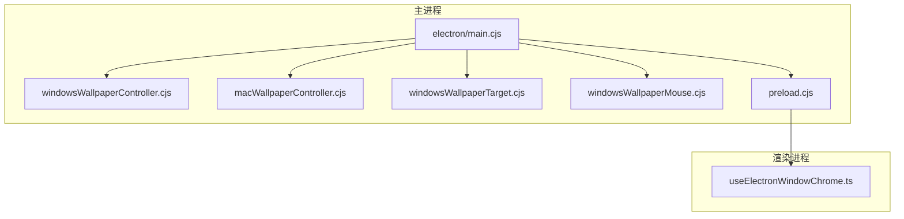
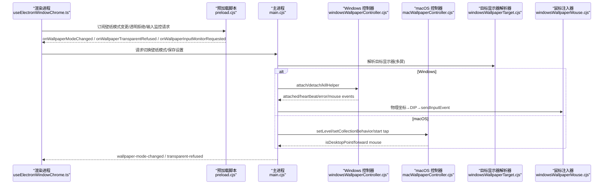
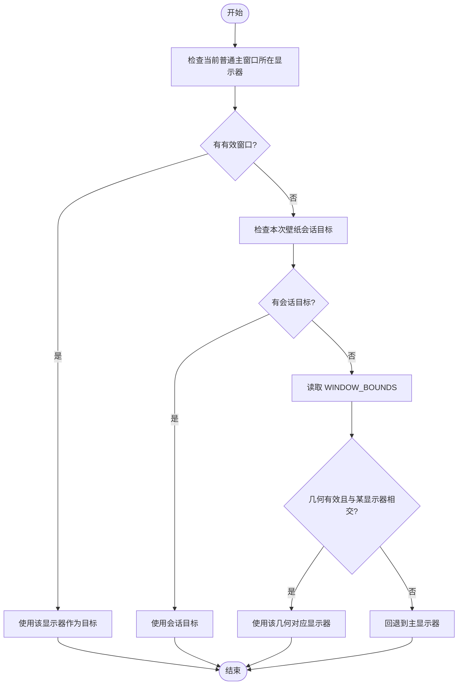
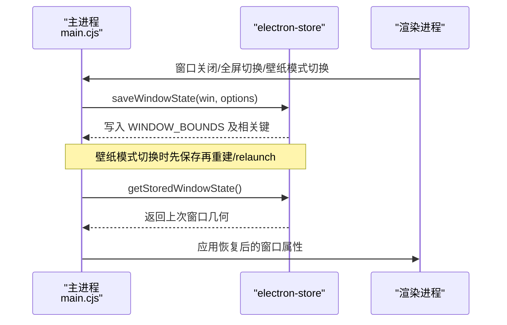
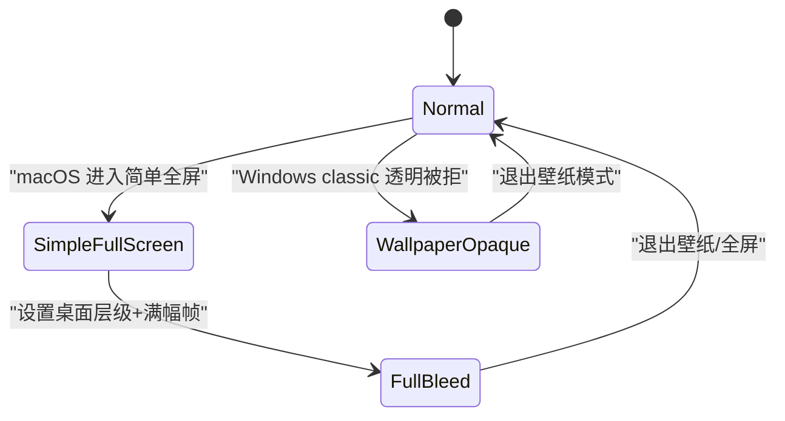
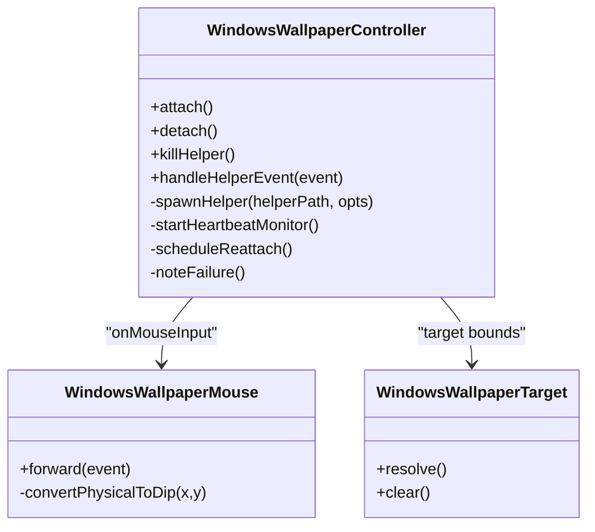
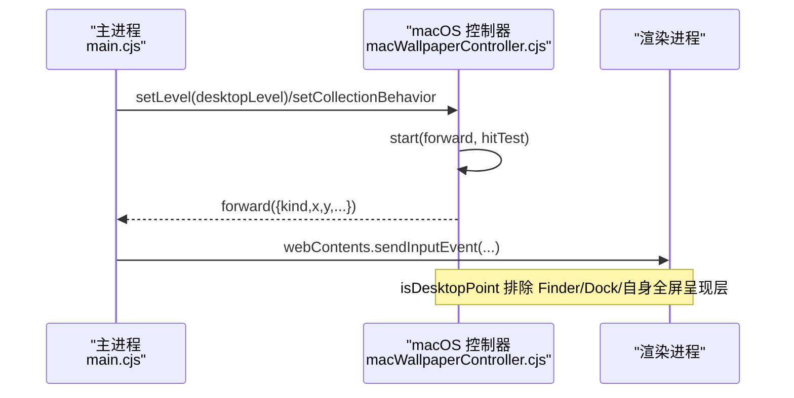
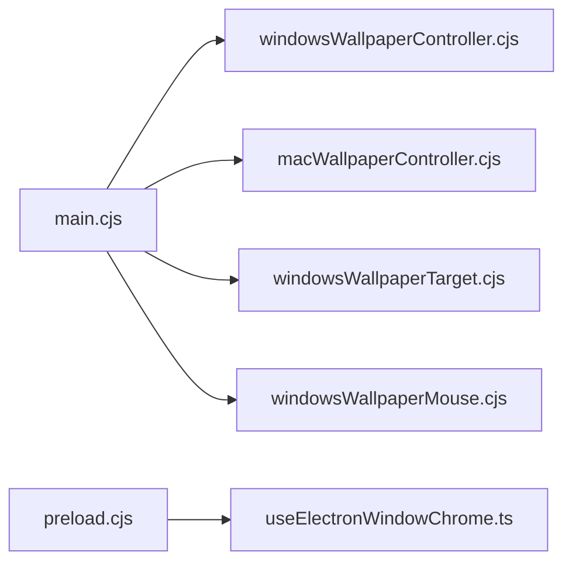

# 窗口管理系统

<cite>
**本文引用的文件**   
- [electron/main.cjs](file://electron/main.cjs)
- [electron/windowsWallpaperController.cjs](file://electron/windowsWallpaperController.cjs)
- [electron/macWallpaperController.cjs](file://electron/macWallpaperController.cjs)
- [electron/windowsWallpaperTarget.cjs](file://electron/windowsWallpaperTarget.cjs)
- [electron/windowsWallpaperMouse.cjs](file://electron/windowsWallpaperMouse.cjs)
- [electron/preload.cjs](file://electron/preload.cjs)
- [src/hooks/useElectronWindowChrome.ts](file://src/hooks/useElectronWindowChrome.ts)
- [docs/wallpaper-mode.md](file://docs/wallpaper-mode.md)
</cite>

## 目录
1. [引言](#引言)
2. [项目结构](#项目结构)
3. [核心组件](#核心组件)
4. [架构总览](#架构总览)
5. [详细组件分析](#详细组件分析)
6. [依赖关系分析](#依赖关系分析)
7. [性能与资源管理](#性能与资源管理)
8. [故障排查指南](#故障排查指南)
9. [结论](#结论)
10. [附录：跨平台差异与兼容性](#附录跨平台差异与兼容性)

## 引言
本技术文档聚焦 Folia Major 的窗口管理系统，围绕多显示器支持、窗口状态持久化、全屏模式、任务栏集成、壁纸模式以及窗口生命周期与资源清理展开。系统基于 Electron 主进程与渲染进程协作，结合各平台原生能力（macOS Dock/CGEventTap、Windows WorkerW/Rust helper、Linux windowtolayer/X11 desktop）实现桌面级壁纸体验与高可用窗口行为。

## 项目结构
与窗口管理直接相关的代码主要分布在以下位置：
- electron 主进程入口与平台桥接：electron/main.cjs
- Windows 壁纸控制器与鼠标注入：electron/windowsWallpaperController.cjs、electron/windowsWallpaperMouse.cjs、electron/windowsWallpaperTarget.cjs
- macOS 壁纸控制器：electron/macWallpaperController.cjs
- 预加载脚本暴露给渲染端的 IPC 能力：electron/preload.cjs
- 渲染端窗口外观与穿透控制钩子：src/hooks/useElectronWindowChrome.ts
- 壁纸模式设计说明：docs/wallpaper-mode.md

图表来源
- [electron/main.cjs:1-800](file://electron/main.cjs#L1-L800)
- [electron/windowsWallpaperController.cjs:1-465](file://electron/windowsWallpaperController.cjs#L1-L465)
- [electron/macWallpaperController.cjs:1-800](file://electron/macWallpaperController.cjs#L1-L800)
- [electron/windowsWallpaperTarget.cjs:1-200](file://electron/windowsWallpaperTarget.cjs#L1-L200)
- [electron/windowsWallpaperMouse.cjs:1-120](file://electron/windowsWallpaperMouse.cjs#L1-L120)
- [electron/preload.cjs:66-90](file://electron/preload.cjs#L66-L90)
- [src/hooks/useElectronWindowChrome.ts:1-129](file://src/hooks/useElectronWindowChrome.ts#L1-L129)

章节来源
- [electron/main.cjs:1-800](file://electron/main.cjs#L1-L800)
- [docs/wallpaper-mode.md:1-176](file://docs/wallpaper-mode.md#L1-L176)

## 核心组件
- 主进程窗口与会话协调器：负责窗口创建、显示目标选择、壁纸模式切换、播放会话交接、状态持久化与恢复。
- Windows 壁纸控制器：管理 Rust helper 进程的生命周期、心跳看门狗、重挂逻辑、失败降级与鼠标事件转发。
- macOS 壁纸控制器：通过 FFI 设置窗口层级、集合行为、Dock 自动隐藏、CGEventTap 监听并转发桌面点击。
- Windows 目标显示器解析器：按“当前主窗口所在屏 → 会话目标 → WINDOW_BOUNDS → 主屏”的顺序确定壁纸铺展显示器。
- Windows 鼠标注入器：将 helper 的物理像素坐标转换为 Chromium DIP 空间后注入渲染端输入管线。
- 预加载脚本：向渲染端暴露壁纸模式变更、透明背景拒绝、输入监控请求等事件通道。
- 渲染端窗口外观钩子：同步透明背景、穿透开关与悬停热点区域，保证壁纸模式下 UI 行为一致。

章节来源
- [electron/main.cjs:187-598](file://electron/main.cjs#L187-L598)
- [electron/windowsWallpaperController.cjs:1-465](file://electron/windowsWallpaperController.cjs#L1-L465)
- [electron/macWallpaperController.cjs:1-800](file://electron/macWallpaperController.cjs#L1-L800)
- [electron/windowsWallpaperTarget.cjs:1-200](file://electron/windowsWallpaperTarget.cjs#L1-L200)
- [electron/windowsWallpaperMouse.cjs:1-120](file://electron/windowsWallpaperMouse.cjs#L1-L120)
- [electron/preload.cjs:66-90](file://electron/preload.cjs#L66-L90)
- [src/hooks/useElectronWindowChrome.ts:1-129](file://src/hooks/useElectronWindowChrome.ts#L1-L129)

## 架构总览
Folia 的窗口管理采用“主进程集中编排 + 平台专用控制器 + 渲染端轻量适配”的分层架构。壁纸模式在不同平台走不同路径，但共享同一组设置键与渲染端门控；窗口几何、全屏与任务栏交互由主进程统一处理，并通过 preload 暴露给渲染端。

图表来源
- [electron/main.cjs:187-598](file://electron/main.cjs#L187-L598)
- [electron/windowsWallpaperController.cjs:1-465](file://electron/windowsWallpaperController.cjs#L1-L465)
- [electron/macWallpaperController.cjs:1-800](file://electron/macWallpaperController.cjs#L1-L800)
- [electron/windowsWallpaperTarget.cjs:1-200](file://electron/windowsWallpaperTarget.cjs#L1-L200)
- [electron/windowsWallpaperMouse.cjs:1-120](file://electron/windowsWallpaperMouse.cjs#L1-L120)
- [electron/preload.cjs:66-90](file://electron/preload.cjs#L66-L90)
- [src/hooks/useElectronWindowChrome.ts:1-129](file://src/hooks/useElectronWindowChrome.ts#L1-L129)

## 详细组件分析

### 多显示器支持与分辨率适配
- 目标显示器判定顺序：优先使用当前普通主窗口所在显示器；若不可用则回退到本次壁纸会话的目标显示器；再回退到上次普通窗口几何（WINDOW_BOUNDS）；最后回退到主显示器。该策略避免最大化窗口导致的几何陈旧问题。
- 分辨率与 DPI：Windows 下 helper 报告物理屏幕像素，主进程通过 screen.screenToDipPoint 转换到 Chromium DIP 空间后再进行窗口相对坐标计算，确保混合缩放多屏场景正确。
- 显示器热插拔与分辨率变化：在 Windows 上注册 display-metrics-changed 并在回调内判断壁纸模式，运行时开启后监听必须保持生效。

图表来源
- [electron/main.cjs:372-385](file://electron/main.cjs#L372-L385)
- [electron/windowsWallpaperTarget.cjs:1-200](file://electron/windowsWallpaperTarget.cjs#L1-L200)

章节来源
- [electron/main.cjs:372-385](file://electron/main.cjs#L372-L385)
- [electron/windowsWallpaperTarget.cjs:1-200](file://electron/windowsWallpaperTarget.cjs#L1-L200)
- [electron/windowsWallpaperMouse.cjs:1-120](file://electron/windowsWallpaperMouse.cjs#L1-L120)

### 窗口状态持久化机制
- 存储键：WINDOW_BOUNDS 用于记忆普通窗口的位置与尺寸；wallpaper_mode 表示壁纸模式开关；Windows 专属键包括 wallpaper_windows_attach_mode、wallpaper_windows_failure_count 等。
- 保存时机：窗口关闭、全屏切换、壁纸模式切换前后均会调用保存逻辑，确保退出后恢复时能回到合理几何。
- 恢复流程：启动时读取 WINDOW_BOUNDS 并校验有效性；壁纸模式进入前可能重建窗口以携带播放会话；退出壁纸模式后恢复原窗口几何与属性。

图表来源
- [electron/main.cjs:2059-2178](file://electron/main.cjs#L2059-L2178)

章节来源
- [electron/main.cjs:2059-2178](file://electron/main.cjs#L2059-L2178)

### 全屏模式实现
- macOS：使用 simple-full-screen 覆盖整屏，避免 workArea 钳制导致菜单栏或 Dock 缝隙泄露；先进入 simple-full-screen 再设置 ambient level 与 frame，随后做有界 settle 校验以确保满幅。
- Windows：壁纸窗口构建为无边框（thickFrame:false），不启用可调整大小；透明背景仅在 raised 桌面架构下可用，classic 桌面强制不透明。
- Linux：X11 使用桌面窗口类型，Wayland 通过 windowtolayer 放入 bottom 层；无合成背景，透明区域显示为黑色。

图表来源
- [electron/main.cjs:688-780](file://electron/main.cjs#L688-L780)
- [electron/main.cjs:478-523](file://electron/main.cjs#L478-L523)
- [docs/wallpaper-mode.md:116-123](file://docs/wallpaper-mode.md#L116-L123)

章节来源
- [electron/main.cjs:688-780](file://electron/main.cjs#L688-L780)
- [electron/main.cjs:478-523](file://electron/main.cjs#L478-L523)
- [docs/wallpaper-mode.md:116-123](file://docs/wallpaper-mode.md#L116-L123)

### 任务栏集成
- 缩略图按钮与进度条：主进程通过媒体会话桥接与播放状态更新驱动任务栏缩略图与进度展示；播放控制命令经 IPC 路由至播放器服务。
- 播放控制：壁纸模式下键盘不可达，控制入口集中在托盘、设置卡片与命令面板；Windows/Linux/macOS 共用统一的壁纸模式命令与设置门控。

章节来源
- [docs/wallpaper-mode.md:28-46](file://docs/wallpaper-mode.md#L28-L46)
- [electron/main.cjs:187-223](file://electron/main.cjs#L187-L223)

### 壁纸模式详解

#### Windows：WorkerW 重定向与鼠标注入
- 架构：主进程 spawn folia-wallpaper-helper.exe，通过 SetParent 将主窗口挂入 WorkerW 层；helper 常驻并汇报 heartbeat、attached、workerw-destroyed、explorer-restarted、moved、detached、error 等 JSONL 事件。
- 目标显示器：SetParent 之前取窗口所在显示器作为目标，并优先匹配覆盖该显示器的 WorkerW；几何重申由 helper 负责，主进程不再对 WorkerW 子窗口 setBounds。
- 鼠标注入：helper 上报物理像素坐标，主进程转 DIP 后通过 sendInputEvent 注入；move/wheel 越界丢弃，mousedown 越界丢弃，mouseup 放行以避免按住态卡死。
- 透明背景：仅 raised 桌面架构支持持续透明；classic 桌面下透明窗口重挂即黑屏，主进程拒绝并通知渲染端 toast。

图表来源
- [electron/windowsWallpaperController.cjs:1-465](file://electron/windowsWallpaperController.cjs#L1-L465)
- [electron/windowsWallpaperMouse.cjs:1-120](file://electron/windowsWallpaperMouse.cjs#L1-L120)
- [electron/windowsWallpaperTarget.cjs:1-200](file://electron/windowsWallpaperTarget.cjs#L1-L200)

章节来源
- [electron/windowsWallpaperController.cjs:1-465](file://electron/windowsWallpaperController.cjs#L1-L465)
- [electron/windowsWallpaperMouse.cjs:1-120](file://electron/windowsWallpaperMouse.cjs#L1-L120)
- [electron/windowsWallpaperTarget.cjs:1-200](file://electron/windowsWallpaperTarget.cjs#L1-L200)
- [docs/wallpaper-mode.md:48-109](file://docs/wallpaper-mode.md#L48-L109)

#### macOS：桌面层集成与 CGEventTap
- 层级与行为：将 BrowserWindow 沉到 Finder 图标层之下、系统壁纸之上；设置集合行为使窗口在所有工作区可见；必要时清除 NSApplication 的 AutoHideDock/AutoHideMenuBar presentation 位。
- 交互：listen-only CGEventTap 捕获桌面点击，isDesktopPoint 过滤非裸桌面点，down/drag/up/scroll 经 sendInputEvent 注入渲染端；move 节流 ~40ms。
- Dock 自动隐藏：底部 Dock 在壁纸会话期间自动隐藏并置 reveal-delay=0；退出或崩溃恢复时还原用户原始设置。

图表来源
- [electron/macWallpaperController.cjs:1-800](file://electron/macWallpaperController.cjs#L1-L800)
- [electron/main.cjs:631-780](file://electron/main.cjs#L631-L780)

章节来源
- [electron/macWallpaperController.cjs:1-800](file://electron/macWallpaperController.cjs#L1-L800)
- [electron/main.cjs:631-780](file://electron/main.cjs#L631-L780)
- [docs/wallpaper-mode.md:124-176](file://docs/wallpaper-mode.md#L124-L176)

#### Linux：windowtolayer 与 X11 桌面窗口
- Wayland：通过 windowtolayer 包装进程将 Electron 窗口放入 wlr-layer-shell bottom 层；父进程存活检测与崩溃循环保护由 watchdog 负责。
- X11：使用 _NET_WM_WINDOW_TYPE_DESKTOP 桌面窗口覆盖主显示器；不参与普通窗口尺寸记忆，透明区域显示为黑色。
- 启动与切换：写入持久化配置后 relaunch，环境标记区分包装进程；二进制缺失时自动回退关闭壁纸模式。

章节来源
- [docs/wallpaper-mode.md:116-123](file://docs/wallpaper-mode.md#L116-L123)
- [electron/main.cjs:243-273](file://electron/main.cjs#L243-L273)

### 窗口生命周期管理与资源清理
- 渲染崩溃原地 reload：窗口几何与桌面层位置随 BrowserWindow 存活，controller/helper/tap 不重启。
- 主动退出优雅清理：before-quit 同步还原系统状态（macOS 停 tap 并 restoreDockSync；Windows detach helper 而非 kill）。
- 连续失败自动降级：启动/挂载失败达阈值后清除 wallpaper_mode 并还原为普通窗口，打断反复崩溃循环；健康运行一段时间后清零失败计数。
- 区分主动退出与外部销毁：isAppQuitting 区分关闭应用与被系统连带销毁，避免误判关机直接退出整个应用。

章节来源
- [docs/wallpaper-mode.md:41-46](file://docs/wallpaper-mode.md#L41-L46)
- [electron/windowsWallpaperController.cjs:147-192](file://electron/windowsWallpaperController.cjs#L147-L192)
- [electron/macWallpaperController.cjs:478-502](file://electron/macWallpaperController.cjs#L478-L502)

## 依赖关系分析
- 主进程耦合：main.cjs 聚合所有平台控制器与工具模块，承担设置读写、IPC 分发、窗口重建与播放会话交接。
- 控制器解耦：Windows/macOS 控制器均为纯逻辑 + 副作用注入结构，便于单元测试与头环境模拟。
- 渲染端低耦合：preload 仅暴露必要事件与 API，useElectronWindowChrome 负责文档级透明与穿透状态同步。

图表来源
- [electron/main.cjs:1-800](file://electron/main.cjs#L1-L800)
- [electron/windowsWallpaperController.cjs:1-465](file://electron/windowsWallpaperController.cjs#L1-L465)
- [electron/macWallpaperController.cjs:1-800](file://electron/macWallpaperController.cjs#L1-L800)
- [electron/windowsWallpaperTarget.cjs:1-200](file://electron/windowsWallpaperTarget.cjs#L1-L200)
- [electron/windowsWallpaperMouse.cjs:1-120](file://electron/windowsWallpaperMouse.cjs#L1-L120)
- [electron/preload.cjs:66-90](file://electron/preload.cjs#L66-L90)
- [src/hooks/useElectronWindowChrome.ts:1-129](file://src/hooks/useElectronWindowChrome.ts#L1-L129)

章节来源
- [electron/main.cjs:1-800](file://electron/main.cjs#L1-L800)
- [electron/windowsWallpaperController.cjs:1-465](file://electron/windowsWallpaperController.cjs#L1-L465)
- [electron/macWallpaperController.cjs:1-800](file://electron/macWallpaperController.cjs#L1-L800)
- [electron/windowsWallpaperTarget.cjs:1-200](file://electron/windowsWallpaperTarget.cjs#L1-L200)
- [electron/windowsWallpaperMouse.cjs:1-120](file://electron/windowsWallpaperMouse.cjs#L1-L120)
- [electron/preload.cjs:66-90](file://electron/preload.cjs#L66-L90)
- [src/hooks/useElectronWindowChrome.ts:1-129](file://src/hooks/useElectronWindowChrome.ts#L1-L129)

## 性能与资源管理
- 输入节流：macOS move 节流 ~40ms，Windows helper 合并 ~60Hz 移动事件，减少 CGWindowList 枚举与 sendInputEvent 开销。
- 心跳与超时：Windows helper 心跳间隔 5s、超时 15s，异常退出 2s 退避重试；健康运行 60s 后清零失败计数。
- 内存优化：导出服务使用离屏透明窗口驱动可视化器，避免 capturePage 软件读回；音频缓存修剪与模型存储分离，降低主进程压力。
- 资源清理：before-quit 同步恢复系统状态；helper detach 后延时 kill，避免桌面残留最后一帧；macOS 清 presentation 位防止 Dock/菜单自动隐藏残留。

章节来源
- [electron/windowsWallpaperController.cjs:17-22](file://electron/windowsWallpaperController.cjs#L17-L22)
- [electron/macWallpaperController.cjs:29-32](file://electron/macWallpaperController.cjs#L29-L32)
- [docs/wallpaper-mode.md:95-99](file://docs/wallpaper-mode.md#L95-L99)

## 故障排查指南
- 壁纸模式无法启用：
  - Windows：检查 folia-wallpaper-helper.exe 是否存在；查看 attached/heartbeat/error 日志；确认 attach mode 为 raised/classic 与透明背景是否被拒。
  - macOS：检查 Input Monitoring 权限；确认 hasPermission/requestPermission 流程；观察 isDesktopPoint 返回值与 tap 状态。
  - Linux：确认 windowtolayer 二进制存在；查看 watchdog 日志与 relaunch 结果。
- 鼠标无效或 hover 抖动：
  - Windows：确认坐标已转 DIP；检查 move/wheel 越界丢弃逻辑；确保未直接 PostMessage 而是走 sendInputEvent。
  - macOS：确认 isDesktopPoint 过滤逻辑正常；检查 move 节流与 drag modifier。
- 任务栏无进度或控制：
  - 检查媒体会话桥接与播放状态更新是否正常；壁纸模式下键盘不可达，需通过托盘/设置/命令面板控制。

章节来源
- [electron/windowsWallpaperController.cjs:259-353](file://electron/windowsWallpaperController.cjs#L259-L353)
- [electron/macWallpaperController.cjs:739-800](file://electron/macWallpaperController.cjs#L739-L800)
- [docs/wallpaper-mode.md:48-109](file://docs/wallpaper-mode.md#L48-L109)

## 结论
Folia 的窗口管理系统以主进程为核心，结合平台专用控制器实现跨平台一致的壁纸模式与窗口行为。多显示器支持通过目标显示器解析器与 DIP 坐标转换保障准确性；状态持久化与恢复确保用户体验连贯；全屏与透明背景在各平台得到差异化处理；任务栏集成与交互边界遵循平台约束。整体架构强调可测试性、健壮性与资源清理，适合复杂桌面场景下的长期稳定运行。

## 附录：跨平台差异与兼容性
- Windows：
  - 通过 Rust helper 将窗口挂入 WorkerW；不重启进程，开关模式时重建窗口；透明背景仅 raised 桌面可用；鼠标注入走 sendInputEvent。
- macOS：
  - 原地沉窗到桌面层；CGEventTap 监听桌面点击；Dock 自动隐藏与 presentation 位清理；simple-full-screen 满幅。
- Linux：
  - Wayland 经 windowtolayer 放入 bottom 层；X11 使用桌面窗口类型；透明区域显示为黑色；二进制缺失时自动禁用壁纸模式。

章节来源
- [docs/wallpaper-mode.md:7-34](file://docs/wallpaper-mode.md#L7-L34)
- [docs/wallpaper-mode.md:48-109](file://docs/wallpaper-mode.md#L48-L109)
- [docs/wallpaper-mode.md:116-176](file://docs/wallpaper-mode.md#L116-L176)