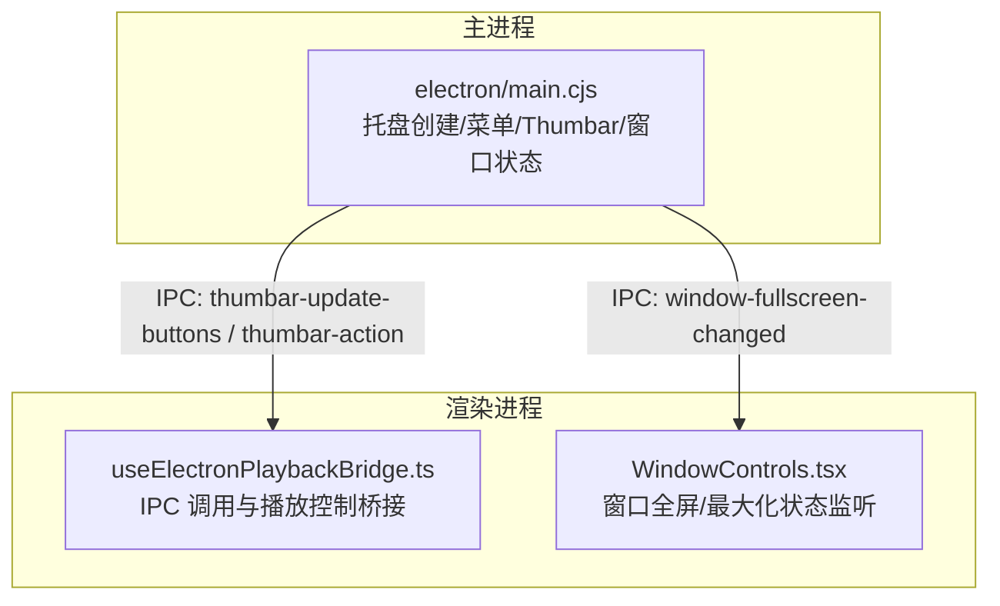
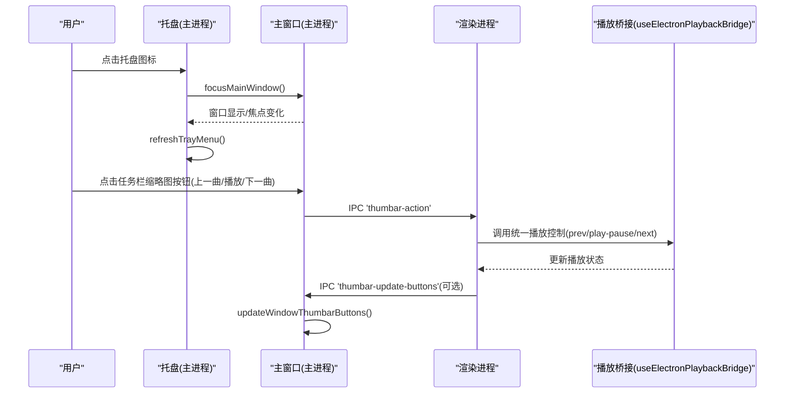
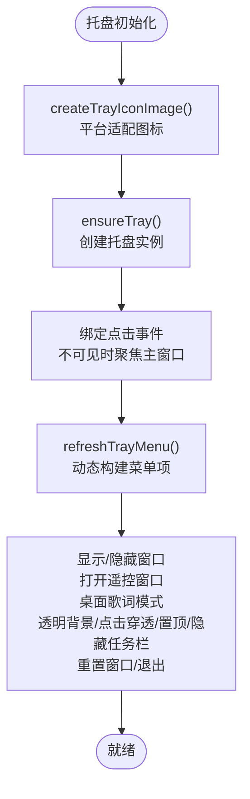
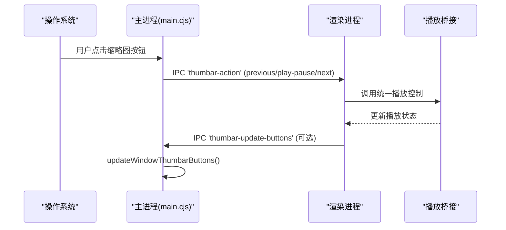
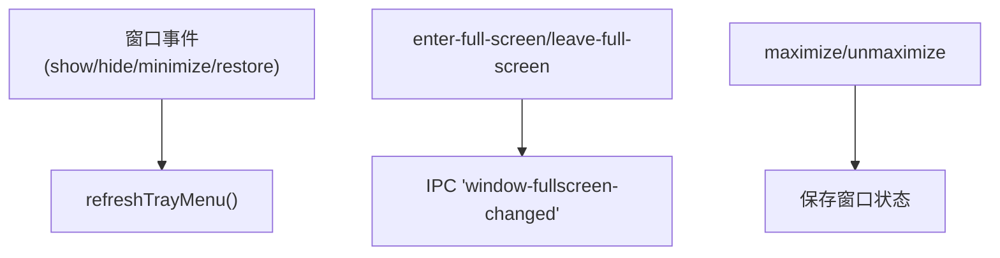
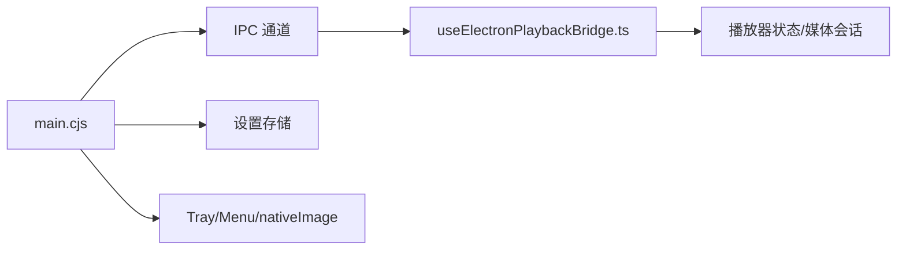

# 系统托盘集成

<cite>
**本文引用的文件**   
- [electron/main.cjs](file://electron/main.cjs)
- [src/hooks/useElectronPlaybackBridge.ts](file://src/hooks/useElectronPlaybackBridge.ts)
- [src/components/WindowControls.tsx](file://src/components/WindowControls.tsx)
</cite>

## 目录
1. [简介](#简介)
2. [项目结构](#项目结构)
3. [核心组件](#核心组件)
4. [架构总览](#架构总览)
5. [详细组件分析](#详细组件分析)
6. [依赖关系分析](#依赖关系分析)
7. [性能与体验考量](#性能与体验考量)
8. [故障排查指南](#故障排查指南)
9. [结论](#结论)
10. [附录：扩展与自定义示例](#附录扩展与自定义示例)

## 简介
本文面向 Folia Major 的系统托盘集成，聚焦以下目标：
- 托盘菜单构建：动态菜单项生成、图标资源管理、用户交互处理。
- 通知系统集成：Windows 任务栏缩略图按钮（Thumbar）控制、媒体会话桥接与状态同步。
- 快捷操作实现：播放控制快捷键、音量调节、窗口状态切换。
- 托盘图标状态管理：播放状态指示、专辑封面显示、动画效果。
- 跨平台差异：Windows 任务栏、macOS 菜单栏、Linux 系统托盘的不同实现。
- 事件处理与交互优化：托盘菜单事件、键盘导航、鼠标点击行为。
- 扩展指引：如何扩展托盘功能与自定义界面。

## 项目结构
本项目的托盘相关逻辑集中在 Electron 主进程入口中，前端通过 IPC 与主进程协作，完成播放控制、窗口状态与媒体会话的联动。

图表来源
- [electron/main.cjs:2185-2238](file://electron/main.cjs#L2185-L2238)
- [electron/main.cjs:2501-2636](file://electron/main.cjs#L2501-L2636)
- [electron/main.cjs:2638-2657](file://electron/main.cjs#L2638-L2657)
- [electron/main.cjs:5070-5145](file://electron/main.cjs#L5070-L5145)
- [src/hooks/useElectronPlaybackBridge.ts:660-686](file://src/hooks/useElectronPlaybackBridge.ts#L660-L686)
- [src/components/WindowControls.tsx:26-52](file://src/components/WindowControls.tsx#L26-L52)

章节来源
- [electron/main.cjs:1850-1897](file://electron/main.cjs#L1850-L1897)
- [electron/main.cjs:2185-2238](file://electron/main.cjs#L2185-L2238)
- [electron/main.cjs:2501-2636](file://electron/main.cjs#L2501-L2636)
- [electron/main.cjs:2638-2657](file://electron/main.cjs#L2638-L2657)
- [electron/main.cjs:5070-5145](file://electron/main.cjs#L5070-L5145)
- [src/hooks/useElectronPlaybackBridge.ts:660-686](file://src/hooks/useElectronPlaybackBridge.ts#L660-L686)
- [src/components/WindowControls.tsx:26-52](file://src/components/WindowControls.tsx#L26-L52)

## 核心组件
- 托盘图标与菜单
  - 托盘图标创建与平台适配：macOS 使用模板图像与 Retina 资源；其他平台使用应用图标路径。
  - 托盘菜单动态构建：根据主窗口存在性、远程遥控窗口状态、壁纸模式等条件动态生成菜单项，包含“显示/隐藏窗口”“打开遥控窗口”“桌面歌词模式”“透明背景”“点击穿透”“窗口置顶”“隐藏任务栏图标”“重置窗口”“退出”等。
  - 托盘点击行为：当主窗口不可见时点击托盘图标会聚焦并显示主窗口。
- Windows 任务栏缩略图按钮（Thumbar）
  - 在 Windows 上为任务栏缩略图提供“上一曲/播放或暂停/下一曲”按钮，并根据当前播放状态启用/禁用。
  - 通过 IPC 将按钮点击动作转发给渲染进程，由前端统一处理播放控制。
- 窗口状态与托盘菜单联动
  - 主窗口的 show/hide/minimize/restore 事件触发托盘菜单刷新，确保菜单项状态与窗口状态一致。
  - 窗口全屏/最大化变化通过 IPC 通知前端 UI。
- 前端播放桥接
  - useElectronPlaybackBridge 负责接收来自系统（如 Thumbar、Media Session）的控制请求，并调用统一的播放控制方法。

章节来源
- [electron/main.cjs:1861-1897](file://electron/main.cjs#L1861-L1897)
- [electron/main.cjs:2501-2636](file://electron/main.cjs#L2501-L2636)
- [electron/main.cjs:2638-2657](file://electron/main.cjs#L2638-L2657)
- [electron/main.cjs:2185-2238](file://electron/main.cjs#L2185-L2238)
- [electron/main.cjs:5070-5145](file://electron/main.cjs#L5070-L5145)
- [src/hooks/useElectronPlaybackBridge.ts:660-686](file://src/hooks/useElectronPlaybackBridge.ts#L660-L686)

## 架构总览
托盘集成的整体流程如下：
- 主进程负责托盘图标与菜单的生命周期管理，并在不同平台进行差异化处理。
- Windows 任务栏缩略图按钮作为快捷操作入口，通过 IPC 将用户操作传递给渲染进程。
- 渲染进程通过统一的播放桥接层执行播放控制，并与 Media Session 等系统能力协同。
- 窗口状态变化（显示/隐藏/最小化/最大化/全屏）会触发托盘菜单刷新，保证 UI 一致性。

图表来源
- [electron/main.cjs:2638-2657](file://electron/main.cjs#L2638-L2657)
- [electron/main.cjs:2185-2238](file://electron/main.cjs#L2185-L2238)
- [src/hooks/useElectronPlaybackBridge.ts:660-686](file://src/hooks/useElectronPlaybackBridge.ts#L660-L686)

## 详细组件分析

### 托盘图标与菜单构建
- 图标资源管理
  - macOS 下使用模板图像与 Retina 资源，确保在不同缩放比例下的清晰度与主题色适配。
  - 非 macOS 平台直接使用应用图标路径。
- 动态菜单项生成
  - 根据主窗口是否存在、远程遥控窗口是否打开、壁纸模式是否启用等条件，动态构建菜单项。
  - 支持“桌面歌词模式”“透明背景”“点击穿透”“窗口置顶”“隐藏任务栏图标”等开关，并在必要时异步重建窗口以应用新配置。
- 用户交互处理
  - 托盘点击：若主窗口不可见则聚焦并显示主窗口。
  - 菜单项点击：执行相应操作后刷新托盘菜单，保持状态一致。

图表来源
- [electron/main.cjs:1861-1897](file://electron/main.cjs#L1861-L1897)
- [electron/main.cjs:2501-2636](file://electron/main.cjs#L2501-L2636)
- [electron/main.cjs:2638-2657](file://electron/main.cjs#L2638-L2657)

章节来源
- [electron/main.cjs:1861-1897](file://electron/main.cjs#L1861-L1897)
- [electron/main.cjs:2501-2636](file://electron/main.cjs#L2501-L2636)
- [electron/main.cjs:2638-2657](file://electron/main.cjs#L2638-L2657)

### Windows 任务栏缩略图按钮（Thumbar）
- 按钮定义与状态
  - 上一曲、播放/暂停、下一曲三个按钮，依据当前是否有活动曲目、是否可前进/后退、是否正在播放来启用或禁用。
- 事件转发
  - 点击按钮后通过 IPC 向渲染进程发送动作标识，由前端统一处理播放控制。
- 前端桥接
  - useElectronPlaybackBridge 接收动作并调用统一的播放控制方法（上一曲、播放/暂停、下一曲）。

图表来源
- [electron/main.cjs:2185-2238](file://electron/main.cjs#L2185-L2238)
- [src/hooks/useElectronPlaybackBridge.ts:660-686](file://src/hooks/useElectronPlaybackBridge.ts#L660-L686)

章节来源
- [electron/main.cjs:2185-2238](file://electron/main.cjs#L2185-L2238)
- [src/hooks/useElectronPlaybackBridge.ts:660-686](file://src/hooks/useElectronPlaybackBridge.ts#L660-L686)

### 窗口状态与托盘菜单联动
- 窗口事件监听
  - 主窗口的 show/hide/minimize/restore 事件均触发托盘菜单刷新，确保菜单项状态与窗口状态一致。
- 全屏/最大化状态同步
  - 通过 IPC 将全屏/最大化状态变化通知到前端 UI，便于界面元素（如标题栏控件）正确响应。

图表来源
- [electron/main.cjs:5070-5145](file://electron/main.cjs#L5070-L5145)

章节来源
- [electron/main.cjs:5070-5145](file://electron/main.cjs#L5070-L5145)
- [src/components/WindowControls.tsx:26-52](file://src/components/WindowControls.tsx#L26-L52)

### 跨平台托盘差异
- Windows
  - 支持任务栏缩略图按钮（Thumbar），用于快捷播放控制。
  - 托盘菜单支持“隐藏任务栏图标”“透明背景”“点击穿透”“窗口置顶”等高级选项。
- macOS
  - 托盘图标采用模板图像与 Retina 资源，适配系统主题与高 DPI。
  - 不支持 Thumbar，但可通过 Media Session 与系统控制中心联动。
- Linux
  - 托盘菜单行为与 Windows/macOS 类似，但不具备 Thumbar 能力。
  - 桌面歌词模式在特定平台（如 Wayland）可能需要重启应用以应用窗口属性变更。

章节来源
- [electron/main.cjs:1861-1897](file://electron/main.cjs#L1861-L1897)
- [electron/main.cjs:2185-2238](file://electron/main.cjs#L2185-L2238)
- [electron/main.cjs:2501-2636](file://electron/main.cjs#L2501-L2636)

### 通知系统集成与用户反馈
- 系统通知
  - 代码库未直接实现系统通知弹窗；主要依赖托盘菜单与任务栏缩略图按钮提供用户反馈。
- 媒体会话桥接
  - 前端通过 Media Session 与系统控制中心联动，展示当前播放信息与基本控制。
- 用户反馈机制
  - 托盘菜单项的状态（勾选框）反映当前设置；任务栏缩略图按钮根据播放状态动态启用/禁用。

章节来源
- [src/hooks/useElectronPlaybackBridge.ts:660-686](file://src/hooks/useElectronPlaybackBridge.ts#L660-L686)
- [electron/main.cjs:2185-2238](file://electron/main.cjs#L2185-L2238)

### 快捷操作实现
- 播放控制快捷键
  - 通过 Thumbar 与 Media Session 提供系统级播放控制（上一曲/播放/下一曲）。
- 音量调节
  - 代码库未直接暴露托盘音量调节；可在托盘菜单中扩展自定义命令并通过 IPC 调用音频设置。
- 窗口状态切换
  - 托盘菜单提供“显示/隐藏窗口”“透明背景”“点击穿透”“窗口置顶”“隐藏任务栏图标”等开关，支持异步应用并刷新菜单。

章节来源
- [electron/main.cjs:2501-2636](file://electron/main.cjs#L2501-L2636)
- [electron/main.cjs:2185-2238](file://electron/main.cjs#L2185-L2238)

### 托盘图标状态管理与动画效果
- 播放状态指示
  - 通过任务栏缩略图按钮的启用/禁用与图标切换（播放/暂停）体现播放状态。
- 专辑封面显示
  - 托盘图标本身不显示专辑封面；如需封面显示，可在托盘菜单中嵌入预览或使用 Media Session 元数据。
- 动画效果
  - 托盘图标无内置动画；可通过前端视觉反馈（如 Media Session 元数据更新）间接体现状态变化。

章节来源
- [electron/main.cjs:2185-2238](file://electron/main.cjs#L2185-L2238)
- [src/hooks/useElectronPlaybackBridge.ts:660-686](file://src/hooks/useElectronPlaybackBridge.ts#L660-L686)

## 依赖关系分析
- 主进程依赖
  - Electron API：Tray、Menu、BrowserWindow、nativeImage 等。
  - 本地存储：读取/写入设置项（如最小化到托盘、隐藏任务栏图标、窗口置顶等）。
- 渲染进程依赖
  - IPC 通道：接收主进程事件（如 thumbar-action、window-fullscreen-changed），并回发状态更新（如 thumbar-update-buttons）。
  - 播放控制：统一的播放桥接层协调 Media Session 与内部播放器状态。

图表来源
- [electron/main.cjs:2185-2238](file://electron/main.cjs#L2185-L2238)
- [electron/main.cjs:2501-2636](file://electron/main.cjs#L2501-L2636)
- [src/hooks/useElectronPlaybackBridge.ts:660-686](file://src/hooks/useElectronPlaybackBridge.ts#L660-L686)

章节来源
- [electron/main.cjs:2185-2238](file://electron/main.cjs#L2185-L2238)
- [electron/main.cjs:2501-2636](file://electron/main.cjs#L2501-L2636)
- [src/hooks/useElectronPlaybackBridge.ts:660-686](file://src/hooks/useElectronPlaybackBridge.ts#L660-L686)

## 性能与体验考量
- 托盘菜单刷新频率
  - 在窗口状态变化时刷新托盘菜单，避免频繁重绘导致性能问题；建议仅在必要状态变更时触发。
- 图标资源加载
  - macOS 模板图像与 Retina 资源按需加载，避免重复创建；建议在应用启动时缓存。
- 任务栏缩略图按钮
  - 仅在 Windows 平台启用，减少跨平台开销；按钮状态更新应去抖，避免频繁 IPC 调用。
- 用户体验
  - 托盘菜单项分组清晰，关键操作一键可达；异步操作后自动刷新菜单，确保状态可见。

[本节为通用指导，无需具体文件引用]

## 故障排查指南
- 托盘图标无法创建
  - 检查 createTrayIconImage 返回值与平台资源路径是否正确。
  - 确认 nativeImage 可用性与资源文件存在。
- 托盘菜单不刷新
  - 检查 ensureTray 与 refreshTrayMenu 是否在窗口事件中被调用。
  - 确认菜单项的 enabled/checked 状态计算逻辑是否符合预期。
- 任务栏缩略图按钮无效
  - 确认 isWindowsThumbarSupported 返回 true。
  - 检查 updateWindowThumbarButtons 的参数（hasActiveTrack/canGoPrevious/canGoNext/isPlaying）是否正确。
  - 验证 IPC 'thumbar-action' 是否被渲染进程正确处理。

章节来源
- [electron/main.cjs:1861-1897](file://electron/main.cjs#L1861-L1897)
- [electron/main.cjs:2501-2636](file://electron/main.cjs#L2501-L2636)
- [electron/main.cjs:2185-2238](file://electron/main.cjs#L2185-L2238)
- [src/hooks/useElectronPlaybackBridge.ts:660-686](file://src/hooks/useElectronPlaybackBridge.ts#L660-L686)

## 结论
Folia Major 的系统托盘集成在主进程中实现了跨平台的托盘图标与菜单管理，并在 Windows 平台上提供了任务栏缩略图按钮以增强快捷操作体验。托盘菜单动态构建，结合窗口状态事件确保 UI 一致性；前端通过播放桥接层统一处理系统级控制请求。整体架构清晰、可扩展性强，适合进一步扩展托盘功能与自定义界面。

[本节为总结性内容，无需具体文件引用]

## 附录：扩展与自定义示例
- 扩展托盘菜单项
  - 在 refreshTrayMenu 中添加新的菜单项，绑定 click 回调以执行业务逻辑，并在操作完成后调用 refreshTrayMenu 刷新状态。
- 自定义任务栏缩略图按钮
  - 在 updateWindowThumbarButtons 中新增按钮配置，并通过 sendThumbarAction 转发动作至渲染进程。
- 自定义音量调节
  - 在托盘菜单中添加音量调节项，通过 IPC 调用音频设置接口，并结合前端 UI 显示当前音量。

章节来源
- [electron/main.cjs:2501-2636](file://electron/main.cjs#L2501-L2636)
- [electron/main.cjs:2185-2238](file://electron/main.cjs#L2185-L2238)