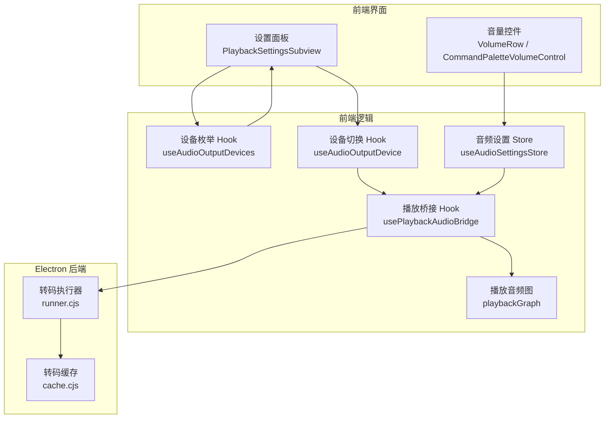
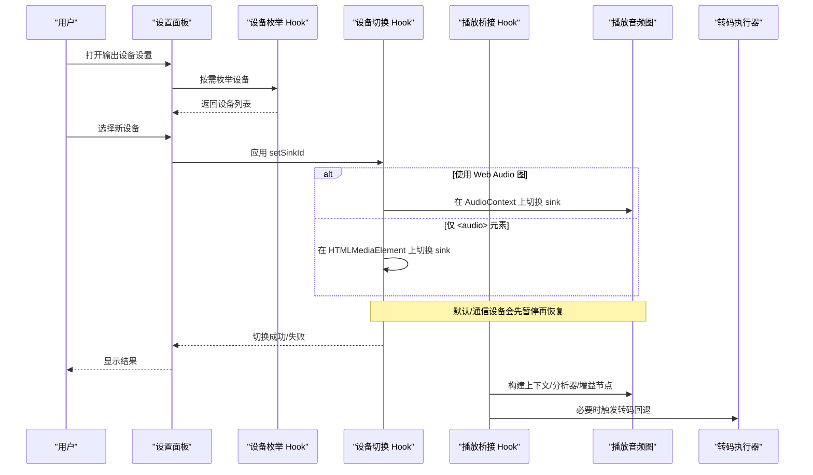
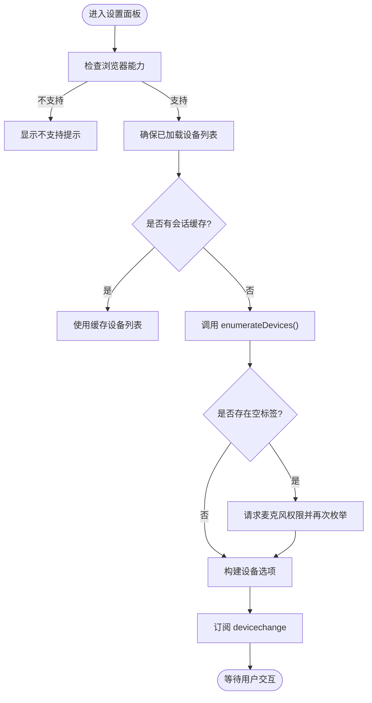
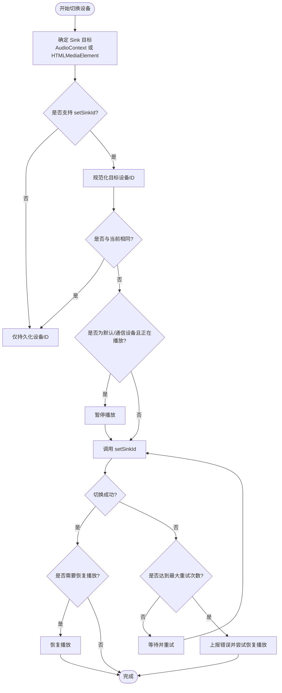
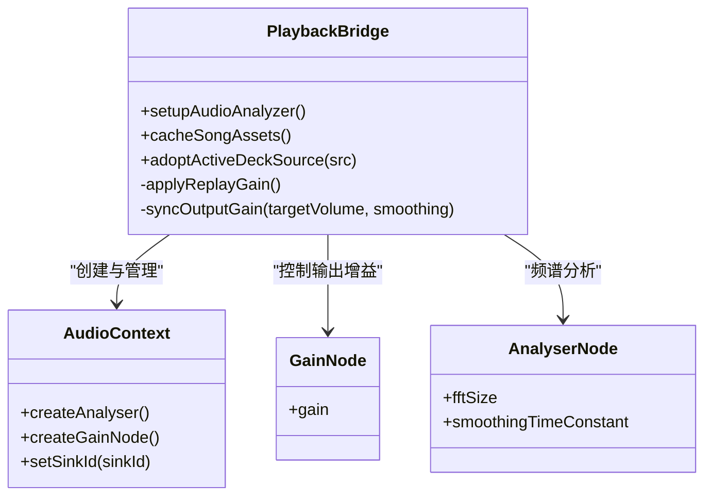
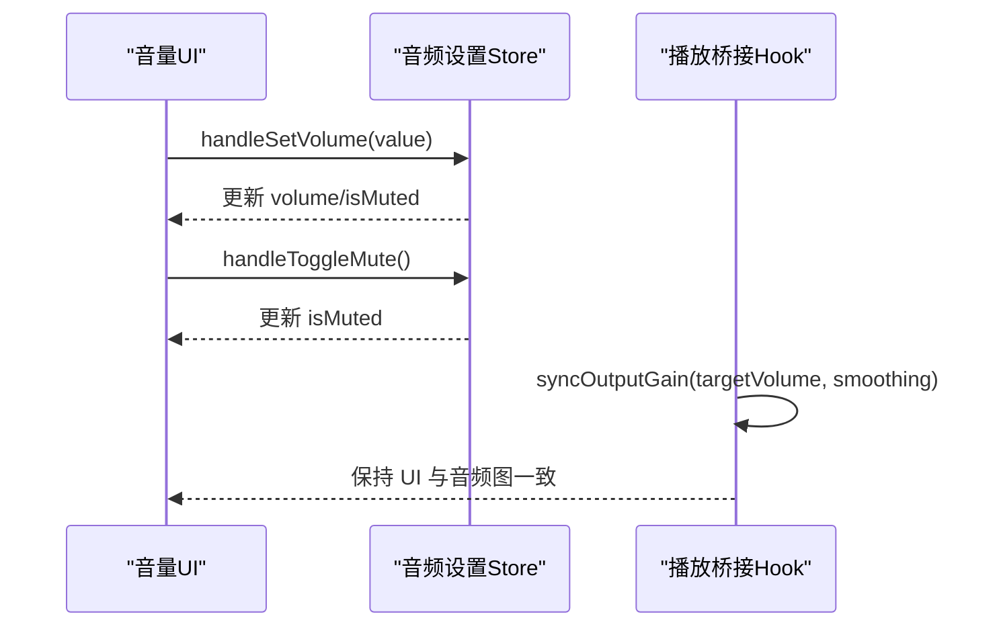
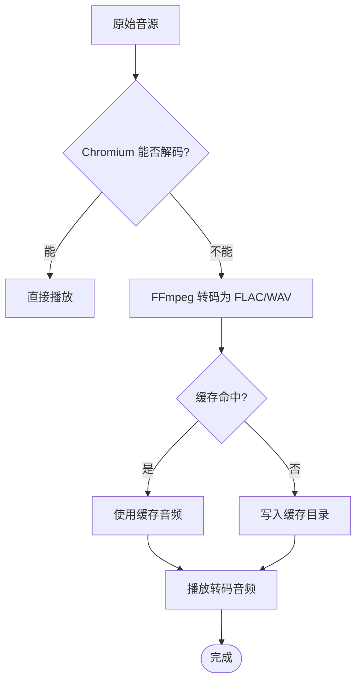
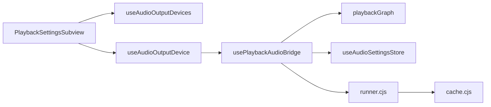

# 音频设备管理

<cite>
**本文引用的文件**   
- [useAudioOutputDevice.ts](file://src/hooks/useAudioOutputDevice.ts)
- [useAudioOutputDevices.ts](file://src/hooks/useAudioOutputDevices.ts)
- [PlaybackSettingsSubview.tsx](file://src/components/modal/settings/PlaybackSettingsSubview.tsx)
- [useAudioSettingsStore.ts](file://src/stores/useAudioSettingsStore.ts)
- [usePlaybackAudioBridge.ts](file://src/hooks/usePlaybackAudioBridge.ts)
- [playbackGraph.ts](file://src/services/playbackGraph.ts)
- [VolumeRow.tsx](file://src/components/panelTab/controls/VolumeRow.tsx)
- [volumeCommand.ts](file://src/components/command-palette/commands/volumeCommand.ts)
- [CommandPaletteVolumeControl.tsx](file://src/components/command-palette/CommandPaletteVolumeControl.tsx)
- [runner.cjs](file://electron/transcode/runner.cjs)
- [cache.cjs](file://electron/transcode/cache.cjs)
</cite>

## 目录
1. [简介](#简介)
2. [项目结构](#项目结构)
3. [核心组件](#核心组件)
4. [架构总览](#架构总览)
5. [详细组件分析](#详细组件分析)
6. [依赖关系分析](#依赖关系分析)
7. [性能与平台差异](#性能与平台差异)
8. [故障排查指南](#故障排查指南)
9. [结论](#结论)
10. [附录：代码示例路径](#附录代码示例路径)

## 简介
本文件面向 Folia Major 的音频设备管理子系统，聚焦以下目标：
- 音频设备枚举：输入输出检测、设备信息获取、状态监控。
- 设备切换机制：动态切换、音频流重定向、无缝过渡处理。
- 音量控制：系统音量调节、应用音量控制、音量同步。
- 音频格式支持：采样率转换、声道映射、编码格式处理。
- 跨平台差异：Windows DirectSound、macOS Core Audio、Linux PulseAudio 的实现要点。
- 热插拔、错误恢复与性能优化策略。
- 提供可落地的代码示例路径，帮助开发者快速定位实现细节。

## 项目结构
音频设备管理横跨前端 React Hook、设置面板、播放桥接、音频图构建以及 Electron 转码服务。关键位置如下：
- 设备枚举与选择：`src/hooks/useAudioOutputDevices.ts`、`src/components/modal/settings/PlaybackSettingsSubview.tsx`
- 设备切换与重定向：`src/hooks/useAudioOutputDevice.ts`
- 播放与音频图：`src/hooks/usePlaybackAudioBridge.ts`、`src/services/playbackGraph.ts`
- 音量控制与持久化：`src/stores/useAudioSettingsStore.ts`、`src/components/panelTab/controls/VolumeRow.tsx`、`src/components/command-palette/commands/volumeCommand.ts`
- 转码与格式处理（Electron）：`electron/transcode/runner.cjs`、`electron/transcode/cache.cjs`

**图表来源**
- [PlaybackSettingsSubview.tsx:157-179](file://src/components/modal/settings/PlaybackSettingsSubview.tsx#L157-L179)
- [useAudioOutputDevices.ts:71-168](file://src/hooks/useAudioOutputDevices.ts#L71-L168)
- [useAudioOutputDevice.ts:33-128](file://src/hooks/useAudioOutputDevice.ts#L33-L128)
- [usePlaybackAudioBridge.ts:46-164](file://src/hooks/usePlaybackAudioBridge.ts#L46-L164)
- [useAudioSettingsStore.ts:165-294](file://src/stores/useAudioSettingsStore.ts#L165-L294)
- [runner.cjs](file://electron/transcode/runner.cjs)
- [cache.cjs:1-32](file://electron/transcode/cache.cjs#L1-L32)

**章节来源**
- [PlaybackSettingsSubview.tsx:157-179](file://src/components/modal/settings/PlaybackSettingsSubview.tsx#L157-L179)
- [useAudioOutputDevices.ts:71-168](file://src/hooks/useAudioOutputDevices.ts#L71-L168)
- [useAudioOutputDevice.ts:33-128](file://src/hooks/useAudioOutputDevice.ts#L33-L128)
- [usePlaybackAudioBridge.ts:46-164](file://src/hooks/usePlaybackAudioBridge.ts#L46-L164)
- [useAudioSettingsStore.ts:165-294](file://src/stores/useAudioSettingsStore.ts#L165-L294)
- [runner.cjs](file://electron/transcode/runner.cjs)
- [cache.cjs:1-32](file://electron/transcode/cache.cjs#L1-L32)

## 核心组件
- 设备枚举 Hook：负责按需调用 `navigator.mediaDevices.enumerateDevices()`，在需要时请求麦克风权限以获取设备标签，维护会话级缓存，监听 `devicechange` 事件实现热插拔刷新。
- 设备切换 Hook：根据当前是否使用 Web Audio 图，决定将 `setSinkId` 应用到 `<audio>` 元素或 `AudioContext`；对“默认/通信”设备进行暂停-切换-恢复的平滑流程，并包含重试与错误上报。
- 播放桥接 Hook：创建 `AudioContext`、分析器、增益节点，构建播放图，应用均衡器与效果链，计算 ReplayGain，同步输出增益，并在自动播放、暂停、切换等生命周期中协调状态。
- 音频设置 Store：持久化音量、静音、循环模式、输出设备 ID、均衡器设置、媒体缓存开关与大小等。
- 音量 UI：命令面板与底部面板中的音量滑块、百分比显示、静音切换，最终通过 Store 更新应用音量。
- 转码服务（Electron）：针对 Chromium 无法解码的本地/Navidrome 格式进行 FFmpeg 转码，输出 FLAC/WAV，带缓存与参数校验。

**章节来源**
- [useAudioOutputDevices.ts:71-168](file://src/hooks/useAudioOutputDevices.ts#L71-L168)
- [useAudioOutputDevice.ts:33-128](file://src/hooks/useAudioOutputDevice.ts#L33-L128)
- [usePlaybackAudioBridge.ts:46-164](file://src/hooks/usePlaybackAudioBridge.ts#L46-L164)
- [useAudioSettingsStore.ts:165-294](file://src/stores/useAudioSettingsStore.ts#L165-L294)
- [VolumeRow.tsx:21-61](file://src/components/panelTab/controls/VolumeRow.tsx#L21-L61)
- [runner.cjs](file://electron/transcode/runner.cjs)
- [cache.cjs:1-32](file://electron/transcode/cache.cjs#L1-L32)

## 架构总览
下图展示从用户操作到音频输出的完整链路，包括设备枚举、设备切换、播放图构建与转码回退。

**图表来源**
- [PlaybackSettingsSubview.tsx:157-179](file://src/components/modal/settings/PlaybackSettingsSubview.tsx#L157-L179)
- [useAudioOutputDevices.ts:71-168](file://src/hooks/useAudioOutputDevices.ts#L71-L168)
- [useAudioOutputDevice.ts:33-128](file://src/hooks/useAudioOutputDevice.ts#L33-L128)
- [usePlaybackAudioBridge.ts:46-164](file://src/hooks/usePlaybackAudioBridge.ts#L46-L164)
- [runner.cjs](file://electron/transcode/runner.cjs)

## 详细组件分析

### 设备枚举与状态监控
- 按需枚举：避免在挂载时触发昂贵的视频捕获服务启动与麦克风权限探测。
- 标签获取：若设备标签为空，尝试通过 `getUserMedia({ audio: true })` 获取权限后再枚举一次。
- 会话缓存：同一会话内复用枚举结果，减少重复开销。
- 热插拔：仅在设置面板可见期间订阅 `devicechange`，卸载时取消订阅，释放资源。

**图表来源**
- [useAudioOutputDevices.ts:71-168](file://src/hooks/useAudioOutputDevices.ts#L71-L168)
- [useAudioOutputDevices.ts:180-204](file://src/hooks/useAudioOutputDevices.ts#L180-L204)

**章节来源**
- [useAudioOutputDevices.ts:71-168](file://src/hooks/useAudioOutputDevices.ts#L71-L168)
- [useAudioOutputDevices.ts:180-204](file://src/hooks/useAudioOutputDevices.ts#L180-L204)

### 设备切换与音频流重定向
- 双 Sink 策略：当使用 Web Audio 图时，将 `setSinkId` 应用到 `AudioContext`；否则应用到 `<audio>` 元素。
- 默认/通信设备：切换前暂停播放，切换后尝试恢复，提升兼容性。
- 重试机制：遇到 `AbortError` 时最多重试 4 次，间隔 180ms，逐步调整策略。
- 错误上报：失败时通过状态消息通知用户，同时尽量恢复播放状态。

**图表来源**
- [useAudioOutputDevice.ts:33-128](file://src/hooks/useAudioOutputDevice.ts#L33-L128)

**章节来源**
- [useAudioOutputDevice.ts:33-128](file://src/hooks/useAudioOutputDevice.ts#L33-L128)

### 播放桥接与音频图构建
- 上下文创建：首次播放时创建 `AudioContext`、`AnalyserNode`、`GainNode`，并构建播放图。
- ReplayGain：按歌曲来源（本地、Navidrome、在线）计算响度补偿，平滑应用到当前 Deck。
- 均衡器与效果链：根据设置动态应用均衡器与效果链，支持预设与自定义槽位。
- 自动播放与状态协调：在自动播放、暂停、切换等场景下协调播放器状态与音频图。

**图表来源**
- [usePlaybackAudioBridge.ts:46-164](file://src/hooks/usePlaybackAudioBridge.ts#L46-L164)
- [usePlaybackAudioBridge.ts:179-191](file://src/hooks/usePlaybackAudioBridge.ts#L179-L191)
- [usePlaybackAudioBridge.ts:226-325](file://src/hooks/usePlaybackAudioBridge.ts#L226-L325)

**章节来源**
- [usePlaybackAudioBridge.ts:46-164](file://src/hooks/usePlaybackAudioBridge.ts#L46-L164)
- [usePlaybackAudioBridge.ts:179-191](file://src/hooks/usePlaybackAudioBridge.ts#L179-L191)
- [usePlaybackAudioBridge.ts:226-325](file://src/hooks/usePlaybackAudioBridge.ts#L226-L325)

### 音量控制与应用音量同步
- 应用音量：通过 `useAudioSettingsStore` 的 `handleSetVolume` 与 `handleToggleMute` 持久化并更新全局音量状态。
- UI 交互：`VolumeRow` 提供滑块预览与提交，`CommandPaletteVolumeControl` 提供命令面板中的音量控制入口。
- 输出同步：`usePlaybackAudioBridge` 在播放开始时同步输出增益，确保 UI 与音频图一致。

**图表来源**
- [useAudioSettingsStore.ts:265-275](file://src/stores/useAudioSettingsStore.ts#L265-L275)
- [VolumeRow.tsx:21-61](file://src/components/panelTab/controls/VolumeRow.tsx#L21-L61)
- [usePlaybackAudioBridge.ts:198-202](file://src/hooks/usePlaybackAudioBridge.ts#L198-L202)

**章节来源**
- [useAudioSettingsStore.ts:265-275](file://src/stores/useAudioSettingsStore.ts#L265-L275)
- [VolumeRow.tsx:21-61](file://src/components/panelTab/controls/VolumeRow.tsx#L21-L61)
- [usePlaybackAudioBridge.ts:198-202](file://src/hooks/usePlaybackAudioBridge.ts#L198-L202)

### 音频格式支持与转码回退
- 转码执行器：针对 Chromium 无法解码的格式，调用 FFmpeg 生成 FLAC/WAV，保证稳定输出。
- 缓存策略：基于源信息与版本生成确定性缓存键，原子发布完整转码产物。
- 参数校验：严格验证输出参数，确保解码完整性。

**图表来源**
- [runner.cjs](file://electron/transcode/runner.cjs)
- [cache.cjs:1-32](file://electron/transcode/cache.cjs#L1-L32)

**章节来源**
- [runner.cjs](file://electron/transcode/runner.cjs)
- [cache.cjs:1-32](file://electron/transcode/cache.cjs#L1-L32)

## 依赖关系分析
- 设备枚举与切换：`PlaybackSettingsSubview` 依赖 `useAudioOutputDevices` 与 `useAudioOutputDevice`，并通过 `useAudioSettingsStore` 持久化设备 ID。
- 播放桥接：`usePlaybackAudioBridge` 依赖 `playbackGraph` 构建音频图，并与 `useAudioSettingsStore` 同步音量与均衡器设置。
- 转码服务：Electron 侧的 `runner.cjs` 与 `cache.cjs` 为前端播放提供回退能力，确保格式兼容。

**图表来源**
- [PlaybackSettingsSubview.tsx:157-179](file://src/components/modal/settings/PlaybackSettingsSubview.tsx#L157-L179)
- [useAudioOutputDevices.ts:71-168](file://src/hooks/useAudioOutputDevices.ts#L71-L168)
- [useAudioOutputDevice.ts:33-128](file://src/hooks/useAudioOutputDevice.ts#L33-L128)
- [usePlaybackAudioBridge.ts:46-164](file://src/hooks/usePlaybackAudioBridge.ts#L46-L164)
- [useAudioSettingsStore.ts:165-294](file://src/stores/useAudioSettingsStore.ts#L165-L294)
- [runner.cjs](file://electron/transcode/runner.cjs)
- [cache.cjs:1-32](file://electron/transcode/cache.cjs#L1-L32)

**章节来源**
- [PlaybackSettingsSubview.tsx:157-179](file://src/components/modal/settings/PlaybackSettingsSubview.tsx#L157-L179)
- [useAudioOutputDevices.ts:71-168](file://src/hooks/useAudioOutputDevices.ts#L71-L168)
- [useAudioOutputDevice.ts:33-128](file://src/hooks/useAudioOutputDevice.ts#L33-L128)
- [usePlaybackAudioBridge.ts:46-164](file://src/hooks/usePlaybackAudioBridge.ts#L46-L164)
- [useAudioSettingsStore.ts:165-294](file://src/stores/useAudioSettingsStore.ts#L165-L294)
- [runner.cjs](file://electron/transcode/runner.cjs)
- [cache.cjs:1-32](file://electron/transcode/cache.cjs#L1-L32)

## 性能与平台差异
- 枚举性能：避免在挂载时枚举设备，仅在用户主动访问设置面板时触发；会话内缓存设备列表；仅在面板可见期间订阅 `devicechange`，及时释放资源。
- 权限成本：仅在设备标签缺失时请求麦克风权限，减少不必要的权限弹窗。
- 平台差异：
  - Windows/macOS：Electron 启用 `ReleaseVideoSourceProviderIfNotInUse`，允许视频捕获服务在空闲时关闭；浏览器/Linux 无此优化，需更谨慎地管理枚举与订阅。
  - 设备标签：部分平台需麦克风权限才能获取设备标签，代码已做降级处理。
- 转码性能：FFmpeg 转码产物缓存于磁盘，避免重复转码；输出格式固定为 FLAC/WAV，保证稳定性。

[本节为通用指导，不直接分析具体文件]

## 故障排查指南
- 设备枚举失败：检查 `enumerateDevices` 是否可用，确认权限是否授予；查看控制台日志 `[useAudioOutputDevices] Failed to enumerate audio output devices`。
- 设备切换失败：确认目标设备是否支持 `setSinkId`；检查是否为默认/通信设备导致暂停/恢复异常；查看日志 `[App] Failed to apply audio output device`。
- 播放无声：检查 `AudioContext` 是否成功创建；确认 `GainNode` 增益是否正常；查看 ReplayGain 日志与错误。
- 转码失败：检查 FFmpeg 参数与输出路径；查看转码缓存目录是否可写；确认输出校验是否通过。

**章节来源**
- [useAudioOutputDevices.ts:136-143](file://src/hooks/useAudioOutputDevices.ts#L136-L143)
- [useAudioOutputDevice.ts:103-124](file://src/hooks/useAudioOutputDevice.ts#L103-L124)
- [usePlaybackAudioBridge.ts:161-163](file://src/hooks/usePlaybackAudioBridge.ts#L161-L163)
- [runner.cjs](file://electron/transcode/runner.cjs)
- [cache.cjs:1-32](file://electron/transcode/cache.cjs#L1-L32)

## 结论
Folia Major 的音频设备管理通过分层设计实现了设备枚举、切换、播放图构建与转码回退的完整闭环。前端 Hook 负责设备与播放逻辑，Store 负责状态持久化，Electron 转码服务保障格式兼容。整体方案兼顾性能与用户体验，适合在多平台环境下稳定运行。

[本节为总结性内容，不直接分析具体文件]

## 附录：代码示例路径
- 设备枚举与选择：
  - [useAudioOutputDevices.ts:71-168](file://src/hooks/useAudioOutputDevices.ts#L71-L168)
  - [PlaybackSettingsSubview.tsx:157-179](file://src/components/modal/settings/PlaybackSettingsSubview.tsx#L157-L179)
- 设备切换与重定向：
  - [useAudioOutputDevice.ts:33-128](file://src/hooks/useAudioOutputDevice.ts#L33-L128)
- 播放桥接与音频图：
  - [usePlaybackAudioBridge.ts:46-164](file://src/hooks/usePlaybackAudioBridge.ts#L46-L164)
  - [playbackGraph.ts](file://src/services/playbackGraph.ts)
- 音量控制与持久化：
  - [useAudioSettingsStore.ts:265-275](file://src/stores/useAudioSettingsStore.ts#L265-L275)
  - [VolumeRow.tsx:21-61](file://src/components/panelTab/controls/VolumeRow.tsx#L21-L61)
  - [volumeCommand.ts:36-53](file://src/components/command-palette/commands/volumeCommand.ts#L36-L53)
- 转码与格式处理：
  - [runner.cjs](file://electron/transcode/runner.cjs)
  - [cache.cjs:1-32](file://electron/transcode/cache.cjs#L1-L32)