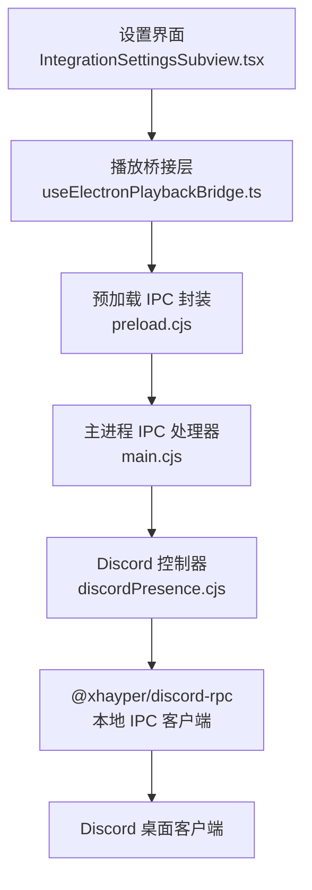
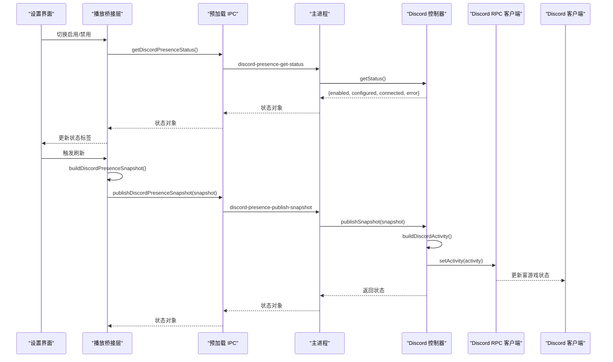
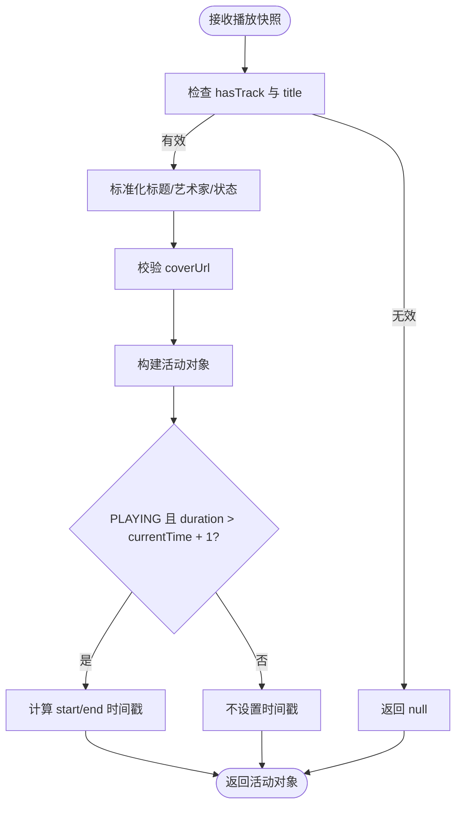
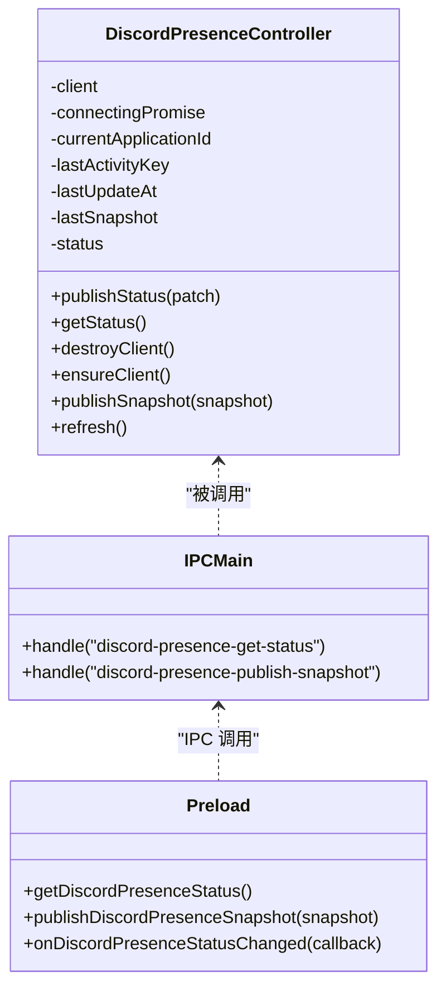
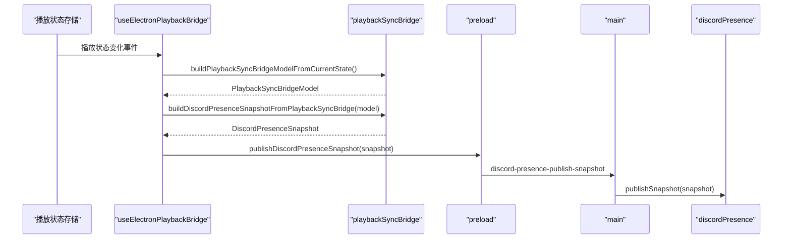
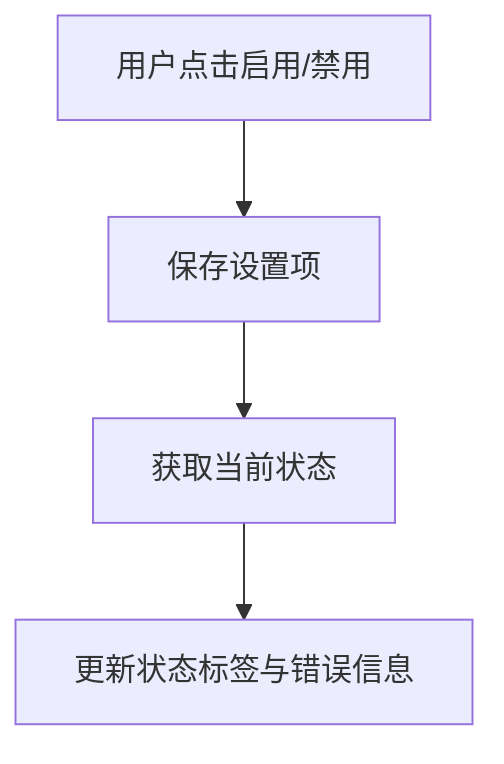
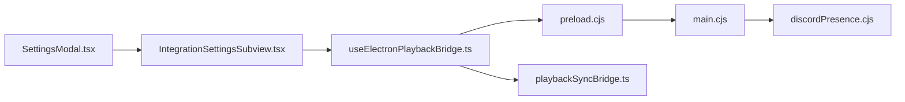

# Discord Rich Presence 集成

<cite>
**本文引用的文件**   
- [discordPresence.cjs](file://electron/discordPresence.cjs)
- [main.cjs](file://electron/main.cjs)
- [preload.cjs](file://electron/preload.cjs)
- [playbackSyncBridge.ts](file://src/utils/playbackSyncBridge.ts)
- [useElectronPlaybackBridge.ts](file://src/hooks/useElectronPlaybackBridge.ts)
- [IntegrationSettingsSubview.tsx](file://src/components/modal/settings/IntegrationSettingsSubview.tsx)
- [SettingsModal.tsx](file://src/components/modal/SettingsModal.tsx)
- [settingsCommands.ts](file://src/components/command-palette/commands/settingsCommands.ts)
- [discordPresence.test.ts](file://test/unit/discordPresence.test.ts)
</cite>

## 目录
1. [简介](#简介)
2. [项目结构](#项目结构)
3. [核心组件](#核心组件)
4. [架构总览](#架构总览)
5. [详细组件分析](#详细组件分析)
6. [依赖关系分析](#依赖关系分析)
7. [性能与优化](#性能与优化)
8. [配置示例](#配置示例)
9. [故障排除指南](#故障排除指南)
10. [结论](#结论)

## 简介
本文面向 Folia Major 的 Discord Rich Presence（富游戏状态）集成，系统性说明以下方面：
- 活动类型设置、歌曲信息同步机制、专辑封面展示和播放状态更新。
- 客户端连接管理：应用 ID 配置、IPC 通信协议、连接状态监控与错误处理。
- 活动数据构建逻辑：标题截取、艺术家显示、时间戳计算和图片 URL 校验。
- 性能优化：更新频率控制、重复检测和资源清理。
- 配置入口、使用方式、常见问题排查与最佳实践。

该功能由前端渲染进程采集播放快照，通过 Electron IPC 传递到主进程，再由主进程通过本地 IPC 与 Discord 客户端通信，最终在 Discord 中显示当前播放状态。

## 项目结构
Discord Rich Presence 相关代码横跨 Electron 主进程、预加载脚本、前端桥接层以及共享的播放同步模型：
- Electron 主进程负责创建并维护 Discord 客户端实例，处理 IPC 请求，调用 @xhayper/discord-rpc 进行连接和活动更新。
- 预加载脚本暴露安全的 IPC 接口给渲染进程。
- 渲染进程通过 useElectronPlaybackBridge 将播放状态转换为 Discord 快照并发送。
- playbackSyncBridge 提供统一的播放同步模型，确保各发布端（如任务栏、远程窗口、Discord）使用一致的元数据。
- 设置界面提供开关与状态展示，便于用户启用或禁用功能。

**图表来源**
- [IntegrationSettingsSubview.tsx:358-396](file://src/components/modal/settings/IntegrationSettingsSubview.tsx#L358-L396)
- [useElectronPlaybackBridge.ts:294-351](file://src/hooks/useElectronPlaybackBridge.ts#L294-L351)
- [preload.cjs:191-209](file://electron/preload.cjs#L191-L209)
- [main.cjs:6313-6327](file://electron/main.cjs#L6313-L6327)
- [discordPresence.cjs:103-276](file://electron/discordPresence.cjs#L103-L276)

**章节来源**
- [discordPresence.cjs:1-285](file://electron/discordPresence.cjs#L1-L285)
- [main.cjs:6313-6327](file://electron/main.cjs#L6313-L6327)
- [preload.cjs:191-209](file://electron/preload.cjs#L191-L209)
- [playbackSyncBridge.ts:82-91](file://src/utils/playbackSyncBridge.ts#L82-L91)
- [useElectronPlaybackBridge.ts:294-351](file://src/hooks/useElectronPlaybackBridge.ts#L294-L351)
- [IntegrationSettingsSubview.tsx:358-396](file://src/components/modal/settings/IntegrationSettingsSubview.tsx#L358-L396)

## 核心组件
- Discord 活动构建器：根据播放快照生成 Discord 活动对象，包含名称、类型、详情、状态、大图键、小图文本及起止时间戳。
- Discord 控制器：管理客户端生命周期、连接状态、应用 ID 校验、去重与节流更新、错误上报。
- IPC 通道：渲染进程通过 preload 暴露的方法调用主进程的 get-status 与 publish-snapshot。
- 播放快照适配器：从统一播放模型中提取 Discord 所需字段，保证数据一致性。
- 设置界面：提供启用开关与状态标签，支持国际化文案。

关键职责划分：
- 渲染进程：采集播放状态，构造 Discord 快照，调用 IPC 发送。
- 主进程：校验应用 ID，建立 Discord 客户端，执行 setActivity/clearActivity，维护连接状态。
- 工具层：URL 规范化、ID 校验、时间戳计算、活动键生成。

**章节来源**
- [discordPresence.cjs:52-101](file://electron/discordPresence.cjs#L52-L101)
- [discordPresence.cjs:103-276](file://electron/discordPresence.cjs#L103-L276)
- [preload.cjs:191-209](file://electron/preload.cjs#L191-L209)
- [playbackSyncBridge.ts:255-266](file://src/utils/playbackSyncBridge.ts#L255-L266)
- [IntegrationSettingsSubview.tsx:358-396](file://src/components/modal/settings/IntegrationSettingsSubview.tsx#L358-L396)

## 架构总览
下图展示了从渲染进程到 Discord 客户端的完整调用链，包括状态查询、快照发布、连接建立与活动更新。

**图表来源**
- [useElectronPlaybackBridge.ts:294-351](file://src/hooks/useElectronPlaybackBridge.ts#L294-L351)
- [preload.cjs:191-209](file://electron/preload.cjs#L191-L209)
- [main.cjs:6313-6327](file://electron/main.cjs#L6313-L6327)
- [discordPresence.cjs:52-101](file://electron/discordPresence.cjs#L52-L101)
- [discordPresence.cjs:228-264](file://electron/discordPresence.cjs#L228-L264)

## 详细组件分析

### Discord 活动构建逻辑
活动构建器负责将播放快照映射为 Discord 活动对象：
- 输入校验：若无有效曲目或缺少标题，则返回空值，表示不清除已有活动但也不推送新活动。
- 标题与艺术家：标题截断至 128 字符；艺术家为空时回退为“Folia”。
- 播放状态：PLAYING 或 PAUSED，用于决定 state 与 smallImageText。
- 封面图片：仅接受 http/https 且非本地回环地址的 URL，否则不设置 largeImageKey。
- 时间戳：仅在 PLAYING 且有有限时长时计算 startTimestamp 与 endTimestamp，基于 updatedAt 与 currentTime/duration。

**图表来源**
- [discordPresence.cjs:52-88](file://electron/discordPresence.cjs#L52-L88)
- [discordPresence.cjs:47-50](file://electron/discordPresence.cjs#L47-L50)

**章节来源**
- [discordPresence.cjs:52-88](file://electron/discordPresence.cjs#L52-L88)
- [discordPresence.cjs:16-45](file://electron/discordPresence.cjs#L16-L45)
- [discordPresence.cjs:47-50](file://electron/discordPresence.cjs#L47-L50)

### 客户端连接管理与 IPC 通信
控制器负责：
- 应用 ID 校验：仅接受 16-24 位数字字符串，默认应用 ID 来自常量。
- 客户端复用：若已连接且应用 ID 未变，直接复用现有客户端。
- 连接建立：通过 @xhayper/discord-rpc 以 IPC 传输方式登录 Discord。
- 断开监听：当 Discord 断开时更新状态并记录错误。
- 资源清理：销毁客户端前尝试清除活动，避免残留状态。

IPC 通道：
- 渲染进程通过 preload 暴露 getDiscordPresenceStatus 与 publishDiscordPresenceSnapshot。
- 主进程注册对应 ipcMain.handle，调用控制器方法并返回状态。

**图表来源**
- [discordPresence.cjs:103-276](file://electron/discordPresence.cjs#L103-L276)
- [main.cjs:6313-6327](file://electron/main.cjs#L6313-L6327)
- [preload.cjs:191-209](file://electron/preload.cjs#L191-L209)

**章节来源**
- [discordPresence.cjs:103-276](file://electron/discordPresence.cjs#L103-L276)
- [main.cjs:6313-6327](file://electron/main.cjs#L6313-L6327)
- [preload.cjs:191-209](file://electron/preload.cjs#L191-L209)

### 播放快照适配与数据流
播放快照适配器从统一播放模型中提取 Discord 所需字段：
- hasTrack：是否有效曲目。
- title/artist：歌曲名与艺术家。
- coverUrl：封面 URL。
- currentTime/duration：当前时间与时长（秒）。
- playerState：播放器状态。
- updatedAt：采样时间戳。

渲染进程在每次播放状态变化时调用 buildDiscordPresenceSnapshotFromPlaybackSyncBridge，并通过 window.electron.publishDiscordPresenceSnapshot 发送到主进程。

**图表来源**
- [useElectronPlaybackBridge.ts:294-351](file://src/hooks/useElectronPlaybackBridge.ts#L294-L351)
- [playbackSyncBridge.ts:255-266](file://src/utils/playbackSyncBridge.ts#L255-L266)
- [preload.cjs:191-192](file://electron/preload.cjs#L191-L192)
- [main.cjs:6321-6327](file://electron/main.cjs#L6321-L6327)

**章节来源**
- [playbackSyncBridge.ts:82-91](file://src/utils/playbackSyncBridge.ts#L82-L91)
- [playbackSyncBridge.ts:255-266](file://src/utils/playbackSyncBridge.ts#L255-L266)
- [useElectronPlaybackBridge.ts:294-351](file://src/hooks/useElectronPlaybackBridge.ts#L294-L351)

### 设置界面与状态展示
设置界面提供：
- 启用/禁用开关：保存 DISCORD_RICH_PRESENCE_ENABLED 设置项。
- 状态标签：显示 connected/error 等状态，支持国际化文案。
- 锚点命令：通过命令面板快速定位到 Discord Rich Presence 设置区域。

**图表来源**
- [SettingsModal.tsx:654-665](file://src/components/modal/SettingsModal.tsx#L654-L665)
- [IntegrationSettingsSubview.tsx:358-396](file://src/components/modal/settings/IntegrationSettingsSubview.tsx#L358-L396)
- [settingsCommands.ts:153-153](file://src/components/command-palette/commands/settingsCommands.ts#L153-L153)

**章节来源**
- [SettingsModal.tsx:654-665](file://src/components/modal/SettingsModal.tsx#L654-L665)
- [IntegrationSettingsSubview.tsx:358-396](file://src/components/modal/settings/IntegrationSettingsSubview.tsx#L358-L396)
- [settingsCommands.ts:153-153](file://src/components/command-palette/commands/settingsCommands.ts#L153-L153)

## 依赖关系分析
- 外部依赖：@xhayper/discord-rpc 用于与 Discord 客户端进行本地 IPC 通信。
- 内部依赖：
  - main.cjs 引入 discordPresence.cjs 提供的控制器与常量。
  - preload.cjs 暴露 IPC 方法供渲染进程调用。
  - useElectronPlaybackBridge.ts 使用 playbackSyncBridge.ts 的适配器函数。
  - IntegrationSettingsSubview.tsx 与 SettingsModal.tsx 协同完成设置交互。

**图表来源**
- [main.cjs:6313-6327](file://electron/main.cjs#L6313-L6327)
- [discordPresence.cjs:1-285](file://electron/discordPresence.cjs#L1-L285)
- [preload.cjs:191-209](file://electron/preload.cjs#L191-L209)
- [useElectronPlaybackBridge.ts:294-351](file://src/hooks/useElectronPlaybackBridge.ts#L294-L351)
- [playbackSyncBridge.ts:255-266](file://src/utils/playbackSyncBridge.ts#L255-L266)
- [IntegrationSettingsSubview.tsx:358-396](file://src/components/modal/settings/IntegrationSettingsSubview.tsx#L358-L396)
- [SettingsModal.tsx:654-665](file://src/components/modal/SettingsModal.tsx#L654-L665)

**章节来源**
- [main.cjs:6313-6327](file://electron/main.cjs#L6313-L6327)
- [discordPresence.cjs:1-285](file://electron/discordPresence.cjs#L1-L285)
- [preload.cjs:191-209](file://electron/preload.cjs#L191-L209)
- [useElectronPlaybackBridge.ts:294-351](file://src/hooks/useElectronPlaybackBridge.ts#L294-L351)
- [playbackSyncBridge.ts:255-266](file://src/utils/playbackSyncBridge.ts#L255-L266)
- [IntegrationSettingsSubview.tsx:358-396](file://src/components/modal/settings/IntegrationSettingsSubview.tsx#L358-L396)
- [SettingsModal.tsx:654-665](file://src/components/modal/SettingsModal.tsx#L654-L665)

## 性能与优化
- 更新频率控制：同一活动键在 15 秒内不会重复推送，减少 IPC 与 Discord API 压力。
- 重复检测：通过活动键（details/state/largeImageKey/start/end 时间戳）判断是否需要更新。
- 资源清理：销毁客户端前尝试清除活动，避免残留；连接失败时清空客户端引用。
- URL 安全校验：仅允许 http/https 且非本地回环地址的图片 URL，防止无效或危险链接。
- 时间戳精度：使用毫秒级时间戳并按秒取整后传给 Discord，避免浮点误差。

建议：
- 保持播放快照采样频率合理，避免频繁触发 publishSnapshot。
- 对封面 URL 做缓存与降级策略，确保网络不可用时仍可显示基础活动。
- 在设置界面增加重试与诊断按钮，帮助用户快速定位连接问题。

**章节来源**
- [discordPresence.cjs:1-3](file://electron/discordPresence.cjs#L1-L3)
- [discordPresence.cjs:90-101](file://electron/discordPresence.cjs#L90-L101)
- [discordPresence.cjs:145-164](file://electron/discordPresence.cjs#L145-L164)
- [discordPresence.cjs:16-45](file://electron/discordPresence.cjs#L16-L45)
- [discordPresence.cjs:228-264](file://electron/discordPresence.cjs#L228-L264)

## 配置示例
- 启用 Discord Rich Presence：
  - 在设置界面中找到“Discord 播放状态”区域，点击开关启用。
  - 系统会保存 DISCORD_RICH_PRESENCE_ENABLED 设置项。
- 应用 ID 配置：
  - 默认应用 ID 为内置常量，无需手动配置。
  - 如需自定义，请修改主进程中的 getApplicationId 返回值或使用环境变量注入。
- 状态查看：
  - 设置界面显示连接状态与错误信息，便于诊断。

注意事项：
- 确保 Discord 桌面客户端已安装并处于运行状态。
- 若出现“Discord application identity is unavailable.”，请检查应用 ID 是否为合法数字串。
- 若封面图片无法显示，请确认 URL 为可访问的 http/https 地址，且非本地回环。

**章节来源**
- [SettingsModal.tsx:654-665](file://src/components/modal/SettingsModal.tsx#L654-L665)
- [IntegrationSettingsSubview.tsx:358-396](file://src/components/modal/settings/IntegrationSettingsSubview.tsx#L358-L396)
- [discordPresence.cjs:3-3](file://electron/discordPresence.cjs#L3-L3)
- [discordPresence.cjs:8-14](file://electron/discordPresence.cjs#L8-L14)

## 故障排除指南
常见问题与解决思路：
- 无法连接 Discord：
  - 检查 Discord 客户端是否运行。
  - 查看设置界面的错误信息，常见为“Discord disconnected.”或“Discord application identity is unavailable.”。
- 活动未更新：
  - 确认已启用功能且应用 ID 有效。
  - 检查封面 URL 是否被过滤（本地或非法协议）。
  - 观察是否在 15 秒节流期内。
- 封面不显示：
  - 确保 URL 为 http/https 且非 localhost/127.0.0.1/::1。
  - 验证网络可达性与跨域限制。
- 时间戳异常：
  - 确认播放快照中的 currentTime 与 duration 为有效数值。
  - 仅在 PLAYING 且有有限时长时才会设置起止时间戳。

调试建议：
- 在主进程日志中捕获 setActivity 与 clearActivity 的错误。
- 在渲染进程控制台查看 publishDiscordPresenceSnapshot 的调用与错误。
- 使用单元测试覆盖 URL 规范化与应用 ID 校验逻辑。

**章节来源**
- [discordPresence.cjs:167-182](file://electron/discordPresence.cjs#L167-L182)
- [discordPresence.cjs:202-220](file://electron/discordPresence.cjs#L202-L220)
- [discordPresence.cjs:255-262](file://electron/discordPresence.cjs#L255-L262)
- [discordPresence.test.ts:21-33](file://test/unit/discordPresence.test.ts#L21-L33)

## 结论
Folia Major 的 Discord Rich Presence 集成通过清晰的职责分层与稳健的连接管理，实现了稳定的播放状态同步。其核心优势包括：
- 明确的数据构建与校验流程，确保活动对象符合 Discord 规范。
- 高效的连接复用与节流机制，降低 IPC 与 API 调用开销。
- 完善的错误处理与状态反馈，便于用户与开发者定位问题。
- 可扩展的配置与设置界面，支持未来扩展自定义应用 ID 与更多展示选项。

建议在后续迭代中增强诊断能力与重试机制，进一步提升用户体验与稳定性。