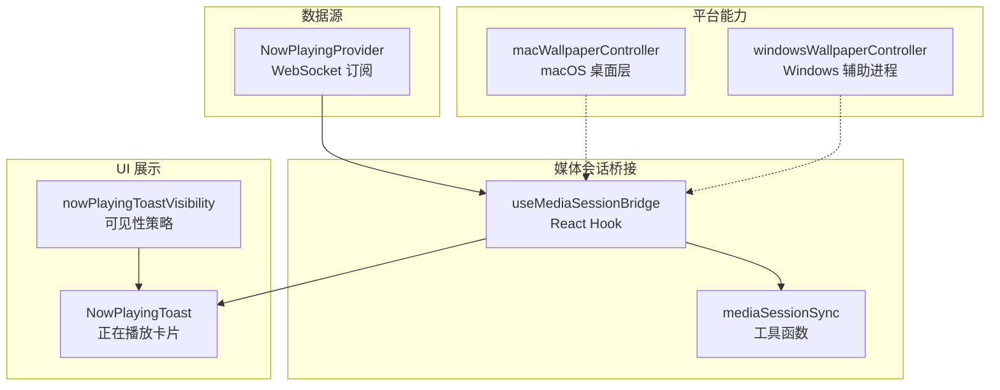
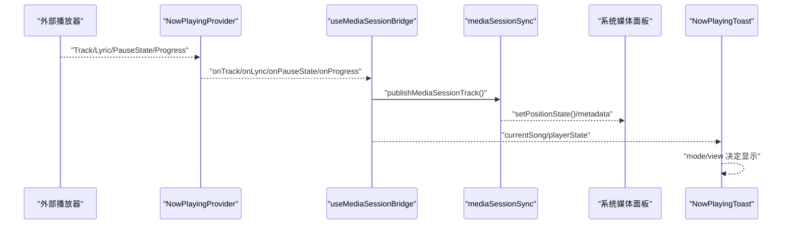
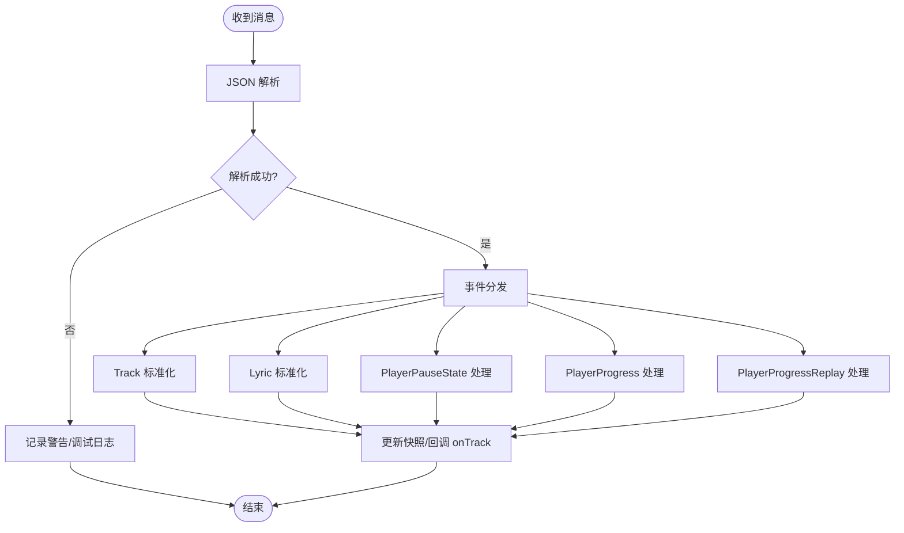
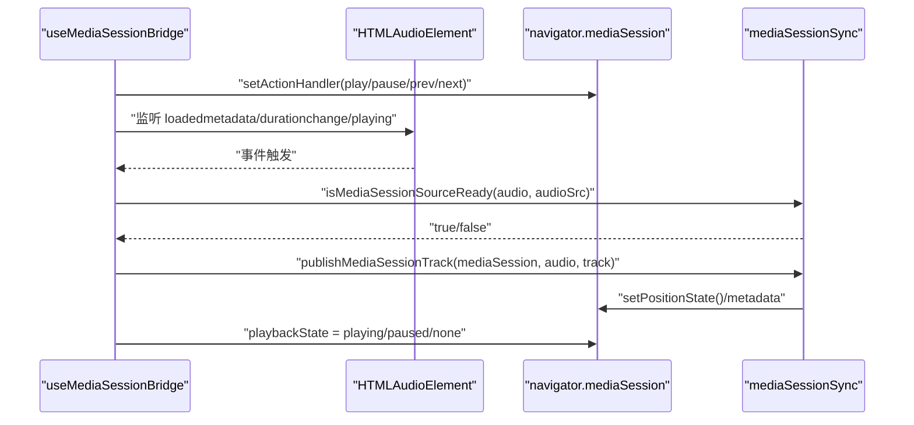
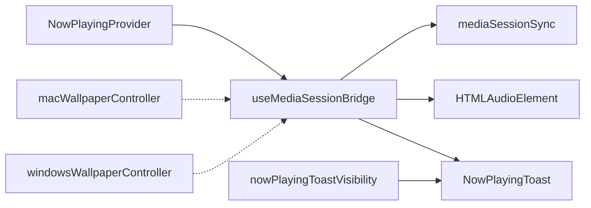

# Now Playing 服务

<cite>
**本文引用的文件**   
- [nowPlayingProvider.ts](file://src/services/nowPlayingProvider.ts)
- [useMediaSessionBridge.ts](file://src/hooks/useMediaSessionBridge.ts)
- [mediaSessionSync.ts](file://src/utils/mediaSessionSync.ts)
- [nowPlayingClock.ts](file://src/utils/nowPlayingClock.ts)
- [NowPlayingToast.tsx](file://src/components/app/overlays/NowPlayingToast.tsx)
- [nowPlayingToastVisibility.ts](file://src/components/app/overlays/now-playing-toast/nowPlayingToastVisibility.ts)
- [macWallpaperController.cjs](file://electron/macWallpaperController.cjs)
- [windowsWallpaperController.cjs](file://electron/windowsWallpaperController.cjs)
</cite>

## 目录
1. [简介](#简介)
2. [项目结构](#项目结构)
3. [核心组件](#核心组件)
4. [架构总览](#架构总览)
5. [详细组件分析](#详细组件分析)
6. [依赖关系分析](#依赖关系分析)
7. [性能与调优](#性能与调优)
8. [故障诊断](#故障诊断)
9. [结论](#结论)
10. [附录：配置、平台与集成示例](#附录配置平台与集成示例)

## 简介
本技术文档聚焦 Folia Major 的 Now Playing 服务，覆盖系统级媒体信息显示、媒体会话 API 使用、跨平台兼容性、与系统原生应用的互操作性，以及配置、排障与性能调优。内容基于仓库中的实际实现进行梳理，包括：
- 通过 WebSocket 获取外部播放器的“正在播放”数据（曲目、歌词、进度、暂停状态）。
- 将应用内播放状态桥接到浏览器 Media Session API，以驱动锁屏界面、控制中心和通知中心同步。
- 在 Electron 环境下处理封面图协议限制，并适配不同平台的桌面层行为。
- 提供 UI 层的 Now Playing Toast 卡片，用于播放器与 Lattice 界面的轻量提示。

## 项目结构
Now Playing 相关代码分布在以下层次：
- 数据源层：WebSocket 订阅外部播放器事件，标准化为统一快照。
- 媒体会话层：React Hook 将播放状态、元数据和控制回调桥接到 Media Session。
- 工具层：媒体会话元数据与位置状态同步、时间校正与进度解析。
- UI 层：Now Playing Toast 卡片及其可见性策略。
- 平台层：Electron 下 macOS 与 Windows 的壁纸模式控制器（与系统级显示相关）。

**图表来源**
- [nowPlayingProvider.ts:236-489](file://src/services/nowPlayingProvider.ts#L236-L489)
- [useMediaSessionBridge.ts:38-209](file://src/hooks/useMediaSessionBridge.ts#L38-L209)
- [mediaSessionSync.ts:1-97](file://src/utils/mediaSessionSync.ts#L1-L97)
- [NowPlayingToast.tsx:55-282](file://src/components/app/overlays/NowPlayingToast.tsx#L55-L282)
- [nowPlayingToastVisibility.ts:7-19](file://src/components/app/overlays/now-playing-toast/nowPlayingToastVisibility.ts#L7-L19)
- [macWallpaperController.cjs:1-19](file://electron/macWallpaperController.cjs#L1-L19)
- [windowsWallpaperController.cjs:447-464](file://electron/windowsWallpaperController.cjs#L447-L464)

**章节来源**
- [nowPlayingProvider.ts:236-489](file://src/services/nowPlayingProvider.ts#L236-L489)
- [useMediaSessionBridge.ts:38-209](file://src/hooks/useMediaSessionBridge.ts#L38-L209)
- [mediaSessionSync.ts:1-97](file://src/utils/mediaSessionSync.ts#L1-L97)
- [NowPlayingToast.tsx:55-282](file://src/components/app/overlays/NowPlayingToast.tsx#L55-L282)
- [nowPlayingToastVisibility.ts:7-19](file://src/components/app/overlays/now-playing-toast/nowPlayingToastVisibility.ts#L7-L19)
- [macWallpaperController.cjs:1-19](file://electron/macWallpaperController.cjs#L1-L19)
- [windowsWallpaperController.cjs:447-464](file://electron/windowsWallpaperController.cjs#L447-L464)

## 核心组件
- NowPlayingProvider：负责连接外部播放器的 WebSocket，接收 Track、Lyric、PlayerPauseState、PlayerProgress、PlayerProgressReplay 等事件，标准化为统一的 NowPlayingProviderSnapshot，并通过回调通知上层。
- useMediaSessionBridge：将当前歌曲、音频元素、播放状态映射到 navigator.mediaSession，设置动作处理器（播放、暂停、上一首、下一首），更新媒体元数据与播放状态。
- mediaSessionSync：提供受支持的封面 URL 过滤、音频源就绪判断、位置状态构建与媒体会话元数据发布。
- nowPlayingClock：提供进度查询常量、RTT 补偿、阈值校正与响应解析工具。
- NowPlayingToast：UI 层正在播放卡片，支持 auto/always/never 显示模式、下一首预览、混音过渡边框动画。
- nowPlayingToastVisibility：根据视图与模式决定卡片是否显示。
- macWallpaperController / windowsWallpaperController：Electron 下平台特定的桌面层与辅助进程管理，影响系统级显示与交互。

**章节来源**
- [nowPlayingProvider.ts:236-489](file://src/services/nowPlayingProvider.ts#L236-L489)
- [useMediaSessionBridge.ts:38-209](file://src/hooks/useMediaSessionBridge.ts#L38-L209)
- [mediaSessionSync.ts:1-97](file://src/utils/mediaSessionSync.ts#L1-L97)
- [nowPlayingClock.ts:1-86](file://src/utils/nowPlayingClock.ts#L1-L86)
- [NowPlayingToast.tsx:55-282](file://src/components/app/overlays/NowPlayingToast.tsx#L55-L282)
- [nowPlayingToastVisibility.ts:7-19](file://src/components/app/overlays/now-playing-toast/nowPlayingToastVisibility.ts#L7-L19)
- [macWallpaperController.cjs:1-19](file://electron/macWallpaperController.cjs#L1-L19)
- [windowsWallpaperController.cjs:447-464](file://electron/windowsWallpaperController.cjs#L447-L464)

## 架构总览
Now Playing 服务的数据流与控制流如下：
- 外部播放器通过 WebSocket 推送事件；NowPlayingProvider 解析并标准化。
- React Hook 监听播放状态变化，调用 mediaSessionSync 更新 Media Session。
- UI 层根据模式与视图决定是否渲染 NowPlayingToast。
- Electron 平台层在不同操作系统上提供不同的桌面层能力，间接影响系统级显示与交互体验。

**图表来源**
- [nowPlayingProvider.ts:332-460](file://src/services/nowPlayingProvider.ts#L332-L460)
- [useMediaSessionBridge.ts:109-192](file://src/hooks/useMediaSessionBridge.ts#L109-L192)
- [mediaSessionSync.ts:75-96](file://src/utils/mediaSessionSync.ts#L75-L96)
- [NowPlayingToast.tsx:86-101](file://src/components/app/overlays/NowPlayingToast.tsx#L86-L101)

## 详细组件分析

### NowPlayingProvider：外部播放器数据接入
- 功能要点：
  - 建立 WebSocket 连接，处理 open/message/error/close。
  - 解析事件类型：Track、Lyric、PlayerPauseState、PlayerProgress、PlayerProgressReplay。
  - 标准化字段：标题、作者、专辑、封面、时长、歌词、进度、暂停状态。
  - 去重比较：areTracksEqual/areLyricsEqual 避免重复回调。
  - 进度质量区分：precise/coarse，结合最近精确进度与粗粒度百分比。
  - 断线重连：固定延迟重试。
- 关键数据结构：
  - NowPlayingProviderSnapshot：connectionStatus、track、lyric、isPaused、progressMs。
  - NowPlayingTrackMessage/NowPlayingLyricMessage/NowPlayingPlayerStateMessage：原始消息体。
- 错误处理：
  - JSON 解析失败时记录警告，保留调试日志开关。
  - 非字符串 payload 直接忽略。
- 性能考虑：
  - 去重比较减少不必要的 UI 刷新。
  - 进度合并策略降低高频更新抖动。

**图表来源**
- [nowPlayingProvider.ts:332-460](file://src/services/nowPlayingProvider.ts#L332-L460)

**章节来源**
- [nowPlayingProvider.ts:236-489](file://src/services/nowPlayingProvider.ts#L236-L489)

### useMediaSessionBridge：媒体会话桥接
- 功能要点：
  - 绑定 MediaSession 动作处理器：play/pause/previoustrack/nexttrack。
  - 清理无歌曲时的媒体会话状态。
  - 根据当前歌曲与音频元素发布媒体元数据与位置状态。
  - 处理 Electron 自定义协议封面不支持问题，临时转换为 blob URL。
  - 更新 playbackState：playing/paused/none。
- 关键逻辑：
  - isMediaSessionSourceReady：确保音频源就绪且匹配预期 source。
  - publishMediaSessionTrack：先 setPositionState，再设置 metadata。
  - prepareUnsupportedArtwork：fetch 封面并生成 object URL，生命周期内有效。
- 错误处理：
  - setActionHandlerSafely 捕获异常并记录警告。
  - 封面请求失败或无效时降级为空。

**图表来源**
- [useMediaSessionBridge.ts:53-107](file://src/hooks/useMediaSessionBridge.ts#L53-L107)
- [useMediaSessionBridge.ts:109-192](file://src/hooks/useMediaSessionBridge.ts#L109-L192)
- [mediaSessionSync.ts:37-96](file://src/utils/mediaSessionSync.ts#L37-L96)

**章节来源**
- [useMediaSessionBridge.ts:38-209](file://src/hooks/useMediaSessionBridge.ts#L38-L209)
- [mediaSessionSync.ts:1-97](file://src/utils/mediaSessionSync.ts#L1-L97)

### mediaSessionSync：媒体会话工具
- 功能要点：
  - getSupportedMediaSessionArtworkUrl：仅允许 http/https/data/blob 协议。
  - isMediaSessionSourceReady：校验 readyState、duration、currentSrc 与 expectedSource。
  - createMediaSessionPositionState：构建 MediaPositionState，边界保护 currentTime/playbackRate。
  - publishMediaSessionTrack：先设置位置状态，再设置元数据，避免 Chromium 清空 session。
- 复杂度与健壮性：
  - URL 规范化与相对路径处理。
  - 数值边界保护与默认值回退。

**章节来源**
- [mediaSessionSync.ts:1-97](file://src/utils/mediaSessionSync.ts#L1-L97)

### nowPlayingClock：进度校正与解析
- 功能要点：
  - resolveNowPlayingAnchorTime：RTT 半补偿，暂停时不补偿。
  - shouldApplyNowPlayingProgressCorrection：阈值判定是否修正显示时间。
  - parseNowPlayingProgressResponseMs：安全解析毫秒数。
  - buildNowPlayingContentLoadKey：基于 track/lyric 生成内容缓存键。
- 适用场景：
  - 与外部播放器进度接口配合，提升时间一致性。

**章节来源**
- [nowPlayingClock.ts:1-86](file://src/utils/nowPlayingClock.ts#L1-L86)

### NowPlayingToast：UI 层正在播放卡片
- 功能要点：
  - 显示模式：auto/always/never，支持超时隐藏与 holdOpen 保持。
  - 下一首预览：isNextUp 切换标签与内容。
  - 混音过渡边框：懒加载着色器组件，ResizeObserver 测量卡片尺寸。
  - 封面加载失败回退占位图标。
- 交互与可访问性：
  - 可选 onActivate 与 activateLabel，支持键盘焦点与无障碍描述。
- 视觉与动画：
  - framer-motion 进场/退场动画，底部对齐播放器底栏。

**章节来源**
- [NowPlayingToast.tsx:55-282](file://src/components/app/overlays/NowPlayingToast.tsx#L55-L282)

### nowPlayingToastVisibility：可见性策略
- 规则：
  - mode !== 'never' 且 view 为 player/lattice 或 home 且 showOnHome 为真时显示。
- 作用：
  - 保证卡片与 next-track 倒计时在同一组视图中显示。

**章节来源**
- [nowPlayingToastVisibility.ts:7-19](file://src/components/app/overlays/now-playing-toast/nowPlayingToastVisibility.ts#L7-L19)

### 平台层：macOS 与 Windows 桌面层控制
- macOS：
  - 通过 FFI 将 BrowserWindow 沉入桌面层，低于 Finder 图标，高于系统壁纸。
  - 使用 CGEventTap 监听点击并转发至渲染进程。
  - Dock 自动隐藏与崩溃安全标记。
- Windows：
  - 借助辅助进程重父窗口到 WorkerW，实现壁纸模式。
  - 提供 attach/detach/killHelper/handleHelperEvent 等接口。

**章节来源**
- [macWallpaperController.cjs:1-19](file://electron/macWallpaperController.cjs#L1-L19)
- [windowsWallpaperController.cjs:447-464](file://electron/windowsWallpaperController.cjs#L447-L464)

## 依赖关系分析
Now Playing 服务的模块耦合与协作如下：
- NowPlayingProvider 独立于 UI，仅通过回调暴露数据。
- useMediaSessionBridge 依赖 mediaSessionSync 与 HTMLAudioElement。
- NowPlayingToast 依赖模式与视图状态，不直接依赖数据源。
- 平台控制器与媒体会话桥接为弱耦合，仅在 Electron 环境生效。

**图表来源**
- [nowPlayingProvider.ts:236-489](file://src/services/nowPlayingProvider.ts#L236-L489)
- [useMediaSessionBridge.ts:38-209](file://src/hooks/useMediaSessionBridge.ts#L38-L209)
- [mediaSessionSync.ts:1-97](file://src/utils/mediaSessionSync.ts#L1-L97)
- [NowPlayingToast.tsx:55-282](file://src/components/app/overlays/NowPlayingToast.tsx#L55-L282)
- [nowPlayingToastVisibility.ts:7-19](file://src/components/app/overlays/now-playing-toast/nowPlayingToastVisibility.ts#L7-L19)
- [macWallpaperController.cjs:1-19](file://electron/macWallpaperController.cjs#L1-L19)
- [windowsWallpaperController.cjs:447-464](file://electron/windowsWallpaperController.cjs#L447-L464)

**章节来源**
- [nowPlayingProvider.ts:236-489](file://src/services/nowPlayingProvider.ts#L236-L489)
- [useMediaSessionBridge.ts:38-209](file://src/hooks/useMediaSessionBridge.ts#L38-L209)
- [mediaSessionSync.ts:1-97](file://src/utils/mediaSessionSync.ts#L1-L97)
- [NowPlayingToast.tsx:55-282](file://src/components/app/overlays/NowPlayingToast.tsx#L55-L282)
- [nowPlayingToastVisibility.ts:7-19](file://src/components/app/overlays/now-playing-toast/nowPlayingToastVisibility.ts#L7-L19)
- [macWallpaperController.cjs:1-19](file://electron/macWallpaperController.cjs#L1-L19)
- [windowsWallpaperController.cjs:447-464](file://electron/windowsWallpaperController.cjs#L447-L464)

## 性能与调优
- 进度更新频率：
  - 使用 precise/coarse 两种质量级别，优先使用最近精确进度，避免频繁 UI 刷新。
- 去重与最小化重绘：
  - areTracksEqual/areLyricsEqual 减少不必要的回调。
- 封面图加载：
  - 仅允许受支持协议，必要时转换为 blob URL，避免 Electron 自定义协议导致的元数据拒绝。
- RTT 补偿：
  - 在播放移动时进行半 RTT 补偿，提高时间一致性。
- 资源释放：
  - 及时撤销 object URL，移除事件监听，防止内存泄漏。

[本节为通用指导，无需具体文件引用]

## 故障诊断
常见问题与定位方法：
- 媒体会话元数据未更新：
  - 检查 isMediaSessionSourceReady 返回 false 的原因（readyState、duration、currentSrc 不匹配）。
  - 确认 publishMediaSessionTrack 先设置 positionState 再设置 metadata。
- 封面图不显示：
  - 检查 getSupportedMediaSessionArtworkUrl 是否过滤了协议。
  - 在 Electron 中确认 prepareUnsupportedArtwork 是否成功生成 blob URL。
- 进度跳变或不一致：
  - 查看 nowPlayingClock 的 RTT 补偿与阈值校正逻辑。
  - 核对外部播放器提供的 progress 单位（秒/毫秒）是否正确归一化。
- WebSocket 连接不稳定：
  - 观察 NowPlayingProvider 的连接状态与重连定时器。
  - 启用 debug 模式查看原始消息与解析结果。

**章节来源**
- [useMediaSessionBridge.ts:109-192](file://src/hooks/useMediaSessionBridge.ts#L109-L192)
- [mediaSessionSync.ts:37-96](file://src/utils/mediaSessionSync.ts#L37-L96)
- [nowPlayingClock.ts:25-53](file://src/utils/nowPlayingClock.ts#L25-L53)
- [nowPlayingProvider.ts:300-330](file://src/services/nowPlayingProvider.ts#L300-L330)

## 结论
Folia Major 的 Now Playing 服务通过外部播放器 WebSocket 数据接入、React Hook 媒体会话桥接与工具层同步，实现了跨平台的系统级媒体信息显示。UI 层提供灵活的正在播放卡片，支持多种显示模式与过渡动画。平台层在 macOS 与 Windows 上分别采用不同的桌面层策略，增强系统集成体验。整体设计注重健壮性、性能与可维护性，适合扩展更多平台与集成场景。

[本节为总结性内容，无需具体文件引用]

## 附录：配置、平台与集成示例

### 配置选项
- NowPlayingProvider：
  - wsUrl：WebSocket 地址，默认 ws://localhost:9863/api/ws/lyric。
  - debug：是否输出调试日志。
  - 回调：onConnectionStatusChange、onTrack、onLyric、onPauseState、onProgress。
- useMediaSessionBridge：
  - audioRef/getDisplayAudioElement：音频元素引用。
  - audioSrc/currentSong/cachedCoverUrl/playerState：播放上下文。
  - isNowPlayingStageActive：是否禁用系统控制。
  - mediaSessionPlayRef/PauseRef/PrevRef/NextRef：控制回调。
  - isNowPlayingControlDisabledRef：控制开关。
- NowPlayingToast：
  - mode：auto/always/never。
  - timeoutSec：auto 模式下的显示时长。
  - nextUp/isNextUp：下一首预览。
  - theme/isDaylight：主题与明暗模式。
  - onActivate/activateLabel：交互与无障碍。

**章节来源**
- [nowPlayingProvider.ts:253-257](file://src/services/nowPlayingProvider.ts#L253-L257)
- [useMediaSessionBridge.ts:13-36](file://src/hooks/useMediaSessionBridge.ts#L13-L36)
- [NowPlayingToast.tsx:35-53](file://src/components/app/overlays/NowPlayingToast.tsx#L35-L53)

### 跨平台兼容性
- Web 浏览器：
  - 依赖 navigator.mediaSession，需检查存在性。
  - 封面协议限制：仅 http/https/data/blob。
- Electron：
  - 自定义协议封面需转换为 blob URL。
  - macOS/Windows 桌面层控制器提供系统级显示能力。

**章节来源**
- [useMediaSessionBridge.ts:53-56](file://src/hooks/useMediaSessionBridge.ts#L53-L56)
- [mediaSessionSync.ts:22-35](file://src/utils/mediaSessionSync.ts#L22-L35)
- [macWallpaperController.cjs:1-19](file://electron/macWallpaperController.cjs#L1-L19)
- [windowsWallpaperController.cjs:447-464](file://electron/windowsWallpaperController.cjs#L447-L464)

### 与系统原生应用的互操作性
- 快捷键映射：
  - 通过 MediaSession 动作处理器绑定系统播放控制（播放、暂停、上一首、下一首）。
- 全局控制：
  - 系统媒体面板可直接控制应用播放状态。
- 系统集成：
  - 锁屏界面、控制中心、通知中心同步显示元数据与进度。

**章节来源**
- [useMediaSessionBridge.ts:53-107](file://src/hooks/useMediaSessionBridge.ts#L53-L107)
- [useMediaSessionBridge.ts:194-209](file://src/hooks/useMediaSessionBridge.ts#L194-L209)

### 实际使用场景与集成示例
- 场景一：外部播放器正在播放，应用内显示 NowPlayingToast。
  - 步骤：启动 NowPlayingProvider -> 接收 Track/Lyric -> 更新 UI。
- 场景二：系统媒体面板控制播放。
  - 步骤：用户点击系统播放按钮 -> MediaSession 触发 play -> 应用执行播放回调。
- 场景三：Electron 下封面图显示。
  - 步骤：检测协议不支持 -> fetch 封面 -> 生成 blob URL -> 发布元数据。

**章节来源**
- [nowPlayingProvider.ts:332-460](file://src/services/nowPlayingProvider.ts#L332-L460)
- [useMediaSessionBridge.ts:70-99](file://src/hooks/useMediaSessionBridge.ts#L70-L99)
- [useMediaSessionBridge.ts:152-176](file://src/hooks/useMediaSessionBridge.ts#L152-L176)