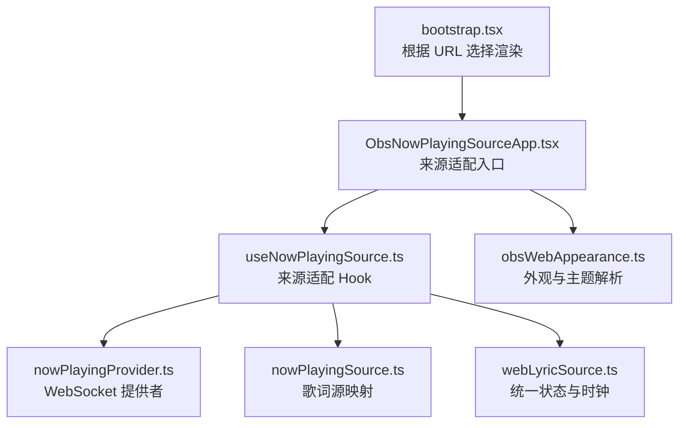
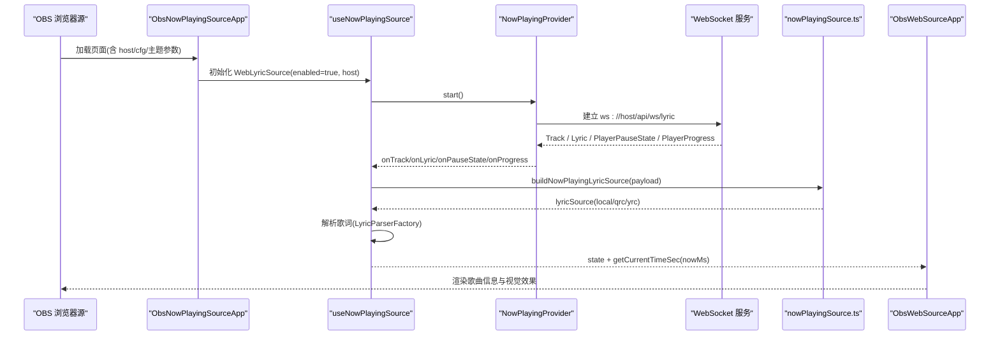
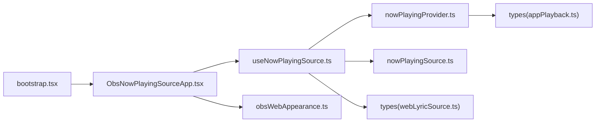

# Now Playing 插件

<cite>
**本文引用的文件**   
- [ObsNowPlayingSourceApp.tsx](file://src/components/obs/ObsNowPlayingSourceApp.tsx)
- [useNowPlayingSource.ts](file://src/hooks/useNowPlayingSource.ts)
- [nowPlayingProvider.ts](file://src/services/nowPlayingProvider.ts)
- [nowPlayingSource.ts](file://src/utils/lyrics/nowPlayingSource.ts)
- [webLyricSource.ts](file://src/types/webLyricSource.ts)
- [appPlayback.ts](file://src/types/appPlayback.ts)
- [obsWebAppearance.ts](file://src/utils/obsWebAppearance.ts)
- [bootstrap.tsx](file://src/bootstrap.tsx)
</cite>

## 目录
1. [简介](#简介)
2. [项目结构](#项目结构)
3. [核心组件](#核心组件)
4. [架构总览](#架构总览)
5. [详细组件分析](#详细组件分析)
6. [依赖关系分析](#依赖关系分析)
7. [性能与稳定性](#性能与稳定性)
8. [OBS 配置指南](#obs-配置指南)
9. [使用示例](#使用示例)
10. [故障排查](#故障排查)
11. [结论](#结论)

## 简介
本技术文档面向 Folia Major 的 OBS Now Playing 插件，聚焦 ObsNowPlayingSourceApp 组件的实现原理与数据流。内容涵盖：
- 媒体会话监听、播放状态同步与歌词显示机制
- 音频播放状态获取、歌曲信息提取与视觉效果渲染
- 与系统媒体会话（通过 WebSocket）的集成：播放控制、进度跟踪与元数据同步
- OBS 配置指南：插件安装、URL 设置与样式定制
- 直播中显示当前播放歌曲信息与动态视觉效果的实践示例

## 项目结构
OBS Now Playing 以“来源适配 + 统一状态 + 外观驱动”的方式组织：
- 入口与路由：bootstrap.tsx 根据 URL 参数选择渲染 ObsNowPlayingSourceApp
- 来源适配层：ObsNowPlayingSourceApp 将 useNowPlayingSource 提供的 WebLyricSource 注入到通用外壳 ObsWebSourceApp
- 数据提供者：useNowPlayingSource 封装 NowPlayingProvider（WebSocket I/O），并复用歌词解析管线
- 类型契约：webLyricSource.ts 定义统一的 WebLyricSource 状态与时钟模型
- 外观配置：obsWebAppearance.ts 解析 URL 短码 cfg 与主题模式，生成渲染外观

图表来源
- [bootstrap.tsx:9-50](file://src/bootstrap.tsx#L9-L50)
- [ObsNowPlayingSourceApp.tsx:12-23](file://src/components/obs/ObsNowPlayingSourceApp.tsx#L12-L23)
- [useNowPlayingSource.ts:21-109](file://src/hooks/useNowPlayingSource.ts#L21-L109)
- [nowPlayingProvider.ts:236-488](file://src/services/nowPlayingProvider.ts#L236-L488)
- [nowPlayingSource.ts:8-40](file://src/utils/lyrics/nowPlayingSource.ts#L8-L40)
- [webLyricSource.ts:13-40](file://src/types/webLyricSource.ts#L13-L40)
- [obsWebAppearance.ts:69-187](file://src/utils/obsWebAppearance.ts#L69-L187)

章节来源
- [bootstrap.tsx:9-50](file://src/bootstrap.tsx#L9-L50)
- [ObsNowPlayingSourceApp.tsx:12-23](file://src/components/obs/ObsNowPlayingSourceApp.tsx#L12-L23)

## 核心组件
- ObsNowPlayingSourceApp：OBS 覆盖层的来源适配入口，负责从 URL 解析 host/cfg/主题等参数，构建外观并挂载通用外壳 ObsWebSourceApp。
- useNowPlayingSource：将上游 NowPlayingProvider（WebSocket I/O）适配为 WebLyricSource，维护连接状态、歌曲信息、歌词与播放时钟。
- NowPlayingProvider：管理 WebSocket 连接、事件分发、去重与断线重连；标准化 Track/Lyric/PlayerPauseState/PlayerProgress 消息。
- nowPlayingSource.ts：将 NowPlayingLyricPayload 映射为 StageLyricsSession 所需的 lyricSource，支持 LRC/YRC/QRC 与翻译歌词。
- webLyricSource.ts：定义 WebLyricSource 的统一状态与时钟模型，供上层渲染消费。
- obsWebAppearance.ts：解析 URL 参数与 cfg 短码，生成 ObsWebAppearance，驱动可视化模式、背景、字体与字幕行为。

章节来源
- [ObsNowPlayingSourceApp.tsx:12-23](file://src/components/obs/ObsNowPlayingSourceApp.tsx#L12-L23)
- [useNowPlayingSource.ts:21-109](file://src/hooks/useNowPlayingSource.ts#L21-L109)
- [nowPlayingProvider.ts:236-488](file://src/services/nowPlayingProvider.ts#L236-L488)
- [nowPlayingSource.ts:8-40](file://src/utils/lyrics/nowPlayingSource.ts#L8-L40)
- [webLyricSource.ts:13-40](file://src/types/webLyricSource.ts#L13-L40)
- [obsWebAppearance.ts:69-187](file://src/utils/obsWebAppearance.ts#L69-L187)

## 架构总览
Now Playing 的数据流遵循“来源适配 → 统一状态 → 外观渲染”的分层设计：
- 来源适配层：ObsNowPlayingSourceApp 将 useNowPlayingSource 产出的 WebLyricSource 注入 ObsWebSourceApp
- 数据提供者层：useNowPlayingSource 订阅 NowPlayingProvider 的事件，更新 WebLyricSourceState 与 clock
- 歌词处理层：nowPlayingSource.ts 将原始 payload 转换为 StageLyricsSession 可消费的 lyricSource，交由 LyricParserFactory 解析
- 外观层：obsWebAppearance.ts 解析 cfg 与 URL 参数，决定可视化模式、背景、字体与字幕策略

图表来源
- [ObsNowPlayingSourceApp.tsx:12-23](file://src/components/obs/ObsNowPlayingSourceApp.tsx#L12-L23)
- [useNowPlayingSource.ts:34-109](file://src/hooks/useNowPlayingSource.ts#L34-L109)
- [nowPlayingProvider.ts:300-461](file://src/services/nowPlayingProvider.ts#L300-L461)
- [nowPlayingSource.ts:8-40](file://src/utils/lyrics/nowPlayingSource.ts#L8-L40)

## 详细组件分析

### ObsNowPlayingSourceApp 组件
职责：
- 解析 URL 参数（host、cfg、isDaylight、transparent、visualizer、themeMode）
- 构建外观对象（buildObsAppearanceFromShortcode）
- 创建 WebLyricSource（useNowPlayingSource）并注入 ObsWebSourceApp

关键点：
- 默认 host 为 localhost:9863
- 外观由 cfg 短码与 URL 标志位共同决定，支持静态/内置/AI 主题模式

章节来源
- [ObsNowPlayingSourceApp.tsx:12-23](file://src/components/obs/ObsNowPlayingSourceApp.tsx#L12-L23)
- [obsWebAppearance.ts:69-187](file://src/utils/obsWebAppearance.ts#L69-L187)

### useNowPlayingSource 钩子
职责：
- 生命周期：根据 enabled/host 创建 NowPlayingProvider，start/stop
- 状态映射：onTrack/onLyric/onPauseState/onProgress 更新 WebLyricSourceState
- 时钟锚点：使用 anchoredAtMs 与 playing 计算实时 positionSec，避免跳变

关键实现要点：
- 对 duration 进行秒/毫秒归一化，优先取 track 或 lyric 的 duration
- 歌词解析失败时保留现有歌词，避免闪烁
- pause/resume 时重新锚定时间，保证平滑过渡

章节来源
- [useNowPlayingSource.ts:21-109](file://src/hooks/useNowPlayingSource.ts#L21-L109)
- [webLyricSource.ts:13-40](file://src/types/webLyricSource.ts#L13-L40)

### NowPlayingProvider 提供者
职责：
- WebSocket 连接管理：open/close/reconnect
- 事件分发：Track / Lyric / PlayerPauseState / PlayerProgress / PlayerProgressReplay
- 数据标准化：normalizeNowPlayingTrack / normalizeNowPlayingLyricPayload
- 进度质量区分：precise/coarse，并在暂停事件中回退到 coarse 或最近 precise

健壮性：
- 去重比较：areTracksEqual / areLyricsEqual 避免重复回调
- 安全解码：decodeXmlEntities 与 QRC 内容提取
- 断线重连：固定延迟重试，清理定时器与 socket 引用

章节来源
- [nowPlayingProvider.ts:57-234](file://src/services/nowPlayingProvider.ts#L57-L234)
- [nowPlayingProvider.ts:236-488](file://src/services/nowPlayingProvider.ts#L236-L488)

### 歌词源映射 nowPlayingSource.ts
职责：
- 将 NowPlayingLyricPayload 转为 StageLyricsSession 可消费的 lyricSource
- 优先级：KARAOKE(YRC/QRC) > LRC，支持翻译歌词
- 格式提示：detectNonTtmlTimedLyricFormat 推断非 TTML 格式

章节来源
- [nowPlayingSource.ts:8-40](file://src/utils/lyrics/nowPlayingSource.ts#L8-L40)

### 统一状态与时钟 webLyricSource.ts
职责：
- 定义 WebLyricSourceState：connectionStatus、playerState、track、lyrics、clock
- 定义 WebLyricClock：positionSec/durationSec/anchoredAtMs/playing
- 提供 initialWebLyricSourceState 初始值

章节来源
- [webLyricSource.ts:13-50](file://src/types/webLyricSource.ts#L13-L50)

### 外观与主题 obsWebAppearance.ts
职责：
- 解析 URL 参数：host、cfg、daylight、transparent、visualizer、obsTheme
- 解析 AI 配置：当 obsTheme=ai 时返回 provider
- 构建外观：mode/background/font/subtitle 等字段，兼容 cfg 字段名映射

章节来源
- [obsWebAppearance.ts:23-94](file://src/utils/obsWebAppearance.ts#L23-L94)
- [obsWebAppearance.ts:103-187](file://src/utils/obsWebAppearance.ts#L103-L187)

## 依赖关系分析
- bootstrap.tsx 根据 URL 选择 ObsNowPlayingSourceApp
- ObsNowPlayingSourceApp 依赖 useNowPlayingSource 与 obsWebAppearance
- useNowPlayingSource 依赖 nowPlayingProvider 与 nowPlayingSource
- nowPlayingProvider 依赖 types（NowPlayingTrackSnapshot/NowPlayingLyricPayload）
- appPlayback.ts 定义了 NowPlayingClockState 等与窗口切换相关的类型

图表来源
- [bootstrap.tsx:9-50](file://src/bootstrap.tsx#L9-L50)
- [ObsNowPlayingSourceApp.tsx:12-23](file://src/components/obs/ObsNowPlayingSourceApp.tsx#L12-L23)
- [useNowPlayingSource.ts:21-109](file://src/hooks/useNowPlayingSource.ts#L21-L109)
- [nowPlayingProvider.ts:236-488](file://src/services/nowPlayingProvider.ts#L236-L488)
- [nowPlayingSource.ts:8-40](file://src/utils/lyrics/nowPlayingSource.ts#L8-L40)
- [webLyricSource.ts:13-40](file://src/types/webLyricSource.ts#L13-L40)
- [appPlayback.ts:73-93](file://src/types/appPlayback.ts#L73-L93)

章节来源
- [bootstrap.tsx:9-50](file://src/bootstrap.tsx#L9-L50)
- [appPlayback.ts:73-93](file://src/types/appPlayback.ts#L73-L93)

## 性能与稳定性
- 去重与最小化更新：areTracksEqual/areLyricsEqual 避免不必要的状态变更与重渲染
- 进度精度分层：precise 来自 PlayerProgress，coarse 来自 PlayerPauseState；在暂停事件中优先使用最近的 precise，避免抖动
- 时长单位归一化：normalizeDurationMs 自动识别秒/毫秒，防止异常时长导致 UI 错乱
- 断线重连：固定延迟重试，清理定时器与 socket 引用，保障长期运行稳定
- 歌词解析容错：解析失败不覆盖现有歌词，避免界面闪烁

章节来源
- [nowPlayingProvider.ts:57-83](file://src/services/nowPlayingProvider.ts#L57-L83)
- [nowPlayingProvider.ts:119-175](file://src/services/nowPlayingProvider.ts#L119-L175)
- [nowPlayingProvider.ts:388-453](file://src/services/nowPlayingProvider.ts#L388-L453)
- [nowPlayingProvider.ts:463-488](file://src/services/nowPlayingProvider.ts#L463-L488)

## OBS 配置指南
- 插件安装
  - 在 OBS 中添加“浏览器源”，指向应用内 Now Playing 覆盖层 URL
  - URL 需包含 host 参数（例如 localhost:9863），用于 WebSocket 连接
- URL 参数说明
  - host：后端主机地址（如 localhost:9863）
  - cfg：压缩的外观短码，用于复用主窗口的主题与可视化设置
  - daylight：是否启用浅色主题侧（1 表示启用）
  - transparent：是否透明背景（1 表示透明）
  - visualizer：指定内置可视化模式（空则使用 cfg 中的模式）
  - obsTheme：主题模式（static/builtin/ai），ai 模式下由运行时配置提供 AI 主题
- 样式定制
  - 通过 cfg 短码控制可视化模式、背景、字体、字幕行为等
  - 若 cfg 无效，将回退到默认外观与封面色主题，不会抛出错误
  - AI 主题模式无需在 URL 携带密钥，仅传递模式标记

章节来源
- [obsWebAppearance.ts:69-94](file://src/utils/obsWebAppearance.ts#L69-L94)
- [obsWebAppearance.ts:103-187](file://src/utils/obsWebAppearance.ts#L103-L187)

## 使用示例
- 显示当前播放歌曲信息与动态视觉效果
  - 在 OBS 浏览器源中设置 URL：包含 host=localhost:9863 与可选 cfg/transparent/daylight/visualizer/obsTheme
  - 播放开始后，NowPlayingProvider 推送 Track/Lyric/PlayerPauseState/PlayerProgress
  - useNowPlayingSource 更新 WebLyricSourceState，ObsWebSourceApp 渲染歌曲名称、艺术家、封面与歌词
  - 视觉效果根据 cfg 与 URL 参数选择内置模式或动态主题（builtin/ai）

- 歌词显示机制
  - 若存在 KARAOKE（YRC/QRC），优先使用；否则回退到 LRC
  - 支持翻译歌词（tLrcContent/translationContent）
  - 歌词解析失败时保留上一版歌词，避免界面闪烁

章节来源
- [useNowPlayingSource.ts:41-97](file://src/hooks/useNowPlayingSource.ts#L41-L97)
- [nowPlayingSource.ts:8-40](file://src/utils/lyrics/nowPlayingSource.ts#L8-L40)

## 故障排查
- WebSocket 无法连接
  - 检查 host 是否正确，确保 ws://host/api/ws/lyc 可达
  - 查看连接状态：connecting/connected/error/disabled
- 歌词不显示
  - 确认服务端已推送 Lyric 事件且 payload 包含可用歌词
  - 检查 nowPlayingSource.ts 的映射逻辑（YRC/QRC/LRC 优先级）
- 进度跳动或不准确
  - 检查 PlayerPauseState 与 PlayerProgress 的频率与精度
  - 确认 normalizePauseStateProgressMs 与 clampProgressMs 的处理结果
- 外观不生效
  - 校验 cfg 短码是否有效；无效时将回退默认外观
  - 确认 obsTheme 与 visualizerOverride 的优先级

章节来源
- [nowPlayingProvider.ts:300-461](file://src/services/nowPlayingProvider.ts#L300-L461)
- [nowPlayingProvider.ts:463-488](file://src/services/nowPlayingProvider.ts#L463-L488)
- [nowPlayingSource.ts:8-40](file://src/utils/lyrics/nowPlayingSource.ts#L8-L40)
- [obsWebAppearance.ts:103-187](file://src/utils/obsWebAppearance.ts#L103-L187)

## 结论
Folia Major 的 OBS Now Playing 插件通过清晰的来源适配、统一状态与外观驱动，实现了稳定的媒体会话监听、播放状态同步与歌词显示。NowPlayingProvider 提供了健壮的 WebSocket 管理与数据标准化，useNowPlayingSource 将 I/O 与渲染解耦，obsWebAppearance 让外观配置灵活可控。结合 OBS 浏览器源，用户可在直播中实时展示当前播放的歌曲信息与动态视觉效果，获得一致且高质量的观感体验。