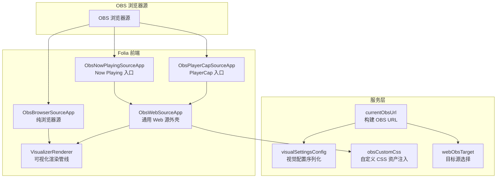
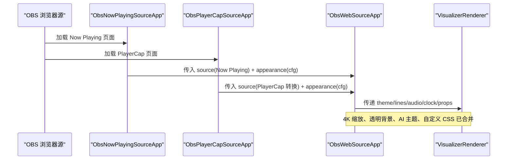
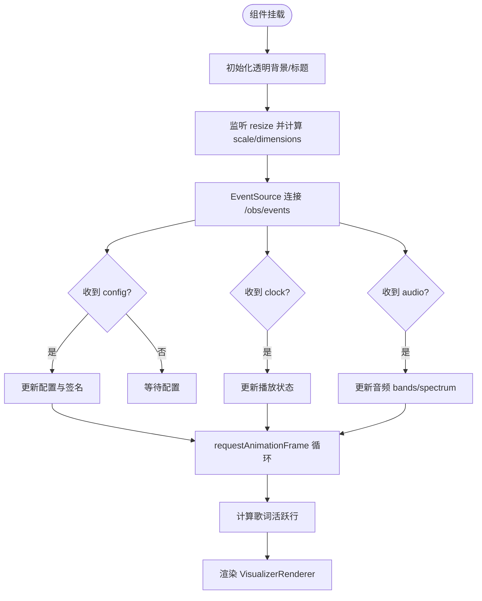
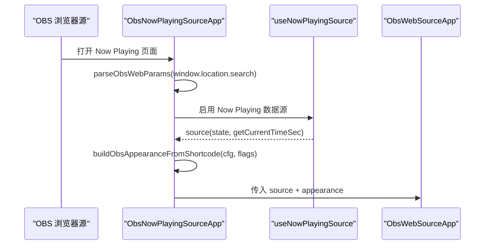
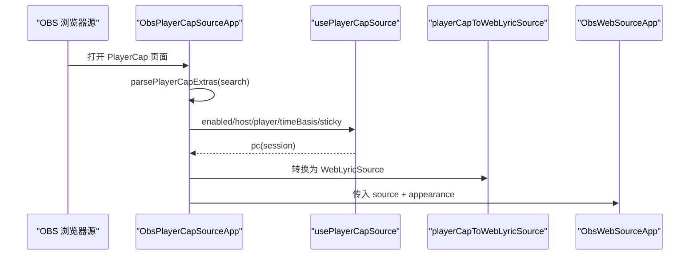
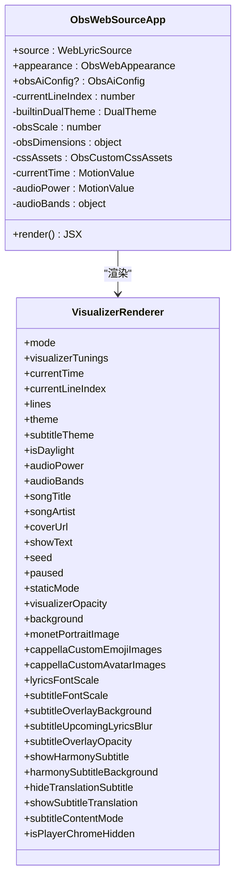
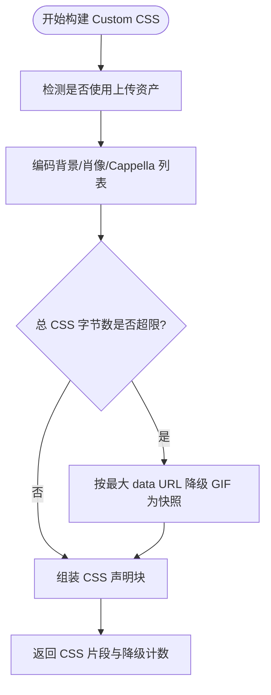
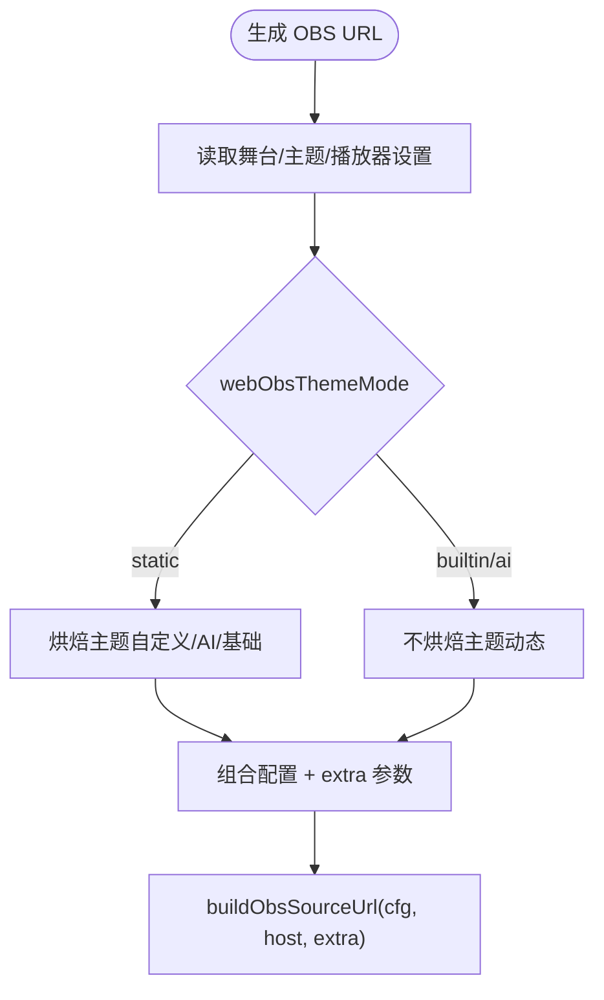
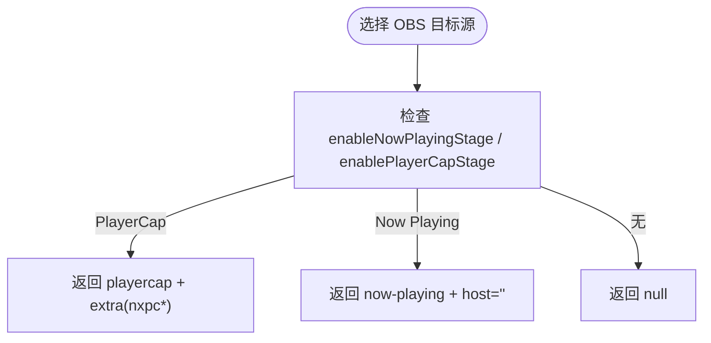
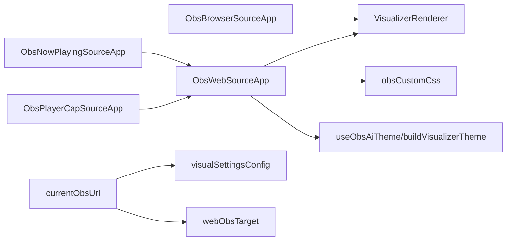

# OBS Studio 集成

<cite>
**本文引用的文件**   
- [ObsBrowserSourceApp.tsx](file://src/components/obs/ObsBrowserSourceApp.tsx)
- [ObsNowPlayingSourceApp.tsx](file://src/components/obs/ObsNowPlayingSourceApp.tsx)
- [ObsPlayerCapSourceApp.tsx](file://src/components/obs/ObsPlayerCapSourceApp.tsx)
- [ObsWebSourceApp.tsx](file://src/components/obs/ObsWebSourceApp.tsx)
- [currentObsUrl.ts](file://src/services/obs/currentObsUrl.ts)
- [obsCustomCss.ts](file://src/services/obs/obsCustomCss.ts)
- [visualSettingsConfig.ts](file://src/services/obs/visualSettingsConfig.ts)
- [webObsTarget.ts](file://src/services/obs/webObsTarget.ts)
</cite>

## 目录
1. [简介](#简介)
2. [项目结构](#项目结构)
3. [核心组件](#核心组件)
4. [架构总览](#架构总览)
5. [详细组件分析](#详细组件分析)
6. [依赖关系分析](#依赖关系分析)
7. [性能考虑](#性能考虑)
8. [故障排查指南](#故障排查指南)
9. [结论](#结论)
10. [附录：OBS 配置与示例](#附录obs-配置与示例)

## 简介
本技术文档面向在 OBS Studio 中使用 Folia Major 的开发者与内容创作者，系统性说明以下能力：
- 浏览器源支持：实时数据推送、事件流、样式定制与响应式布局。
- Now Playing 插件实现：媒体会话监听、播放状态同步、歌词显示与视觉效果渲染。
- Web Source 组件架构：React 应用嵌入、事件处理与生命周期管理。
- 自定义 CSS 支持：主题适配、动画效果与交互反馈。
- OBS 配置指南、常见问题解决方案与性能优化建议。
- 实际集成示例与调试技巧。

## 项目结构
Folia 的 OBS 集成由“浏览器源入口 + 通用 Web 源外壳 + 视觉设置与主题工具”组成：
- 浏览器源入口：为不同数据源提供最小化启动壳（纯浏览器源、Now Playing、PlayerCap）。
- 通用 Web 源外壳：统一消费 WebLyricSource，驱动 VisualizerRenderer，负责 4K 缩放、透明背景、AI 主题与自定义 CSS。
- 服务层：生成 OBS URL、压缩视觉配置、注入自定义 CSS 资产、选择目标源。

**图表来源**
- [ObsNowPlayingSourceApp.tsx:1-27](file://src/components/obs/ObsNowPlayingSourceApp.tsx#L1-L27)
- [ObsPlayerCapSourceApp.tsx:1-51](file://src/components/obs/ObsPlayerCapSourceApp.tsx#L1-L51)
- [ObsBrowserSourceApp.tsx:1-230](file://src/components/obs/ObsBrowserSourceApp.tsx#L1-L230)
- [ObsWebSourceApp.tsx:1-268](file://src/components/obs/ObsWebSourceApp.tsx#L1-L268)
- [currentObsUrl.ts:1-61](file://src/services/obs/currentObsUrl.ts#L1-L61)
- [visualSettingsConfig.ts:1-163](file://src/services/obs/visualSettingsConfig.ts#L1-L163)
- [obsCustomCss.ts:1-363](file://src/services/obs/obsCustomCss.ts#L1-L363)
- [webObsTarget.ts:1-40](file://src/services/obs/webObsTarget.ts#L1-L40)

**章节来源**
- [ObsNowPlayingSourceApp.tsx:1-27](file://src/components/obs/ObsNowPlayingSourceApp.tsx#L1-L27)
- [ObsPlayerCapSourceApp.tsx:1-51](file://src/components/obs/ObsPlayerCapSourceApp.tsx#L1-L51)
- [ObsBrowserSourceApp.tsx:1-230](file://src/components/obs/ObsBrowserSourceApp.tsx#L1-L230)
- [ObsWebSourceApp.tsx:1-268](file://src/components/obs/ObsWebSourceApp.tsx#L1-L268)
- [currentObsUrl.ts:1-61](file://src/services/obs/currentObsUrl.ts#L1-L61)
- [visualSettingsConfig.ts:1-163](file://src/services/obs/visualSettingsConfig.ts#L1-L63)
- [obsCustomCss.ts:1-363](file://src/services/obs/obsCustomCss.ts#L1-L363)
- [webObsTarget.ts:1-40](file://src/services/obs/webObsTarget.ts#L1-L40)

## 核心组件
- ObsBrowserSourceApp：纯浏览器源渲染器，通过 Server-Sent Events 订阅 /obs/events，接收配置、时钟与音频数据，驱动可视化。
- ObsNowPlayingSourceApp：将 Now Playing 数据源接入通用 Web 源外壳，外观由 URL cfg 参数解析。
- ObsPlayerCapSourceApp：将 PlayerCap 数据源转换为 WebLyricSource，并透传连接参数（host/player/timeBasis/sticky）。
- ObsWebSourceApp：通用外壳，消费 WebLyricSource，统一处理 4K 缩放、透明背景、AI 主题、自定义 CSS 与字体栈，最终渲染到 VisualizerRenderer。
- currentObsUrl：根据当前视觉设置生成 OBS 静态 URL，包含主题、模式、透明度等参数。
- visualSettingsConfig：序列化除主题外的全部视觉设置，保证导入/导出与 OBS URL 一致。
- obsCustomCss：将上传的背景、肖像、Cappella 表情/头像编码为 data URL，并通过 :root 自定义属性注入 OBS 浏览器源的 Custom CSS 字段。
- webObsTarget：决定当前要复制的 OBS 目标源（Now Playing 或 PlayerCap）及其非默认连接参数。

**章节来源**
- [ObsBrowserSourceApp.tsx:1-230](file://src/components/obs/ObsBrowserSourceApp.tsx#L1-L230)
- [ObsNowPlayingSourceApp.tsx:1-27](file://src/components/obs/ObsNowPlayingSourceApp.tsx#L1-L27)
- [ObsPlayerCapSourceApp.tsx:1-51](file://src/components/obs/ObsPlayerCapSourceApp.tsx#L1-L51)
- [ObsWebSourceApp.tsx:1-268](file://src/components/obs/ObsWebSourceApp.tsx#L1-L268)
- [currentObsUrl.ts:1-61](file://src/services/obs/currentObsUrl.ts#L1-L61)
- [visualSettingsConfig.ts:1-163](file://src/services/obs/visualSettingsConfig.ts#L1-L163)
- [obsCustomCss.ts:1-363](file://src/services/obs/obsCustomCss.ts#L1-L363)
- [webObsTarget.ts:1-40](file://src/services/obs/webObsTarget.ts#L1-L40)

## 架构总览
下图展示从 OBS 浏览器源到 Folia 渲染管线的端到端流程，包括 Now Playing 与 PlayerCap 两种数据源路径。

**图表来源**
- [ObsNowPlayingSourceApp.tsx:12-23](file://src/components/obs/ObsNowPlayingSourceApp.tsx#L12-L23)
- [ObsPlayerCapSourceApp.tsx:33-47](file://src/components/obs/ObsPlayerCapSourceApp.tsx#L33-L47)
- [ObsWebSourceApp.tsx:35-267](file://src/components/obs/ObsWebSourceApp.tsx#L35-L267)

## 详细组件分析

### 纯浏览器源：ObsBrowserSourceApp
职责与行为：
- 使用 EventSource 订阅 /obs/events，接收三类事件：config（配置）、clock（播放时钟）、audio（音频能量与频谱）。
- 维护 motion values（bass/lowMid/mid/vocal/treble/spectrum）供可视化使用。
- 计算歌词活跃行索引，驱动歌词高亮。
- 响应窗口尺寸变化，模拟 1920x1080 布局并在 4K 设备上保持文本清晰度。
- 将配置与媒体信息传递给 VisualizerRenderer。

**图表来源**
- [ObsBrowserSourceApp.tsx:55-111](file://src/components/obs/ObsBrowserSourceApp.tsx#L55-L111)
- [ObsBrowserSourceApp.tsx:113-146](file://src/components/obs/ObsBrowserSourceApp.tsx#L113-L146)
- [ObsBrowserSourceApp.tsx:148-167](file://src/components/obs/ObsBrowserSourceApp.tsx#L148-L167)
- [ObsBrowserSourceApp.tsx:177-225](file://src/components/obs/ObsBrowserSourceApp.tsx#L177-L225)

**章节来源**
- [ObsBrowserSourceApp.tsx:1-230](file://src/components/obs/ObsBrowserSourceApp.tsx#L1-L230)

### Now Playing 源：ObsNowPlayingSourceApp
职责与行为：
- 解析 URL 参数（host/cfg/isDaylight/transparent/visualizer/themeMode）。
- 使用 useNowPlayingSource 获取 Now Playing 数据源。
- 将 cfg 解码为外观对象，并交给 ObsWebSourceApp 渲染。

**图表来源**
- [ObsNowPlayingSourceApp.tsx:12-23](file://src/components/obs/ObsNowPlayingSourceApp.tsx#L12-L23)

**章节来源**
- [ObsNowPlayingSourceApp.tsx:1-27](file://src/components/obs/ObsNowPlayingSourceApp.tsx#L1-L27)

### PlayerCap 源：ObsPlayerCapSourceApp
职责与行为：
- 解析 PlayerCap 专属参数（nxpcPlayer/nxpcBasis/nxpcSticky）。
- 使用 usePlayerCapSource 建立连接，并将结果转换为 WebLyricSource。
- 将外观与数据源交给 ObsWebSourceApp。

**图表来源**
- [ObsPlayerCapSourceApp.tsx:23-47](file://src/components/obs/ObsPlayerCapSourceApp.tsx#L23-L47)

**章节来源**
- [ObsPlayerCapSourceApp.tsx:1-51](file://src/components/obs/ObsPlayerCapSourceApp.tsx#L1-L51)

### 通用 Web 源外壳：ObsWebSourceApp
职责与行为：
- 消费 WebLyricSource，维护 currentTime、currentLineIndex、paused 等状态。
- 处理 4K 缩放与透明背景，确保 OBS 场景下布局稳定。
- 动态 AI 主题优先于 cfg 主题，其次回退到封面取色生成的内置双主题。
- 读取 OBS 注入的 Custom CSS 资产（背景、肖像、Cappella 表情/头像），覆盖到外观中。
- 构建可视化主题与字幕主题，最终渲染 VisualizerRenderer。

**图表来源**
- [ObsWebSourceApp.tsx:35-267](file://src/components/obs/ObsWebSourceApp.tsx#L35-L267)

**章节来源**
- [ObsWebSourceApp.tsx:1-268](file://src/components/obs/ObsWebSourceApp.tsx#L1-L268)

### 自定义 CSS 资产注入：obsCustomCss
职责与行为：
- 将上传的背景图、肖像图、Cappella 表情/头像集合编码为 data URL。
- 对 GIF 进行原始字节直通（保留动画），否则降级为 canvas 快照。
- 控制总 CSS 大小上限，必要时按最大 data URL 逐个降级 GIF。
- 输出可粘贴到 OBS 浏览器源 Custom CSS 字段的完整片段，包含透明 body 重置。
- 在 overlay 侧读取 :root 自定义属性，还原资产并注入到渲染管线。

**图表来源**
- [obsCustomCss.ts:219-307](file://src/services/obs/obsCustomCss.ts#L219-L307)

**章节来源**
- [obsCustomCss.ts:1-363](file://src/services/obs/obsCustomCss.ts#L1-L363)

### 视觉配置与 OBS URL：visualSettingsConfig 与 currentObsUrl
职责与行为：
- visualSettingsConfig：收集所有视觉设置（模式、背景、字幕、字体、调音等），排除主题本身，保证导入/导出一致性。
- currentObsUrl：根据当前舞台模式、主题明暗、透明背景开关与额外参数，生成稳定的 OBS URL；静态模式下烘焙主题，动态模式下不携带主题。

**图表来源**
- [visualSettingsConfig.ts:14-99](file://src/services/obs/visualSettingsConfig.ts#L14-L99)
- [currentObsUrl.ts:36-59](file://src/services/obs/currentObsUrl.ts#L36-L59)

**章节来源**
- [visualSettingsConfig.ts:1-163](file://src/services/obs/visualSettingsConfig.ts#L1-L163)
- [currentObsUrl.ts:1-61](file://src/services/obs/currentObsUrl.ts#L1-L61)

### 目标源选择：webObsTarget
职责与行为：
- selectWebObsSource：根据 enableNowPlayingStage/enablePlayerCapStage 决定目标源。
- resolveWebObsTarget：返回目标源、host 与非默认 extra 参数（PlayerCap 的连接参数）。

**图表来源**
- [webObsTarget.ts:12-39](file://src/services/obs/webObsTarget.ts#L12-L39)

**章节来源**
- [webObsTarget.ts:1-40](file://src/services/obs/webObsTarget.ts#L1-L40)

## 依赖关系分析
- 组件耦合：
  - ObsNowPlayingSourceApp 与 ObsPlayerCapSourceApp 仅作为薄壳，依赖 ObsWebSourceApp 完成渲染。
  - ObsWebSourceApp 依赖 VisualizerRenderer、主题构建、自定义 CSS 读取与 AI 主题钩子。
  - ObsBrowserSourceApp 直接依赖 VisualizerRenderer 与事件流。
- 外部依赖：
  - EventSource 用于纯浏览器源的事件订阅。
  - framer-motion 的 useMotionValue 用于高频更新的可视化输入。
  - React hooks 与 stores 用于状态管理与设置读取。

**图表来源**
- [ObsNowPlayingSourceApp.tsx:1-27](file://src/components/obs/ObsNowPlayingSourceApp.tsx#L1-L27)
- [ObsPlayerCapSourceApp.tsx:1-51](file://src/components/obs/ObsPlayerCapSourceApp.tsx#L1-L51)
- [ObsBrowserSourceApp.tsx:1-230](file://src/components/obs/ObsBrowserSourceApp.tsx#L1-L230)
- [ObsWebSourceApp.tsx:1-268](file://src/components/obs/ObsWebSourceApp.tsx#L1-L268)
- [currentObsUrl.ts:1-61](file://src/services/obs/currentObsUrl.ts#L1-L61)
- [visualSettingsConfig.ts:1-163](file://src/services/obs/visualSettingsConfig.ts#L1-L163)
- [obsCustomCss.ts:1-363](file://src/services/obs/obsCustomCss.ts#L1-L363)
- [webObsTarget.ts:1-40](file://src/services/obs/webObsTarget.ts#L1-L40)

**章节来源**
- [ObsNowPlayingSourceApp.tsx:1-27](file://src/components/obs/ObsNowPlayingSourceApp.tsx#L1-L27)
- [ObsPlayerCapSourceApp.tsx:1-51](file://src/components/obs/ObsPlayerCapSourceApp.tsx#L1-L51)
- [ObsBrowserSourceApp.tsx:1-230](file://src/components/obs/ObsBrowserSourceApp.tsx#L1-L230)
- [ObsWebSourceApp.tsx:1-268](file://src/components/obs/ObsWebSourceApp.tsx#L1-L268)
- [currentObsUrl.ts:1-61](file://src/services/obs/currentObsUrl.ts#L1-L61)
- [visualSettingsConfig.ts:1-163](file://src/services/obs/visualSettingsConfig.ts#L1-L163)
- [obsCustomCss.ts:1-363](file://src/services/obs/obsCustomCss.ts#L1-L363)
- [webObsTarget.ts:1-40](file://src/services/obs/webObsTarget.ts#L1-L40)

## 性能考虑
- 4K 缩放与布局：
  - 通过重写 devicePixelRatio/innerWidth/innerHeight 与外层 zoom，使组件以 1920x1080 逻辑尺寸布局，同时原生 4K 文本栅格化，避免重复测量与重排。
- 高频更新：
  - 使用 motion values 承载音频带与频谱，减少 React 状态抖动，配合 requestAnimationFrame 驱动歌词时间推进。
- 事件流：
  - 纯浏览器源使用 EventSource 订阅 /obs/events，避免轮询开销；连接失败时更新连接状态以便 UI 提示。
- 自定义 CSS 资产：
  - 对 GIF 进行原始字节直通，仅在超过总预算时降级为 canvas 快照，平衡动画与体积。
- 主题生成：
  - 动态 AI 主题优先，避免不必要的封面取色；当无主题时再基于封面颜色生成内置双主题。

[本节为通用指导，不直接分析具体文件]

## 故障排查指南
- 无法连接到 Folia：
  - 检查 EventSource 连接状态与 /obs/events 地址是否正确；确认 token 与 devPort 参数。
- 画面空白或黑屏：
  - 确认 transparent 参数与 background 设置；检查 CSS 是否覆盖了 body 背景。
- 歌词不滚动或行高亮异常：
  - 检查歌词 lines 与 lyricTime 计算；确认 findLatestActiveLineIndex 使用的行区间正确。
- 自定义图片未显示：
  - 确认 OBS 浏览器源 Custom CSS 字段已粘贴；检查 :root 变量是否存在且值为 data URL。
- GIF 动画丢失：
  - 若被降级为快照，检查是否超过 TOTAL_CSS_MAX_BYTES；尝试减小图片或移除部分 Cappella 资源。
- 字体不一致：
  - 注意上传字体不可跨机器共享；仅系统字体族名可随 cfg 传输。

**章节来源**
- [ObsBrowserSourceApp.tsx:113-146](file://src/components/obs/ObsBrowserSourceApp.tsx#L113-L146)
- [ObsWebSourceApp.tsx:74-93](file://src/components/obs/ObsWebSourceApp.tsx#L74-L93)
- [obsCustomCss.ts:219-307](file://src/services/obs/obsCustomCss.ts#L219-L307)

## 结论
Folia 的 OBS 集成通过“薄壳入口 + 通用外壳 + 服务层工具”实现了多数据源、强主题与高保真可视化的统一体验。纯浏览器源通过事件流获得低延迟数据；Now Playing 与 PlayerCap 通过 WebLyricSource 抽象复用同一渲染管线；自定义 CSS 机制在不污染长 URL 的前提下，安全地注入大体积资产。结合 4K 缩放、AI 主题与严格的预算控制，该方案在直播场景中兼顾了质量与稳定性。

[本节为总结性内容，不直接分析具体文件]

## 附录：OBS 配置与示例
- 复制 OBS URL：
  - 使用 currentObsUrl 生成稳定链接；静态模式会烘焙主题，动态模式则每曲再生成主题。
- 选择目标源：
  - 使用 webObsTarget 判断当前应复制 Now Playing 还是 PlayerCap 的 URL，并附带必要参数。
- 自定义 CSS：
  - 使用 obsCustomCss 生成可粘贴片段；如检测到上传资产，UI 会给出提示。
- 常见 URL 参数：
  - host：数据源主机（Now Playing 默认 localhost:9863，PlayerCap 默认 localhost:8765）。
  - cfg：压缩后的外观配置。
  - daylight/transparent/obsTheme：主题明暗、背景透明、OBS 主题模式。
  - nxpcPlayer/nxpcBasis/nxpcSticky：PlayerCap 连接参数。

**章节来源**
- [currentObsUrl.ts:36-59](file://src/services/obs/currentObsUrl.ts#L36-L59)
- [webObsTarget.ts:26-39](file://src/services/obs/webObsTarget.ts#L26-L39)
- [obsCustomCss.ts:219-307](file://src/services/obs/obsCustomCss.ts#L219-L307)