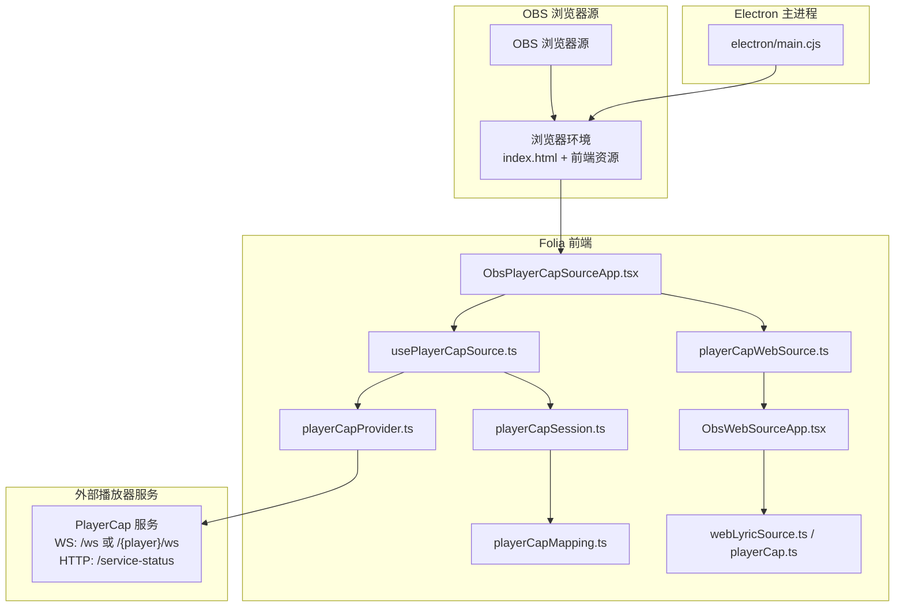
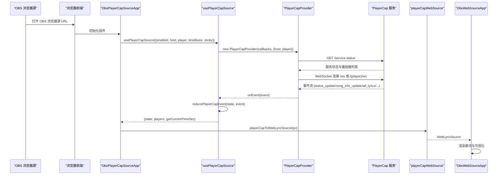
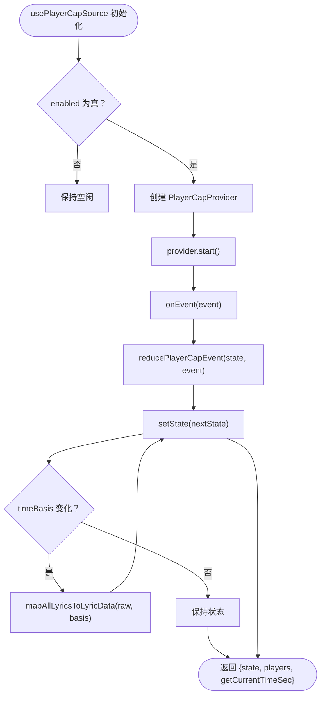
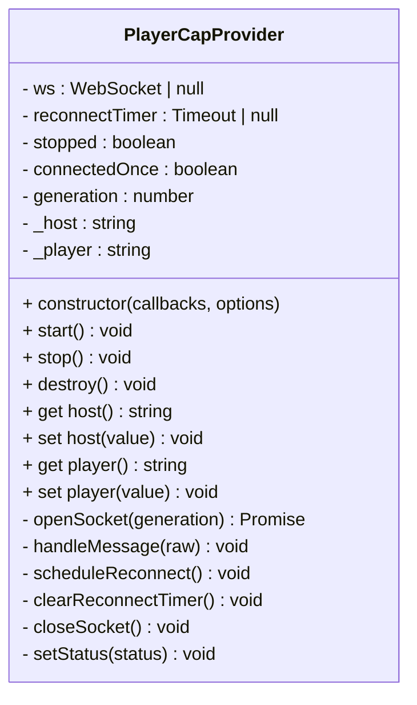
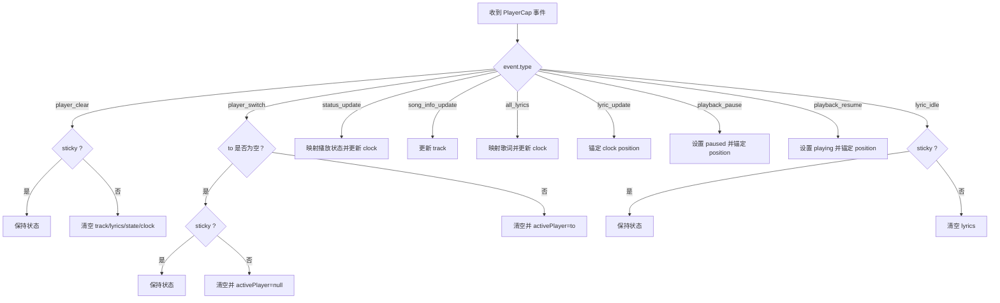
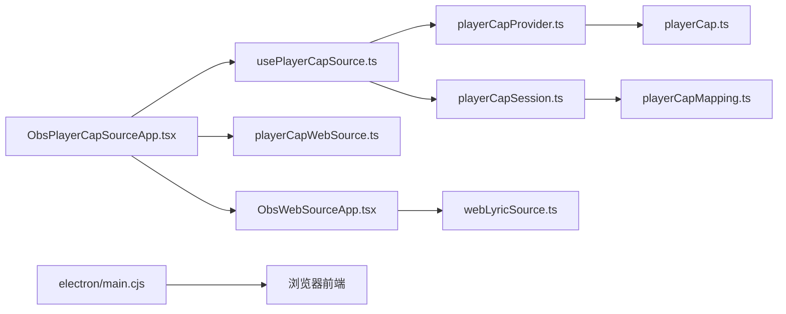

# PlayerCap 源

<cite>
**本文引用的文件**   
- [ObsPlayerCapSourceApp.tsx](file://src/components/obs/ObsPlayerCapSourceApp.tsx)
- [usePlayerCapSource.ts](file://src/hooks/usePlayerCapSource.ts)
- [playerCapProvider.ts](file://src/services/playerCapProvider.ts)
- [playerCapSession.ts](file://src/utils/playerCapSession.ts)
- [playerCapMapping.ts](file://src/utils/playerCapMapping.ts)
- [playerCapWebSource.ts](file://src/utils/playerCapWebSource.ts)
- [ObsWebSourceApp.tsx](file://src/components/obs/ObsWebSourceApp.tsx)
- [webLyricSource.ts](file://src/types/webLyricSource.ts)
- [playerCap.ts](file://src/types/playerCap.ts)
- [obsUrl.ts](file://src/utils/obsUrl.ts)
- [main.cjs](file://electron/main.cjs)
</cite>

## 目录
1. [简介](#简介)
2. [项目结构](#项目结构)
3. [核心组件](#核心组件)
4. [架构总览](#架构总览)
5. [详细组件分析](#详细组件分析)
6. [依赖关系分析](#依赖关系分析)
7. [性能与优化](#性能与优化)
8. [配置与使用指南](#配置与使用指南)
9. [故障排除](#故障排除)
10. [结论](#结论)

## 简介
本文面向 Folia Major 的 OBS PlayerCap 源功能，聚焦 ObsPlayerCapSourceApp 组件的实现架构、PlayerCap 协议的数据流与错误处理、支持的播放器类型与能力特性、OBS 中的配置与使用步骤，以及性能考虑和优化建议。该功能通过浏览器端 OBS 源加载 Folia 的前端页面，从外部播放器服务（PlayerCap）拉取播放状态、歌词和封面，并在 OBS 中渲染可视化歌词画面。

## 项目结构
PlayerCap 源涉及前端 React 组件、React Hook、网络提供者、纯函数映射、类型定义、OBS 壳层以及 Electron 主进程提供的本地 HTTP/SSE 入口。关键路径如下：

**图表来源**
- [ObsPlayerCapSourceApp.tsx:1-51](file://src/components/obs/ObsPlayerCapSourceApp.tsx#L1-L51)
- [usePlayerCapSource.ts:1-98](file://src/hooks/usePlayerCapSource.ts#L1-L98)
- [playerCapProvider.ts:1-196](file://src/services/playerCapProvider.ts#L1-L196)
- [playerCapSession.ts:1-172](file://src/utils/playerCapSession.ts#L1-L172)
- [playerCapMapping.ts:1-154](file://src/utils/playerCapMapping.ts#L1-L154)
- [playerCapWebSource.ts:1-45](file://src/utils/playerCapWebSource.ts#L1-L45)
- [ObsWebSourceApp.tsx:1-268](file://src/components/obs/ObsWebSourceApp.tsx#L1-L268)
- [webLyricSource.ts:1-51](file://src/types/webLyricSource.ts#L1-L51)
- [playerCap.ts:1-122](file://src/types/playerCap.ts#L1-L122)
- [main.cjs:4423-4469](file://electron/main.cjs#L4423-L4469)

**章节来源**
- [ObsPlayerCapSourceApp.tsx:1-51](file://src/components/obs/ObsPlayerCapSourceApp.tsx#L1-L51)
- [main.cjs:4423-4469](file://electron/main.cjs#L4423-L4469)

## 核心组件
- ObsPlayerCapSourceApp：OBS 场景下的 PlayerCap 源启动器，负责解析 URL 参数、建立 PlayerCap 数据源、适配为 WebLyricSource，并交给 ObsWebSourceApp 渲染。
- usePlayerCapSource：将 PlayerCapProvider 与 playerCapSession 组合为 React 状态，暴露 state、players 列表和 getCurrentTimeSec。
- PlayerCapProvider：负责探测 /service-status、连接 WS、重连、事件分发。
- playerCapSession：纯 reducer，把 PlayerCap 事件转换为会话状态（播放状态、轨道信息、歌词、时钟）。
- playerCapMapping：纯映射，把 PlayerCap 数据结构转为 Folia 内部 LyricData、Track、PlaybackState，并支持时间基准切换。
- playerCapWebSource：桥接 PlayerCap 会话到 WebLyricSource 统一接口。
- ObsWebSourceApp：OBS 壳层，复用 VisualizerRenderer 渲染歌词与可视化效果。
- webLyricSource.ts / playerCap.ts：定义统一的 WebLyricSource 契约与 PlayerCap 协议类型。
- electron/main.cjs：提供 OBS 浏览器源本地 HTTP 服务与 SSE 广播。

**章节来源**
- [ObsPlayerCapSourceApp.tsx:1-51](file://src/components/obs/ObsPlayerCapSourceApp.tsx#L1-L51)
- [usePlayerCapSource.ts:1-98](file://src/hooks/usePlayerCapSource.ts#L1-L98)
- [playerCapProvider.ts:1-196](file://src/services/playerCapProvider.ts#L1-L196)
- [playerCapSession.ts:1-172](file://src/utils/playerCapSession.ts#L1-L172)
- [playerCapMapping.ts:1-154](file://src/utils/playerCapMapping.ts#L1-L154)
- [playerCapWebSource.ts:1-45](file://src/utils/playerCapWebSource.ts#L1-L45)
- [ObsWebSourceApp.tsx:1-268](file://src/components/obs/ObsWebSourceApp.tsx#L1-L268)
- [webLyricSource.ts:1-51](file://src/types/webLyricSource.ts#L1-L51)
- [playerCap.ts:1-122](file://src/types/playerCap.ts#L1-L122)
- [main.cjs:4423-4469](file://electron/main.cjs#L4423-L4469)

## 架构总览
ObsPlayerCapSourceApp 是 OBS 场景下 PlayerCap 源的入口。它从 URL 中读取外观配置与 PlayerCap 专属参数（host、player、timeBasis、sticky），调用 usePlayerCapSource 建立与 PlayerCap 服务的连接，并通过 playerCapToWebLyricSource 将 PlayerCap 会话适配为 ObsWebSourceApp 所需的 WebLyricSource。ObsWebSourceApp 复用主窗口的可视化渲染管线，在 OBS 中输出透明背景、歌词与视觉效果。

**图表来源**
- [ObsPlayerCapSourceApp.tsx:33-47](file://src/components/obs/ObsPlayerCapSourceApp.tsx#L33-L47)
- [usePlayerCapSource.ts:27-96](file://src/hooks/usePlayerCapSource.ts#L27-L96)
- [playerCapProvider.ts:107-163](file://src/services/playerCapProvider.ts#L107-L163)
- [playerCapSession.ts:77-171](file://src/utils/playerCapSession.ts#L77-L171)
- [playerCapWebSource.ts:29-44](file://src/utils/playerCapWebSource.ts#L29-L44)
- [ObsWebSourceApp.tsx:35-263](file://src/components/obs/ObsWebSourceApp.tsx#L35-L263)

## 详细组件分析

### ObsPlayerCapSourceApp：OBS 源启动器
职责：
- 解析 URL 中的外观参数（cfg、isDaylight、transparent、visualizer、themeMode）与 PlayerCap 专属参数（nxpcPlayer、nxpcBasis、nxpcSticky）。
- 默认 PlayerCap host 为 localhost:8765。
- 调用 usePlayerCapSource 获取 PlayerCap 数据源。
- 通过 playerCapToWebLyricSource 适配为 WebLyricSource。
- 构建 appearance 并交给 ObsWebSourceApp 渲染。

关键点：
- nxpcBasis 支持 timestamp 与 play_time；默认 play_time。
- nxpcSticky 默认开启，避免歌词被清除。
- cfg 是外观短码，用于驱动主题、字体、可视化模式等。

**章节来源**
- [ObsPlayerCapSourceApp.tsx:14-47](file://src/components/obs/ObsPlayerCapSourceApp.tsx#L14-L47)

### usePlayerCapSource：PlayerCap 状态 Hook
职责：
- 创建并管理 PlayerCapProvider 生命周期。
- 维护 session 状态（activePlayer、connectionStatus、playerState、track、lyrics、clock）。
- 暴露 players 列表（来自 service-status.player_support）。
- 暴露 getCurrentTimeSec，供 rAF 循环计算当前歌词时间。

行为细节：
- enabled 控制 provider 启停。
- host/player 变化时增量更新 provider，不重建连接。
- timeBasis 变化时基于最近一次 all_lyrics 重新映射歌词。
- sticky 模式下忽略 player_clear、player_switch(to='')、lyric_idle 的清空逻辑。

**图表来源**
- [usePlayerCapSource.ts:27-96](file://src/hooks/usePlayerCapSource.ts#L27-L96)
- [playerCapSession.ts:77-171](file://src/utils/playerCapSession.ts#L77-L171)

**章节来源**
- [usePlayerCapSource.ts:1-98](file://src/hooks/usePlayerCapSource.ts#L1-L98)

### PlayerCapProvider：网络 I/O 与重连
职责：
- 先 GET /service-status 探测服务可用性，再连接 WS。
- 支持按 player 选择 WS 地址：/ws 或 /{player}/ws。
- 自动重连（RECONNECT_DELAY_MS=2000ms）。
- 回调 onConnectionStatusChange、onServiceStatus、onEvent、onDisconnect。

错误处理：
- fetch 失败或超时：标记 unreachable，调度重连。
- WS 创建失败：调度重连。
- WS 关闭：若已连接过，触发 onDisconnect，然后标记 disconnected 并重连。

**图表来源**
- [playerCapProvider.ts:45-196](file://src/services/playerCapProvider.ts#L45-L196)

**章节来源**
- [playerCapProvider.ts:1-196](file://src/services/playerCapProvider.ts#L1-L196)

### playerCapSession：会话状态 Reducer
职责：
- 将 PlayerCap 事件转换为 PlayerCapSessionState。
- 维护 clock（positionSec、durationSec、anchoredAtMs、playing）。
- 支持 sticky 模式，保留歌词不被意外清空。

事件处理要点：
- player_clear：非 sticky 时清空 track/lyrics/playerState/clock。
- player_switch：空 to 表示清空；非空 to 表示切换播放器。
- status_update：映射播放状态，更新 clock anchor。
- song_info_update：更新 track（含封面 base64 与 URL 合并）。
- all_lyrics：映射歌词，更新 clock position/duration。
- lyric_update：刷新 clock position。
- playback_pause/resume：精确锚定位置，暂停停止插值，恢复继续插值。
- lyric_idle：非 sticky 时清空 lyrics。

**图表来源**
- [playerCapSession.ts:77-171](file://src/utils/playerCapSession.ts#L77-L171)

**章节来源**
- [playerCapSession.ts:1-172](file://src/utils/playerCapSession.ts#L1-L172)

### playerCapMapping：数据映射与时间基准
职责：
- 将 PlayerCap 的 AllLyrics、SongInfo、Status 映射为 Folia 的 LyricData、Track、PlaybackState。
- 支持两种时间基准：
  - play_time：使用带偏移的显示时间，适合与 PlayerCap 展示对齐。
  - timestamp：使用原始时间戳，适合由 Folia 自身偏移控制。
- 处理 word-by-word 与 line-level 歌词，进行单调起始收敛与结尾裁剪。

复杂度与优化：
- buildLyricLines 对可用行进行线性扫描，计算起始时间与结束时间，避免重叠导致的提前切行。
- mapAllLyricsToLyricData 过滤 instrumental（count=0 或空行），生成 finalizeParsedLyricLines。

**章节来源**
- [playerCapMapping.ts:1-154](file://src/utils/playerCapMapping.ts#L1-L154)

### playerCapWebSource：PlayerCap 到 WebLyricSource 桥接
职责：
- 将 PlayerCap 的 connectionStatus 折叠为 WebLyricConnectionStatus。
- 将 PlayerCap 的 track 适配为 WebLyricTrack（title→seed）。
- 透传 getCurrentTimeSec，保证 rAF 循环稳定。

**章节来源**
- [playerCapWebSource.ts:1-45](file://src/utils/playerCapWebSource.ts#L1-L45)

### ObsWebSourceApp：OBS 壳层渲染
职责：
- 接收 WebLyricSource 与 appearance。
- 设置透明背景、隐藏滚动、标题为 Folia OBS。
- 支持 4K 缩放：以 1920x1080 为基准，根据窗口尺寸计算 scale。
- 主题优先级：AI 动态主题 > cfg 静态主题 > 封面提取内置主题。
- rAF 循环：计算当前歌词时间、最新活跃行索引。
- 注入 Custom CSS 资产（背景图、人像、表情、头像）。
- 将数据传给 VisualizerRenderer 渲染歌词与可视化。

**章节来源**
- [ObsWebSourceApp.tsx:1-268](file://src/components/obs/ObsWebSourceApp.tsx#L1-L268)

### 类型契约：webLyricSource.ts 与 playerCap.ts
- webLyricSource.ts：定义 WebLyricSource 的统一接口（state、getCurrentTimeSec），包括连接状态、播放状态、轨道、歌词、时钟。
- playerCap.ts：定义 PlayerCap 协议类型（事件、信封、服务状态、歌词行、播放数据、播放器切换、配置、连接状态）。

**章节来源**
- [webLyricSource.ts:1-51](file://src/types/webLyricSource.ts#L1-L51)
- [playerCap.ts:1-122](file://src/types/playerCap.ts#L1-L122)

## 依赖关系分析
ObsPlayerCapSourceApp 依赖 usePlayerCapSource，后者依赖 PlayerCapProvider 与 playerCapSession；playerCapSession 依赖 playerCapMapping；ObsPlayerCapSourceApp 还依赖 playerCapWebSource 与 ObsWebSourceApp。Electron main.cjs 提供 OBS 浏览器源本地 HTTP 服务，供 OBS 加载前端页面。

**图表来源**
- [ObsPlayerCapSourceApp.tsx:1-51](file://src/components/obs/ObsPlayerCapSourceApp.tsx#L1-L51)
- [usePlayerCapSource.ts:1-98](file://src/hooks/usePlayerCapSource.ts#L1-L98)
- [playerCapProvider.ts:1-196](file://src/services/playerCapProvider.ts#L1-L196)
- [playerCapSession.ts:1-172](file://src/utils/playerCapSession.ts#L1-L172)
- [playerCapMapping.ts:1-154](file://src/utils/playerCapMapping.ts#L1-L154)
- [playerCapWebSource.ts:1-45](file://src/utils/playerCapWebSource.ts#L1-L45)
- [ObsWebSourceApp.tsx:1-268](file://src/components/obs/ObsWebSourceApp.tsx#L1-L268)
- [webLyricSource.ts:1-51](file://src/types/webLyricSource.ts#L1-L51)
- [playerCap.ts:1-122](file://src/types/playerCap.ts#L1-L122)
- [main.cjs:4423-4469](file://electron/main.cjs#L4423-L4469)

**章节来源**
- [ObsPlayerCapSourceApp.tsx:1-51](file://src/components/obs/ObsPlayerCapSourceApp.tsx#L1-L51)
- [usePlayerCapSource.ts:1-98](file://src/hooks/usePlayerCapSource.ts#L1-L98)
- [playerCapProvider.ts:1-196](file://src/services/playerCapProvider.ts#L1-L196)
- [playerCapSession.ts:1-172](file://src/utils/playerCapSession.ts#L1-L172)
- [playerCapMapping.ts:1-154](file://src/utils/playerCapMapping.ts#L1-L154)
- [playerCapWebSource.ts:1-45](file://src/utils/playerCapWebSource.ts#L1-L45)
- [ObsWebSourceApp.tsx:1-268](file://src/components/obs/ObsWebSourceApp.tsx#L1-L268)
- [webLyricSource.ts:1-51](file://src/types/webLyricSource.ts#L1-L51)
- [playerCap.ts:1-122](file://src/types/playerCap.ts#L1-L122)
- [main.cjs:4423-4469](file://electron/main.cjs#L4423-L4469)

## 性能与优化
- 资源占用：
  - PlayerCapProvider 使用单次 WebSocket 连接，避免频繁重建；generation token 防止并发探测与 socket 泄漏。
  - usePlayerCapSource 通过 ref 持有 timeBasis/sticky/clock，减少不必要的重渲染与 rAF 循环重建。
- 刷新频率：
  - ObsWebSourceApp 使用 requestAnimationFrame 推进 currentTime 与活跃行索引，确保动画流畅。
  - getCurrentTimeSec 保持稳定 identity，避免共享 rAF 循环反复取消/重建。
- 内存管理：
  - playerCapSession 的 reducer 返回新对象但尽量复用不变字段，降低下游比较成本。
  - lastAllLyricsRef 缓存最近一次 all_lyrics，便于 timeBasis 切换时快速重映射。
  - Sticky 模式下避免频繁清空歌词，减少 UI 重绘。
- 可视化渲染：
  - ObsWebSourceApp 复用 VisualizerRenderer，支持 4K 缩放与透明背景，避免重复实现。
  - 主题优先顺序（AI > cfg > cover）减少不必要的主题重建。

[本节为通用性能讨论，不直接分析具体代码文件]

## 配置与使用指南

### OBS 中的设置步骤
- 启用 OBS 浏览器源：
  - Electron 主进程会监听本地端口并提供 /obs 路由，需确保端口可访问且 token 匹配。
  - 参考 [main.cjs:4423-4469](file://electron/main.cjs#L4423-L4469)。
- 添加浏览器源：
  - 使用 Folia 前端 URL，并附加 obs=1 与 obsSource=playercap。
  - 外观短码 cfg 作为末尾参数追加，详见 [obsUrl.ts:21-41](file://src/utils/obsUrl.ts#L21-L41)。
- PlayerCap 连接参数：
  - host：PlayerCap 服务地址，默认 localhost:8765。
  - nxpcPlayer：固定播放器名称，为空则跟随根 /ws。
  - nxpcBasis：timestamp 或 play_time，默认 play_time。
  - nxpcSticky：是否保持歌词持久化，默认开启。

### 兼容性检查
- PlayerCap 服务：
  - 确认 /service-status 可访问，返回 player_support 列表。
  - 确认 WS 地址 /ws 或 /{player}/ws 可达。
- 浏览器环境：
  - OBS 浏览器源需允许跨域访问 PlayerCap 服务（通常同机 localhost）。
  - 确保 CSS 注入与透明背景生效。

### 故障排除
- 无法连接 PlayerCap：
  - 检查 host 是否正确，服务是否运行。
  - 查看 PlayerCapProvider 的连接状态（probing/connecting/connected/disconnected/unreachable）。
- 歌词不显示或错乱：
  - 检查 timeBasis 设置（timestamp/play_time）。
  - 检查 sticky 是否导致歌词未清空。
  - 确认 all_lyrics 与 lyric_update 事件正常到达。
- 主题或背景异常：
  - 检查 cfg 短码是否有效。
  - 检查 Custom CSS 资产是否成功注入。

**章节来源**
- [main.cjs:4423-4469](file://electron/main.cjs#L4423-L4469)
- [obsUrl.ts:21-41](file://src/utils/obsUrl.ts#L21-L41)
- [playerCapProvider.ts:107-163](file://src/services/playerCapProvider.ts#L107-L163)
- [playerCapSession.ts:77-171](file://src/utils/playerCapSession.ts#L77-L171)

## 结论
ObsPlayerCapSourceApp 通过清晰的组件分层与协议抽象，将外部 PlayerCap 播放器的能力检测、数据传输与界面渲染整合到 OBS 浏览器源中。usePlayerCapSource 与 PlayerCapProvider 负责连接与状态管理，playerCapSession 与 playerCapMapping 负责纯数据处理与映射，playerCapWebSource 提供统一接口给 ObsWebSourceApp 渲染。该设计具备良好的可扩展性、可测试性与性能表现，同时提供了丰富的配置选项与错误处理机制，适用于多种播放器类型与功能特性。

[本节为总结性内容，不直接分析具体代码文件]