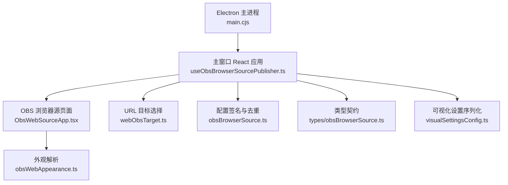
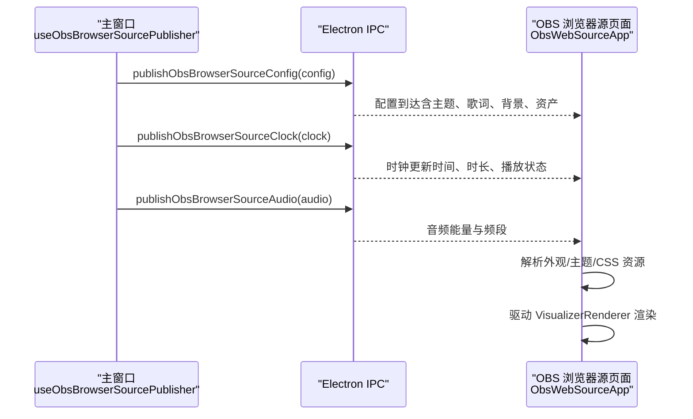
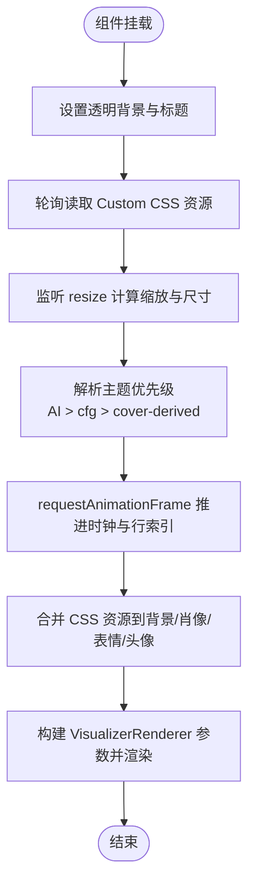
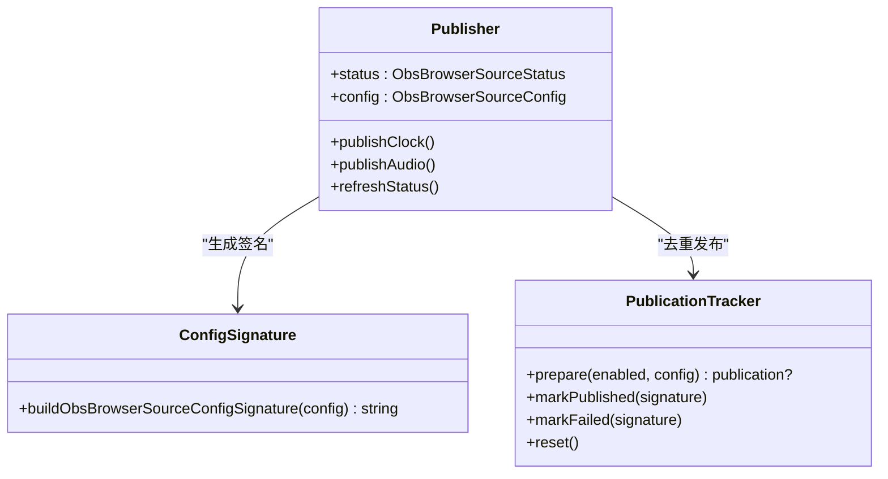
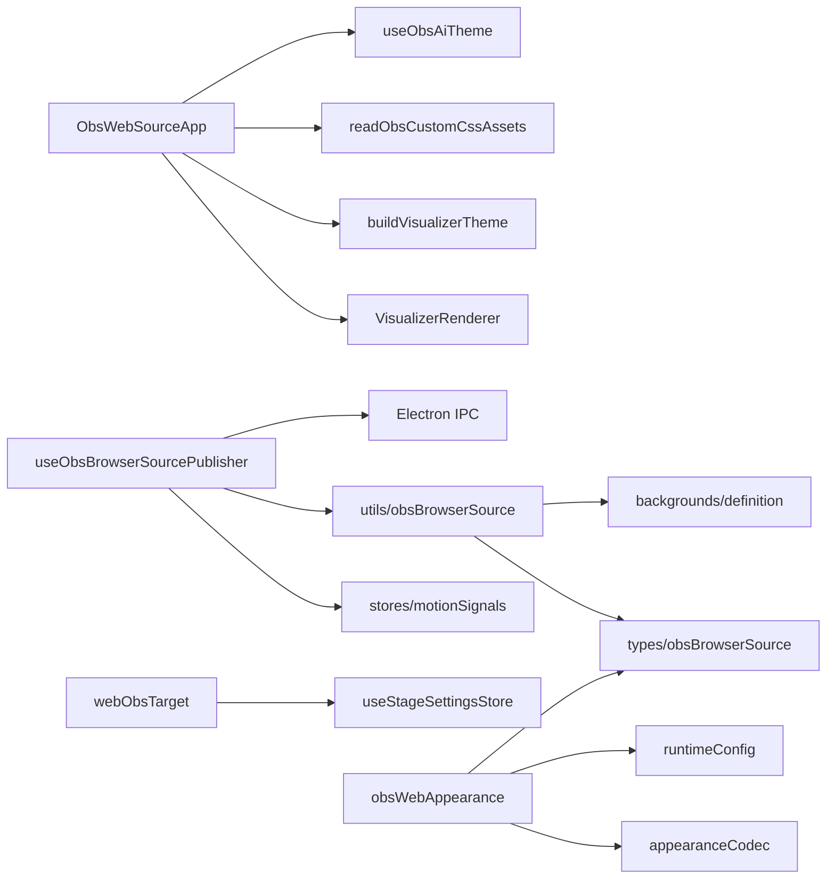

# Web Source 组件

<cite>
**本文引用的文件**   
- [ObsWebSourceApp.tsx](file://src/components/obs/ObsWebSourceApp.tsx)
- [useObsBrowserSourcePublisher.ts](file://src/hooks/useObsBrowserSourcePublisher.ts)
- [webObsTarget.ts](file://src/services/obs/webObsTarget.ts)
- [obsBrowserSource.ts](file://src/utils/obsBrowserSource.ts)
- [obsBrowserSource.ts（类型）](file://src/types/obsBrowserSource.ts)
- [visualSettingsConfig.ts](file://src/services/obs/visualSettingsConfig.ts)
- [obsWebAppearance.ts](file://src/utils/obsWebAppearance.ts)
- [main.cjs](file://electron/main.cjs)
</cite>

## 目录
1. [简介](#简介)
2. [项目结构](#项目结构)
3. [核心组件](#核心组件)
4. [架构总览](#架构总览)
5. [详细组件分析](#详细组件分析)
6. [依赖关系分析](#依赖关系分析)
7. [性能与内存优化](#性能与内存优化)
8. [故障排查指南](#故障排查指南)
9. [结论](#结论)
10. [附录：自定义开发指南](#附录自定义开发指南)

## 简介
本文件为 Folia Major 的 OBS Web Source 组件提供完整技术文档，聚焦 ObsWebSourceApp 组件的设计模式、OBS 集成机制、配置系统与主题适配、事件处理与状态同步，以及扩展与二次开发实践。该能力允许将 Folia 的歌词可视化画面作为浏览器源在 OBS 中渲染，同时保持主窗口与覆盖层之间的视觉一致性。

## 项目结构
围绕 OBS Web Source 的关键代码分布在以下位置：
- 覆盖层渲染入口：src/components/obs/ObsWebSourceApp.tsx
- 发布器 Hook（主窗口 → Electron IPC → OBS 浏览器源）：src/hooks/useObsBrowserSourcePublisher.ts
- URL 目标选择与参数解析：src/services/obs/webObsTarget.ts
- 纯函数工具（签名去重、频谱下采样、Blob 封面转 Data URL 等）：src/utils/obsBrowserSource.ts
- 共享类型定义（配置、时钟、音频、事件）：src/types/obsBrowserSource.ts
- 可视化设置序列化与提示逻辑：src/services/obs/visualSettingsConfig.ts
- OBS 覆盖层外观解析（URL 参数 + 短码配置）：src/utils/obsWebAppearance.ts
- Electron 端服务端口、令牌与状态构建：electron/main.cjs

**图示来源**
- [main.cjs:1945-1990](file://electron/main.cjs#L1945-L1990)
- [useObsBrowserSourcePublisher.ts:113-429](file://src/hooks/useObsBrowserSourcePublisher.ts#L113-L429)
- [ObsWebSourceApp.tsx:35-267](file://src/components/obs/ObsWebSourceApp.tsx#L35-L267)
- [webObsTarget.ts:12-39](file://src/services/obs/webObsTarget.ts#L12-L39)
- [obsBrowserSource.ts:97-148](file://src/utils/obsBrowserSource.ts#L97-L148)
- [obsBrowserSource.ts（类型）:29-129](file://src/types/obsBrowserSource.ts#L29-L129)
- [obsWebAppearance.ts:69-187](file://src/utils/obsWebAppearance.ts#L69-L187)
- [visualSettingsConfig.ts:14-99](file://src/services/obs/visualSettingsConfig.ts#L14-L99)

**章节来源**
- [ObsWebSourceApp.tsx:17-23](file://src/components/obs/ObsWebSourceApp.tsx#L17-L23)
- [useObsBrowserSourcePublisher.ts:58-64](file://src/hooks/useObsBrowserSourcePublisher.ts#L58-L64)
- [webObsTarget.ts:3-8](file://src/services/obs/webObsTarget.ts#L3-L8)
- [obsBrowserSource.ts:12-15](file://src/utils/obsBrowserSource.ts#L12-L15)
- [obsBrowserSource.ts（类型）:26-27](file://src/types/obsBrowserSource.ts#L26-L27)
- [obsWebAppearance.ts:11-16](file://src/utils/obsWebAppearance.ts#L11-L16)
- [visualSettingsConfig.ts:10-12](file://src/services/obs/visualSettingsConfig.ts#L10-L12)
- [main.cjs:1945-1990](file://electron/main.cjs#L1945-L1990)

## 核心组件
- ObsWebSourceApp：OBS 覆盖层渲染壳，消费注入的 WebLyricSource 与外观配置，复用主窗口的 VisualizerRenderer 管线，支持 4K 缩放、透明背景、AI 主题与 CSS 资源注入。
- useObsBrowserSourcePublisher：主窗口侧发布器，订阅播放状态、主题与字体设置，构造并发布 ObsBrowserSourceConfig、时钟与音频数据到 Electron IPC，供 OBS 浏览器源消费。
- webObsTarget：决定当前“网页舞台”目标是 Now Playing 还是 PlayerCap，并生成对应的连接参数。
- obsBrowserSource 工具：对配置进行语义签名、去重发布、频谱下采样、Blob 封面转 Data URL 等。
- obsBrowserSource 类型：定义配置、时钟、音频与事件契约。
- visualSettingsConfig：序列化可视化设置，用于复制配置链接与提示上传资源/字体可用性。
- obsWebAppearance：解析 OBS URL 参数与短码配置，映射为 ObsWebSourceApp 的外观属性。
- electron/main.cjs：管理 OBS 浏览器源端口、令牌、URL 与客户端计数。

**章节来源**
- [ObsWebSourceApp.tsx:27-33](file://src/components/obs/ObsWebSourceApp.tsx#L27-L33)
- [useObsBrowserSourcePublisher.ts:113-122](file://src/hooks/useObsBrowserSourcePublisher.ts#L113-L122)
- [webObsTarget.ts:12-39](file://src/services/obs/webObsTarget.ts#L12-L39)
- [obsBrowserSource.ts:97-148](file://src/utils/obsBrowserSource.ts#L97-L148)
- [obsBrowserSource.ts（类型）:29-129](file://src/types/obsBrowserSource.ts#L29-L129)
- [visualSettingsConfig.ts:14-99](file://src/services/obs/visualSettingsConfig.ts#L14-L99)
- [obsWebAppearance.ts:69-187](file://src/utils/obsWebAppearance.ts#L69-L187)
- [main.cjs:1945-1990](file://electron/main.cjs#L1945-L1990)

## 架构总览
OBS Web Source 采用“主窗口发布 + 覆盖层消费”的双端模型：
- 主窗口通过 useObsBrowserSourcePublisher 订阅播放、主题、字体与资产状态，构造 ObsBrowserSourceConfig 并通过 Electron IPC 发布。
- Electron 主进程维护本地服务器端口与令牌，暴露给 OBS 浏览器源访问。
- 覆盖层 ObsWebSourceApp 解析外观与 AI 主题，读取注入的 CSS 资源，驱动 VisualizerRenderer 渲染。

**图示来源**
- [useObsBrowserSourcePublisher.ts:340-422](file://src/hooks/useObsBrowserSourcePublisher.ts#L340-L422)
- [ObsWebSourceApp.tsx:67-93](file://src/components/obs/ObsWebSourceApp.tsx#L67-L93)
- [ObsWebSourceApp.tsx:200-262](file://src/components/obs/ObsWebSourceApp.tsx#L200-L262)
- [main.cjs:1945-1990](file://electron/main.cjs#L1945-L1990)

## 详细组件分析

### ObsWebSourceApp 组件
ObsWebSourceApp 是 OBS 覆盖层的渲染壳，负责：
- 生命周期管理：初始化透明背景、标题、监听 resize 以计算缩放比例；轮询读取 Custom CSS 注入的资源。
- 主题与外观：优先使用动态 AI 主题，其次使用 cfg 静态主题，最后回退到封面提取色生成的内置双主题；根据 daylight 切换明暗主题。
- 响应式布局：基于 1920×1080 基准进行缩放，重写 devicePixelRatio/innerWidth/innerHeight 以适配高分屏。
- 歌词与时钟：使用 requestAnimationFrame 推进 currentTime，计算当前行索引，统一暂停状态来源。
- 资源注入：将 Custom CSS 提供的背景图、肖像图、Cappella 表情与头像注入渲染管线。
- 字体叠加：将歌词与副标题字体样式叠加到主题，确保与主窗口一致。

**图示来源**
- [ObsWebSourceApp.tsx:67-93](file://src/components/obs/ObsWebSourceApp.tsx#L67-L93)
- [ObsWebSourceApp.tsx:95-137](file://src/components/obs/ObsWebSourceApp.tsx#L95-L137)
- [ObsWebSourceApp.tsx:139-160](file://src/components/obs/ObsWebSourceApp.tsx#L139-L160)
- [ObsWebSourceApp.tsx:162-181](file://src/components/obs/ObsWebSourceApp.tsx#L162-L181)
- [ObsWebSourceApp.tsx:188-215](file://src/components/obs/ObsWebSourceApp.tsx#L188-L215)
- [ObsWebSourceApp.tsx:217-262](file://src/components/obs/ObsWebSourceApp.tsx#L217-L262)

**章节来源**
- [ObsWebSourceApp.tsx:35-65](file://src/components/obs/ObsWebSourceApp.tsx#L35-L65)
- [ObsWebSourceApp.tsx:67-137](file://src/components/obs/ObsWebSourceApp.tsx#L67-L137)
- [ObsWebSourceApp.tsx:139-215](file://src/components/obs/ObsWebSourceApp.tsx#L139-L215)
- [ObsWebSourceApp.tsx:217-267](file://src/components/obs/ObsWebSourceApp.tsx#L217-L267)

### useObsBrowserSourcePublisher 发布器
发布器职责：
- 订阅主窗口播放、主题、字体与资产状态，构造 ObsBrowserSourceConfig。
- 将 Blob 封面与图片资产转换为 Data URL，避免跨源不可读。
- 使用指纹签名与发布跟踪器防止重复发布相同配置。
- 定时发布时钟与音频数据，检测 seek 跳变时立即刷新时钟。
- 暴露状态与刷新方法供 UI 使用。

**图示来源**
- [useObsBrowserSourcePublisher.ts:113-173](file://src/hooks/useObsBrowserSourcePublisher.ts#L113-L173)
- [useObsBrowserSourcePublisher.ts:249-316](file://src/hooks/useObsBrowserSourcePublisher.ts#L249-L316)
- [useObsBrowserSourcePublisher.ts:318-338](file://src/hooks/useObsBrowserSourcePublisher.ts#L318-L338)
- [useObsBrowserSourcePublisher.ts:340-422](file://src/hooks/useObsBrowserSourcePublisher.ts#L340-L422)
- [obsBrowserSource.ts:97-148](file://src/utils/obsBrowserSource.ts#L97-L148)

**章节来源**
- [useObsBrowserSourcePublisher.ts:58-64](file://src/hooks/useObsBrowserSourcePublisher.ts#L58-L64)
- [useObsBrowserSourcePublisher.ts:113-173](file://src/hooks/useObsBrowserSourcePublisher.ts#L113-L173)
- [useObsBrowserSourcePublisher.ts:193-247](file://src/hooks/useObsBrowserSourcePublisher.ts#L193-L247)
- [useObsBrowserSourcePublisher.ts:249-316](file://src/hooks/useObsBrowserSourcePublisher.ts#L249-L316)
- [useObsBrowserSourcePublisher.ts:318-422](file://src/hooks/useObsBrowserSourcePublisher.ts#L318-L422)

### webObsTarget 目标选择
- 根据 Stage 设置选择 Now Playing 或 PlayerCap 作为网页舞台源。
- 为 PlayerCap 生成非默认连接参数，使默认设置产生简洁 URL。

**章节来源**
- [webObsTarget.ts:3-8](file://src/services/obs/webObsTarget.ts#L3-L8)
- [webObsTarget.ts:12-39](file://src/services/obs/webObsTarget.ts#L12-L39)

### obsBrowserSource 工具与类型
- 配置签名：按字段排序折叠对象/数组，忽略 updatedAt，避免大对象深拷贝导致的内存峰值。
- 发布跟踪器：记录上次已发布与待发布的签名，防止重复发布。
- 时钟时间解析：根据 playerState 与 sentAtMs 推算当前时间。
- 频谱下采样：将高频频谱压缩至固定桶数，降低 IPC 负载。
- Blob 封面与图片资产转换：将 blob URL 转为 data URL，保证跨源可读。
- 类型契约：定义 ObsBrowserSourceStatus/Config/Clock/Audio/Event。

**章节来源**
- [obsBrowserSource.ts:15-15](file://src/utils/obsBrowserSource.ts#L15-L15)
- [obsBrowserSource.ts:97-148](file://src/utils/obsBrowserSource.ts#L97-L148)
- [obsBrowserSource.ts:166-183](file://src/utils/obsBrowserSource.ts#L166-L183)
- [obsBrowserSource.ts:185-209](file://src/utils/obsBrowserSource.ts#L185-L209)
- [obsBrowserSource.ts:211-269](file://src/utils/obsBrowserSource.ts#L211-L269)
- [obsBrowserSource.ts（类型）:29-129](file://src/types/obsBrowserSource.ts#L29-L129)

### visualSettingsConfig 可视化设置
- 序列化所有影响可视化的设置，包括主题自动开关、背景模式、透明度、字幕样式、字体族与权重、各可视化模式的调参、URL 背景列表等。
- 判断是否使用了上传资源（背景、肖像、表情、头像），并给出复制链接时的提示。
- 判断是否使用了自定义字体，提示 OBS 机器可能缺少字体。

**章节来源**
- [visualSettingsConfig.ts:14-99](file://src/services/obs/visualSettingsConfig.ts#L14-L99)
- [visualSettingsConfig.ts:101-110](file://src/services/obs/visualSettingsConfig.ts#L101-L110)
- [visualSettingsConfig.ts:112-149](file://src/services/obs/visualSettingsConfig.ts#L112-L149)
- [visualSettingsConfig.ts:151-162](file://src/services/obs/visualSettingsConfig.ts#L151-L162)

### obsWebAppearance 外观解析
- 解析 OBS URL 参数：host、cfg、daylight、transparent、visualizer、obsTheme。
- 从短码解码配置，映射 store 字段到渲染属性，并对 urlBackgroundList 与字体回退数组做安全校验。
- 动态 AI 主题：当 obsTheme=ai 时返回 AI 配置，否则返回 null。

**章节来源**
- [obsWebAppearance.ts:11-16](file://src/utils/obsWebAppearance.ts#L11-L16)
- [obsWebAppearance.ts:22-35](file://src/utils/obsWebAppearance.ts#L22-L35)
- [obsWebAppearance.ts:69-84](file://src/utils/obsWebAppearance.ts#L69-L84)
- [obsWebAppearance.ts:86-94](file://src/utils/obsWebAppearance.ts#L86-L94)
- [obsWebAppearance.ts:103-187](file://src/utils/obsWebAppearance.ts#L103-L187)

### Electron 主进程集成
- 管理 OBS 浏览器源端口、令牌与 URL。
- 构建状态对象，包含 enabled/port/token/url/clientCount。

**章节来源**
- [main.cjs:1945-1990](file://electron/main.cjs#L1945-L1990)

## 依赖关系分析
- ObsWebSourceApp 依赖：
  - VisualizerRenderer（复用主窗口渲染管线）
  - buildVisualizerTheme（构建主题与副标题主题）
  - readObsCustomCssAssets（读取 Custom CSS 注入资源）
  - useObsAiTheme（动态 AI 主题）
- useObsBrowserSourcePublisher 依赖：
  - stores（播放、主题、字体、可视化设置与资产）
  - motionSignals（currentTime/audioPower/audioBands）
  - utils/obsBrowserSource（签名、去重、频谱下采样、Blob 转换）
  - Electron IPC（publishObsBrowserSourceConfig/Clock/Audio、getObsBrowserSourceStatus）
- webObsTarget 依赖：
  - useStageSettingsStore（选择 now-playing 或 playercap）
- obsBrowserSource 工具依赖：
  - types（PlayerState、SongResult、LyricData、Theme 等）
  - components/visualizer/backgrounds/definition（VisualizerBackgroundConfig）
- obsWebAppearance 依赖：
  - appearanceCodec（短码解码）
  - runtimeConfig（AI 提供者）
  - types（Theme、VisualizerMode、SubtitleContentMode）

**图示来源**
- [ObsWebSourceApp.tsx:1-15](file://src/components/obs/ObsWebSourceApp.tsx#L1-L15)
- [ObsWebSourceApp.tsx:200-262](file://src/components/obs/ObsWebSourceApp.tsx#L200-L262)
- [useObsBrowserSourcePublisher.ts:48-56](file://src/hooks/useObsBrowserSourcePublisher.ts#L48-L56)
- [useObsBrowserSourcePublisher.ts:340-422](file://src/hooks/useObsBrowserSourcePublisher.ts#L340-L422)
- [webObsTarget.ts:1-8](file://src/services/obs/webObsTarget.ts#L1-L8)
- [obsBrowserSource.ts:1-10](file://src/utils/obsBrowserSource.ts#L1-L10)
- [obsWebAppearance.ts:1-9](file://src/utils/obsWebAppearance.ts#L1-L9)

**章节来源**
- [ObsWebSourceApp.tsx:1-15](file://src/components/obs/ObsWebSourceApp.tsx#L1-L15)
- [useObsBrowserSourcePublisher.ts:48-56](file://src/hooks/useObsBrowserSourcePublisher.ts#L48-L56)
- [webObsTarget.ts:1-8](file://src/services/obs/webObsTarget.ts#L1-L8)
- [obsBrowserSource.ts:1-10](file://src/utils/obsBrowserSource.ts#L1-L10)
- [obsWebAppearance.ts:1-9](file://src/utils/obsWebAppearance.ts#L1-L9)

## 性能与内存优化
- 配置签名与去重：
  - 使用轻量指纹算法对配置进行语义签名，忽略 updatedAt，避免 JSON.stringify 深拷贝造成的内存峰值。
  - 发布跟踪器记录 lastPublishedSignature 与 pendingSignature，防止重复发布。
- 频谱下采样：
  - 将高频频谱压缩到固定桶数（默认 256），减少 IPC 负载。
- Blob 封面与图片资产：
  - 将 blob URL 转为 data URL，避免跨源不可读问题，同时保留图像元信息。
- 时钟跳变检测：
  - 基于 currentTime.on('change') 与阈值判断，避免频繁 IPC 刷新，仅在 seek 跳变时立即发布时钟。
- 4K 缩放与透明背景：
  - 通过重写 devicePixelRatio/innerWidth/innerHeight 与 zoom 实现高分屏清晰渲染，同时保持透明背景以便 OBS 合成。

**章节来源**
- [obsBrowserSource.ts:17-33](file://src/utils/obsBrowserSource.ts#L17-L33)
- [obsBrowserSource.ts:97-148](file://src/utils/obsBrowserSource.ts#L97-L148)
- [obsBrowserSource.ts:185-209](file://src/utils/obsBrowserSource.ts#L185-L209)
- [obsBrowserSource.ts:211-269](file://src/utils/obsBrowserSource.ts#L211-L269)
- [useObsBrowserSourcePublisher.ts:374-406](file://src/hooks/useObsBrowserSourcePublisher.ts#L374-L406)
- [ObsWebSourceApp.tsx:95-137](file://src/components/obs/ObsWebSourceApp.tsx#L95-L137)

## 故障排查指南
- OBS 浏览器源未启用或无客户端：
  - 检查 Electron 主进程端口与令牌配置，确认 URL 可访问。
  - 查看 status.enabled 与 clientCount，必要时调用 refreshStatus。
- 封面或图片不显示：
  - 确认 Blob 封面已转换为 Data URL；检查 resolveObsBrowserSourceCoverUrl 与 resolveObsBrowserSourceImageAsset 流程。
- 主题不一致：
  - 检查 obsTheme 模式（static/builtin/ai）与 isDaylight；确认 cfg 解码与 theme 优先级。
- 字体缺失或样式异常：
  - 检查 lyricsFontStyle/lyricsCustomFontFamily/lyricsFontFallbackFamilies；注意上传字体无法跨设备传输。
- 歌词不同步或卡顿：
  - 检查 currentTime 推送频率与 seek 跳变检测；确认 lyricOffsetMs 设置正确。
- 频谱或音频数据异常：
  - 检查 downsampleObsSpectrum 输出与 audioBands 值；确认 OBS 侧是否正确消费。

**章节来源**
- [main.cjs:1945-1990](file://electron/main.cjs#L1945-L1990)
- [useObsBrowserSourcePublisher.ts:175-191](file://src/hooks/useObsBrowserSourcePublisher.ts#L175-L191)
- [useObsBrowserSourcePublisher.ts:193-247](file://src/hooks/useObsBrowserSourcePublisher.ts#L193-L247)
- [obsWebAppearance.ts:103-187](file://src/utils/obsWebAppearance.ts#L103-L187)
- [visualSettingsConfig.ts:101-110](file://src/services/obs/visualSettingsConfig.ts#L101-L110)
- [useObsBrowserSourcePublisher.ts:374-406](file://src/hooks/useObsBrowserSourcePublisher.ts#L374-L406)
- [obsBrowserSource.ts:185-209](file://src/utils/obsBrowserSource.ts#L185-L209)

## 结论
Folia Major 的 OBS Web Source 通过清晰的“主窗口发布 + 覆盖层消费”架构，实现了高保真、低延迟的歌词可视化输出。ObsWebSourceApp 复用主窗口渲染管线，结合动态 AI 主题与 Custom CSS 资源注入，提供了灵活的视觉定制能力。useObsBrowserSourcePublisher 通过签名去重、频谱下采样与跳变检测，确保了 IPC 通信的高效与稳定。开发者可基于现有接口扩展可视化效果、集成第三方库，并保持与主窗口一致的体验。

## 附录：自定义开发指南
- 扩展 Web Source 功能：
  - 在 ObsWebSourceApp 中新增渲染层或样式，确保与 VisualizerRenderer 的参数兼容。
  - 通过 appearance 传入新的视觉选项，并在 buildVisualizerTheme 中映射到主题字段。
- 添加新的可视化效果：
  - 在 VisualizerRenderer 管线中添加新模式，并在 visualSettingsConfig 中序列化对应调参。
  - 确保 obsWebAppearance 能解析新模式的 URL 参数或短码字段。
- 集成第三方库：
  - 在主窗口侧加载库并注入到配置；在覆盖层侧通过 appearance 或 CSS 资源引用。
  - 注意跨域与资源大小，必要时使用 Data URL 或 CDN。
- 最佳实践：
  - 使用签名去重与频谱下采样控制 IPC 负载。
  - 对 URL 参数与短码输入做严格校验，避免渲染崩溃。
  - 在覆盖层中保持透明背景与高分屏缩放，确保 OBS 合成效果。

**章节来源**
- [ObsWebSourceApp.tsx:200-262](file://src/components/obs/ObsWebSourceApp.tsx#L200-L262)
- [visualSettingsConfig.ts:14-99](file://src/services/obs/visualSettingsConfig.ts#L14-L99)
- [obsWebAppearance.ts:103-187](file://src/utils/obsWebAppearance.ts#L103-L187)
- [obsBrowserSource.ts:97-148](file://src/utils/obsBrowserSource.ts#L97-L148)
- [obsBrowserSource.ts:185-209](file://src/utils/obsBrowserSource.ts#L185-L209)