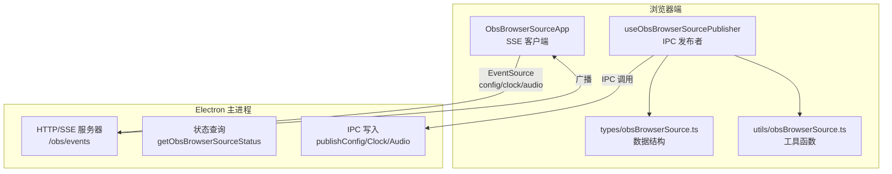
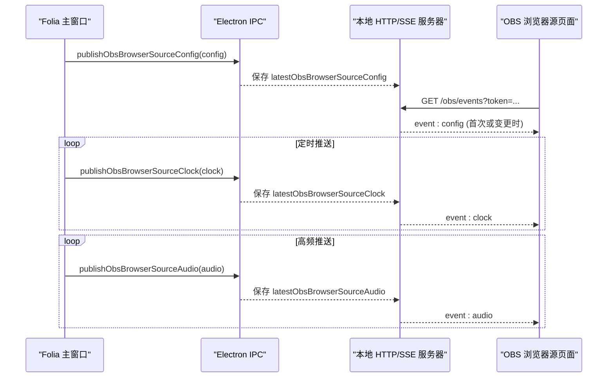
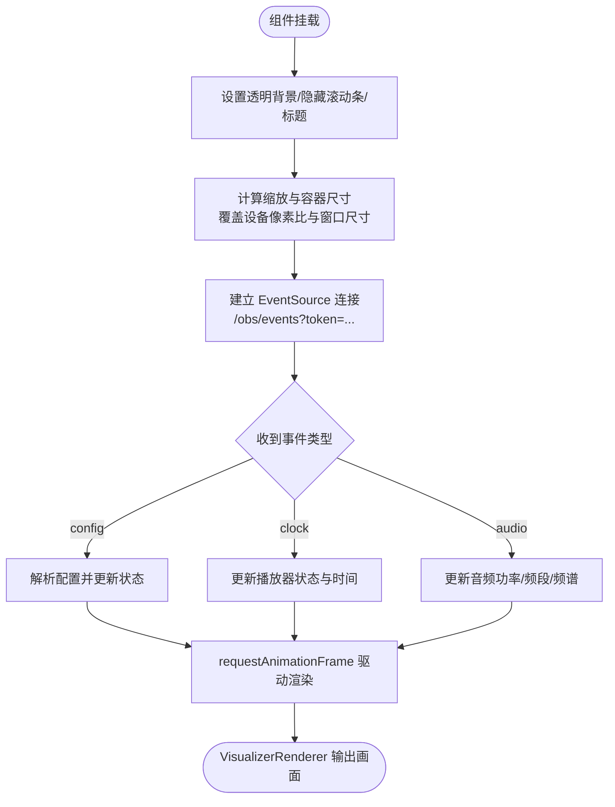
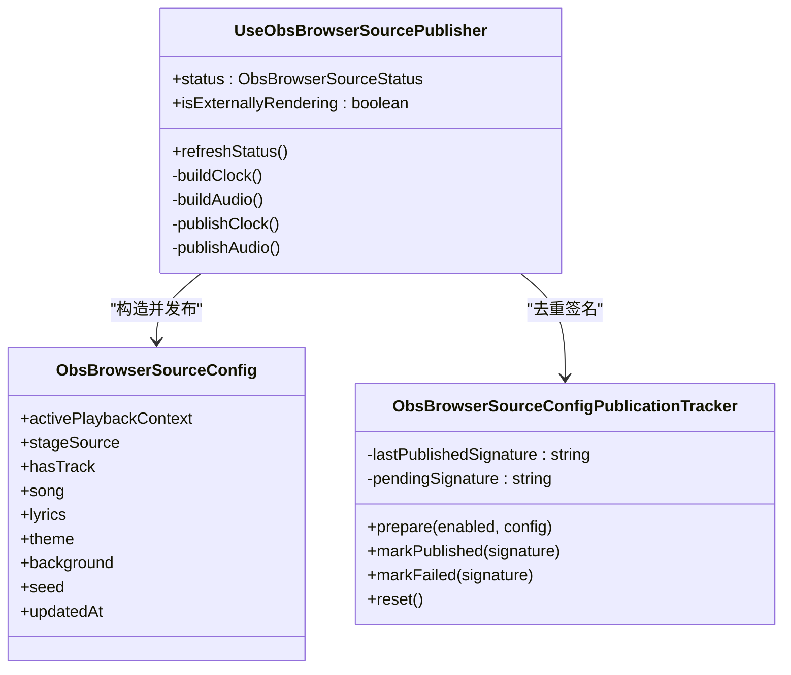
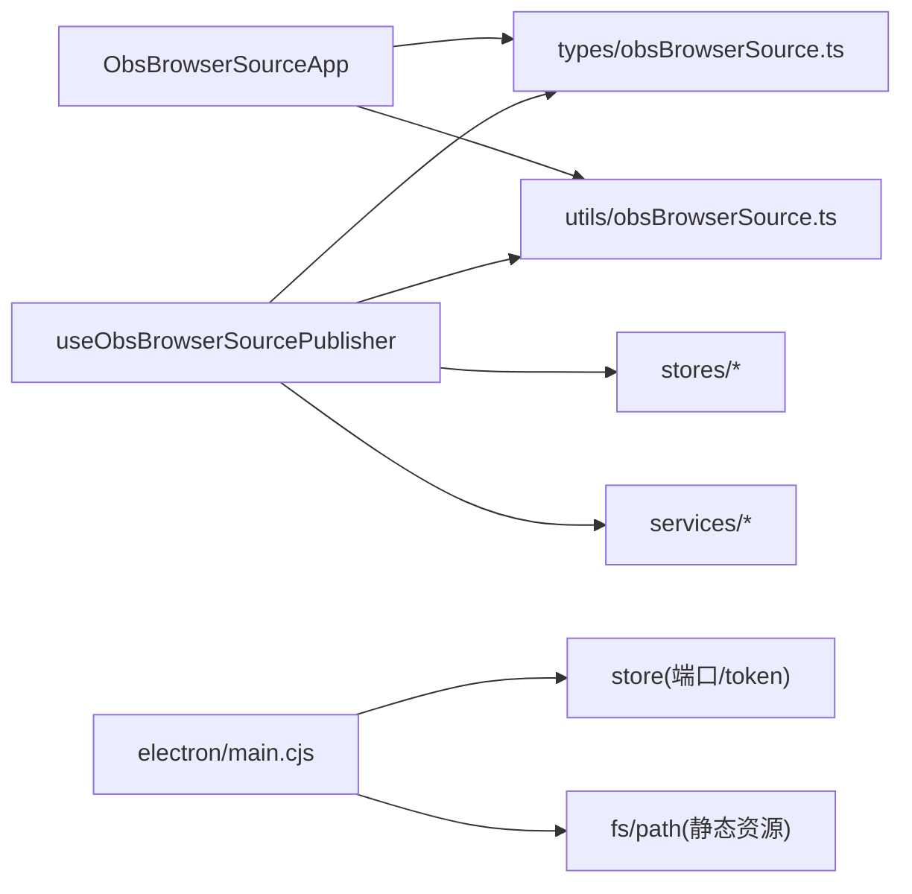

# 浏览器源支持

<cite>
**本文引用的文件**   
- [ObsBrowserSourceApp.tsx](file://src/components/obs/ObsBrowserSourceApp.tsx)
- [useObsBrowserSourcePublisher.ts](file://src/hooks/useObsBrowserSourcePublisher.ts)
- [obsBrowserSource.ts（类型定义）](file://src/types/obsBrowserSource.ts)
- [obsBrowserSource.ts（工具函数）](file://src/utils/obsBrowserSource.ts)
- [currentObsUrl.ts](file://src/services/obs/currentObsUrl.ts)
- [webObsTarget.ts](file://src/services/obs/webObsTarget.ts)
- [main.cjs（Electron 主进程 OBS 服务）](file://electron/main.cjs)
</cite>

## 目录
1. [简介](#简介)
2. [项目结构](#项目结构)
3. [核心组件](#核心组件)
4. [架构总览](#架构总览)
5. [详细组件分析](#详细组件分析)
6. [依赖关系分析](#依赖关系分析)
7. [性能与优化](#性能与优化)
8. [配置与使用指南](#配置与使用指南)
9. [故障排查](#故障排查)
10. [结论](#结论)

## 简介
本文件为 Folia Major 的 OBS 浏览器源功能提供完整技术文档，重点说明 ObsBrowserSourceApp 组件的实现架构、React 应用嵌入方式、与 Electron 主进程的通信协议、实时数据推送机制，以及 OBS 侧的配置选项、参数调优和常见问题解决方案。同时给出内存管理、渲染优化和资源清理等性能策略，帮助在 OBS 中稳定、高效地运行 Folia 可视化页面。

## 项目结构
OBS 浏览器源能力由“前端渲染层 + 发布器 Hook + 类型契约 + 工具函数 + Electron 主进程服务”共同组成：
- 前端渲染层：ObsBrowserSourceApp 作为 OBS 加载的独立页面，订阅事件流并驱动 VisualizerRenderer。
- 发布器 Hook：useObsBrowserSourcePublisher 负责从播放状态生成配置、时钟与音频数据，并通过 IPC 推送到 Electron 主进程。
- 类型契约：obsBrowserSource.ts 定义配置、时钟、音频、事件等数据结构。
- 工具函数：obsBrowserSource.ts 提供指纹去重、频谱降采样、Blob URL 转 Data URL 等纯函数。
- Electron 主进程：main.cjs 启动本地 HTTP 服务器，提供 /obs/events 事件流，转发配置、时钟、音频消息。
- URL 构建：currentObsUrl.ts 与 webObsTarget.ts 用于生成 OBS 静态链接与目标选择。

图表来源
- [ObsBrowserSourceApp.tsx:16-24](file://src/components/obs/ObsBrowserSourceApp.tsx#L16-L24)
- [useObsBrowserSourcePublisher.ts:340-422](file://src/hooks/useObsBrowserSourcePublisher.ts#L340-L422)
- [obsBrowserSource.ts（类型定义）:29-129](file://src/types/obsBrowserSource.ts#L29-L129)
- [obsBrowserSource.ts（工具函数）:97-148](file://src/utils/obsBrowserSource.ts#L97-L148)
- [main.cjs:4306-4333](file://electron/main.cjs#L4306-L4333)

章节来源
- [ObsBrowserSourceApp.tsx:1-230](file://src/components/obs/ObsBrowserSourceApp.tsx#L1-L230)
- [useObsBrowserSourcePublisher.ts:1-430](file://src/hooks/useObsBrowserSourcePublisher.ts#L1-L430)
- [obsBrowserSource.ts（类型定义）:1-129](file://src/types/obsBrowserSource.ts#L1-L129)
- [obsBrowserSource.ts（工具函数）:1-269](file://src/utils/obsBrowserSource.ts#L1-L269)
- [currentObsUrl.ts:1-61](file://src/services/obs/currentObsUrl.ts#L1-L61)
- [webObsTarget.ts:1-40](file://src/services/obs/webObsTarget.ts#L1-L40)
- [main.cjs:1945-1989](file://electron/main.cjs#L1945-L1989)
- [main.cjs:4298-4469](file://electron/main.cjs#L4298-L4469)

## 核心组件
- ObsBrowserSourceApp：OBS 加载的只读渲染应用，通过 EventSource 订阅 config/clock/audio 三类事件，驱动 VisualizerRenderer 进行歌词、主题、背景与频谱可视化。
- useObsBrowserSourcePublisher：将当前播放上下文、歌词、主题、可视化模式、背景配置、字体缩放、透明度等打包为 ObsBrowserSourceConfig，并以固定频率推送时钟与音频数据。
- obsBrowserSource.ts（类型）：定义 ObsBrowserSourceStatus、ObsBrowserSourceConfig、ObsBrowserSourceClock、ObsBrowserSourceAudio、ObsBrowserSourceEvent 等契约。
- obsBrowserSource.ts（工具）：实现配置签名去重、时间推算、频谱降采样、Blob URL 转 Data URL、图片资产重写等。
- currentObsUrl.ts / webObsTarget.ts：构建 OBS 静态 URL 与目标选择逻辑，支持透明背景、昼夜主题、主题模式等参数。
- Electron main.cjs：启动本地 HTTP 服务器，处理 /obs 静态资源与 /obs/events SSE 事件流，维护 token 鉴权与客户端连接集合。

章节来源
- [ObsBrowserSourceApp.tsx:26-227](file://src/components/obs/ObsBrowserSourceApp.tsx#L26-L227)
- [useObsBrowserSourcePublisher.ts:113-429](file://src/hooks/useObsBrowserSourcePublisher.ts#L113-L429)
- [obsBrowserSource.ts（类型定义）:29-129](file://src/types/obsBrowserSource.ts#L29-L129)
- [obsBrowserSource.ts（工具函数）:97-269](file://src/utils/obsBrowserSource.ts#L97-L269)
- [currentObsUrl.ts:36-60](file://src/services/obs/currentObsUrl.ts#L36-L60)
- [webObsTarget.ts:12-39](file://src/services/obs/webObsTarget.ts#L12-L39)
- [main.cjs:4428-4469](file://electron/main.cjs#L4428-L4469)

## 架构总览
OBS 浏览器源采用“服务端推送 + 客户端渲染”的分离架构：
- 发布端（Folia 主窗口）：useObsBrowserSourcePublisher 监听播放状态变化，构造配置与实时数据，通过 window.electron.publish* IPC 接口写入主进程。
- 传输层（Electron 主进程）：main.cjs 启动本地 HTTP 服务器，提供 /obs/events SSE 接口，按事件类型广播给所有已连接的 OBS 浏览器源页面。
- 消费端（OBS 浏览器源页面）：ObsBrowserSourceApp 通过 EventSource 订阅事件，更新 MotionValue 与 React 状态，驱动 VisualizerRenderer 渲染。

图表来源
- [useObsBrowserSourcePublisher.ts:340-422](file://src/hooks/useObsBrowserSourcePublisher.ts#L340-L422)
- [main.cjs:4306-4333](file://electron/main.cjs#L4306-L4333)
- [ObsBrowserSourceApp.tsx:113-146](file://src/components/obs/ObsBrowserSourceApp.tsx#L113-L146)

## 详细组件分析

### ObsBrowserSourceApp 组件
ObsBrowserSourceApp 是 OBS 加载的独立 React 应用，职责包括：
- 初始化透明背景与隐藏滚动条，设置标题。
- 根据窗口尺寸计算缩放比例与容器尺寸，覆盖 devicePixelRatio、innerWidth/Height，使子组件以标准分辨率布局。
- 通过 EventSource 订阅 /obs/events，解析 config/clock/audio 三类事件。
- 使用 requestAnimationFrame 推进 currentTime，并根据歌词行索引更新活跃行。
- 将 MotionValue 与配置传递给 VisualizerRenderer，完成歌词、主题、背景、频谱等渲染。

图表来源
- [ObsBrowserSourceApp.tsx:55-111](file://src/components/obs/ObsBrowserSourceApp.tsx#L55-L111)
- [ObsBrowserSourceApp.tsx:113-167](file://src/components/obs/ObsBrowserSourceApp.tsx#L113-L167)
- [ObsBrowserSourceApp.tsx:177-227](file://src/components/obs/ObsBrowserSourceApp.tsx#L177-L227)

章节来源
- [ObsBrowserSourceApp.tsx:1-230](file://src/components/obs/ObsBrowserSourceApp.tsx#L1-L230)

### useObsBrowserSourcePublisher 发布器
发布器的主要职责：
- 读取播放状态、歌词、主题、可视化设置、字体缩放、透明度等，组装 ObsBrowserSourceConfig。
- 对 Blob 封面与自定义图片进行跨域转换（blob -> data URL），确保 OBS 侧可访问。
- 使用 ObsBrowserSourceConfigPublicationTracker 对配置签名去重，避免重复 IPC 与序列化开销。
- 定时推送时钟（约 250ms）与音频（约 50ms），并在 seek 跳变时立即补发时钟。
- 暴露 status、isExternallyRendering、refreshStatus 供上层 UI 显示连接状态。

图表来源
- [useObsBrowserSourcePublisher.ts:113-429](file://src/hooks/useObsBrowserSourcePublisher.ts#L113-L429)
- [obsBrowserSource.ts（工具函数）:114-148](file://src/utils/obsBrowserSource.ts#L114-L148)
- [obsBrowserSource.ts（类型定义）:37-101](file://src/types/obsBrowserSource.ts#L37-L101)

章节来源
- [useObsBrowserSourcePublisher.ts:1-430](file://src/hooks/useObsBrowserSourcePublisher.ts#L1-L430)
- [obsBrowserSource.ts（工具函数）:97-148](file://src/utils/obsBrowserSource.ts#L97-L148)
- [obsBrowserSource.ts（类型定义）:29-129](file://src/types/obsBrowserSource.ts#L29-L129)

### 类型契约与工具函数
- 类型契约：
  - ObsBrowserSourceStatus：包含 enabled、port、token、url、clientCount。
  - ObsBrowserSourceConfig：包含播放上下文、歌曲信息、歌词、主题、背景、字体缩放、透明度、种子、更新时间等。
  - ObsBrowserSourceClock：包含 currentTime、duration、playerState、sentAtMs、playbackRate、lyricOffsetMs。
  - ObsBrowserSourceAudio：包含 audioPower、bands、spectrum、sentAtMs。
  - ObsBrowserSourceEvent：union 类型，包含 config/clock/audio 三种事件。
- 工具函数：
  - buildObsBrowserSourceConfigSignature：基于键顺序与值折叠的轻量指纹，忽略 updatedAt，避免重复发布。
  - resolveObsBrowserSourceClockTime：根据 playerState 与 sentAtMs 推算当前歌词时间。
  - downsampleObsSpectrum：将频谱数组降采样到固定桶数，降低体积。
  - resolveObsBrowserSourceCoverUrl / resolveObsBrowserSourceImageAssets：将 blob URL 转为 data URL，保证跨域可读。

章节来源
- [obsBrowserSource.ts（类型定义）:29-129](file://src/types/obsBrowserSource.ts#L29-L129)
- [obsBrowserSource.ts（工具函数）:97-269](file://src/utils/obsBrowserSource.ts#L97-L269)

### URL 构建与目标选择
- currentObsUrl.ts：
  - readEffectiveExportTheme：读取当前生效的主题指针（AI/自定义/内置）。
  - buildCurrentObsUrl：根据主题模式（static/builtin/ai）、昼夜主题、透明背景等参数，压缩视觉配置并生成 OBS 静态 URL。
- webObsTarget.ts：
  - selectWebObsSource：根据 enableNowPlayingStage 与 enablePlayerCapStage 选择目标。
  - resolveWebObsTarget：返回 source/host/extra，其中 PlayerCap 会省略默认连接参数，保持 URL 简洁。

章节来源
- [currentObsUrl.ts:22-60](file://src/services/obs/currentObsUrl.ts#L22-L60)
- [webObsTarget.ts:12-39](file://src/services/obs/webObsTarget.ts#L12-L39)

### Electron 主进程服务
- 端口与 Token：
  - getConfiguredObsBrowserSourcePort：读取配置的端口，默认端口回退。
  - getObsBrowserSourceToken：读取或生成随机 token，用于 SSE 鉴权。
  - buildObsBrowserSourceUrl：拼接 http://127.0.0.1:{port}/obs?obs=1&token={token}。
- 状态广播：
  - buildObsBrowserSourceStatus：返回 enabled/port/token/url/clientCount。
- 事件服务：
  - sendObsEvent/sendSerializedObsEvent：向 SSE 响应写入 event/data。
  - broadcastObsBrowserSourceEvent：遍历已连接客户端广播事件。
  - sendObsBrowserSourceBootstrapEvents：新连接时发送最新的 config/clock/audio。
- 服务器生命周期：
  - serveObsStaticFile：提供 /obs 静态资源（index.html）。
  - handleObsBrowserSourceHttpRequest：统一处理请求，错误时返回 JSON。
  - start/stop：启动/停止本地 HTTP 服务器，维护客户端集合。

章节来源
- [main.cjs:1945-1989](file://electron/main.cjs#L1945-L1989)
- [main.cjs:4298-4333](file://electron/main.cjs#L4298-L4333)
- [main.cjs:4335-4469](file://electron/main.cjs#L4335-L4469)

## 依赖关系分析
- 组件耦合：
  - ObsBrowserSourceApp 依赖 types/obsBrowserSource.ts 的数据结构与 utils/obsBrowserSource.ts 的工具函数。
  - useObsBrowserSourcePublisher 依赖 stores（播放、主题、可视化、排版等）与 services（Tempera 图层图像加载）。
  - Electron main.cjs 依赖 store（持久化端口与 token）与 fs/path（静态资源路径）。
- 外部依赖：
  - EventSource（浏览器原生 SSE 客户端）。
  - framer-motion（MotionValue 驱动动画）。
  - Electron IPC（window.electron.*）。
- 潜在循环依赖：
  - webObsTarget.ts 与 appearance codec 解耦，避免循环引用。
  - currentObsUrl.ts 通过 buildObsSourceUrl 与 appearanceCodec 协作，但被限制在服务层。

图表来源
- [ObsBrowserSourceApp.tsx:1-230](file://src/components/obs/ObsBrowserSourceApp.tsx#L1-L230)
- [useObsBrowserSourcePublisher.ts:1-430](file://src/hooks/useObsBrowserSourcePublisher.ts#L1-L430)
- [main.cjs:4335-4469](file://electron/main.cjs#L4335-L4469)

章节来源
- [ObsBrowserSourceApp.tsx:1-230](file://src/components/obs/ObsBrowserSourceApp.tsx#L1-L230)
- [useObsBrowserSourcePublisher.ts:1-430](file://src/hooks/useObsBrowserSourcePublisher.ts#L1-L430)
- [main.cjs:4335-4469](file://electron/main.cjs#L4335-L4469)

## 性能与优化
- 配置签名去重：
  - 使用轻量指纹算法（FNV-like）对配置对象进行键排序与值折叠，避免深拷贝与 JSON.stringify 带来的内存峰值。
  - ObsBrowserSourceConfigPublicationTracker 记录 lastPublishedSignature 与 pendingSignature，防止等价配置重复发布。
- 频谱降采样：
  - downsampleObsSpectrum 将原始频谱数组聚合到固定桶数（默认 256），减少 IPC 与序列化体积。
- Blob URL 转 Data URL：
  - 针对 blob: 封面与图片资产，在主窗口侧转换为 data URL，避免跨域不可读问题。
- 时钟跳变检测：
  - 当 currentTime 与预期时间偏差超过阈值且最小间隔满足时，立即补发时钟，避免歌词错位。
- 渲染优化：
  - 使用 MotionValue 与 requestAnimationFrame 平滑推进时间，减少不必要的 React 重渲染。
  - 覆盖 devicePixelRatio 与 innerWidth/Height，使子组件以标准分辨率布局，维持高分辨率文本栅格化。
- 资源清理：
  - EventSource 在卸载时关闭；定时器在 useEffect 清理函数中清除；临时 object URL 及时释放。

章节来源
- [obsBrowserSource.ts（工具函数）:15-107](file://src/utils/obsBrowserSource.ts#L15-L107)
- [obsBrowserSource.ts（工具函数）:185-269](file://src/utils/obsBrowserSource.ts#L185-L269)
- [useObsBrowserSourcePublisher.ts:318-422](file://src/hooks/useObsBrowserSourcePublisher.ts#L318-L422)
- [ObsBrowserSourceApp.tsx:55-111](file://src/components/obs/ObsBrowserSourceApp.tsx#L55-L111)
- [ObsBrowserSourceApp.tsx:113-167](file://src/components/obs/ObsBrowserSourceApp.tsx#L113-L167)

## 配置与使用指南

### OBS 中添加步骤
- 在 OBS 中添加“浏览器源”，URL 指向 Folia 生成的 OBS 静态链接（例如通过复制按钮获取）。
- 若需调试本地开发环境，可在 URL 中附加 obsPort 参数，指向本地开发服务器端口。
- 确保 Folia 主窗口已启用 OBS 浏览器源功能，并生成了有效的 token。

章节来源
- [currentObsUrl.ts:36-60](file://src/services/obs/currentObsUrl.ts#L36-L60)
- [ObsBrowserSourceApp.tsx:16-24](file://src/components/obs/ObsBrowserSourceApp.tsx#L16-L24)

### 关键参数说明
- URL 参数：
  - token：SSE 鉴权令牌，由 Electron 主进程生成与校验。
  - obsPort：开发模式下指定本地服务器端口。
- 视觉参数（通过压缩配置传递）：
  - theme：主题对象（静态模式下烘焙）。
  - daylight：是否白天主题。
  - transparent：是否透明背景（1/0）。
  - obsTheme：主题模式（static/builtin/ai）。
- 播放器控制（PlayerCap 场景）：
  - nxpcPlayer：播放器标识。
  - nxpcBasis：时间基准（timestamp 等）。
  - nxpcSticky：粘性开关。

章节来源
- [currentObsUrl.ts:36-60](file://src/services/obs/currentObsUrl.ts#L36-L60)
- [webObsTarget.ts:31-38](file://src/services/obs/webObsTarget.ts#L31-L38)
- [main.cjs:4298-4304](file://electron/main.cjs#L4298-L4304)

### 透明背景与窗口尺寸
- 透明背景：
  - 当 background.transparent 为真时，ObsBrowserSourceApp 容器背景设为透明，便于 OBS 合成。
- 窗口尺寸与缩放：
  - 根据 documentElement.clientWidth/Height 计算 scale，并设置容器 width/height 与 zoom。
  - 覆盖 devicePixelRatio、innerWidth、innerHeight，使子组件以标准分辨率布局。

章节来源
- [ObsBrowserSourceApp.tsx:67-111](file://src/components/obs/ObsBrowserSourceApp.tsx#L67-L111)
- [ObsBrowserSourceApp.tsx:177-186](file://src/components/obs/ObsBrowserSourceApp.tsx#L177-L186)

### 事件处理与数据同步
- 事件类型：
  - config：视觉配置（主题、背景、歌词、字体缩放、透明度等）。
  - clock：播放时钟（currentTime、duration、playerState、sentAtMs、playbackRate、lyricOffsetMs）。
  - audio：音频数据（audioPower、bands、spectrum、sentAtMs）。
- 同步策略：
  - 首次连接时发送最新 config/clock/audio。
  - 定时推送 clock（~250ms）与 audio（~50ms）。
  - seek 跳变时立即补发 clock，避免歌词错位。

章节来源
- [obsBrowserSource.ts（类型定义）:125-129](file://src/types/obsBrowserSource.ts#L125-L129)
- [main.cjs:4323-4333](file://electron/main.cjs#L4323-L4333)
- [useObsBrowserSourcePublisher.ts:340-422](file://src/hooks/useObsBrowserSourcePublisher.ts#L340-L422)
- [ObsBrowserSourceApp.tsx:113-167](file://src/components/obs/ObsBrowserSourceApp.tsx#L113-L167)

## 故障排查
- 无法连接：
  - 检查 Folia 是否启用了 OBS 浏览器源功能，确认 token 有效。
  - 确认本地 HTTP 服务器已启动，端口未被占用。
- 画面不更新：
  - 检查 EventSource 连接状态（connected），确认 config/clock/audio 事件正常到达。
  - 查看控制台是否有 IPC 调用失败或 SSE 广播异常。
- 歌词错位：
  - 检查 lyricOffsetMs 是否正确传递，时钟跳变检测是否触发补发。
- 内存峰值：
  - 确认配置签名去重与频谱降采样生效，避免重复发布大对象。
  - 检查 Blob URL 转 Data URL 流程，避免跨域读取失败导致重试。

章节来源
- [ObsBrowserSourceApp.tsx:113-146](file://src/components/obs/ObsBrowserSourceApp.tsx#L113-L146)
- [useObsBrowserSourcePublisher.ts:340-422](file://src/hooks/useObsBrowserSourcePublisher.ts#L340-L422)
- [obsBrowserSource.ts（工具函数）:97-148](file://src/utils/obsBrowserSource.ts#L97-L148)
- [main.cjs:4306-4333](file://electron/main.cjs#L4306-L4333)

## 结论
Folia Major 的 OBS 浏览器源通过清晰的职责分离与高效的通信协议，实现了稳定的实时可视化输出。ObsBrowserSourceApp 作为只读渲染端，配合 useObsBrowserSourcePublisher 的配置与数据推送，结合 Electron 主进程的 SSE 服务，提供了低延迟、低内存占用的渲染体验。通过配置签名去重、频谱降采样、Blob URL 转 Data URL 等手段，系统在复杂场景下仍保持良好性能。用户可根据透明背景、窗口尺寸、主题模式等参数灵活调优，获得理想的 OBS 直播效果。