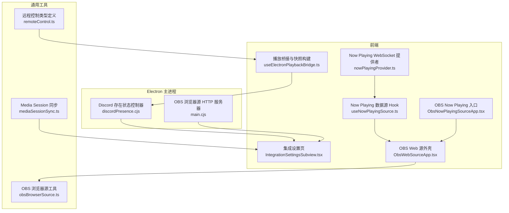
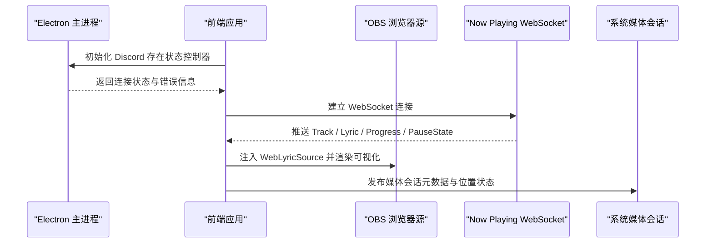
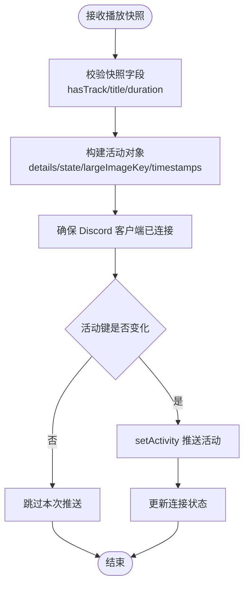
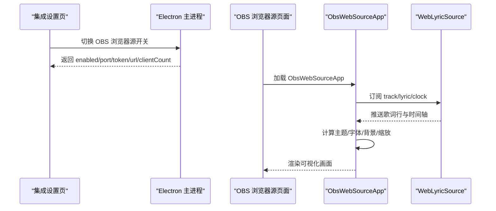
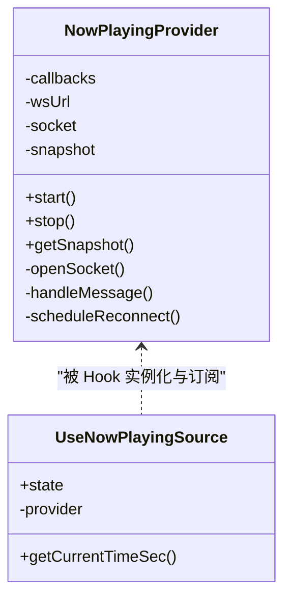
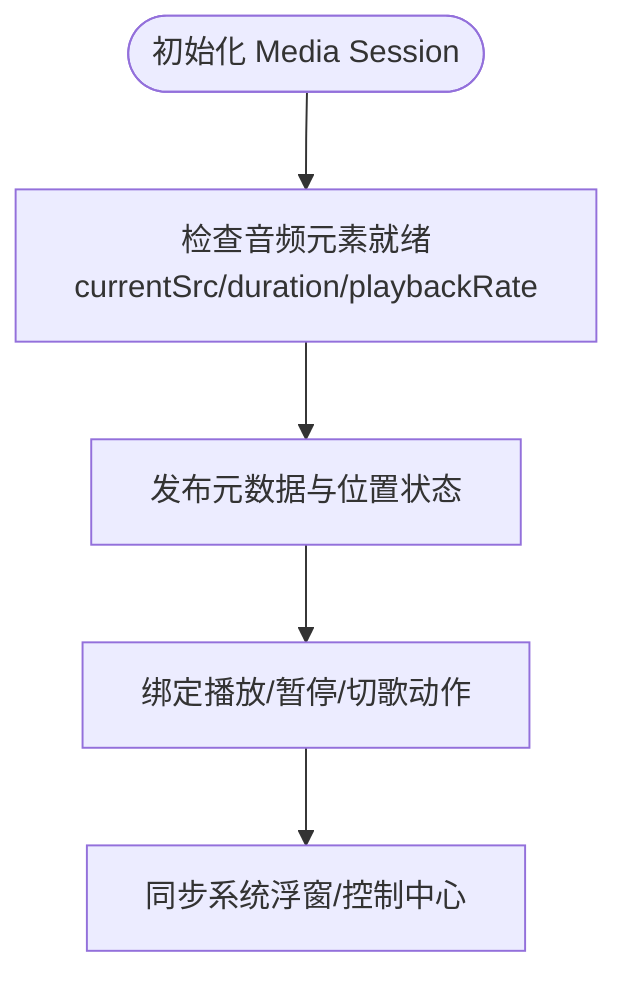
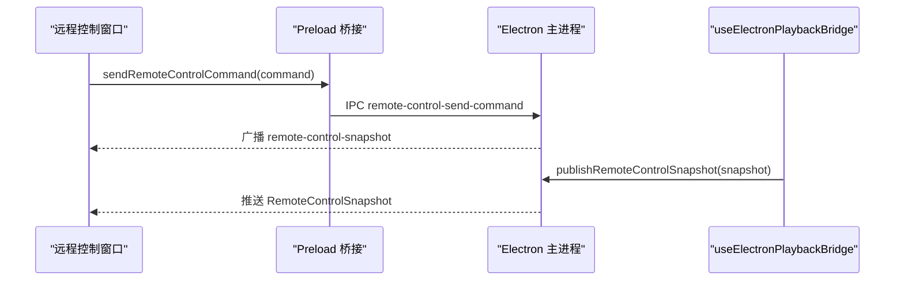
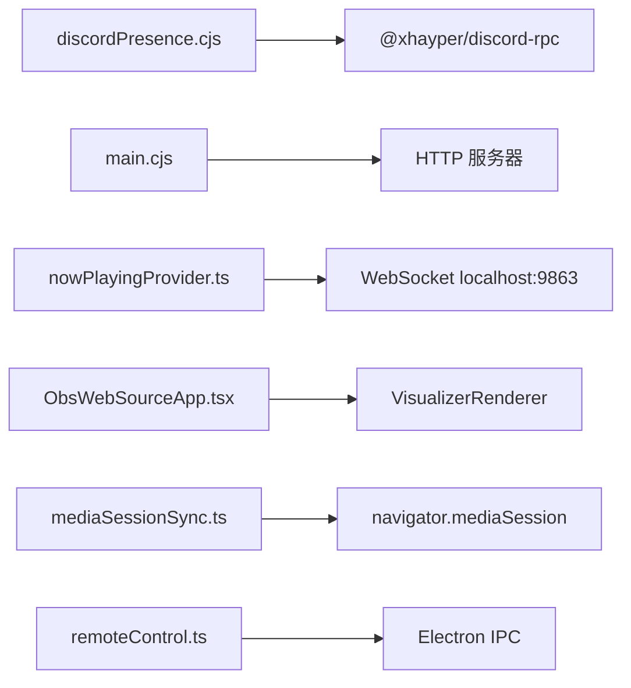

# 外部应用集成

<cite>
**本文引用的文件**   
- [discordPresence.cjs](file://electron/discordPresence.cjs)
- [main.cjs](file://electron/main.cjs)
- [useElectronPlaybackBridge.ts](file://src/hooks/useElectronPlaybackBridge.ts)
- [IntegrationSettingsSubview.tsx](file://src/components/modal/settings/IntegrationSettingsSubview.tsx)
- [ObsNowPlayingSourceApp.tsx](file://src/components/obs/ObsNowPlayingSourceApp.tsx)
- [ObsWebSourceApp.tsx](file://src/components/obs/ObsWebSourceApp.tsx)
- [useNowPlayingSource.ts](file://src/hooks/useNowPlayingSource.ts)
- [nowPlayingProvider.ts](file://src/services/nowPlayingProvider.ts)
- [obsBrowserSource.ts](file://src/utils/obsBrowserSource.ts)
- [mediaSessionSync.ts](file://src/utils/mediaSessionSync.ts)
- [useMediaSessionBridge.ts](file://src/hooks/useMediaSessionBridge.ts)
- [remoteControl.ts](file://src/types/remoteControl.ts)
</cite>

## 目录
1. [引言](#引言)
2. [项目结构](#项目结构)
3. [核心组件](#核心组件)
4. [架构总览](#架构总览)
5. [详细组件分析](#详细组件分析)
6. [依赖关系分析](#依赖关系分析)
7. [性能与稳定性](#性能与稳定性)
8. [故障排查指南](#故障排查指南)
9. [最佳实践与示例](#最佳实践与示例)
10. [结论](#结论)

## 引言
本文件面向 Folia Major 的外部应用集成，聚焦以下能力：
- Discord Rich Presence：游戏状态显示、歌曲信息同步、封面展示与连接状态管理。
- OBS Studio 集成：浏览器源支持、Now Playing 数据接入、实时歌词与进度推送、样式与主题定制。
- Now Playing 服务：系统级媒体信息显示、锁屏界面与控制中心适配（基于 Media Session）。
- 与其他音乐软件的互操作性：通过 WebSocket 的 Now Playing 协议、网络端口监听与远程控制接口。
- 第三方 API 集成模式：认证流程、数据同步与错误处理策略（以 Discord RPC 与 OBS 本地 HTTP 为例）。

## 项目结构
外部集成相关代码分布在 Electron 主进程、前端 Hook/组件与服务层：
- Electron 主进程负责 Discord RPC 客户端生命周期、OBS 浏览器源 HTTP 服务器与配置。
- 前端提供 Now Playing WebSocket 客户端、OBS 浏览器源渲染壳、设置页开关与状态展示。
- 通用工具封装了 Media Session 同步、OBS 浏览器源配置指纹与图片资源转换等。

**图表来源**
- [discordPresence.cjs:1-284](file://electron/discordPresence.cjs#L1-L284)
- [main.cjs:1945-1989](file://electron/main.cjs#L1945-L1989)
- [main.cjs:4428-4469](file://electron/main.cjs#L4428-L4469)
- [IntegrationSettingsSubview.tsx:374-396](file://src/components/modal/settings/IntegrationSettingsSubview.tsx#L374-L396)
- [IntegrationSettingsSubview.tsx:411-435](file://src/components/modal/settings/IntegrationSettingsSubview.tsx#L411-L435)
- [useNowPlayingSource.ts:1-111](file://src/hooks/useNowPlayingSource.ts#L1-L111)
- [nowPlayingProvider.ts:1-489](file://src/services/nowPlayingProvider.ts#L1-L489)
- [ObsWebSourceApp.tsx:1-268](file://src/components/obs/ObsWebSourceApp.tsx#L1-L268)
- [ObsNowPlayingSourceApp.tsx:1-26](file://src/components/obs/ObsNowPlayingSourceApp.tsx#L1-L26)
- [useElectronPlaybackBridge.ts:276-296](file://src/hooks/useElectronPlaybackBridge.ts#L276-L296)
- [mediaSessionSync.ts:1-97](file://src/utils/mediaSessionSync.ts#L1-L97)
- [obsBrowserSource.ts:1-269](file://src/utils/obsBrowserSource.ts#L1-L269)
- [remoteControl.ts:1-80](file://src/types/remoteControl.ts#L1-L80)

**章节来源**
- [discordPresence.cjs:1-284](file://electron/discordPresence.cjs#L1-L284)
- [main.cjs:1945-1989](file://electron/main.cjs#L1945-L1989)
- [main.cjs:4428-4469](file://electron/main.cjs#L4428-L4469)
- [IntegrationSettingsSubview.tsx:374-396](file://src/components/modal/settings/IntegrationSettingsSubview.tsx#L374-L396)
- [IntegrationSettingsSubview.tsx:411-435](file://src/components/modal/settings/IntegrationSettingsSubview.tsx#L411-L435)
- [useNowPlayingSource.ts:1-111](file://src/hooks/useNowPlayingSource.ts#L1-L111)
- [nowPlayingProvider.ts:1-489](file://src/services/nowPlayingProvider.ts#L1-L489)
- [ObsWebSourceApp.tsx:1-268](file://src/components/obs/ObsWebSourceApp.tsx#L1-L268)
- [ObsNowPlayingSourceApp.tsx:1-26](file://src/components/obs/ObsNowPlayingSourceApp.tsx#L1-L26)
- [useElectronPlaybackBridge.ts:276-296](file://src/hooks/useElectronPlaybackBridge.ts#L276-L296)
- [mediaSessionSync.ts:1-97](file://src/utils/mediaSessionSync.ts#L1-L97)
- [obsBrowserSource.ts:1-269](file://src/utils/obsBrowserSource.ts#L1-L269)
- [remoteControl.ts:1-80](file://src/types/remoteControl.ts#L1-L80)

## 核心组件
- Discord Rich Presence 控制器：负责应用 ID 校验、图像 URL 规范化、活动构建、连接与去抖更新。
- OBS 浏览器源 HTTP 服务器：在本地端口启动 HTTP 服务，生成访问 URL、Token 与客户端计数。
- Now Playing WebSocket 提供者：连接远端 Now Playing 服务，解析 Track/Lyric/Progress/PauseState 事件。
- OBS Web 源外壳：消费 WebLyricSource，驱动可视化渲染器，支持透明背景、4K 缩放、字体与主题定制。
- Media Session 同步：将当前歌曲元数据与位置状态发布到系统媒体会话，用于锁屏与控制中心。
- 远程控制类型：定义遥控窗口与主程序之间的命令与快照结构。

**章节来源**
- [discordPresence.cjs:1-284](file://electron/discordPresence.cjs#L1-L284)
- [main.cjs:1945-1989](file://electron/main.cjs#L1945-L1989)
- [nowPlayingProvider.ts:1-489](file://src/services/nowPlayingProvider.ts#L1-L489)
- [ObsWebSourceApp.tsx:1-268](file://src/components/obs/ObsWebSourceApp.tsx#L1-L268)
- [mediaSessionSync.ts:1-97](file://src/utils/mediaSessionSync.ts#L1-L97)
- [remoteControl.ts:1-80](file://src/types/remoteControl.ts#L1-L80)

## 架构总览
Folia Major 的外部集成由“主进程能力 + 前端数据源 + 通用工具”三层组成：
- 主进程暴露 Discord RPC 控制与 OBS 浏览器源 HTTP 服务。
- 前端通过 Hook 与服务层订阅 Now Playing 数据，并在 OBS 浏览器源中渲染可视化。
- 通用工具统一处理 Media Session 与 OBS 浏览器源的配置指纹、图片资源转换。

**图表来源**
- [discordPresence.cjs:103-275](file://electron/discordPresence.cjs#L103-L275)
- [nowPlayingProvider.ts:236-489](file://src/services/nowPlayingProvider.ts#L236-L489)
- [ObsWebSourceApp.tsx:35-268](file://src/components/obs/ObsWebSourceApp.tsx#L35-L268)
- [mediaSessionSync.ts:76-97](file://src/utils/mediaSessionSync.ts#L76-L97)

## 详细组件分析

### Discord Rich Presence 集成
- 应用 ID 与图像 URL 规范化：确保仅使用合法数字 ID 与安全的 HTTPS 图像地址，拒绝本地回环地址。
- 活动构建：根据播放快照生成标题、艺术家、封面、开始/结束时间戳；暂停时显示暂停状态。
- 连接管理：按需创建 Discord IPC 客户端，处理断开与登录失败，维护连接状态。
- 更新去抖：相同活动键值在固定间隔内不重复推送，减少 IPC 调用频率。

**图表来源**
- [discordPresence.cjs:52-101](file://electron/discordPresence.cjs#L52-L101)
- [discordPresence.cjs:166-226](file://electron/discordPresence.cjs#L166-L226)
- [discordPresence.cjs:228-264](file://electron/discordPresence.cjs#L228-L264)

**章节来源**
- [discordPresence.cjs:1-284](file://electron/discordPresence.cjs#L1-L284)

### OBS Studio 集成（浏览器源）
- 本地 HTTP 服务器：在 127.0.0.1 上监听端口，生成带 Token 的访问 URL，统计客户端数量。
- 启用/禁用与状态展示：设置页可切换 OBS 浏览器源开关，显示 URL、端口、客户端数与错误提示。
- 浏览器源渲染：ObsNowPlayingSourceApp 作为入口，ObsWebSourceApp 作为通用外壳，消费 WebLyricSource 并渲染可视化。
- 样式定制：支持透明背景、4K 缩放、自定义 CSS 资产、字体与主题选择，以及 AI 动态主题。

**图表来源**
- [main.cjs:1945-1989](file://electron/main.cjs#L1945-L1989)
- [main.cjs:4428-4469](file://electron/main.cjs#L4428-L4469)
- [IntegrationSettingsSubview.tsx:411-435](file://src/components/modal/settings/IntegrationSettingsSubview.tsx#L411-L435)
- [ObsNowPlayingSourceApp.tsx:1-26](file://src/components/obs/ObsNowPlayingSourceApp.tsx#L1-L26)
- [ObsWebSourceApp.tsx:1-268](file://src/components/obs/ObsWebSourceApp.tsx#L1-L268)

**章节来源**
- [main.cjs:1945-1989](file://electron/main.cjs#L1945-L1989)
- [main.cjs:4428-4469](file://electron/main.cjs#L4428-L4469)
- [IntegrationSettingsSubview.tsx:411-435](file://src/components/modal/settings/IntegrationSettingsSubview.tsx#L411-L435)
- [ObsNowPlayingSourceApp.tsx:1-26](file://src/components/obs/ObsNowPlayingSourceApp.tsx#L1-L26)
- [ObsWebSourceApp.tsx:1-268](file://src/components/obs/ObsWebSourceApp.tsx#L1-L268)

### Now Playing 服务（WebSocket 数据源）
- 连接管理：自动重连、连接状态回调、断线清理。
- 消息解析：Track、Lyric、PlayerPauseState、PlayerProgress、PlayerProgressReplay 五种事件。
- 时间轴同步：精确进度与粗略进度融合，暂停/恢复锚定位置，避免跳变。
- 歌词解析：复用 LyricParserFactory，按 source 解析 LRC/翻译/Karaoke 歌词。

**图表来源**
- [nowPlayingProvider.ts:236-489](file://src/services/nowPlayingProvider.ts#L236-L489)
- [useNowPlayingSource.ts:1-111](file://src/hooks/useNowPlayingSource.ts#L1-L111)

**章节来源**
- [nowPlayingProvider.ts:1-489](file://src/services/nowPlayingProvider.ts#L1-L489)
- [useNowPlayingSource.ts:1-111](file://src/hooks/useNowPlayingSource.ts#L1-L111)

### 系统级媒体信息显示（Media Session）
- 元数据发布：标题、艺术家、专辑、封面图，需满足支持的协议（http/https/data/blob）。
- 位置状态：duration、position、playbackRate，需在替换元数据前设置，否则平台会话会被清空。
- 动作绑定：播放/暂停/上一首/下一首等动作映射到应用内部播放控制。

**图表来源**
- [mediaSessionSync.ts:22-35](file://src/utils/mediaSessionSync.ts#L22-L35)
- [mediaSessionSync.ts:54-97](file://src/utils/mediaSessionSync.ts#L54-L97)
- [useMediaSessionBridge.ts:38-84](file://src/hooks/useMediaSessionBridge.ts#L38-L84)

**章节来源**
- [mediaSessionSync.ts:1-97](file://src/utils/mediaSessionSync.ts#L1-L97)
- [useMediaSessionBridge.ts:38-84](file://src/hooks/useMediaSessionBridge.ts#L38-L84)

### 远程控制接口与互操作性
- 远程控制窗口：通过 IPC 暴露打开/关闭/置顶/透明模式/窗口尺寸等能力。
- 快照与命令：RemoteControlSnapshot 描述当前播放状态，RemoteControlCommand 定义控制指令。
- 桥接与构建：useElectronPlaybackBridge 构建远程快照与 Discord 存在快照，供主进程与外部消费。

**图表来源**
- [remoteControl.ts:17-79](file://src/types/remoteControl.ts#L17-L79)
- [useElectronPlaybackBridge.ts:276-296](file://src/hooks/useElectronPlaybackBridge.ts#L276-L296)

**章节来源**
- [remoteControl.ts:1-80](file://src/types/remoteControl.ts#L1-L80)
- [useElectronPlaybackBridge.ts:276-296](file://src/hooks/useElectronPlaybackBridge.ts#L276-L296)

## 依赖关系分析
- Discord 集成依赖 Electron 主进程的 IPC 与 @xhayper/discord-rpc 客户端。
- OBS 集成依赖 Electron 主进程的 http.createServer 与前端 React 组件。
- Now Playing 依赖 WebSocket 服务端（localhost:9863），前端通过 NowPlayingProvider 订阅。
- Media Session 依赖浏览器原生 navigator.mediaSession API。
- 远程控制依赖 Electron IPC 与 RemoteControlSnapshot/Command 类型契约。

**图表来源**
- [discordPresence.cjs:196-210](file://electron/discordPresence.cjs#L196-L210)
- [main.cjs:4433-4449](file://electron/main.cjs#L4433-L4449)
- [nowPlayingProvider.ts:300-330](file://src/services/nowPlayingProvider.ts#L300-L330)
- [ObsWebSourceApp.tsx:217-263](file://src/components/obs/ObsWebSourceApp.tsx#L217-L263)
- [mediaSessionSync.ts:76-97](file://src/utils/mediaSessionSync.ts#L76-L97)
- [remoteControl.ts:17-79](file://src/types/remoteControl.ts#L17-L79)

**章节来源**
- [discordPresence.cjs:196-210](file://electron/discordPresence.cjs#L196-L210)
- [main.cjs:4433-4449](file://electron/main.cjs#L4433-L4449)
- [nowPlayingProvider.ts:300-330](file://src/services/nowPlayingProvider.ts#L300-L330)
- [ObsWebSourceApp.tsx:217-263](file://src/components/obs/ObsWebSourceApp.tsx#L217-L263)
- [mediaSessionSync.ts:76-97](file://src/utils/mediaSessionSync.ts#L76-L97)
- [remoteControl.ts:17-79](file://src/types/remoteControl.ts#L17-L79)

## 性能与稳定性
- Discord 更新去抖：相同活动键值在 15 秒内不重复推送，降低 IPC 压力。
- OBS 浏览器源配置指纹：避免重复发布等价配置，防止大对象序列化导致的内存峰值。
- 频谱下采样：将频谱数据限制为固定桶数，减少传输与渲染开销。
- Blob 封面转 Data URL：在 OBS 独立浏览器上下文中安全读取主窗口 blob URL。
- Now Playing 进度融合：精确进度优先，暂停/恢复锚定位置，避免跳变与抖动。

**章节来源**
- [discordPresence.cjs:249-253](file://electron/discordPresence.cjs#L249-L253)
- [obsBrowserSource.ts:17-33](file://src/utils/obsBrowserSource.ts#L17-L33)
- [obsBrowserSource.ts:185-209](file://src/utils/obsBrowserSource.ts#L185-L209)
- [obsBrowserSource.ts:240-269](file://src/utils/obsBrowserSource.ts#L240-L269)
- [nowPlayingProvider.ts:388-440](file://src/services/nowPlayingProvider.ts#L388-L440)

## 故障排查指南
- Discord 连接失败：检查应用 ID 是否为合法数字字符串，确认 Discord 客户端已运行；查看连接状态中的 error 字段。
- OBS 浏览器源不可用：确认端口未被占用，Token 已生成，URL 可在浏览器访问；检查客户端计数与错误日志。
- Now Playing 无数据：确认 WebSocket 地址正确（host:port），服务端已启动；查看连接状态与调试日志。
- Media Session 无封面或位置异常：检查封面 URL 协议是否受支持，音频元素是否就绪且 duration 有效。
- 远程控制不同步：确认 IPC 通道正常，RemoteControlSnapshot 字段完整，命令类型匹配。

**章节来源**
- [discordPresence.cjs:166-226](file://electron/discordPresence.cjs#L166-L226)
- [main.cjs:1945-1989](file://electron/main.cjs#L1945-L1989)
- [nowPlayingProvider.ts:300-330](file://src/services/nowPlayingProvider.ts#L300-L330)
- [mediaSessionSync.ts:22-35](file://src/utils/mediaSessionSync.ts#L22-L35)
- [remoteControl.ts:17-79](file://src/types/remoteControl.ts#L17-L79)

## 最佳实践与示例
- Discord 集成
  - 仅在启用且配置了应用 ID 时连接 Discord。
  - 使用 HTTPS 封面地址，避免本地回环地址。
  - 利用活动键去抖，避免频繁刷新。
- OBS 集成
  - 使用 ObsNowPlayingSourceApp 作为入口，ObsWebSourceApp 作为通用外壳。
  - 通过 URL cfg 参数控制外观，Custom CSS 注入背景与头像。
  - 开启透明背景与 4K 缩放以获得高质量输出。
- Now Playing 服务
  - 使用 buildNowPlayingWsUrl 构造 WebSocket 地址，便于 OBS 页面指定 host。
  - 区分精确与粗略进度，暂停/恢复时锚定时间轴。
- Media Session
  - 先设置位置状态再替换元数据，避免平台会话被清空。
  - 仅使用受支持的封面协议。
- 远程控制
  - 使用 RemoteControlSnapshot 描述状态，RemoteControlCommand 发送控制指令。
  - 通过 useElectronPlaybackBridge 构建快照，保证字段一致。

[本节为概念性指导，不直接分析具体文件]

## 结论
Folia Major 的外部应用集成围绕 Discord Rich Presence、OBS 浏览器源、Now Playing WebSocket 与 Media Session 四大支柱展开。主进程提供底层能力，前端通过 Hook 与服务层消费数据，通用工具保障性能与兼容性。遵循上述最佳实践，可实现稳定、高性能且可扩展的外部集成体验。