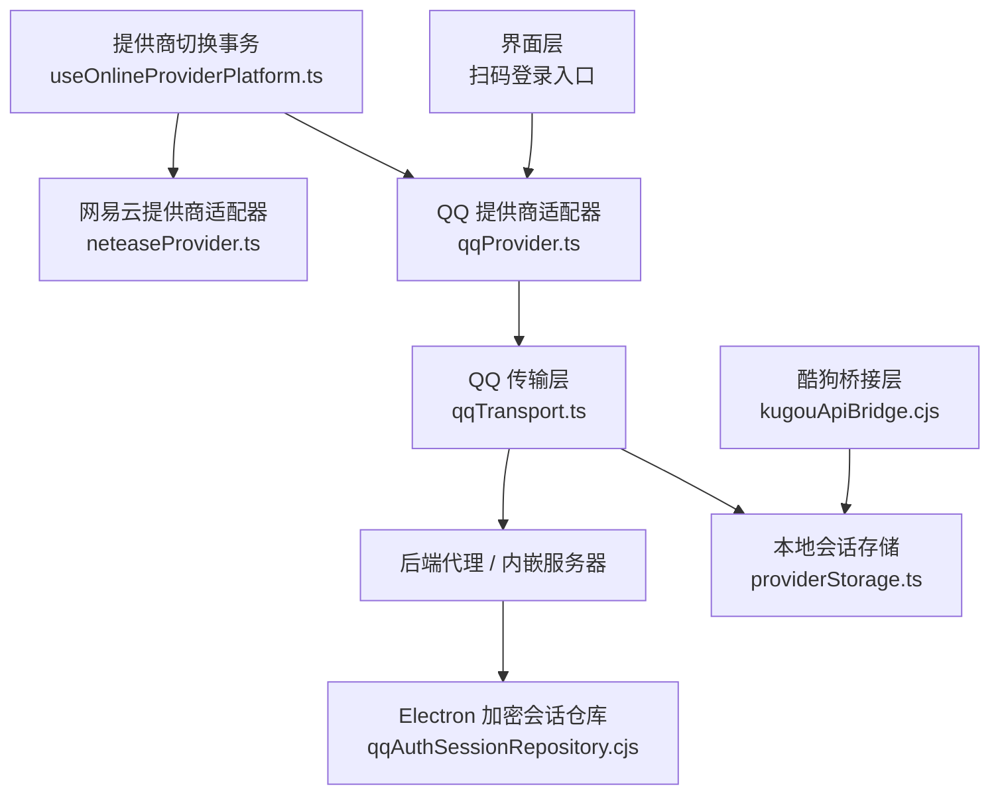
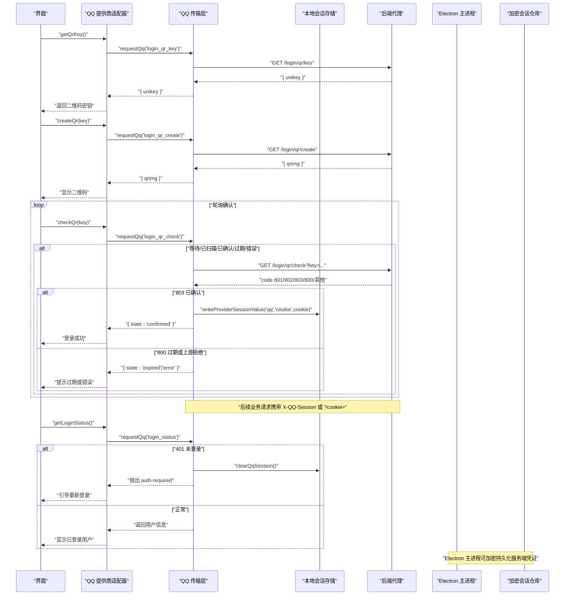
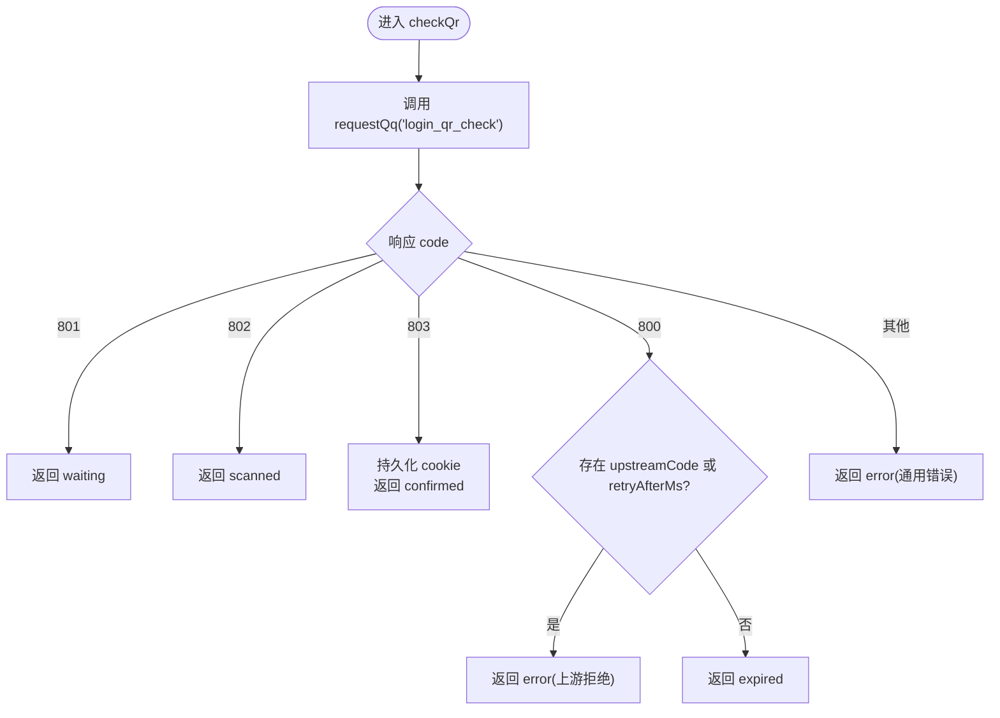
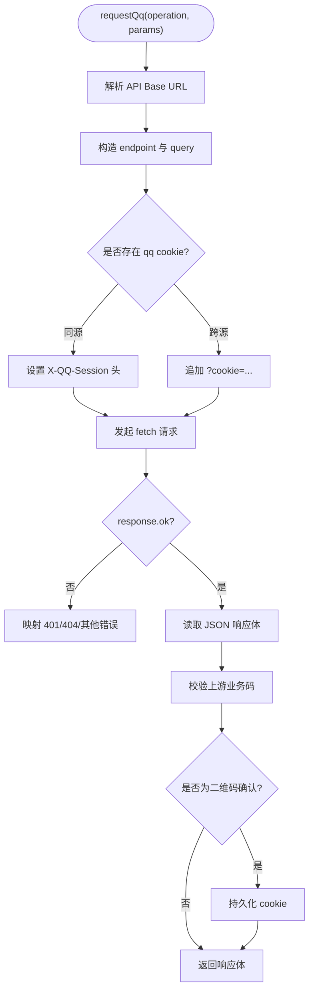
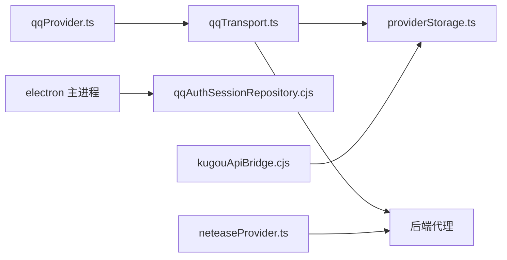

# OAuth2 认证流程

<cite>
**本文引用的文件**   
- [src/services/onlineMusic/qqProvider.ts](file://src/services/onlineMusic/qqProvider.ts)
- [src/services/onlineMusic/qqTransport.ts](file://src/services/onlineMusic/qqTransport.ts)
- [src/services/onlineMusic/providerStorage.ts](file://src/services/onlineMusic/providerStorage.ts)
- [electron/qqAuthSessionRepository.cjs](file://electron/qqAuthSessionRepository.cjs)
- [src/services/onlineMusic/neteaseProvider.ts](file://src/services/onlineMusic/neteaseProvider.ts)
- [electron/kugouApiBridge.cjs](file://electron/kugouApiBridge.cjs)
- [src/hooks/useOnlineProviderPlatform.ts](file://src/hooks/useOnlineProviderPlatform.ts)
- [test/unit/onlineMusic/qqTransport.test.ts](file://test/unit/onlineMusic/qqTransport.test.ts)
- [test/unit/electron/qqAuthSessionRepository.test.ts](file://test/unit/electron/qqAuthSessionRepository.test.ts)
</cite>

## 目录
1. [引言](#引言)
2. [项目结构](#项目结构)
3. [核心组件](#核心组件)
4. [架构总览](#架构总览)
5. [详细组件分析](#详细组件分析)
6. [依赖关系分析](#依赖关系分析)
7. [性能与可用性考虑](#性能与可用性考虑)
8. [故障排查指南](#故障排查指南)
9. [结论](#结论)
10. [附录：扩展新的 OAuth2 提供商适配器](#附录扩展新的-oauth2-提供商适配器)

## 引言
本文面向 Folia Major 的在线音乐提供商认证子系统，聚焦“授权码模式”在扫码登录场景下的完整实现。代码库中并未使用传统网页端 OAuth2 的浏览器跳转授权码流程，而是通过后端代理统一封装各厂商 API，并以“二维码 + 轮询确认”的方式完成身份建立与会话持久化。文档将说明：
- 授权请求构建、回调处理、令牌交换与会话持久化的端到端流程
- 会话管理策略：本地存储加密、自动刷新逻辑和过期检测
- 错误处理方案：网络异常重试、令牌失效处理和用户重新登录引导
- 集成示例：如何扩展新的 OAuth2 提供商适配器
- 安全最佳实践与调试技巧

## 项目结构
围绕在线音乐提供商认证的关键代码分布在以下位置：
- QQ 音乐提供商适配层：`src/services/onlineMusic/qqProvider.ts`
- QQ 传输层（HTTP 路由、凭据注入、错误映射）：`src/services/onlineMusic/qqTransport.ts`
- 提供商会话本地存储（localStorage 命名空间）：`src/services/onlineMusic/providerStorage.ts`
- Electron 主进程中的 QQ 认证会话加密持久化：`electron/qqAuthSessionRepository.cjs`
- 网易云音乐提供商适配层（作为另一个扫码登录参考实现）：`src/services/onlineMusic/neteaseProvider.ts`
- 酷狗桥接层（展示另一套凭据合并与渲染侧脱敏策略）：`electron/kugouApiBridge.cjs`
- 在线提供商切换事务工具：`src/hooks/useOnlineProviderPlatform.ts`

**图示来源**
- [src/services/onlineMusic/qqProvider.ts:696-767](file://src/services/onlineMusic/qqProvider.ts#L696-L767)
- [src/services/onlineMusic/qqTransport.ts:17-41](file://src/services/onlineMusic/qqTransport.ts#L17-L41)
- [src/services/onlineMusic/providerStorage.ts:6-12](file://src/services/onlineMusic/providerStorage.ts#L6-L12)
- [electron/qqAuthSessionRepository.cjs:28-77](file://electron/qqAuthSessionRepository.cjs#L28-L77)
- [src/services/onlineMusic/neteaseProvider.ts:341-386](file://src/services/onlineMusic/neteaseProvider.ts#L341-L386)
- [electron/kugouApiBridge.cjs:194-225](file://electron/kugouApiBridge.cjs#L194-L225)
- [src/hooks/useOnlineProviderPlatform.ts:39-50](file://src/hooks/useOnlineProviderPlatform.ts#L39-L50)

**章节来源**
- [src/services/onlineMusic/qqProvider.ts:696-767](file://src/services/onlineMusic/qqProvider.ts#L696-L767)
- [src/services/onlineMusic/qqTransport.ts:17-41](file://src/services/onlineMusic/qqTransport.ts#L17-L41)
- [src/services/onlineMusic/providerStorage.ts:6-12](file://src/services/onlineMusic/providerStorage.ts#L6-L12)
- [electron/qqAuthSessionRepository.cjs:28-77](file://electron/qqAuthSessionRepository.cjs#L28-L77)
- [src/services/onlineMusic/neteaseProvider.ts:341-386](file://src/services/onlineMusic/neteaseProvider.ts#L341-L386)
- [electron/kugouApiBridge.cjs:194-225](file://electron/kugouApiBridge.cjs#L194-L225)
- [src/hooks/useOnlineProviderPlatform.ts:39-50](file://src/hooks/useOnlineProviderPlatform.ts#L39-L50)

## 核心组件
- QQ 提供商适配器：对外暴露统一的 `OnlineMusicProvider` 能力，包括搜索、播放、歌词、认证、曲库、目录导航等；认证部分负责扫码密钥获取、二维码生成、状态轮询、登录状态检查与登出。
- QQ 传输层：负责把提供商调用映射到后端路径，注入会话凭据，解析上游错误码，并在二维码确认时持久化会话 cookie。
- 提供商会话存储：以命名空间键值对形式在 localStorage 中保存提供商会话片段，如 `online_provider:qq:cookie`。
- Electron 加密会话仓库：在主进程中将 QQ 服务端凭证进行信封封装并加密后写入 electron-store，避免明文落盘。
- 网易云提供商适配器：提供与 QQ 类似的扫码登录能力，可作为扩展新提供商的对照实现。
- 酷狗桥接层：演示了凭据合并与渲染侧脱敏的策略，适合理解不同提供商的凭据生命周期差异。
- 提供商切换事务：在扫码确认后刷新当前提供商，必要时再激活目标提供商，保证切换一致性。

**章节来源**
- [src/services/onlineMusic/qqProvider.ts:696-767](file://src/services/onlineMusic/qqProvider.ts#L696-L767)
- [src/services/onlineMusic/qqTransport.ts:17-41](file://src/services/onlineMusic/qqTransport.ts#L17-L41)
- [src/services/onlineMusic/providerStorage.ts:33-64](file://src/services/onlineMusic/providerStorage.ts#L33-L64)
- [electron/qqAuthSessionRepository.cjs:28-77](file://electron/qqAuthSessionRepository.cjs#L28-L77)
- [src/services/onlineMusic/neteaseProvider.ts:341-386](file://src/services/onlineMusic/neteaseProvider.ts#L341-L386)
- [electron/kugouApiBridge.cjs:194-225](file://electron/kugouApiBridge.cjs#L194-L225)
- [src/hooks/useOnlineProviderPlatform.ts:39-50](file://src/hooks/useOnlineProviderPlatform.ts#L39-L50)

## 架构总览
下图展示了从界面触发扫码登录到会话建立、后续请求携带凭据、以及令牌失效后重新登录的整体流程。

**图示来源**
- [src/services/onlineMusic/qqProvider.ts:732-753](file://src/services/onlineMusic/qqProvider.ts#L732-L753)
- [src/services/onlineMusic/qqTransport.ts:17-41](file://src/services/onlineMusic/qqTransport.ts#L17-L41)
- [src/services/onlineMusic/qqTransport.ts:160-164](file://src/services/onlineMusic/qqTransport.ts#L160-L164)
- [src/services/onlineMusic/qqTransport.ts:208-261](file://src/services/onlineMusic/qqTransport.ts#L208-L261)
- [src/services/onlineMusic/providerStorage.ts:52-54](file://src/services/onlineMusic/providerStorage.ts#L52-L54)
- [electron/qqAuthSessionRepository.cjs:28-77](file://electron/qqAuthSessionRepository.cjs#L28-L77)

## 详细组件分析

### QQ 提供商适配器
职责概览：
- 暴露 `qqProvider` 对象，声明能力集与标准化方法
- 认证相关：
  - `getQrKey`：向后端请求二维码密钥
  - `createQr`：根据密钥生成二维码图片地址
  - `checkQr`：轮询二维码状态，处理等待、已扫描、已确认、过期与错误
  - `cancelQr`：关闭二维码会话（失败不阻断 UI）
  - `getLoginStatus`：探测当前是否已登录，捕获 401 并转为“需要认证”
  - `logout`：调用后端登出接口并清理本地会话

关键行为：
- 二维码 TTL 为 175 秒，略短于后端 180 秒，避免死轮询
- 登录通道动态探测：优先读取后端 `/login/channels`，失败回退硬编码数组
- 播放质量降级策略：按标准/高音质/无损/Hi-Res 优先级尝试，区分上游拒绝与网络异常

**图示来源**
- [src/services/onlineMusic/qqProvider.ts:467-491](file://src/services/onlineMusic/qqProvider.ts#L467-L491)

**章节来源**
- [src/services/onlineMusic/qqProvider.ts:343-379](file://src/services/onlineMusic/qqProvider.ts#L343-L379)
- [src/services/onlineMusic/qqProvider.ts:381-453](file://src/services/onlineMusic/qqProvider.ts#L381-L453)
- [src/services/onlineMusic/qqProvider.ts:467-491](file://src/services/onlineMusic/qqProvider.ts#L467-L491)
- [src/services/onlineMusic/qqProvider.ts:696-767](file://src/services/onlineMusic/qqProvider.ts#L696-L767)

### QQ 传输层
职责概览：
- 维护操作名到后端路径的映射表
- 解析 Electron 内嵌端口或环境变量配置的 Web API Base URL
- 注入会话凭据：同源部署使用 `X-QQ-Session` 头，跨源使用 `?cookie=`
- 统一错误映射：
  - 401 → `auth-required`，并清理本地会话
  - 404 → `unsupported`，表示后端缺少该路由
  - 其他 HTTP 错误 → `network`
  - 上游业务错误（如专辑/歌手/歌单详情）→ `invalid-response`
- 在二维码确认响应中持久化会话 cookie

**图示来源**
- [src/services/onlineMusic/qqTransport.ts:17-41](file://src/services/onlineMusic/qqTransport.ts#L17-L41)
- [src/services/onlineMusic/qqTransport.ts:70-87](file://src/services/onlineMusic/qqTransport.ts#L70-L87)
- [src/services/onlineMusic/qqTransport.ts:95-113](file://src/services/onlineMusic/qqTransport.ts#L95-L113)
- [src/services/onlineMusic/qqTransport.ts:141-164](file://src/services/onlineMusic/qqTransport.ts#L141-L164)
- [src/services/onlineMusic/qqTransport.ts:208-261](file://src/services/onlineMusic/qqTransport.ts#L208-L261)

**章节来源**
- [src/services/onlineMusic/qqTransport.ts:17-41](file://src/services/onlineMusic/qqTransport.ts#L17-L41)
- [src/services/onlineMusic/qqTransport.ts:70-87](file://src/services/onlineMusic/qqTransport.ts#L70-L87)
- [src/services/onlineMusic/qqTransport.ts:95-113](file://src/services/onlineMusic/qqTransport.ts#L95-L113)
- [src/services/onlineMusic/qqTransport.ts:141-164](file://src/services/onlineMusic/qqTransport.ts#L141-L164)
- [src/services/onlineMusic/qqTransport.ts:208-261](file://src/services/onlineMusic/qqTransport.ts#L208-L261)

### 提供商会话存储
职责概览：
- 提供命名空间键前缀，避免不同提供商之间互相污染
- 支持旧键迁移：首次读取旧键后写入新键，逐步过渡
- 提供读、写、删除会话值的统一接口

典型键格式：
- `online_provider:qq:cookie`
- `online_provider:netease:cookie`

**章节来源**
- [src/services/onlineMusic/providerStorage.ts:6-12](file://src/services/onlineMusic/providerStorage.ts#L6-L12)
- [src/services/onlineMusic/providerStorage.ts:33-64](file://src/services/onlineMusic/providerStorage.ts#L33-L64)

### Electron 加密会话仓库
职责概览：
- 使用信封版本控制与 base64 编码，防止直接明文落盘
- 强制要求 Electron safeStorage 可用且非 `basic_text` 模式
- 空会话数组时仍允许删除磁盘上的密文，避免残留敏感数据

安全要点：
- 拒绝 Linux 下无加密的 `basic_text` 后端
- 加载时校验 envelope 结构与版本
- 保存时对明文进行加密后再写入 store

**章节来源**
- [electron/qqAuthSessionRepository.cjs:10-26](file://electron/qqAuthSessionRepository.cjs#L10-L26)
- [electron/qqAuthSessionRepository.cjs:28-77](file://electron/qqAuthSessionRepository.cjs#L28-L77)

### 网易云提供商适配器（参考实现）
职责概览：
- 提供扫码登录能力：获取二维码密钥、生成二维码、轮询确认
- 在确认成功后持久化 cookie
- 登录状态检查会同时验证登录接口与账户接口的一致性

对比价值：
- 与 QQ 提供商一致采用“扫码 + 轮询”的模式
- 错误信息保留原始状态码，便于日志诊断

**章节来源**
- [src/services/onlineMusic/neteaseProvider.ts:341-386](file://src/services/onlineMusic/neteaseProvider.ts#L341-L386)

### 酷狗桥接层（凭据合并与脱敏）
职责概览：
- 合并上游返回的 cookie、token、userid、dfid 等字段到会话
- 向渲染进程返回结果前，对敏感字段进行脱敏，避免 token 泄露

**章节来源**
- [electron/kugouApiBridge.cjs:194-225](file://electron/kugouApiBridge.cjs#L194-L225)

### 提供商切换事务
职责概览：
- 扫码登录后先刷新当前提供商，再决定是否切换到新提供商
- 若刷新失败则返回“刷新失败”，若用户拒绝切换则返回“切换被拒绝”

**章节来源**
- [src/hooks/useOnlineProviderPlatform.ts:39-50](file://src/hooks/useOnlineProviderPlatform.ts#L39-L50)

## 依赖关系分析
- 提供商适配器依赖传输层发送 HTTP 请求
- 传输层依赖会话存储读写 cookie
- Electron 主进程仓库独立于渲染进程，负责加密持久化服务端凭证
- 网易云与 QQ 提供商共享相同的“扫码登录”交互模型
- 酷狗桥接层展示了另一种凭据合并与脱敏策略

**图示来源**
- [src/services/onlineMusic/qqProvider.ts:696-767](file://src/services/onlineMusic/qqProvider.ts#L696-L767)
- [src/services/onlineMusic/qqTransport.ts:208-261](file://src/services/onlineMusic/qqTransport.ts#L208-L261)
- [src/services/onlineMusic/providerStorage.ts:33-64](file://src/services/onlineMusic/providerStorage.ts#L33-L64)
- [electron/qqAuthSessionRepository.cjs:28-77](file://electron/qqAuthSessionRepository.cjs#L28-L77)
- [src/services/onlineMusic/neteaseProvider.ts:341-386](file://src/services/onlineMusic/neteaseProvider.ts#L341-L386)
- [electron/kugouApiBridge.cjs:194-225](file://electron/kugouApiBridge.cjs#L194-L225)

**章节来源**
- [src/services/onlineMusic/qqProvider.ts:696-767](file://src/services/onlineMusic/qqProvider.ts#L696-L767)
- [src/services/onlineMusic/qqTransport.ts:208-261](file://src/services/onlineMusic/qqTransport.ts#L208-L261)
- [src/services/onlineMusic/providerStorage.ts:33-64](file://src/services/onlineMusic/providerStorage.ts#L33-L64)
- [electron/qqAuthSessionRepository.cjs:28-77](file://electron/qqAuthSessionRepository.cjs#L28-L77)
- [src/services/onlineMusic/neteaseProvider.ts:341-386](file://src/services/onlineMusic/neteaseProvider.ts#L341-L386)
- [electron/kugouApiBridge.cjs:194-225](file://electron/kugouApiBridge.cjs#L194-L225)

## 性能与可用性考虑
- 二维码轮询频率应受 TTL 限制，避免无效请求；QQ 提供商将 TTL 设置为 175 秒，略小于后端 180 秒
- 后端路由缺失时使用 404 语义而非网络错误，以便调用方优雅降级
- 上游业务错误需区分“参数错误”“资源不存在”“账号权限不足”，避免误判为临时网络抖动
- 播放质量降级策略减少因单一音质不可用导致的整体失败
- Electron 主进程加密持久化避免敏感凭证明文落盘，降低安全风险

[本节为通用指导，不直接分析具体文件]

## 故障排查指南
常见问题与定位建议：
- 二维码一直等待：检查后端 `/login/qr/check` 是否返回 801，确认设备是否扫描
- 二维码已过期：检查 800 分支是否携带 `upstreamCode` 或 `retryAfterMs`，若是上游拒绝则不应视为普通过期
- 401 未登录：传输层会清理本地 cookie 并抛出 `auth-required`，界面应引导重新登录
- 404 不支持路由：调用方应识别 `unsupported` 错误，回落到旧路由或提示后端版本过低
- 网易云登录诊断：保留原始状态码，便于区分风控与后端吞错
- Electron 加密仓库报错：检查 safeStorage 是否可用、是否选择了 `basic_text` 模式

**章节来源**
- [src/services/onlineMusic/qqTransport.ts:234-252](file://src/services/onlineMusic/qqTransport.ts#L234-L252)
- [src/services/onlineMusic/qqProvider.ts:467-491](file://src/services/onlineMusic/qqProvider.ts#L467-L491)
- [src/services/onlineMusic/neteaseProvider.ts:371-384](file://src/services/onlineMusic/neteaseProvider.ts#L371-L384)
- [electron/qqAuthSessionRepository.cjs:10-26](file://electron/qqAuthSessionRepository.cjs#L10-L26)
- [test/unit/onlineMusic/qqTransport.test.ts:326-353](file://test/unit/onlineMusic/qqTransport.test.ts#L326-L353)
- [test/unit/electron/qqAuthSessionRepository.test.ts:65-71](file://test/unit/electron/qqAuthSessionRepository.test.ts#L65-L71)

## 结论
Folia Major 的在线音乐提供商认证采用“扫码 + 轮询确认”的模式，由提供商适配器封装业务语义，传输层统一处理 HTTP 路由、凭据注入与错误映射，本地会话存储在渲染进程保存 cookie，Electron 主进程负责加密持久化服务端凭证。该设计在保证用户体验的同时，兼顾了安全性与可扩展性。扩展新提供商时，可参照 QQ 与网易云的适配器实现，遵循统一的错误语义与会话管理策略。

[本节为总结性内容，不直接分析具体文件]

## 附录：扩展新的 OAuth2 提供商适配器
步骤建议：
1. 新建提供商适配器文件，例如 `src/services/onlineMusic/newProvider.ts`
2. 实现 `OnlineMusicProvider` 接口，至少包含：
   - `id`、`displayName`、`shortName`
   - `capabilities` 能力声明
   - `auth` 认证方法：
     - `getQrKey`：获取二维码密钥
     - `createQr`：生成二维码图片地址
     - `checkQr`：轮询二维码状态，映射等待、已扫描、已确认、过期、错误
     - `getLoginStatus`：检查登录状态，处理 401 与匿名用户
     - `logout`：登出并清理本地会话
3. 如需与后端通信，新增传输层文件或复用现有传输层模式：
   - 定义操作名到后端路径的映射
   - 注入会话凭据（同源使用头，跨源使用查询参数）
   - 统一错误映射：`auth-required`、`unsupported`、`network`、`invalid-response`
4. 在二维码确认时持久化会话 cookie：
   - 使用 `writeProviderSessionValue(providerId, 'cookie', cookie)`
5. 在登出或 401 时清理本地会话：
   - 使用 `removeProviderSessionValue(providerId, 'cookie')`
6. 可选：在 Electron 主进程实现加密会话仓库，用于持久化服务端凭证
7. 注册提供商到应用启动流程，确保能力探测与 UI 展示一致

安全最佳实践：
- 不在 URL 中传递敏感 token，同源部署优先使用自定义头
- 拒绝无加密的后端存储模式
- 对渲染进程返回的数据进行脱敏，避免 token 泄露
- 保留上游原始错误码与消息，便于日志诊断

调试技巧：
- 打印二维码轮询状态变化，确认 801/802/803/800 分支
- 检查 401/404 分支是否正确映射为 `auth-required`/`unsupported`
- 在 Electron 主进程检查 safeStorage 是否可用及后端选择
- 使用单元测试模拟 fetch 与 localStorage，验证凭据注入与清理逻辑

**章节来源**
- [src/services/onlineMusic/qqProvider.ts:732-753](file://src/services/onlineMusic/qqProvider.ts#L732-L753)
- [src/services/onlineMusic/qqTransport.ts:17-41](file://src/services/onlineMusic/qqTransport.ts#L17-L41)
- [src/services/onlineMusic/qqTransport.ts:208-261](file://src/services/onlineMusic/qqTransport.ts#L208-L261)
- [src/services/onlineMusic/providerStorage.ts:52-54](file://src/services/onlineMusic/providerStorage.ts#L52-L54)
- [electron/qqAuthSessionRepository.cjs:28-77](file://electron/qqAuthSessionRepository.cjs#L28-L77)
- [src/services/onlineMusic/neteaseProvider.ts:341-386](file://src/services/onlineMusic/neteaseProvider.ts#L341-L386)
- [electron/kugouApiBridge.cjs:194-225](file://electron/kugouApiBridge.cjs#L194-L225)