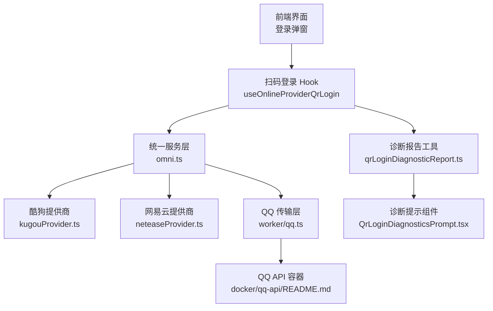
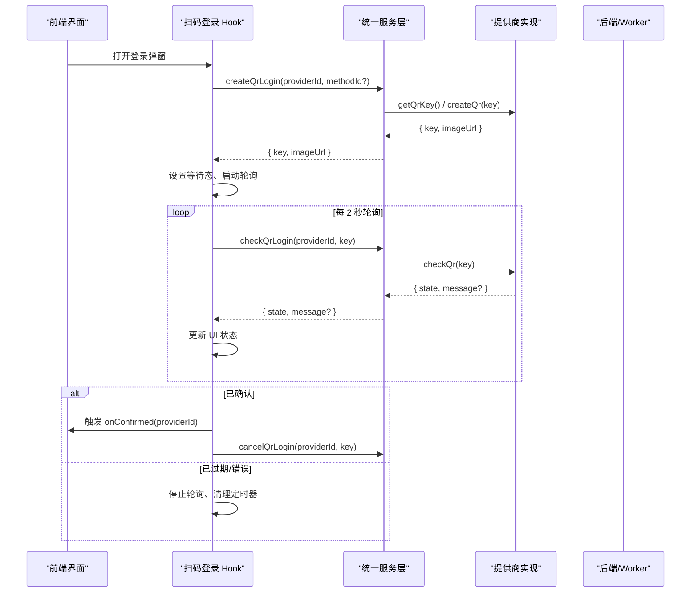
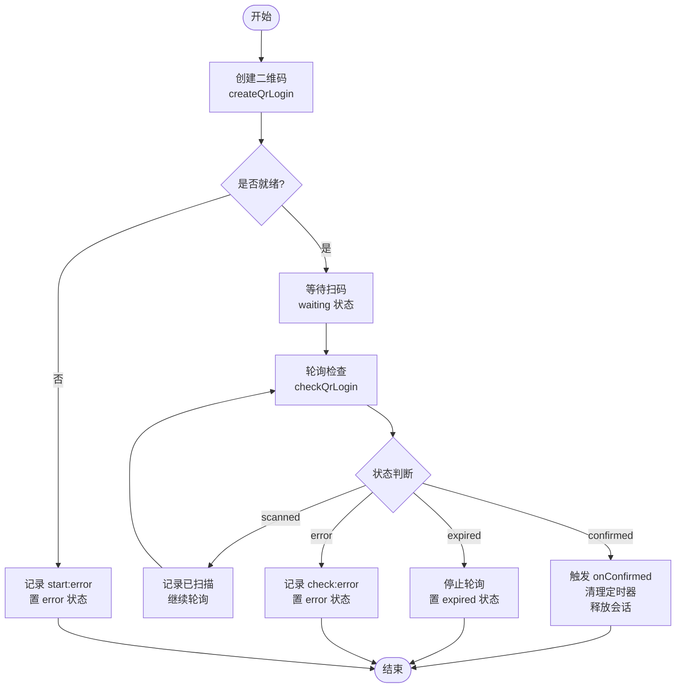
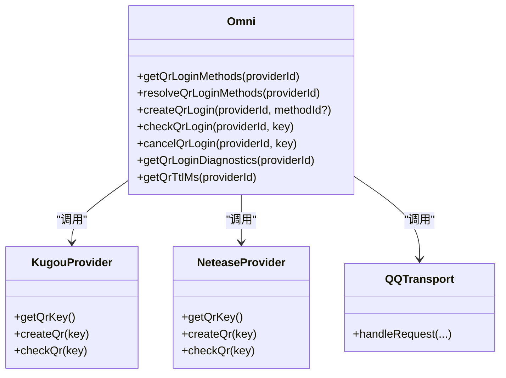
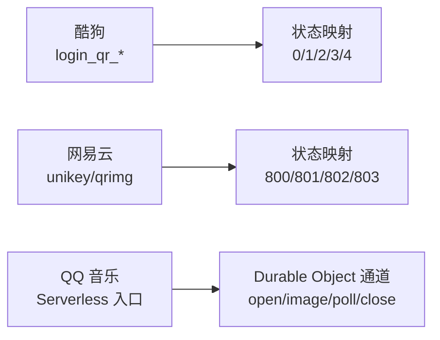
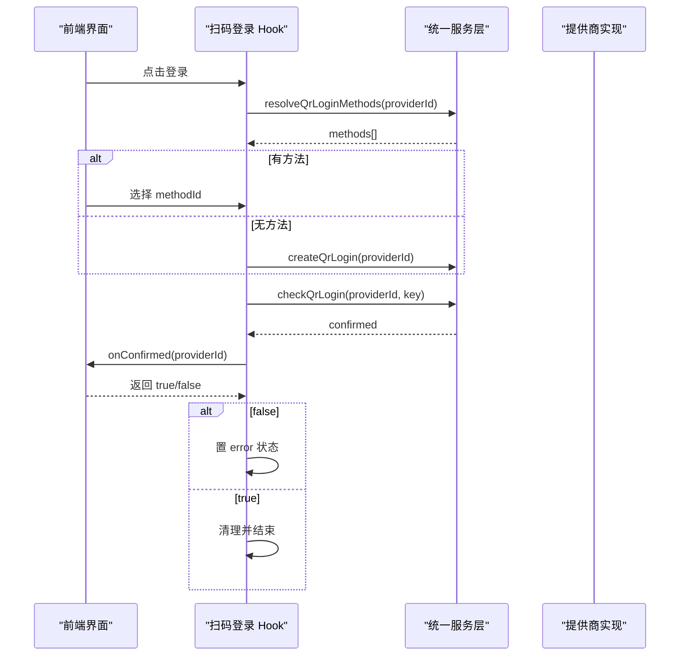
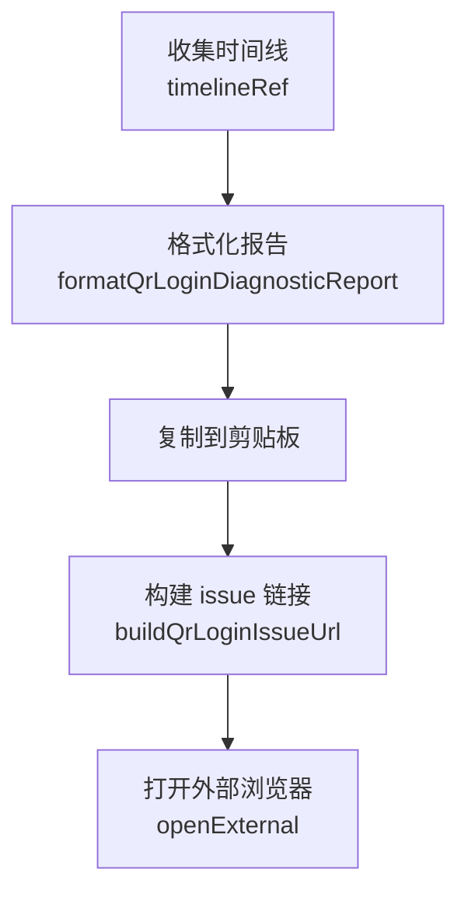
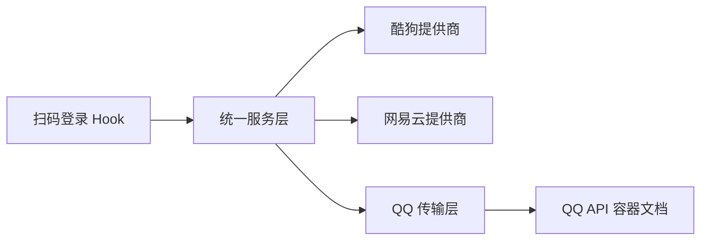

# 二维码登录系统

<cite>
**本文引用的文件**   
- [useOnlineProviderQrLogin.ts](file://src/hooks/useOnlineProviderQrLogin.ts)
- [omni.ts](file://src/services/onlineMusic/omni.ts)
- [kugouProvider.ts](file://src/services/onlineMusic/kugouProvider.ts)
- [neteaseProvider.ts](file://src/services/onlineMusic/neteaseProvider.ts)
- [qq.ts](file://worker/qq.ts)
- [qrLoginDiagnosticReport.ts](file://src/utils/qrLoginDiagnosticReport.ts)
- [QrLoginDiagnosticsPrompt.tsx](file://src/components/app/home/QrLoginDiagnosticsPrompt.tsx)
- [Grid3D.tsx](file://src/components/Grid3D.tsx)
- [README.md](file://deploy/docker/qq-api/README.md)
</cite>

## 目录
1. [引言](#引言)
2. [项目结构](#项目结构)
3. [核心组件](#核心组件)
4. [架构总览](#架构总览)
5. [详细组件分析](#详细组件分析)
6. [依赖关系分析](#依赖关系分析)
7. [性能与可靠性](#性能与可靠性)
8. [故障排除指南](#故障排除指南)
9. [结论](#结论)

## 引言
本文面向 Folia Major 的“扫码登录”子系统，覆盖从密钥生成、二维码图片获取、状态轮询到多平台适配与前端交互的全链路技术说明。文档重点包括：
- 二维码生成流程：密钥生成、图片获取与会话管理。
- 状态轮询机制：心跳式轮询、超时处理与状态同步。
- 多提供商适配：不同平台的二维码格式差异与统一接口设计。
- 前端交互流程：扫码确认、成功回调与失败重试。
- 故障排除：常见扫码问题与诊断工具使用。

## 项目结构
扫码登录相关代码主要分布在以下层次：
- 前端交互层：React Hook 驱动 UI 状态机，负责轮询、超时、取消与诊断报告生成。
- 统一服务层：Omni 提供跨提供商的统一扫码 API。
- 提供商实现层：各音乐平台（酷狗、网易云、QQ 音乐）的具体扫码协议与状态映射。
- 后端与 Worker 层：QQ 音乐的 Serverless 接入与 Durable Object 通道；容器化 QQ API 的错误语义说明。
- 诊断与提示：统一的诊断报告格式化与用户侧提示组件。

**图示来源**
- [useOnlineProviderQrLogin.ts:52-198](file://src/hooks/useOnlineProviderQrLogin.ts#L52-L198)
- [omni.ts:204-247](file://src/services/onlineMusic/omni.ts#L204-L247)
- [kugouProvider.ts:1188-1207](file://src/services/onlineMusic/kugouProvider.ts#L1188-L1207)
- [neteaseProvider.ts:363-382](file://src/services/onlineMusic/neteaseProvider.ts#L363-L382)
- [qq.ts:109-134](file://worker/qq.ts#L109-L134)
- [README.md:185-200](file://deploy/docker/qq-api/README.md#L185-L200)

**章节来源**
- [useOnlineProviderQrLogin.ts:1-228](file://src/hooks/useOnlineProviderQrLogin.ts#L1-L228)
- [omni.ts:1-663](file://src/services/onlineMusic/omni.ts#L1-L663)
- [kugouProvider.ts:1170-1369](file://src/services/onlineMusic/kugouProvider.ts#L1170-L1369)
- [neteaseProvider.ts:357-382](file://src/services/onlineMusic/neteaseProvider.ts#L357-L382)
- [qq.ts:1-135](file://worker/qq.ts#L1-L135)
- [qrLoginDiagnosticReport.ts:1-90](file://src/utils/qrLoginDiagnosticReport.ts#L1-L90)
- [QrLoginDiagnosticsPrompt.tsx:1-94](file://src/components/app/home/QrLoginDiagnosticsPrompt.tsx#L1-L94)
- [README.md:185-200](file://deploy/docker/qq-api/README.md#L185-L200)

## 核心组件
- 扫码登录 Hook：封装扫码生命周期、轮询、TTL 超时、会话取消与诊断数据收集。
- Omni 统一接口：屏蔽提供商差异，暴露 getQrKey/createQr/checkQr/cancelQr/getQrTtlMs/getQrLoginDiagnostics 等能力。
- 提供商实现：
  - 酷狗：通过 login_qr_key/login_qr_create/login_qr_check 返回状态码并映射为 waiting/scanned/confirmed/expired/error。
  - 网易云：通过 unikey/qrimg 与状态码 800/801/802/803 映射，并在确认时写入 cookie。
  - QQ 音乐：Serverless 入口将请求转发至后端 handleRequest，可选通过 Durable Object 通道推送事件。
- 诊断与提示：统一格式化时间线与 provider 诊断信息，并提供复制与 GitHub issue 链接。

**章节来源**
- [useOnlineProviderQrLogin.ts:52-198](file://src/hooks/useOnlineProviderQrLogin.ts#L52-L198)
- [omni.ts:204-247](file://src/services/onlineMusic/omni.ts#L204-L247)
- [kugouProvider.ts:1188-1207](file://src/services/onlineMusic/kugouProvider.ts#L1188-L1207)
- [neteaseProvider.ts:363-382](file://src/services/onlineMusic/neteaseProvider.ts#L363-L382)
- [qq.ts:109-134](file://worker/qq.ts#L109-L134)
- [qrLoginDiagnosticReport.ts:36-68](file://src/utils/qrLoginDiagnosticReport.ts#L36-L68)
- [QrLoginDiagnosticsPrompt.tsx:30-90](file://src/components/app/home/QrLoginDiagnosticsPrompt.tsx#L30-L90)

## 架构总览
扫码登录的整体调用链如下：
- 前端触发登录，Hook 调用 Omni.createQrLogin 获取 key 与 imageUrl。
- Hook 启动定时器轮询 Omni.checkQrLogin，根据状态更新 UI。
- 若 TTL 存在，前端额外维护过期计时器；否则以服务端状态为准。
- 确认成功后，Hook 调用 onConfirmed 完成账户刷新或后续逻辑。
- 关闭弹窗或切换会话时，Hook 调用 Omni.cancelQrLogin 释放后端会话。

**图示来源**
- [useOnlineProviderQrLogin.ts:101-198](file://src/hooks/useOnlineProviderQrLogin.ts#L101-L198)
- [omni.ts:215-232](file://src/services/onlineMusic/omni.ts#L215-L232)
- [kugouProvider.ts:1188-1207](file://src/services/onlineMusic/kugouProvider.ts#L1188-L1207)
- [neteaseProvider.ts:363-382](file://src/services/onlineMusic/neteaseProvider.ts#L363-L382)

## 详细组件分析

### 扫码登录 Hook：状态机与轮询
- 职责：
  - 发起扫码：调用 Omni.createQrLogin，设置 imageUrl 与 waiting 状态。
  - 轮询检查：每 2 秒调用 Omni.checkQrLogin，记录 polls 与 timeline。
  - TTL 控制：若 provider 声明了 TTL，则在前端维护过期计时器；否则依赖后端状态。
  - 成功回调：当 state=confirmed，调用 onConfirmed，并根据返回值决定是否标记失败。
  - 会话释放：关闭弹窗或切换会话时调用 Omni.cancelQrLogin，避免影响其他客户端。
  - 诊断收集：记录事件时间线，支持生成可粘贴的诊断报告。
- 关键行为：
  - 防重叠轮询：每次 poll 完成后才调度下一次，避免并发请求。
  - 会话隔离：sessionId 自增，确保旧轮询结果被丢弃。
  - 失败分类：start-error、check-error、expired-after-scan、account-refresh-failed 等。

**图示来源**
- [useOnlineProviderQrLogin.ts:101-198](file://src/hooks/useOnlineProviderQrLogin.ts#L101-L198)

**章节来源**
- [useOnlineProviderQrLogin.ts:1-228](file://src/hooks/useOnlineProviderQrLogin.ts#L1-L228)

### 统一服务层 Omni：多提供商桥接
- 职责：
  - 能力发现：getQrLoginMethods/resolveQrLoginMethods。
  - 扫码流程：createQrLogin/checkQrLogin/cancelQrLogin。
  - 诊断与 TTL：getQrLoginDiagnostics/getQrTtlMs。
- 设计要点：
  - 对未实现的 provider 能力返回空或 no-op，保证 netease/kugou 不受影响。
  - 诊断方法自身不能失败，捕获异常并转为提示信息。
  - TTL 仅在使用者显式声明时才由前端计时。

**图示来源**
- [omni.ts:204-247](file://src/services/onlineMusic/omni.ts#L204-L247)
- [kugouProvider.ts:1188-1207](file://src/services/onlineMusic/kugouProvider.ts#L1188-L1207)
- [neteaseProvider.ts:363-382](file://src/services/onlineMusic/neteaseProvider.ts#L363-L382)
- [qq.ts:109-134](file://worker/qq.ts#L109-L134)

**章节来源**
- [omni.ts:204-247](file://src/services/onlineMusic/omni.ts#L204-L247)

### 提供商实现：酷狗、网易云、QQ 音乐
- 酷狗：
  - 密钥：login_qr_key。
  - 图片：login_qr_create，返回 base64/url。
  - 状态：login_qr_check，status 0/1/2/3/4 映射为 expired/waiting/scanned/confirmed。
- 网易云：
  - 密钥：unikey。
  - 图片：qrimg。
  - 状态：800=expired，801=waiting，802=scanned，803=confirmed（同时写 cookie）。
- QQ 音乐：
  - Serverless 入口 handleQqServerlessRequest 将路径还原后交给后端 handleRequest。
  - 可选通过 Durable Object 通道推送 open/image/poll/close 事件。

**图示来源**
- [kugouProvider.ts:1188-1207](file://src/services/onlineMusic/kugouProvider.ts#L1188-L1207)
- [neteaseProvider.ts:363-382](file://src/services/onlineMusic/neteaseProvider.ts#L363-L382)
- [qq.ts:63-92](file://worker/qq.ts#L63-L92)

**章节来源**
- [kugouProvider.ts:1188-1207](file://src/services/onlineMusic/kugouProvider.ts#L1188-L1207)
- [neteaseProvider.ts:363-382](file://src/services/onlineMusic/neteaseProvider.ts#L363-L382)
- [qq.ts:1-135](file://worker/qq.ts#L1-L135)

### 前端交互流程：扫码确认、成功回调与失败重试
- 扫码确认：Hook 在 state=confirmed 时调用 onConfirmed，由上层决定是否需要刷新账户或执行其他操作。
- 成功回调：onConfirmed 返回 false 表示扫码已确认但未拿到登录态，Hook 将其视为失败。
- 失败重试：
  - start-error：创建二维码失败。
  - check-error：轮询检查失败。
  - expired-after-scan：扫码后过期。
  - account-refresh-failed：确认成功但账户刷新失败。
- 界面提示：Grid3D 中初始化登录流程，支持选择登录方式与展示后端错误。

**图示来源**
- [useOnlineProviderQrLogin.ts:101-198](file://src/hooks/useOnlineProviderQrLogin.ts#L101-L198)
- [Grid3D.tsx:322-345](file://src/components/Grid3D.tsx#L322-L345)

**章节来源**
- [useOnlineProviderQrLogin.ts:101-198](file://src/hooks/useOnlineProviderQrLogin.ts#L101-L198)
- [Grid3D.tsx:322-345](file://src/components/Grid3D.tsx#L322-L345)

### 诊断与提示：时间线与报告生成
- 时间线：Hook 记录 start/ready/state/complete 等事件，限制最近 60 条。
- 报告格式化：统一字段（generated/at/user agent/provider/failure/timeline/provider details），可直接粘贴到 GitHub issue。
- 用户提示：提供复制报告与打开 issue 链接按钮，Electron 下通过主进程打开外部浏览器。

**图示来源**
- [useOnlineProviderQrLogin.ts:202-215](file://src/hooks/useOnlineProviderQrLogin.ts#L202-L215)
- [qrLoginDiagnosticReport.ts:36-89](file://src/utils/qrLoginDiagnosticReport.ts#L36-L89)
- [QrLoginDiagnosticsPrompt.tsx:42-60](file://src/components/app/home/QrLoginDiagnosticsPrompt.tsx#L42-L60)

**章节来源**
- [qrLoginDiagnosticReport.ts:1-90](file://src/utils/qrLoginDiagnosticReport.ts#L1-L90)
- [QrLoginDiagnosticsPrompt.tsx:1-94](file://src/components/app/home/QrLoginDiagnosticsPrompt.tsx#L1-L94)

## 依赖关系分析
- 耦合关系：
  - Hook 强依赖 Omni 提供的统一接口，弱依赖具体 provider 实现。
  - Omni 对 provider 的能力进行探测，缺失能力时优雅降级。
  - QQ Transport 与 Docker qq-api 文档解耦，通过标准 HTTP 与可选 DO 通道协作。
- 外部依赖：
  - QQ 音乐后端 serverless 路由与前缀处理。
  - Docker qq-api 的状态码语义（409/404/429/502）与 cancel 幂等性。

**图示来源**
- [useOnlineProviderQrLogin.ts:52-198](file://src/hooks/useOnlineProviderQrLogin.ts#L52-L198)
- [omni.ts:204-247](file://src/services/onlineMusic/omni.ts#L204-L247)
- [README.md:185-200](file://deploy/docker/qq-api/README.md#L185-L200)

**章节来源**
- [omni.ts:204-247](file://src/services/onlineMusic/omni.ts#L204-L247)
- [README.md:185-200](file://deploy/docker/qq-api/README.md#L185-L200)

## 性能与可靠性
- 轮询频率：固定 2 秒一次，避免频繁请求造成后端压力。
- 防重叠：每次轮询完成后才调度下一次，防止并发。
- TTL 控制：仅在 provider 显式声明 TTL 时由前端计时，减少无效轮询。
- 会话释放：关闭弹窗或切换会话时立即释放后端会话，避免资源泄漏。
- 错误退避：QQ API 文档指出 429/502 属于预期退避行为，客户端应遵循 Retry-After。

[本节为通用指导，不直接分析具体文件]

## 故障排除指南
- 常见状态码与处理：
  - 409：同一 key 重复创建或已有扫码确认中；等待确认完成或超时，未被扫过的旧二维码会被新请求接管。
  - 404：会话不存在或已过期；重新调用 /login/qr/key 换 key。
  - 429：指数退避；按响应中的 Retry-After 等待后重试。
  - 502：装置注册或二维码创建向上游失败；首次返回 502 并附 Retry-After，随后转为 429。
- 取消接口幂等性：/login/qr/cancel?key=<key> 对未知或过期 key 返回 200；成功会话不会被取消，留给其自然过期。
- 日志排查：查看容器日志定位上游错误。

**章节来源**
- [README.md:185-200](file://deploy/docker/qq-api/README.md#L185-L200)

## 结论
Folia Major 的扫码登录系统通过 Hook 驱动的前端状态机、Omni 统一服务层与各提供商实现解耦，实现了跨平台一致的扫码体验。系统具备完善的轮询、TTL 控制、会话释放与诊断能力，配合 QQ API 容器的错误语义说明，便于快速定位与修复问题。建议在新增提供商时严格遵循 Omni 接口契约，明确状态映射与 TTL 策略，并确保诊断信息可追溯。