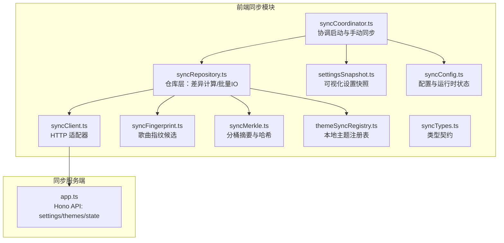
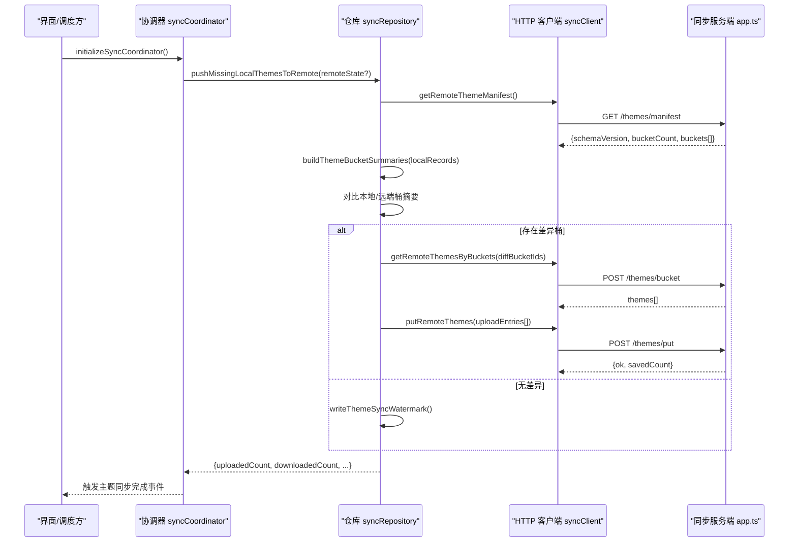
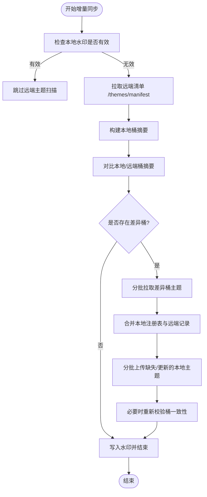
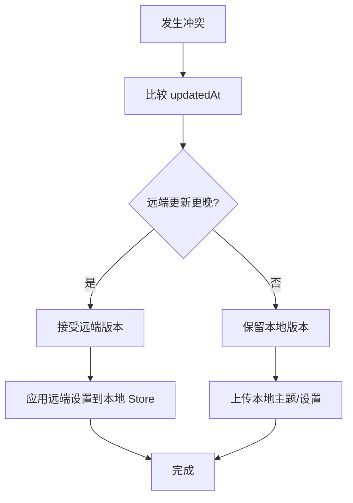
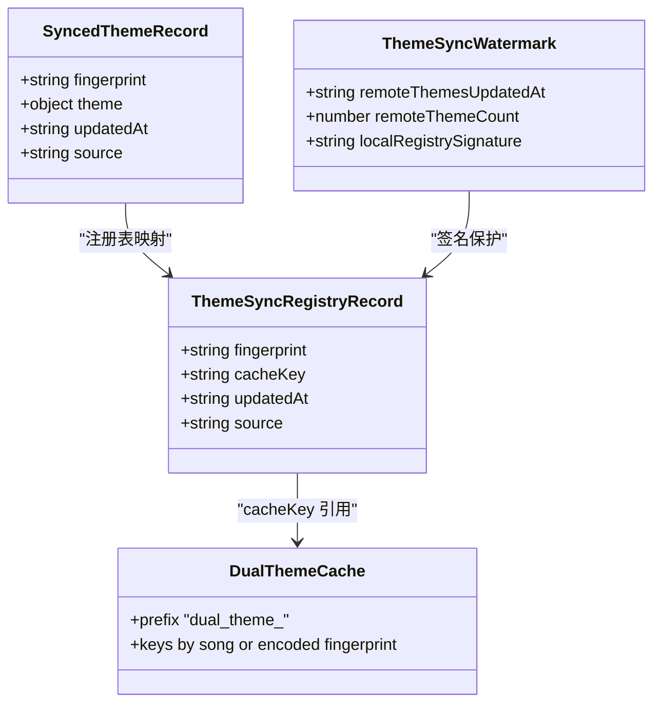
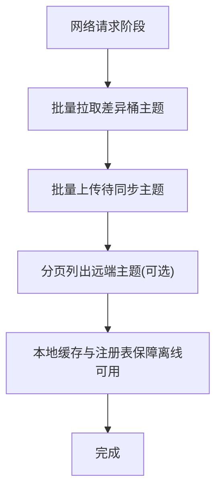
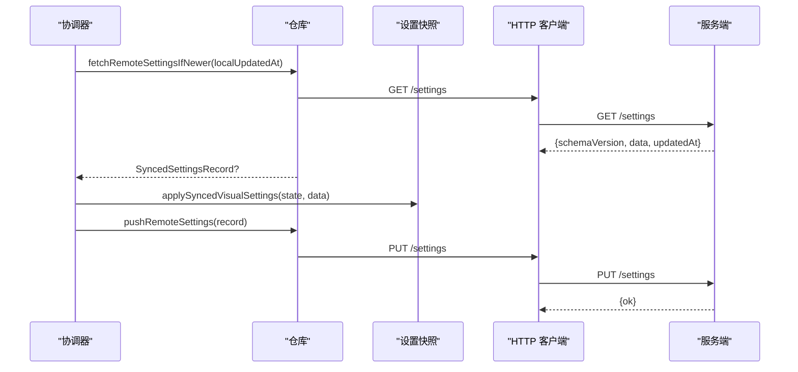
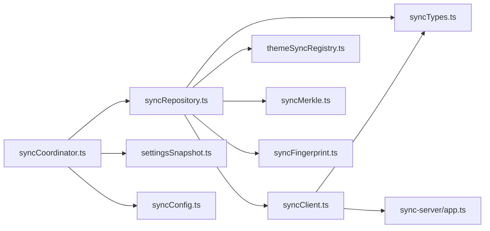

# 数据同步机制

<cite>
**本文引用的文件**   
- [syncClient.ts](file://src/services/sync/syncClient.ts)
- [syncCoordinator.ts](file://src/services/sync/syncCoordinator.ts)
- [syncRepository.ts](file://src/services/sync/syncRepository.ts)
- [syncTypes.ts](file://src/services/sync/syncTypes.ts)
- [syncConfig.ts](file://src/services/sync/syncConfig.ts)
- [settingsSnapshot.ts](file://src/services/sync/settingsSnapshot.ts)
- [syncFingerprint.ts](file://src/services/sync/syncFingerprint.ts)
- [syncMerkle.ts](file://src/services/sync/syncMerkle.ts)
- [themeSyncRegistry.ts](file://src/services/sync/themeSyncRegistry.ts)
- [onlineCollectionSync.ts](file://src/components/folia-grid/onlineCollectionSync.ts)
- [app.ts](file://sync-server/src/app.ts)
</cite>

## 目录
1. [引言](#引言)
2. [项目结构](#项目结构)
3. [核心组件](#核心组件)
4. [架构总览](#架构总览)
5. [详细组件分析](#详细组件分析)
6. [依赖关系分析](#依赖关系分析)
7. [性能与网络优化](#性能与网络优化)
8. [故障排查指南](#故障排查指南)
9. [结论](#结论)

## 引言
本文面向 Folia Major 的数据同步子系统，重点说明以下能力：
- 增量同步算法：变更检测、差异计算与批量更新策略。
- 冲突解决机制：时间戳比较、版本控制与手动合并选项。
- 缓存策略：本地缓存结构、过期策略与一致性保证。
- 网络优化：请求合并、断点续传与离线支持。
- 性能调优与监控指标定义。

该子系统由前端同步客户端与服务端两部分组成：前端负责状态快照、指纹生成、差异计算、批量上传下载；服务端提供设置与主题数据的持久化、分桶清单与批量写入接口。

## 项目结构
同步相关代码主要位于 `src/services/sync`，并配合一个独立的 Node/Hono 同步服务 `sync-server`。

**图表来源**
- [syncCoordinator.ts:1-214](file://src/services/sync/syncCoordinator.ts#L1-L214)
- [syncRepository.ts:1-515](file://src/services/sync/syncRepository.ts#L1-L515)
- [syncClient.ts:1-152](file://src/services/sync/syncClient.ts#L1-L152)
- [settingsSnapshot.ts:1-145](file://src/services/sync/settingsSnapshot.ts#L1-L145)
- [syncFingerprint.ts:1-103](file://src/services/sync/syncFingerprint.ts#L1-L103)
- [syncMerkle.ts:1-50](file://src/services/sync/syncMerkle.ts#L1-L50)
- [themeSyncRegistry.ts:1-210](file://src/services/sync/themeSyncRegistry.ts#L1-L210)
- [syncConfig.ts:1-111](file://src/services/sync/syncConfig.ts#L1-L111)
- [syncTypes.ts:1-119](file://src/services/sync/syncTypes.ts#L1-L119)
- [app.ts:1-523](file://sync-server/src/app.ts#L1-L523)

**章节来源**
- [syncCoordinator.ts:1-214](file://src/services/sync/syncCoordinator.ts#L1-L214)
- [syncRepository.ts:1-515](file://src/services/sync/syncRepository.ts#L1-L515)
- [syncClient.ts:1-152](file://src/services/sync/syncClient.ts#L1-L152)
- [app.ts:1-523](file://sync-server/src/app.ts#L1-L523)

## 核心组件
- 协调器（Coordinator）：对外暴露初始化、测试连接、拉取远程设置、执行一次完整同步、导出/导入同步库等入口。
- 仓库（Repository）：实现增量同步的核心逻辑，包括远端状态获取、设置拉取/推送、主题指纹候选、分桶差异计算、批量上传下载、本地注册表维护。
- HTTP 客户端（Client）：封装认证、URL 拼接、JSON 解析与错误包装，统一调用服务端 API。
- 设置快照（Settings Snapshot）：将多个 UI 设置 Store 聚合为可同步的 JSON 文档，并提供反向应用方法。
- 指纹（Fingerprint）：基于在线媒体 ID 或元数据生成稳定键，用于跨设备映射主题。
- 分桶摘要（Merkle Bucket）：按固定数量分桶，对每个桶计算条目数、最大更新时间与异或哈希，用于快速差异检测。
- 主题注册表（Theme Registry）：记录本地可同步的主题缓存键与远端指纹映射，支持历史迁移。
- 配置与状态（Config & Status）：持久化用户配置的同步服务地址与令牌，以及运行时的同步状态事件。

**章节来源**
- [syncCoordinator.ts:1-214](file://src/services/sync/syncCoordinator.ts#L1-L214)
- [syncRepository.ts:1-515](file://src/services/sync/syncRepository.ts#L1-L515)
- [syncClient.ts:1-152](file://src/services/sync/syncClient.ts#L1-L152)
- [settingsSnapshot.ts:1-145](file://src/services/sync/settingsSnapshot.ts#L1-L145)
- [syncFingerprint.ts:1-103](file://src/services/sync/syncFingerprint.ts#L1-L103)
- [syncMerkle.ts:1-50](file://src/services/sync/syncMerkle.ts#L1-L50)
- [themeSyncRegistry.ts:1-210](file://src/services/sync/themeSyncRegistry.ts#L1-L210)
- [syncConfig.ts:1-111](file://src/services/sync/syncConfig.ts#L1-L111)

## 架构总览
下图展示一次“启动时自动同步”的关键时序：协调器触发仓库层，仓库层读取本地注册表与远端清单，计算差异后批量拉取/推送，最后写回水印与状态。

**图表来源**
- [syncCoordinator.ts:49-53](file://src/services/sync/syncCoordinator.ts#L49-L53)
- [syncRepository.ts:335-459](file://src/services/sync/syncRepository.ts#L335-L459)
- [syncClient.ts:72-133](file://src/services/sync/syncClient.ts#L72-L133)
- [app.ts:350-494](file://sync-server/src/app.ts#L350-L494)

## 详细组件分析

### 增量同步算法：变更检测、差异计算与批量更新
- 变更检测
  - 使用“水印”机制避免重复扫描：本地保存远端主题更新时间、主题总数与本地注册表签名，若三者一致则跳过扫描。
  - 首次或水印失效时，拉取远端清单 `/themes/manifest`，并与本地分桶摘要对比。
- 差异计算
  - 本地通过 `buildThemeBucketSummaries` 计算每个桶的 count、hash、updatedAt。
  - 远端清单返回相同结构的桶摘要，直接逐项比较，得到差异桶集合。
  - 仅对差异桶对应的本地记录进行后续拉取/比对，减少不必要 IO。
- 批量更新策略
  - 拉取：按固定大小分批请求 `/themes/bucket`，避免单次请求过大。
  - 上传：将需要上传的记录按固定批次提交 `/themes/put`，服务端以事务性批处理写入。
  - 设置同步：拉取 `/settings` 与推送 PUT `/settings` 均带 schemaVersion 与 updatedAt，服务端仅在远端更旧时拒绝覆盖。

**图表来源**
- [syncRepository.ts:73-98](file://src/services/sync/syncRepository.ts#L73-L98)
- [syncRepository.ts:335-459](file://src/services/sync/syncRepository.ts#L335-L459)
- [syncMerkle.ts:30-49](file://src/services/sync/syncMerkle.ts#L30-L49)
- [app.ts:104-119](file://sync-server/src/app.ts#L104-L119)

**章节来源**
- [syncRepository.ts:73-98](file://src/services/sync/syncRepository.ts#L73-L98)
- [syncRepository.ts:335-459](file://src/services/sync/syncRepository.ts#L335-L459)
- [syncMerkle.ts:30-49](file://src/services/sync/syncMerkle.ts#L30-L49)
- [app.ts:104-119](file://sync-server/src/app.ts#L104-L119)

### 冲突解决机制：时间戳比较、版本控制与手动合并
- 时间戳比较
  - 设置拉取：先比较远端 `settingsUpdatedAt` 与本地存储的更新时间，再比较具体记录的 `updatedAt`，仅当远端更新更早时才拉取。
  - 主题上传：服务端在写入时使用 `excluded.updated_at >= themes.updated_at` 条件，确保只有远端更旧时才被覆盖。
- 版本控制
  - 设置与主题清单均携带 `schemaVersion`，服务端拒绝不匹配的版本。
  - 本地水印包含本地注册表签名，防止本地索引变化导致误判。
- 手动合并选项
  - 提供导出/导入同步库的能力：导出包含设置与主题列表，导入可选择推送到远端，便于人工干预与合并。
  - 导入流程会先落盘本地缓存与注册表，再按需推送远端。

**图表来源**
- [syncRepository.ts:66-71](file://src/services/sync/syncRepository.ts#L66-L71)
- [syncRepository.ts:159-188](file://src/services/sync/syncRepository.ts#L159-L188)
- [app.ts:352-371](file://sync-server/src/app.ts#L352-L371)
- [syncCoordinator.ts:151-213](file://src/services/sync/syncCoordinator.ts#L151-L213)

**章节来源**
- [syncRepository.ts:66-71](file://src/services/sync/syncRepository.ts#L66-L71)
- [syncRepository.ts:159-188](file://src/services/sync/syncRepository.ts#L159-L188)
- [app.ts:352-371](file://sync-server/src/app.ts#L352-L371)
- [syncCoordinator.ts:151-213](file://src/services/sync/syncCoordinator.ts#L151-L213)

### 缓存策略：本地缓存结构、过期策略与一致性保证
- 本地缓存结构
  - 主题内容缓存：以 `dual_theme_<key>` 前缀存储，键来源于播放歌曲键或编码后的指纹。
  - 主题注册表：IndexedDB 中维护 fingerprint → cacheKey、updatedAt、source 的映射。
  - 水印：localStorage 中保存远端主题更新时间、主题总数与本地注册表签名。
- 过期策略
  - 水印失效即触发完整扫描；当本地注册表签名变化或远端主题更新时间/总数变化时，视为过期。
  - 设置更新时间独立于主题水印，单独比较。
- 一致性保证
  - 拉取远端主题后，同时更新注册表与缓存；上传前比较内容与远端是否相等，避免无意义上传。
  - 服务端对主题写入采用按指纹去重与时间戳条件更新，保证幂等与最终一致性。

**图表来源**
- [themeSyncRegistry.ts:14-19](file://src/services/sync/themeSyncRegistry.ts#L14-L19)
- [syncRepository.ts:39-49](file://src/services/sync/syncRepository.ts#L39-L49)
- [syncRepository.ts:190-211](file://src/services/sync/syncRepository.ts#L190-L211)
- [syncRepository.ts:73-98](file://src/services/sync/syncRepository.ts#L73-L98)

**章节来源**
- [themeSyncRegistry.ts:14-19](file://src/services/sync/themeSyncRegistry.ts#L14-L19)
- [themeSyncRegistry.ts:110-139](file://src/services/sync/themeSyncRegistry.ts#L110-L139)
- [syncRepository.ts:39-49](file://src/services/sync/syncRepository.ts#L39-L49)
- [syncRepository.ts:190-211](file://src/services/sync/syncRepository.ts#L190-L211)
- [syncRepository.ts:73-98](file://src/services/sync/syncRepository.ts#L73-L98)

### 网络优化：请求合并、断点续传与离线支持
- 请求合并
  - 主题批量拉取：按桶 ID 分批请求 `/themes/bucket`，每批最多固定大小。
  - 主题批量上传：按固定批次提交 `/themes/put`，服务端内部批处理写入。
  - 主题清单分页：`/themes/list` 支持 cursor 分页，适合全量导出场景。
- 断点续传
  - 主题清单分页通过 cursor 实现断点续传。
  - 设置与主题写入均带时间戳，失败重试不会覆盖新数据。
- 离线支持
  - 本地缓存与注册表允许在无网络时继续工作；有网络时再进行增量同步。
  - 协调器在同步完成后派发主题同步完成事件，供 UI 刷新。

**图表来源**
- [syncRepository.ts:322-333](file://src/services/sync/syncRepository.ts#L322-L333)
- [syncRepository.ts:428-431](file://src/services/sync/syncRepository.ts#L428-L431)
- [syncRepository.ts:461-475](file://src/services/sync/syncRepository.ts#L461-L475)
- [syncClient.ts:118-151](file://src/services/sync/syncClient.ts#L118-L151)

**章节来源**
- [syncRepository.ts:322-333](file://src/services/sync/syncRepository.ts#L322-L333)
- [syncRepository.ts:428-431](file://src/services/sync/syncRepository.ts#L428-L431)
- [syncRepository.ts:461-475](file://src/services/sync/syncRepository.ts#L461-L475)
- [syncClient.ts:118-151](file://src/services/sync/syncClient.ts#L118-L151)

### 设置同步与主题同步流程
- 设置同步
  - 拉取：根据远端 `settingsUpdatedAt` 与本地更新时间判断是否需要拉取。
  - 应用：将远端设置应用到多个 UI Store，并更新本地设置更新时间。
  - 推送：将当前设置快照打包并推送至远端。
- 主题同步
  - 指纹候选：优先使用在线媒体 ID，其次使用标题/艺人/时长归一化的元数据指纹。
  - 差异：基于分桶摘要快速定位差异桶，仅拉取受影响主题。
  - 上传：比较本地与远端主题内容，仅上传不一致或远端更旧的记录。

**图表来源**
- [syncRepository.ts:159-188](file://src/services/sync/syncRepository.ts#L159-L188)
- [settingsSnapshot.ts:78-85](file://src/services/sync/settingsSnapshot.ts#L78-L85)
- [settingsSnapshot.ts:91-144](file://src/services/sync/settingsSnapshot.ts#L91-L144)
- [syncClient.ts:76-85](file://src/services/sync/syncClient.ts#L76-L85)
- [app.ts:342-371](file://sync-server/src/app.ts#L342-L371)

**章节来源**
- [syncRepository.ts:159-188](file://src/services/sync/syncRepository.ts#L159-L188)
- [settingsSnapshot.ts:78-85](file://src/services/sync/settingsSnapshot.ts#L78-L85)
- [settingsSnapshot.ts:91-144](file://src/services/sync/settingsSnapshot.ts#L91-L144)
- [syncClient.ts:76-85](file://src/services/sync/syncClient.ts#L76-L85)
- [app.ts:342-371](file://sync-server/src/app.ts#L342-L371)

## 依赖关系分析
- 组件耦合
  - 协调器依赖仓库与配置，不直接访问网络。
  - 仓库依赖客户端、指纹、分桶摘要、注册表与数据库缓存。
  - 客户端仅依赖类型与 Schema 解析，保持薄封装。
- 外部依赖
  - 服务端使用 Hono 框架与 Cloudflare D1 数据库，提供 REST API。
  - 前端使用 IndexedDB 与 localStorage 作为持久化层。

**图表来源**
- [syncCoordinator.ts:1-18](file://src/services/sync/syncCoordinator.ts#L1-L18)
- [syncRepository.ts:1-35](file://src/services/sync/syncRepository.ts#L1-L35)
- [syncClient.ts:1-14](file://src/services/sync/syncClient.ts#L1-L14)
- [app.ts:1-21](file://sync-server/src/app.ts#L1-L21)

**章节来源**
- [syncCoordinator.ts:1-18](file://src/services/sync/syncCoordinator.ts#L1-L18)
- [syncRepository.ts:1-35](file://src/services/sync/syncRepository.ts#L1-L35)
- [syncClient.ts:1-14](file://src/services/sync/syncClient.ts#L1-L14)
- [app.ts:1-21](file://sync-server/src/app.ts#L1-L21)

## 性能与网络优化
- 批量与分页
  - 主题上传/拉取使用固定批次大小，服务端限制单批最大条目数，避免大请求。
  - 主题清单分页使用 cursor，适合大规模导出。
- 差异最小化
  - 分桶摘要减少全量扫描，仅拉取差异桶内的主题。
  - 内容相等性比较避免无意义上传。
- 重试与退避
  - 集合同步通用工具提供指数退避重试，适用于上游不稳定场景。
- 建议
  - 合理调整批次大小与桶数量，平衡内存与网络开销。
  - 在网络较差环境下优先启用离线缓存，延迟同步。
  - 监控同步耗时与失败率，结合日志定位瓶颈。

[本节为通用指导，不直接分析具体文件]

## 故障排查指南
- 常见问题
  - 同步未触发：检查是否已配置同步服务地址与令牌，且启用开关。
  - 设置未生效：确认远端 `settingsUpdatedAt` 是否比本地更新，且 schemaVersion 匹配。
  - 主题不同步：检查水印是否失效，或本地注册表签名是否变化。
- 诊断步骤
  - 查看运行时状态：通过配置模块订阅状态事件，观察 lastError 与 lastSyncAt。
  - 验证服务端健康：调用 `/health` 与 `/state`，确认后端正常。
  - 检查网络错误：客户端抛出带 HTTP 状态码的错误对象，便于定位。
- 恢复手段
  - 重置水印：删除本地水印键，强制下次扫描。
  - 导入导出：使用导出/导入功能恢复本地缓存与注册表，并选择是否推送到远端。

**章节来源**
- [syncConfig.ts:79-92](file://src/services/sync/syncConfig.ts#L79-L92)
- [syncClient.ts:19-27](file://src/services/sync/syncClient.ts#L19-L27)
- [app.ts:316-340](file://sync-server/src/app.ts#L316-L340)
- [syncCoordinator.ts:151-213](file://src/services/sync/syncCoordinator.ts#L151-L213)

## 结论
Folia Major 的数据同步机制围绕“指纹+分桶摘要+时间戳”的设计展开，实现了高效的增量同步与可靠的冲突解决。通过本地缓存与注册表，系统在离线场景下仍可正常工作；在服务端侧，分桶清单与批量写入保证了可扩展性与一致性。未来可在以下方面持续优化：
- 动态批次大小与自适应重试策略。
- 更细粒度的变更追踪（如字段级差异）。
- 更强的审计与遥测指标，辅助运维与性能调优。

[本节为总结性内容，不直接分析具体文件]