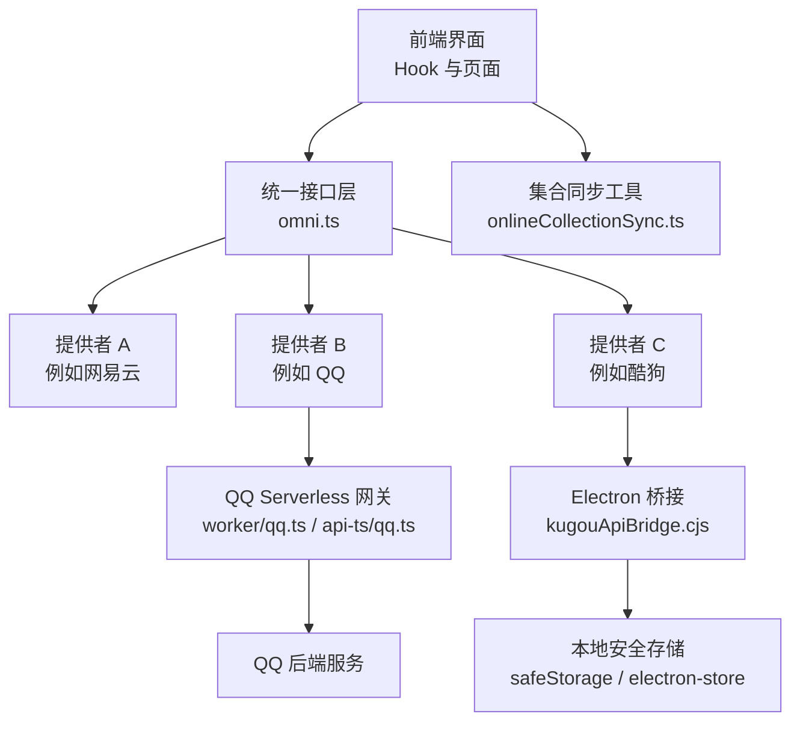
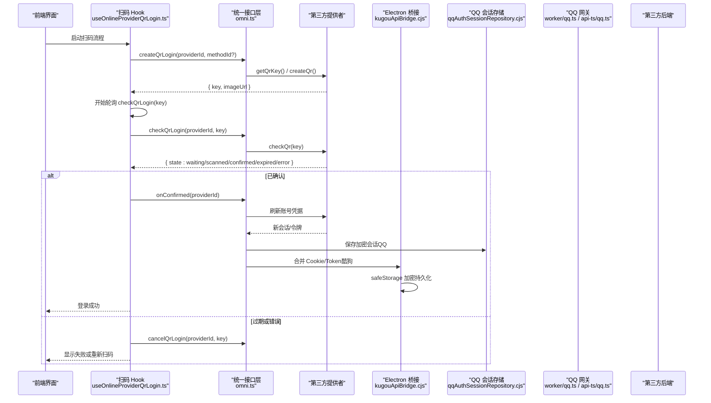
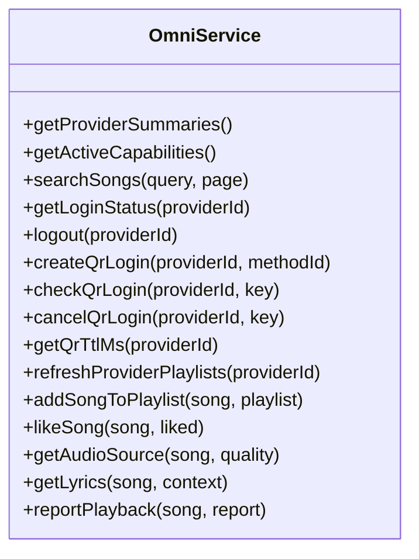
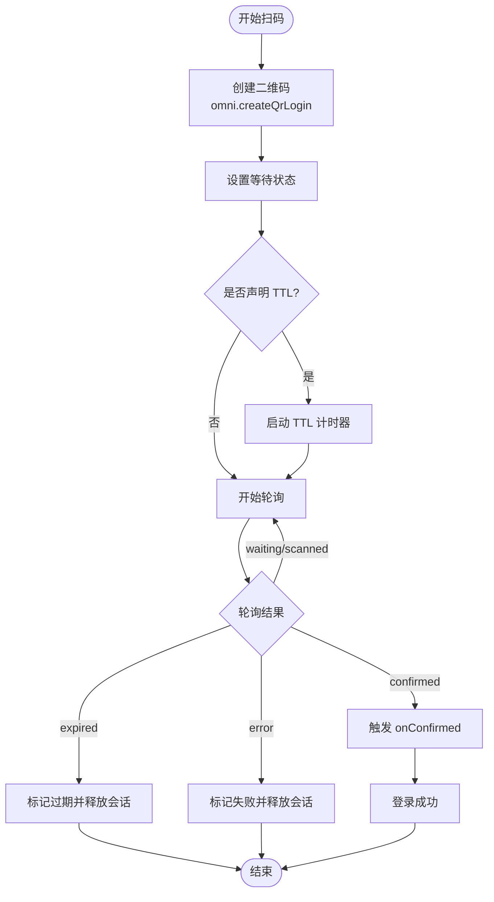
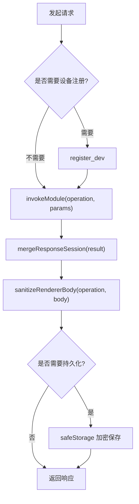
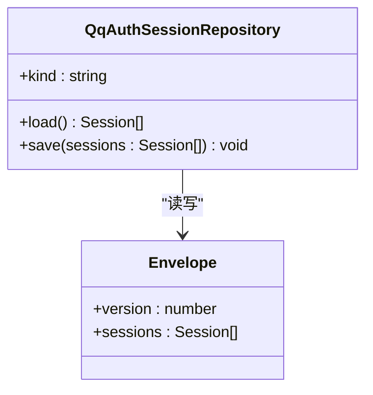
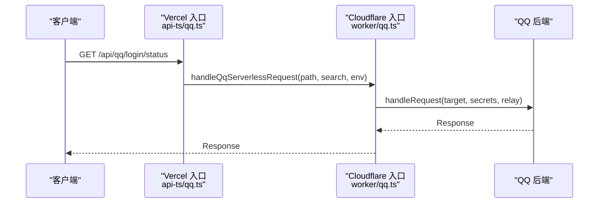
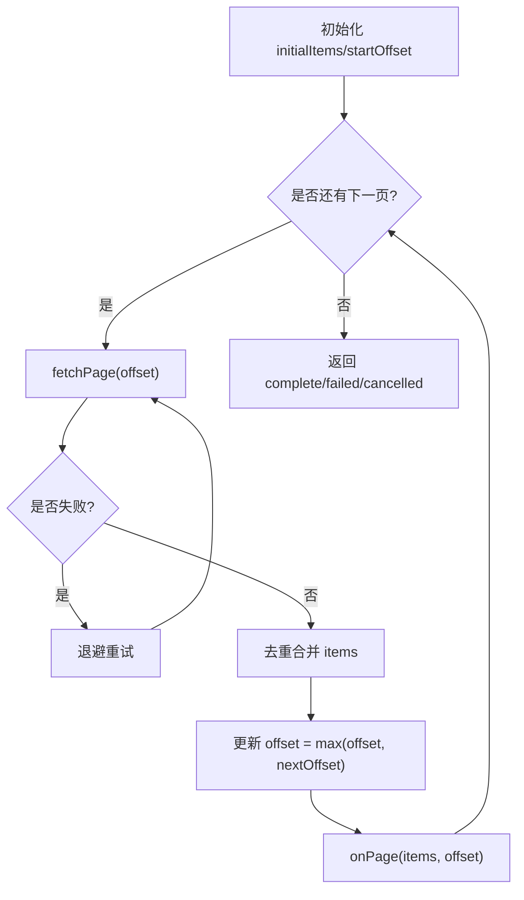
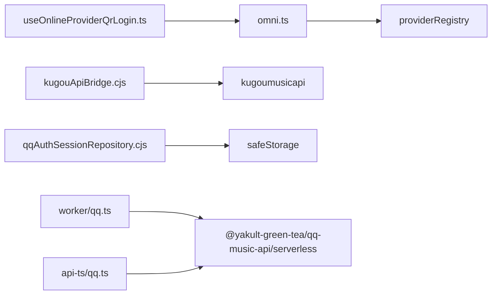

# 第三方 API 集成

<cite>
**本文引用的文件**   
- [README.md](file://README.md)
- [src/services/onlineMusic/omni.ts](file://src/services/onlineMusic/omni.ts)
- [src/hooks/useOnlineProviderQrLogin.ts](file://src/hooks/useOnlineProviderQrLogin.ts)
- [electron/kugouApiBridge.cjs](file://electron/kugouApiBridge.cjs)
- [electron/qqAuthSessionRepository.cjs](file://electron/qqAuthSessionRepository.cjs)
- [worker/qq.ts](file://worker/qq.ts)
- [api-ts/qq.ts](file://api-ts/qq.ts)
- [src/components/folia-grid/onlineCollectionSync.ts](file://src/components/folia-grid/onlineCollectionSync.ts)
</cite>

## 目录
1. [引言](#引言)
2. [项目结构](#项目结构)
3. [核心组件](#核心组件)
4. [架构总览](#架构总览)
5. [详细组件分析](#详细组件分析)
6. [依赖关系分析](#依赖关系分析)
7. [性能与可扩展性](#性能与可扩展性)
8. [故障排查指南](#故障排查指南)
9. [结论](#结论)
10. [附录：集成开发指南与最佳实践](#附录集成开发指南与最佳实践)

## 引言
本文件面向需要在 Folia Major 中接入第三方在线音乐服务的开发者，围绕认证、数据同步、错误处理、安全与部署等维度，给出基于仓库现有实现的技术说明。重点覆盖：
- 认证流程：统一抽象、二维码登录、会话持久化与令牌管理。
- 数据同步：增量分页、去重合并、冲突与回退策略。
- 错误处理：网络异常重试、限流与降级、可观测性。
- 安全考虑：敏感信息加密、请求签名、权限能力声明。
- 集成指南：适配器模式、测试与部署注意事项。

## 项目结构
Folia 的第三方 API 集成由“前端统一接口层 + 各平台提供者实现 + Electron 桥接 + Serverless 网关”组成：
- 前端统一接口层：`omni.ts` 提供跨平台的统一 API，屏蔽网易云、QQ、酷狗等平台差异。
- 二维码登录：前端 Hook `useOnlineProviderQrLogin.ts` 驱动状态机，调用 `omni` 完成扫码创建、轮询与取消。
- Electron 桥接：`kugouApiBridge.cjs` 负责酷狗设备注册、Cookie 合并与会话持久化；`qqAuthSessionRepository.cjs` 负责 QQ 凭据的安全存储。
- Serverless 网关：`worker/qq.ts` 与 `api-ts/qq.ts` 将 `/api/qq` 路由转发到 QQ 后端，支持 Cloudflare Durable Object 通道与 Vercel Edge Runtime。
- 数据同步：`onlineCollectionSync.ts` 提供大集合增量分页、退避重试与去重合并。

**图表来源** 
- [src/services/onlineMusic/omni.ts:105-247](file://src/services/onlineMusic/omni.ts#L105-L247)
- [electron/kugouApiBridge.cjs:156-306](file://electron/kugouApiBridge.cjs#L156-L306)
- [worker/qq.ts:109-134](file://worker/qq.ts#L109-L134)
- [api-ts/qq.ts:22-39](file://api-ts/qq.ts#L22-L39)
- [src/components/folia-grid/onlineCollectionSync.ts:45-103](file://src/components/folia-grid/onlineCollectionSync.ts#L45-L103)

**章节来源**
- [README.md:120-136](file://README.md#L120-L136)

## 核心组件
- 统一接口层 `omni.ts`
  - 暴露搜索、播放、歌词、收藏、歌单、推荐、订阅、点赞、回放上报等统一方法。
  - 通过 `providerRegistry` 动态选择当前活跃提供者，并做能力检查与空页回退。
  - 对账号缓存（用户、收藏、歌单、点赞列表）进行快照落盘与刷新。
- 二维码登录 Hook `useOnlineProviderQrLogin.ts`
  - 封装扫码生命周期：创建二维码、轮询状态、TTL 过期、确认回调、诊断报告生成。
  - 与 `omni` 协作，调用 `createQrLogin`、`checkQrLogin`、`cancelQrLogin`、`getQrTtlMs` 等。
- Electron 桥接 `kugouApiBridge.cjs`
  - 懒加载酷狗客户端、设备注册、Cookie 合并、响应清洗、登出清理。
  - 使用 `safeStorage` 加密持久化 Cookie，拒绝明文存储。
- QQ 会话存储 `qqAuthSessionRepository.cjs`
  - 以信封版本控制保存多会话，强制使用系统级加密，Linux 下拒绝 `basic_text`。
- QQ Serverless 网关 `worker/qq.ts` 与 `api-ts/qq.ts`
  - 统一 `/api/qq` 前缀，透传 `X-QQ-Session`，可选绑定 Durable Object 通道。
  - Vercel 侧通过 rewrite 还原路径，Edge Runtime 运行。
- 集合同步 `onlineCollectionSync.ts`
  - 分页拉取、退避重试、去重合并、取消信号、进度回调。

**章节来源**
- [src/services/onlineMusic/omni.ts:105-247](file://src/services/onlineMusic/omni.ts#L105-L247)
- [src/hooks/useOnlineProviderQrLogin.ts:52-198](file://src/hooks/useOnlineProviderQrLogin.ts#L52-L198)
- [electron/kugouApiBridge.cjs:156-306](file://electron/kugouApiBridge.cjs#L156-L306)
- [electron/qqAuthSessionRepository.cjs:28-77](file://electron/qqAuthSessionRepository.cjs#L28-L77)
- [worker/qq.ts:109-134](file://worker/qq.ts#L109-L134)
- [api-ts/qq.ts:22-39](file://api-ts/qq.ts#L22-L39)
- [src/components/folia-grid/onlineCollectionSync.ts:45-103](file://src/components/folia-grid/onlineCollectionSync.ts#L45-L103)

## 架构总览
下图展示从前端到第三方后端的认证与数据通路，包括扫码登录、令牌管理与数据同步。

**图表来源** 
- [src/hooks/useOnlineProviderQrLogin.ts:120-198](file://src/hooks/useOnlineProviderQrLogin.ts#L120-L198)
- [src/services/onlineMusic/omni.ts:215-247](file://src/services/onlineMusic/omni.ts#L215-L247)
- [electron/kugouApiBridge.cjs:194-225](file://electron/kugouApiBridge.cjs#L194-L225)
- [electron/qqAuthSessionRepository.cjs:57-77](file://electron/qqAuthSessionRepository.cjs#L57-L77)

## 详细组件分析

### 统一接口层 omni.ts
- 职责
  - 聚合所有在线音乐提供者能力，对外暴露统一 API。
  - 维护活跃提供者切换时的请求失效机制，避免旧会话污染。
  - 管理账号缓存与快照，保证点赞、歌单等状态一致性。
- 关键行为
  - 能力检测：`getProviderCapabilities`、`canLikeSong`、`canAddSongToPlaylist` 等。
  - 扫码登录：`createQrLogin`、`checkQrLogin`、`cancelQrLogin`、`getQrTtlMs`。
  - 收藏与歌单：`refreshProviderPlaylists`、`addSongToPlaylist`、`likeSong`。
  - 播放与歌词：`getAudioSource`、`getLyrics`、`reportPlayback`。
- 并发与一致性
  - `withActiveProvider` 使用 generation 号丢弃过期响应。
  - 点赞操作成功后更新内存缓存并落盘快照，失败时丢弃可能失效的文件 ID。

**图表来源** 
- [src/services/onlineMusic/omni.ts:105-663](file://src/services/onlineMusic/omni.ts#L105-L663)

**章节来源**
- [src/services/onlineMusic/omni.ts:92-103](file://src/services/onlineMusic/omni.ts#L92-L103)
- [src/services/onlineMusic/omni.ts:138-160](file://src/services/onlineMusic/omni.ts#L138-L160)
- [src/services/onlineMusic/omni.ts:215-247](file://src/services/onlineMusic/omni.ts#L215-L247)
- [src/services/onlineMusic/omni.ts:593-634](file://src/services/onlineMusic/omni.ts#L593-L634)

### 二维码登录 Hook useOnlineProviderQrLogin.ts
- 职责
  - 管理扫码 UI 状态机：loading/waiting/scanned/confirmed/expired/error。
  - 控制轮询间隔、TTL 超时、会话取消与诊断报告生成。
- 关键行为
  - `start(providerIdOverride?, methodId?)`：创建二维码、设置 TTL、启动轮询。
  - `stop()`：停止轮询、释放会话、清理定时器。
  - `buildDiagnosticReport()`：汇总时间线与 provider 诊断信息。
- 错误处理
  - 网络异常或后端返回 error 时进入 error 态，记录 failure 原因。
  - 过期后不再轮询，提示用户重试。

**图表来源** 
- [src/hooks/useOnlineProviderQrLogin.ts:101-198](file://src/hooks/useOnlineProviderQrLogin.ts#L101-L198)

**章节来源**
- [src/hooks/useOnlineProviderQrLogin.ts:14-48](file://src/hooks/useOnlineProviderQrLogin.ts#L14-L48)
- [src/hooks/useOnlineProviderQrLogin.ts:91-98](file://src/hooks/useOnlineProviderQrLogin.ts#L91-L98)
- [src/hooks/useOnlineProviderQrLogin.ts:120-198](file://src/hooks/useOnlineProviderQrLogin.ts#L120-L198)
- [src/hooks/useOnlineProviderQrLogin.ts:202-215](file://src/hooks/useOnlineProviderQrLogin.ts#L202-L215)

### Electron 桥接 kugouApiBridge.cjs
- 职责
  - 懒加载酷狗客户端，构造设备标识，合并 Cookie 与 Token。
  - 对登录相关响应进行清洗，防止敏感字段泄露到渲染进程。
  - 在 Linux 上拒绝不安全的 `basic_text` 存储后端。
- 关键行为
  - `ensureRegistered(force?)`：设备注册与重试逻辑。
  - `invokeModule(operation, params)`：统一调用模块，注入 userId/token/cookie。
  - `mergeResponseSession(result)`：解析 cookie 与 data.token/userid/dfid。
  - `sanitizeRendererBody(operation, body)`：移除 token/dfid/cookie。
- 安全与降级
  - 加密持久化 Cookie，失败时仅保留内存副本，不影响本次登录。
  - 登出时按白名单过滤 Cookie，只保留非敏感字段。

**图表来源** 
- [electron/kugouApiBridge.cjs:227-306](file://electron/kugouApiBridge.cjs#L227-L306)
- [electron/kugouApiBridge.cjs:194-225](file://electron/kugouApiBridge.cjs#L194-L225)

**章节来源**
- [electron/kugouApiBridge.cjs:51-68](file://electron/kugouApiBridge.cjs#L51-L68)
- [electron/kugouApiBridge.cjs:74-126](file://electron/kugouApiBridge.cjs#L74-L126)
- [electron/kugouApiBridge.cjs:150-176](file://electron/kugouApiBridge.cjs#L150-L176)
- [electron/kugouApiBridge.cjs:247-266](file://electron/kugouApiBridge.cjs#L247-L266)

### QQ 会话存储 qqAuthSessionRepository.cjs
- 职责
  - 以信封格式保存多个 QQ 会话，包含 token、credential、device、expiresAt。
  - 强制使用系统级加密，拒绝明文存储。
- 关键行为
  - `load()`：解密并校验信封版本与会话数组。
  - `save(sessions)`：序列化、加密、写入 store；空数组时删除键值。
- 安全特性
  - Linux 下若检测到 `basic_text` 后端直接抛错，避免弱加密。
  - 即使加密不可用，仍允许清理陈旧密文。

**图表来源** 
- [electron/qqAuthSessionRepository.cjs:28-77](file://electron/qqAuthSessionRepository.cjs#L28-L77)

**章节来源**
- [electron/qqAuthSessionRepository.cjs:10-26](file://electron/qqAuthSessionRepository.cjs#L10-L26)
- [electron/qqAuthSessionRepository.cjs:33-56](file://electron/qqAuthSessionRepository.cjs#L33-L56)
- [electron/qqAuthSessionRepository.cjs:57-77](file://electron/qqAuthSessionRepository.cjs#L57-L77)

### QQ Serverless 网关 worker/qq.ts 与 api-ts/qq.ts
- 职责
  - 统一 `/api/qq` 前缀，将请求转发到 QQ 后端。
  - 支持 Cloudflare Durable Object 通道与 Vercel Edge Runtime。
- 关键行为
  - `handleQqServerlessRequest`：构造目标 URL，透传 headers/body，注入 secret。
  - `channelName`：使用 HMAC-SHA256 派生 DO 对象名，增强安全性。
  - `relayFor`：仅在配置 binding 与 secret 时启用扫码通道。
- 部署要点
  - Vercel 通过 rewrite 将 `/api/qq?path=/login/status` 还原为后端路径。
  - Edge Runtime 约束闭包零 node 依赖，提升部署稳定性。

**图表来源** 
- [api-ts/qq.ts:22-39](file://api-ts/qq.ts#L22-L39)
- [worker/qq.ts:109-134](file://worker/qq.ts#L109-L134)
- [worker/qq.ts:45-55](file://worker/qq.ts#L45-L55)

**章节来源**
- [worker/qq.ts:1-35](file://worker/qq.ts#L1-L35)
- [worker/qq.ts:63-103](file://worker/qq.ts#L63-L103)
- [api-ts/qq.ts:1-18](file://api-ts/qq.ts#L1-L18)

### 集合同步 onlineCollectionSync.ts
- 职责
  - 为大集合提供增量分页拉取、退避重试、去重合并与取消控制。
- 关键行为
  - `fetchPageWithRetry`：按退避延迟重试，最多 N 次。
  - `syncRemainingCollectionPages`：循环翻页，直到 hasMore=false 或 offset 收敛。
  - 去重策略：按 `getKey` 去重，避免重复条目。
- 容错与边界
  - 无 total 时，若整页未新增则提前终止，防止原地打转。
  - 最大页数限制为 1000，防止无限循环。

**图表来源** 
- [src/components/folia-grid/onlineCollectionSync.ts:45-103](file://src/components/folia-grid/onlineCollectionSync.ts#L45-L103)

**章节来源**
- [src/components/folia-grid/onlineCollectionSync.ts:1-34](file://src/components/folia-grid/onlineCollectionSync.ts#L1-L34)
- [src/components/folia-grid/onlineCollectionSync.ts:36-39](file://src/components/folia-grid/onlineCollectionSync.ts#L36-L39)
- [src/components/folia-grid/onlineCollectionSync.ts:92-100](file://src/components/folia-grid/onlineCollectionSync.ts#L92-L100)

## 依赖关系分析
- 耦合度
  - `omni.ts` 与 `providerRegistry` 解耦具体提供者，仅依赖能力契约。
  - `useOnlineProviderQrLogin.ts` 仅依赖 `omni` 的扫码接口，不感知底层实现。
  - `kugouApiBridge.cjs` 与 `qqAuthSessionRepository.cjs` 分别封装平台细节，避免泄漏到上层。
- 外部依赖
  - QQ 网关依赖 `@yakult-green-tea/qq-music-api/serverless`。
  - Electron 桥接依赖 `kugoumusicapi` 与 `electron-store`、`safeStorage`。
- 潜在循环依赖
  - 当前结构未见循环导入；`omni` 通过 registry 获取提供者，避免直接引用。

**图表来源** 
- [src/services/onlineMusic/omni.ts:29-35](file://src/services/onlineMusic/omni.ts#L29-L35)
- [electron/kugouApiBridge.cjs:156-162](file://electron/kugouApiBridge.cjs#L156-L162)
- [worker/qq.ts:1-2](file://worker/qq.ts#L1-L2)
- [api-ts/qq.ts:1-2](file://api-ts/qq.ts#L1-L2)

**章节来源**
- [src/services/onlineMusic/omni.ts:29-35](file://src/services/onlineMusic/omni.ts#L29-L35)
- [electron/kugouApiBridge.cjs:156-162](file://electron/kugouApiBridge.cjs#L156-L162)
- [worker/qq.ts:1-2](file://worker/qq.ts#L1-L2)
- [api-ts/qq.ts:1-2](file://api-ts/qq.ts#L1-L2)

## 性能与可扩展性
- 分页与节流
  - 集合同步默认每页间隔 100ms，避免频繁请求。
  - 最大页数限制为 1000，防止无限循环。
- 重试与退避
  - 单页失败采用固定退避序列 `[500, 1500, 4000]` ms，可自定义。
- 扩展点
  - `omni.ts` 通过 `providerRegistry` 新增提供者无需改动上层。
  - `worker/qq.ts` 与 `api-ts/qq.ts` 支持多平台部署，便于横向扩展。

[本节为通用指导，不直接分析具体文件]

## 故障排查指南
- 扫码登录失败
  - 检查 `omni.getProviderCapabilities(providerId).auth` 是否开启。
  - 查看 Hook 生成的诊断报告，包含时间线、provider 诊断与失败原因。
  - 确认 TTL 是否配置，必要时调整前端计时或依赖后端过期状态。
- 会话丢失或无法持久化
  - Electron 环境检查 `safeStorage.isEncryptionAvailable()` 与 Linux `basic_text` 后端。
  - QQ 会话存储会拒绝不安全后端，需确保系统密钥链可用。
- 网络异常与限流
  - 集合同步自动重试，若仍失败，检查上游限流与网络状况。
  - 观察控制台警告日志，定位失败页码与重试次数。

**章节来源**
- [src/hooks/useOnlineProviderQrLogin.ts:202-215](file://src/hooks/useOnlineProviderQrLogin.ts#L202-L215)
- [electron/kugouApiBridge.cjs:51-68](file://electron/kugouApiBridge.cjs#L51-L68)
- [electron/qqAuthSessionRepository.cjs:10-26](file://electron/qqAuthSessionRepository.cjs#L10-L26)
- [src/components/folia-grid/onlineCollectionSync.ts:45-63](file://src/components/folia-grid/onlineCollectionSync.ts#L45-L63)

## 结论
Folia 的第三方 API 集成通过统一接口层、平台桥接与 Serverless 网关实现了高内聚、低耦合的架构。扫码登录、令牌管理、会话持久化与数据同步均有明确实现与健壮的错误处理。安全方面强调系统级加密与最小权限原则，部署层面支持多平台与边缘运行时。建议在新增提供者时遵循适配器模式，复用 omni 能力契约，并完善测试与监控。

[本节为总结性内容，不直接分析具体文件]

## 附录：集成开发指南与最佳实践
- 适配器模式
  - 实现 `OnlineMusicProvider` 接口，注册到 `providerRegistry`。
  - 在 `omni.ts` 中通过能力检测暴露功能，未实现的方法返回空结果或抛出 `unsupported`。
- 测试策略
  - 单元测试：模拟 `omni` 与 provider 接口，验证扫码状态机与同步逻辑。
  - 集成测试：使用 mock fetch 与 store，验证 Electron 桥接与安全存储。
  - 端到端测试：覆盖扫码登录、点赞、歌单增删等关键路径。
- 部署注意事项
  - Vercel：配置 `vercel.json` rewrite，确保 `/api/qq` 正确转发。
  - Cloudflare：可选绑定 Durable Object 通道，配置 `QQ_SESSION_SECRET`。
  - Electron：确保 `safeStorage` 可用，Linux 下避免 `basic_text`。
- 安全建议
  - 所有敏感凭据（token、musickey、cookie）必须加密存储。
  - 请求头透传时注意 `X-QQ-Session` 等认证头的完整性。
  - 权限控制：通过 `providerSupports` 与能力检查限制操作范围。
- 性能优化
  - 分页拉取时合理设置间隔与重试次数。
  - 使用去重键避免重复条目，减少内存占用。
  - 对热点数据（如歌词、封面）使用缓存策略。

[本节为通用指导，不直接分析具体文件]