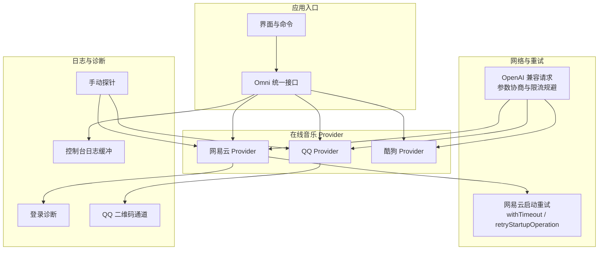
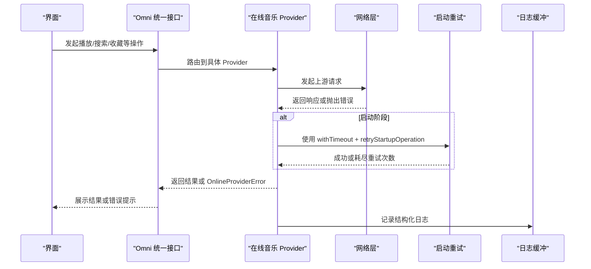
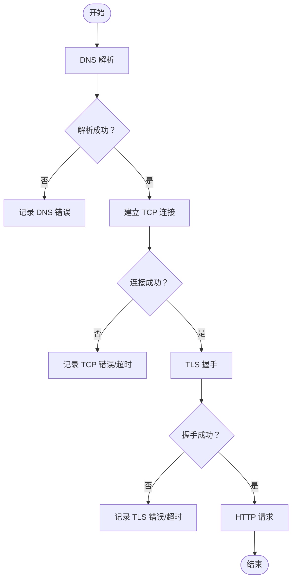
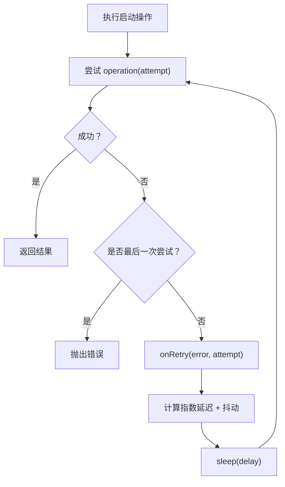
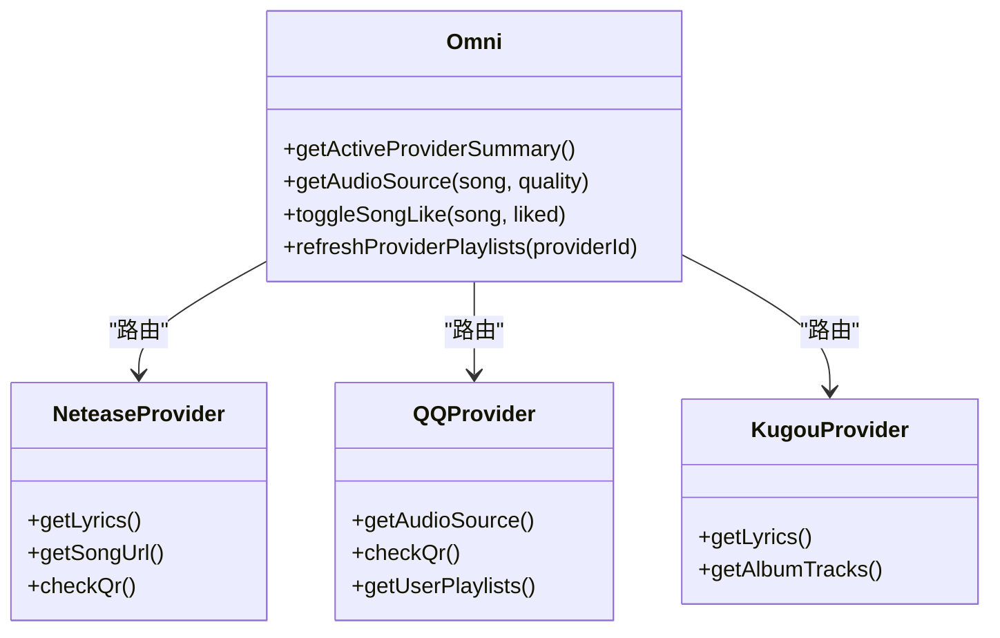
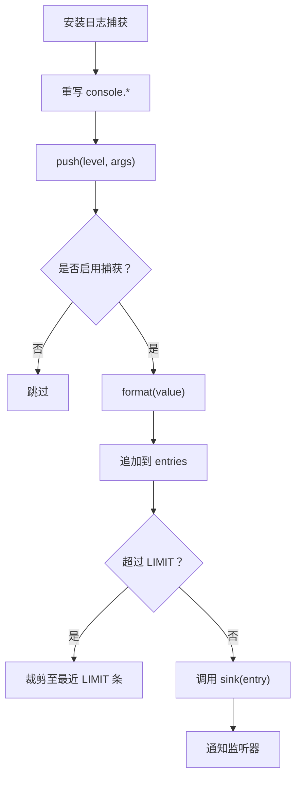
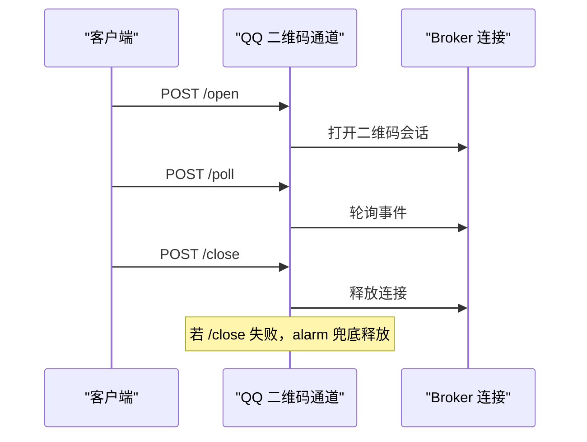
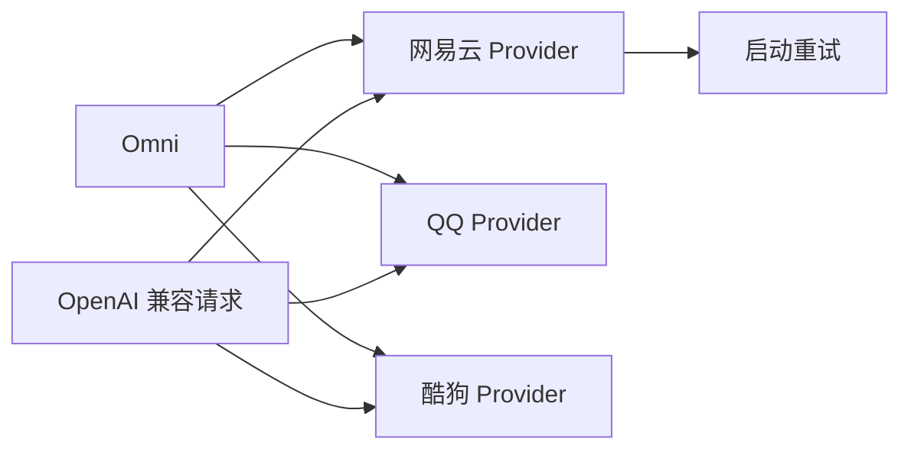

# 错误处理策略

<cite>
**本文引用的文件**   
- [electron/neteaseApiStartup.cjs](file://electron/neteaseApiStartup.cjs)
- [shared/openAICompatibleRequest.mjs](file://shared/openAICompatibleRequest.mjs)
- [src/utils/consoleLogBuffer.ts](file://src/utils/consoleLogBuffer.ts)
- [src/services/onlineMusic/neteaseProvider.ts](file://src/services/onlineMusic/neteaseProvider.ts)
- [src/services/onlineMusic/qqProvider.ts](file://src/services/onlineMusic/qqProvider.ts)
- [src/services/onlineMusic/kugouProvider.ts](file://src/services/onlineMusic/kugouProvider.ts)
- [src/services/onlineMusic/omni.ts](file://src/services/onlineMusic/omni.ts)
- [worker/qqQrChannel.ts](file://worker/qqQrChannel.ts)
- [test/manual/ai_probe.mjs](file://test/manual/ai_probe.mjs)
- [test/manual/netease_xeapi_probe.cjs](file://test/manual/netease_xeapi_probe.cjs)
</cite>

## 目录
1. [引言](#引言)
2. [项目结构](#项目结构)
3. [核心组件](#核心组件)
4. [架构总览](#架构总览)
5. [详细组件分析](#详细组件分析)
6. [依赖关系分析](#依赖关系分析)
7. [性能考量](#性能考量)
8. [故障诊断指南](#故障诊断指南)
9. [结论](#结论)

## 引言
本文件系统化梳理 Folia Major 的错误处理策略，覆盖网络异常、API 限流应对、降级策略、错误日志记录与故障诊断工具。重点包括：
- 网络异常：连接超时、DNS 解析失败、SSL/TLS 握手失败的识别与恢复。
- API 限流：指数退避、抖动、请求重试边界、能力探测与参数回退。
- 降级策略：功能降级、数据回退、服务切换（多音乐平台）。
- 日志体系：结构化日志、上下文捕获、性能影响控制。
- 诊断工具：手动探针、登录诊断、二维码通道兜底。

## 项目结构
围绕错误处理的代码主要分布在以下层次：
- 启动与网络重试层：网易云启动阶段的超时与指数退避。
- AI 兼容请求层：OpenAI 兼容接口的参数协商与限流规避。
- 在线音乐 Provider 层：网易云、QQ、酷狗的错误分类、降级与回退。
- 统一接口层 Omni：跨 Provider 的可用性、错误传播与状态同步。
- 日志与诊断：控制台缓冲、登录诊断、二维码通道安全释放。
- 测试探针：DNS/TCP/TLS 链路诊断与错误摘要。

**图表来源** 
- [electron/neteaseApiStartup.cjs:1-216](file://electron/neteaseApiStartup.cjs#L1-L216)
- [shared/openAICompatibleRequest.mjs:1-131](file://shared/openAICompatibleRequest.mjs#L1-L131)
- [src/services/onlineMusic/neteaseProvider.ts:1-551](file://src/services/onlineMusic/neteaseProvider.ts#L1-L551)
- [src/services/onlineMusic/qqProvider.ts:1-768](file://src/services/onlineMusic/qqProvider.ts#L1-L768)
- [src/services/onlineMusic/kugouProvider.ts:1-800](file://src/services/onlineMusic/kugouProvider.ts#L1-L800)
- [src/services/onlineMusic/omni.ts:1-663](file://src/services/onlineMusic/omni.ts#L1-L663)
- [src/utils/consoleLogBuffer.ts:1-178](file://src/utils/consoleLogBuffer.ts#L1-L178)
- [worker/qqQrChannel.ts:104-137](file://worker/qqQrChannel.ts#L104-L137)
- [test/manual/ai_probe.mjs:101-133](file://test/manual/ai_probe.mjs#L101-L133)

**章节来源**
- [electron/neteaseApiStartup.cjs:1-216](file://electron/neteaseApiStartup.cjs#L1-L216)
- [shared/openAICompatibleRequest.mjs:1-131](file://shared/openAICompatibleRequest.mjs#L1-L131)
- [src/services/onlineMusic/omni.ts:1-663](file://src/services/onlineMusic/omni.ts#L1-L663)

## 核心组件
- 启动重试与超时控制：提供带抖动的指数退避与操作超时，避免上游阻塞导致启动卡死。
- OpenAI 兼容请求：对不支持的参数进行自动回退，并跳过限流类错误的重试。
- Provider 错误分类：将认证失败、不可用、未公开等错误语义化，便于上层展示与降级。
- Omni 统一接口：屏蔽 Provider 差异，集中处理可用性、错误传播与缓存一致性。
- 日志缓冲：在桌面打包环境中捕获 console 输出，支持作用域提取与循环引用安全序列化。
- 二维码通道：保证资源释放与错误隔离，避免底层异常泄露敏感信息。

**章节来源**
- [electron/neteaseApiStartup.cjs:80-150](file://electron/neteaseApiStartup.cjs#L80-L150)
- [shared/openAICompatibleRequest.mjs:47-131](file://shared/openAICompatibleRequest.mjs#L47-L131)
- [src/services/onlineMusic/neteaseProvider.ts:231-386](file://src/services/onlineMusic/neteaseProvider.ts#L231-L386)
- [src/services/onlineMusic/qqProvider.ts:274-341](file://src/services/onlineMusic/qqProvider.ts#L274-L341)
- [src/services/onlineMusic/kugouProvider.ts:662-759](file://src/services/onlineMusic/kugouProvider.ts#L662-L759)
- [src/services/onlineMusic/omni.ts:92-103](file://src/services/onlineMusic/omni.ts#L92-L103)
- [src/utils/consoleLogBuffer.ts:1-178](file://src/utils/consoleLogBuffer.ts#L1-L178)
- [worker/qqQrChannel.ts:104-137](file://worker/qqQrChannel.ts#L104-L137)

## 架构总览
Folia Major 的错误处理采用分层设计：
- 网络层：通过 withTimeout 限制单次调用耗时；retryStartupOperation 实现指数退避与抖动。
- 协议适配层：OpenAI 兼容请求根据响应错误动态调整请求体字段，避免不必要的重试。
- Provider 层：各音乐平台 Provider 将上游错误映射为统一的 OnlineProviderError，附带 providerId 与语义 code。
- 统一接口层：Omni 负责调度 Provider、聚合能力与状态，并在账户切换时中止过期响应。
- 日志与诊断：consoleLogBuffer 收集运行期日志；登录诊断与二维码通道保障关键流程可观测与可恢复。

**图表来源**
- [electron/neteaseApiStartup.cjs:13-32](file://electron/neteaseApiStartup.cjs#L13-L32)
- [electron/neteaseApiStartup.cjs:80-104](file://electron/neteaseApiStartup.cjs#L80-L104)
- [src/services/onlineMusic/omni.ts:92-103](file://src/services/onlineMusic/omni.ts#L92-L103)
- [src/utils/consoleLogBuffer.ts:107-132](file://src/utils/consoleLogBuffer.ts#L107-L132)

## 详细组件分析

### 网络异常处理：连接超时、DNS 解析失败、SSL 证书错误
- 连接超时：
  - 启动阶段使用 withTimeout 包裹上游请求，防止黑路由导致长时间阻塞。
  - 超时错误包含标签与毫秒数，便于定位具体操作。
- DNS 解析失败：
  - 探针脚本显式测量 DNS、TCP、TLS 三个阶段，失败时打印错误摘要。
- SSL/TLS 握手失败：
  - 探针脚本在 TLS 阶段设置超时与错误回调，失败时判定握手失败。

**图表来源**
- [test/manual/ai_probe.mjs:101-133](file://test/manual/ai_probe.mjs#L101-L133)

**章节来源**
- [electron/neteaseApiStartup.cjs:13-32](file://electron/neteaseApiStartup.cjs#L13-L32)
- [test/manual/ai_probe.mjs:101-133](file://test/manual/ai_probe.mjs#L101-L133)

### API 限流应对：指数退避、队列管理与优先级调度
- 指数退避与抖动：
  - retryStartupOperation 以 baseDelayMs 为基础，按尝试次数指数增长，并加入 jitterMs 随机抖动，避免雪崩。
  - onRetry 回调允许外部记录重试原因与次数。
- 请求重试边界：
  - OpenAI 兼容请求仅在明确拒绝特定参数时重试，且对 rate limit/concurrency/quota 不重试。
- 队列管理与优先级：
  - 当前仓库未见全局队列管理器；Provider 内部通过模块级缓存与去重减少重复请求。
  - 优先级体现在关键路径（如登录、播放）优先获得重试与回退机会。

**图表来源**
- [electron/neteaseApiStartup.cjs:80-104](file://electron/neteaseApiStartup.cjs#L80-L104)

**章节来源**
- [electron/neteaseApiStartup.cjs:80-104](file://electron/neteaseApiStartup.cjs#L80-L104)
- [shared/openAICompatibleRequest.mjs:47-131](file://shared/openAICompatibleRequest.mjs#L47-L131)

### 降级策略：功能降级、数据回退、服务切换
- 功能降级：
  - OpenAI 兼容请求检测到 response_format/thinking/max_tokens 不被支持时，自动删除对应字段并重试。
  - QQ Provider 在旧后端缺少用户歌单路由时，标记 ownedPlaylistRouteMissing 并回退匿名路径。
- 数据回退：
  - 网易云 xeapi 公钥刷新失败但缓存可用时，回退使用缓存密钥。
  - QQ Provider 音频源获取失败时，按质量回退序列尝试不同码率。
- 服务切换：
  - Omni 通过 activeProviderId 切换当前 Provider，并在切换时中止过期响应，避免脏数据。

**图表来源**
- [src/services/onlineMusic/omni.ts:105-131](file://src/services/onlineMusic/omni.ts#L105-L131)
- [src/services/onlineMusic/neteaseProvider.ts:231-386](file://src/services/onlineMusic/neteaseProvider.ts#L231-L386)
- [src/services/onlineMusic/qqProvider.ts:274-341](file://src/services/onlineMusic/qqProvider.ts#L274-L341)
- [src/services/onlineMusic/kugouProvider.ts:662-759](file://src/services/onlineMusic/kugouProvider.ts#L662-L759)

**章节来源**
- [shared/openAICompatibleRequest.mjs:94-131](file://shared/openAICompatibleRequest.mjs#L94-L131)
- [src/services/onlineMusic/qqProvider.ts:102-145](file://src/services/onlineMusic/qqProvider.ts#L102-L145)
- [electron/neteaseApiStartup.cjs:106-150](file://electron/neteaseApiStartup.cjs#L106-L150)
- [src/services/onlineMusic/omni.ts:92-103](file://src/services/onlineMusic/omni.ts#L92-L103)

### 错误日志记录：结构化日志、上下文捕获、性能影响评估
- 结构化日志：
  - consoleLogBuffer 捕获 log/info/warn/error/debug 级别，提取作用域（如 [NeteaseProvider]），并保留原始文本。
  - 支持 sink 扩展，允许调试模块写入持久化日志。
- 上下文捕获：
  - 捕获 window error 与 unhandledrejection，确保未捕获异常也能进入缓冲。
  - 格式化函数对 Error 对象输出 stack 或 name/message，对循环引用做安全处理。
- 性能影响评估：
  - 默认开启捕获，但可在运行时关闭；关闭后立即清空缓冲，避免无用内存占用。
  - 缓冲上限 LIMIT=1000，避免长会话无限增长。

**图表来源**
- [src/utils/consoleLogBuffer.ts:107-132](file://src/utils/consoleLogBuffer.ts#L107-L132)
- [src/utils/consoleLogBuffer.ts:159-177](file://src/utils/consoleLogBuffer.ts#L159-L177)

**章节来源**
- [src/utils/consoleLogBuffer.ts:1-178](file://src/utils/consoleLogBuffer.ts#L1-L178)

### 二维码通道与资源释放
- QQ 二维码通道在 fetch 中捕获异常，避免底层异常泄露 URL 或会话细节。
- alarm 方法作为最后防线，确保即使 /close 未送达也能释放连接。

**图表来源**
- [worker/qqQrChannel.ts:104-137](file://worker/qqQrChannel.ts#L104-L137)

**章节来源**
- [worker/qqQrChannel.ts:104-137](file://worker/qqQrChannel.ts#L104-L137)

## 依赖关系分析
- Provider 与 Omni：
  - Omni 通过 requireOnlineMusicProvider 获取具体 Provider，并调用其能力方法。
  - Provider 抛出 OnlineProviderError，携带 providerId 与语义 code，便于 Omni 统一处理。
- 启动重试与 Provider：
  - 网易云 Provider 在登录与密钥刷新中使用 retryStartupOperation 与 withTimeout。
- OpenAI 兼容请求与 Provider：
  - 多个 Provider 可能调用 AI 能力，共享 openAICompatibleRequest 的能力探测与参数回退逻辑。

**图表来源**
- [src/services/onlineMusic/omni.ts:105-131](file://src/services/onlineMusic/omni.ts#L105-L131)
- [electron/neteaseApiStartup.cjs:80-150](file://electron/neteaseApiStartup.cjs#L80-L150)
- [shared/openAICompatibleRequest.mjs:17-26](file://shared/openAICompatibleRequest.mjs#L17-L26)

**章节来源**
- [src/services/onlineMusic/omni.ts:105-131](file://src/services/onlineMusic/omni.ts#L105-L131)
- [electron/neteaseApiStartup.cjs:80-150](file://electron/neteaseApiStartup.cjs#L80-L150)
- [shared/openAICompatibleRequest.mjs:17-26](file://shared/openAICompatibleRequest.mjs#L17-L26)

## 性能考量
- 启动重试：
  - 指数退避与抖动降低并发重试压力，避免上游雪崩。
  - withTimeout 防止单次请求长期阻塞，缩短失败路径。
- 日志缓冲：
  - 默认开启但可关闭，避免生产环境额外开销。
  - 缓冲上限与惰性序列化减少内存与 CPU 压力。
- Provider 缓存：
  - 模块级缓存减少重复请求，如 QQ 歌曲详情、酷狗推荐卡片。
- OpenAI 兼容请求：
  - 能力缓存避免重复探测，参数回退减少无效重试。

[本节为通用指导，无需列出具体文件来源]

## 故障诊断指南
- 网络链路诊断：
  - 使用 ai_probe.mjs 分别测量 DNS、TCP、TLS 阶段，快速定位瓶颈。
- 网易云登录诊断：
  - neteaseLoginDiagnostics 捕获启动阶段网络请求与快照，辅助分析登录失败原因。
- 二维码通道问题：
  - 检查 /open、/poll、/close 流程，确认 alarm 兜底释放是否生效。
- 常见错误分类：
  - 认证失败：OnlineProviderError.code='auth-required'，需重新登录或刷新会话。
  - 不可用：OnlineProviderError.code='unavailable'，检查上游状态码与业务码。
  - 未公开：QQ 歌单匿名端点无法读取私有歌单，提示 not-public。

**章节来源**
- [test/manual/ai_probe.mjs:101-133](file://test/manual/ai_probe.mjs#L101-L133)
- [test/manual/netease_xeapi_probe.cjs:76-171](file://test/manual/netease_xeapi_probe.cjs#L76-L171)
- [worker/qqQrChannel.ts:104-137](file://worker/qqQrChannel.ts#L104-L137)
- [src/services/onlineMusic/qqProvider.ts:73-99](file://src/services/onlineMusic/qqProvider.ts#L73-L99)

## 结论
Folia Major 的错误处理策略以分层解耦为核心：
- 网络层通过超时与指数退避提升鲁棒性。
- 协议适配层通过参数回退与限流规避提升兼容性。
- Provider 层通过语义化错误与多级回退提升可用性。
- Omni 层通过统一接口与状态管理提升一致性。
- 日志与诊断贯穿全链路，确保问题可观测、可恢复。

[本节为总结性内容，无需列出具体文件来源]