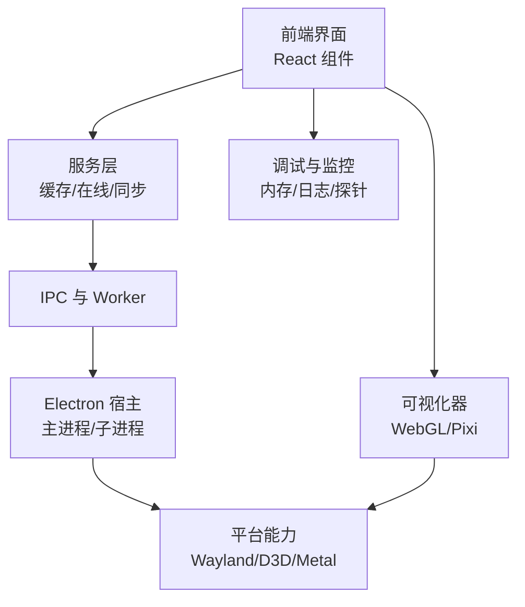
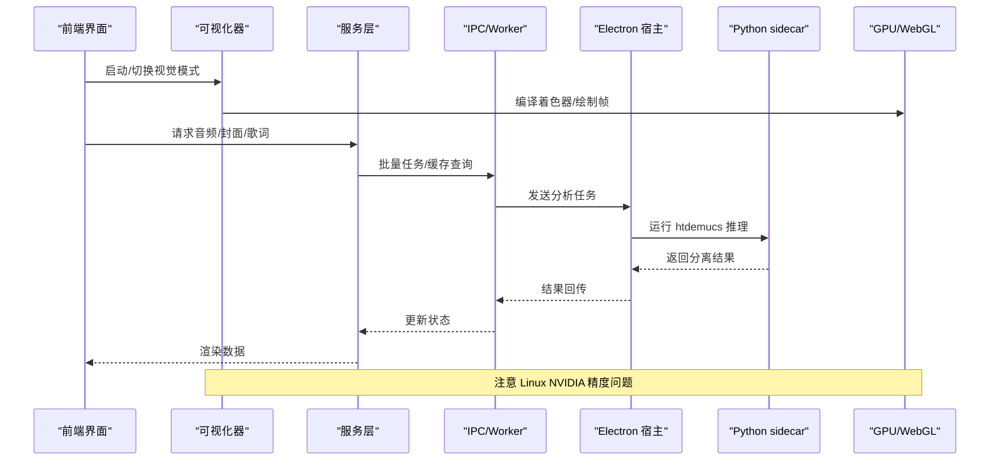
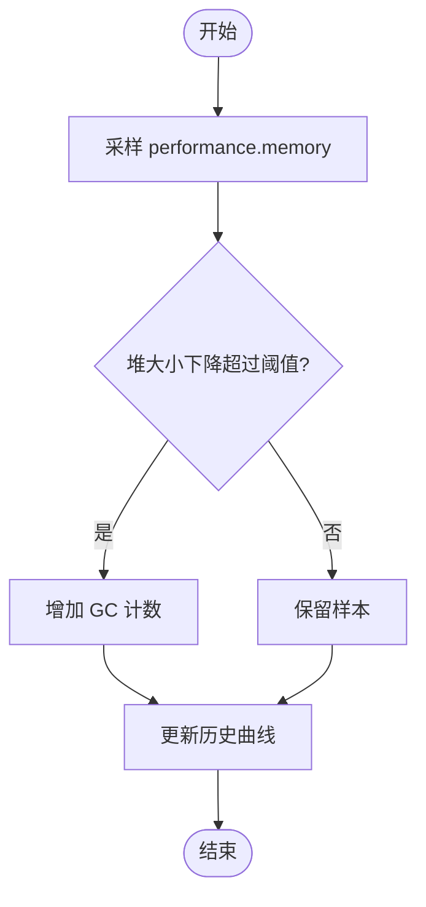
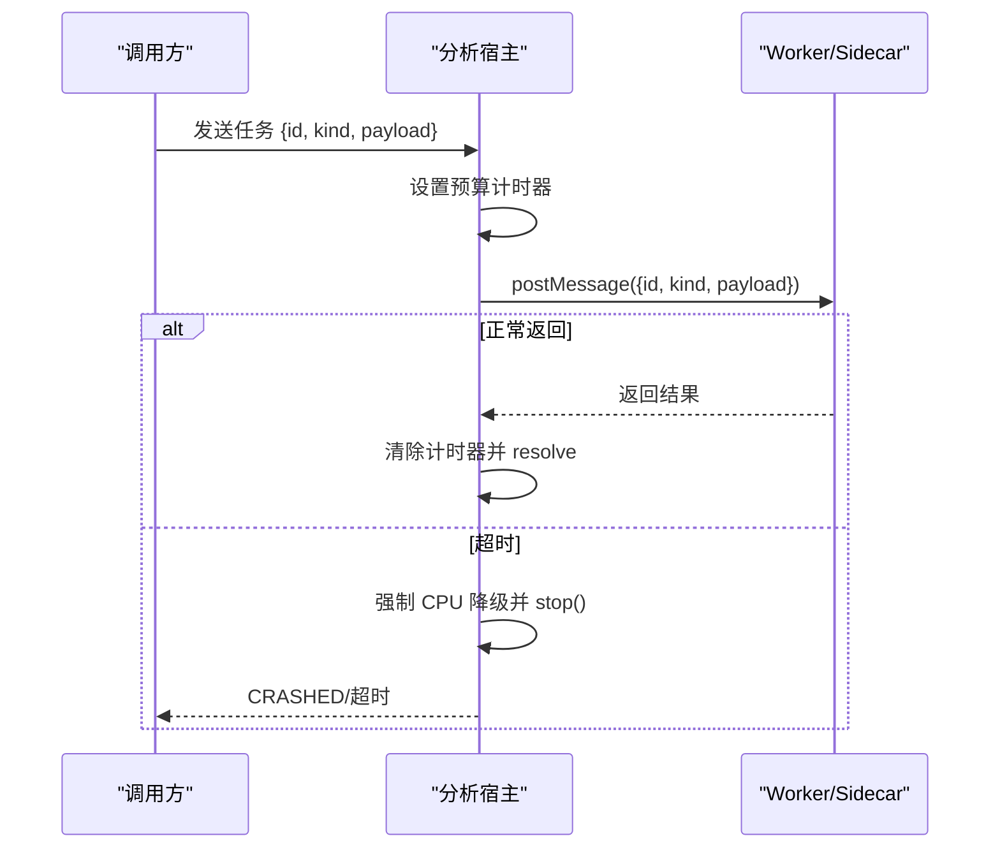
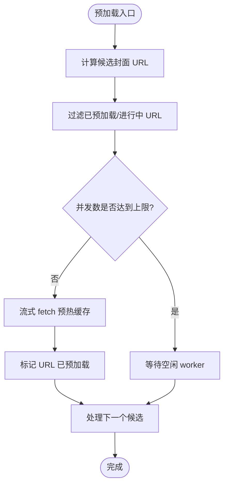
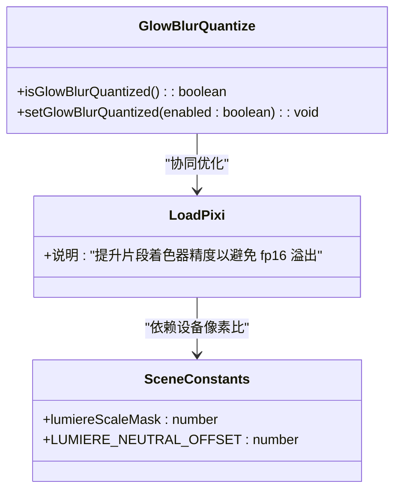
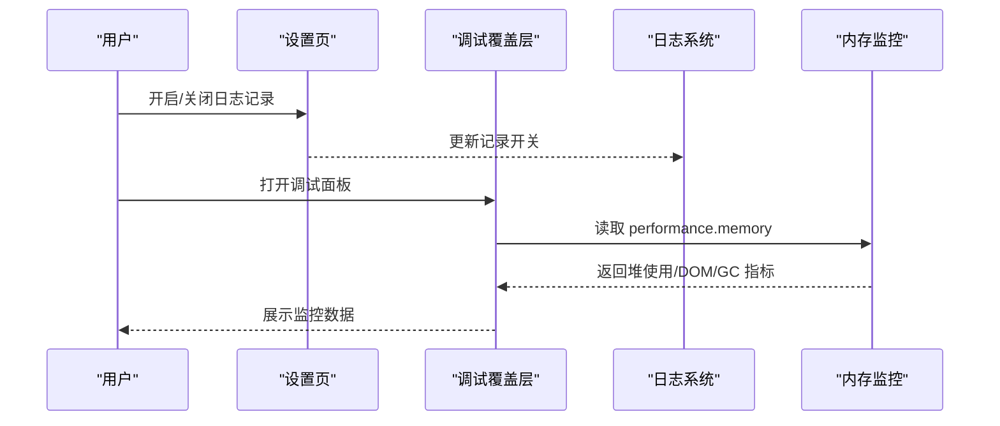
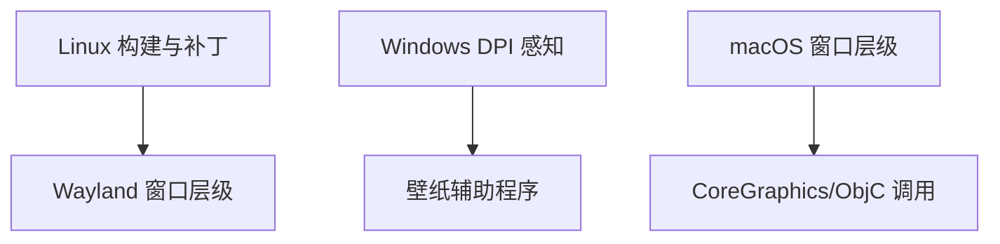
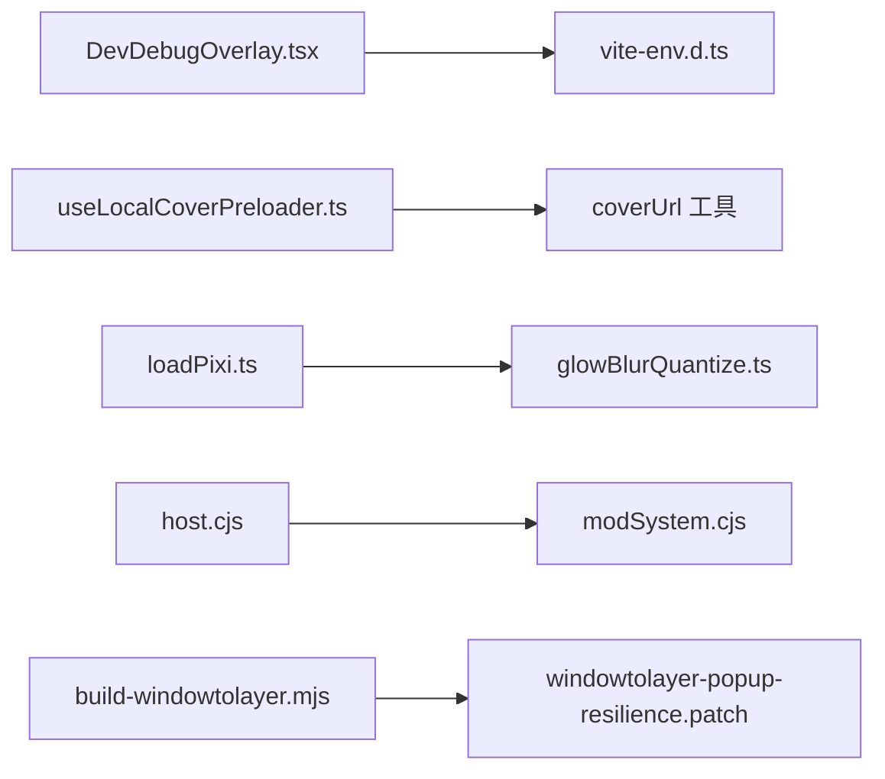

# 性能优化策略

<cite>
**本文引用的文件**   
- [README.md](file://README.md)
- [automix-memory-optimization.md](file://docs/automix-memory-optimization.md)
- [client-logging.md](file://docs/client-logging.md)
- [DevDebugOverlay.tsx](file://src/components/DevDebugOverlay.tsx)
- [vite-env.d.ts](file://src/vite-env.d.ts)
- [DeveloperSettingsSubview.tsx](file://src/components/modal/settings/DeveloperSettingsSubview.tsx)
- [useLocalCoverPreloader.ts](file://src/hooks/useLocalCoverPreloader.ts)
- [loadPixi.ts](file://src/components/visualizer/loadPixi.ts)
- [glowBlurQuantize.ts](file://src/utils/gl8wBlurQuantize.ts)
- [host.cjs](file://electron/analysis/host.cjs)
- [modSystem.cjs](file://electron/modSystem/modSystem.cjs)
- [macWallpaperController.cjs](file://electron/macWallpaperController.cjs)
- [attach.rs](file://packaging/windows/wallpaper-helper/src/attach.rs)
- [build-windowtolayer.mjs](file://packaging/linux/build-windowtolayer.mjs)
- [windowtolayer-popup-resilience.patch](file://packaging/linux/patches/windowtolayer-popup-resilience.patch)
- [latticePerformance.probe.tsx](file://dev/probes/latticePerformance.probe.tsx)
- [run.ts](file://dev/probes/lattice-performance/run.ts)
- [debugMemorySamples.test.ts](file://test/unit/services/debugMemorySamples.test.ts)
</cite>

## 目录
1. [引言](#引言)
2. [项目结构](#项目结构)
3. [核心组件](#核心组件)
4. [架构总览](#架构总览)
5. [详细组件分析](#详细组件分析)
6. [依赖关系分析](#依赖关系分析)
7. [性能考量](#性能考量)
8. [故障排查指南](#故障排查指南)
9. [结论](#结论)
10. [附录：基准测试与案例](#附录基准测试与案例)

## 引言
本技术文档聚焦 Folia Major 的性能优化策略，围绕以下目标展开：内存管理与垃圾回收优化、进程间通信与序列化效率、资源加载与缓存、GPU/WebGL 加速与平台图形差异、调试监控工具、平台特定优化（Linux Wayland/Vulkan 相关、Windows D3D/DPI、macOS Metal 相关），以及基准测试方法与优化案例。Folia 是一个以全屏沉浸式歌词播放为核心的音乐应用，提供 Electron 桌面端与 Web 端，并包含可视化器、自动混音、本地库、模组系统等复杂子系统，因此性能优化需要跨前端渲染、原生宿主、音频推理与平台图形栈综合设计。

## 项目结构
从性能视角看，仓库可划分为若干关键区域：
- 前端渲染与可视化：React 组件、可视化器、命令面板、网格视图等。
- Electron 宿主与 IPC：主进程桥接、子进程/Worker、分析 sidecar、模组系统。
- 服务层：音频缓存、封面缓存、在线服务、同步服务等。
- 开发与调试：开发探针、日志系统、内存监控、单元测试与手动脚本。
- 打包与平台适配：Linux Wayland 补丁、Windows 壁纸辅助程序、macOS 窗口层级控制。

**图表来源**
- [README.md:32-38](file://README.md#L32-L38)
- [DevDebugOverlay.tsx:673-821](file://src/components/DevDebugOverlay.tsx#L673-L821)
- [loadPixi.ts:1-18](file://src/components/visualizer/loadPixi.ts#L1-L18)

**章节来源**
- [README.md:32-38](file://README.md#L32-L38)

## 核心组件
本节梳理与性能直接相关的核心模块：
- 内存监控与 GC 统计：通过 DevDebugOverlay 采样 `performance.memory`，记录堆使用、DOM 节点数、GC 次数，并提供历史曲线。
- 客户端日志系统：统一捕获 console 输出，支持按模块过滤、复制、持久化开关，便于定位性能问题。
- 资源预加载：本地封面懒加载与并发预取，避免解码大位图常驻内存。
- GPU/WebGL 精度与平台差异：Pixi 注入的片段着色器精度在 Linux NVIDIA 上可能触发 fp16 溢出，需提升精度或量化模糊。
- 分析侧边车与超时保护：htdemucs 推理由 Python sidecar 执行，带超时与失败回退；主进程对 IPC 请求设置预算与强制 CPU 降级。
- 模组系统缓存清理：Node 侧 require.cache 清理，避免热重载时旧模块驻留。
- 平台图形与窗口管理：Linux Wayland windowtolayer 构建与补丁、Windows DPI 感知、macOS 窗口层级控制。

**章节来源**
- [DevDebugOverlay.tsx:673-821](file://src/components/DevDebugOverlay.tsx#L673-L821)
- [client-logging.md:1-83](file://docs/client-logging.md#L1-L83)
- [useLocalCoverPreloader.ts:1-100](file://src/hooks/useLocalCoverPreloader.ts#L1-L100)
- [loadPixi.ts:1-18](file://src/components/visualizer/loadPixi.ts#L1-L18)
- [host.cjs:128-153](file://electron/analysis/host.cjs#L128-L153)
- [modSystem.cjs:166-192](file://electron/modSystem/modSystem.cjs#L166-L192)
- [build-windowtolayer.mjs:29-94](file://packaging/linux/build-windowtolayer.mjs#L29-L94)
- [macWallpaperController.cjs:153-177](file://electron/macWallpaperController.cjs#L153-L177)

## 架构总览
下图展示性能相关的关键交互路径：前端 UI 调用可视化器与服务层，服务层通过 IPC 与 Electron 宿主通信；宿主调度 Worker/sidecar 进行重型计算；平台图形栈负责 WebGL/GPU 渲染；调试与监控系统贯穿全链路。

**图表来源**
- [loadPixi.ts:1-18](file://src/components/visualizer/loadPixi.ts#L1-L18)
- [host.cjs:128-153](file://electron/analysis/host.cjs#L128-L153)
- [automix-memory-optimization.md:21-46](file://docs/automix-memory-optimization.md#L21-L46)

## 详细组件分析

### 内存管理与垃圾回收优化
- 堆采样与 GC 计数：DevDebugOverlay 周期性采样 `performance.memory`，比较前后堆大小变化以估算 GC 次数，同时记录 DOM 节点数量与峰值堆使用。
- 多进程工作集采样：类型定义中暴露 `totalWorkingSetMB`、`rendererPrivateMB`、`rendererFdCount` 等字段，用于区分 JS 对象泄漏与原生内存增长。
- 自动化混音内存优化：htdemucs 推理原使用 onnxruntime-node，存在较大内存复用池；方案改为 Python sidecar 并关闭 `enable_mem_reuse`，将峰值压至约 790MB，输出逐比特一致。

**图表来源**
- [DevDebugOverlay.tsx:673-821](file://src/components/DevDebugOverlay.tsx#L673-L821)
- [vite-env.d.ts:602-643](file://src/vite-env.d.ts#L602-L643)

**章节来源**
- [DevDebugOverlay.tsx:673-821](file://src/components/DevDebugOverlay.tsx#L673-L821)
- [vite-env.d.ts:602-643](file://src/vite-env.d.ts#L602-L643)
- [automix-memory-optimization.md:21-46](file://docs/automix-memory-optimization.md#L21-L46)
- [automix-memory-optimization.md:79-118](file://docs/automix-memory-optimization.md#L79-L118)

### 进程间通信与序列化优化
- IPC 消息批处理与超时保护：分析宿主为每个任务设置预算时间，若超时则强制 CPU 降级并终止 worker，避免长时间挂起影响主流程。
- 错误序列化与模块缓存清理：modSystem 提供错误序列化与 Node 模块缓存清理，防止热重载时旧代码驻留导致行为异常。
- Worker 与 sidecar 协作：htdemucs 推理迁移到 Python sidecar，Node 侧仅做管道传输与超时控制，降低主进程内存压力。

**图表来源**
- [host.cjs:128-153](file://electron/analysis/host.cjs#L128-L153)
- [modSystem.cjs:166-192](file://electron/modSystem/modSystem.cjs#L166-L192)

**章节来源**
- [host.cjs:128-153](file://electron/analysis/host.cjs#L128-L153)
- [modSystem.cjs:166-192](file://electron/modSystem/modSystem.cjs#L166-L192)

### 资源加载优化：懒加载、预加载与缓存
- 本地封面预加载：useLocalCoverPreloader 基于可视区域索引计算候选 URL，使用流式 fetch 预热浏览器缓存，避免完整解码位图常驻内存；限制并发数与最大预加载 URL 数量，防止内存膨胀。
- 尺寸化 URL：通过 getSizedCoverUrl 生成合适尺寸的封面 URL，减少网络与解码开销。
- 缓存键去重：pendingUrls 与 preloadedUrls 保证同一 URL 只发起一次请求，完成后标记已预加载。

**图表来源**
- [useLocalCoverPreloader.ts:1-100](file://src/hooks/useLocalCoverPreloader.ts#L1-L100)

**章节来源**
- [useLocalCoverPreloader.ts:1-100](file://src/hooks/useLocalCoverPreloader.ts#L1-L100)

### GPU 加速配置与 WebGL 优化
- Pixi 片段着色器精度：默认注入 `precision mediump float;`，在 Linux NVIDIA + ANGLE OpenGL ES 环境下可能导致 fp16 溢出，出现黑色三角形伪影。应提升精度或采用量化模糊策略。
- 发光模糊量化开关：glowBlurQuantize 提供平台检测与用户偏好存储，在 Linux 运行时默认启用量化以降低 GPU 负载。
- 设备像素比与缩放：场景常量考虑 devicePixelRatio，确保在不同缩放比例下渲染一致性。

**图表来源**
- [loadPixi.ts:1-18](file://src/components/visualizer/loadPixi.ts#L1-L18)
- [glowBlurQuantize.ts:19-49](file://src/utils/gl8wBlurQuantize.ts#L19-L49)
- [scene.ts:24-27](file://src/components/visualizer/lumiere/scene.ts#L24-L27)

**章节来源**
- [loadPixi.ts:1-18](file://src/components/visualizer/loadPixi.ts#L1-L18)
- [glowBlurQuantize.ts:19-49](file://src/utils/gl8wBlurQuantize.ts#L19-L49)
- [scene.ts:24-27](file://src/components/visualizer/lumiere/scene.ts#L24-L27)

### 调试与监控工具
- 内存监控面板：DevDebugOverlay 提供 Heap Monitor，显示 usedHeap、totalHeap、peak、DOM 节点数、GC 计数等指标，并支持历史曲线。
- 客户端日志系统：统一捕获 console 输出，支持按模块过滤、复制、持久化开关；设置页与开发者面板均可访问。
- 内存采样历史：测试用例验证历史曲线不会无限增长，保持最近样本窗口，避免监控本身成为内存问题。

**图表来源**
- [DevDebugOverlay.tsx:776-793](file://src/components/DevDebugOverlay.tsx#L776-L793)
- [client-logging.md:47-83](file://docs/client-logging.md#L47-L83)
- [debugMemorySamples.test.ts:37-54](file://test/unit/services/debugMemorySamples.test.ts#L37-L54)

**章节来源**
- [DevDebugOverlay.tsx:776-793](file://src/components/DevDebugOverlay.tsx#L776-L793)
- [client-logging.md:47-83](file://docs/client-logging.md#L47-L83)
- [debugMemorySamples.test.ts:37-54](file://test/unit/services/debugMemorySamples.test.ts#L37-L54)

### 平台特定优化技巧
- Linux Wayland/Vulkan 相关：
  - 构建 windowtolayer 二进制，拉取固定版本源码并应用补丁，增强弹窗与窗口层级鲁棒性。
  - 发光模糊量化默认在 Linux 运行时启用，缓解 GPU 压力。
- Windows Direct3D/DPI：
  - 壁纸辅助程序使用 per-monitor-DPI-aware V2 上下文，确保几何坐标以物理像素表达，避免缩放导致的边框偏移。
- macOS Metal 相关：
  - 通过 koffi 调用 Objective-C 与 CoreGraphics，动态获取窗口层级，实现桌面图标层级之上的壁纸窗口。

**图表来源**
- [build-windowtolayer.mjs:29-94](file://packaging/linux/build-windowtolayer.mjs#L29-L94)
- [windowtolayer-popup-resilience.patch:1-33](file://packaging/linux/patches/windowtolayer-popup-resilience.patch#L1-L33)
- [attach.rs:342-382](file://packaging/windows/wallpaper-helper/src/attach.rs#L342-L382)
- [macWallpaperController.cjs:153-177](file://electron/macWallpaperController.cjs#L153-L177)

**章节来源**
- [build-windowtolayer.mjs:29-94](file://packaging/linux/build-windowtolayer.mjs#L29-L94)
- [windowtolayer-popup-resilience.patch:1-33](file://packaging/linux/patches/windowtolayer-popup-resilience.patch#L1-L33)
- [attach.rs:342-382](file://packaging/windows/wallpaper-helper/src/attach.rs#L342-L382)
- [macWallpaperController.cjs:153-177](file://electron/macWallpaperController.cjs#L153-L177)

## 依赖关系分析
性能相关模块之间的耦合关系如下：
- DevDebugOverlay 依赖 vite-env.d.ts 的类型定义，用于结构化内存样本。
- useLocalCoverPreloader 依赖 coverUrl 工具生成尺寸化 URL，并与浏览器 fetch API 交互。
- loadPixi 与 glowBlurQuantize 共同影响 WebGL 渲染质量与性能。
- host.cjs 与 modSystem.cjs 分别承担分析任务调度与模块缓存清理，间接影响整体稳定性。
- 平台构建脚本与补丁影响最终二进制行为，尤其在 Linux Wayland 环境。

**图表来源**
- [DevDebugOverlay.tsx:673-821](file://src/components/DevDebugOverlay.tsx#L673-L821)
- [vite-env.d.ts:602-643](file://src/vite-env.d.ts#L602-L643)
- [useLocalCoverPreloader.ts:1-100](file://src/hooks/useLocalCoverPreloader.ts#L1-L100)
- [loadPixi.ts:1-18](file://src/components/visualizer/loadPixi.ts#L1-L18)
- [glowBlurQuantize.ts:19-49](file://src/utils/gl8wBlurQuantize.ts#L19-L49)
- [host.cjs:128-153](file://electron/analysis/host.cjs#L128-L153)
- [modSystem.cjs:166-192](file://electron/modSystem/modSystem.cjs#L166-L192)
- [build-windowtolayer.mjs:29-94](file://packaging/linux/build-windowtolayer.mjs#L29-L94)
- [windowtolayer-popup-resilience.patch:1-33](file://packaging/linux/patches/windowtolayer-popup-resilience.patch#L1-L33)

**章节来源**
- [DevDebugOverlay.tsx:673-821](file://src/components/DevDebugOverlay.tsx#L673-L821)
- [vite-env.d.ts:602-643](file://src/vite-env.d.ts#L602-L643)
- [useLocalCoverPreloader.ts:1-100](file://src/hooks/useLocalCoverPreloader.ts#L1-L100)
- [loadPixi.ts:1-18](file://src/components/visualizer/loadPixi.ts#L1-L18)
- [glowBlurQuantize.ts:19-49](file://src/utils/gl8wBlurQuantize.ts#L19-L49)
- [host.cjs:128-153](file://electron/analysis/host.cjs#L128-L153)
- [modSystem.cjs:166-192](file://electron/modSystem/modSystem.cjs#L166-L192)
- [build-windowtolayer.mjs:29-94](file://packaging/linux/build-windowtolayer.mjs#L29-L94)
- [windowtolayer-popup-resilience.patch:1-33](file://packaging/linux/patches/windowtolayer-popup-resilience.patch#L1-L33)

## 性能考量
- 内存峰值控制：htdemucs 推理通过 Python sidecar 与关闭内存复用，将峰值压至 1GB 以下，避免主进程内存尖峰。
- 渲染性能：提升 WebGL 片段着色器精度，避免 fp16 溢出导致的黑屏；在 Linux 上启用发光模糊量化以降低 GPU 负载。
- I/O 与缓存：本地封面预加载使用流式 fetch，避免完整解码位图常驻内存；限制并发与缓存大小，防止内存膨胀。
- IPC 稳定性：为分析任务设置超时与降级策略，避免长时间阻塞；清理 Node 模块缓存，防止热重载残留。
- 平台适配：Linux Wayland 构建与补丁增强窗口层级鲁棒性；Windows DPI 感知确保壁纸窗口几何正确；macOS 通过 ObjC 调用实现窗口层级控制。

[本节为通用性能指导，不直接分析具体文件]

## 故障排查指南
- 内存泄漏检测：
  - 使用 DevDebugOverlay 观察 heapUsed、domNodes、gcCount 趋势，结合 vite-env.d.ts 的多进程指标区分 JS 与原生内存。
  - 检查 memorySamples 历史是否无限增长，参考测试用例中的边界约束。
- 日志定位：
  - 通过设置页或 Alt+Shift+D 打开控制台，按模块过滤日志，复制选中范围以便复现问题。
  - 遵循日志规范：模块前缀、决策日志、成功与失败并重、数字而非形容词。
- 图形异常：
  - Linux NVIDIA 黑三角问题：确认是否启用发光模糊量化或提升片段着色器精度。
  - Windows 壁纸偏移：检查 DPI 感知上下文是否正确设置。
  - macOS 窗口层级：确认 ObjC 调用是否成功加载 CoreGraphics。

**章节来源**
- [DevDebugOverlay.tsx:776-793](file://src/components/DevDebugOverlay.tsx#L776-L793)
- [vite-env.d.ts:602-643](file://src/vite-env.d.ts#L602-L643)
- [debugMemorySamples.test.ts:37-54](file://test/unit/services/debugMemorySamples.test.ts#L37-L54)
- [client-logging.md:47-83](file://docs/client-logging.md#L47-L83)
- [loadPixi.ts:1-18](file://src/components/visualizer/loadPixi.ts#L1-L18)
- [attach.rs:342-382](file://packaging/windows/wallpaper-helper/src/attach.rs#L342-L382)
- [macWallpaperController.cjs:153-177](file://electron/macWallpaperController.cjs#L153-L177)

## 结论
Folia Major 的性能优化涉及内存管理、IPC 调度、资源缓存、GPU 渲染与平台适配等多个层面。通过 Python sidecar 与关闭内存复用，有效控制了 htdemucs 推理的内存峰值；通过流式预加载与并发控制，平衡了封面加载速度与内存占用；通过提升 WebGL 精度与平台特定优化，保障了渲染质量与稳定性；通过完善的调试与监控工具，提供了可观测性与可诊断性。未来可继续叠加量化模型、动态段长、线程调优等优化项，但需严格验收质量与兼容性。

[本节为总结性内容，不直接分析具体文件]

## 附录：基准测试与案例
- 自动混音内存优化案例：
  - 现状：onnxruntime-node 推理存在较大内存复用池，峰值可达 2.7GB。
  - 方案：迁移至 Python sidecar，关闭 `enable_mem_reuse`，峰值降至约 790MB，输出逐比特一致。
  - 验收：单测全绿，sidecar 超时与崩溃回退机制完善。
- 网格性能探针：
  - latticePerformance.probe.tsx 提供策略与场景选择，run.ts 统计帧时间与拟合计数器，用于评估不同动画策略的性能表现。
- 内存监控测试：
  - debugMemorySamples.test.ts 验证历史曲线长度上限与每进程分解数据的最新样本保留逻辑。

**章节来源**
- [automix-memory-optimization.md:21-46](file://docs/automix-memory-optimization.md#L21-L46)
- [automix-memory-optimization.md:79-118](file://docs/automix-memory-optimization.md#L79-L118)
- [latticePerformance.probe.tsx:39-64](file://dev/probes/latticePerformance.probe.tsx#L39-L64)
- [run.ts:1-13](file://dev/probes/lattice-performance/run.ts#L1-L13)
- [debugMemorySamples.test.ts:37-54](file://test/unit/services/debugMemorySamples.test.ts#L37-L54)