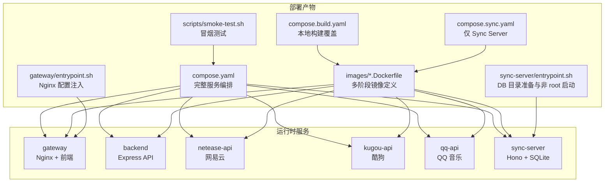
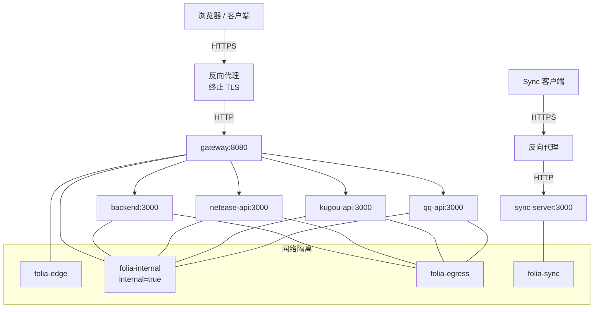
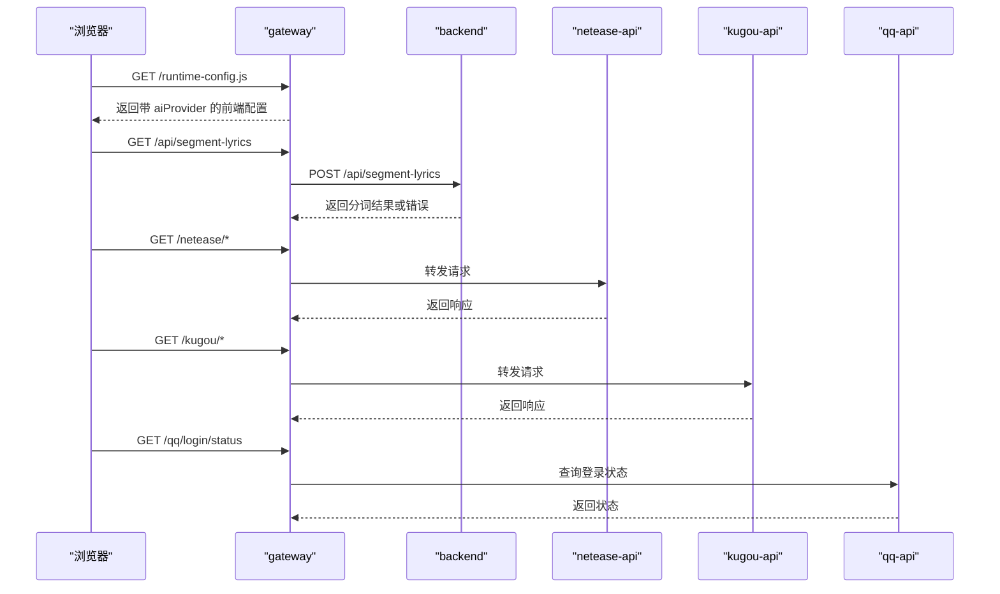
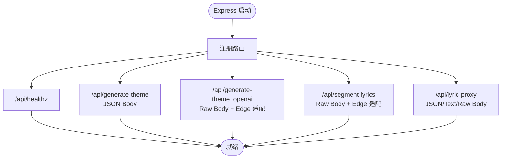
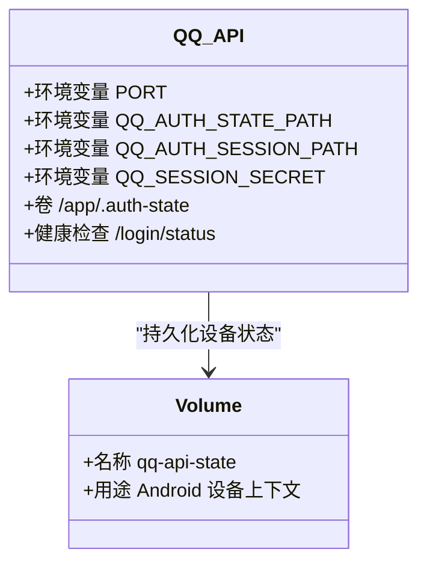
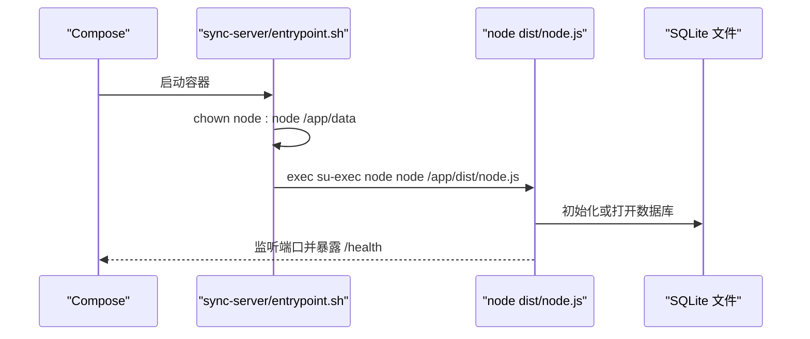
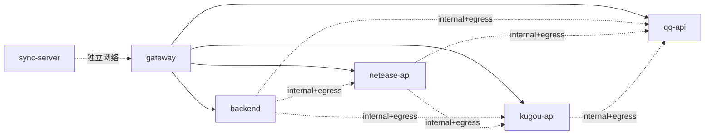
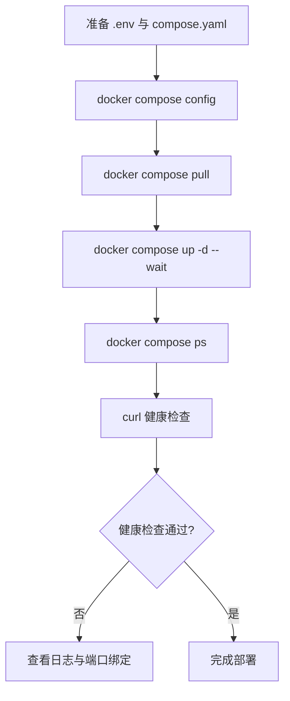

# Docker 容器化部署

<cite>
**本文引用的文件**   
- [deploy/docker/README.md](file://deploy/docker/README.md)
- [deploy/docker/compose.yaml](file://deploy/docker/compose.yaml)
- [deploy/docker/compose.build.yaml](file://deploy/docker/compose.build.yaml)
- [deploy/docker/compose.sync.yaml](file://deploy/docker/compose.sync.yaml)
- [deploy/docker/images/gateway.Dockerfile](file://deploy/docker/images/gateway.Dockerfile)
- [deploy/docker/images/backend.Dockerfile](file://deploy/docker/images/backend.Dockerfile)
- [deploy/docker/images/netease-api.Dockerfile](file://deploy/docker/images/netease-api.Dockerfile)
- [deploy/docker/images/kugou-api.Dockerfile](file://deploy/docker/images/kugou-api.Dockerfile)
- [deploy/docker/images/qq-api.Dockerfile](file://deploy/docker/images/qq-api.Dockerfile)
- [deploy/docker/images/sync-server.Dockerfile](file://deploy/docker/images/sync-server.Dockerfile)
- [deploy/docker/gateway/entrypoint.sh](file://deploy/docker/gateway/entrypoint.sh)
- [deploy/docker/sync-server/entrypoint.sh](file://deploy/docker/sync-server/entrypoint.sh)
- [deploy/docker/scripts/smoke-test.sh](file://deploy/docker/scripts/smoke-test.sh)
- [deploy/docker/backend/server.mjs](file://deploy/docker/backend/server.mjs)
- [sync-server/src/node.ts](file://sync-server/src/node.ts)
</cite>

## 目录
1. [简介](#简介)
2. [项目结构](#项目结构)
3. [核心组件](#核心组件)
4. [架构总览](#架构总览)
5. [详细组件分析](#详细组件分析)
6. [依赖关系分析](#依赖关系分析)
7. [性能与镜像优化](#性能与镜像优化)
8. [生产环境部署指南](#生产环境部署指南)
9. [监控、日志与可观测性](#监控日志与可观测性)
10. [扩展性与故障恢复](#扩展性与故障恢复)
11. [排错指南](#排错指南)
12. [结论](#结论)

## 简介
本文件面向 Folia Major 的 Docker 容器化部署，覆盖多阶段构建、服务编排、网络拓扑、数据持久化、环境变量管理、反向代理与 HTTPS、健康检查、监控日志、扩缩容与回滚策略。整体采用微服务架构：Web 网关对外暴露前端静态资源与统一入口；后端 API 提供主题生成、歌词分词与歌词代理；网易云、酷狗、QQ 音乐三个独立接口服务分别对接上游平台；Sync Server 作为独立的同步服务，通过独立网络与 Web 栈隔离。

## 项目结构
Docker 相关资产集中在 `deploy/docker` 目录，包含 Compose 编排、各服务的 Dockerfile、运行时入口脚本和验证脚本。根仓库中的 `sync-server` 是独立 Node.js 应用，由 Sync Server 镜像构建并运行。

**图示来源**
- [deploy/docker/compose.yaml:1-181](file://deploy/docker/compose.yaml#L1-L181)
- [deploy/docker/compose.build.yaml:1-40](file://deploy/docker/compose.build.yaml#L1-L40)
- [deploy/docker/compose.sync.yaml:1-31](file://deploy/docker/compose.sync.yaml#L1-L31)
- [deploy/docker/images/gateway.Dockerfile:1-37](file://deploy/docker/images/gateway.Dockerfile#L1-L37)
- [deploy/docker/images/backend.Dockerfile:1-28](file://deploy/docker/images/backend.Dockerfile#L1-L28)
- [deploy/docker/images/netease-api.Dockerfile:1-18](file://deploy/docker/images/netease-api.Dockerfile#L1-L18)
- [deploy/docker/images/kugou-api.Dockerfile:1-17](file://deploy/docker/images/kugou-api.Dockerfile#L1-L17)
- [deploy/docker/images/qq-api.Dockerfile:1-19](file://deploy/docker/images/qq-api.Dockerfile#L1-L19)
- [deploy/docker/images/sync-server.Dockerfile:1-36](file://deploy/docker/images/sync-server.Dockerfile#L1-L36)
- [deploy/docker/gateway/entrypoint.sh:1-21](file://deploy/docker/gateway/entrypoint.sh#L1-L21)
- [deploy/docker/sync-server/entrypoint.sh:1-7](file://deploy/docker/sync-server/entrypoint.sh#L1-L7)
- [deploy/docker/scripts/smoke-test.sh:1-71](file://deploy/docker/scripts/smoke-test.sh#L1-L71)

**章节来源**
- [deploy/docker/README.md:1-184](file://deploy/docker/README.md#L1-L184)

## 核心组件
- Web 网关（gateway）：基于 Nginx 托管前端静态资源，并通过模板注入 AI Provider 运行时配置，同时转发到后端与三方音乐接口。
- 后端 API（backend）：Express 服务，聚合主题生成、OpenAI 主题生成、歌词分词与歌词代理等处理器，兼容 Edge 风格与 Node 风格处理器。
- 网易云接口（netease-api）：封装网易云能力，支持通用解锁开关与客户端 IP 转发控制。
- 酷狗接口（kugou-api）：封装酷狗能力，支持客户端 IP 转发控制。
- QQ 音乐接口（qq-api）：封装 QQ 音乐能力，支持扫码登录与设备状态持久化。
- 同步服务器（sync-server）：基于 Hono 的独立服务，使用 SQLite 存储同步数据，通过独立网络对外暴露。

**章节来源**
- [deploy/docker/compose.yaml:4-165](file://deploy/docker/compose.yaml#L4-L165)
- [deploy/docker/backend/server.mjs:1-90](file://deploy/docker/backend/server.mjs#L1-L90)
- [sync-server/src/node.ts:1-85](file://sync-server/src/node.ts#L1-L85)

## 架构总览
Folia 的容器化架构将“对外访问面”与“内部服务面”严格分离：
- 外部只暴露 gateway 与 sync-server 两个端口。
- 内部服务之间通过 Docker 网络通信，不直接绑定宿主机端口。
- 网络分为边缘网、内部网、出站网与同步专用网，实现最小权限与隔离。

**图示来源**
- [deploy/docker/compose.yaml:30-63](file://deploy/docker/compose.yaml#L30-L63)
- [deploy/docker/compose.yaml:84-139](file://deploy/docker/compose.yaml#L84-L139)
- [deploy/docker/compose.yaml:162-181](file://deploy/docker/compose.yaml#L162-L181)

**章节来源**
- [deploy/docker/README.md:3-6](file://deploy/docker/README.md#L3-L6)
- [deploy/docker/compose.yaml:171-181](file://deploy/docker/compose.yaml#L171-L181)

## 详细组件分析

### Web 网关（gateway）
- 镜像构建：第一阶段使用 Node 构建前端，第二阶段使用 Nginx 托管静态资源，并通过 entrypoint 根据 `FOLIA_AI_PROVIDER` 渲染 Nginx 配置。
- 运行时行为：校验 provider 值，将前端运行时配置注入到 `/runtime-config.js`，并将 `/netease`、`/kugou`、`/qq` 等路径转发到对应内部服务。
- 安全与可观测性：只读文件系统、临时目录 tmpfs、健康检查 `/healthz`。

**图示来源**
- [deploy/docker/images/gateway.Dockerfile:1-37](file://deploy/docker/images/gateway.Dockerfile#L1-L37)
- [deploy/docker/gateway/entrypoint.sh:1-21](file://deploy/docker/gateway/entrypoint.sh#L1-L21)
- [deploy/docker/compose.yaml:4-35](file://deploy/docker/compose.yaml#L4-L35)

**章节来源**
- [deploy/docker/images/gateway.Dockerfile:1-37](file://deploy/docker/images/gateway.Dockerfile#L1-L37)
- [deploy/docker/gateway/entrypoint.sh:1-21](file://deploy/docker/gateway/entrypoint.sh#L1-L21)
- [deploy/docker/compose.yaml:4-35](file://deploy/docker/compose.yaml#L4-L35)

### 后端 API（backend）
- 镜像构建：第一阶段编译 Vercel 风格 API，第二阶段以 Express 常驻进程运行，复制已编译产物与共享代码。
- 路由设计：区分 Node 风格与 Edge 风格处理器，对需要原始 body 的路由使用 raw body 解析器，避免重复解析。
- 健康检查：提供 `/api/healthz`，Compose 中通过 HTTP 探测。

**图示来源**
- [deploy/docker/images/backend.Dockerfile:1-28](file://deploy/docker/images/backend.Dockerfile#L1-L28)
- [deploy/docker/backend/server.mjs:64-90](file://deploy/docker/backend/server.mjs#L64-L90)

**章节来源**
- [deploy/docker/images/backend.Dockerfile:1-28](file://deploy/docker/images/backend.Dockerfile#L1-L28)
- [deploy/docker/backend/server.mjs:1-90](file://deploy/docker/backend/server.mjs#L1-L90)
- [deploy/docker/compose.yaml:36-63](file://deploy/docker/compose.yaml#L36-L63)

### 网易云接口（netease-api）
- 镜像构建：安装依赖后执行补丁脚本，调整上游请求的客户端 IP 行为。
- 环境变量：HOST、PORT、`FOLIA_FORWARD_CLIENT_IP`、`ENABLE_GENERAL_UNBLOCK`。
- 健康检查：通过根路径可达性判断服务是否就绪。

**章节来源**
- [deploy/docker/images/netease-api.Dockerfile:1-18](file://deploy/docker/images/netease-api.Dockerfile#L1-L18)
- [deploy/docker/compose.yaml:65-88](file://deploy/docker/compose.yaml#L65-L88)

### 酷狗接口（kugou-api）
- 镜像构建：安装依赖后执行补丁脚本，调整上游请求的客户端 IP 行为。
- 环境变量：HOST、PORT、`FOLIA_FORWARD_CLIENT_IP`。
- 健康检查：通过根路径可达性判断服务是否就绪。

**章节来源**
- [deploy/docker/images/kugou-api.Dockerfile:1-17](file://deploy/docker/images/kugou-api.Dockerfile#L1-L17)
- [deploy/docker/compose.yaml:90-112](file://deploy/docker/compose.yaml#L90-L112)

### QQ 音乐接口（qq-api）
- 镜像构建：安装依赖并创建认证状态目录，默认不转发浏览器 IP。
- 数据持久化：通过具名卷挂载设备状态目录，支持可选加密会话保存。
- 健康检查：通过 `/login/status` 判断服务状态。

**图示来源**
- [deploy/docker/images/qq-api.Dockerfile:1-19](file://deploy/docker/images/qq-api.Dockerfile#L1-L19)
- [deploy/docker/compose.yaml:114-139](file://deploy/docker/compose.yaml#L114-L139)
- [deploy/docker/compose.yaml:167-169](file://deploy/docker/compose.yaml#L167-L169)

**章节来源**
- [deploy/docker/images/qq-api.Dockerfile:1-19](file://deploy/docker/images/qq-api.Dockerfile#L1-L19)
- [deploy/docker/compose.yaml:114-139](file://deploy/docker/compose.yaml#L114-L139)
- [deploy/docker/README.md:89-104](file://deploy/docker/README.md#L89-L104)

### 同步服务器（sync-server）
- 镜像构建：第一阶段编译 TypeScript，第二阶段安装运行时依赖并准备数据目录，以非 root 用户运行。
- 启动流程：entrypoint 确保数据目录权限，然后以 node 用户启动服务。
- 环境变量：PORT、DB_PATH、SYNC_TOKEN、DASHBOARD_TOKEN。
- 健康检查：通过 `/health` 判断服务状态。

**图示来源**
- [deploy/docker/images/sync-server.Dockerfile:1-36](file://deploy/docker/images/sync-server.Dockerfile#L1-L36)
- [deploy/docker/sync-server/entrypoint.sh:1-7](file://deploy/docker/sync-server/entrypoint.sh#L1-L7)
- [sync-server/src/node.ts:31-85](file://sync-server/src/node.ts#L31-L85)

**章节来源**
- [deploy/docker/images/sync-server.Dockerfile:1-36](file://deploy/docker/images/sync-server.Dockerfile#L1-L36)
- [deploy/docker/sync-server/entrypoint.sh:1-7](file://deploy/docker/sync-server/entrypoint.sh#L1-L7)
- [deploy/docker/compose.yaml:141-165](file://deploy/docker/compose.yaml#L141-L165)
- [sync-server/src/node.ts:1-85](file://sync-server/src/node.ts#L1-L85)

## 依赖关系分析
- gateway 依赖 backend、netease-api、kugou-api、qq-api 全部健康后才启动。
- 所有内部服务均加入 folia-internal 与 folia-egress，允许内部互访与出站访问。
- sync-server 单独加入 folia-sync，不与 Web 内部网络互通，避免跨域访问。
- 除 gateway 与 sync-server 外，其他服务仅 expose 端口，不绑定宿主机端口。

**图示来源**
- [deploy/docker/compose.yaml:21-35](file://deploy/docker/compose.yaml#L21-L35)
- [deploy/docker/compose.yaml:59-63](file://deploy/docker/compose.yaml#L59-L63)
- [deploy/docker/compose.yaml:84-139](file://deploy/docker/compose.yaml#L84-L139)
- [deploy/docker/compose.yaml:162-181](file://deploy/docker/compose.yaml#L162-L181)

**章节来源**
- [deploy/docker/compose.yaml:1-181](file://deploy/docker/compose.yaml#L1-L181)

## 性能与镜像优化
- 多阶段构建：前端构建与运行时分离，API 构建与运行分离，减少最终镜像体积。
- 只读根文件系统：所有服务启用 `read_only: true`，降低写入风险。
- 临时目录 tmpfs：为每个服务分配 `/tmp`，避免磁盘写入。
- 非 root 用户：backend、netease-api、kugou-api、qq-api、sync-server 均以非 root 用户运行。
- 依赖裁剪：生产镜像使用 `npm ci --omit=dev`，避免开发依赖进入镜像。
- 构建缓存：按 package.json 与 lock 文件分层，提升增量构建效率。

**章节来源**
- [deploy/docker/images/gateway.Dockerfile:1-37](file://deploy/docker/images/gateway.Dockerfile#L1-L37)
- [deploy/docker/images/backend.Dockerfile:1-28](file://deploy/docker/images/backend.Dockerfile#L1-L28)
- [deploy/docker/images/netease-api.Dockerfile:1-18](file://deploy/docker/images/netease-api.Dockerfile#L1-L18)
- [deploy/docker/images/kugou-api.Dockerfile:1-17](file://deploy/docker/images/kugou-api.Dockerfile#L1-L17)
- [deploy/docker/images/qq-api.Dockerfile:1-19](file://deploy/docker/images/qq-api.Dockerfile#L1-L19)
- [deploy/docker/images/sync-server.Dockerfile:1-36](file://deploy/docker/images/sync-server.Dockerfile#L1-L36)
- [deploy/docker/compose.yaml:6-8](file://deploy/docker/compose.yaml#L6-L8)
- [deploy/docker/compose.yaml:38-40](file://deploy/docker/compose.yaml#L38-L40)
- [deploy/docker/compose.yaml:67-69](file://deploy/docker/compose.yaml#L67-L69)
- [deploy/docker/compose.yaml:92-94](file://deploy/docker/compose.yaml#L92-L94)
- [deploy/docker/compose.yaml:116-118](file://deploy/docker/compose.yaml#L116-L118)
- [deploy/docker/compose.yaml:143-145](file://deploy/docker/compose.yaml#L143-L145)

## 生产环境部署指南

### 反向代理与 HTTPS
- 推荐在 NAS 现有反向代理终止 TLS，并将请求转发到 gateway 与 sync-server。
- 必须传递 Host、X-Forwarded-Host、X-Forwarded-Proto、X-Forwarded-For。
- 将 HTTP 重定向到 HTTPS。
- 若反向代理位于宿主机，可将 `FOLIA_HTTP_BIND` 与 `FOLIA_SYNC_BIND` 设置为 `127.0.0.1`，避免绕过代理。

**章节来源**
- [deploy/docker/README.md:105-137](file://deploy/docker/README.md#L105-L137)

### SSL 证书配置
- 证书需具备浏览器信任的完整合法证书链。
- 自签名证书不会自动成为可信安全上下文。
- 建议使用独立根域或子域，不支持将应用挂载在 `/folia/` 子路径。

**章节来源**
- [deploy/docker/README.md:117-124](file://deploy/docker/README.md#L117-L124)

### 负载均衡
- gateway 与 sync-server 可通过反向代理进行负载均衡。
- 注意 QQ 音乐装置状态卷在同一时间只允许一个活跃扫码会话，多实例不要共用同一个装置状态卷。

**章节来源**
- [deploy/docker/README.md:93-104](file://deploy/docker/README.md#L93-L104)

### 健康检查
- gateway：`/healthz`、`/api/healthz`、`/runtime-config.js`、`/netease/`、`/kugou/`、`/qq/login/status`。
- sync-server：`/health`。
- Compose 中已为各服务配置健康检查，gateway 依赖其他服务健康后再启动。

**章节来源**
- [deploy/docker/README.md:62-63](file://deploy/docker/README.md#L62-L63)
- [deploy/docker/compose.yaml:15-20](file://deploy/docker/compose.yaml#L15-L20)
- [deploy/docker/compose.yaml:53-58](file://deploy/docker/compose.yaml#L53-L58)
- [deploy/docker/compose.yaml:78-83](file://deploy/docker/compose.yaml#L78-L83)
- [deploy/docker/compose.yaml:102-107](file://deploy/docker/compose.yaml#L102-L107)
- [deploy/docker/compose.yaml:129-134](file://deploy/docker/compose.yaml#L129-L134)
- [deploy/docker/compose.yaml:156-161](file://deploy/docker/compose.yaml#L156-L161)

## 监控、日志与可观测性
- 日志收集：通过 `docker compose logs` 查看各服务输出，包括 gateway、backend、netease-api、kugou-api、qq-api、sync-server。
- 健康探测：结合反向代理探针与 Compose 健康检查，实现服务可用性监控。
- 看板：sync-server 支持隐藏看板 Token，用于诊断与观察。

**章节来源**
- [deploy/docker/README.md:158-167](file://deploy/docker/README.md#L158-L167)
- [sync-server/src/node.ts:71-75](file://sync-server/src/node.ts#L71-L75)

## 扩展性与故障恢复

### 环境变量管理
- 关键变量：`FOLIA_IMAGE_NAMESPACE`、`FOLIA_STACK_VERSION`、`FOLIA_SYNC_VERSION`、`FOLIA_HTTP_BIND`、`FOLIA_HTTP_PORT`、`FOLIA_AI_PROVIDER`、`FOLIA_FORWARD_CLIENT_IP`、`ENABLE_GENERAL_UNBLOCK`、`QQ_AUTH_SESSION_PATH`、`QQ_SESSION_SECRET`、`FOLIA_SYNC_BIND`、`FOLIA_SYNC_PORT`、`FOLIA_SYNC_DATA_DIR`、`SYNC_TOKEN`、`DASHBOARD_TOKEN`。
- AI 密钥只传给 backend 容器，不会写入前端静态文件。修改 AI Provider 后重建 gateway 与 backend 即可。

**章节来源**
- [deploy/docker/README.md:64-87](file://deploy/docker/README.md#L64-L87)
- [deploy/docker/compose.yaml:8-11](file://deploy/docker/compose.yaml#L8-L11)
- [deploy/docker/compose.yaml:40-48](file://deploy/docker/compose.yaml#L40-L48)
- [deploy/docker/compose.yaml:69-73](file://deploy/docker/compose.yaml#L69-L73)
- [deploy/docker/compose.yaml:94-97](file://deploy/docker/compose.yaml#L94-L97)
- [deploy/docker/compose.yaml:118-122](file://deploy/docker/compose.yaml#L118-L122)
- [deploy/docker/compose.yaml:145-149](file://deploy/docker/compose.yaml#L145-L149)

### 更新与回滚
- 更新：拉取镜像并重启服务。
- 回滚：在 `.env` 中固定 `FOLIA_STACK_VERSION` 或 `FOLIA_SYNC_VERSION` 为先前版本，再拉取并重启。

**章节来源**
- [deploy/docker/README.md:139-148](file://deploy/docker/README.md#L139-L148)

### 数据备份与恢复
- 同步数据库位于 `FOLIA_SYNC_DATA_DIR`，建议停止 sync-server 后打包备份。
- QQ 音乐装置状态存储在具名卷 `qq-api-state`，更换装置身份时删除该卷。

**章节来源**
- [deploy/docker/README.md:150-156](file://deploy/docker/README.md#L150-L156)
- [deploy/docker/README.md:95-101](file://deploy/docker/README.md#L95-L101)
- [deploy/docker/compose.yaml:125-126](file://deploy/docker/compose.yaml#L125-L126)
- [deploy/docker/compose.yaml:152-153](file://deploy/docker/compose.yaml#L152-L153)

### 网络隔离与故障隔离
- 内部服务通过 internal 网络限制出站，避免意外外联。
- sync-server 使用独立网络，避免与 Web 内部服务互通。
- 冒烟测试会验证各内部服务未暴露宿主机端口，以及 sync-server 不在 Web 内部网络。

**章节来源**
- [deploy/docker/compose.yaml:171-181](file://deploy/docker/compose.yaml#L171-L181)
- [deploy/docker/scripts/smoke-test.sh:58-71](file://deploy/docker/scripts/smoke-test.sh#L58-L71)

## 排错指南
- 快速验证：使用 `docker compose config` 与 `docker compose pull`、`docker compose up -d --wait` 启动并等待服务就绪。
- 常用诊断命令：查看服务状态、日志与健康检查响应。
- 本地镜像验证：通过 `compose.build.yaml` 切换到本地构建，并运行冒烟测试脚本。

**图示来源**
- [deploy/docker/README.md:46-63](file://deploy/docker/README.md#L46-L63)
- [deploy/docker/scripts/smoke-test.sh:1-71](file://deploy/docker/scripts/smoke-test.sh#L1-L71)

**章节来源**
- [deploy/docker/README.md:46-63](file://deploy/docker/README.md#L46-L63)
- [deploy/docker/README.md:158-167](file://deploy/docker/README.md#L158-L167)
- [deploy/docker/scripts/smoke-test.sh:1-71](file://deploy/docker/scripts/smoke-test.sh#L1-L71)

## 结论
Folia Major 的 Docker 容器化方案通过多阶段构建、最小权限网络、只读文件系统、非 root 运行与严格的健康检查，实现了高安全性与可维护性。Web 网关与 Sync Server 作为唯一对外暴露面，配合反向代理与 HTTPS，满足生产环境的可用性与安全性要求。运维侧可通过环境变量、版本标签与数据卷管理实现平滑更新与回滚，并通过日志与健康检查实现可观测性与故障定位。