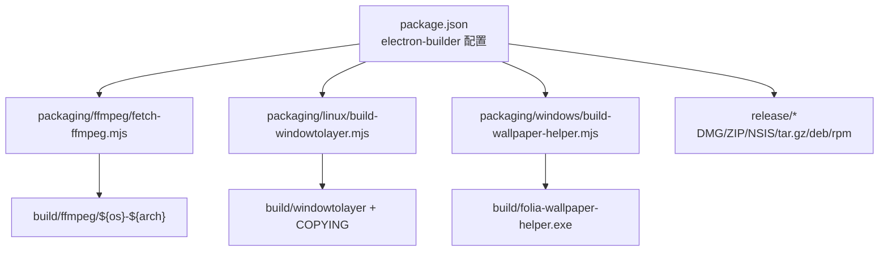
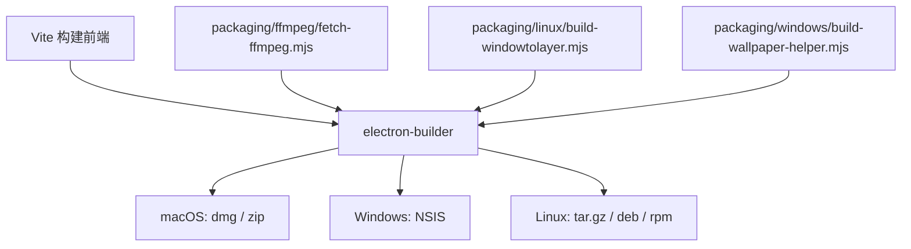
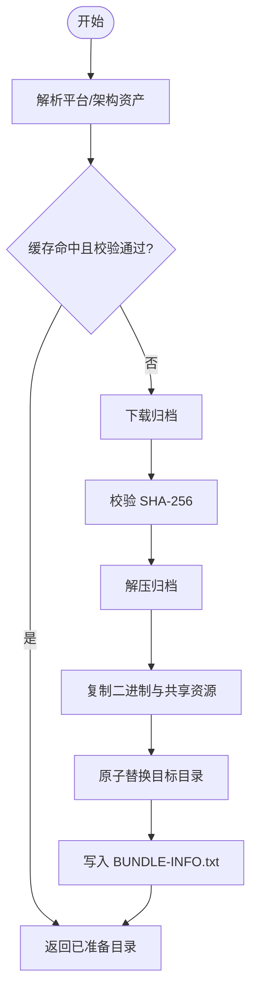
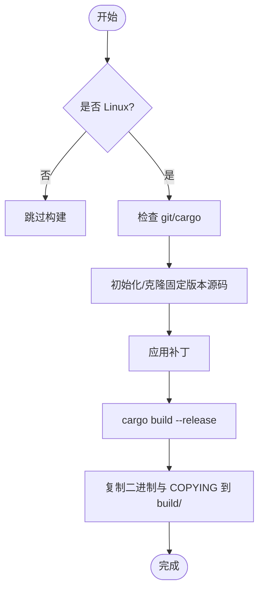
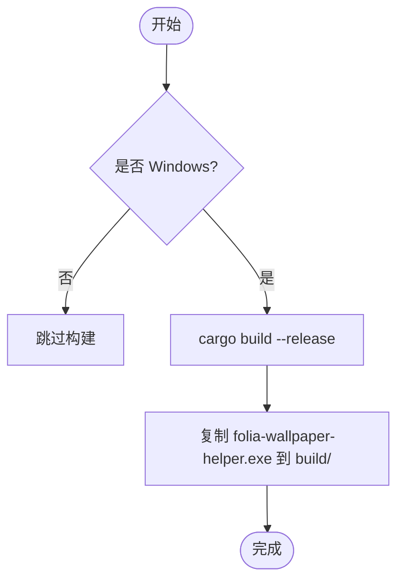
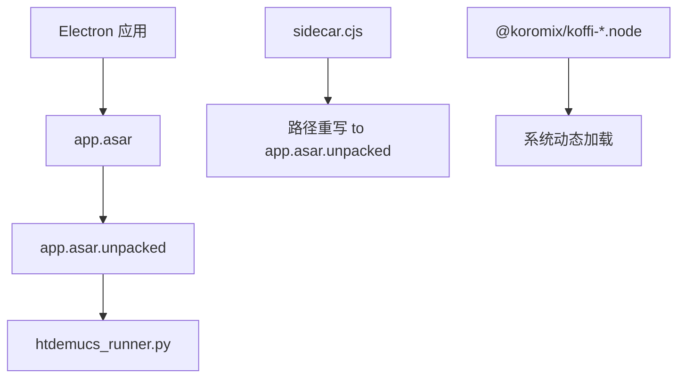
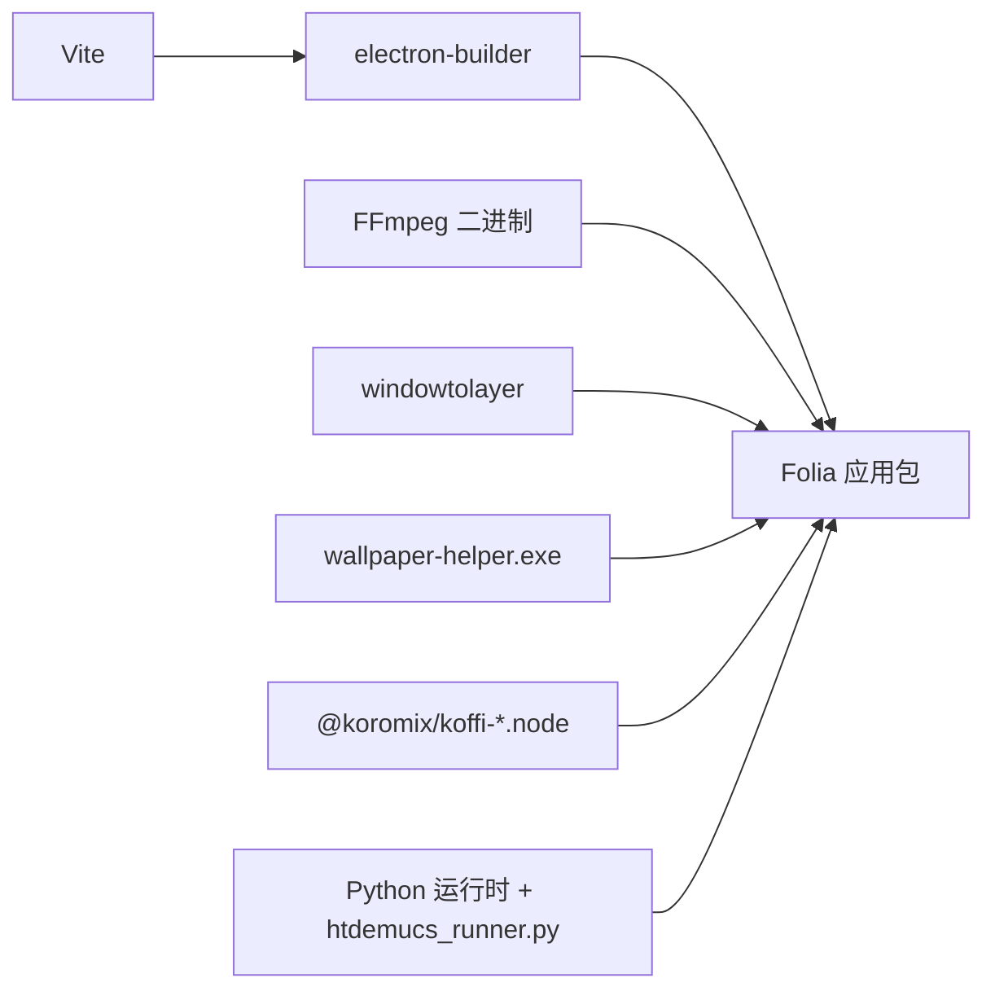

# Electron 应用打包

<cite>
**本文引用的文件**   
- [package.json](file://package.json)
- [fetch-ffmpeg.mjs](file://packaging/ffmpeg/fetch-ffmpeg.mjs)
- [build-windowtolayer.mjs](file://packaging/linux/build-windowtolayer.mjs)
- [build-wallpaper-helper.mjs](file://packaging/windows/build-wallpaper-helper.mjs)
- [windowtolayer-popup-resilience.patch](file://packaging/linux/patches/windowtolayer-popup-resilience.patch)
- [windowtolayer-single-layer-window.patch](file://packaging/linux/patches/windowtolayer-single-layer-window.patch)
- [folia-major.desktop](file://packaging/linux/folia-major.desktop)
- [README-LINUX.txt](file://packaging/linux/README-LINUX.txt)
- [wallpaper-helper Cargo.toml](file://packaging/windows/wallpaper-helper/Cargo.toml)
- [wallpaper-helper main.rs](file://packaging/windows/wallpaper-helper/src/main.rs)
- [wallpaper-helper attach.rs](file://packaging/windows/wallpaper-helper/src/attach.rs)
- [wallpaper-helper cli.rs](file://packaging/windows/wallpaper-helper/src/cli.rs)
- [wallpaper-helper events.rs](file://packaging/windows/wallpaper-helper/src/events.rs)
- [wallpaper-helper message_window.rs](file://packaging/windows/wallpaper-helper/src/message_window.rs)
- [wallpaper-helper monitor.rs](file://packaging/windows/wallpaper-helper/src/monitor.rs)
- [wallpaper-helper mouse_forward.rs](file://packaging/windows/wallpaper-helper/src/mouse_forward.rs)
- [sidecar.cjs](file://electron/analysis/sidecar.cjs)
- [modelStore.cjs](file://electron/analysis/modelStore.cjs)
</cite>

## 目录
1. [简介](#简介)
2. [项目结构](#项目结构)
3. [核心组件](#核心组件)
4. [架构总览](#架构总览)
5. [详细组件分析](#详细组件分析)
6. [依赖关系分析](#依赖关系分析)
7. [性能与 ASAR 策略](#性能与-asar-策略)
8. [跨平台兼容性处理](#跨平台兼容性处理)
9. [构建流水线与错误处理](#构建流水线与错误处理)
10. [故障排除指南](#故障排除指南)
11. [结论](#结论)

## 简介
本文面向 Folia Major 的 Electron 桌面应用，系统化梳理基于 electron-builder 的打包流程。内容覆盖多平台构建目标、代码签名与更新发布配置、资源管理与优化、beforePack/afterPack 钩子职责边界、原生模块与 FFmpeg 集成、窗口层工具与壁纸助手程序构建、ASAR 解包策略，以及 Linux/macOS/Windows 的平台差异与安装脚本定制。同时给出构建流水线建议、常见错误定位方法与排障清单，帮助开发者在本地与 CI 环境中稳定产出 DMG/ZIP、NSIS、tar.gz/deb/rpm 等产物。

## 项目结构
本项目将打包相关逻辑集中在 packaging 目录与 package.json 的 build 字段中：
- packaging/ffmpeg：按平台与架构下载并校验预编译 FFmpeg，输出到 build/ffmpeg/${os}-${arch}，供 extraResources 打包。
- packaging/linux：构建 windowtolayer（Linux 桌面壁纸模式），附带补丁与 README；desktop 入口与说明随 extraResources 进入安装包。
- packaging/windows：构建 Rust 编写的 wallpaper-helper 可执行文件，作为 Windows 壁纸辅助进程随安装包分发。
- package.json：集中声明 electron-builder 配置、多平台 target、extraResources、asarUnpack、语言包、更新发布渠道等。

图表来源
- [package.json:62-199](file://package.json#L62-L199)
- [fetch-ffmpeg.mjs:87-162](file://packaging/ffmpeg/fetch-ffmpeg.mjs#L87-L162)
- [build-windowtolayer.mjs:53-94](file://packaging/linux/build-windowtolayer.mjs#L53-L94)
- [build-wallpaper-helper.mjs:25-33](file://packaging/windows/build-wallpaper-helper.mjs#L25-L33)

章节来源
- [package.json:62-199](file://package.json#L62-L199)

## 核心组件
- 多平台构建目标
  - macOS：dmg 与 zip，x64/arm64 双架构，产物命名包含版本与架构。
  - Windows：NSIS 安装器，支持自定义安装目录与多语言。
  - Linux：tar.gz、deb、rpm，统一 artifactName 含 name/version/arch，设置可执行名与桌面项同步。
- 资源与依赖
  - extraResources：FFmpeg 二进制、图标、tray 模板、Linux desktop 与说明、windowtolayer 二进制及许可证。
  - asarUnpack：Python 推理脚本与 koffi 原生模块 .node，确保外部进程可直接访问。
- 更新与发布
  - generateUpdatesFilesForAllChannels 开启全通道更新文件生成。
  - publish 使用 GitHub 仓库，Linux 禁用自动更新发布。
- 国际化
  - electronLanguages 指定 en-US、zh-CN、id。
  - NSIS installerLanguages 指定 en_US、zh_CN、id。

章节来源
- [package.json:62-199](file://package.json#L62-L199)

## 架构总览
下图展示从源码到最终产物的关键路径：Vite 构建前端，Node 脚本准备原生依赖，electron-builder 组装应用包，并在不同平台上生成对应格式的安装包或压缩包。

图表来源
- [package.json:52-56](file://package.json#L52-L56)
- [package.json:62-199](file://package.json#L62-L199)

## 详细组件分析

### FFmpeg 集成与缓存
- 作用：为各平台/架构下载预编译 FFmpeg，校验归档 SHA-256，解压后仅保留运行时二进制与 share/folia-ffmpeg 元数据，写入 build/ffmpeg/${os}-${arch}。
- 关键行为：
  - resolveFfmpegAsset：根据 platform/arch 选择资产键与二进制名。
  - prepareBundledFfmpeg：下载→校验→解压→复制→原子替换→写 BUNDLE-INFO.txt 缓存标记。
  - 幂等性：若缓存命中且二进制 SHA-256 一致则直接返回，避免重复下载。
- 与打包集成：package.json 的 extraResources 将 build/ffmpeg/${os}-${arch} 映射到 app 内的 ffmpeg-audio 目录，供运行时通过外部进程调用。

图表来源
- [fetch-ffmpeg.mjs:52-64](file://packaging/ffmpeg/fetch-ffmpeg.mjs#L52-L64)
- [fetch-ffmpeg.mjs:87-162](file://packaging/ffmpeg/fetch-ffmpeg.mjs#L87-L162)

章节来源
- [fetch-ffmpeg.mjs:1-176](file://packaging/ffmpeg/fetch-ffmpeg.mjs#L1-L176)
- [package.json:95-132](file://package.json#L95-L132)

### Linux 窗口层工具 windowtolayer
- 作用：为 Linux 桌面壁纸模式提供底层窗口到图层能力，由 Node 脚本拉取上游固定版本源码，应用补丁后用 cargo 构建 release 二进制，拷贝至 build/windowtolayer 与 COPYING。
- 关键点：
  - 非 Linux 主机跳过构建，避免引入不必要的 Rust 工具链。
  - 使用固定提交 PINNED_REV 与 patches 列表保证可重现构建。
  - 构建产物权限设置为 0o755，便于运行时执行。
- 与打包集成：extraResources 将 windowtolayer 与 COPYING 打入安装包，运行时可通过环境变量或路径解析加载。

图表来源
- [build-windowtolayer.mjs:53-94](file://packaging/linux/build-windowtolayer.mjs#L53-L94)

章节来源
- [build-windowtolayer.mjs:1-95](file://packaging/linux/build-windowtolayer.mjs#L1-L95)
- [windowtolayer-popup-resilience.patch](file://packaging/linux/patches/windowtolayer-popup-resilience.patch)
- [windowtolayer-single-layer-window.patch](file://packaging/linux/patches/windowtolayer-single-layer-window.patch)
- [package.json:125-131](file://package.json#L125-L131)

### Windows 壁纸助手 wallpaper-helper
- 作用：Rust 编写的独立辅助进程，负责 Windows 桌面壁纸模式的交互与事件转发。
- 构建方式：仅在 win32 平台执行 cargo build --release，输出 folia-wallpaper-helper.exe 到 build/。
- 与打包集成：win.extraResources 将该 exe 打入安装包，运行时按需启动。

图表来源
- [build-wallpaper-helper.mjs:25-33](file://packaging/windows/build-wallpaper-helper.mjs#L25-L33)

章节来源
- [build-wallpaper-helper.mjs:1-34](file://packaging/windows/build-wallpaper-helper.mjs#L1-L34)
- [wallpaper-helper Cargo.toml](file://packaging/windows/wallpaper-helper/Cargo.toml)
- [wallpaper-helper main.rs](file://packaging/windows/wallpaper-helper/src/main.rs)
- [wallpaper-helper attach.rs](file://packaging/windows/wallpaper-helper/src/attach.rs)
- [wallpaper-helper cli.rs](file://packaging/windows/wallpaper-helper/src/cli.rs)
- [wallpaper-helper events.rs](file://packaging/windows/wallpaper-helper/src/events.rs)
- [wallpaper-helper message_window.rs](file://packaging/windows/wallpaper-helper/src/message_window.rs)
- [wallpaper-helper monitor.rs](file://packaging/windows/wallpaper-helper/src/monitor.rs)
- [wallpaper-helper mouse_forward.rs](file://packaging/windows/wallpaper-helper/src/mouse_forward.rs)
- [package.json:159-167](file://package.json#L159-L167)

### beforePack 与 afterPack 钩子
- 职责边界
  - beforePack：在 electron-builder 打包前执行，适合准备额外资源、预处理文件、注入环境变量或临时工件。
  - afterPack：在打包完成后执行，适合对产物进行二次处理、清理、签名或上传。
- 当前实现位置
  - package.json 中声明 beforePack 与 afterPack 指向 build/beforePack.cjs 与 build/afterPack.cjs。
  - 本仓库未提供这两个文件的源码，但结合脚本与依赖可知典型用途：
    - 在构建前触发 FFmpeg 准备、windowtolayer 与 wallpaper-helper 构建。
    - 在打包后执行平台特定处理（如签名、校验、产物重命名）。
- 建议实践
  - 将平台分支逻辑放在钩子内，避免污染主构建配置。
  - 对耗时操作（下载、编译）做幂等与缓存判断，提升 CI 速度。
  - 在 afterPack 中记录产物清单与校验和，便于后续自动化验证。

章节来源
- [package.json:65-66](file://package.json#L65-L66)
- [package.json:52-56](file://package.json#L52-L56)

### ASAR 打包策略与性能优化
- 需要解包的文件
  - electron/analysis/htdemucs_runner.py：Python 推理脚本需被外部 python.exe 读取，不能位于 asar 内部。
  - node_modules/@koromix/koffi-*/**/*.node：koffi 原生模块，需 dlopen，必须解包。
- 原因与影响
  - Python 与原生模块无法直接读取 asar 压缩包，解包后可被外部进程或系统动态加载器访问。
  - 减少不必要解包可降低安装包体积并提升启动 IO 效率。
- 运行期适配
  - sidecar.cjs 会将 app.asar 路径重写为 app.asar.unpacked，使外部进程能正确定位解包后的脚本。
  - modelStore.cjs 中对模型与运行时资源的加载逻辑与 unpacked 路径配合，确保生产环境可用。

图表来源
- [package.json:91-94](file://package.json#L91-L94)
- [sidecar.cjs:24-30](file://electron/analysis/sidecar.cjs#L24-L30)

章节来源
- [package.json:91-94](file://package.json#L91-L94)
- [sidecar.cjs:24-30](file://electron/analysis/sidecar.cjs#L24-L30)
- [modelStore.cjs:217-323](file://electron/analysis/modelStore.cjs#L217-L323)

### 代码签名与验证机制
- 当前配置
  - package.json 的 build 段未显式配置 mac/sign、win/sign 等签名选项。
  - publish 使用 GitHub，generateUpdatesFilesForAllChannels 开启更新文件生成。
- 建议补充
  - macOS：配置 codesign 证书与 entitlements，必要时启用 notarization。
  - Windows：配置 Authenticode 签名证书（.pfx/.p12），并对 NSIS 安装器与辅助 exe 签名。
  - Linux：可选 gpg 签名 deb/rpm，或在发行时附加签名文件。
- 更新安全
  - 建议在 afterPack 中计算产物与更新包的 SHA-256，并上传签名摘要，供客户端校验。

章节来源
- [package.json:72-82](file://package.json#L72-L82)
- [package.json:186-189](file://package.json#L186-L189)

### 资源文件管理与平台特定资源
- 通用资源
  - icon.png、trayTemplate.png、trayTemplate@2x.png 作为 extraResources 打入安装包。
- Linux 专属
  - linux/folia-major.desktop 与 linux/README-LINUX.txt 随包分发，用于桌面集成与用户说明。
  - executableName 与 category 设置符合 Linux 桌面规范。
- Windows 专属
  - folia-wallpaper-helper.exe 通过 win.extraResources 打入安装包。
- macOS 专属
  - dmg/zip 双架构产物，artifactName 包含 arch，便于区分。

章节来源
- [package.json:95-132](file://package.json#L95-L132)
- [package.json:133-199](file://package.json#L133-L199)
- [folia-major.desktop](file://packaging/linux/folia-major.desktop)
- [README-LINUX.txt](file://packaging/linux/README-LINUX.txt)

## 依赖关系分析
- 构建阶段依赖
  - Vite：前端构建。
  - electron-builder：打包与平台产物生成。
  - Node 脚本：FFmpeg 下载与校验、windowtolayer 构建、wallpaper-helper 构建。
- 运行阶段依赖
  - Electron 主进程与渲染进程。
  - 外部二进制：FFmpeg、windowtolayer、wallpaper-helper。
  - 原生模块：koffi 提供的 .node 文件。
  - Python 运行时：用于 htdemucs 推理（由 sidecar.cjs 调度）。

图表来源
- [package.json:52-56](file://package.json#L52-L56)
- [package.json:91-132](file://package.json#L91-L132)

章节来源
- [package.json:201-281](file://package.json#L201-L281)

## 性能与 ASAR 策略
- 最小化解包范围：仅解包 Python 脚本与原生 .node，避免扩大 asarUnpack 导致安装包膨胀与启动 IO 增加。
- 外部进程隔离：Python 推理走 sidecar 进程，避免阻塞主线程；模型与运行时资源通过 modelStore 管理，减少重复加载。
- 资源复用：FFmpeg 与 windowtolayer 等二进制通过 extraResources 复用，避免重复下载与编译。
- 建议优化
  - 对大型静态资源考虑分片或按需下载。
  - 在 afterPack 中移除调试符号与无用文件，减小产物体积。
  - 针对 Linux 图形后端（SwiftShader/software）提供构建开关以减少驱动依赖。

[本节为通用指导，不直接分析具体文件]

## 跨平台兼容性处理
- macOS
  - 双架构 dmg/zip，artifactName 包含 arch。
  - 无需 Windows helper，koffi 原生模块通过 @koromix/koffi-* 提供。
- Windows
  - NSIS 安装器支持多语言与自定义安装目录。
  - wallpaper-helper.exe 随包分发，供壁纸模式使用。
- Linux
  - tar.gz/deb/rpm 三格式，executableName 与 desktop 项同步。
  - windowtolayer 二进制与 COPYING 随包分发，满足 GPL 合规。
  - 提供 README-LINUX.txt 说明依赖与运行要求。

章节来源
- [package.json:133-199](file://package.json#L133-L199)
- [folia-major.desktop](file://packaging/linux/folia-major.desktop)
- [README-LINUX.txt](file://packaging/linux/README-LINUX.txt)

## 构建流水线与错误处理
- 推荐流水线步骤
  1. 安装依赖：npm ci。
  2. 准备 FFmpeg：npm run build:ffmpeg。
  3. 构建原生依赖：
     - Linux：npm run build:windowtolayer。
     - Windows：npm run build:wallpaper-helper。
  4. 前端构建：vite build。
  5. 打包：electron-builder 或 npm run build:electron。
  6. 产物校验：计算 SHA-256，上传签名与更新元数据。
- 错误处理建议
  - FFmpeg 下载失败：重试网络请求，校验 SHA-256 失败则清理缓存并重试。
  - 原生模块缺失：确认 asarUnpack 包含 .node，检查 koffi 平台包是否正确安装。
  - windowtolayer 构建失败：确保 git/cargo 可用，补丁与固定提交一致。
  - wallpaper-helper 构建失败：确保 Windows 平台与 Rust 工具链可用。
  - 签名失败：检查证书有效期、密码与权限，必要时先单独测试签名命令。
- 日志与诊断
  - 在 beforePack/afterPack 中输出关键路径与产物清单。
  - 对耗时步骤添加计时与进度日志，便于 CI 分析瓶颈。

章节来源
- [package.json:52-56](file://package.json#L52-L56)
- [fetch-ffmpeg.mjs:120-160](file://packaging/ffmpeg/fetch-ffmpeg.mjs#L120-L160)
- [build-windowtolayer.mjs:63-94](file://packaging/linux/build-windowtolayer.mjs#L63-L94)
- [build-wallpaper-helper.mjs:30-33](file://packaging/windows/build-wallpaper-helper.mjs#L30-L33)

## 故障排除指南
- 现象：Python 推理报错找不到脚本
  - 排查：确认 htdemucs_runner.py 在 asarUnpack 列表中，sidecar.cjs 路径重写生效。
  - 参考：[sidecar.cjs:24-30](file://electron/analysis/sidecar.cjs#L24-L30)
- 现象：koffi 原生模块加载失败
  - 排查：确认 @koromix/koffi-<platform>-<arch> 已安装，.node 未被 asar 压缩。
  - 参考：[package.json:91-94](file://package.json#L91-L94)
- 现象：Linux 壁纸模式无法启动
  - 排查：检查 windowtolayer 是否存在且可执行，COPYING 是否随包分发。
  - 参考：[build-windowtolayer.mjs:89-94](file://packaging/linux/build-windowtolayer.mjs#L89-L94)
- 现象：Windows 壁纸助手未响应
  - 排查：确认 folia-wallpaper-helper.exe 存在且被 NSIS 安装器放置到预期目录。
  - 参考：[build-wallpaper-helper.mjs:30-33](file://packaging/windows/build-wallpaper-helper.mjs#L30-L33)
- 现象：FFmpeg 不可用
  - 排查：检查 build/ffmpeg/${os}-${arch} 是否存在，BUNDLE-INFO.txt 是否有效。
  - 参考：[fetch-ffmpeg.mjs:100-156](file://packaging/ffmpeg/fetch-ffmpeg.mjs#L100-L156)

章节来源
- [sidecar.cjs:24-30](file://electron/analysis/sidecar.cjs#L24-L30)
- [package.json:91-94](file://package.json#L91-L94)
- [build-windowtolayer.mjs:89-94](file://packaging/linux/build-windowtolayer.mjs#L89-L94)
- [build-wallpaper-helper.mjs:30-33](file://packaging/windows/build-wallpaper-helper.mjs#L30-L33)
- [fetch-ffmpeg.mjs:100-156](file://packaging/ffmpeg/fetch-ffmpeg.mjs#L100-L156)

## 结论
Folia Major 的 Electron 打包体系以 package.json 为中心，结合 Node 脚本完成 FFmpeg、windowtolayer 与 wallpaper-helper 的准备与构建，再通过 electron-builder 生成多平台产物。ASAR 策略精准解包必要文件，保障外部进程与原生模块正常运行。建议在现有基础上完善代码签名与更新校验，强化错误处理与日志输出，以提升本地与 CI 环境的稳定性与可观测性。