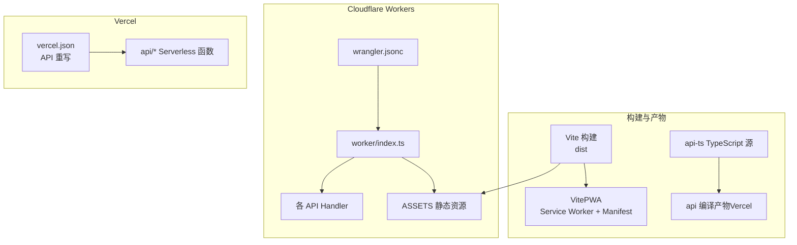
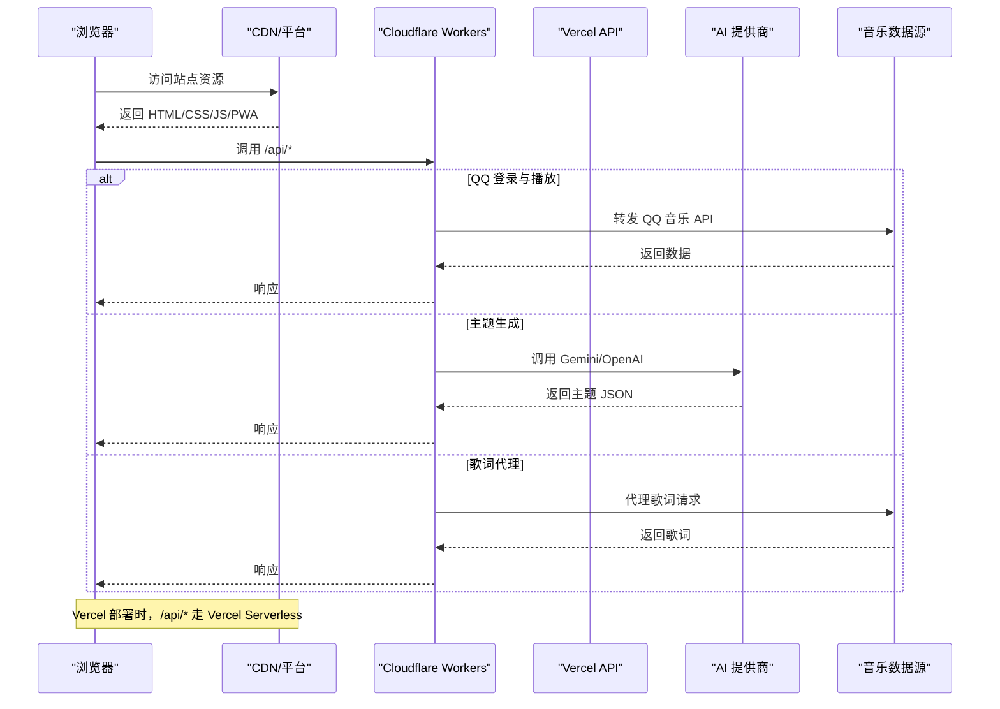
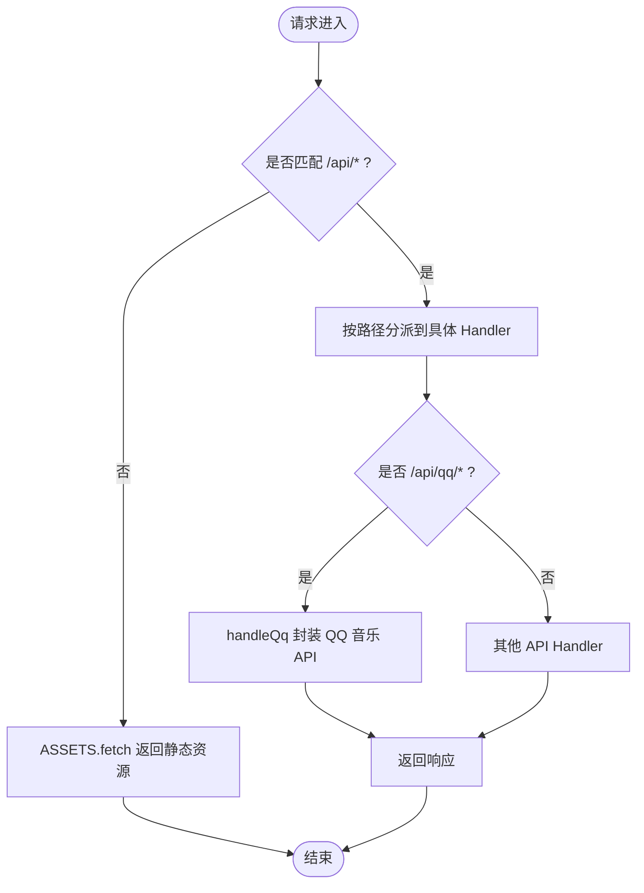
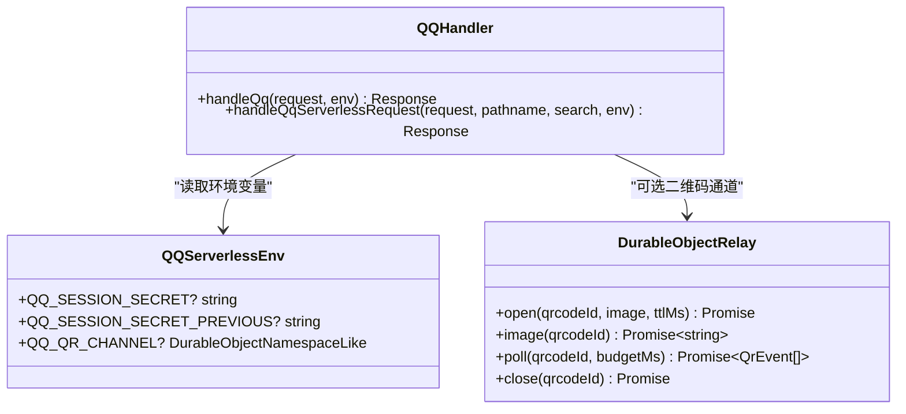
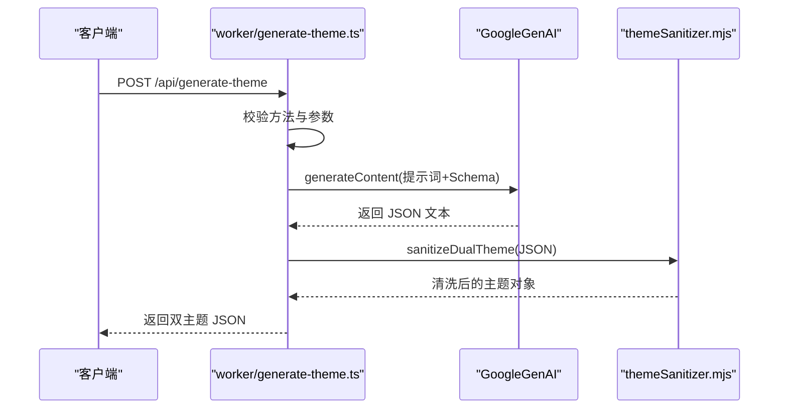
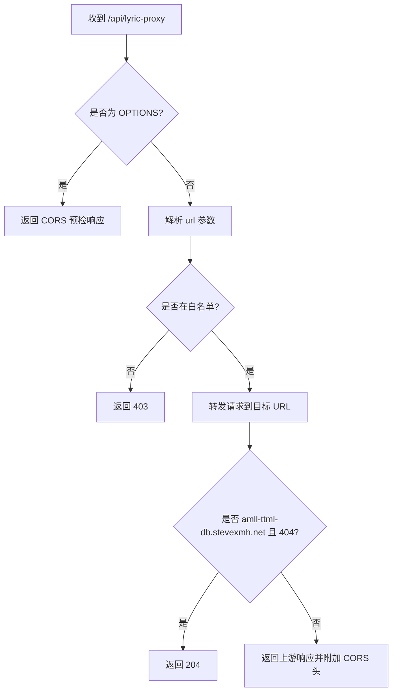
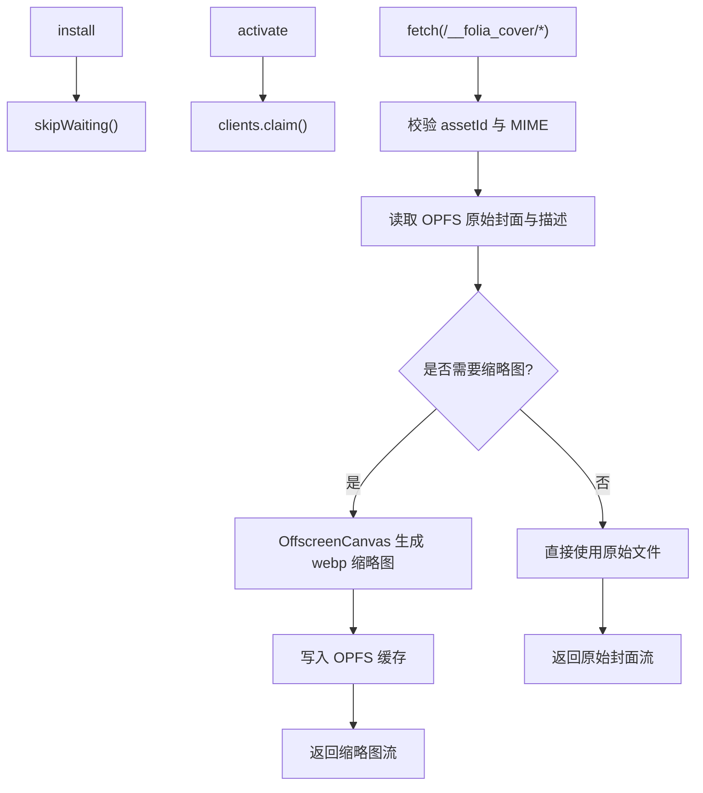
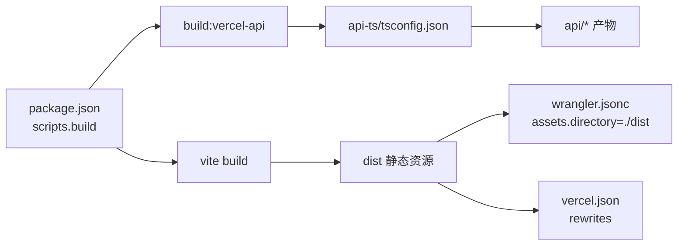
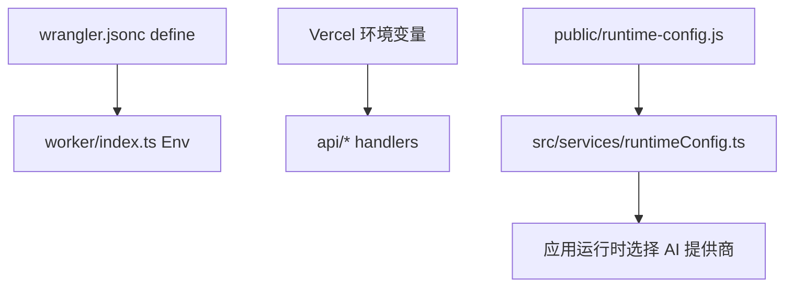

# Web 应用部署

<cite>
**本文引用的文件**   
- [vercel.json](file://vercel.json)
- [wrangler.jsonc](file://wrangler.jsonc)
- [package.json](file://package.json)
- [vite.config.ts](file://vite.config.ts)
- [public/folia-cover-sw.js](file://public/folia-cover-sw.js)
- [worker/index.ts](file://worker/index.ts)
- [worker/generate-theme.ts](file://worker/generate-theme.ts)
- [worker/lyric-proxy.ts](file://worker/lyric-proxy.ts)
- [worker/segment-lyrics.ts](file://worker/segment-lyrics.ts)
- [worker/qq.ts](file://worker/qq.ts)
- [api-ts/tsconfig.json](file://api-ts/tsconfig.json)
- [api/generate-theme.js](file://api/generate-theme.js)
- [api/lyric-proxy.js](file://api/lyric-proxy.js)
- [api/segment-lyrics.js](file://api/segment-lyrics.js)
- [src/services/runtimeConfig.ts](file://src/services/runtimeConfig.ts)
- [public/runtime-config.js](file://public/runtime-config.js)
</cite>

## 目录
1. [简介](#简介)
2. [项目结构](#项目结构)
3. [核心组件](#核心组件)
4. [架构总览](#架构总览)
5. [详细组件分析](#详细组件分析)
6. [依赖关系分析](#依赖关系分析)
7. [性能与缓存策略](#性能与缓存策略)
8. [环境变量与运行时配置](#环境变量与运行时配置)
9. [HTTPS、域名与 SEO](#https域名与-seo)
10. [部署流程](#部署流程)
11. [故障排除指南](#故障排除指南)
12. [结论](#结论)

## 简介
本文件为 Folia Major Web 应用的完整部署技术文档，覆盖以下平台与能力：
- Vercel 静态站点与 Serverless API 部署：API 路由重写、构建产物、PWA 预缓存与忽略规则。
- Cloudflare Workers 边缘计算部署：入口路由、资产托管、API 函数、QQ 扫码通道与 Durable Object 集成。
- Service Worker 与 PWA：封面离线缓存、缩略图生成、资源预加载与后台同步。
- CDN 与全局加速：静态资源分发、缓存头、不可变资源与 SPA 回退。
- HTTPS、域名绑定、SEO 优化与性能监控建议。
- 端到端部署流程与常见问题排查。

## 项目结构
本项目采用多目标部署结构：
- 前端由 Vite 构建，输出到 dist，并通过 VitePWA 注入 Service Worker 与 manifest。
- API 同时支持两条路径：
  - Vercel：TypeScript 源位于 api-ts，编译产物在 api，Vercel 直接消费该产物。
  - Cloudflare Workers：统一入口 worker/index.ts，按路径分派到各 handler。
- 公共静态资源与 Service Worker 脚本位于 public。
- wrangler.jsonc 定义 Workers 的资产托管、运行环境与 API 优先处理。

**图表来源**
- [wrangler.jsonc:1-20](file://wrangler.jsonc#L1-L20)
- [worker/index.ts:1-70](file://worker/index.ts#L1-L70)
- [vercel.json:1-7](file://vercel.json#L1-L7)
- [package.json:18-24](file://package.json#L18-L24)

**章节来源**
- [package.json:18-24](file://package.json#L18-L24)
- [wrangler.jsonc:1-20](file://wrangler.jsonc#L1-L20)
- [vercel.json:1-7](file://vercel.json#L1-L7)

## 核心组件
- Vite 构建与 PWA：
  - 通过 vite-plugin-pwa 启用自动更新、预缓存与 manifest。
  - 将 three.js 单独分包以避免超过 PWA 预缓存单文件大小限制。
  - 忽略 runtime-config.js 与 folium-icons 目录，避免动态或桌面端专用资源被错误预缓存。
  - 禁止 /api 导航被 PWA 壳捕获，确保 API 请求直达平台。
- Cloudflare Workers 入口：
  - 统一处理 /api/generate-theme、/api/generate-theme_openai、/api/lyric-proxy、/api/segment-lyrics 与 /api/qq/*。
  - 未命中 API 时交由 ASSETS.fetch 返回静态资源，并开启 single-page-application 模式。
- Vercel API：
  - 使用 api-ts 编译产物，提供主题生成、歌词代理与歌词分词接口。
  - vercel.json 对 /api/qq 进行 rewrite，将 path 参数透传给后端。

**章节来源**
- [vite.config.ts:247-276](file://vite.config.ts#L247-L276)
- [vite.config.ts:205-229](file://vite.config.ts#L205-L229)
- [worker/index.ts:33-68](file://worker/index.ts#L33-L68)
- [api-ts/tsconfig.json:1-15](file://api-ts/tsconfig.json#L1-L15)
- [vercel.json:1-7](file://vercel.json#L1-L7)

## 架构总览
下图展示浏览器、CDN、Workers/Vercel 与外部 AI/音乐服务之间的交互关系。

**图表来源**
- [worker/index.ts:33-68](file://worker/index.ts#L33-L68)
- [worker/qq.ts:105-134](file://worker/qq.ts#L105-L134)
- [worker/generate-theme.ts:66-195](file://worker/generate-theme.ts#L66-L195)
- [worker/lyric-proxy.ts:8-110](file://worker/lyric-proxy.ts#L8-L110)
- [api/generate-theme.js:60-175](file://api/generate-theme.js#L60-L175)
- [api/lyric-proxy.js:43-108](file://api/lyric-proxy.js#L43-L108)

## 详细组件分析

### Cloudflare Workers 入口与路由
- 入口 worker/index.ts 根据 pathname 分派到对应 handler：
  - /api/generate-theme：调用 Gemini 生成双主题。
  - /api/generate-theme_openai：调用 OpenAI 兼容接口生成主题。
  - /api/lyric-proxy：代理歌词请求，添加 CORS 头并白名单校验。
  - /api/segment-lyrics：歌词分词，复用 shared 逻辑。
  - /api/qq/*：封装 QQ 音乐 serverless 接入层，支持可选 Durable Object 二维码通道。
- 未命中 API 的请求交给 ASSETS.fetch，实现 SPA 回退。

**图表来源**
- [worker/index.ts:33-68](file://worker/index.ts#L33-L68)
- [worker/qq.ts:129-134](file://worker/qq.ts#L129-L134)

**章节来源**
- [worker/index.ts:1-70](file://worker/index.ts#L1-L70)
- [wrangler.jsonc:11-18](file://wrangler.jsonc#L11-L18)

### QQ 音乐 Serverless 接入层
- 统一前缀 /api/qq，内部还原子路径与查询参数后交给 @yakult-green-tea/qq-music-api/serverless。
- 可选集成 Durable Object 作为二维码通道，命名空间与 ID 推导在 worker/qq.ts 中完成。
- 环境变量 QQ_SESSION_SECRET 与 QQ_SESSION_SECRET_PREVIOUS 用于会话密钥；未设置时登录路由返回 501，曲库路由仍可工作。

**图表来源**
- [worker/qq.ts:15-29](file://worker/qq.ts#L15-L29)
- [worker/qq.ts:63-92](file://worker/qq.ts#L63-L92)
- [worker/qq.ts:105-134](file://worker/qq.ts#L105-L134)

**章节来源**
- [worker/qq.ts:1-135](file://worker/qq.ts#L1-L135)

### 主题生成 API（Gemini 与 OpenAI）
- Gemini 版本：
  - 接收 lyricsText、isPureMusic、songTitle，构造提示词并调用 Gemini 模型生成 light/dark 双主题。
  - 对返回 JSON 进行 sanitizeDualTheme 清洗，并固定 fontStyle 与 provider。
- OpenAI 兼容版本：
  - 通过 /api/generate-theme_openai 调用 OpenAI 兼容接口，结构与 Gemini 版本一致。

**图表来源**
- [worker/generate-theme.ts:66-195](file://worker/generate-theme.ts#L66-L195)

**章节来源**
- [worker/generate-theme.ts:1-196](file://worker/generate-theme.ts#L1-L196)
- [api/generate-theme.js:60-175](file://api/generate-theme.js#L60-L175)

### 歌词代理 API
- 白名单校验目标主机：qq.com、kugou.com 及其子域、amll-ttml-db.stevexmh.net。
- 过滤敏感头（host、connection、content-length、origin、referer 等），转发其余请求头与方法体。
- 针对 amll-ttml-db.stevexmh.net 的 404 返回 204 空响应，适配上游行为差异。
- 添加 CORS 响应头，允许跨域调用。

**图表来源**
- [worker/lyric-proxy.ts:8-110](file://worker/lyric-proxy.ts#L8-L110)
- [api/lyric-proxy.js:43-108](file://api/lyric-proxy.js#L43-L108)

**章节来源**
- [worker/lyric-proxy.ts:1-111](file://worker/lyric-proxy.ts#L1-L111)
- [api/lyric-proxy.js:1-109](file://api/lyric-proxy.js#L1-L109)

### 歌词分词 API
- 复用 shared/lyricSegmentationService.mjs 的分词逻辑。
- 支持 AI_PROVIDER、GEMINI_API_KEY、OPENAI_* 等环境变量，决定实际调用的模型提供方。
- 错误类型 SegmentationRequestError 映射为相应 HTTP 状态码。

**章节来源**
- [worker/segment-lyrics.ts:1-41](file://worker/segment-lyrics.ts#L1-L41)
- [api/segment-lyrics.js:1-28](file://api/segment-lyrics.js#L1-L28)

### Service Worker 与封面离线缓存
- public/folia-cover-sw.js 提供基于 OPFS 的内容寻址封面缓存：
  - 安装阶段 skipWaiting，激活阶段 claim clients。
  - 拦截 /__folia_cover/{sha256:...} 请求，从 OPFS 的 folia-cache/local-cover-assets 读取原始封面与描述文件。
  - 按需生成缩略图（512/1024），使用 OffscreenCanvas 转 webp 并写回 OPFS。
  - 返回强缓存头：Cache-Control: public, max-age=31536000, immutable。
  - 严格校验 MIME 类型、尺寸与描述一致性，防止篡改。

**图表来源**
- [public/folia-cover-sw.js:19-20](file://public/folia-cover-sw.js#L19-L20)
- [public/folia-cover-sw.js:44-87](file://public/folia-cover-sw.js#L44-L87)
- [public/folia-cover-sw.js:89-133](file://public/folia-cover-sw.js#L89-L133)
- [public/folia-cover-sw.js:135-141](file://public/folia-cover-sw.js#L135-L141)

**章节来源**
- [public/folia-cover-sw.js:1-142](file://public/folia-cover-sw.js#L1-L142)

### Vite 构建与 PWA 配置
- PWA 启用 autoUpdate，manifest 包含名称、短名、主题色、背景色与 display: standalone。
- workbox.maximumFileSizeToCacheInBytes 设为 5MB，three.js 单独分包以规避预缓存大小限制。
- globIgnores 排除 runtime-config.js 与 folium-icons，navigateFallbackDenylist 排除 /api 路径。
- define 注入 __COMMIT_HASH__、__GIT_BRANCH__、__APP_VERSION__ 等常量，便于运行时显示版本信息。

**章节来源**
- [vite.config.ts:247-276](file://vite.config.ts#L247-L276)
- [vite.config.ts:205-229](file://vite.config.ts#L205-L229)
- [vite.config.ts:278-285](file://vite.config.ts#L278-L285)

## 依赖关系分析
- 构建依赖：
  - package.json 中 scripts.build 先执行 build:vercel-api 编译 api-ts，再执行 vite build。
  - api-ts/tsconfig.json 指定输出目录为 ../api，供 Vercel 直接消费。
- 运行时依赖：
  - worker/index.ts 引入各 handler，并在模块作用域注入 Buffer 全局变量，满足 qq-music-api 与 MQTT codec 的需求。
  - wrangler.jsonc 定义 assets.directory 为 ./dist，run_worker_first 包含 /api/*，确保 API 优先于静态资源处理。
  - vercel.json 对 /api/qq/:path* 进行 rewrite，将 path 参数传递给后端。

**图表来源**
- [package.json:18-24](file://package.json#L18-L24)
- [api-ts/tsconfig.json:1-15](file://api-ts/tsconfig.json#L1-L15)
- [wrangler.jsonc:11-18](file://wrangler.jsonc#L11-L18)
- [vercel.json:3-5](file://vercel.json#L3-L5)

**章节来源**
- [package.json:18-24](file://package.json#L18-L24)
- [api-ts/tsconfig.json:1-15](file://api-ts/tsconfig.json#L1-L15)
- [wrangler.jsonc:1-20](file://wrangler.jsonc#L1-L20)
- [vercel.json:1-7](file://vercel.json#L1-L7)

## 性能与缓存策略
- 静态资源：
  - 通过 Vite 手动分包将 large dependency（如 three.js）拆分，避免 PWA 预缓存单文件过大。
  - Service Worker 对内容寻址封面返回强缓存头，提升重复访问性能。
- API 缓存：
  - 歌词代理不缓存上游响应，但通过白名单与头部过滤减少不必要开销。
  - 主题生成与分词为无状态 API，适合边缘缓存（可按业务需求在 CDN 层配置）。
- 资源预加载：
  - PWA 预缓存主要资源，runtime-config.js 与 folium-icons 被显式忽略，避免无效缓存。
- 全局加速：
  - Cloudflare Workers 天然具备全球边缘网络；Vercel 同样提供全球边缘节点。
  - 建议在 CDN 层对静态资源启用 gzip/brotli 压缩与 HTTP/2 或 HTTP/3。

[本节为通用指导，不涉及具体代码片段]

## 环境变量与运行时配置
- Cloudflare Workers：
  - wrangler.jsonc 的 define 字段将 process.env.NODE_ENV、JEST_WORKER_ID、LOG_LEVEL 定义为常量，避免运行时读取。
  - worker/index.ts 的 Env 类型声明了 AI_PROVIDER、GEMINI_API_KEY、OPENAI_API_KEY、OPENAI_API_URL、OPENAI_API_MODEL、OPENAI_API_TEMPERATURE 等键。
  - QQ 相关环境变量 QQ_SESSION_SECRET、QQ_SESSION_SECRET_PREVIOUS、QQ_QR_CHANNEL 在 worker/qq.ts 中使用。
- Vercel：
  - api/generate-theme.js 与 api/lyric-proxy.js 通过 process.env 读取 GEMINI_API_KEY 等。
  - api/segment-lyrics.js 将 process.env 传入 shared 分词服务。
- Web 运行时配置：
  - src/services/runtimeConfig.ts 读取 window.__FOLIA_RUNTIME_CONFIG__.aiProvider，若不存在则回退到 import.meta.env.VITE_AI_PROVIDER。
  - public/runtime-config.js 为非 Docker 部署提供空运行时配置对象。

**图表来源**
- [wrangler.jsonc:6-10](file://wrangler.jsonc#L6-L10)
- [worker/index.ts:21-31](file://worker/index.ts#L21-L31)
- [api/generate-theme.js:69-73](file://api/generate-theme.js#L69-L73)
- [api/lyric-proxy.js:43-108](file://api/lyric-proxy.js#L43-L108)
- [src/services/runtimeConfig.ts:9-16](file://src/services/runtimeConfig.ts#L9-L16)
- [public/runtime-config.js:1-2](file://public/runtime-config.js#L1-L2)

**章节来源**
- [wrangler.jsonc:1-20](file://wrangler.jsonc#L1-L20)
- [worker/index.ts:21-31](file://worker/index.ts#L21-L31)
- [api/generate-theme.js:60-175](file://api/generate-theme.js#L60-L175)
- [api/lyric-proxy.js:43-108](file://api/lyric-proxy.js#L43-L108)
- [src/services/runtimeConfig.ts:1-16](file://src/services/runtimeConfig.ts#L1-L16)
- [public/runtime-config.js:1-2](file://public/runtime-config.js#L1-L2)

## HTTPS、域名与 SEO
- HTTPS：
  - Vercel 与 Cloudflare 均默认提供 HTTPS；请确保 DNS 记录正确指向平台。
- 域名绑定：
  - 在 Vercel 项目中添加自定义域名并验证 SSL。
  - 在 Cloudflare 项目中绑定域名并启用 Always Use HTTPS。
- SEO：
  - 确保 index.html 包含必要的 meta 标签（title、description、og:*、twitter:*）。
  - 使用 Vite 的 base 与路由策略保证可索引性。
  - 对于 PWA，manifest 中的 name、short_name、description 有助于搜索引擎理解应用语义。

[本节为通用指导，不涉及具体代码片段]

## 部署流程

### Vercel 部署
- 前置条件：
  - 已配置 GEMINI_API_KEY、OPENAI_API_KEY 等环境变量。
  - 已提交 api-ts 编译产物到 api 目录（CI 或本地执行 npm run build:vercel-api）。
- 步骤：
  - 在 Vercel 控制台导入仓库，选择框架为 Vite。
  - 在 Environment Variables 中配置所需密钥。
  - 构建命令保持默认（npm run build），输出目录为 dist。
  - vercel.json 已配置 /api/qq 重写规则，无需额外修改。

**章节来源**
- [package.json:18-24](file://package.json#L18-L24)
- [vercel.json:1-7](file://vercel.json#L1-L7)
- [api-ts/tsconfig.json:1-15](file://api-ts/tsconfig.json#L1-L15)

### Cloudflare Workers 部署
- 前置条件：
  - 已安装 Node.js 与 npm。
  - 已配置 wrangler CLI 并登录 Cloudflare。
  - 已设置必要的环境变量（AI_PROVIDER、GEMINI_API_KEY、OPENAI_*、QQ_SESSION_SECRET 等）。
- 步骤：
  - 执行 npm install 安装依赖。
  - 构建前端：npm run build，产出 dist。
  - 部署 Workers：wrangler deploy（或使用 sync-server 提供的脚本）。
  - 如需 QQ 扫码通道，需在 Cloudflare 创建 Durable Object 命名空间并配置 QQ_QR_CHANNEL binding。

**章节来源**
- [wrangler.jsonc:1-20](file://wrangler.jsonc#L1-L20)
- [worker/index.ts:1-70](file://worker/index.ts#L1-L70)
- [worker/qq.ts:15-29](file://worker/qq.ts#L15-L29)

## 故障排除指南
- API 404 或 502：
  - 检查 wrangler.jsonc 的 assets.not_found_handling 是否为 single-page-application。
  - 确认 worker/index.ts 的路由匹配与 catch 处理逻辑。
- QQ 登录失败：
  - 确认 QQ_SESSION_SECRET 与 QQ_SESSION_SECRET_PREVIOUS 已配置。
  - 若启用二维码通道，确认 QQ_QR_CHANNEL binding 与 Durable Object 命名空间存在。
- 歌词代理 403：
  - 检查目标主机是否在白名单内。
  - 确认请求头未被过滤导致上游拒绝。
- PWA 无法离线：
  - 检查 workbox.maximumFileSizeToCacheInBytes 与 manualChunks 配置。
  - 确认 runtime-config.js 与 folium-icons 被 globIgnores 排除。
- Service Worker 不生效：
  - 确认 public/folia-cover-sw.js 路径正确并被注册。
  - 检查 fetch 事件拦截器是否正确匹配 /__folia_cover/*。

**章节来源**
- [worker/index.ts:53-67](file://worker/index.ts#L53-L67)
- [worker/qq.ts:17-29](file://worker/qq.ts#L17-L29)
- [worker/lyric-proxy.ts:30-35](file://worker/lyric-proxy.ts#L30-L35)
- [vite.config.ts:247-276](file://vite.config.ts#L247-L276)
- [public/folia-cover-sw.js:135-141](file://public/folia-cover-sw.js#L135-L141)

## 结论
本项目通过 Vite 构建与 PWA 插件提供现代 Web 体验，结合 Cloudflare Workers 与 Vercel 实现多平台部署。API 层统一抽象，支持 Gemini/OpenAI 主题生成、歌词代理与分词，QQ 音乐 serverless 接入层提供可扩展的扫码通道。Service Worker 与 OPFS 实现封面离线缓存与缩略图生成，配合 CDN 与边缘计算显著提升性能与可用性。按照本文档的流程与排错指南，可快速完成部署并稳定运行。