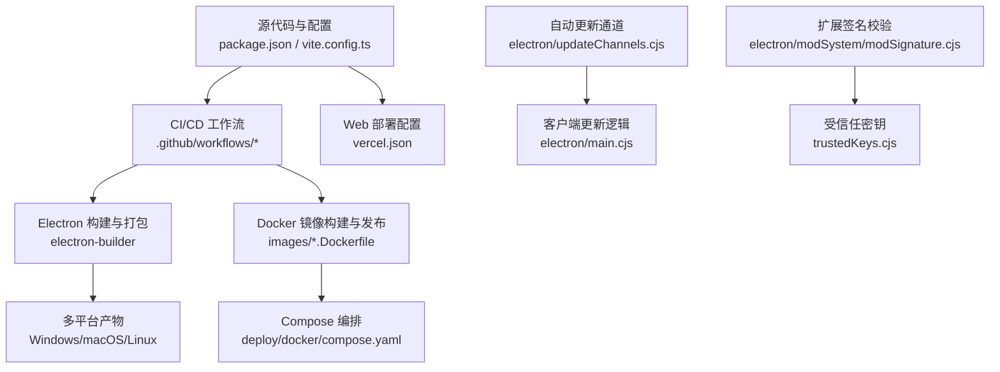
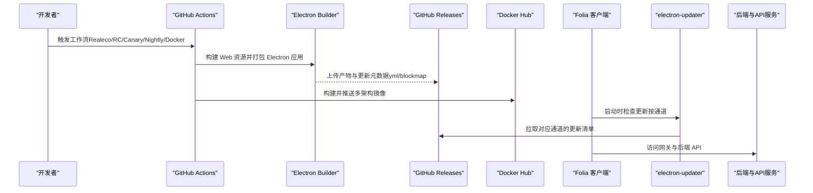
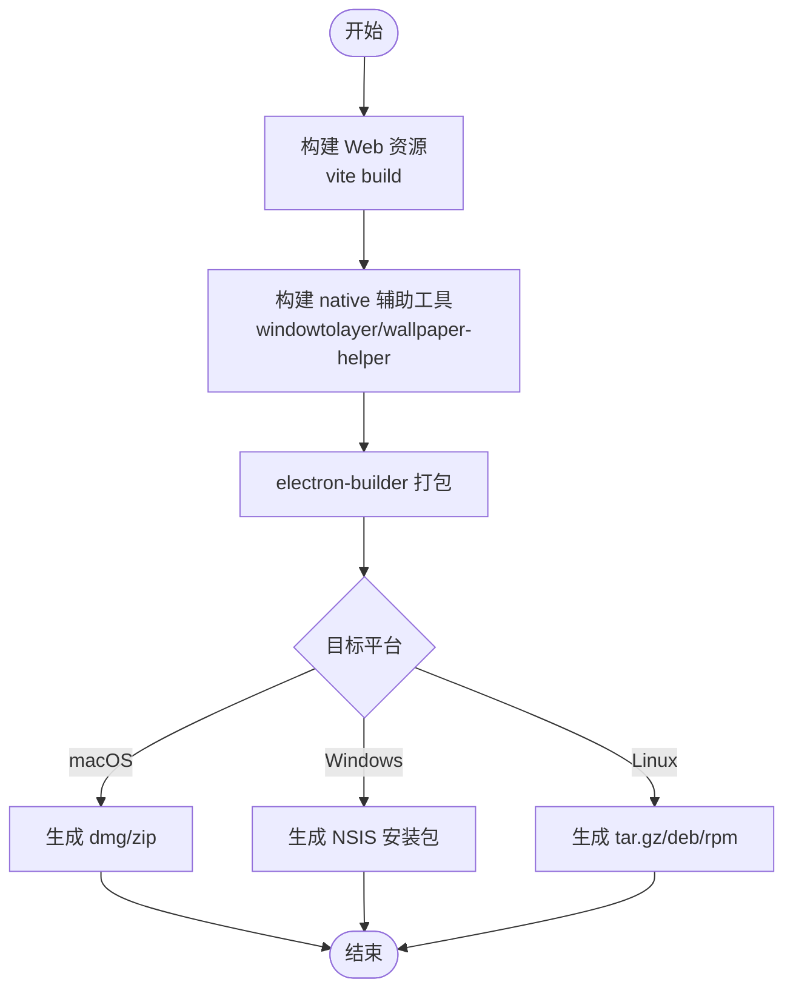
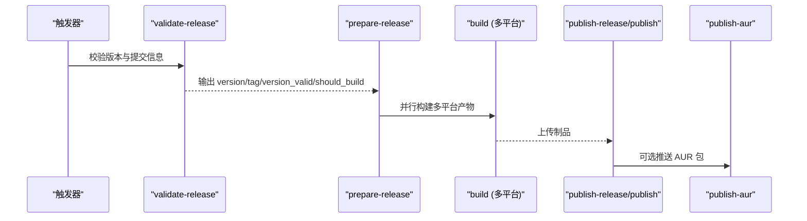
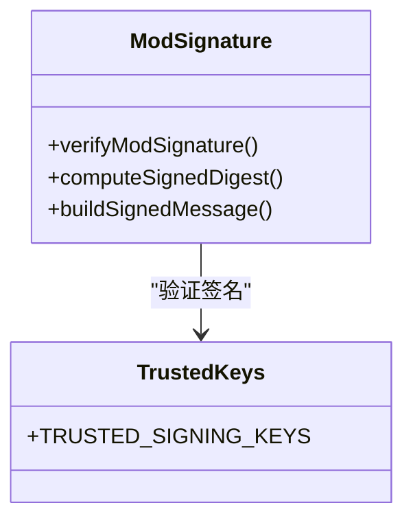
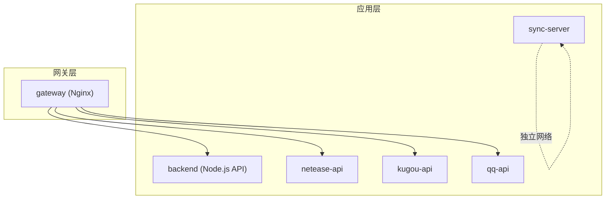
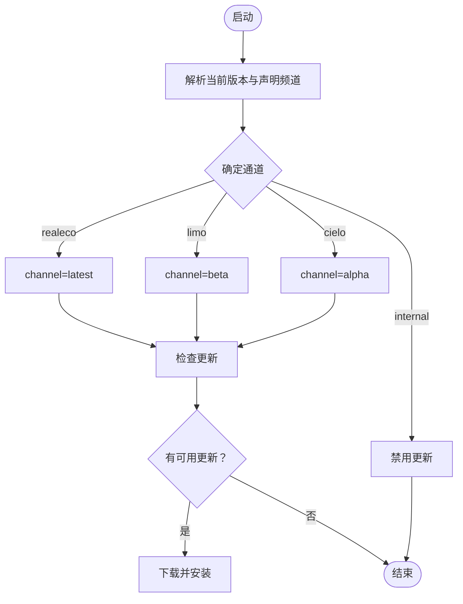
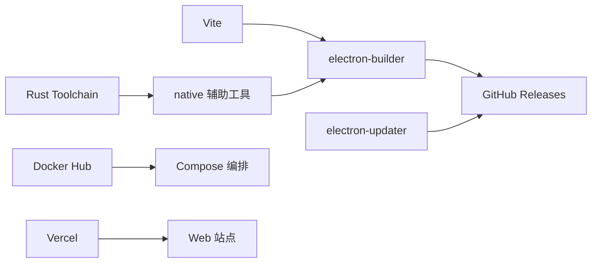

# 打包与分发

<cite>
**本文引用的文件**   
- [package.json](file://package.json)
- [vercel.json](file://vercel.json)
- [electron-release.yml](file://.github/workflows/electron-release.yml)
- [release-candidate.yml](file://.github/workflows/release-candidate.yml)
- [canary-pre-release.yml](file://.github/workflows/canary-pre-release.yml)
- [nightly-pre-release.yml](file://.github/workflows/nightly-pre-release.yml)
- [docker-stack-publish.yml](file://.github/workflows/docker-stack-publish.yml)
- [compose.yaml](file://deploy/docker/compose.yaml)
- [backend.Dockerfile](file://deploy/docker/images/backend.Dockerfile)
- [gateway.Dockerfile](file://deploy/docker/images/gateway.Dockerfile)
- [updateChannels.cjs](file://electron/updateChannels.cjs)
- [main.cjs](file://electron/main.cjs)
- [modSignature.cjs](file://electron/modSystem/modSignature.cjs)
</cite>

## 目录
1. [简介](#简介)
2. [项目结构](#项目结构)
3. [核心组件](#核心组件)
4. [架构总览](#架构总览)
5. [详细组件分析](#详细组件分析)
6. [依赖关系分析](#依赖关系分析)
7. [性能考虑](#性能考虑)
8. [故障排除指南](#故障排除指南)
9. [结论](#结论)

## 简介
本文件面向 Folia Major 的打包与分发体系，覆盖 Electron 桌面端构建、多平台产物发布、代码签名与完整性校验、Docker 容器化部署、Web 部署（Vercel）、自动更新通道与版本策略，以及 CI/CD 流水线与优化建议。文档以仓库现有实现为依据，提供可操作的流程说明和排错指引。

## 项目结构
Folia Major 的打包与分发由以下关键部分组成：
- 根级构建配置与脚本：定义 Electron Builder 配置、资源打包、语言包、更新元数据生成等。
- CI/CD 工作流：负责 Realeco 稳定版、候选版、Canary/Limo 预发行版、Docker 镜像栈的构建与发布。
- Docker 编排与镜像：网关（Nginx）+ 后端 API + 各音乐平台代理 + 同步服务。
- Web 部署：Vercel 重写规则与运行时环境变量注入。
- 自动更新：基于 electron-updater 的多通道策略与版本解析。
- 扩展签名：Mod 签名验证与信任密钥机制。

**图表来源**
- [package.json:62-199](file://package.json#L62-L199)
- [electron-release.yml:110-221](file://.github/workflows/electron-release.yml#L110-L221)
- [docker-stack-publish.yml:76-167](file://.github/workflows/docker-stack-publish.yml#L76-L167)
- [compose.yaml:1-181](file://deploy/docker/compose.yaml#L1-L181)
- [vercel.json:1-7](file://vercel.json#L1-L7)
- [updateChannels.cjs:1-57](file://electron/updateChannels.cjs#L1-L57)
- [main.cjs:3081-3262](file://electron/main.cjs#L3081-L3262)
- [modSignature.cjs:1-22](file://electron/modSystem/modSignature.cjs#L1-L22)

**章节来源**
- [package.json:18-60](file://package.json#L18-L60)
- [package.json:62-199](file://package.json#L62-L199)
- [electron-release.yml:110-221](file://.github/workflows/electron-release.yml#L110-L221)
- [docker-stack-publish.yml:76-167](file://.github/workflows/docker-stack-publish.yml#L76-L167)
- [compose.yaml:1-181](file://deploy/docker/compose.yaml#L1-L181)
- [vercel.json:1-7](file://vercel.json#L1-L7)
- [updateChannels.cjs:1-57](file://electron/updateChannels.cjs#L1-L57)
- [main.cjs:3081-3262](file://electron/main.cjs#L3081-L3262)
- [modSignature.cjs:1-22](file://electron/modSystem/modSignature.cjs#L1-L22)

## 核心组件
- Electron Builder 配置与资源打包
  - 应用标识、产品名称、输出目录、语言包、更新元数据生成开关。
  - 文件包含与 asar 解包策略，确保原生模块与 Python 运行器不被压缩。
  - extraResources 将 ffmpeg、图标、托盘模板、Linux 桌面入口、windowtolayer 二进制等打包进应用。
  - 平台目标：macOS dmg/zip（x64/arm64），Windows NSIS 安装包，Linux tar.gz/deb/rpm。
  - Linux 发行渠道关闭自动更新发布；Windows/macOS 使用 GitHub 作为更新源。
- CI/CD 发布流水线
  - Realeco 稳定版：跨平台构建、制品上传、GitHub Draft Release 发布、AUR 包推送。
  - 候选版（Release Candidate）：带 beta/rc 标签的预发行构建与制品归档。
  - Canary/Limo：滚动或分支发布的 alpha/beta 预发行，按 channel 生成更新元数据。
  - Docker 镜像栈：多架构构建、版本校验、镜像别名推广（major/minor/latest）。
- Docker 容器化与服务编排
  - gateway：Nginx 静态站点 + 反向代理到后端与各平台 API。
  - backend：Node.js API 服务，暴露健康检查端口。
  - netease-api/kugou-api/qq-api：第三方音乐平台代理。
  - sync-server：用户数据同步服务，持久化数据库与令牌。
  - compose.yaml 定义网络隔离、只读文件系统、健康检查、卷挂载与环境变量。
- Web 部署（Vercel）
  - vercel.json 定义忽略命令与 API 重写规则，将 /api/qq/:path* 转发至查询参数形式。
- 自动更新系统
  - updateChannels.cjs 定义 realeco/limo/cielo/internal 四个通道，映射到 electron-updater 的 latest/beta/alpha/null。
  - main.cjs 根据当前通道设置 updater.channel，并控制是否允许更新。
- 扩展签名与完整性校验
  - modSignature.cjs 对 Mod 的 Ed25519 签名进行校验，区分 verified/unsigned/invalid 状态，不直接启用扩展。
  - trustedKeys.cjs 内置受信任公钥，用于验证官方签名。

**章节来源**
- [package.json:62-199](file://package.json#L62-L199)
- [electron-release.yml:110-221](file://.github/workflows/electron-release.yml#L110-L221)
- [release-candidate.yml:96-215](file://.github/workflows/release-candidate.yml#L96-L215)
- [canary-pre-release.yml:82-164](file://.github/workflows/canary-pre-release.yml#L82-L164)
- [nightly-pre-release.yml:45-128](file://.github/workflows/nightly-pre-release.yml#L45-L128)
- [docker-stack-publish.yml:76-167](file://.github/workflows/docker-stack-publish.yml#L76-L167)
- [compose.yaml:1-181](file://deploy/docker/compose.yaml#L1-L181)
- [vercel.json:1-7](file://vercel.json#L1-L7)
- [updateChannels.cjs:1-57](file://electron/updateChannels.cjs#L1-L57)
- [main.cjs:3081-3262](file://electron/main.cjs#L3081-L3262)
- [modSignature.cjs:1-22](file://electron/modSystem/modSignature.cjs#L1-L22)

## 架构总览
下图展示从源码到多平台产物与服务的整体流程，包括 Electron 构建、Docker 镜像构建、Web 部署与自动更新通道。

**图表来源**
- [electron-release.yml:110-221](file://.github/workflows/electron-release.yml#L110-L221)
- [docker-stack-publish.yml:76-167](file://.github/workflows/docker-stack-publish.yml#L76-L167)
- [updateChannels.cjs:1-57](file://electron/updateChannels.cjs#L1-L57)
- [main.cjs:3081-3262](file://electron/main.cjs#L3081-L3262)

## 详细组件分析

### Electron 构建与打包
- 构建脚本
  - build:electron 调用 Vite 构建前端资源，随后构建 windowtolayer 与 wallpaper-helper，再执行 electron-builder。
  - dev:electron 系列脚本支持开发模式、调试 sourcemap、Linux 图形模式切换。
- 打包配置
  - appId/productName/directories.output 定义应用标识与输出目录。
  - beforePack/afterPack 钩子用于自定义打包前后处理。
  - electronLanguages 指定内置语言包。
  - generateUpdatesFilesForAllChannels 开启所有通道的更新元数据生成。
  - files/asarUnpack/extraResources 精确控制打包内容与原生模块解包。
- 平台目标
  - macOS：dmg/zip，x64/arm64。
  - Windows：NSIS 安装包，包含 wallpaper-helper.exe。
  - Linux：tar.gz/deb/rpm，禁用自动更新发布，设置桌面分类与可执行名。

**图表来源**
- [package.json:45-56](file://package.json#L45-L56)
- [package.json:62-199](file://package.json#L62-L199)

**章节来源**
- [package.json:45-56](file://package.json#L45-L56)
- [package.json:62-199](file://package.json#L62-L199)

### 多平台构建流水线（CI/CD）
- Realeco 稳定版
  - validate-release：校验提交信息与版本号，避免重复发布与回退。
  - prepare-release：清理孤立 tag。
  - build：在 ubuntu/windows/macos 上并行构建，安装 Rust 工具链，缓存 Cargo 构建，生成 release notes，构建 Web 资源，打包 Electron 应用，上传制品。
  - publish-release：创建或更新 GitHub Draft Release。
  - publish-aur：可选地推送 AUR 包。
- 候选版（Release Candidate）
  - prepare-release：计算 base_version/prerelease_label/release_version/tag。
  - build：更新 package.json 版本与频道标记，构建 Web 资源，打包 Electron 应用，上传制品。
  - publish：创建预发行 Draft Release。
- Canary/Limo
  - canary-pre-release：rolling/branch-release/artifacts 三种发布模式，生成 alpha 版本，按 channel=alpha 生成更新元数据。
  - nightly-pre-release：定时任务生成 beta 版本，按 channel=beta 生成更新元数据。
- Docker 镜像栈
  - docker-stack-publish：校验 VERSION 与分支，构建多架构镜像，登录 Docker Hub，推送镜像，推广 major/minor/latest 标签。

**图表来源**
- [electron-release.yml:24-221](file://.github/workflows/electron-release.yml#L24-L221)
- [release-candidate.yml:32-215](file://.github/workflows/release-candidate.yml#L32-L215)
- [canary-pre-release.yml:27-164](file://.github/workflows/canary-pre-release.yml#L27-L164)
- [nightly-pre-release.yml:16-128](file://.github/workflows/nightly-pre-release.yml#L16-L128)
- [docker-stack-publish.yml:27-167](file://.github/workflows/docker-stack-publish.yml#L27-L167)

**章节来源**
- [electron-release.yml:24-221](file://.github/workflows/electron-release.yml#L24-L221)
- [release-candidate.yml:32-215](file://.github/workflows/release-candidate.yml#L32-L215)
- [canary-pre-release.yml:27-164](file://.github/workflows/canary-pre-release.yml#L27-L164)
- [nightly-pre-release.yml:16-128](file://.github/workflows/nightly-pre-release.yml#L16-L128)
- [docker-stack-publish.yml:27-167](file://.github/workflows/docker-stack-publish.yml#L27-L167)

### 代码签名与完整性校验
- Electron 代码签名
  - CI 中通过环境变量 CSC_IDENTITY_AUTO_DISCOVERY=false 禁用自动发现证书，表明签名步骤未在此流水线中启用。
  - electron-builder 依赖 @electron/osx-sign 与 @electron/windows-sign 进行平台签名（若配置了证书）。
- Mod 扩展签名
  - modSignature.cjs 对每个 Mod 的 folium.sig.json 进行 Ed25519 签名校验，区分 verified/unsigned/invalid。
  - trustedKeys.cjs 内置受信任公钥，用于验证官方签名。
  - 注意：签名状态仅用于标注，不会自动启用扩展；用户仍需确认。

**图表来源**
- [modSignature.cjs:1-22](file://electron/modSystem/modSignature.cjs#L1-L22)

**章节来源**
- [electron-release.yml:201-204](file://.github/workflows/electron-release.yml#L201-L204)
- [release-candidate.yml:195-198](file://.github/workflows/release-candidate.yml#L195-L198)
- [canary-pre-release.yml:144-147](file://.github/workflows/canary-pre-release.yml#L144-L147)
- [nightly-pre-release.yml:108-111](file://.github/workflows/nightly-pre-release.yml#L108-L111)
- [modSignature.cjs:1-22](file://electron/modSystem/modSignature.cjs#L1-L22)

### Docker 容器化部署
- 镜像构建
  - backend.Dockerfile：多阶段构建，先编译 api-ts/shared，再以最小运行时镜像运行 Node.js 服务。
  - gateway.Dockerfile：构建 Vite 静态资源，使用 Nginx 作为网关，注入环境变量（API 基地址、AI 提供商、版本标签等）。
- 服务编排
  - compose.yaml 定义 gateway/backend/netease-api/kugou-api/qq-api/sync-server 服务，设置端口映射、健康检查、网络隔离、只读文件系统、卷挂载与环境变量。
  - 安全选项 security_opt=no-new-privileges:true 提升容器安全性。

**图表来源**
- [compose.yaml:1-181](file://deploy/docker/compose.yaml#L1-L181)
- [backend.Dockerfile:1-28](file://deploy/docker/images/backend.Dockerfile#L1-L28)
- [gateway.Dockerfile:1-37](file://deploy/docker/images/gateway.Dockerfile#L1-L37)

**章节来源**
- [backend.Dockerfile:1-28](file://deploy/docker/images/backend.Dockerfile#L1-L28)
- [gateway.Dockerfile:1-37](file://deploy/docker/images/gateway.Dockerfile#L1-L37)
- [compose.yaml:1-181](file://deploy/docker/compose.yaml#L1-L181)

### Web 部署配置（Vercel）
- vercel.json 定义 ignoreCommand 与 rewrites，将 /api/qq/:path* 重写为 /api/qq?path=/:path*，便于服务端路由处理。
- 该配置适用于 Vercel 平台的静态站点与函数式 API 部署场景。

**章节来源**
- [vercel.json:1-7](file://vercel.json#L1-L7)

### 自动更新系统
- 通道定义
  - realeco：稳定版，updaterChannel=latest，不允许预发行。
  - limo：夜间版，updaterChannel=beta，允许预发行，rollingReleaseTag=limo。
  - cielo：Canary 版，updaterChannel=alpha，允许预发行，rollingReleaseTag=cielo。
  - internal：内部测试，禁用更新。
- 客户端集成
  - main.cjs 根据当前通道设置 updater.channel，并在不可更新时返回错误原因。
  - electron-updater 根据 channel 拉取对应的 yml 更新清单。

**图表来源**
- [updateChannels.cjs:1-57](file://electron/updateChannels.cjs#L1-L57)
- [main.cjs:3081-3262](file://electron/main.cjs#L3081-L3262)

**章节来源**
- [updateChannels.cjs:1-57](file://electron/updateChannels.cjs#L1-L57)
- [main.cjs:3081-3262](file://electron/main.cjs#L3081-L3262)

## 依赖关系分析
- 构建依赖
  - electron-builder：负责多平台打包与更新元数据生成。
  - vite：前端资源构建。
  - rust-toolchain：构建 windowtolayer 与 wallpaper-helper。
- 运行时依赖
  - electron-updater：客户端自动更新。
  - node_modules 中的原生模块（如 koffi）通过 asarUnpack 解包。
- 外部服务
  - GitHub Releases：存储产物与更新清单。
  - Docker Hub：存储多架构镜像。
  - Vercel：Web 部署与 API 重写。

**图表来源**
- [package.json:201-280](file://package.json#L201-L280)
- [electron-release.yml:110-221](file://.github/workflows/electron-release.yml#L110-L221)
- [docker-stack-publish.yml:76-167](file://.github/workflows/docker-stack-publish.yml#L76-L167)
- [vercel.json:1-7](file://vercel.json#L1-L7)

**章节来源**
- [package.json:201-280](file://package.json#L201-L280)
- [electron-release.yml:110-221](file://.github/workflows/electron-release.yml#L110-L221)
- [docker-stack-publish.yml:76-167](file://.github/workflows/docker-stack-publish.yml#L76-L167)
- [vercel.json:1-7](file://vercel.json#L1-L7)

## 性能考虑
- 构建优化
  - 使用 npm ci 与缓存策略（npm cache、Cargo cache）加速依赖安装与原生模块构建。
  - 多阶段 Docker 构建减少最终镜像体积。
  - 仅打包必要文件（files/extraResources）与解包原生模块（asarUnpack）。
- 运行时优化
  - 容器只读文件系统与 tmpfs 临时目录提升安全性与性能。
  - 健康检查与优雅重启策略保障服务可用性。
- 更新优化
  - 按通道生成更新元数据，避免不必要的增量更新。
  - rollingReleaseTag 支持滚动发布，减少频繁全量更新。

[本节为通用指导，无需特定文件引用]

## 故障排除指南
- Electron 构建失败
  - 检查 Rust 工具链安装与缓存路径是否正确。
  - 确认 windowtolayer 与 wallpaper-helper 构建脚本执行成功。
  - 查看 electron-builder 日志，确认 asarUnpack 与 extraResources 路径有效。
- 自动更新异常
  - 确认 updater.channel 与 GitHub Releases 中的 yml 文件匹配。
  - 检查通道解析逻辑（updateChannels.cjs）与版本后缀（alpha/beta）。
  - 对于 internal 通道，更新被禁用，需切换到其他通道。
- Docker 服务不可用
  - 检查 compose.yaml 中的健康检查与依赖顺序。
  - 确认环境变量（如 AI_PROVIDER、GEMINI_API_KEY、OPENAI_API_KEY）已正确配置。
  - 查看容器日志与端口映射是否正确。
- Vercel 部署问题
  - 检查 vercel.json 的 rewrites 规则是否与前端请求路径一致。
  - 确认 ignoreCommand 不影响预期文件的部署。

**章节来源**
- [electron-release.yml:110-221](file://.github/workflows/electron-release.yml#L110-L221)
- [updateChannels.cjs:1-57](file://electron/updateChannels.cjs#L1-L57)
- [compose.yaml:1-181](file://deploy/docker/compose.yaml#L1-L181)
- [vercel.json:1-7](file://vercel.json#L1-L7)

## 结论
Folia Major 的打包与分发体系围绕 Electron Builder、CI/CD 工作流、Docker 编排与 Vercel 部署展开，实现了多平台构建、多通道自动更新与容器化服务部署。通过严格的版本校验、通道映射与扩展签名机制，项目在安全性与可维护性方面具备良好基础。建议在后续迭代中完善代码签名流程、增强更新回滚能力，并持续优化构建与运行性能。

[本节为总结性内容，无需特定文件引用]