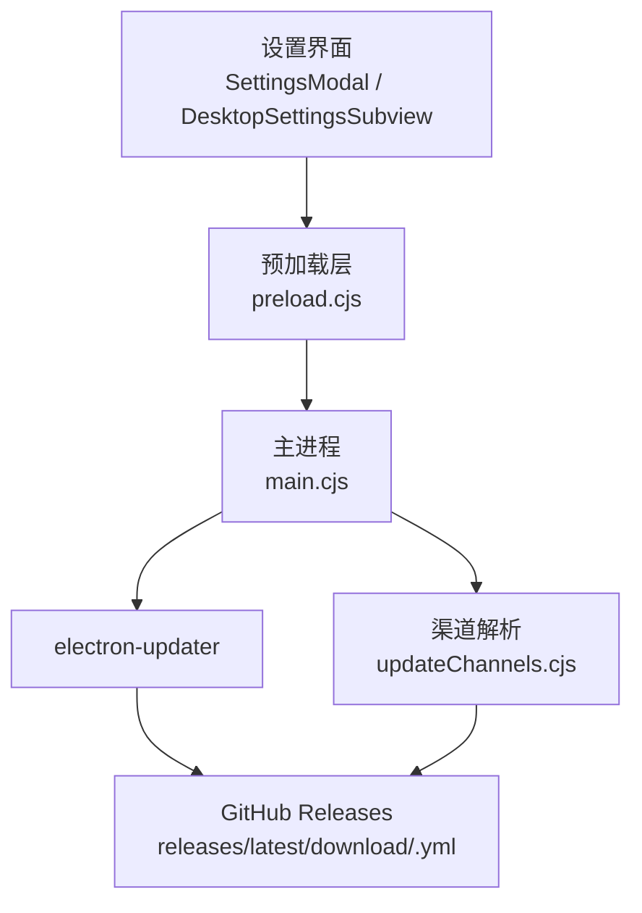
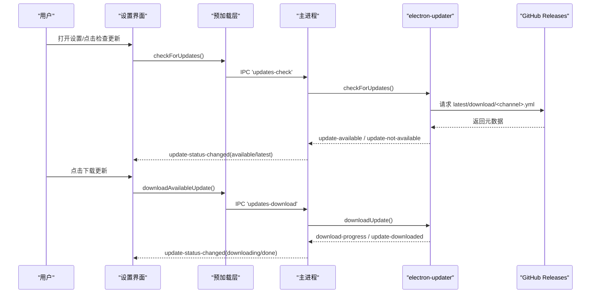
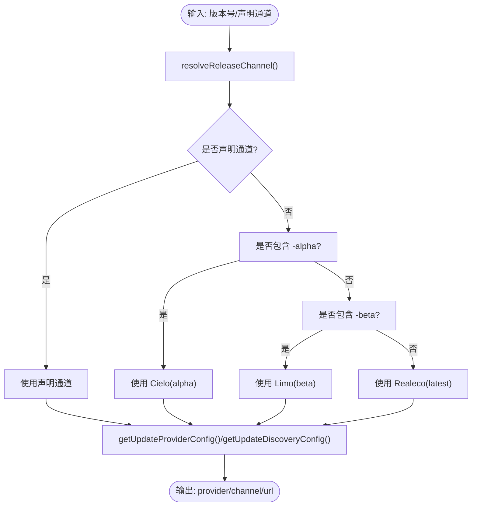
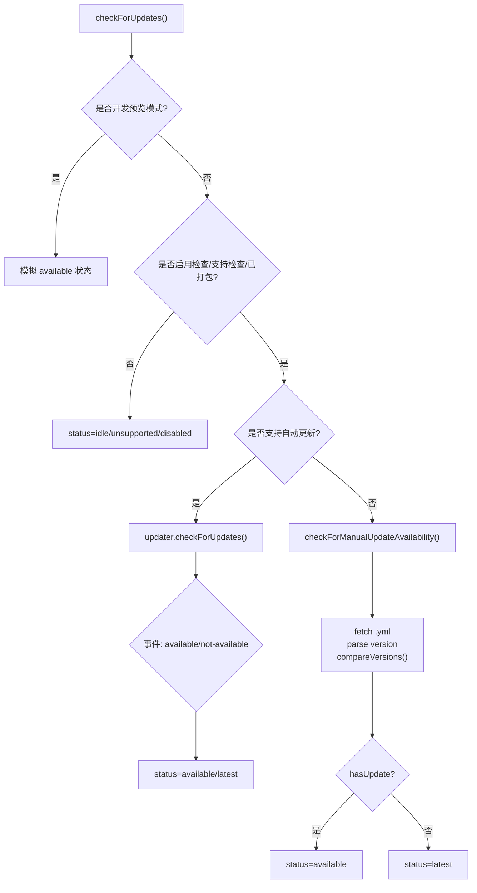
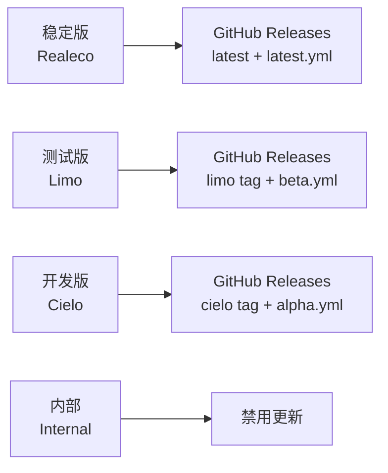
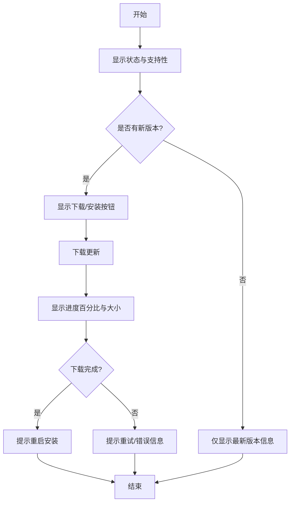
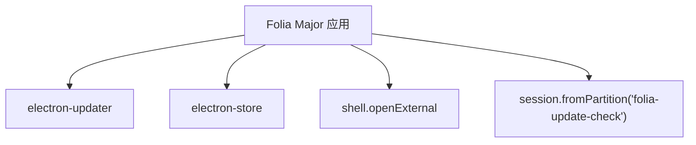

# 自动更新系统

<cite>
**本文引用的文件**   
- [electron/main.cjs](file://electron/main.cjs)
- [electron/updateChannels.cjs](file://electron/updateChannels.cjs)
- [electron/preload.cjs](file://electron/preload.cjs)
- [src/components/modal/SettingsModal.tsx](file://src/components/modal/SettingsModal.tsx)
- [src/components/modal/settings/DesktopSettingsSubview.tsx](file://src/components/modal/settings/DesktopSettingsSubview.tsx)
- [package.json](file://package.json)
- [.github/workflows/electron-release.yml](file://.github/workflows/electron-release.yml)
- [.github/workflows/canary-pre-release.yml](file://.github/workflows/canary-pre-release.yml)
- [.github/workflows/nightly-pre-release.yml](file://.github/workflows/nightly-pre-release.yml)
- [.github/workflows/release-candidate.yml](file://.github/workflows/release-candidate.yml)
- [test/unit/electron/updateChannels.test.ts](file://test/unit/electron/updateChannels.test.ts)
</cite>

## 目录
1. [简介](#简介)
2. [项目结构](#项目结构)
3. [核心组件](#核心组件)
4. [架构总览](#架构总览)
5. [详细组件分析](#详细组件分析)
6. [依赖关系分析](#依赖关系分析)
7. [性能与可靠性](#性能与可靠性)
8. [故障诊断指南](#故障诊断指南)
9. [结论](#结论)
10. [附录：配置与发布清单](#附录配置与发布清单)

## 简介
本文件为 Folia Major 桌面应用的自动更新系统技术文档，聚焦 electron-updater 的配置与使用、版本检查机制、增量下载、完整性验证、回滚策略、发布渠道管理（稳定版/测试版/开发版）、GitHub Releases 集成、数字证书管理、用户体验设计（进度显示、用户确认、失败重试、网络异常处理）、更新日志展示、强制更新机制与灰度发布策略。文档同时提供完整的更新配置示例与故障诊断方法，帮助开发者与维护者快速定位问题并优化体验。

## 项目结构
自动更新相关代码主要分布在以下位置：
- Electron 主进程：负责初始化 electron-updater、监听事件、状态同步、下载与安装控制、手动检查更新与元数据发现。
- 渠道解析模块：将“用户可见的发布通道”映射到 electron-updater 的 channel 与 provider/discovery 配置。
- 预加载脚本：向渲染进程暴露 IPC 接口，用于触发检查和订阅更新状态。
- 前端设置界面：展示更新状态、进度条、按钮操作（下载、重启安装），以及渠道选择与自动更新开关。
- CI 工作流：按不同渠道构建并发布 GitHub Release 资产与元数据。

**图表来源**
- [electron/main.cjs:3170-3480](file://electron/main.cjs#L3170-L3480)
- [electron/updateChannels.cjs:1-171](file://electron/updateChannels.cjs#L1-L171)
- [electron/preload.cjs:96-105](file://electron/preload.cjs#L96-L105)
- [src/components/modal/SettingsModal.tsx:724-741](file://src/components/modal/SettingsModal.tsx#L724-L741)
- [src/components/modal/settings/DesktopSettingsSubview.tsx:414-455](file://src/components/modal/settings/DesktopSettingsSubview.tsx#L414-L455)

**章节来源**
- [electron/main.cjs:1822-1826](file://electron/main.cjs#L1822-L1826)
- [electron/updateChannels.cjs:1-171](file://electron/updateChannels.cjs#L1-L171)
- [electron/preload.cjs:96-105](file://electron/preload.cjs#L96-L105)
- [src/components/modal/SettingsModal.tsx:724-741](file://src/components/modal/SettingsModal.tsx#L724-L741)
- [src/components/modal/settings/DesktopSettingsSubview.tsx:414-455](file://src/components/modal/settings/DesktopSettingsSubview.tsx#L414-L455)

## 核心组件
- 主进程更新管理器：懒加载 electron-updater，设置 feed URL、channel、allowPrerelease；监听 checking-for-update、update-available、update-not-available、download-progress、update-downloaded、error 等事件；封装 checkForUpdates、downloadAvailableUpdate、markUpdateSeen、openUpdateReleasePage 等方法；通过 IPC 向渲染进程广播 update-status-changed。
- 渠道解析器：定义 realeco/limo/cielo/internal 四个通道；根据版本号或声明通道解析 updaterChannel、allowPrerelease、rollingReleaseTag；生成 GitHub 或 generic provider 配置与 discovery YAML 地址；提供 compareVersions 与 parseUpdateMetadataVersion 工具。
- 预加载桥接：暴露 window.electron.checkForUpdates 与 update-status-changed 订阅回调。
- 前端设置面板：展示支持性、错误原因、可用版本、下载进度百分比与 MB 数、下载/安装按钮；允许切换更新通道与开启自动更新。

**章节来源**
- [electron/main.cjs:3170-3480](file://electron/main.cjs#L3170-L3480)
- [electron/updateChannels.cjs:1-171](file://electron/updateChannels.cjs#L1-L171)
- [electron/preload.cjs:96-105](file://electron/preload.cjs#L96-L105)
- [src/components/modal/SettingsModal.tsx:724-741](file://src/components/modal/SettingsModal.tsx#L724-L741)
- [src/components/modal/settings/DesktopSettingsSubview.tsx:340-391](file://src/components/modal/settings/DesktopSettingsSubview.tsx#L340-L391)
- [src/components/modal/settings/DesktopSettingsSubview.tsx:414-455](file://src/components/modal/settings/DesktopSettingsSubview.tsx#L414-L455)

## 架构总览
下图展示了从用户交互到更新下载的完整流程，包括自动与手动两种路径。

**图表来源**
- [electron/main.cjs:3314-3480](file://electron/main.cjs#L3314-L3480)
- [electron/preload.cjs:96-105](file://electron/preload.cjs#L96-L105)
- [src/components/modal/SettingsModal.tsx:724-741](file://src/components/modal/SettingsModal.tsx#L724-L741)
- [src/components/modal/settings/DesktopSettingsSubview.tsx:414-455](file://src/components/modal/settings/DesktopSettingsSubview.tsx#L414-L455)

## 详细组件分析

### 渠道管理与分发策略
- 通道定义：
  - Realeco（稳定版）：updaterChannel=latest，不允许预发行，启用更新。
  - Limo（测试版）：updaterChannel=beta，允许预发行，启用更新，滚动标签 limo。
  - Cielo（开发版）：updaterChannel=alpha，允许预发行，启用更新，滚动标签 cielo。
  - Internal（内部）：禁用更新。
- 通道解析：优先读取声明通道；否则根据版本号中的 -alpha/-beta 推断；默认 stable。
- Provider 与 Discovery：
  - 稳定版：provider=github，channel=latest，discovery 指向 releases/latest/download/latest.yml。
  - 滚动通道：provider=generic，url 指向 releases/download/<tag>/，discovery 指向 releases/download/<tag>/<channel>.yml。
- 比较与解析：compareVersions 支持语义化版本与带 pre-release 的版本；parseUpdateMetadataVersion 从 YAML 文本中抽取 version 字段。

**图表来源**
- [electron/updateChannels.cjs:43-108](file://electron/updateChannels.cjs#L43-L108)

**章节来源**
- [electron/updateChannels.cjs:4-108](file://electron/updateChannels.cjs#L4-L108)
- [test/unit/electron/updateChannels.test.ts:69-96](file://test/unit/electron/updateChannels.test.ts#L69-L96)

### 版本检查与增量下载
- 懒加载与初始化：ensureAutoUpdater 延迟加载 electron-updater，避免阻塞主窗口；setupAutoUpdater 设置 autoDownload=false，并根据当前通道配置 channel 与 allowPrerelease。
- 事件驱动状态机：
  - checking-for-update → status=checking
  - update-available → status=available，记录 availableVersion 与 release URL
  - update-not-available → status=latest
  - download-progress → status=downloading，percent/transferred/total
  - update-downloaded → status=downloaded
  - error → status=error，携带错误信息
- 手动检查：checkForUpdates 在 packaged 且支持的情况下调用 updater.checkForUpdates；若不支持自动更新，则 fallback 到 checkForManualUpdateAvailability，直接拉取 discovery YAML 并与本地版本比较。
- 下载更新：downloadAvailableUpdate 先确保有 availableVersion，再调用 updater.downloadUpdate()；失败时设置 error 状态。

**图表来源**
- [electron/main.cjs:3314-3480](file://electron/main.cjs#L3314-L3480)
- [electron/updateChannels.cjs:114-161](file://electron/updateChannels.cjs#L114-L161)

**章节来源**
- [electron/main.cjs:3170-3480](file://electron/main.cjs#L3170-L3480)
- [electron/updateChannels.cjs:114-161](file://electron/updateChannels.cjs#L114-L161)

### 完整性验证与回滚策略
- 应用包签名与校验：electron-updater 在支持的平台上会进行安装包签名校验；若校验失败，不会安装并抛出错误。
- 扩展内容签名：Folia Major 对 Mod 系统采用独立的签名与摘要校验（modSignature.cjs），与更新包无关，但体现项目的完整性保障思路。
- 回滚策略：
  - 未实现自动回滚：当前实现未包含自动回滚逻辑；建议在检测到安装失败后提示用户回退到旧版本或重新下载。
  - 建议实践：保留上一版本可执行文件或快照，结合外部部署方案（如双目录切换）实现一键回滚。

**章节来源**
- [electron/main.cjs:3251-3257](file://electron/main.cjs#L3251-L3257)
- [electron/modSystem/modSignature.cjs:117-228](file://electron/modSystem/modSignature.cjs#L117-L228)

### 发布渠道与 GitHub Releases 集成
- 稳定版（Realeco）：
  - provider=github，channel=latest
  - discovery: releases/latest/download/latest.yml
- 测试版（Limo）：
  - provider=generic，url=releases/download/limo/
  - discovery: releases/download/limo/beta.yml
- 开发版（Cielo）：
  - provider=generic，url=releases/download/cielo/
  - discovery: releases/download/cielo/alpha.yml
- CI 工作流：
  - electron-release.yml：构建稳定版，设置 APP_RELEASE_CHANNEL=realeco
  - nightly-pre-release.yml：构建测试版，设置 APP_RELEASE_CHANNEL=limo
  - canary-pre-release.yml：构建开发版，设置 APP_RELEASE_CHANNEL=cielo
  - release-candidate.yml：构建内部候选，设置 APP_RELEASE_CHANNEL=internal

**图表来源**
- [electron/updateChannels.cjs:4-108](file://electron/updateChannels.cjs#L4-L108)
- [.github/workflows/electron-release.yml:198](file://.github/workflows/electron-release.yml#L198)
- [.github/workflows/nightly-pre-release.yml:105](file://.github/workflows/nightly-pre-release.yml#L105)
- [.github/workflows/canary-pre-release.yml:141](file://.github/workflows/canary-pre-release.yml#L141)
- [.github/workflows/release-candidate.yml:192](file://.github/workflows/release-candidate.yml#L192)

**章节来源**
- [electron/updateChannels.cjs:4-108](file://electron/updateChannels.cjs#L4-L108)
- [.github/workflows/electron-release.yml:198](file://.github/workflows/electron-release.yml#L198)
- [.github/workflows/nightly-pre-release.yml:105](file://.github/workflows/nightly-pre-release.yml#L105)
- [.github/workflows/canary-pre-release.yml:141](file://.github/workflows/canary-pre-release.yml#L141)
- [.github/workflows/release-candidate.yml:192](file://.github/workflows/release-candidate.yml#L192)

### 数字证书管理与签名
- 应用包签名：由 electron-builder 与平台原生签名机制完成；electron-updater 在运行时进行校验。
- Mod 签名：独立于应用更新，使用 ed25519 密钥对与固定消息格式，校验 modId、modVersion、digest、keyId、signedAt 与 signature；支持信任密钥列表与吊销列表。
- 建议：
  - 使用受控的 CI 环境签名，避免泄露私钥。
  - 定期轮换密钥并在 trustedKeys 中维护 keyId 与 label。
  - 对更新包与 Mod 分别管理签名与吊销策略。

**章节来源**
- [electron/modSystem/modSignature.cjs:117-228](file://electron/modSystem/modSignature.cjs#L117-L228)

### 用户体验设计
- 状态展示：
  - 支持性：autoUpdateSupported/autoUpdateSupportReason、updateCheckSupported/updateCheckSupportReason
  - 状态：idle/checking/available/latest/downloading/done/error/unsupported/disabled
  - 进度：percent、transferred、total（MB）
- 用户操作：
  - 检查更新：点击“检查更新”，触发 IPC 调用 checkForUpdates
  - 下载更新：点击“下载更新”，触发 downloadAvailableUpdate
  - 安装更新：下载完成后显示“重启以安装更新”
- 网络异常处理：
  - 检查失败：status=error，携带错误信息
  - 下载失败：status=error，提示重试
  - 代理与网络：提示保持系统代理开启以保证访问 GitHub
- 更新日志与发布页：
  - 提供 release URL，引导用户查看 GitHub Releases 页面与更新说明

**图表来源**
- [src/components/modal/settings/DesktopSettingsSubview.tsx:414-455](file://src/components/modal/settings/DesktopSettingsSubview.tsx#L414-L455)
- [src/components/modal/SettingsModal.tsx:1501-1515](file://src/components/modal/SettingsModal.tsx#L1501-L1515)

**章节来源**
- [src/components/modal/settings/DesktopSettingsSubview.tsx:340-391](file://src/components/modal/settings/DesktopSettingsSubview.tsx#L340-L391)
- [src/components/modal/settings/DesktopSettingsSubview.tsx:414-455](file://src/components/modal/settings/DesktopSettingsSubview.tsx#L414-L455)
- [src/components/modal/SettingsModal.tsx:1501-1515](file://src/components/modal/SettingsModal.tsx#L1501-L1515)

### 强制更新与灰度发布
- 强制更新：当前实现未内置强制更新逻辑；可通过后端元数据或客户端配置注入“必须升级”标志，并在 UI 中隐藏跳过选项、强制跳转至下载页。
- 灰度发布：
  - 基于通道：通过 realeco/limo/cielo 三通道逐步放量。
  - 基于版本：在 discovery YAML 中仅对特定版本范围推送更新，或使用服务端侧的灰度规则（需额外实现）。
  - 建议：结合用户分组（如内部用户→cielo，小比例用户→limo，全量用户→realeco）与 A/B 指标收集。

[本节为概念性说明，不直接分析具体文件]

## 依赖关系分析
- 运行时依赖：electron-updater ^6.8.9
- 主进程依赖：electron-store（持久化设置）、electron shell/session（打开外部链接、独立会话检查更新）
- 前端依赖：React/Tailwind（设置界面）

**图表来源**
- [package.json:209](file://package.json#L209)
- [electron/main.cjs:3375-3391](file://electron/main.cjs#L3375-L3391)
- [electron/main.cjs:3438-3445](file://electron/main.cjs#L3438-L3445)

**章节来源**
- [package.json:200-216](file://package.json#L200-L216)
- [electron/main.cjs:3375-3391](file://electron/main.cjs#L3375-L3391)
- [electron/main.cjs:3438-3445](file://electron/main.cjs#L3438-L3445)

## 性能与可靠性
- 懒加载：避免 electron-updater 初始化失败阻塞主窗口启动。
- 独立会话：使用 session.fromPartition('folia-update-check') 与系统代理，避免影响播放与其他网络请求。
- 超时保护：手动检查更新时设置 15 秒超时，防止长时间阻塞。
- 事件驱动：通过事件驱动更新状态，减少轮询开销。
- 建议：
  - 在网络不稳定环境下提示用户开启系统代理。
  - 对大体积更新包启用分块下载（electron-updater 默认行为）。
  - 监控下载失败率与重试次数，必要时降级为手动更新。

[本节为通用指导，不直接分析具体文件]

## 故障诊断指南
- 常见问题与排查步骤：
  - 无法检查更新：
    - 检查 isUpdateCheckSupported 与 isPackagedUpdateRuntime 条件。
    - 确认 discovery YAML 可达且包含 version 字段。
    - 查看 error 状态与 lastCheckedAt。
  - 下载失败：
    - 检查 network 权限与代理设置。
    - 查看 downloadProgress 与 error 信息。
  - 安装失败：
    - 检查平台签名支持与权限。
    - 查看 error 信息并提示重试或回滚。
  - 通道不正确：
    - 核对 getCurrentReleaseChannel 与 getUpdateProviderConfig/getUpdateDiscoveryConfig 的输出。
    - 确认 CI 工作流设置的 APP_RELEASE_CHANNEL。
- 日志与调试：
  - 主进程 console.error('[Updater] ...')
  - 前端设置界面显示 autoUpdateSupportReason/updateCheckSupportReason
  - 使用浏览器控制台观察 update-status-changed 事件

**章节来源**
- [electron/main.cjs:3170-3480](file://electron/main.cjs#L3170-L3480)
- [src/components/modal/settings/DesktopSettingsSubview.tsx:366-382](file://src/components/modal/settings/DesktopSettingsSubview.tsx#L366-L382)

## 结论
Folia Major 的自动更新系统以 electron-updater 为核心，结合自定义渠道解析与 discovery YAML，实现了稳定版、测试版与开发版的差异化分发。主进程通过事件驱动的状态机管理检查与下载流程，前端设置界面提供清晰的进度与操作入口。系统在完整性与安全性方面具备基础能力，并可进一步扩展强制更新与灰度发布策略。建议在生产环境中完善回滚机制与监控告警，以提升更新成功率与用户体验。

[本节为总结性内容，不直接分析具体文件]

## 附录：配置与发布清单
- 关键常量与配置：
  - FOLIA_RELEASES_URL：GitHub Releases 根地址
  - FOLIA_GITHUB_REPOSITORY：owner/repo
  - RELEASE_CHANNELS：realeco/limo/cielo/internal 通道定义
  - provider/discovery：按通道动态生成
- 前端设置项：
  - UPDATE_CHANNEL：realeco/limo/cielo/internal
  - ENABLE_AUTO_UPDATE：是否启用自动更新
- CI 工作流变量：
  - APP_RELEASE_CHANNEL：realeco/limo/cielo/internal

**章节来源**
- [electron/main.cjs:1822-1826](file://electron/main.cjs#L1822-L1826)
- [electron/updateChannels.cjs:4-37](file://electron/updateChannels.cjs#L4-L37)
- [src/components/modal/SettingsModal.tsx:130-134](file://src/components/modal/SettingsModal.tsx#L130-L134)
- [.github/workflows/electron-release.yml:198](file://.github/workflows/electron-release.yml#L198)
- [.github/workflows/nightly-pre-release.yml:105](file://.github/workflows/nightly-pre-release.yml#L105)
- [.github/workflows/canary-pre-release.yml:141](file://.github/workflows/canary-pre-release.yml#L141)
- [.github/workflows/release-candidate.yml:192](file://.github/workflows/release-candidate.yml#L192)