# 桌面应用集成

<cite>
**本文引用的文件**   
- [electron/main.cjs](file://electron/main.cjs)
- [electron/preload.cjs](file://electron/preload.cjs)
- [package.json](file://package.json)
- [electron/discordPresence.cjs](file://electron/discordPresence.cjs)
- [electron/updateChannels.cjs](file://electron/updateChannels.cjs)
- [src/hooks/useObsBrowserSourcePublisher.ts](file://src/hooks/useObsBrowserSourcePublisher.ts)
- [src/services/nowPlayingProvider.ts](file://src/services/nowPlayingProvider.ts)
- [src/hooks/useNowPlayingSource.ts](file://src/hooks/useNowPlayingSource.ts)
- [test/unit/electron/linuxDesktopIntegration.test.ts](file://test/unit/electron/linuxDesktopIntegration.test.ts)
</cite>

## 目录
1. [简介](#简介)
2. [项目结构](#项目结构)
3. [核心组件](#核心组件)
4. [架构总览](#架构总览)
5. [详细组件分析](#详细组件分析)
6. [依赖关系分析](#依赖关系分析)
7. [性能与优化](#性能与优化)
8. [故障排查指南](#故障排查指南)
9. [结论](#结论)
10. [附录：IPC 通道与协议参考](#附录ipc-通道与协议参考)

## 简介
本文面向 Folia Major 的桌面端集成，重点解释 Electron 主进程与渲染进程的通信机制、IPC 通道设计、原生能力集成（文件系统、窗口管理、系统托盘、快捷键）、跨平台适配策略（Windows、macOS、Linux），以及与外部应用的集成（Discord Rich Presence、OBS Studio 浏览器源、Now Playing）。同时梳理打包分发流程、自动更新机制和性能优化实践。

## 项目结构
Folia Major 的桌面端以 `electron/main.cjs` 作为 Electron 主入口，通过 `electron/preload.cjs` 向渲染进程暴露受控 API；业务逻辑位于 `src/`，构建与打包配置集中在 `package.json` 的 `build` 字段中，并通过 `electron-builder` 输出多平台产物。

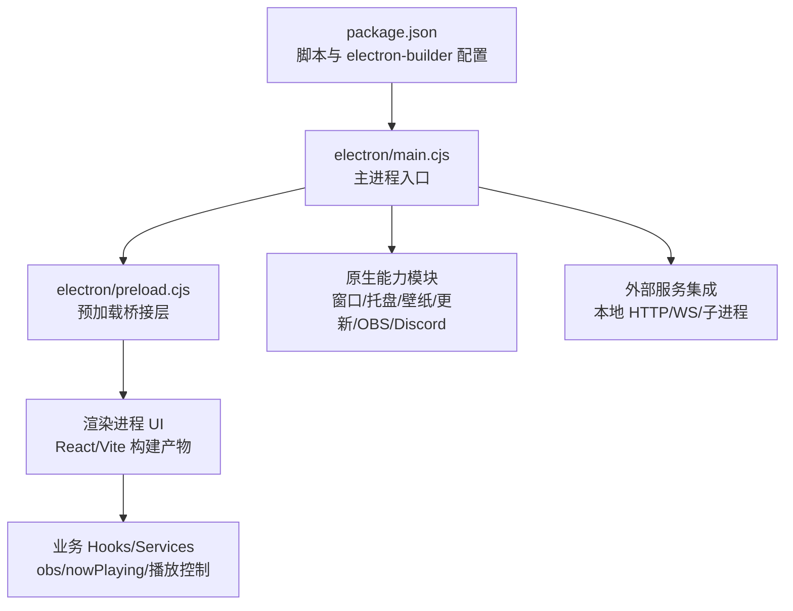

**图表来源**
- [package.json:18-60](file://package.json#L18-L60)
- [package.json:62-200](file://package.json#L62-L200)
- [electron/main.cjs:1-40](file://electron/main.cjs#L1-L40)
- [electron/preload.cjs:1-20](file://electron/preload.cjs#L1-L20)

**章节来源**
- [package.json:1-282](file://package.json#L1-L282)
- [electron/main.cjs:1-40](file://electron/main.cjs#L1-L40)
- [electron/preload.cjs:1-20](file://electron/preload.cjs#L1-L20)

## 核心组件
- 主进程入口与生命周期管理：负责注册自定义协议、初始化存储、启动子系统、监听窗口事件、处理 IPC。
- 预加载桥接层：将主进程能力安全地暴露给渲染进程，屏蔽 Electron 内部对象，提供统一的 RPC 风格 API。
- 原生能力子系统：窗口管理、透明背景、点击穿透、任务栏按钮、系统托盘、显示休眠阻止、壁纸模式等。
- 外部集成：Discord Rich Presence、OBS 浏览器源、Now Playing 数据源、歌词 API、转码服务等。
- 更新与分发：基于 `electron-updater` 的自动更新、渠道选择、手动检查与下载、发布到 GitHub Releases。

**章节来源**
- [electron/main.cjs:1-40](file://electron/main.cjs#L1-L40)
- [electron/preload.cjs:1-311](file://electron/preload.cjs#L1-L311)
- [package.json:62-200](file://package.json#L62-L200)

## 架构总览
Electron 采用“主进程 + 渲染进程”的双进程模型。主进程持有系统级能力，渲染进程运行 Web 界面。两者通过 `contextBridge` 暴露的受限 API 进行 IPC 调用，避免直接暴露 Node/Electron 内部对象。

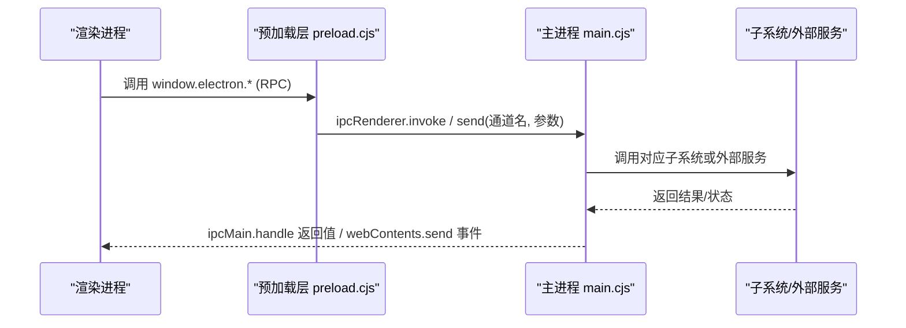

**图表来源**
- [electron/preload.cjs:1-311](file://electron/preload.cjs#L1-L311)
- [electron/main.cjs:6071-6174](file://electron/main.cjs#L6071-L6174)

## 详细组件分析

### 主进程与渲染进程通信机制
- 预加载层使用 `contextBridge.exposeInMainWorld('electron', ...)` 暴露方法，所有方法内部通过 `ipcRenderer.invoke` 或 `ipcRenderer.send` 与主进程通信。
- 主进程在 `main.cjs` 中通过 `ipcMain.handle` 实现请求处理，并通过 `webContents.send` 推送事件。
- 典型通道包括窗口控制、设置读写、缓存访问、OBS 浏览器源、Discord 状态、更新状态、视频导出、Stage 会话等。

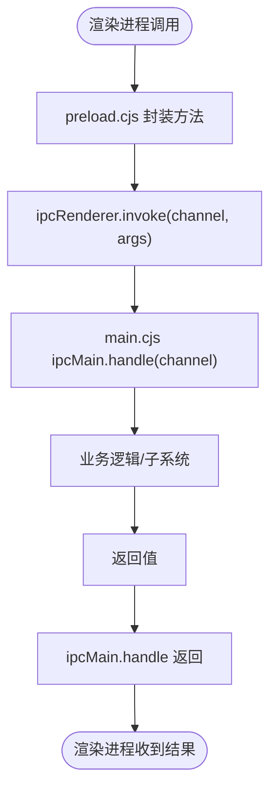

**图表来源**
- [electron/preload.cjs:1-311](file://electron/preload.cjs#L1-L311)
- [electron/main.cjs:6071-6174](file://electron/main.cjs#L6071-L6174)

**章节来源**
- [electron/preload.cjs:1-311](file://electron/preload.cjs#L1-L311)
- [electron/main.cjs:6071-6174](file://electron/main.cjs#L6071-L6174)

### 原生功能集成

#### 窗口管理与透明背景
- 支持最小化、最大化、全屏切换、关闭、查询状态。
- 透明背景模式与壁纸模式联动，Windows 下需重建窗口以保证边框与 DPI 正确。
- 点击穿透与悬停解锁用于壁纸模式下的交互控制。

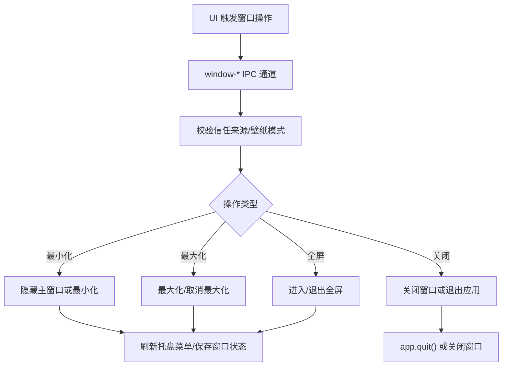

**图表来源**
- [electron/main.cjs:6071-6174](file://electron/main.cjs#L6071-L6174)

**章节来源**
- [electron/main.cjs:6071-6174](file://electron/main.cjs#L6071-L6174)

#### 系统托盘与任务栏按钮
- 托盘菜单根据当前状态动态刷新。
- Windows 任务栏缩略图按钮（Thumbar）用于快捷控制播放。

**章节来源**
- [electron/main.cjs:6071-6174](file://electron/main.cjs#L6071-L6174)

#### 快捷键绑定
- 命令调色板与快捷键执行逻辑位于前端，但部分全局行为（如睡眠计时器退出应用）由主进程统一处理。

**章节来源**
- [electron/main.cjs:6127-6135](file://electron/main.cjs#L6127-L6135)

### 跨平台适配策略

#### Linux
- 针对 Wayland/Vulkan 兼容性添加命令行开关，必要时禁用硬件加速或使用 SwiftShader。
- 密码存储后端根据桌面环境选择。
- 桌面入口元数据与可执行名同步，确保 WM_CLASS 匹配。

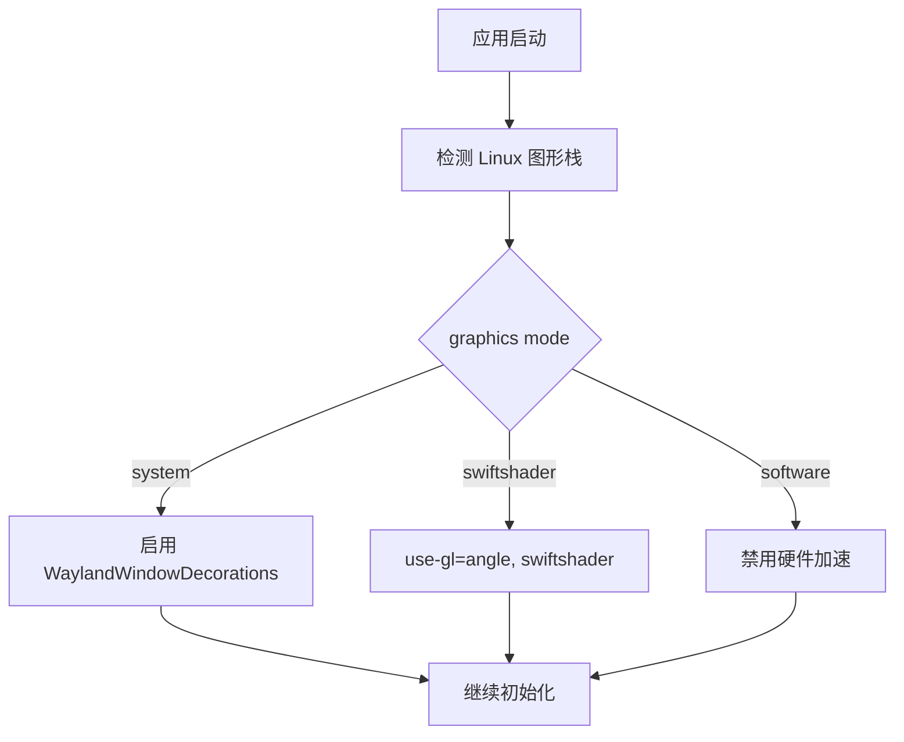

**图表来源**
- [electron/main.cjs:114-141](file://electron/main.cjs#L114-L141)

**章节来源**
- [electron/main.cjs:114-141](file://electron/main.cjs#L114-L141)
- [test/unit/electron/linuxDesktopIntegration.test.ts:1-25](file://test/unit/electron/linuxDesktopIntegration.test.ts#L1-L25)

#### macOS
- GPU 加速优化，解决 Intel Mac + AMD 独显在 Retina 屏幕下的渲染卡顿。
- 壁纸模式通过原生 NSWindow level 下沉至 Finder 图标之下，并注入鼠标事件转发。

**章节来源**
- [electron/main.cjs:168-173](file://electron/main.cjs#L168-L173)
- [electron/main.cjs:599-800](file://electron/main.cjs#L599-L800)

#### Windows
- 壁纸模式通过 WorkerW 重父子关系，配合辅助程序完成桌面层级嵌入。
- 鼠标输入通过 Chromium 输入管线注入，避免系统消息导致的悬停撕裂。

**章节来源**
- [electron/main.cjs:289-439](file://electron/main.cjs#L289-L439)

### 与外部应用集成

#### Discord Rich Presence
- 主进程维护 Discord 客户端连接，周期性从播放快照构建活动信息，限制更新频率以避免频繁 IPC。
- 渲染进程通过 IPC 获取状态并发布快照。

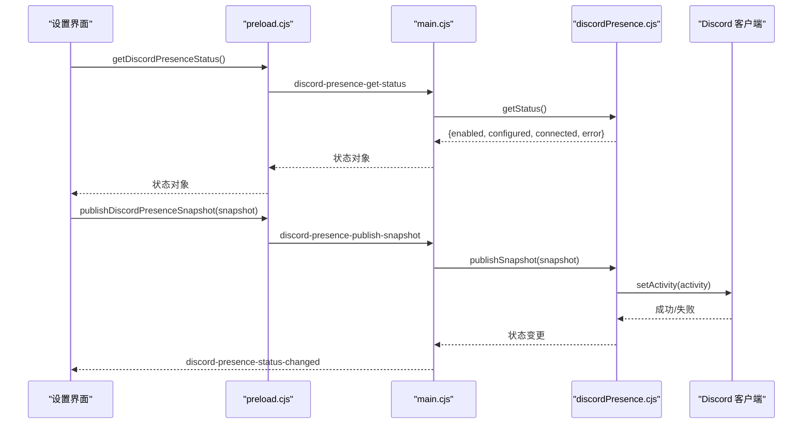

**图表来源**
- [electron/discordPresence.cjs:1-284](file://electron/discordPresence.cjs#L1-L284)
- [electron/preload.cjs:191-209](file://electron/preload.cjs#L191-L209)

**章节来源**
- [electron/discordPresence.cjs:1-284](file://electron/discordPresence.cjs#L1-L284)
- [electron/preload.cjs:191-209](file://electron/preload.cjs#L191-L209)

#### OBS Studio 浏览器源
- 主进程启动本地 HTTP 服务器，仅在 `127.0.0.1` 监听，生成随机 token 并暴露 URL。
- 渲染进程通过 Hook 订阅状态变化，并在需要时解析封面资源为 blob URL 供浏览器源使用。

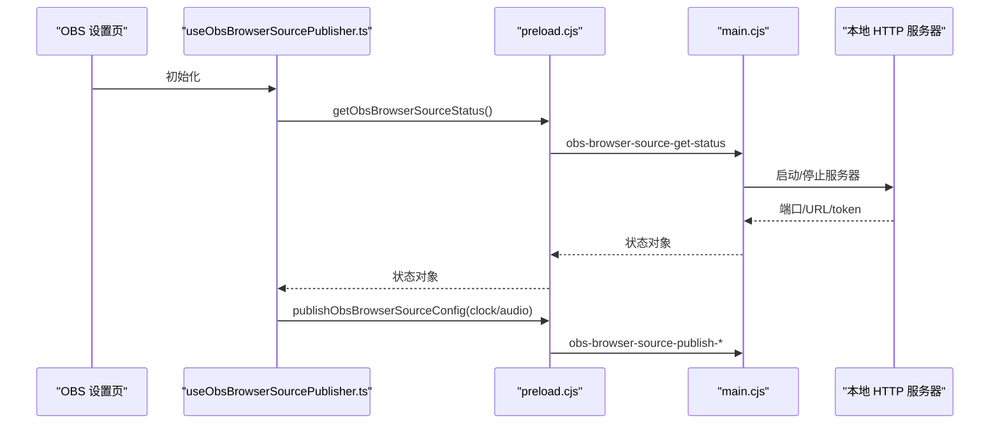

**图表来源**
- [src/hooks/useObsBrowserSourcePublisher.ts:181-221](file://src/hooks/useObsBrowserSourcePublisher.ts#L181-L221)
- [electron/main.cjs:1945-1989](file://electron/main.cjs#L1945-L1989)
- [electron/main.cjs:4428-4469](file://electron/main.cjs#L4428-L4469)

**章节来源**
- [src/hooks/useObsBrowserSourcePublisher.ts:181-221](file://src/hooks/useObsBrowserSourcePublisher.ts#L181-L221)
- [electron/main.cjs:1945-1989](file://electron/main.cjs#L1945-L1989)
- [electron/main.cjs:4428-4469](file://electron/main.cjs#L4428-L4469)

#### Now Playing 服务
- 通过 WebSocket 连接外部 Now Playing 服务，接收曲目、歌词、进度等数据，转换为应用内快照。
- 渲染进程 Hook 将外部数据映射为标题、艺术家、封面、歌词等 UI 所需状态。

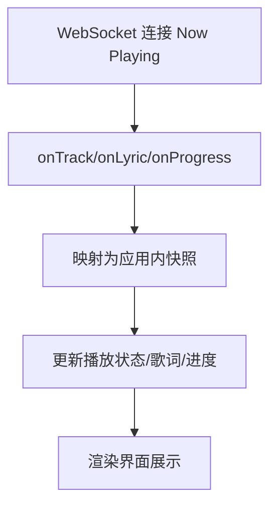

**图表来源**
- [src/services/nowPlayingProvider.ts:253-298](file://src/services/nowPlayingProvider.ts#L253-L298)
- [src/hooks/useNowPlayingSource.ts:38-68](file://src/hooks/useNowPlayingSource.ts#L38-L68)

**章节来源**
- [src/services/nowPlayingProvider.ts:253-298](file://src/services/nowPlayingProvider.ts#L253-L298)
- [src/hooks/useNowPlayingSource.ts:38-68](file://src/hooks/useNowPlayingSource.ts#L38-L68)

### 打包与分发流程
- 使用 `electron-builder` 配置多平台目标：macOS dmg/zip、Windows nsis、Linux tar.gz/deb/rpm。
- 额外资源包含 ffmpeg、图标、托盘模板、Linux 桌面条目、windowtolayer 二进制等。
- 自动更新通过 `electron-updater`，GitHub 作为发布提供方，支持稳定版与滚动预览版。

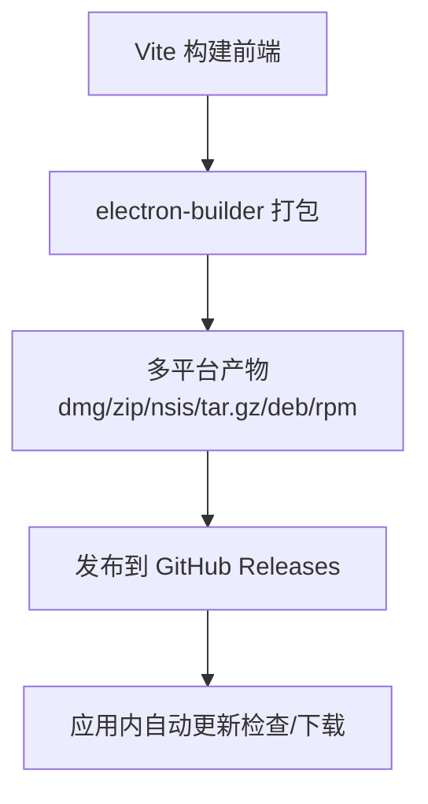

**图表来源**
- [package.json:52-56](file://package.json#L52-L56)
- [package.json:62-200](file://package.json#L62-L200)

**章节来源**
- [package.json:52-56](file://package.json#L52-L56)
- [package.json:62-200](file://package.json#L62-L200)

### 自动更新机制
- 主进程懒加载 `electron-updater`，避免启动阻塞。
- 根据发布渠道（realeco/limo/cielo/internal）决定 updater channel、是否允许预发行版本、是否启用更新。
- 支持开发预览模式模拟更新流程，生产环境仅 Windows 支持自动更新。

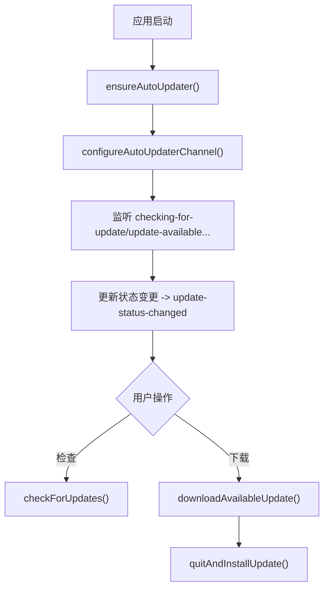

**图表来源**
- [electron/main.cjs:3104-3184](file://electron/main.cjs#L3104-L3184)
- [electron/main.cjs:3186-3269](file://electron/main.cjs#L3186-L3269)
- [electron/updateChannels.cjs:1-172](file://electron/updateChannels.cjs#L1-L172)

**章节来源**
- [electron/main.cjs:3104-3184](file://electron/main.cjs#L3104-L3184)
- [electron/main.cjs:3186-3269](file://electron/main.cjs#L3186-L3269)
- [electron/updateChannels.cjs:1-172](file://electron/updateChannels.cjs#L1-L172)

## 依赖关系分析
- 主进程依赖多个子系统模块：Discord、OBS、Now Playing、转码、分析、调试、壁纸控制器等。
- 预加载层作为唯一对外暴露面，集中管理 IPC 通道命名与回调订阅。
- 构建脚本与 electron-builder 配置强耦合于 `package.json`，影响最终产物结构与资源打包。

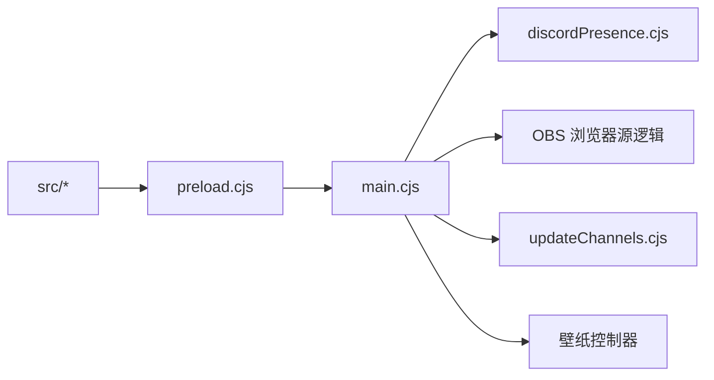

**图表来源**
- [electron/main.cjs:1-40](file://electron/main.cjs#L1-L40)
- [electron/preload.cjs:1-311](file://electron/preload.cjs#L1-L311)
- [electron/discordPresence.cjs:1-284](file://electron/discordPresence.cjs#L1-L284)
- [electron/updateChannels.cjs:1-172](file://electron/updateChannels.cjs#L1-L172)

**章节来源**
- [electron/main.cjs:1-40](file://electron/main.cjs#L1-L40)
- [electron/preload.cjs:1-311](file://electron/preload.cjs#L1-L311)

## 性能与优化
- 内存监控：预加载层暴露渲染进程内存指标上报接口，主进程侧有内存监控与日志写入模块。
- IPC 优化：批量日志写入、状态变更事件合并、Discord 活动更新节流。
- 资源加载：音频与封面缓存通过 IPC 在主进程侧管理，避免重复 IO。
- 图形栈优化：Linux 下根据环境选择软件渲染或 SwiftShader，macOS 下启用 GPU 光栅化。

**章节来源**
- [electron/preload.cjs:24-53](file://electron/preload.cjs#L24-L53)
- [electron/main.cjs:114-173](file://electron/main.cjs#L114-L173)

## 故障排查指南
- 证书错误：对特定 Kugou CDN 主机名放宽证书校验，其他请求仍严格校验。
- 更新失败：检查渠道配置、网络代理、是否处于开发模式；查看更新状态事件中的错误信息。
- OBS 浏览器源不可用：确认本地端口未被占用、token 已生成、防火墙未拦截 127.0.0.1。
- Discord 状态不更新：检查应用 ID 是否有效、Discord 客户端是否运行、网络是否可达。

**章节来源**
- [electron/main.cjs:92-112](file://electron/main.cjs#L92-L112)
- [electron/main.cjs:3135-3163](file://electron/main.cjs#L3135-L3163)
- [electron/main.cjs:1945-1989](file://electron/main.cjs#L1945-L1989)
- [electron/discordPresence.cjs:103-226](file://electron/discordPresence.cjs#L103-L226)

## 结论
Folia Major 的桌面端集成以 Electron 双进程模型为基础，通过预加载层建立安全的 IPC 边界，主进程集中管理原生能力与外部集成。跨平台适配覆盖 Linux/macOS/Windows 的关键差异，打包与自动更新流程清晰可控。性能优化围绕内存、IPC 与图形栈展开，整体架构具备良好的可扩展性与可维护性。

## 附录：IPC 通道与协议参考
- 窗口控制：`window-minimize`、`window-toggle-maximize`、`window-toggle-fullscreen`、`window-close`、`window-is-maximized`、`window-is-fullscreen`、`window-get-transparent-mode`、`window-set-transparent-mode`、`window-playback-handoff-consume`、`window-playback-handoff-submit`、`window-get-click-through`、`window-set-click-through`、`window-set-click-through-unlock-hover`、`window-get-always-on-top`、`window-set-always-on-top`。
- 设置与缓存：`get-settings`、`save-settings`、`get-cache-directory`、`choose-cache-directory`、`reset-cache-directory`、`get-audio-cache*`、`get-cover-cache*`、`has-local-cover-asset`、`save-local-cover-asset`、`remove-local-cover-asset`、`clear-local-cover-assets`。
- 外部集成：`obs-browser-source-*`、`discord-presence-*`、`lyric-api-*`、`remote-control-*`、`stage-*`。
- 更新：`updates-get-status`、`updates-check`、`updates-mark-seen`、`updates-open-release-page`、`updates-download`、`updates-quit-and-install`。
- 模组系统：`folia-mods:*`（list/set-enabled/reload/rpc/storage/net-fetch/pick-file/restore-file/release-file/export-cancel/push-runtime-snapshot/ffmpeg-status/open-directory/install-zip）。

**章节来源**
- [electron/preload.cjs:1-311](file://electron/preload.cjs#L1-L311)