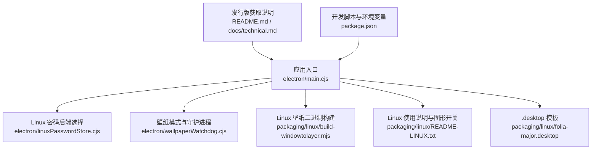
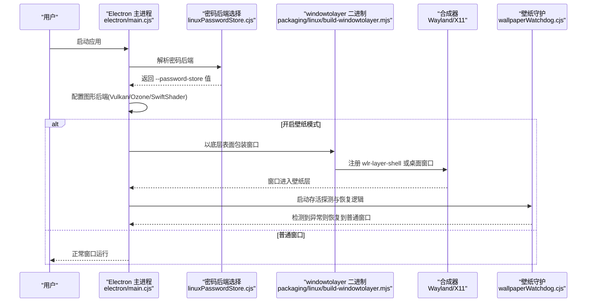
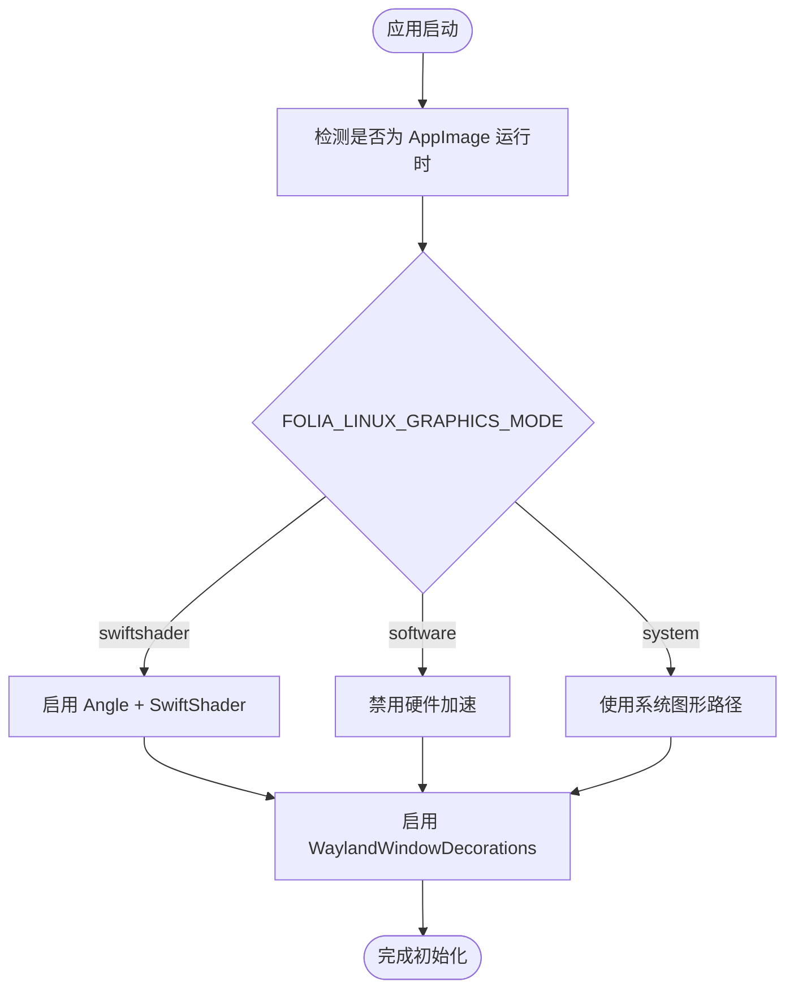
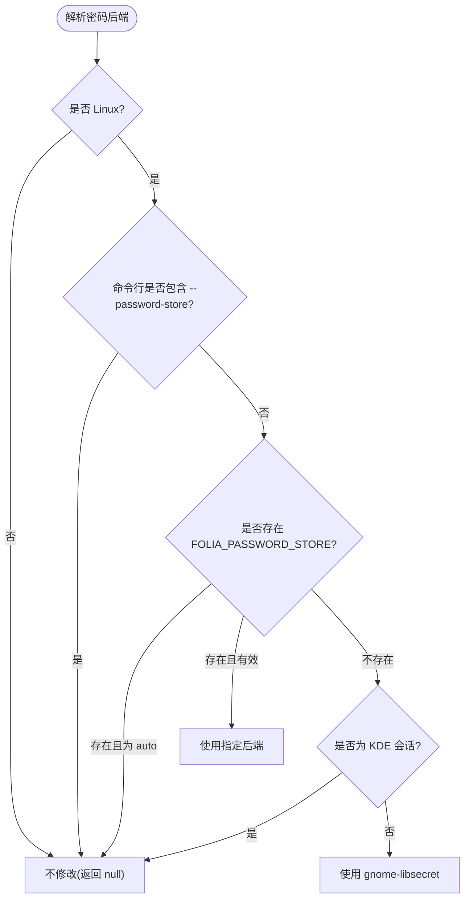
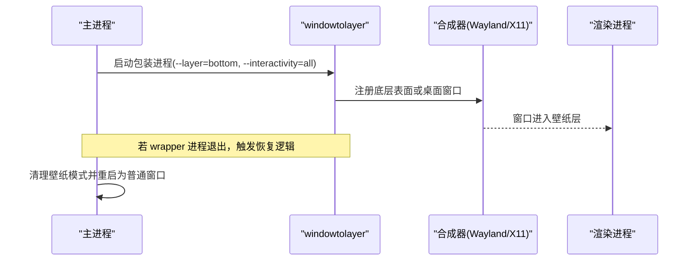
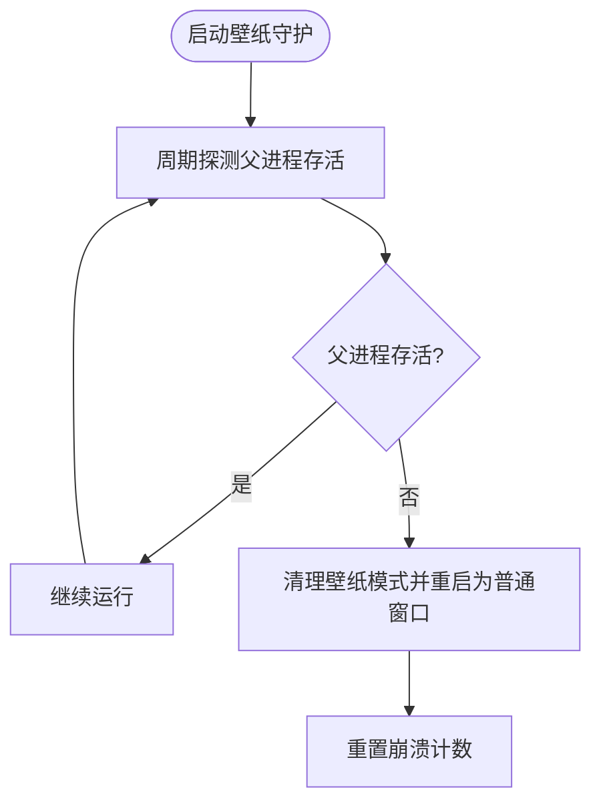
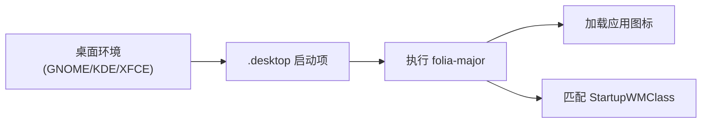

# Linux平台适配

<cite>
**本文引用的文件**   
- [README.md](file://README.md)
- [technical.md](file://docs/technical.md)
- [main.cjs](file://electron/main.cjs)
- [linuxPasswordStore.cjs](file://electron/linuxPasswordStore.cjs)
- [wallpaperWatchdog.cjs](file://electron/wallpaperWatchdog.cjs)
- [macWallpaperController.cjs](file://electron/macWallpaperController.cjs)
- [build-windowtolayer.mjs](file://packaging/linux/build-windowtolayer.mjs)
- [README-LINUX.txt](file://packaging/linux/README-LINUX.txt)
- [folia-major.desktop](file://packaging/linux/folia-major.desktop)
- [package.json](file://package.json)
</cite>

## 目录
1. [简介](#简介)
2. [项目结构](#项目结构)
3. [核心组件](#核心组件)
4. [架构总览](#架构总览)
5. [详细组件分析](#详细组件分析)
6. [依赖与兼容性分析](#依赖与兼容性分析)
7. [性能与图形后端](#性能与图形后端)
8. [部署指南](#部署指南)
9. [故障排查](#故障排查)
10. [结论](#结论)

## 简介
本文件面向 Folia Major 在 Linux 平台的适配与集成，覆盖发行版兼容、显示服务器差异（Wayland/X11）、桌面环境集成、包管理器分发、安全机制、依赖管理与部署排错。Folia 提供 Electron 桌面端，Linux 上通过 Chromium/Electron 的 Ozone/Wayland/X11 路径运行，并针对壁纸模式、密码存储后端、图形渲染后端做了专门处理。

## 项目结构
与 Linux 适配直接相关的代码与资源主要分布在以下位置：
- electron 主进程与平台逻辑：`electron/main.cjs`、`electron/linuxPasswordStore.cjs`、`electron/wallpaperWatchdog.cjs`、`electron/macWallpaperController.cjs`
- Linux 打包与壁纸二进制构建：`packaging/linux/build-windowtolayer.mjs`、`packaging/linux/README-LINUX.txt`、`packaging/linux/folia-major.desktop`
- 文档与获取方式：`README.md`、`docs/technical.md`
- 脚本与环境变量注入：`package.json`

**图示来源**
- [main.cjs:55-141](file://electron/main.cjs#L55-L141)
- [linuxPasswordStore.cjs:1-53](file://electron/linuxPasswordStore.cjs#L1-L53)
- [wallpaperWatchdog.cjs:1-187](file://electron/wallpaperWatchdog.cjs#L1-L187)
- [build-windowtolayer.mjs:1-27](file://packaging/linux/build-windowtolayer.mjs#L1-L27)
- [README-LINUX.txt:1-41](file://packaging/linux/README-LINUX.txt#L1-L41)
- [folia-major.desktop:1-10](file://packaging/linux/folia-major.desktop#L1-L10)
- [README.md:120-153](file://README.md#L120-L153)
- [technical.md:24-36](file://docs/technical.md#L24-L36)
- [package.json:48-51](file://package.json#L48-L51)

**章节来源**
- [README.md:120-153](file://README.md#L120-L153)
- [technical.md:24-36](file://docs/technical.md#L24-L36)

## 核心组件
- Linux 启动参数与图形后端控制：在 Electron 启动阶段根据环境变量和运行时类型设置 Vulkan、Ozone、SwiftShader、软件渲染等开关。
- 密码存储后端选择：在非 KDE 桌面下显式启用 gnome-libsecret，避免未识别桌面回退到明文存储导致登录态丢失。
- Wayland/X11 壁纸模式：通过 windowtolayer 将窗口包装为 wlr-layer-shell 底部层；X11 下使用桌面窗口类型。
- 壁纸守护与恢复：检测 wrapper 进程存活、崩溃计数与自动恢复到普通窗口，防止循环重启。
- 桌面集成：提供 .desktop 模板与应用图标，便于手动创建启动项或打包进发行版包。

**章节来源**
- [main.cjs:55-141](file://electron/main.cjs#L55-L141)
- [linuxPasswordStore.cjs:1-53](file://electron/linuxPasswordStore.cjs#L1-L53)
- [wallpaperWatchdog.cjs:1-187](file://electron/wallpaperWatchdog.cjs#L1-L187)
- [README-LINUX.txt:25-41](file://packaging/linux/README-LINUX.txt#L25-L41)
- [folia-major.desktop:1-10](file://packaging/linux/folia-major.desktop#L1-L10)

## 架构总览
下图展示 Linux 平台关键流程：启动时解析图形与密码后端，随后根据壁纸模式决定是否通过 windowtolayer 包装窗口，并在 Wayland 或 X11 下分别走不同合成器路径。

**图示来源**
- [main.cjs:55-141](file://electron/main.cjs#L55-L141)
- [main.cjs:230-273](file://electron/main.cjs#L230-L273)
- [linuxPasswordStore.cjs:1-53](file://electron/linuxPasswordStore.cjs#L1-L53)
- [build-windowtolayer.mjs:1-27](file://packaging/linux/build-windowtolayer.mjs#L1-L27)
- [wallpaperWatchdog.cjs:1-187](file://electron/wallpaperWatchdog.cjs#L1-L187)

## 详细组件分析

### Linux 启动参数与图形后端
- 默认行为：关闭 Vulkan，启用 Ozone 自动模式，并根据 AppImage 运行时选择 SwiftShader 或系统图形路径。
- 环境变量：
  - `FOLIA_LINUX_GRAPHICS_MODE=swiftshader|software|system` 控制渲染后端。
  - `ELECTRON_LINUX_PACKAGED_GRAPHICS=true` 用于调试非标准 AppImage 运行时。
- 特性开关：启用 WaylandWindowDecorations，提升 Wayland 下的原生装饰体验。

**图示来源**
- [main.cjs:55-141](file://electron/main.cjs#L55-L141)
- [README-LINUX.txt:25-34](file://packaging/linux/README-LINUX.txt#L25-L34)

**章节来源**
- [main.cjs:55-141](file://electron/main.cjs#L55-L141)
- [README-LINUX.txt:25-34](file://packaging/linux/README-LINUX.txt#L25-L34)

### 密码存储后端选择
- 问题背景：Chromium 在未识别桌面环境下会回退到明文 basic_text 存储，导致在线音乐库拒绝保存凭据。
- 解决方案：在非 KDE 桌面下显式指定 gnome-libsecret；KDE 会话保持 Chromium 自身检测以避免钱包迁移问题。
- 支持的后端集合：basic、gnome-libsecret、kwallet、kwallet5、kwallet6。
- 环境变量：`FOLIA_PASSWORD_STORE` 可强制指定后端或 auto。

**图示来源**
- [linuxPasswordStore.cjs:1-53](file://electron/linuxPasswordStore.cjs#L1-L53)

**章节来源**
- [linuxPasswordStore.cjs:1-53](file://electron/linuxPasswordStore.cjs#L1-L53)

### Wayland 与 X11 壁纸模式
- Wayland：通过 windowtolayer 将窗口包装为 wlr-layer-shell 的 bottom 层表面，实现“桌面歌词壁纸”。
- X11：主窗口设置为桌面窗口类型 `_NET_WM_WINDOW_TYPE_DESKTOP`，与 KDE 桌面窗口共享桌面层。
- 二进制来源：构建脚本从上游仓库拉取源码、打补丁并编译出 windowtolayer，随应用资源分发。
- 交互策略：Wayland 下允许点击穿透；X11 下为避免与桌面窗口层级冲突，关闭点击穿透。

**图示来源**
- [main.cjs:230-273](file://electron/main.cjs#L230-L273)
- [wallpaperWatchdog.cjs:1-187](file://electron/wallpaperWatchdog.cjs#L1-L187)
- [build-windowtolayer.mjs:1-27](file://packaging/linux/build-windowtolayer.mjs#L1-L27)
- [README-LINUX.txt:36-41](file://packaging/linux/README-LINUX.txt#L36-L41)

**章节来源**
- [main.cjs:230-273](file://electron/main.cjs#L230-L273)
- [wallpaperWatchdog.cjs:1-187](file://electron/wallpaperWatchdog.cjs#L1-L187)
- [build-windowtolayer.mjs:1-27](file://packaging/linux/build-windowtolayer.mjs#L1-L27)
- [README-LINUX.txt:36-41](file://packaging/linux/README-LINUX.txt#L36-L41)

### 壁纸守护与恢复逻辑
- 目标：当 wrapper 进程意外退出或渲染进程崩溃时，自动恢复到普通窗口，避免持续循环重启。
- 机制：
  - 周期性探测父进程存活（ppid 变化或 kill(pid,0) 失败）。
  - 记录连续崩溃次数，超过阈值后禁用壁纸模式。
  - 正常启动时重置崩溃计数。

**图示来源**
- [wallpaperWatchdog.cjs:27-176](file://electron/wallpaperWatchdog.cjs#L27-L176)

**章节来源**
- [wallpaperWatchdog.cjs:27-176](file://electron/wallpaperWatchdog.cjs#L27-L176)

### 桌面环境与系统集成
- .desktop 模板：提供名称、类别、启动命令与 WMClass，便于发行版打包或用户手动创建启动项。
- 图标与启动项：便携包附带图标与模板，按 README-LINUX.txt 指引复制到 ~/.local/share/applications。
- 远程遥控窗：Hyprland 下可通过窗口规则将“Folia Remote”作为悬浮小窗固定显示。

**图示来源**
- [folia-major.desktop:1-10](file://packaging/linux/folia-major.desktop#L1-L10)
- [README-LINUX.txt:10-23](file://packaging/linux/README-LINUX.txt#L10-L23)
- [technical.md:52-72](file://docs/technical.md#L52-L72)

**章节来源**
- [folia-major.desktop:1-10](file://packaging/linux/folia-major.desktop#L1-L10)
- [README-LINUX.txt:10-23](file://packaging/linux/README-LINUX.txt#L10-L23)
- [technical.md:52-72](file://docs/technical.md#L52-L72)

## 依赖与兼容性分析

### 发行版兼容性
- Arch Linux / Manjaro：通过 AUR 安装 `folia-major-bin`。
- Debian / Ubuntu / Linux Mint：下载 `.deb`。
- Fedora / RHEL / openSUSE：下载 `.rpm`。
- 其他发行版：下载 `tar.gz`，解压后直接运行 `folia-major`，并按需创建桌面启动项。

**章节来源**
- [README.md:144-149](file://README.md#L144-L149)
- [technical.md:24-36](file://docs/technical.md#L24-L36)

### 显示服务器差异化支持
- Wayland：
  - 启用 WaylandWindowDecorations。
  - 壁纸模式通过 wlr-layer-shell 协议将窗口置于底层。
- X11：
  - 壁纸模式使用桌面窗口类型，与 KDE 桌面窗口共享桌面层。
  - 点击穿透不可用，避免与桌面窗口层级冲突。

**章节来源**
- [main.cjs:123-140](file://electron/main.cjs#L123-L140)
- [README-LINUX.txt:36-41](file://packaging/linux/README-LINUX.txt#L36-L41)

### 图形渲染后端选择
- 默认：关闭 Vulkan，启用 Ozone 自动模式。
- AppImage 运行时：默认使用 SwiftShader，避免宿主 Vulkan/GPU 栈问题。
- 用户可控：`FOLIA_LINUX_GRAPHICS_MODE=swiftshader|software|system`。

**章节来源**
- [main.cjs:55-141](file://electron/main.cjs#L55-L141)
- [README-LINUX.txt:25-34](file://packaging/linux/README-LINUX.txt#L25-L34)

### 安全机制与权限模型
- 密码存储：
  - 非 KDE 桌面显式启用 gnome-libsecret，避免明文存储。
  - KDE 会话保持 Chromium 自身检测，避免钱包迁移问题。
- 加密可用性：
  - 在线音乐库桥接模块在 Linux 上检查 safeStorage 后端，拒绝明文 basic_text。
- 文件系统访问：
  - 壁纸模式与桌面窗口类型遵循桌面环境的窗口管理策略，避免越权点击穿透。

**章节来源**
- [linuxPasswordStore.cjs:1-53](file://electron/linuxPasswordStore.cjs#L1-L53)
- [main.cjs:114-141](file://electron/main.cjs#L114-L141)

### 依赖管理与运行时环境检测
- 构建期依赖：
  - windowtolayer 二进制由构建脚本拉取上游源码、打补丁并编译，输出至 build 目录，供 electron-builder 打包。
- 运行期检测：
  - 检测是否为 AppImage 运行时，决定默认图形后端。
  - 检测环境变量与命令行参数，动态调整密码后端与图形模式。

**章节来源**
- [build-windowtolayer.mjs:1-27](file://packaging/linux/build-windowtolayer.mjs#L1-L27)
- [main.cjs:55-63](file://electron/main.cjs#L55-L63)

## 性能与图形后端
- 推荐策略：
  - 出现黑屏、透明度/模糊异常或 GPU 崩溃时，优先尝试 `FOLIA_LINUX_GRAPHICS_MODE=swiftshader`。
  - 仍不稳定时使用最保守的软件渲染 `FOLIA_LINUX_GRAPHICS_MODE=software`。
  - 恢复系统路径使用 `FOLIA_LINUX_GRAPHICS_MODE=system`。
- 开发脚本：
  - `dev:electron:dist`、`dev:electron:dist:swiftshader`、`dev:electron:dist:software` 提供不同图形模式的快速验证。

**章节来源**
- [README-LINUX.txt:25-34](file://packaging/linux/README-LINUX.txt#L25-L34)
- [package.json:48-51](file://package.json#L48-L51)

## 部署指南
- 发行版安装：
  - Arch Linux / Manjaro：`yay -S folia-major-bin`
  - Debian / Ubuntu / Linux Mint：下载 `.deb`
  - Fedora / RHEL / openSUSE：下载 `.rpm`
  - 其他发行版：下载 `tar.gz`，解压后运行 `folia-major`
- 桌面启动项：
  - 复制模板到 `~/.local/share/applications/folia-major.desktop`
  - 替换 `__APP_PATH__` 与 `__ICON_PATH__` 为实际路径
  - 标记为可信或可执行（视桌面环境要求）
- 壁纸模式：
  - 在“选项 → 桌面端”中开启“壁纸模式”，应用会自动重启
  - Wayland 需要合成器支持 wlr-layer-shell（GNOME 不支持）
  - X11 下主窗口变为桌面窗口

**章节来源**
- [technical.md:24-36](file://docs/technical.md#L24-L36)
- [README-LINUX.txt:10-23](file://packaging/linux/README-LINUX.txt#L10-L23)
- [README-LINUX.txt:36-41](file://packaging/linux/README-LINUX.txt#L36-L41)

## 故障排查
- 图形问题：
  - 黑屏/模糊异常/GPU 崩溃：切换 `FOLIA_LINUX_GRAPHICS_MODE=swiftshader` 或 `software`
  - 非标准 AppImage 运行时：设置 `ELECTRON_LINUX_PACKED_GRAPHICS=true` 进行调试
- 壁纸模式异常：
  - windowtolayer 缺失：日志提示“windowtolayer missing”，自动关闭壁纸模式
  - 循环重启：守护进程记录崩溃次数，超过阈值后禁用壁纸模式
- 密码存储问题：
  - 在线音乐库登录态丢失：确认非 KDE 桌面已启用 gnome-libsecret
  - KDE 会话：保持 Chromium 自身检测，避免钱包迁移问题

**章节来源**
- [README-LINUX.txt:25-41](file://packaging/linux/README-LINUX.txt#L25-L41)
- [main.cjs:230-273](file://electron/main.cjs#L230-L273)
- [wallpaperWatchdog.cjs:134-176](file://electron/wallpaperWatchdog.cjs#L134-L176)
- [linuxPasswordStore.cjs:1-53](file://electron/linuxPasswordStore.cjs#L1-L53)

## 结论
Folia Major 在 Linux 平台上通过精细的启动参数控制、密码后端选择与壁纸模式实现，兼顾了 Wayland 与 X11 的差异，适配主流发行版与桌面环境。开发者与用户可根据图形后端与合成器能力选择合适的运行模式，并通过守护进程与崩溃计数机制保障稳定性。对于发行版维护者，提供的 .desktop 模板与多格式安装包简化了分发与集成流程。