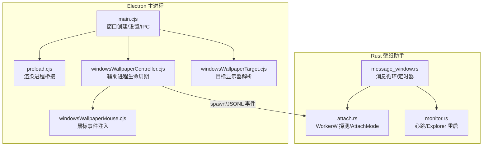
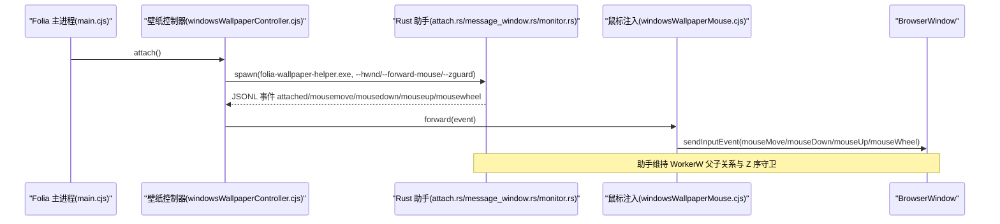
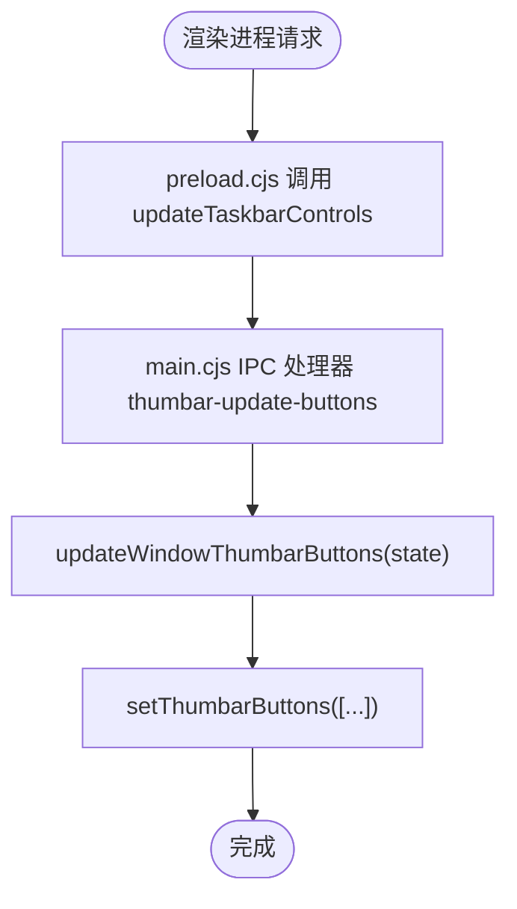
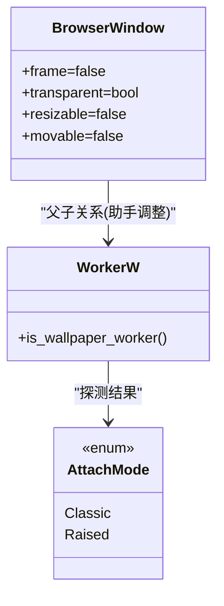
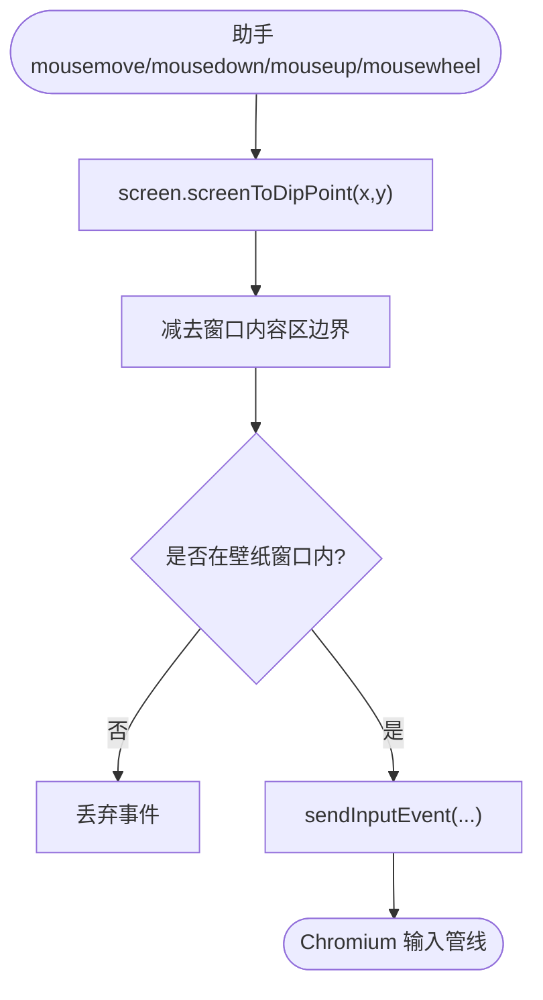
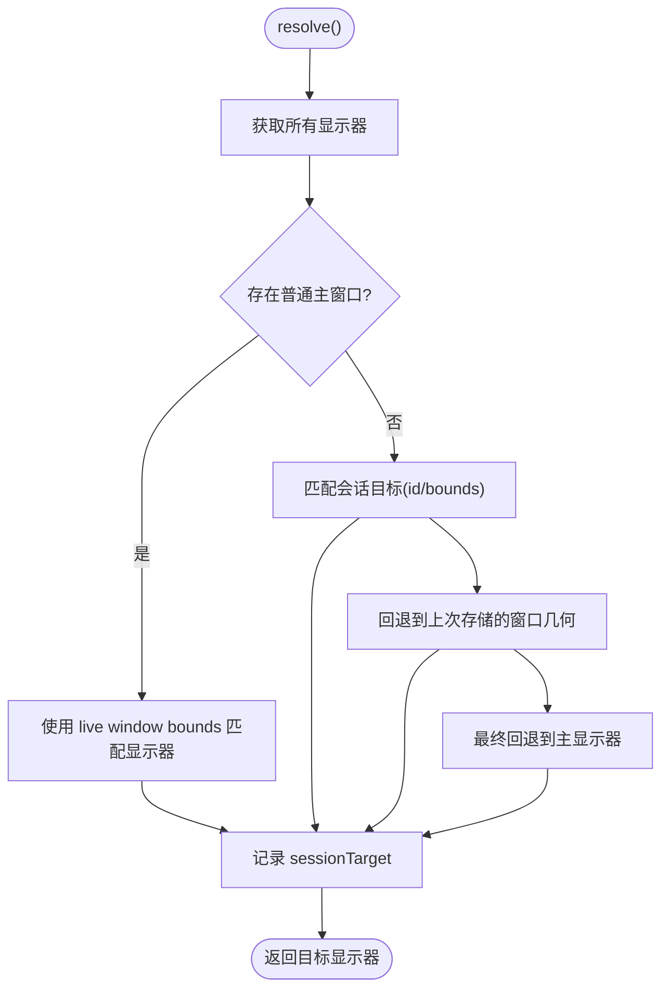
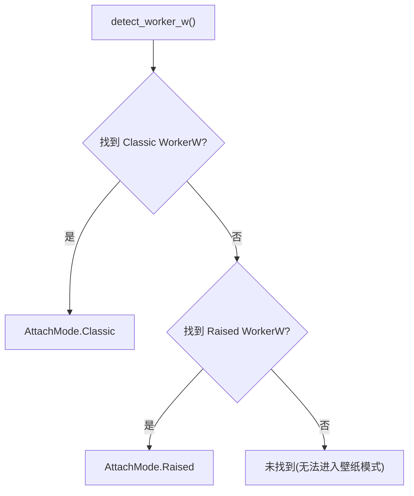
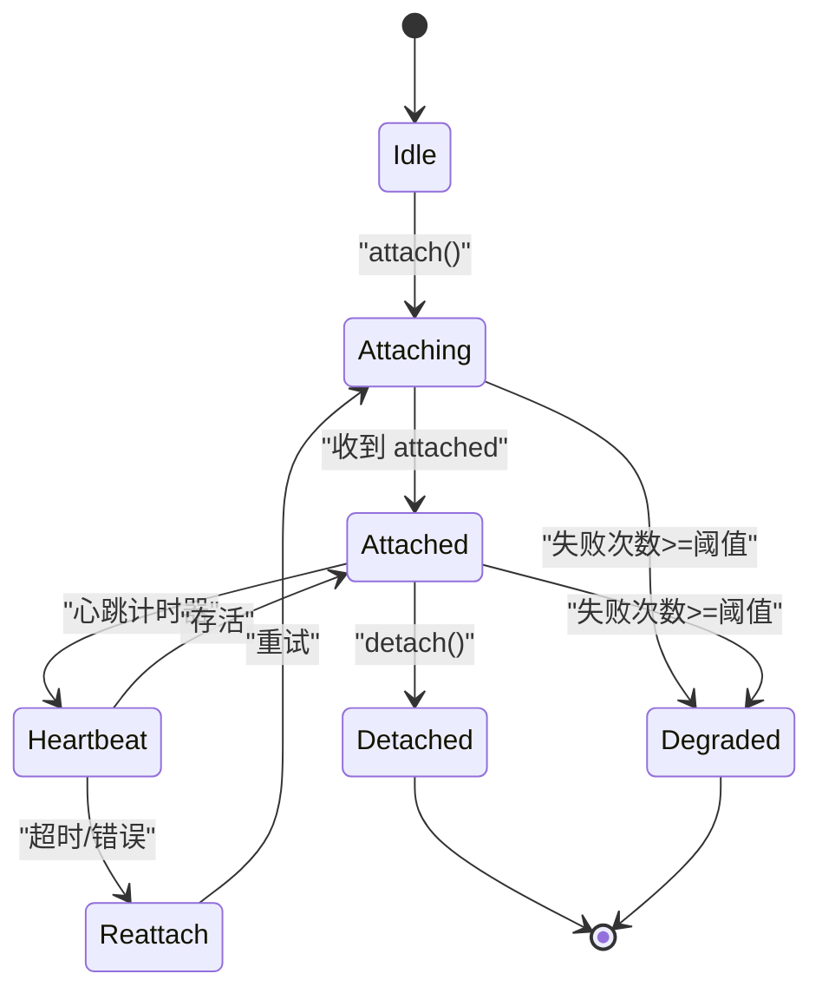
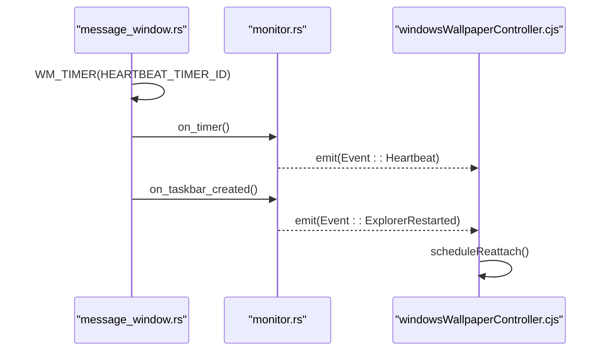
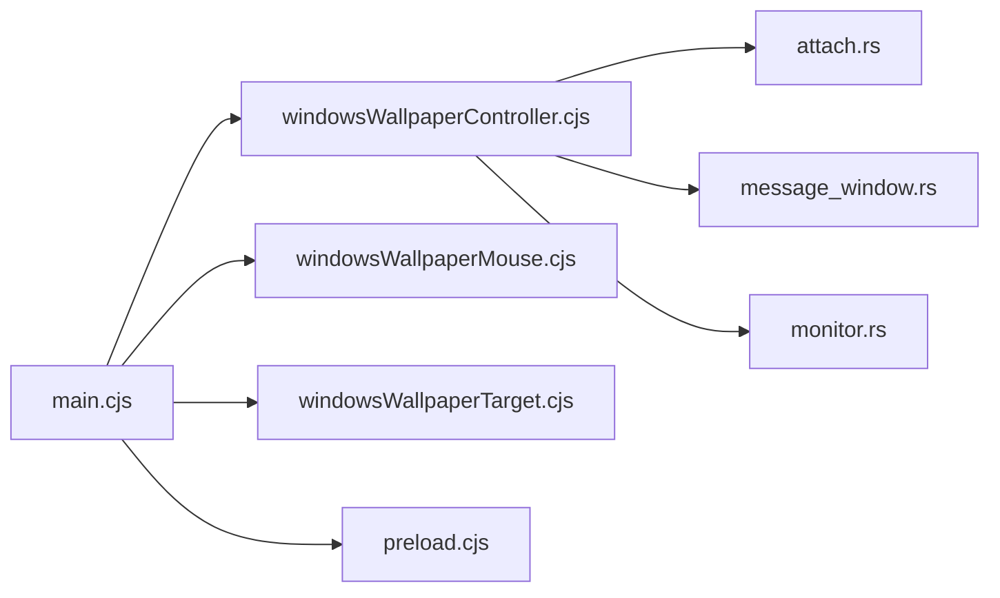

# Windows平台适配

<cite>
**本文引用的文件**   
- [electron/main.cjs](file://electron/main.cjs)
- [electron/preload.cjs](file://electron/preload.cjs)
- [electron/windowsWallpaperController.cjs](file://electron/windowsWallpaperController.cjs)
- [electron/windowsWallpaperMouse.cjs](file://electron/windowsWallpaperMouse.cjs)
- [electron/windowsWallpaperTarget.cjs](file://electron/windowsWallpaperTarget.cjs)
- [packaging/windows/build-wallpaper-helper.mjs](file://packaging/windows/build-wallpaper-helper.mjs)
- [packaging/windows/wallpaper-helper/src/attach.rs](file://packaging/windows/wallpaper-helper/src/attach.rs)
- [packaging/windows/wallpaper-helper/src/message_window.rs](file://packaging/windows/wallpaper-helper/src/message_window.rs)
- [packaging/windows/wallpaper-helper/src/monitor.rs](file://packaging/windows/wallpaper-helper/src/monitor.rs)
</cite>

## 目录
1. [简介](#简介)
2. [项目结构](#项目结构)
3. [核心组件](#核心组件)
4. [架构总览](#架构总览)
5. [详细组件分析](#详细组件分析)
6. [依赖关系分析](#依赖关系分析)
7. [性能与资源管理](#性能与资源管理)
8. [打包、签名与自动更新](#打包签名与自动更新)
9. [故障排除指南](#故障排除指南)
10. [结论](#结论)

## 简介
本文面向 Folia Major 在 Windows 平台的适配实现，重点覆盖以下能力：
- 任务栏缩略图预览（Thumbar）集成
- Jump List 与文件关联（概念性说明）
- UWP 应用商店兼容性注意事项（概念性说明）
- Windows 壁纸模式：WorkerW 父级关系管理、桌面图标层集成、鼠标事件注入
- Windows 10/11 差异处理：经典桌面与现代分层 Shell（Raised Desktop）
- 性能优化：GPU 加速、内存管理与资源清理策略
- 打包配置：NSIS 安装程序、数字签名与自动更新机制（概念性说明）
- 常见问题与排障建议

## 项目结构
Windows 相关代码主要分布在 Electron 主进程与 Rust 辅助程序中：
- Electron 侧负责窗口创建、显示目标选择、鼠标事件注入、任务栏按钮控制以及辅助进程生命周期管理。
- Rust 侧作为驻留的“壁纸助手”进程，负责 WorkerW 探测、窗口父子关系调整、Z 序守卫、心跳与 Explorer 重启恢复。

**图表来源**
- [electron/main.cjs:4936-5099](file://electron/main.cjs#L4936-L5099)
- [electron/windowsWallpaperController.cjs:41-70](file://electron/windowsWallpaperController.cjs#L41-L70)
- [electron/windowsWallpaperMouse.cjs:23-31](file://electron/windowsWallpaperMouse.cjs#L23-L31)
- [electron/windowsWallpaperTarget.cjs:48-52](file://electron/windowsWallpaperTarget.cjs#L48-L52)
- [packaging/windows/wallpaper-helper/src/attach.rs:33-48](file://packaging/windows/wallpaper-helper/src/attach.rs#L33-L48)
- [packaging/windows/wallpaper-helper/src/message_window.rs:1-6](file://packaging/windows/wallpaper-helper/src/message_window.rs#L1-L6)
- [packaging/windows/wallpaper-helper/src/monitor.rs:192-234](file://packaging/windows/wallpaper-helper/src/monitor.rs#L192-L234)

**章节来源**
- [electron/main.cjs:4936-5099](file://electron/main.cjs#L4936-L5099)
- [electron/windowsWallpaperController.cjs:1-11](file://electron/windowsWallpaperController.cjs#L1-L11)
- [electron/windowsWallpaperMouse.cjs:1-15](file://electron/windowsWallpaperMouse.cjs#L1-L15)
- [electron/windowsWallpaperTarget.cjs:1-20](file://electron/windowsWallpaperTarget.cjs#L1-L20)
- [packaging/windows/wallpaper-helper/src/attach.rs:110-160](file://packaging/windows/wallpaper-helper/src/attach.rs#L110-L160)
- [packaging/windows/wallpaper-helper/src/message_window.rs:1-125](file://packaging/windows/wallpaper-helper/src/message_window.rs#L1-L125)
- [packaging/windows/wallpaper-helper/src/monitor.rs:192-234](file://packaging/windows/wallpaper-helper/src/monitor.rs#L192-L234)

## 核心组件
- 任务栏缩略图预览（Thumbar）：在主进程中加载图标并调用 setThumbarButtons 更新播放控制按钮；通过 IPC 将点击动作回传给渲染进程。
- 壁纸控制器：管理 Rust 辅助进程的生命周期、心跳检测、失败降级与重连策略。
- 鼠标事件注入：将物理像素坐标转换为 DIP，并通过 webContents.sendInputEvent 注入到 Chromium 输入管线。
- 目标显示器解析：根据当前普通窗口、会话目标、上次窗口几何与主显示器优先级确定壁纸填充显示器。
- 辅助程序构建脚本：在非 Windows 主机上跳过构建，在 Windows 主机上编译 Rust 源码并输出可执行文件。

**章节来源**
- [electron/main.cjs:1837-1858](file://electron/main.cjs#L1837-L1858)
- [electron/main.cjs:2185-2238](file://electron/main.cjs#L2185-L2238)
- [electron/main.cjs:6393-6404](file://electron/main.cjs#L6393-L6404)
- [electron/preload.cjs:215-219](file://electron/preload.cjs#L215-L219)
- [electron/windowsWallpaperController.cjs:41-70](file://electron/windowsWallpaperController.cjs#L41-L70)
- [electron/windowsWallpaperMouse.cjs:23-31](file://electron/windowsWallpaperMouse.cjs#L23-L31)
- [electron/windowsWallpaperTarget.cjs:48-52](file://electron/windowsWallpaperTarget.cjs#L48-L52)
- [packaging/windows/build-wallpaper-helper.mjs:1-34](file://packaging/windows/build-wallpaper-helper.mjs#L1-L34)

## 架构总览
Windows 壁纸模式采用“Electron 主进程 + Rust 助手进程”的双进程协作模型：
- Electron 负责 UI 与系统 API 交互（窗口、显示器、鼠标注入、任务栏按钮）。
- Rust 助手负责底层窗口树操作（WorkerW 探测、父子关系、Z 序守卫）、心跳与 Explorer 重启恢复。

**图表来源**
- [electron/main.cjs:4936-5099](file://electron/main.cjs#L4936-L5099)
- [electron/windowsWallpaperController.cjs:259-354](file://electron/windowsWallpaperController.cjs#L259-L354)
- [electron/windowsWallpaperMouse.cjs:71-149](file://electron/windowsWallpaperMouse.cjs#L71-L149)
- [packaging/windows/wallpaper-helper/src/attach.rs:110-160](file://packaging/windows/wallpaper-helper/src/attach.rs#L110-L160)
- [packaging/windows/wallpaper-helper/src/message_window.rs:84-125](file://packaging/windows/wallpaper-helper/src/message_window.rs#L84-L125)

## 详细组件分析

### 任务栏缩略图预览（Thumbar）
- 图标加载：从构建产物目录加载 16x16 图标，并按平台区分是否启用。
- 按钮更新：根据播放状态动态设置“上一曲/播放或暂停/下一曲”按钮，禁用态由 canGoPrevious/canGoNext 控制。
- IPC 通道：渲染进程通过 preload 暴露 updateTaskbarControls，主进程监听 thumbar-action 事件转发给渲染进程。

**图表来源**
- [electron/preload.cjs:215-219](file://electron/preload.cjs#L215-L219)
- [electron/main.cjs:6393-6404](file://electron/main.cjs#L6393-L6404)
- [electron/main.cjs:2193-2238](file://electron/main.cjs#L2193-L2238)
- [electron/main.cjs:1837-1858](file://electron/main.cjs#L1837-L1858)

**章节来源**
- [electron/main.cjs:1837-1858](file://electron/main.cjs#L1837-L1858)
- [electron/main.cjs:2185-2238](file://electron/main.cjs#L2185-L2238)
- [electron/main.cjs:6393-6404](file://electron/main.cjs#L6393-L6404)
- [electron/preload.cjs:215-219](file://electron/preload.cjs#L215-L219)

### Windows 壁纸模式：WorkerW 父级关系与桌面图标层
- 窗口创建：壁纸模式下使用无边框、不可移动、不可调整大小窗口，必要时透明背景；X11 与 Windows 分支分别处理全屏几何。
- WorkerW 探测：Rust 助手按“经典桌面（Classic）→ 现代分层 Shell（Raised）”顺序探测 WorkerW，返回 AttachMode。
- 样式归一化：将窗口标记为子窗口并移除干扰样式；分离时恢复为正常顶层窗口样式。
- 桌面图标层：避免将 SHELLDLL_DefView 所在的 WorkerW 作为宿主，确保图标层位于壁纸之上。

**图表来源**
- [electron/main.cjs:4936-5099](file://electron/main.cjs#L4936-L5099)
- [packaging/windows/wallpaper-helper/src/attach.rs:110-160](file://packaging/windows/wallpaper-helper/src/attach.rs#L110-L160)
- [packaging/windows/wallpaper-helper/src/attach.rs:121-145](file://packaging/windows/wallpaper-helper/src/attach.rs#L121-L145)

**章节来源**
- [electron/main.cjs:4936-5099](file://electron/main.cjs#L4936-L5099)
- [packaging/windows/wallpaper-helper/src/attach.rs:110-160](file://packaging/windows/wallpaper-helper/src/attach.rs#L110-L160)
- [packaging/windows/wallpaper-helper/src/attach.rs:121-145](file://packaging/windows/wallpaper-helper/src/attach.rs#L121-L145)

### 鼠标事件注入
- 坐标转换：助手报告物理屏幕像素，通过 screen.screenToDipPoint 转为 DIP，再减去窗口内容区边界得到相对坐标。
- 事件注入：使用 sendInputEvent 而非 posted WM_MOUSEMOVE，避免 TrackMouseEvent 导致的悬停撕裂。
- 双击合成：由于注入绕过系统多击检测，需自行计算 clickCount。
- 滚轮校准：将原始 WHEEL_DELTA 刻度映射为 ~100px/ notch，保持垂直符号与水平方向语义。

**图表来源**
- [electron/windowsWallpaperMouse.cjs:33-67](file://electron/windowsWallpaperMouse.cjs#L33-L67)
- [electron/windowsWallpaperMouse.cjs:71-149](file://electron/windowsWallpaperMouse.cjs#L71-L149)

**章节来源**
- [electron/windowsWallpaperMouse.cjs:1-15](file://electron/windowsWallpaperMouse.cjs#L1-L15)
- [electron/windowsWallpaperMouse.cjs:33-67](file://electron/windowsWallpaperMouse.cjs#L33-L67)
- [electron/windowsWallpaperMouse.cjs:71-149](file://electron/windowsWallpaperMouse.cjs#L71-L149)

### 目标显示器解析
- 优先级：
  1) 当前普通主窗口几何
  2) 会话目标（本次壁纸会话记住的显示器）
  3) 上次保存的窗口几何
  4) 主显示器
- 匹配策略：优先按 display.id 匹配，否则按精确 bounds 匹配；若 getDisplayMatching 返回“最近但不相交”，则回退到主显示器。
- 安全降级：display 拓扑变化时可能抛出异常，解析器捕获并降级为无显示。

**图表来源**
- [electron/windowsWallpaperTarget.cjs:48-52](file://electron/windowsWallpaperTarget.cjs#L48-L52)
- [electron/windowsWallpaperTarget.cjs:81-94](file://electron/windowsWallpaperTarget.cjs#L81-L94)
- [electron/windowsWallpaperTarget.cjs:106-118](file://electron/windowsWallpaperTarget.cjs#L106-L118)
- [electron/windowsWallpaperTarget.cjs:120-148](file://electron/windowsWallpaperTarget.cjs#L120-L148)

**章节来源**
- [electron/windowsWallpaperTarget.cjs:1-20](file://electron/windowsWallpaperTarget.cjs#L1-L20)
- [electron/windowsWallpaperTarget.cjs:48-52](file://electron/windowsWallpaperTarget.cjs#L48-L52)
- [electron/windowsWallpaperTarget.cjs:81-94](file://electron/windowsWallpaperTarget.cjs#L81-L94)
- [electron/windowsWallpaperTarget.cjs:106-118](file://electron/windowsWallpaperTarget.cjs#L106-L118)
- [electron/windowsWallpaperTarget.cjs:120-148](file://electron/windowsWallpaperTarget.cjs#L120-L148)

### Windows 10/11 差异处理
- 经典桌面（Win10/早期 Win11）：WorkerW 为 DefView 所在窗口的同级兄弟节点。
- 现代分层 Shell（Win11 24H2+ Raised Desktop）：WorkerW 为 Progman 的直接子节点，与 DefView 并列。
- 助手探测顺序：先尝试 Classic，再尝试 Raised，返回 AttachMode 供上层决策。

**图表来源**
- [packaging/windows/wallpaper-helper/src/attach.rs:110-119](file://packaging/windows/wallpaper-helper/src/attach.rs#L110-L119)
- [packaging/windows/wallpaper-helper/src/attach.rs:33-48](file://packaging/windows/wallpaper-helper/src/attach.rs#L33-L48)

**章节来源**
- [packaging/windows/wallpaper-helper/src/attach.rs:110-119](file://packaging/windows/wallpaper-helper/src/attach.rs#L110-L119)
- [packaging/windows/wallpaper-helper/src/attach.rs:33-48](file://packaging/windows/wallpaper-helper/src/attach.rs#L33-L48)

### 辅助进程生命周期与心跳
- 启动参数：传入 --hwnd、可选 --forward-mouse、--zguard。
- 心跳监控：每 5s 检查一次，超过 15s 无事件视为挂起，杀死并尝试重连。
- 崩溃环保护：连续失败达到阈值后禁用壁纸模式，等待健康运行时间后重置计数。
- 优雅分离：发送 detach 指令，延迟后 kill 子进程，避免残留事件污染新会话。

**图表来源**
- [electron/windowsWallpaperController.cjs:17-22](file://electron/windowsWallpaperController.cjs#L17-L22)
- [electron/windowsWallpaperController.cjs:106-128](file://electron/windowsWallpaperController.cjs#L106-L128)
- [electron/windowsWallpaperController.cjs:147-172](file://electron/windowsWallpaperController.cjs#L147-L172)
- [electron/windowsWallpaperController.cjs:395-445](file://electron/windowsWallpaperController.cjs#L395-L445)

**章节来源**
- [electron/windowsWallpaperController.cjs:17-22](file://electron/windowsWallpaperController.cjs#L17-L22)
- [electron/windowsWallpaperController.cjs:106-128](file://electron/windowsWallpaperController.cjs#L106-L128)
- [electron/windowsWallpaperController.cjs:147-172](file://electron/windowsWallpaperController.cjs#L147-L172)
- [electron/windowsWallpaperController.cjs:259-354](file://electron/windowsWallpaperController.cjs#L259-L354)
- [electron/windowsWallpaperController.cjs:395-445](file://electron/windowsWallpaperController.cjs#L395-L445)

### 消息循环与 Explorer 重启恢复
- 隐藏消息窗口：用于接收广播消息（如 TaskbarCreated），非消息窗口类型以支持广播。
- 定时器：心跳与鼠标移动合并定时器。
- Explorer 重启：检测到 PID 变化后发出 explorer-restarted 事件并触发重连。

**图表来源**
- [packaging/windows/wallpaper-helper/src/message_window.rs:84-125](file://packaging/windows/wallpaper-helper/src/message_window.rs#L84-L125)
- [packaging/windows/wallpaper-helper/src/monitor.rs:192-234](file://packaging/windows/wallpaper-helper/src/monitor.rs#L192-L234)
- [electron/windowsWallpaperController.cjs:207-257](file://electron/windowsWallpaperController.cjs#L207-L257)

**章节来源**
- [packaging/windows/wallpaper-helper/src/message_window.rs:1-125](file://packaging/windows/wallpaper-helper/src/message_window.rs#L1-L125)
- [packaging/windows/wallpaper-helper/src/monitor.rs:192-234](file://packaging/windows/wallpaper-helper/src/monitor.rs#L192-L234)
- [electron/windowsWallpaperController.cjs:207-257](file://electron/windowsWallpaperController.cjs#L207-L257)

## 依赖关系分析
- main.cjs 依赖：
  - windowsWallpaperController.cjs：辅助进程生命周期
  - windowsWallpaperMouse.cjs：鼠标事件注入
  - windowsWallpaperTarget.cjs：目标显示器解析
  - preload.cjs：IPC 桥接
- Rust 助手内部依赖：
  - message_window.rs：消息循环与定时器
  - monitor.rs：心跳与 Explorer 重启
  - attach.rs：WorkerW 探测与样式调整

**图表来源**
- [electron/main.cjs:4936-5099](file://electron/main.cjs#L4936-L5099)
- [electron/windowsWallpaperController.cjs:41-70](file://electron/windowsWallpaperController.cjs#L41-L70)
- [packaging/windows/wallpaper-helper/src/attach.rs:110-160](file://packaging/windows/wallpaper-helper/src/attach.rs#L110-L160)
- [packaging/windows/wallpaper-helper/src/message_window.rs:84-125](file://packaging/windows/wallpaper-helper/src/message_window.rs#L84-L125)
- [packaging/windows/wallpaper-helper/src/monitor.rs:192-234](file://packaging/windows/wallpaper-helper/src/monitor.rs#L192-L234)

**章节来源**
- [electron/main.cjs:4936-5099](file://electron/main.cjs#L4936-L5099)
- [electron/windowsWallpaperController.cjs:41-70](file://electron/windowsWallpaperController.cjs#L41-L70)
- [packaging/windows/wallpaper-helper/src/attach.rs:110-160](file://packaging/windows/wallpaper-helper/src/attach.rs#L110-L160)
- [packaging/windows/wallpaper-helper/src/message_window.rs:84-125](file://packaging/windows/wallpaper-helper/src/message_window.rs#L84-L125)
- [packaging/windows/wallpaper-helper/src/monitor.rs:192-234](file://packaging/windows/wallpaper-helper/src/monitor.rs#L192-L234)

## 性能与资源管理
- GPU 加速与透明背景：
  - 壁纸模式通常关闭阴影与厚边框，必要时启用透明背景；Windows 下可使用 acrylic 材质以提升视觉体验（受设置开关控制）。
  - 透明窗口在某些场景下会禁用 GPU 加速，需结合硬件与驱动情况评估。
- 内存管理：
  - 壁纸模式下的窗口几何固定，避免频繁 resize 带来的重绘开销。
  - 鼠标事件经合并与过滤，减少高频事件对渲染进程的冲击。
- 资源清理：
  - 心跳超时与退出事件统一清理定时器与子进程引用，防止重复重连。
  - 分离流程中延迟 kill，确保助手完成恢复后再释放资源。

[本节为通用指导，不直接分析具体文件]

## 打包、签名与自动更新
- NSIS 安装程序：
  - 本项目未在仓库中发现 NSIS 脚本；打包流程通常由 electron-builder 等工具链生成。
- 数字签名：
  - 仓库未包含签名证书或签名脚本；发布前需在 CI 或本地环境配置签名步骤。
- 自动更新：
  - 仓库中存在 updateChannels.cjs，但未发现具体的 Squirrel/electron-updater 集成脚本；自动更新逻辑需结合发布渠道与后端服务实现。
- 壁纸助手构建：
  - build-wallpaper-helper.mjs 在非 Windows 主机上跳过构建；在 Windows 主机上使用 cargo build --release 编译 Rust 源码并将 folia-wallpaper-helper.exe 复制到 build 目录，供 electron-builder 打包进 extraResources。

**章节来源**
- [packaging/windows/build-wallpaper-helper.mjs:1-34](file://packaging/windows/build-wallpaper-helper.mjs#L1-L34)

## 故障排除指南
- 任务栏按钮不显示或点击无效：
  - 确认 isWindowsThumbarSupported 与 mainWindow 有效；检查 THUMBAR_ICON_DIR 路径与图标资源是否存在。
  - 校验 IPC 调用方是否为可信渲染进程（isTrustedMainWindowContents）。
- 壁纸模式无法进入或频繁崩溃：
  - 检查辅助进程二进制是否存在（helperPath），查看心跳超时日志与失败计数。
  - 观察助手事件：workerw-destroyed/explorer-restarted/reasserted/detached/error。
  - 若连续失败达到阈值，壁纸模式将被禁用，需手动重新开启。
- 鼠标悬停撕裂或拖拽中断：
  - 确认已启用 forwardMouse 并使用 sendInputEvent 注入；避免使用 posted WM_MOUSEMOVE。
  - 检查 DPI 转换是否可用（screen.screenToDipPoint），在多显示器不同缩放比例下尤为重要。
- 目标显示器错误：
  - 确认普通主窗口几何有效；若会话目标丢失，回退到上次存储几何或主显示器。
  - 当 getDisplayMatching 返回不相交区域时，应回退到主显示器。

**章节来源**
- [electron/main.cjs:2193-2238](file://electron/main.cjs#L2193-L2238)
- [electron/main.cjs:6393-6404](file://electron/main.cjs#L6393-L6404)
- [electron/windowsWallpaperController.cjs:106-128](file://electron/windowsWallpaperController.cjs#L106-L128)
- [electron/windowsWallpaperController.cjs:207-257](file://electron/windowsWallpaperController.cjs#L207-L257)
- [electron/windowsWallpaperMouse.cjs:33-67](file://electron/windowsWallpaperMouse.cjs#L33-L67)
- [electron/windowsWallpaperTarget.cjs:106-118](file://electron/windowsWallpaperTarget.cjs#L106-L118)

## 结论
Folia Major 在 Windows 平台的适配通过 Electron 主进程与 Rust 助手进程协同工作，实现了稳定的壁纸模式、可靠的 WorkerW 父级关系管理、准确的显示器目标选择与流畅的鼠标事件注入。任务栏缩略图预览通过 IPC 与 setThumbarButtons 提供一致的媒体控制体验。针对 Windows 10/11 的差异，助手程序按 Classic → Raised 的顺序探测 WorkerW，确保在不同 Shell 架构下均能正确挂载。配合心跳监控、崩溃环保护与优雅分离策略，系统在复杂桌面环境下具备较强的鲁棒性。打包与签名流程需结合外部工具链完善，自动更新逻辑可在现有 updateChannels.cjs 基础上扩展。