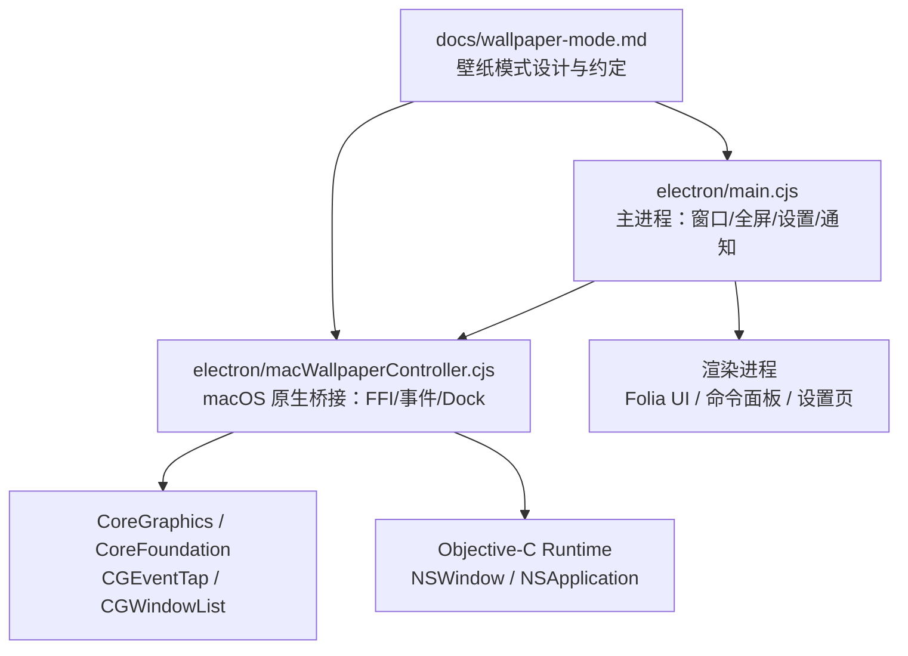
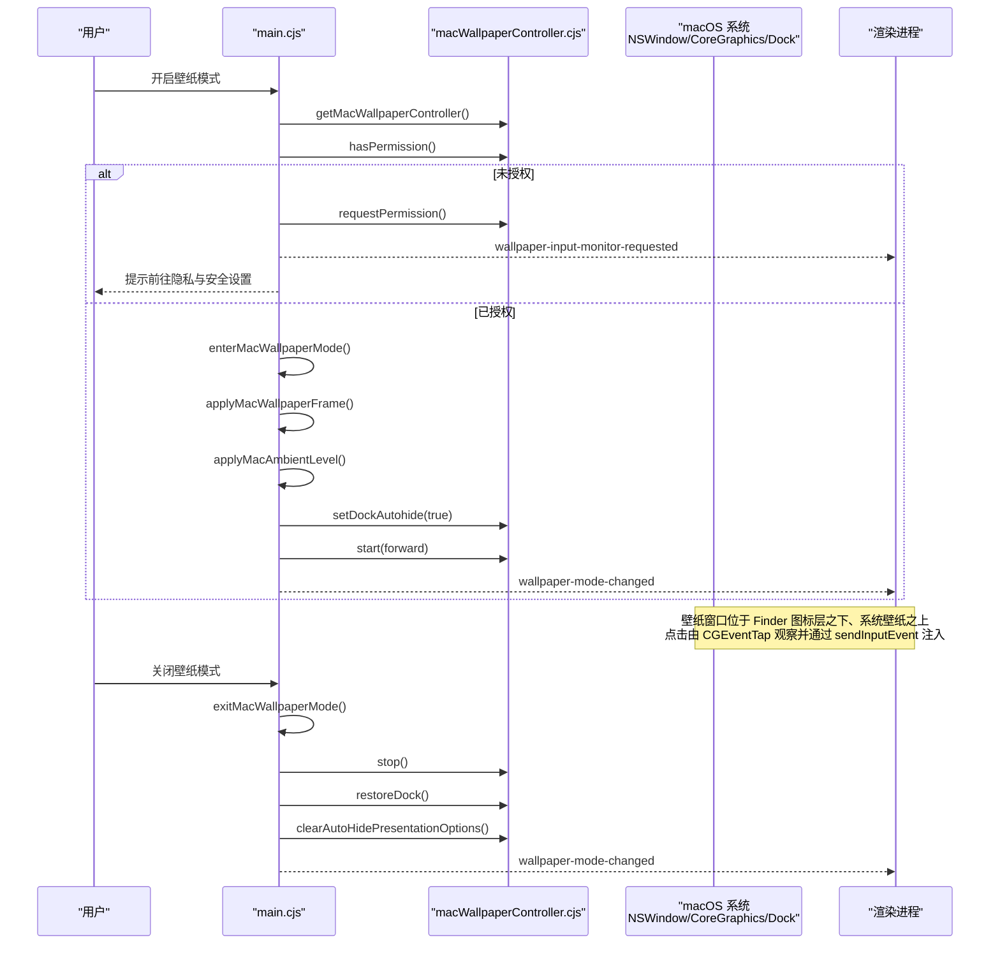
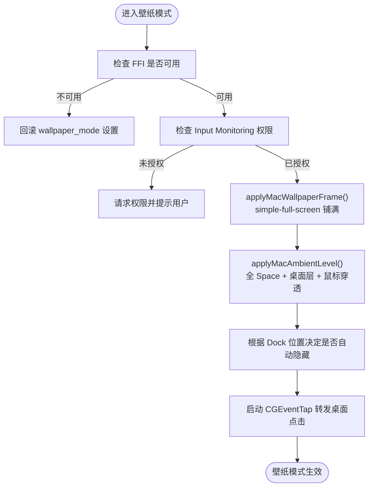
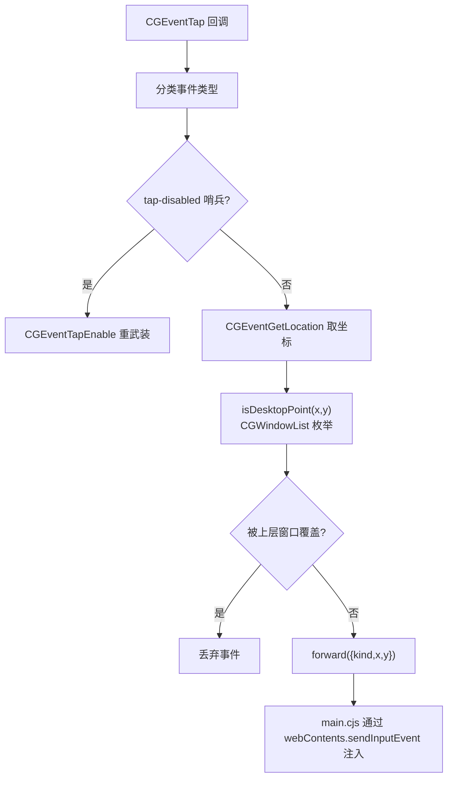
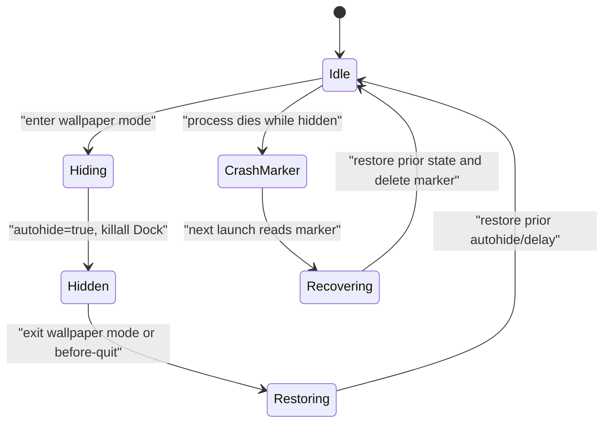
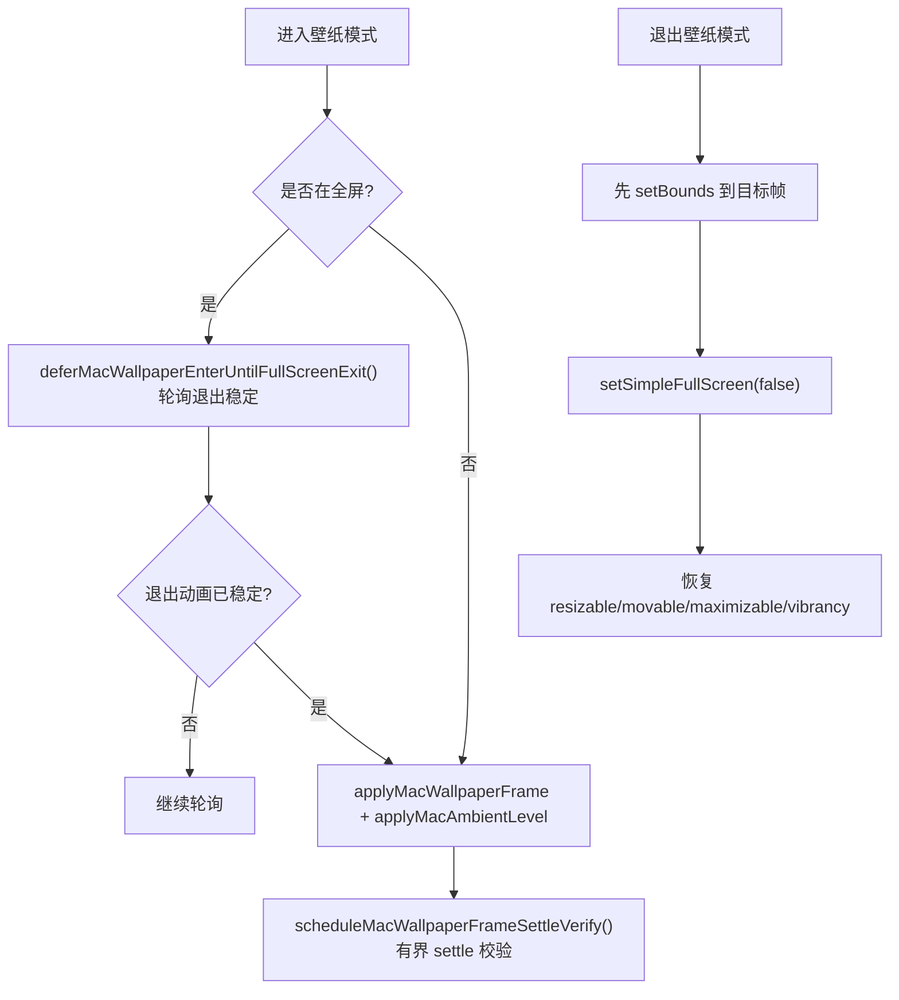
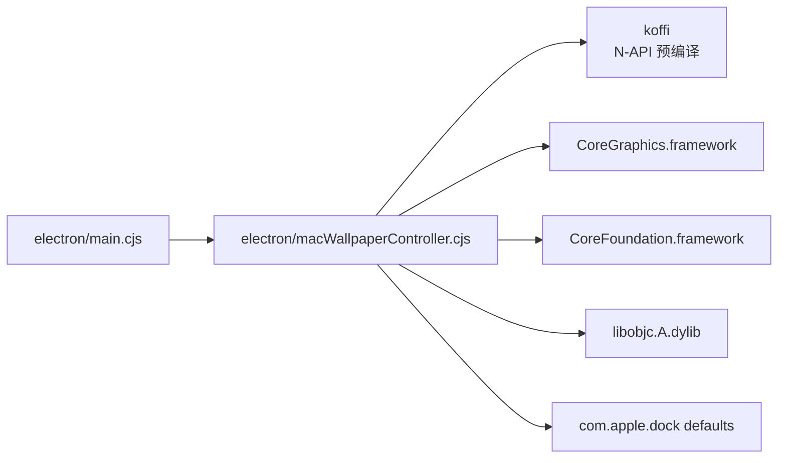

# macOS平台适配

<cite>
**本文引用的文件**   
- [electron/macWallpaperController.cjs](file://electron/macWallpaperController.cjs)
- [electron/main.cjs](file://electron/main.cjs)
- [docs/wallpaper-mode.md](file://docs/wallpaper-mode.md)
- [test/unit/electron/macWallpaperController.test.ts](file://test/unit/electron/macWallpaperController.test.ts)
</cite>

## 目录
1. [引言](#引言)
2. [项目结构](#项目结构)
3. [核心组件](#核心组件)
4. [架构总览](#架构总览)
5. [详细组件分析](#详细组件分析)
6. [依赖关系分析](#依赖关系分析)
7. [性能与资源特性](#性能与资源特性)
8. [故障排查指南](#故障排查指南)
9. [结论](#结论)
10. [附录：App Store 发布与权限说明](#附录app-store-发布与权限说明)

## 引言
本文件聚焦 Folia Major 在 macOS 平台的原生适配，重点覆盖以下方面：
- 菜单栏集成、Dock 行为控制、Spotlight 搜索索引与 Quick Look 文件预览支持现状。
- macOS 壁纸模式的“原生实现”：NSWindow 层级管理、Finder 图标层集成、CGEventTap 鼠标事件捕获。
- macOS 特有界面适配：标题栏样式、窗口装饰、全屏模式与 Space 工作区支持。
- macOS 系统集成：通知中心、共享扩展、服务菜单与辅助功能支持现状。
- App Store 发布要求（沙盒、权限声明、代码签名）在本仓库中的体现与建议。
- macOS 特定调试技巧与性能优化建议。

需要特别说明的是：当前仓库中 macOS 相关能力主要集中在“壁纸模式”的原生桥接；其余 macOS 系统能力（如 Spotlight、Quick Look、通知中心、共享扩展等）并未在该仓库中出现具体实现。因此，文档会明确区分“已实现能力”和“未实现/需外部配置能力”，避免把通用 Electron 能力误读为 Folia 自研实现。

## 项目结构
macOS 适配的核心代码集中在主进程与一个纯逻辑控制器中：
- `electron/main.cjs`：Electron 主进程入口，负责窗口生命周期、壁纸模式开关、全屏/简单全屏协调、Dock 自动隐藏策略、渲染端通知与设置热更新。
- `electron/macWallpaperController.cjs`：darwin-only 的 macOS 原生桥接模块，封装 koffi FFI、NSWindow level/collection behavior、CGEventTap、桌面点过滤、Dock 状态恢复与崩溃标记。
- `docs/wallpaper-mode.md`：壁纸模式三平台对照与 macOS 章节的详细设计说明。
- `test/unit/electron/macWallpaperController.test.ts`：针对 Dock marker 解析、Dock 位置判断等纯逻辑的单元测试。

**图示来源**
- [electron/main.cjs:599-789](file://electron/main.cjs#L599-L789)
- [electron/macWallpaperController.cjs:153-279](file://electron/macWallpaperController.cjs#L153-L279)
- [docs/wallpaper-mode.md:124-176](file://docs/wallpaper-mode.md#L124-L176)

**章节来源**
- [electron/main.cjs:599-789](file://electron/main.cjs#L599-L789)
- [electron/macWallpaperController.cjs:153-279](file://electron/macWallpaperController.cjs#L153-L279)
- [docs/wallpaper-mode.md:124-176](file://docs/wallpaper-mode.md#L124-L176)

## 核心组件
本节从职责边界、关键方法与交互契约角度梳理 macOS 适配的核心组件。

### macOS 壁纸模式控制器
该模块是 macOS 适配的“原生层”，职责包括：
- 通过 koffi 调用 Objective-C Runtime 与 CoreGraphics，获取 Finder 桌面层并计算壁纸窗口层级。
- 提供 NSWindow 层级与集合行为接口：设置/读取层级、设置 collection behavior、读取 occlusion state。
- 管理 CGEventTap 生命周期：权限探测、启动/停止、tap-disabled 哨兵重武装、桌面点过滤、事件转发。
- 管理 Dock 自动隐藏：记录用户 prior 状态、写入 marker、异步队列串行化 defaults/killall、崩溃恢复。
- 清理应用级 AutoHide 残留：清除 NSApplication 的 AutoHideDock|AutoHideMenuBar presentation bits。

关键方法（概念性描述，不直接粘贴源码）：
- `isAvailable()`：返回 darwin 且 FFI 初始化成功。
- `desktopLevel()` / `normalLevel()`：壁纸层级与正常层级。
- `setLevel(win, level)` / `getLevel(win)`：设置/读取 NSWindow level。
- `setCollectionBehavior(win, mask)` / `getOcclusionState(win)` / `isVisibleByOcclusion(win)`：集合行为与遮挡可见性。
- `hasPermission()` / `requestPermission()` / `start(forward)` / `stop()` / `isRunning()`：Input Monitoring 与 CGEventTap。
- `isDesktopPoint(x, y)`：基于 CGWindowList 判定裸桌面点。
- `setDockAutohide(on)` / `restoreDock()` / `restoreDockSync()` / `recoverStrandedDock()` / `configureDockRecovery()` / `isDockAtBottom()`：Dock 自动隐藏与恢复。
- `clearAutoHidePresentationOptions()`：清理 NSApplication 的 AutoHide 位。

**章节来源**
- [electron/macWallpaperController.cjs:21-151](file://electron/macWallpaperController.cjs#L21-L151)
- [electron/macWallpaperController.cjs:153-279](file://electron/macWallpaperController.cjs#L153-L279)
- [electron/macWallpaperController.cjs:305-418](file://electron/macWallpaperController.cjs#L305-L418)
- [electron/macWallpaperController.cjs:420-502](file://electron/macWallpaperController.cjs#L420-L502)
- [electron/macWallpaperController.cjs:507-728](file://electron/macWallpaperController.cjs#L507-L728)
- [electron/macWallpaperController.cjs:736-800](file://electron/macWallpaperController.cjs#L736-L800)

### 主进程接入与壁纸模式状态机
主进程负责把壁纸模式与 Electron 窗口、渲染端设置、托盘与命令面板联动起来。macOS 分支的关键流程：
- 懒加载控制器：首次使用才创建，失败时降级为不可用。
- 进入壁纸模式：检查 FFI 可用性 → 检查 Input Monitoring 权限 → 处理最小化/隐藏窗口 → 记录 savedState → 若处于全屏则延迟进入 → 铺满 + 设置 ambient level + ignoreMouseEvents + 可选隐藏 Dock + 推送设置变更。
- 退出壁纸模式：先恢复目标帧 → 退出 simple full screen → 还原 level/geometry/mouse events/all-workspaces → 恢复 resizable/movable/maximizable/vibrancy → 清理 AutoHide 残留。
- 透明背景重建窗口时的会话重绑定：重新 capture savedState、禁用可调整大小/可移动、重新铺满 + ambient + Dock + tap。
- 显示热插拔/分辨率变化：壁纸会话存活时延迟重断言 frame 与 level。
- before-quit：同步停 tap 并 restoreDockSync。

**章节来源**
- [electron/main.cjs:599-789](file://electron/main.cjs#L599-L789)
- [electron/main.cjs:880-939](file://electron/main.cjs#L880-L939)
- [electron/main.cjs:975-1079](file://electron/main.cjs#L975-L1079)
- [electron/main.cjs:1120-1319](file://electron/main.cjs#L1120-L1319)

## 架构总览
下图展示 macOS 壁纸模式在主进程、原生控制器、系统框架与渲染端之间的数据流与控制流。

**图示来源**
- [electron/main.cjs:975-1079](file://electron/main.cjs#L975-L1079)
- [electron/main.cjs:1120-1319](file://electron/main.cjs#L1120-L1319)
- [electron/macWallpaperController.cjs:736-800](file://electron/macWallpaperController.cjs#L736-L800)
- [docs/wallpaper-mode.md:124-176](file://docs/wallpaper-mode.md#L124-L176)

## 详细组件分析

### macOS 壁纸模式：NSWindow 层级管理与 Finder 图标层集成
macOS 壁纸模式的核心思路是：让 LIVE 的 BrowserWindow 沉到 Finder 图标层之下、系统壁纸之上，从而视觉上充当壁纸，同时保持桌面图标可见。由于 Finder 会接收裸桌面点击，所以必须配合 CGEventTap 监听并转发鼠标事件。

关键点：
- Finder 桌面层常量与壁纸层级计算：壁纸层级 = Finder 图标层 - 1。
- 通过 koffi 调用 `CGWindowLevelForKey(kCGDesktopIconWindowLevelKey)` 获取图标层，再计算壁纸层。
- 通过 NSWindow 的 `setLevel:` 设置层级；通过 Electron 的 `setVisibleOnAllWorkspaces(true, {visibleOnFullScreen:true})` 设置全 Space 可见，而不是直接写裸 collection behavior 位。
- 通过 `setIgnoreMouseEvents(true, {forward:true})` 让窗口对鼠标穿透，再由 CGEventTap 捕获并转发。

**图示来源**
- [electron/main.cjs:666-724](file://electron/main.cjs#L666-L724)
- [electron/main.cjs:975-1079](file://electron/main.cjs#L975-L1079)
- [electron/macWallpaperController.cjs:83-88](file://electron/macWallpaperController.cjs#L83-L88)
- [electron/macWallpaperController.cjs:157-206](file://electron/macWallpaperController.cjs#L157-L206)

**章节来源**
- [electron/macWallpaperController.cjs:83-88](file://electron/macWallpaperController.cjs#L83-L88)
- [electron/macWallpaperController.cjs:157-206](file://electron/macWallpaperController.cjs#L157-L206)
- [electron/main.cjs:666-724](file://electron/main.cjs#L666-L724)
- [electron/main.cjs:975-1079](file://electron/main.cjs#L975-L1079)

### macOS 壁纸模式：CGEventTap 鼠标事件捕获与桌面点过滤
CGEventTap 用于监听全局鼠标事件，但壁纸窗口本身位于 Finder 图标层之下，无法直接收到点击。因此实现分为两步：
1. 使用 listen-only session tap 捕获 left/right down/up/dragged、mouseMoved、scroll。
2. 对每个事件进行“桌面点过滤”：只有落在裸桌面上的事件才会被转发给渲染端。

桌面点过滤通过枚举 onScreenOnly 的 CGWindowList，只读取 layer、bounds、ownerPID、alpha，避免触发屏幕录制权限。特殊排除：
- 本进程的全屏呈现窗口（simple-fullscreen 下 WindowServer 报告 layer≥101）。
- Dock 进程的追踪窗口（自动隐藏态 layer≈20、bounds 铺满全屏）。
- Finder 桌面 backdrop（layer 等于 Finder 桌面层且铺满整屏）视为 pass-through chrome。

**图示来源**
- [electron/macWallpaperController.cjs:305-418](file://electron/macWallpaperController.cjs#L305-L418)
- [electron/macWallpaperController.cjs:736-800](file://electron/macWallpaperController.cjs#L736-L800)
- [docs/wallpaper-mode.md:157-164](file://docs/wallpaper-mode.md#L157-L164)

**章节来源**
- [electron/macWallpaperController.cjs:305-418](file://electron/macWallpaperController.cjs#L305-L418)
- [electron/macWallpaperController.cjs:736-800](file://electron/macWallpaperController.cjs#L736-L800)
- [docs/wallpaper-mode.md:157-164](file://docs/wallpaper-mode.md#L157-L164)

### macOS 壁纸模式：Dock 自动隐藏与崩溃恢复
Dock 自动隐藏在壁纸模式下用于减少底部内容遮挡，但必须保证：
- 仅当 Dock 位于屏幕底部时才自动隐藏。
- 记录用户 prior autohide/autohide-delay，退出或崩溃后恢复。
- 使用 marker 文件 `.wallpaper-dock-autohidden` 做 crash-safe 恢复。
- 所有 async Dock 操作走 FIFO 队列，避免 defaults/killall 交错导致状态不一致。

**图示来源**
- [electron/macWallpaperController.cjs:520-728](file://electron/macWallpaperController.cjs#L520-L728)
- [electron/macWallpaperController.cjs:670-700](file://electron/macWallpaperController.cjs#L670-L700)
- [electron/main.cjs:957-973](file://electron/main.cjs#L957-L973)

**章节来源**
- [electron/macWallpaperController.cjs:520-728](file://electron/macWallpaperController.cjs#L520-L728)
- [electron/main.cjs:957-973](file://electron/main.cjs#L957-L973)
- [test/unit/electron/macWallpaperController.test.ts:218-246](file://test/unit/electron/macWallpaperController.test.ts#L218-L246)

### macOS 壁纸模式：全屏模式与 Space 工作区支持
macOS 壁纸模式对全屏与工作区的处理非常谨慎：
- 使用 Electron 的 `setSimpleFullScreen(true)` 铺满整个显示器，避免 `setBounds(display.bounds)` 被 macOS 钳制到 workArea。
- 使用 `setVisibleOnAllWorkspaces(true, {visibleOnFullScreen:true})` 让壁纸出现在所有 Space。
- 如果进入壁纸模式时窗口正处于 native/full-screen 过渡期，必须等待退出动画落地后再下沉窗口，否则会出现菜单栏条露出、内容偏移等问题。
- 退出壁纸模式时，先恢复目标帧再退出 simple full screen，确保动画落回用户原始窗口位置。

**图示来源**
- [electron/main.cjs:688-780](file://electron/main.cjs#L688-L780)
- [electron/main.cjs:880-939](file://electron/main.cjs#L880-L939)
- [electron/main.cjs:1144-1233](file://electron/main.cjs#L1144-L1233)

**章节来源**
- [electron/main.cjs:688-780](file://electron/main.cjs#L688-L780)
- [electron/main.cjs:880-939](file://electron/main.cjs#L880-L939)
- [electron/main.cjs:1144-1233](file://electron/main.cjs#L1144-L1233)

### macOS 特有界面适配：标题栏、窗口装饰与菜单栏
当前仓库中，macOS 壁纸模式对界面适配的主要影响是：
- 壁纸模式下，渲染端隐藏自绘标题栏与窗口控制按钮，因为窗口层级由原生桥接管。
- 壁纸模式开启前会记录 `resizable/movable/maximizable/native-blur`，退出时恢复。
- 壁纸模式下禁用 Electron 的 `setAlwaysOnTop`，因为它会毒化后续 simple-full-screen 呈现。
- 壁纸模式退出后会清理 NSApplication 的 AutoHideDock|AutoHideMenuBar presentation bits，防止应用聚焦时菜单栏/Dock 被意外隐藏。

需要注意：
- “菜单栏集成”“标题栏样式”“窗口装饰”在壁纸模式下主要由壁纸模式自身接管；普通窗口下的菜单栏/标题栏行为属于 Electron 默认行为，仓库中没有额外的 macOS 专属标题栏定制实现。
- “Space 工作区支持”通过 `setVisibleOnAllWorkspaces(true, {visibleOnFullScreen:true})` 实现。

**章节来源**
- [electron/main.cjs:1021-1049](file://electron/main.cjs#L1021-L1049)
- [electron/main.cjs:1189-1233](file://electron/main.cjs#L1189-L1233)
- [electron/main.cjs:1061-1079](file://electron/main.cjs#L1061-L1079)
- [docs/wallpaper-mode.md:124-176](file://docs/wallpaper-mode.md#L124-L176)

### macOS 系统集成：通知中心、共享扩展、服务菜单与辅助功能
在当前仓库中：
- **通知中心**：未发现 macOS 特定的通知中心 API 调用或本地通知实现。
- **共享扩展**：未发现 Share Extension 或相关 entitlements。
- **服务菜单**：未发现 NSService 或上下文服务菜单实现。
- **辅助功能**：未发现 AXAPI 或辅助功能权限相关实现。

这些能力并非不可能实现，但在当前仓库中没有对应代码。若未来需要，应新增对应的 Electron 主进程桥接与权限处理，并在打包阶段添加相应 entitlements。

**章节来源**
- [electron/main.cjs:1819-1849](file://electron/main.cjs#L1819-L1849)
- [docs/wallpaper-mode.md:124-176](file://docs/wallpaper-mode.md#L124-L176)

### Spotlight 搜索索引与 Quick Look 文件预览
在当前仓库中：
- **Spotlight 搜索索引**：未发现自定义 Spotlight importer、metadata provider 或 `mdimporter` 相关实现。
- **Quick Look 文件预览**：未发现 QLPreviewItem、QLGenerator 或 QuickLook 扩展相关实现。

这意味着：
- 如果希望 Folia 的文件在 macOS 访达中被 Spotlight 索引，需要额外开发 Spotlight importer 或在应用内提供替代检索方案。
- 如果希望用户在访达中直接预览 Folia 相关文件，需要开发 QuickLook generator 或通过第三方工具链集成。

这些能力不在当前仓库范围内，属于未来可扩展方向。

**章节来源**
- [docs/wallpaper-mode.md:124-176](file://docs/wallpaper-mode.md#L124-L176)

## 依赖关系分析
macOS 适配的依赖关系可以概括为三层：
- 应用层：`electron/main.cjs` 负责 Electron 窗口、设置、托盘、渲染端通信。
- 原生桥接层：`electron/macWallpaperController.cjs` 负责 macOS 原生能力封装。
- 系统层：CoreGraphics、CoreFoundation、Objective-C Runtime、Dock 偏好。

**图示来源**
- [electron/macWallpaperController.cjs:157-279](file://electron/macWallpaperController.cjs#L157-L279)
- [electron/macWallpaperController.cjs:507-728](file://electron/macWallpaperController.cjs#L507-L728)
- [docs/wallpaper-mode.md:128-138](file://docs/wallpaper-mode.md#L128-L138)

**章节来源**
- [electron/macWallpaperController.cjs:157-279](file://electron/macWallpaperController.cjs#L157-L279)
- [electron/macWallpaperController.cjs:507-728](file://electron/macWallpaperController.cjs#L507-L728)
- [docs/wallpaper-mode.md:128-138](file://docs/wallpaper-mode.md#L128-L138)

## 性能与资源特性
结合仓库实现，macOS 适配的性能关注点如下：

- CGEventTap 事件节流：move 事件时间节流约 40ms，避免高频 mouseMoved 导致频繁 CGWindowList 枚举。
- drag 事件合并：拖拽事件合并到最新位置后约 16ms flush，降低渲染端注入压力。
- 有界 settle 校验：壁纸 frame 校验最多尝试 4 次，定时器驱动而非 resize 事件驱动，避免死循环。
- Dock 操作串行化：所有 async Dock 操作通过 FIFO promise 队列串行执行，避免 defaults/killall 交错。
- FFI fail-soft：任何 koffi/objc/CoreGraphics 调用失败都转为 no-op，不会导致应用崩溃。
- 权限探测复用：`listenAccessGranted()` 同时供 `hasPermission()` 与 `start()` 使用，避免重复探测。

这些机制共同保证了壁纸模式在 macOS 上的稳定性与可恢复性。

**章节来源**
- [electron/macWallpaperController.cjs:29-32](file://electron/macWallpaperController.cjs#L29-L32)
- [electron/macWallpaperController.cjs:736-800](file://electron/macWallpaperController.cjs#L736-L800)
- [electron/main.cjs:743-780](file://electron/main.cjs#L743-L780)
- [electron/macWallpaperController.cjs:557-567](file://electron/macWallpaperController.cjs#L557-L567)
- [electron/macWallpaperController.cjs:17-19](file://electron/macWallpaperController.cjs#L17-L19)

## 故障排查指南
以下是 macOS 壁纸模式常见问题的定位思路：

- 壁纸模式无法进入：
  - 检查 FFI 是否可用：controller.isAvailable()。
  - 检查 Input Monitoring 权限：controller.hasPermission()。
  - 检查是否处于全屏过渡期：deferMacWallpaperEnterUntilFullScreenExit 可能回滚模式。
  - 查看日志 `[WallpaperMac] FFI bridge unavailable` 或 `[WallpaperMac] enter wallpaper mode failed`。

- 壁纸窗口不可点击：
  - 确认 CGEventTap 是否启动：start(forward)。
  - 确认 isDesktopPoint 是否正确过滤：Finder/Dock/全屏呈现窗口可能被排除。
  - 确认 tap-disabled 哨兵是否触发：系统禁用 tap 后应自动 CGEventTapEnable 重武装。

- Dock 一直自动隐藏：
  - 检查 marker 文件 `.wallpaper-dock-autohidden` 是否存在。
  - 检查 recoverStrandedDock 是否在启动时恢复 prior autohide/autohide-delay。
  - 检查 restoreDockSync 是否在 before-quit 执行。

- 壁纸模式退出后菜单栏/Dock 异常：
  - 检查 clearMacWallpaperAutoHideLeftovers 是否清理了 NSApplication 的 AutoHideDock|AutoHideMenuBar bits。
  - 检查是否在 simple full screen 退出前正确 setBounds 到目标帧。

**章节来源**
- [electron/main.cjs:975-1079](file://electron/main.cjs#L975-L1079)
- [electron/main.cjs:1061-1079](file://electron/main.cjs#L1061-L1079)
- [electron/macWallpaperController.cjs:736-800](file://electron/macWallpaperController.cjs#L736-L800)
- [electron/macWallpaperController.cjs:507-728](file://electron/macWallpaperController.cjs#L507-L728)

## 结论
Folia Major 的 macOS 适配在当前仓库中主要围绕“壁纸模式”展开，实现了：
- 原生 NSWindow 层级管理：将窗口沉到 Finder 图标层之下、系统壁纸之上。
- Finder 图标层集成：保持桌面图标可见，同时让壁纸作为底层视觉层。
- CGEventTap 鼠标事件捕获：通过 listen-only session tap 与桌面点过滤，把裸桌面点击注入渲染端。
- Dock 自动隐藏与崩溃恢复：记录用户 prior 状态，使用 marker 文件做 crash-safe 恢复。
- 全屏与 Space 支持：使用 simple full screen 与 setVisibleOnAllWorkspaces 实现满幅与多 Space 可见。
- 应用级 AutoHide 残留清理：防止 simple full screen 导致的菜单栏/Dock 自动隐藏残留。

尚未在当前仓库中发现的能力包括：
- Spotlight 搜索索引。
- Quick Look 文件预览。
- 通知中心、共享扩展、服务菜单、辅助功能的原生实现。
- App Store 沙盒、权限声明、代码签名的具体配置（仓库依赖 electron-builder/@electron/osx-sign，但未在本文引用文件中给出完整 entitlements 清单）。

若未来扩展 macOS 能力，建议优先评估：
- 是否需要 Spotlight importer 与 QuickLook generator。
- 是否需要 NSUserNotification、Share Extension、NSService、AXAPI。
- App Store 发布所需的 entitlements、沙盒约束、代码签名与 notarization 流程。

## 附录：App Store 发布与权限说明
当前仓库中与 macOS 打包相关的依赖包括 electron-builder 与 @electron/osx-sign，但这些依赖的存在并不等同于仓库已经完整配置了 App Store 发布所需的所有 entitlements、沙盒约束与签名流程。文档中不应把“存在打包依赖”解读为“已完成 App Store 适配”。

建议的发布检查清单（概念性，非仓库现有实现）：
- 代码签名：使用开发者证书对应用二进制与扩展签名。
- Notarization：提交 Apple 进行公证，避免 Gatekeeper 拦截。
- 沙盒模式：如需上架 App Store，需启用沙盒并声明必要 entitlements。
- 权限声明：Info.plist 中声明 Privacy Usage Keys（例如输入监控、文件系统访问等）。
- 最小系统版本：根据 Electron 与 Node.js 运行时要求设定。
- 架构支持：arm64/x64 双架构构建与分发。

由于当前仓库未提供完整的 entitlements 与 Info.plist 配置示例，上述内容仅作为 macOS 发布的一般性指导，不应被视为仓库已实现的 App Store 适配。

**章节来源**
- [package-lock.json:2097-2118](file://package-lock.json#L2097-L2118)
- [docs/wallpaper-mode.md:124-176](file://docs/wallpaper-mode.md#L124-L176)