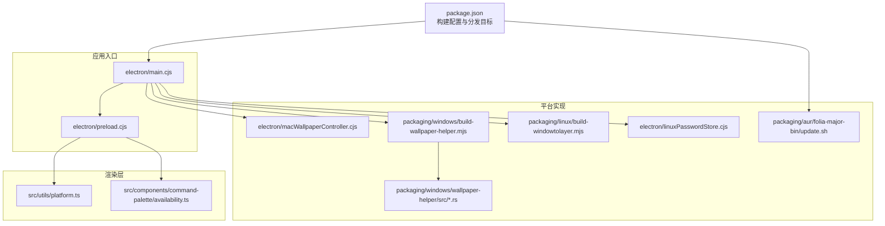
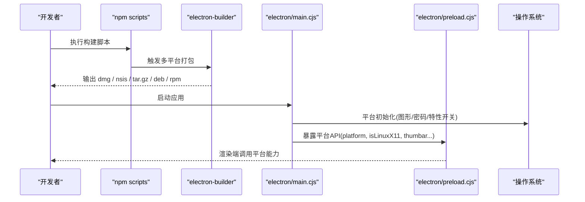
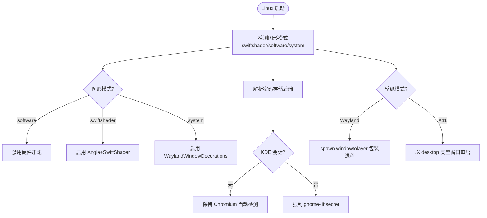
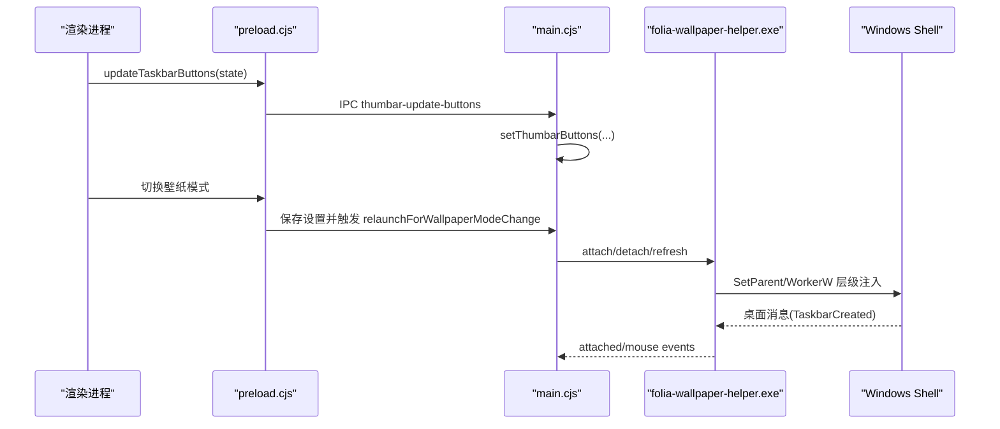
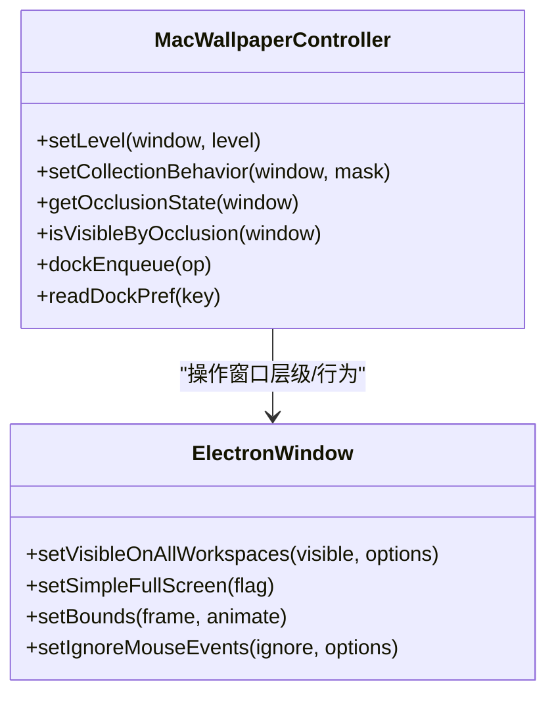
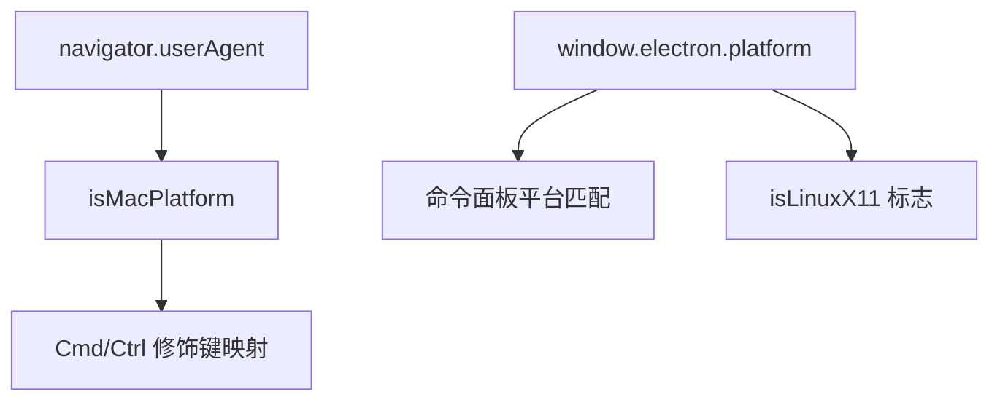
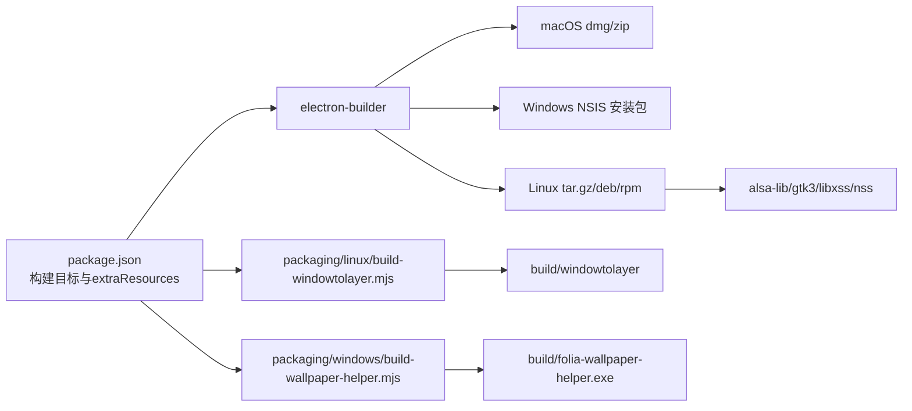

# 跨平台适配策略

<cite>
**本文引用的文件**   
- [package.json](file://package.json)
- [electron/main.cjs](file://electron/main.cjs)
- [electron/preload.cjs](file://electron/preload.cjs)
- [src/utils/platform.ts](file://src/utils/platform.ts)
- [src/components/command-palette/availability.ts](file://src/components/command-palette/availability.ts)
- [electron/linuxPasswordStore.cjs](file://electron/linuxPasswordStore.cjs)
- [packaging/linux/build-windowtolayer.mjs](file://packaging/linux/build-windowtolayer.mjs)
- [packaging/windows/build-wallpaper-helper.mjs](file://packaging/windows/build-wallpaper-helper.mjs)
- [packaging/aur/folia-major-bin/update.sh](file://packaging/aur/folia-major-bin/update.sh)
- [packaging/windows/wallpaper-helper/src/attach.rs](file://packaging/windows/wallpaper-helper/src/attach.rs)
- [packaging/windows/wallpaper-helper/src/message_window.rs](file://packaging/windows/wallpaper-helper/src/message_window.rs)
- [electron/macWallpaperController.cjs](file://electron/macWallpaperController.cjs)
</cite>

## 目录
1. [简介](#简介)
2. [项目结构](#项目结构)
3. [核心组件](#核心组件)
4. [架构总览](#架构总览)
5. [详细组件分析](#详细组件分析)
6. [依赖关系分析](#依赖关系分析)
7. [性能与资源管理](#性能与资源管理)
8. [故障排查指南](#故障排查指南)
9. [结论](#结论)

## 简介
本文件系统性梳理 Folia Major 在 Windows、macOS、Linux 三大平台的跨平台适配策略，覆盖平台检测、特性开关、兼容性保证、桌面集成、打包分发与性能优化。重点包括：
- Linux 的 Wayland/X11 支持、桌面环境适配与 AUR 包集成
- Windows 的任务栏缩略图、原生壁纸辅助进程与窗口层级控制
- macOS 的原生菜单栏图标、Dock 行为与全屏/工作区级窗口行为
- 构建脚本、依赖管理与不同平台的分发格式差异
- 平台特定的性能优化与资源管理策略

## 项目结构
Folia Major 基于 Electron 构建，前端使用 React/Vite，后端逻辑集中在 electron 主进程模块中；平台差异化主要分布在：
- electron/main.cjs：应用启动、平台初始化、壁纸模式、系统能力桥接
- electron/preload.cjs：渲染进程安全 API 暴露（含任务栏按钮、平台信息）
- src/utils/platform.ts 与 src/components/command-palette/availability.ts：渲染端平台检测与命令可用性门控
- packaging/*：各平台构建脚本与二进制产物
- electron/macWallpaperController.cjs：macOS 原生能力封装（koffi + CoreGraphics）

**图示来源**
- [package.json:62-199](file://package.json#L62-L199)
- [electron/main.cjs:55-141](file://electron/main.cjs#L55-L141)
- [electron/preload.cjs:71-73](file://electron/preload.cjs#L71-L73)
- [src/utils/platform.ts:1-25](file://src/utils/platform.ts#L1-L25)
- [src/components/command-palette/availability.ts:1-40](file://src/components/command-palette/availability.ts#L1-L40)
- [electron/macWallpaperController.cjs:153-177](file://electron/macWallpaperController.cjs#L153-L177)
- [packaging/windows/build-wallpaper-helper.mjs:1-34](file://packaging/windows/build-wallpaper-helper.mjs#L1-L34)
- [packaging/linux/build-windowtolayer.mjs:1-95](file://packaging/linux/build-windowtolayer.mjs#L1-L95)
- [electron/linuxPasswordStore.cjs:1-53](file://electron/linuxPasswordStore.cjs#L1-L53)
- [packaging/aur/folia-major-bin/update.sh:1-49](file://packaging/aur/folia-major-bin/update.sh#L1-L49)

**章节来源**
- [package.json:62-199](file://package.json#L62-L199)

## 核心组件
- 平台检测与命令门控
  - 渲染端通过用户代理判断 macOS，统一快捷键修饰键语义
  - 命令面板按平台（win/mac/linux/electron/web）声明式过滤可用项
- 主进程平台初始化
  - Linux：密码存储后端选择、Vulkan/Ozone/SwiftShader 图形回退
  - macOS：Intel x64 下 GPU 加速参数调优
  - 通用：视频捕获服务空闲释放特性启用
- 预加载桥接
  - 暴露 platform、isLinuxX11、任务栏缩略图更新等 IPC 接口
- 平台专属能力
  - Linux：windowtolayer 构建与运行、AUR 包元数据更新
  - Windows：wallpaper-helper.exe 构建与 WorkerW 层级注入
  - macOS：koffi 调用 NSWindow/CoreGraphics 设置窗口层级与 Dock 行为

**章节来源**
- [src/utils/platform.ts:1-25](file://src/utils/platform.ts#L1-L25)
- [src/components/command-palette/availability.ts:1-40](file://src/components/command-palette/availability.ts#L1-L40)
- [electron/main.cjs:55-173](file://electron/main.cjs#L55-L173)
- [electron/preload.cjs:71-73](file://electron/preload.cjs#L71-L73)
- [electron/preload.cjs:215-220](file://electron/preload.cjs#L215-L220)

## 架构总览
下图展示从构建到运行的跨平台路径：package.json 定义多平台构建目标；主进程根据平台进行能力初始化；预加载层向渲染端暴露平台相关 API；平台特定二进制由 packaging 脚本构建并随包分发。

**图示来源**
- [package.json:18-60](file://package.json#L18-L60)
- [package.json:62-199](file://package.json#L62-L199)
- [electron/main.cjs:55-173](file://electron/main.cjs#L55-L173)
- [electron/preload.cjs:71-73](file://electron/preload.cjs#L71-L73)

## 详细组件分析

### Linux 平台适配
- 图形与显示后端
  - 禁用 Vulkan，设置 Ozone 平台提示为 auto
  - 支持软件渲染与 SwiftShader 回退，AppImage 场景优先 Angle+SwiftShader
  - 启用 Wayland 窗口装饰特性
- 密码存储后端
  - 非 KDE 桌面默认强制 gnome-libsecret，避免 plaintext basic_text 导致凭据丢失
  - 支持命令行参数与环境变量覆盖
- Wayland/X11 壁纸模式
  - 通过 windowtolayer 子进程包装应用，Wayland 下以 layer-shell 方式呈现
  - X11 下以 desktop 类型窗口进入壁纸模式
- AUR 包集成
  - update.sh 自动更新 PKGBUILD/.SRCINFO 中的版本与校验和
  - 依赖 alsa-lib、gtk3、libxss、nss 等运行时库

**图示来源**
- [electron/main.cjs:114-141](file://electron/main.cjs#L114-L141)
- [electron/linuxPasswordStore.cjs:34-47](file://electron/linuxPasswordStore.cjs#L34-L47)
- [packaging/linux/build-windowtolayer.mjs:1-95](file://packaging/linux/build-windowtolayer.mjs#L1-L95)
- [packaging/aur/folia-major-bin/update.sh:1-49](file://packaging/aur/folia-major-bin/update.sh#L1-L49)

**章节来源**
- [electron/main.cjs:114-141](file://electron/main.cjs#L114-L141)
- [electron/linuxPasswordStore.cjs:1-53](file://electron/linuxPasswordStore.cjs#L1-L53)
- [packaging/linux/build-windowtolayer.mjs:1-95](file://packaging/linux/build-windowtolayer.mjs#L1-L95)
- [packaging/aur/folia-major-bin/update.sh:1-49](file://packaging/aur/folia-major-bin/update.sh#L1-L49)

### Windows 平台适配
- 任务栏缩略图按钮
  - 仅 Windows 支持，提供上一首/播放暂停/下一首按钮，状态驱动启用/禁用
  - 通过 preload 暴露 updateTaskbarControls 与 onTaskbarControl
- 壁纸模式与 WorkerW 层级
  - 使用 Rust 编写的 folia-wallpaper-helper.exe 将主窗口父化到 WorkerW 或 raised 桌面层级
  - 支持鼠标事件转发与桌面刷新
- 构建与分发
  - build-wallpaper-helper.mjs 仅在 Windows 主机上构建 Rust 二进制
  - NSIS 安装包，支持安装目录选择与多语言

**图示来源**
- [electron/preload.cjs:215-220](file://electron/preload.cjs#L215-L220)
- [electron/main.cjs:1844-1858](file://electron/main.cjs#L1844-L1858)
- [electron/main.cjs:2185-2238](file://electron/main.cjs#L2185-L2238)
- [packaging/windows/build-wallpaper-helper.mjs:1-34](file://packaging/windows/build-wallpaper-helper.mjs#L1-L34)
- [packaging/windows/wallpaper-helper/src/attach.rs:50-197](file://packaging/windows/wallpaper-helper/src/attach.rs#L50-L197)
- [packaging/windows/wallpaper-helper/src/message_window.rs:1-33](file://packaging/windows/wallpaper-helper/src/message_window.rs#L1-L33)

**章节来源**
- [electron/preload.cjs:215-220](file://electron/preload.cjs#L215-L220)
- [electron/main.cjs:1844-1858](file://electron/main.cjs#L1844-L1858)
- [electron/main.cjs:2185-2238](file://electron/main.cjs#L2185-L2238)
- [packaging/windows/build-wallpaper-helper.mjs:1-34](file://packaging/windows/build-wallpaper-helper.mjs#L1-L34)
- [packaging/windows/wallpaper-helper/src/attach.rs:50-197](file://packaging/windows/wallpaper-helper/src/attach.rs#L50-L197)
- [packaging/windows/wallpaper-helper/src/message_window.rs:1-33](file://packaging/windows/wallpaper-helper/src/message_window.rs#L1-L33)

### macOS 平台适配
- 菜单栏图标
  - 使用模板图像与 Retina 双分辨率资源，确保单色与透明背景
- 壁纸模式与 Dock
  - 通过 koffi 调用 NSWindow/CoreGraphics 设置窗口层级至桌面图标之下
  - 监听 CGEventTap 转发点击事件，支持 Dock 自动隐藏与恢复
  - 在全屏/工作区切换时维护窗口帧与集合行为位
- 图形加速优化
  - Intel x64 机型启用 ignore-gpu-blocklist、use-angle=gl、enable-gpu-rasterization

**图示来源**
- [electron/macWallpaperController.cjs:153-177](file://electron/macWallpaperController.cjs#L153-L177)
- [electron/macWallpaperController.cjs:281-302](file://electron/macWallpaperController.cjs#L281-L302)
- [electron/macWallpaperController.cjs:547-590](file://electron/macWallpaperController.cjs#L547-L590)
- [electron/macWallpaperController.cjs:918-937](file://electron/macWallpaperController.cjs#L918-L937)
- [electron/main.cjs:666-686](file://electron/main.cjs#L666-L686)

**章节来源**
- [electron/main.cjs:168-173](file://electron/main.cjs#L168-L173)
- [electron/main.cjs:1860-1896](file://electron/main.cjs#L1860-L1896)
- [electron/macWallpaperController.cjs:153-177](file://electron/macWallpaperController.cjs#L153-L177)
- [electron/macWallpaperController.cjs:281-302](file://electron/macWallpaperController.cjs#L281-L302)
- [electron/macWallpaperController.cjs:547-590](file://electron/macWallpaperController.cjs#L547-L590)
- [electron/macWallpaperController.cjs:918-937](file://electron/macWallpaperController.cjs#L918-L937)

### 平台检测与特性开关
- 渲染端平台检测
  - 通过 navigator.userAgent 识别 macOS，统一 Cmd/Ctrl 修饰键语义
- 命令面板平台门控
  - 将 Node 平台映射为 win/mac/linux，结合是否 Electron 环境决定命令可见性
- 预加载平台信息
  - 暴露 platform 与 isLinuxX11，供上层 UI 与功能开关使用

**图示来源**
- [src/utils/platform.ts:1-25](file://src/utils/platform.ts#L1-L25)
- [src/components/command-palette/availability.ts:1-40](file://src/components/command-palette/availability.ts#L1-L40)
- [electron/preload.cjs:71-73](file://electron/preload.cjs#L71-L73)

**章节来源**
- [src/utils/platform.ts:1-25](file://src/utils/platform.ts#L1-L25)
- [src/components/command-palette/availability.ts:1-40](file://src/components/command-palette/availability.ts#L1-L40)
- [electron/preload.cjs:71-73](file://electron/preload.cjs#L71-L73)

## 依赖关系分析
- 构建与分发
  - package.json 中 electron-builder 配置了 mac/win/linux 的目标与产物名
  - Windows 使用 NSIS 安装包；macOS 输出 dmg/zip；Linux 输出 tar.gz/deb/rpm
  - extraResources 包含 ffmpeg、图标、trayTemplate、desktop 条目与 windowtolayer 二进制
- 平台二进制构建
  - Linux：build-windowtolayer.mjs 拉取上游源码、打补丁、cargo 构建并复制产物
  - Windows：build-wallpaper-helper.mjs 在 Windows 主机上 cargo 构建 helper 可执行文件
- 运行时依赖
  - Linux 依赖 alsa-lib、gtk3、libxss、nss（AUR 元数据）
  - macOS 依赖 CoreGraphics/libobjc（通过 koffi）
  - Windows 依赖 shell 层级与 WorkerW 机制

**图示来源**
- [package.json:62-199](file://package.json#L62-L199)
- [packaging/linux/build-windowtolayer.mjs:1-95](file://packaging/linux/build-windowtolayer.mjs#L1-L95)
- [packaging/windows/build-wallpaper-helper.mjs:1-34](file://packaging/windows/build-wallpaper-helper.mjs#L1-L34)
- [packaging/aur/folia-major-bin/update.sh:23-46](file://packaging/aur/folia-major-bin/update.sh#L23-L46)

**章节来源**
- [package.json:62-199](file://package.json#L62-L199)
- [packaging/linux/build-windowtolayer.mjs:1-95](file://packaging/linux/build-windowtolayer.mjs#L1-L95)
- [packaging/windows/build-wallpaper-helper.mjs:1-34](file://packaging/windows/build-wallpaper-helper.mjs#L1-L34)
- [packaging/aur/folia-major-bin/update.sh:23-46](file://packaging/aur/folia-major-bin/update.sh#L23-L46)

## 性能与资源管理
- Linux 图形管线
  - AppImage 场景使用 SwiftShader 避免 GPU 崩溃与模糊问题
  - 可选完全软件渲染作为最安全回退
- macOS 渲染优化
  - Intel x64 机型启用 GPU 光栅化与 Angle GL，缓解 Retina 卡顿
- 视频捕获服务生命周期
  - 在非 Linux 平台启用 ReleaseVideoSourceProviderIfNotInUse，减少设备枚举后残留进程
- 内存与资源
  - 预加载层暴露调试内存采样接口，便于定位渲染进程内存占用
  - extraResources 按需打包二进制与图标，减小包体体积

**章节来源**
- [electron/main.cjs:128-141](file://electron/main.cjs#L128-L141)
- [electron/main.cjs:164-173](file://electron/main.cjs#L164-L173)
- [electron/main.cjs:143-166](file://electron/main.cjs#L143-L166)
- [electron/preload.cjs:34-48](file://electron/preload.cjs#L34-L48)
- [package.json:95-132](file://package.json#L95-L132)

## 故障排查指南
- Linux 无法持久化登录凭据
  - 检查是否处于 KDE 会话（保持 Chromium 自动检测）
  - 确认未显式传入 --password-store 或环境变量 FOLIA_PASSWORD_STORE
  - 非 KDE 会话应使用 gnome-libsecret
- Wayland 下壁纸模式不可用
  - 确认已构建 windowtolayer 二进制且路径正确
  - 查看 spawn 错误日志，必要时回退普通窗口模式
- Windows 任务栏缩略图不显示
  - 确认当前平台为 win32 且 main 窗口存在
  - 检查 THUMBAR_BUTTON_ICONS 资源是否打包
- macOS Dock 异常
  - 检查 Dock 进程是否存在与偏好写入队列是否冲突
  - 观察 defaults read com.apple.dock 返回值与 killall Dock 结果

**章节来源**
- [electron/linuxPasswordStore.cjs:34-47](file://electron/linuxPasswordStore.cjs#L34-L47)
- [electron/main.cjs:246-273](file://electron/main.cjs#L246-L273)
- [electron/main.cjs:1844-1858](file://electron/main.cjs#L1844-L1858)
- [electron/macWallpaperController.cjs:547-590](file://electron/macWallpaperController.cjs#L547-L590)

## 结论
Folia Major 通过集中化的平台检测、清晰的特性开关与平台专属实现，实现了 Windows、macOS、Linux 的一致体验与差异化增强。Linux 侧对 Wayland/X11 与桌面环境的兼容处理、Windows 侧的 WorkerW 层级与任务栏集成、macOS 侧的原生窗口层级与 Dock 行为，均体现了工程上的稳健性与可维护性。构建脚本与分发配置清晰分离，便于 CI 与本地开发复用。未来可在更多桌面环境下扩展密码存储后端、完善 Wayland 交互细节，并持续优化图形管线在不同硬件组合下的稳定性与性能。