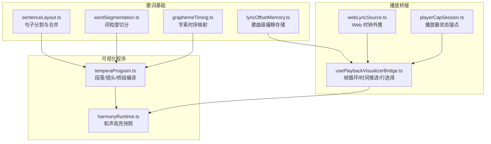
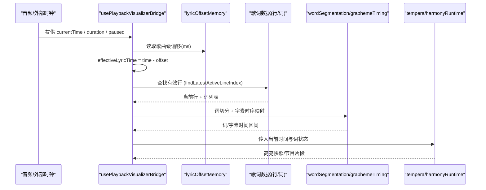
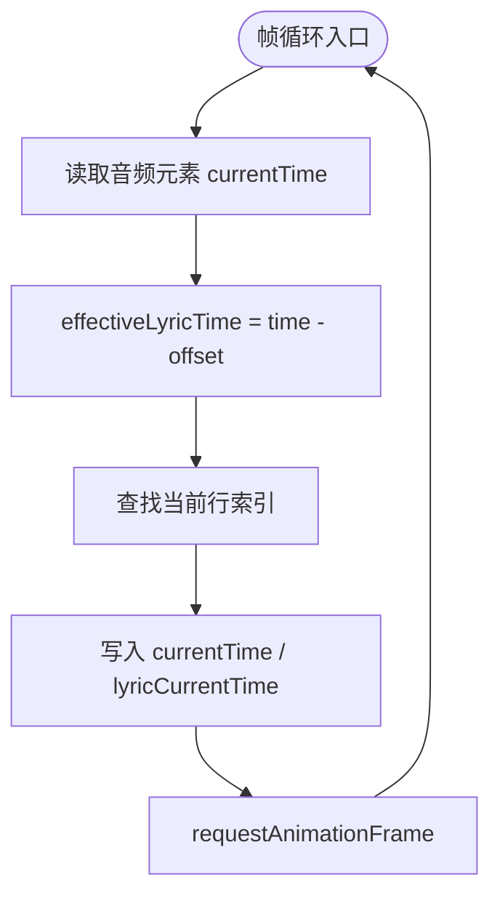
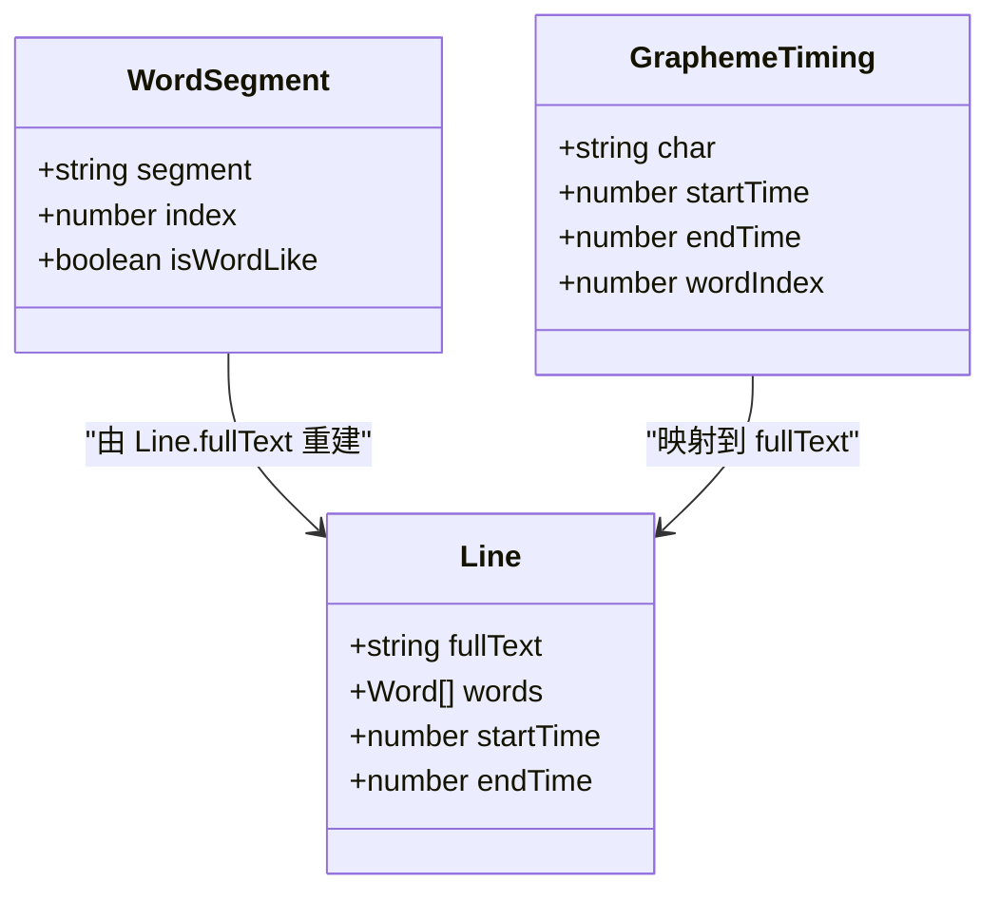
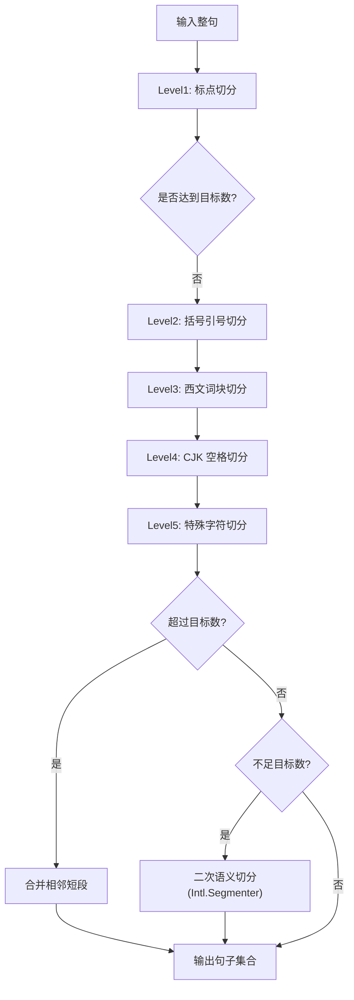
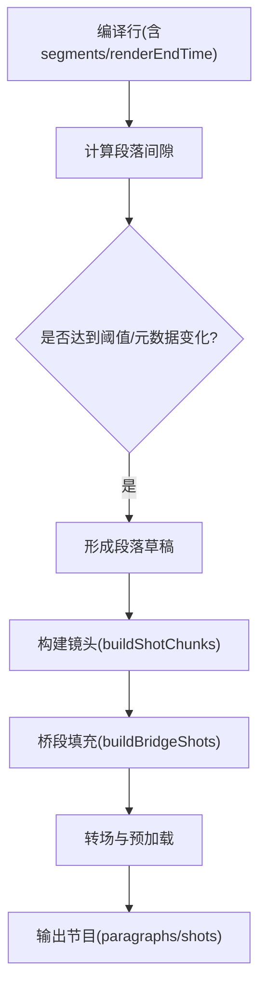
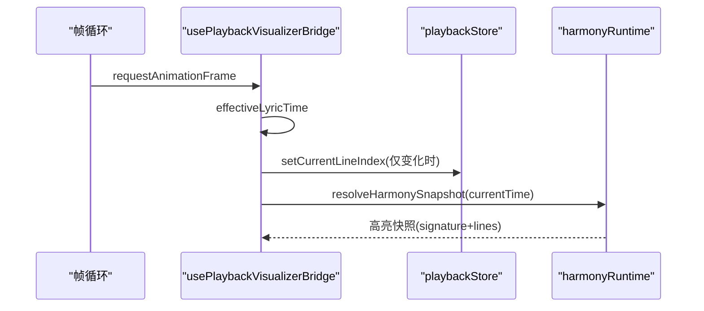
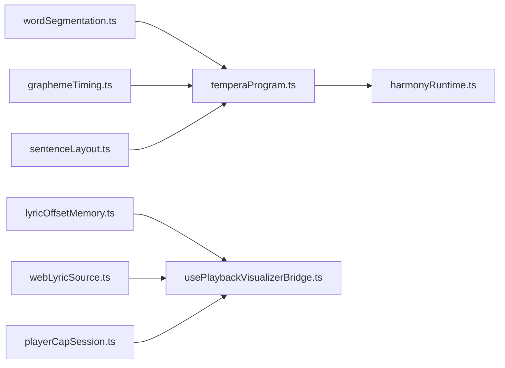

# 时间轴同步

<cite>
**本文引用的文件**   
- [src/utils/lyrics/sentenceLayout.ts](file://src/utils/lyrics/sentenceLayout.ts)
- [src/utils/lyrics/graphemeTiming.ts](file://src/utils/lyrics/graphemeTiming.ts)
- [src/utils/lyrics/wordSegmentation.ts](file://src/utils/lyrics/wordSegmentation.ts)
- [src/components/visualizer/tempera/temperaProgram.ts](file://src/components/visualizer/tempera/temperaProgram.ts)
- [src/components/visualizer/harmonyRuntime.ts](file://src/components/visualizer/harmonyRuntime.ts)
- [src/hooks/usePlaybackVisualizerBridge.ts](file://src/hooks/usePlaybackVisualizerBridge.ts)
- [src/utils/webLyricSource.ts](file://src/utils/webLyricSource.ts)
- [src/utils/playerCapSession.ts](file://src/utils/playerCapSession.ts)
- [src/utils/lyrics/lyricOffsetMemory.ts](file://src/utils/lyrics/lyricOffsetMemory.ts)
</cite>

## 目录
1. [简介](#简介)
2. [项目结构](#项目结构)
3. [核心组件](#核心组件)
4. [架构总览](#架构总览)
5. [详细组件分析](#详细组件分析)
6. [依赖关系分析](#依赖关系分析)
7. [性能考虑](#性能考虑)
8. [故障排查指南](#故障排查指南)
9. [结论](#结论)

## 简介
本技术文档聚焦 Folia Major 的歌词时间轴同步系统，覆盖以下关键能力：
- 歌词与音频播放的精确同步机制：时间偏移校正、播放进度跟踪、实时高亮更新。
- 逐词高亮算法：基于词边界与音素级字素时序，处理不同语言字符边界（CJK 语义布局）。
- 句子级别歌词布局计算：文本测量、换行处理与动态调整。
- 时间轴分割算法：将连续歌词时间轴切分为可管理的片段（段落、镜头、桥段）。
- 时间同步的性能优化：增量更新、批量渲染、防抖策略。
- 调试工具与技术：用于诊断和解决同步问题。

## 项目结构
围绕“时间轴同步”的核心代码分布在 utils、components/visualizer、hooks 三个层次：
- utils/lyrics：歌词基础能力（字素时序、词切分、句子布局、偏移持久化）。
- components/visualizer：可视化程序编译与运行时（Tempera 节目构建、和声高亮快照）。
- hooks：播放与可视化桥接（帧循环、时间推进、当前行选择）。

**图示来源**
- [src/utils/lyrics/sentenceLayout.ts:49-84](file://src/utils/lyrics/sentenceLayout.ts#L49-L84)
- [src/utils/lyrics/wordSegmentation.ts:100-107](file://src/utils/lyrics/wordSegmentation.ts#L100-L107)
- [src/utils/lyrics/graphemeTiming.ts:85-154](file://src/utils/lyrics/graphemeTiming.ts#L85-L154)
- [src/utils/lyrics/lyricOffsetMemory.ts:66-95](file://src/utils/lyrics/lyricOffsetMemory.ts#L66-L95)
- [src/components/visualizer/tempera/temperaProgram.ts:515-631](file://src/components/visualizer/tempera/temperaProgram.ts#L515-L631)
- [src/components/visualizer/harmonyRuntime.ts:95-117](file://src/components/visualizer/harmonyRuntime.ts#L95-L117)
- [src/hooks/usePlaybackVisualizerBridge.ts:77-146](file://src/hooks/usePlaybackVisualizerBridge.ts#L77-L146)
- [src/utils/webLyricSource.ts:9-14](file://src/utils/webLyricSource.ts#L9-L14)
- [src/utils/playerCapSession.ts:119-145](file://src/utils/playerCapSession.ts#L119-L145)

**章节来源**
- [src/utils/lyrics/sentenceLayout.ts:49-84](file://src/utils/lyrics/sentenceLayout.ts#L49-L84)
- [src/utils/lyrics/wordSegmentation.ts:100-107](file://src/utils/lyrics/wordSegmentation.ts#L100-L107)
- [src/utils/lyrics/graphemeTiming.ts:85-154](file://src/utils/lyrics/graphemeTiming.ts#L85-L154)
- [src/utils/lyrics/lyricOffsetMemory.ts:66-95](file://src/utils/lyrics/lyricOffsetMemory.ts#L66-L95)
- [src/components/visualizer/tempera/temperaProgram.ts:515-631](file://src/components/visualizer/tempera/temperaProgram.ts#L515-L631)
- [src/components/visualizer/harmonyRuntime.ts:95-117](file://src/components/visualizer/harmonyRuntime.ts#L95-L117)
- [src/hooks/usePlaybackVisualizerBridge.ts:77-146](file://src/hooks/usePlaybackVisualizerBridge.ts#L77-L146)
- [src/utils/webLyricSource.ts:9-14](file://src/utils/webLyricSource.ts#L9-L14)
- [src/utils/playerCapSession.ts:119-145](file://src/utils/playerCapSession.ts#L119-L145)

## 核心组件
- 歌词基础层
  - 句子布局与分割：按标点、括号引号、西文词块、CJK 空格、特殊字符多级切分，支持二次语义切分与合并。
  - 词粒度切分：优先使用用户保存的词边界；否则回退到 Intl.Segmenter 或字粒度。
  - 字素时序：将解析器提供的词/音节时序映射到显示文本的字素序列，补齐未带时间的空白与标点。
  - 时间偏移持久化：按歌曲键值存储手动时间偏移，跨曲目恢复。
- 可视化程序层
  - Tempera 节目编译：将歌词行编译为段落、镜头、桥段，并生成确定性装饰与相机轨迹。
  - 和声高亮快照：根据当前时间对背景人声词进行等待/活跃/已过的离散状态标记。
- 播放桥接层
  - 帧循环驱动：从音频元素或外部时钟获取播放位置，应用全局歌词时间偏移，选择当前行索引。
  - Web 时钟外推：在播放中推进时间，暂停时冻结，已知时长时钳制范围。
  - PlayerCap 会话：以 position 为锚点重建插值，避免暂停后回放缓存导致的时间漂移。

**章节来源**
- [src/utils/lyrics/sentenceLayout.ts:49-84](file://src/utils/lyrics/sentenceLayout.ts#L49-L84)
- [src/utils/lyrics/wordSegmentation.ts:100-107](file://src/utils/lyrics/wordSegmentation.ts#L100-L107)
- [src/utils/lyrics/graphemeTiming.ts:85-154](file://src/utils/lyrics/graphemeTiming.ts#L85-L154)
- [src/utils/lyrics/lyricOffsetMemory.ts:66-95](file://src/utils/lyrics/lyricOffsetMemory.ts#L66-L95)
- [src/components/visualizer/tempera/temperaProgram.ts:515-631](file://src/components/visualizer/tempera/temperaProgram.ts#L515-L631)
- [src/components/visualizer/harmonyRuntime.ts:95-117](file://src/components/visualizer/harmonyRuntime.ts#L95-L117)
- [src/hooks/usePlaybackVisualizerBridge.ts:77-146](file://src/hooks/usePlaybackVisualizerBridge.ts#L77-L146)
- [src/utils/webLyricSource.ts:9-14](file://src/utils/webLyricSource.ts#L9-L14)
- [src/utils/playerCapSession.ts:119-145](file://src/utils/playerCapSession.ts#L119-L145)

## 架构总览
下图展示从播放源到歌词高亮的端到端数据流：播放时钟 → 时间偏移校正 → 当前行选择 → 词/字素高亮 → 可视化渲染。

**图示来源**
- [src/hooks/usePlaybackVisualizerBridge.ts:133-146](file://src/hooks/usePlaybackVisualizerBridge.ts#L133-L146)
- [src/utils/lyrics/lyricOffsetMemory.ts:66-95](file://src/utils/lyrics/lyricOffsetMemory.ts#L66-L95)
- [src/utils/lyrics/wordSegmentation.ts:100-107](file://src/utils/lyrics/wordSegmentation.ts#L100-L107)
- [src/utils/lyrics/graphemeTiming.ts:85-154](file://src/utils/lyrics/graphemeTiming.ts#L85-L154)
- [src/components/visualizer/harmonyRuntime.ts:95-117](file://src/components/visualizer/harmonyRuntime.ts#L95-L117)
- [src/components/visualizer/tempera/temperaProgram.ts:515-631](file://src/components/visualizer/tempera/temperaProgram.ts#L515-L631)

## 详细组件分析

### 时间偏移校正与播放进度跟踪
- 播放桥接在每帧计算 effectiveLyricTime = audio.currentTime - lyricTimelineOffsetMs/1000，并将该时间写入共享信号，供所有可视化消费。
- 当处于 Now Playing 或 PlayerCap 模式时，分别通过 getNowPlayingDisplayTime/getPlayerCapDisplayTime 获取显示时间，再应用相同偏移。
- webLyricSource.currentWebLyricTimeSec 负责从时钟锚点外推真实时间，并在已知时长时钳制到 [0, duration]。
- playerCapSession 在收到 playback_pause/playback_resume/lyric_update 时以 position 为锚点重建插值，避免暂停后回放缓存造成时间漂移。

**图示来源**
- [src/hooks/usePlaybackVisualizerBridge.ts:133-146](file://src/hooks/usePlaybackVisualizerBridge.ts#L133-L146)
- [src/utils/webLyricSource.ts:9-14](file://src/utils/webLyricSource.ts#L9-L14)
- [src/utils/playerCapSession.ts:119-145](file://src/utils/playerCapSession.ts#L119-L145)

**章节来源**
- [src/hooks/usePlaybackVisualizerBridge.ts:133-146](file://src/hooks/usePlaybackVisualizerBridge.ts#L133-L146)
- [src/utils/webLyricSource.ts:9-14](file://src/utils/webLyricSource.ts#L9-L14)
- [src/utils/playerCapSession.ts:119-145](file://src/utils/playerCapSession.ts#L119-L145)

### 逐词高亮算法与 CJK 语义布局
- 词切分：segmentLyricWords 优先采用用户保存的词边界（需校验可逆），否则使用 Intl.Segmenter 或字粒度回退。
- 字素时序：buildLineGraphemeTimeline 将 line.words 映射到 fullText 的字素序列，未带时间的空白/标点用 lastResolvedTime 填充，保证显示文本完整且时序不丢失。
- 粘性标点：temperaProgram.buildTemperaSegments 将无独立时间的标点向前合并，避免符号被“孤立”。
- Harmony 高亮：harmonyRuntime.resolveHarmonySnapshotFromVocals 根据 currentTime 对每个词判定 waiting/active/passed，并保留未带时间的空白与标点为 static token。

**图示来源**
- [src/utils/lyrics/wordSegmentation.ts:14-19](file://src/utils/lyrics/wordSegmentation.ts#L14-L19)
- [src/utils/lyrics/graphemeTiming.ts:6-11](file://src/utils/lyrics/graphemeTiming.ts#L6-L11)
- [src/utils/lyrics/graphemeTiming.ts:85-154](file://src/utils/lyrics/graphemeTiming.ts#L85-L154)
- [src/components/visualizer/tempera/temperaProgram.ts:59-113](file://src/components/visualizer/tempera/temperaProgram.ts#L59-L113)
- [src/components/visualizer/harmonyRuntime.ts:50-93](file://src/components/visualizer/harmonyRuntime.ts#L50-L93)

**章节来源**
- [src/utils/lyrics/wordSegmentation.ts:100-107](file://src/utils/lyrics/wordSegmentation.ts#L100-L107)
- [src/utils/lyrics/graphemeTiming.ts:85-154](file://src/utils/lyrics/graphemeTiming.ts#L85-L154)
- [src/components/visualizer/tempera/temperaProgram.ts:59-113](file://src/components/visualizer/tempera/temperaProgram.ts#L59-L113)
- [src/components/visualizer/harmonyRuntime.ts:50-93](file://src/components/visualizer/harmonyRuntime.ts#L50-L93)

### 句子级别的歌词布局计算
- 多级分割：SentenceLayout.splitIntoSentences 按标点→括号引号→西文词块→CJK 空格→特殊字符逐级切分，达到目标数量后停止。
- 二次语义切分：secondarySplit 使用 Intl.Segmenter(word) 寻找语义断点，并以平衡得分选择最佳切位；若不可用则伪随机中点切分。
- 合并策略：mergeSentences 按相邻两段长度最短原则合并，确保不超过目标数量。
- CJK 语义布局：splitCJKBySpace 区分全角/半角空格与 CJK 块，保持西文字符跟随当前块，避免误切。

**图示来源**
- [src/utils/lyrics/sentenceLayout.ts:49-84](file://src/utils/lyrics/sentenceLayout.ts#L49-L84)
- [src/utils/lyrics/sentenceLayout.ts:87-101](file://src/utils/lyrics/sentenceLayout.ts#L87-L101)
- [src/utils/lyrics/sentenceLayout.ts:435-521](file://src/utils/lyrics/sentenceLayout.ts#L435-L521)
- [src/utils/lyrics/sentenceLayout.ts:523-544](file://src/utils/lyrics/sentenceLayout.ts#L523-L544)
- [src/utils/lyrics/sentenceLayout.ts:318-386](file://src/utils/lyrics/sentenceLayout.ts#L318-L386)

**章节来源**
- [src/utils/lyrics/sentenceLayout.ts:49-84](file://src/utils/lyrics/sentenceLayout.ts#L49-L84)
- [src/utils/lyrics/sentenceLayout.ts:435-521](file://src/utils/lyrics/sentenceLayout.ts#L435-L521)
- [src/utils/lyrics/sentenceLayout.ts:523-544](file://src/utils/lyrics/sentenceLayout.ts#L523-L544)
- [src/utils/lyrics/sentenceLayout.ts:318-386](file://src/utils/lyrics/sentenceLayout.ts#L318-L386)

### 时间轴分割算法（段落、镜头、桥段）
- 段落划分：compileTemperaProgram 根据 renderEndTime 与下一行 startTime 的 gap 阈值划分段落，并在元数据变化或长间隙处切分。
- 镜头构建：buildShotChunks 将可渲染词片段组合成镜头，默认按 2..4 词或 ~2.2s 切分；wholeLineLyrics 模式下整行作为一个镜头。
- 桥段填充：buildBridgeShots 在无歌词的间奏段插入空歌词镜头，保持视觉流动与转场衔接。
- 过渡与预加载：transitionOut 与 incoming.startTime 提前启动，使新场景在转场期间已有内容。

**图示来源**
- [src/components/visualizer/tempera/temperaProgram.ts:515-631](file://src/components/visualizer/tempera/temperaProgram.ts#L515-L631)
- [src/components/visualizer/tempera/temperaProgram.ts:177-243](file://src/components/visualizer/tempera/temperaProgram.ts#L177-L243)
- [src/components/visualizer/tempera/temperaProgram.ts:458-513](file://src/components/visualizer/tempera/temperaProgram.ts#L458-L513)

**章节来源**
- [src/components/visualizer/tempera/temperaProgram.ts:515-631](file://src/components/visualizer/tempera/temperaProgram.ts#L515-L631)
- [src/components/visualizer/tempera/temperaProgram.ts:177-243](file://src/components/visualizer/tempera/temperaProgram.ts#L177-L243)
- [src/components/visualizer/tempera/temperaProgram.ts:458-513](file://src/components/visualizer/tempera/temperaProgram.ts#L458-L513)

### 实时高亮更新与增量渲染
- 行选择：usePlaybackVisualizerBridge 在每帧调用 findLatestActiveLineIndex，仅当索引变化时更新 store，减少重渲染。
- 词状态快照：harmonyRuntime 根据 currentTime 对词进行 waiting/active/passed 分类，static token 保留未带时间的空白与标点。
- 粘性标点合并：temperaProgram 将无时间的标点与前一段合并，避免符号被孤立，同时修正零长度字素的时序。

**图示来源**
- [src/hooks/usePlaybackVisualizerBridge.ts:133-146](file://src/hooks/usePlaybackVisualizerBridge.ts#L133-L146)
- [src/components/visualizer/harmonyRuntime.ts:95-117](file://src/components/visualizer/harmonyRuntime.ts#L95-L117)
- [src/components/visualizer/tempera/temperaProgram.ts:89-113](file://src/components/visualizer/tempera/temperaProgram.ts#L89-L113)

**章节来源**
- [src/hooks/usePlaybackVisualizerBridge.ts:133-146](file://src/hooks/usePlaybackVisualizerBridge.ts#L133-L146)
- [src/components/visualizer/harmonyRuntime.ts:95-117](file://src/components/visualizer/harmonyRuntime.ts#L95-L117)
- [src/components/visualizer/tempera/temperaProgram.ts:89-113](file://src/components/visualizer/tempera/temperaProgram.ts#L89-L113)

## 依赖关系分析
- 低耦合：utils/lyrics 提供纯函数式工具，不依赖 UI 与播放状态；可视化程序消费这些工具生成确定性节目；播放桥接只关心时间推进与行选择。
- 直接依赖：
  - temperaProgram.ts 依赖 wordSegmentation.ts 与 graphemeTiming.ts。
  - harmonyRuntime.ts 依赖 types 与 alternateText 工具。
  - usePlaybackVisualizerBridge.ts 依赖 stores/motionSignals 与 appPlaybackHelpers。
- 间接依赖：
  - lyricOffsetMemory.ts 通过 localStorage 持久化，不影响主渲染路径。
  - webLyricSource.ts 与 playerCapSession.ts 为外部时钟与播放器状态提供稳定时间源。

**图示来源**
- [src/utils/lyrics/wordSegmentation.ts:100-107](file://src/utils/lyrics/wordSegmentation.ts#L100-L107)
- [src/utils/lyrics/graphemeTiming.ts:85-154](file://src/utils/lyrics/graphemeTiming.ts#L85-L154)
- [src/utils/lyrics/sentenceLayout.ts:49-84](file://src/utils/lyrics/sentenceLayout.ts#L49-L84)
- [src/utils/lyrics/lyricOffsetMemory.ts:66-95](file://src/utils/lyrics/lyricOffsetMemory.ts#L66-L95)
- [src/utils/webLyricSource.ts:9-14](file://src/utils/webLyricSource.ts#L9-L14)
- [src/utils/playerCapSession.ts:119-145](file://src/utils/playerCapSession.ts#L119-L145)
- [src/components/visualizer/tempera/temperaProgram.ts:515-631](file://src/components/visualizer/tempera/temperaProgram.ts#L515-L631)
- [src/components/visualizer/harmonyRuntime.ts:95-117](file://src/components/visualizer/harmonyRuntime.ts#L95-L117)
- [src/hooks/usePlaybackVisualizerBridge.ts:77-146](file://src/hooks/usePlaybackVisualizerBridge.ts#L77-L146)

**章节来源**
- [src/utils/lyrics/wordSegmentation.ts:100-107](file://src/utils/lyrics/wordSegmentation.ts#L100-L107)
- [src/utils/lyrics/graphemeTiming.ts:85-154](file://src/utils/lyrics/graphemeTiming.ts#L85-L154)
- [src/utils/lyrics/sentenceLayout.ts:49-84](file://src/utils/lyrics/sentenceLayout.ts#L49-L84)
- [src/utils/lyrics/lyricOffsetMemory.ts:66-95](file://src/utils/lyrics/lyricOffsetMemory.ts#L66-L95)
- [src/utils/webLyricSource.ts:9-14](file://src/utils/webLyricSource.ts#L9-L14)
- [src/utils/playerCapSession.ts:119-145](file://src/utils/playerCapSession.ts#L119-L145)
- [src/components/visualizer/tempera/temperaProgram.ts:515-631](file://src/components/visualizer/tempera/temperaProgram.ts#L515-L631)
- [src/components/visualizer/harmonyRuntime.ts:95-117](file://src/components/visualizer/harmonyRuntime.ts#L95-L117)
- [src/hooks/usePlaybackVisualizerBridge.ts:77-146](file://src/hooks/usePlaybackVisualizerBridge.ts#L77-L146)

## 性能考虑
- 增量更新：仅在 currentLineIndex 变化时更新 store，避免整行重渲染。
- 批量渲染：temperaProgram 将词片段批量组装为镜头，减少频繁切换；段落与桥段统一走同一套相机与装饰管线。
- 防抖与节流：
  - 帧循环使用 requestAnimationFrame，天然节流至显示器刷新率。
  - lyricOffsetMemory 对 localStorage 读写做 try/catch 保护，避免阻塞主线程。
- 缓存与复用：
  - wordSegmentation 使用 isValidWordSegmentation 校验用户保存的分词，避免重复切分。
  - sentenceLayout 使用 charCountCache 加速全局字符计数。
- 时间稳定性：
  - playerCapSession 以 position 为锚点重建插值，避免暂停后回放缓存导致的跳变。
  - webLyricSource 在已知时长时钳制时间范围，防止越界。

[本节为通用性能建议，不直接分析具体文件]

## 故障排查指南
- 歌词延迟/提前
  - 检查 lyricTimelineOffsetMs 是否正确应用：usePlaybackVisualizerBridge 在每帧计算 effectiveLyricTime。
  - 确认 lyricOffsetMemory 中对应歌曲的偏移是否被正确读取与持久化。
- 行切换异常
  - 验证 findLatestActiveLineIndex 的行为是否符合预期（测试用例覆盖边界与向后 seek）。
  - 检查 renderHints.renderEndTime 是否延长了可视尾，避免过早切换到下一行。
- 词高亮错位
  - 确认 segmentLyricWords 是否使用了有效的用户分词；否则回退到 Intl.Segmenter。
  - 检查 buildLineGraphemeTimeline 是否能将 line.words 映射到 fullText 的字素序列，空白与标点是否被正确填充。
- 标点孤立或粘连
  - 查看 temperaProgram.buildTemperaSegments 的粘性标点合并逻辑，确保无时间标点被前移。
- 时间轴断裂
  - 检查 compileTemperaProgram 的段落间隙阈值与 metadataChanged 条件，确认段落切分合理。
  - 确认 bridgeShots 是否在足够长的间奏中插入镜头，避免视觉停滞。

**章节来源**
- [src/hooks/usePlaybackVisualizerBridge.ts:133-146](file://src/hooks/usePlaybackVisualizerBridge.ts#L133-L146)
- [src/utils/lyrics/lyricOffsetMemory.ts:66-95](file://src/utils/lyrics/lyricOffsetMemory.ts#L66-L95)
- [test/unit/lattice/latticeLyrics.test.ts:116-135](file://test/unit/lattice/latticeLyrics.test.ts#L116-L135)
- [src/utils/lyrics/wordSegmentation.ts:100-107](file://src/utils/lyrics/wordSegmentation.ts#L100-L107)
- [src/utils/lyrics/graphemeTiming.ts:85-154](file://src/utils/lyrics/graphemeTiming.ts#L85-L154)
- [src/components/visualizer/tempera/temperaProgram.ts:89-113](file://src/components/visualizer/tempera/temperaProgram.ts#L89-L113)
- [src/components/visualizer/tempera/temperaProgram.ts:515-631](file://src/components/visualizer/tempera/temperaProgram.ts#L515-L631)

## 结论
Folia Major 的歌词时间轴同步系统通过“播放桥接 + 歌词基础 + 可视化程序”三层架构，实现了高精度、可扩展且稳定的歌词同步与高亮。其关键优势包括：
- 精确的时间偏移校正与多源时钟外推，确保在不同播放模式下保持一致性。
- 完善的词/字素时序映射与粘性标点处理，适配多语言与 CJK 语义布局。
- 灵活的句子分割与时间轴切分，支持段落、镜头与桥段的确定性编排。
- 增量更新与批量渲染策略，保障高帧率下的流畅体验。
- 健壮的持久化与错误防护，提升用户体验与系统鲁棒性。

[本节为总结性内容，不直接分析具体文件]