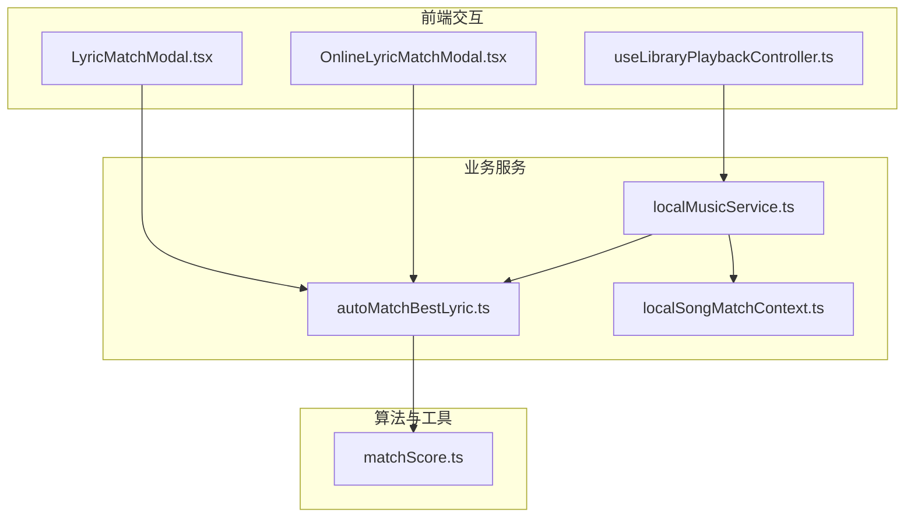
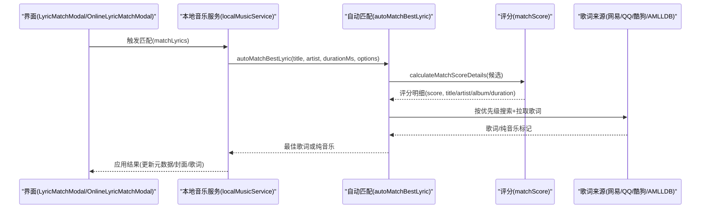
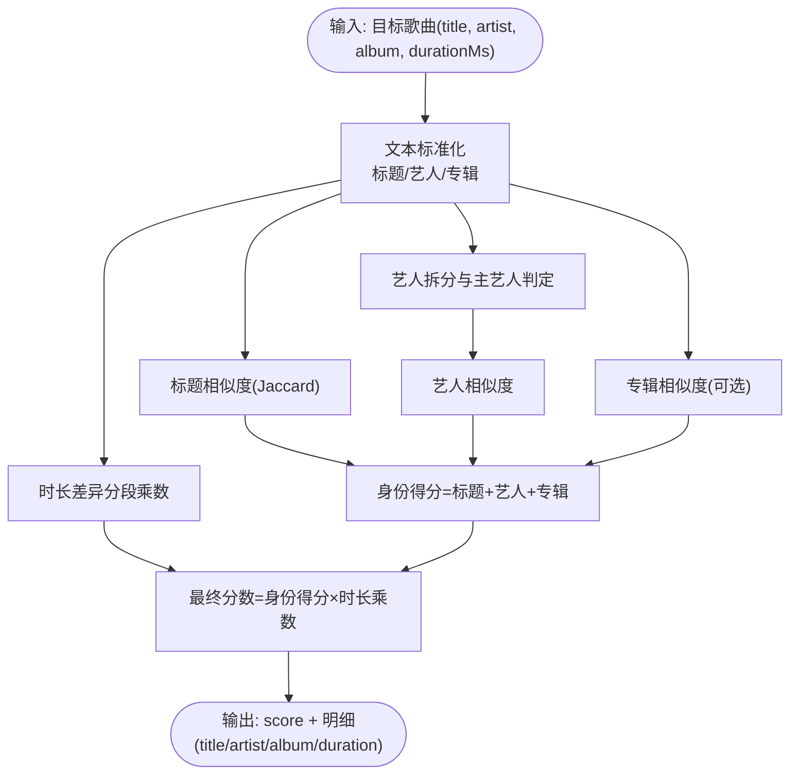
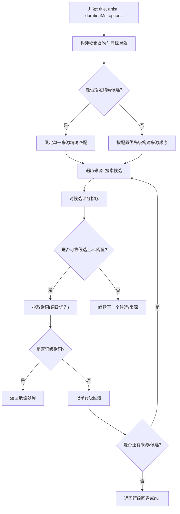
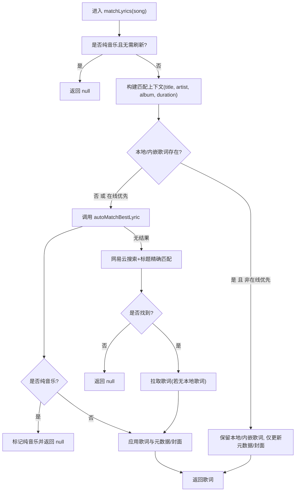
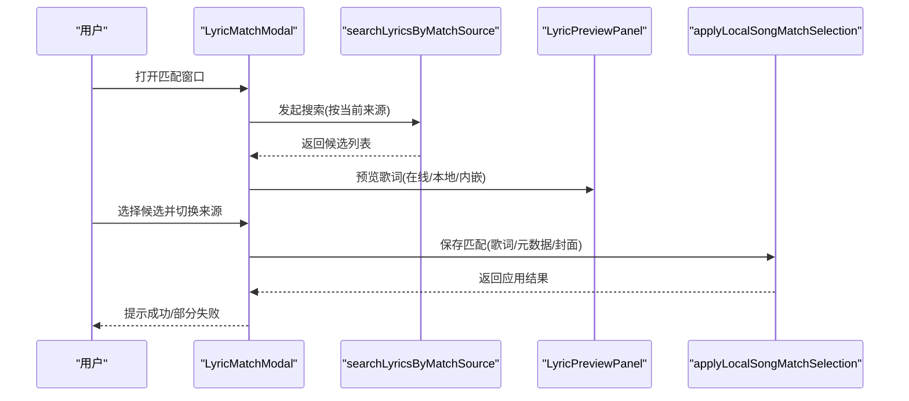
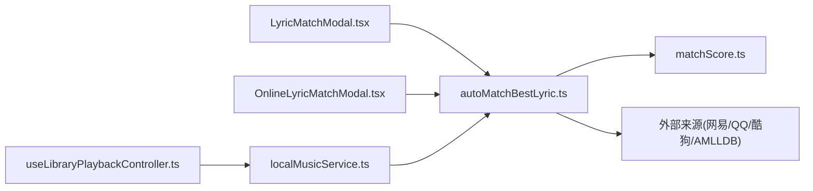

# 歌词匹配系统

<cite>
**本文引用的文件**   
- [matchScore.ts](file://src/utils/lyrics/matchScore.ts)
- [autoMatchBestLyric.ts](file://src/utils/lyrics/autoMatchBestLyric.ts)
- [localSongMatchContext.ts](file://src/utils/lyrics/localSongMatchContext.ts)
- [localMusicService.ts](file://src/services/localMusicService.ts)
- [LyricMatchModal.tsx](file://src/components/modal/LyricMatchModal.tsx)
- [OnlineLyricMatchModal.tsx](file://src/components/modal/OnlineLyricMatchModal.tsx)
- [useLibraryPlaybackController.ts](file://src/hooks/useLibraryPlaybackController.ts)
- [matchScore.test.ts](file://test/unit/lyrics/matchScore.test.ts)
- [localMusicLyricsMatch.test.ts](file://test/unit/services/localMusicLyricsMatch.test.ts)
</cite>

## 目录
1. [简介](#简介)
2. [项目结构](#项目结构)
3. [核心组件](#核心组件)
4. [架构总览](#架构总览)
5. [详细组件分析](#详细组件分析)
6. [依赖关系分析](#依赖关系分析)
7. [性能与缓存](#性能与缓存)
8. [故障排除指南](#故障排除指南)
9. [结论](#结论)

## 简介
本技术文档聚焦 Folia Major 的歌词智能匹配系统，系统性说明自动匹配算法、评分模型、多来源整合策略、手动修正能力、缓存机制以及质量评估与人工审核流程。目标是帮助开发者与高级用户理解从本地歌曲到在线歌词的完整匹配链路，并掌握调优与排障方法。

## 项目结构
歌词匹配相关代码主要分布在以下层次：
- 评分与相似度计算：utils/lyrics/matchScore.ts
- 自动匹配编排与多源搜索：utils/lyrics/autoMatchBestLyric.ts
- 本地歌曲匹配上下文构建：utils/lyrics/localSongMatchContext.ts
- 本地音乐服务（自动/半自动匹配入口）：services/localMusicService.ts
- 手动匹配界面：components/modal/LyricMatchModal.tsx、components/modal/OnlineLyricMatchModal.tsx
- 播放控制集成（自动匹配触发点）：hooks/useLibraryPlaybackController.ts
- 单元测试：test/unit/lyrics/matchScore.test.ts、test/unit/services/localMusicLyricsMatch.test.ts

图表来源
- [LyricMatchModal.tsx:109-149](file://src/components/modal/LyricMatchModal.tsx#L109-L149)
- [OnlineLyricMatchModal.tsx:67-127](file://src/components/modal/OnlineLyricMatchModal.tsx#L67-L127)
- [useLibraryPlaybackController.ts:702-724](file://src/hooks/useLibraryPlaybackController.ts#L702-L724)
- [localMusicService.ts:1323-1487](file://src/services/localMusicService.ts#L1323-L1487)
- [autoMatchBestLyric.ts:166-201](file://src/utils/lyrics/autoMatchBestLyric.ts#L166-L201)
- [matchScore.ts:155-218](file://src/utils/lyrics/matchScore.ts#L155-L218)
- [localSongMatchContext.ts:28-59](file://src/utils/lyrics/localSongMatchContext.ts#L28-L59)

章节来源
- [LyricMatchModal.tsx:1-528](file://src/components/modal/LyricMatchModal.tsx#L1-L528)
- [OnlineLyricMatchModal.tsx:1-369](file://src/components/modal/OnlineLyricMatchModal.tsx#L1-L369)
- [useLibraryPlaybackController.ts:702-724](file://src/hooks/useLibraryPlaybackController.ts#L702-L724)
- [localMusicService.ts:1323-1487](file://src/services/localMusicService.ts#L1323-L1487)
- [autoMatchBestLyric.ts:1-554](file://src/utils/lyrics/autoMatchBestLyric.ts#L1-L554)
- [matchScore.ts:1-219](file://src/utils/lyrics/matchScore.ts#L1-L219)
- [localSongMatchContext.ts:1-73](file://src/utils/lyrics/localSongMatchContext.ts#L1-L73)

## 核心组件
- 歌词匹配评分器（matchScore.ts）
  - 负责标题、艺术家、专辑、时长差异的综合相似度与最终分数计算。
  - 提供标准化文本处理、Jaccard字符相似度、主艺人加分、时长分段乘数等。
- 自动匹配编排器（autoMatchBestLyric.ts）
  - 按配置优先级遍历网易云、AMLLDB、QQ、酷狗等来源，选择最佳候选并返回可渲染歌词或纯音乐标记。
  - 内置超时保护、词级/行级歌词优先策略、副歌范围融合。
- 本地歌曲匹配上下文（localSongMatchContext.ts）
  - 从本地歌曲元数据构建统一匹配上下文，支持已选在线身份加速查找。
- 本地音乐服务（localMusicService.ts）
  - 根据“本地/在线”优先级策略决定先尝试自动匹配还是保留本地/内嵌歌词；必要时回退到网易云精确标题匹配。
- 手动匹配界面（LyricMatchModal.tsx、OnlineLyricMatchModal.tsx）
  - 提供多来源搜索、结果预览、评分展示、封面/元数据/歌词来源切换与确认保存。

章节来源
- [matchScore.ts:1-219](file://src/utils/lyrics/matchScore.ts#L1-L219)
- [autoMatchBestLyric.ts:1-554](file://src/utils/lyrics/autoMatchBestLyric.ts#L1-L554)
- [localSongMatchContext.ts:1-73](file://src/utils/lyrics/localSongMatchContext.ts#L1-L73)
- [localMusicService.ts:1323-1487](file://src/services/localMusicService.ts#L1323-L1487)
- [LyricMatchModal.tsx:1-528](file://src/components/modal/LyricMatchModal.tsx#L1-L528)
- [OnlineLyricMatchModal.tsx:1-369](file://src/components/modal/OnlineLyricMatchModal.tsx#L1-L369)

## 架构总览
歌词匹配系统采用“评分引擎 + 多源编排 + 服务入口 + 交互界面”的分层架构：
- 评分引擎：对候选歌曲进行多维度相似度打分，输出可解释的明细。
- 多源编排：按优先级顺序调用各来源搜索与歌词获取，支持严格模式与回退策略。
- 服务入口：结合本地/在线优先级策略与本地/内嵌歌词存在性，决定自动匹配路径。
- 交互界面：允许用户手动搜索、预览、调整来源并保存匹配结果。

图表来源
- [localMusicService.ts:1323-1487](file://src/services/localMusicService.ts#L1323-L1487)
- [autoMatchBestLyric.ts:166-201](file://src/utils/lyrics/autoMatchBestLyric.ts#L166-L201)
- [matchScore.ts:155-218](file://src/utils/lyrics/matchScore.ts#L155-L218)

## 详细组件分析

### 歌词匹配评分模型（matchScore.ts）
- 文本标准化
  - 多语言归一化（罗马音、繁简转换）、去标点符号、全小写、空白规范化。
- 标题相似度
  - 去除版本后缀与括号内容（如 instrumental、remix、cover、live 等），再计算 Jaccard 字符集相似度。
- 艺术家相似度
  - 将艺术家字符串按分隔符切分为多个 token，分别比较主艺人与其他艺人，主艺人命中给予基础分提升。
- 专辑相似度
  - 仅在目标与候选均存在专辑时计算；否则按“目标有专辑但候选无”判为缺失。
- 时长差异乘数
  - 以毫秒差值分段给出乘数（<=1s=1.0，<=3s=0.95，<=5s=0.75，<=10s=0.35，>10s=0.1）。
- 最终分数
  - 总分 = (标题权重 + 艺人权重 + 专辑权重) × 时长乘数，并对未命中标题或缺少可靠身份字段时进行封顶处理。
  - 同时输出是否命中标题/艺人/专辑/时长的布尔标志，便于自动匹配筛选。

图表来源
- [matchScore.ts:38-81](file://src/utils/lyrics/matchScore.ts#L38-L81)
- [matchScore.ts:92-114](file://src/utils/lyrics/matchScore.ts#L92-L114)
- [matchScore.ts:119-153](file://src/utils/lyrics/matchScore.ts#L119-L153)
- [matchScore.ts:155-218](file://src/utils/lyrics/matchScore.ts#L155-L218)

章节来源
- [matchScore.ts:1-219](file://src/utils/lyrics/matchScore.ts#L1-L219)
- [matchScore.test.ts:1-33](file://test/unit/lyrics/matchScore.test.ts#L1-L33)

### 自动匹配编排器（autoMatchBestLyric.ts）
- 来源优先级
  - 通过配置决定搜索顺序（网易云、AMLLDB、QQ、酷狗），支持“仅精确匹配”模式。
- 候选选择
  - 对每个来源返回的候选列表，使用评分模型排序，优先选择“标题命中且艺人/专辑至少一项命中”的可靠候选。
  - 低于最低阈值（默认 75）则跳过。
- 歌词质量偏好
  - 优先词级歌词（isWordByWord），若无则保留行级歌词作为回退。
- 副歌范围融合
  - 若来源提供副歌时间范围，会应用到最终歌词上，增强可视化体验。
- 超时保护
  - 搜索与歌词拉取均有独立超时，避免慢来源阻塞整体流程。

图表来源
- [autoMatchBestLyric.ts:95-138](file://src/utils/lyrics/autoMatchBestLyric.ts#L95-L138)
- [autoMatchBestLyric.ts:166-201](file://src/utils/lyrics/autoMatchBestLyric.ts#L166-L201)
- [autoMatchBestLyric.ts:203-341](file://src/utils/lyrics/autoMatchBestLyric.ts#L203-L341)
- [autoMatchBestLyric.ts:344-397](file://src/utils/lyrics/autoMatchBestLyric.ts#L344-L397)
- [autoMatchBestLyric.ts:399-553](file://src/utils/lyrics/autoMatchBestLyric.ts#L399-L553)

章节来源
- [autoMatchBestLyric.ts:1-554](file://src/utils/lyrics/autoMatchBestLyric.ts#L1-L554)

### 本地歌曲匹配上下文（localSongMatchContext.ts）
- 从本地歌曲的标题、艺人、专辑、时长构建统一上下文。
- 若存在已选的在线身份（网易/QQ/酷狗 ID），将其作为加速查找条件，但不绕过评分管线。
- 提供是否需要自动匹配的判定逻辑，以及是否应基于在线身份刷新歌词的规则。

章节来源
- [localSongMatchContext.ts:1-73](file://src/utils/lyrics/localSongMatchContext.ts#L1-L73)

### 本地音乐服务（localMusicService.ts）
- 自动匹配优先策略
  - 若开启“自动使用最佳歌词”，或存在在线身份候选，则调用自动匹配。
  - 若检测到纯音乐，直接标记并清空歌词。
  - 若找到歌词，则写入本地歌曲并可选择覆盖元数据/封面。
- 本地/内嵌歌词优先
  - 当配置为“本地优先”且存在本地或内嵌歌词时，不拉取在线歌词，仅更新元数据与封面。
- 网易云回退
  - 若无自动匹配结果，则尝试网易云搜索并按标题精确匹配；若匹配成功且无本地歌词，则拉取歌词。

图表来源
- [localMusicService.ts:1323-1487](file://src/services/localMusicService.ts#L1323-L1487)

章节来源
- [localMusicService.ts:1323-1487](file://src/services/localMusicService.ts#L1323-L1487)
- [localMusicLyricsMatch.test.ts:95-123](file://test/unit/services/localMusicLyricsMatch.test.ts#L95-L123)

### 手动匹配界面（LyricMatchModal.tsx / OnlineLyricMatchModal.tsx）
- 多来源搜索与结果展示
  - 支持网易、QQ、酷狗等多来源标签页切换，显示匹配分数与时长匹配徽章。
- 预览与来源切换
  - 右侧面板展示封面、标题、艺人、专辑，并可切换“在线封面/在线元数据/在线歌词”来源。
- 确认与保存
  - 确认后调用底层服务保存匹配结果，支持部分失败提示（如歌词不可用但元数据已保存）。
- 取消匹配
  - 可设置“不再自动匹配”标记，避免后续自动匹配干扰。

图表来源
- [LyricMatchModal.tsx:109-149](file://src/components/modal/LyricMatchModal.tsx#L109-L149)
- [LyricMatchModal.tsx:155-216](file://src/components/modal/LyricMatchModal.tsx#L155-L216)
- [OnlineLyricMatchModal.tsx:67-127](file://src/components/modal/OnlineLyricMatchModal.tsx#L67-L127)
- [OnlineLyricMatchModal.tsx:129-164](file://src/components/modal/OnlineLyricMatchModal.tsx#L129-L164)

章节来源
- [LyricMatchModal.tsx:1-528](file://src/components/modal/LyricMatchModal.tsx#L1-L528)
- [OnlineLyricMatchModal.tsx:1-369](file://src/components/modal/OnlineLyricMatchModal.tsx#L1-L369)

## 依赖关系分析
- 模块耦合
  - localMusicService 依赖 autoMatchBestLyric 与 localSongMatchContext。
  - autoMatchBestLyric 依赖 matchScore 与多个外部来源（网易/QQ/酷狗/AMLLDB）。
  - 界面组件依赖 searchLyricsByMatchSource 与 LyricPreviewPanel。
- 外部依赖
  - 在线音乐提供商 API（搜索与歌词获取）。
  - 第三方库：wanakana（罗马音）、opencc-js（繁简转换）。

图表来源
- [LyricMatchModal.tsx:109-149](file://src/components/modal/LyricMatchModal.tsx#L109-L149)
- [OnlineLyricMatchModal.tsx:67-127](file://src/components/modal/OnlineLyricMatchModal.tsx#L67-L127)
- [useLibraryPlaybackController.ts:702-724](file://src/hooks/useLibraryPlaybackController.ts#L702-L724)
- [localMusicService.ts:1323-1487](file://src/services/localMusicService.ts#L1323-L1487)
- [autoMatchBestLyric.ts:166-201](file://src/utils/lyrics/autoMatchBestLyric.ts#L166-L201)
- [matchScore.ts:155-218](file://src/utils/lyrics/matchScore.ts#L155-L218)

章节来源
- [LyricMatchModal.tsx:1-528](file://src/components/modal/LyricMatchModal.tsx#L1-L528)
- [OnlineLyricMatchModal.tsx:1-369](file://src/components/modal/OnlineLyricMatchModal.tsx#L1-L369)
- [useLibraryPlaybackController.ts:702-724](file://src/hooks/useLibraryPlaybackController.ts#L702-L724)
- [localMusicService.ts:1323-1487](file://src/services/localMusicService.ts#L1323-L1487)
- [autoMatchBestLyric.ts:1-554](file://src/utils/lyrics/autoMatchBestLyric.ts#L1-L554)
- [matchScore.ts:1-219](file://src/utils/lyrics/matchScore.ts#L1-L219)

## 性能与缓存
- 自动匹配性能
  - 限制每来源候选数量（默认 10），避免大规模排序开销。
  - 搜索与歌词拉取均设置超时，防止慢来源阻塞。
- 歌词缓存
  - 歌词数据在播放与导出流程中通过缓存键访问，避免重复解析与网络请求。
  - 歌词缓存元数据用于导出时的文件名与展示信息。
- 建议
  - 合理设置“自动使用最佳歌词”与“首选替代歌词来源”，减少不必要搜索。
  - 对于高频曲目，优先启用本地/内嵌歌词以减少网络开销。

章节来源
- [autoMatchBestLyric.ts:103-138](file://src/utils/lyrics/autoMatchBestLyric.ts#L103-L138)
- [autoMatchBestLyric.ts:140-158](file://src/utils/lyrics/autoMatchBestLyric.ts#L140-L158)
- [localMusicService.ts:1323-1487](file://src/services/localMusicService.ts#L1323-L1487)

## 故障排除指南
- 自动匹配结果为空
  - 检查是否开启“自动使用最佳歌词”，或是否存在在线身份候选。
  - 查看日志中的“最佳候选分数”与“来源超时”提示，确认是否因分数过低或超时导致跳过。
- 匹配到纯音乐
  - 若来源标记为纯音乐，系统将清空歌词并标记状态；可切换到其他来源或手动匹配。
- 本地/内嵌歌词未被使用
  - 若配置为“在线优先”，即使存在本地/内嵌歌词也会被覆盖；请调整优先级设置。
- 网易云回退失败
  - 若无自动匹配结果，系统会尝试网易云搜索并按标题精确匹配；若无结果，需手动匹配。
- 手动匹配保存失败
  - 界面会提示“歌词不可用但元数据已保存”或部分失败；可重新选择来源或仅保存元数据。

章节来源
- [autoMatchBestLyric.ts:111-138](file://src/utils/lyrics/autoMatchBestLyric.ts#L111-L138)
- [localMusicService.ts:1413-1487](file://src/services/localMusicService.ts#L1413-L1487)
- [LyricMatchModal.tsx:155-216](file://src/components/modal/LyricMatchModal.tsx#L155-L216)

## 结论
Folia Major 的歌词智能匹配系统通过严谨的评分模型、灵活的多源编排与清晰的本地/在线优先级策略，实现了高可用、可解释、可扩展的歌词匹配能力。配合手动匹配界面与缓存机制，既保证了自动化效率，也保留了用户可控性与容错空间。建议在生产环境中结合业务场景调整评分权重与来源优先级，以获得更稳定的匹配质量与性能表现。