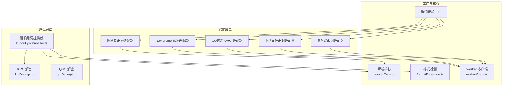
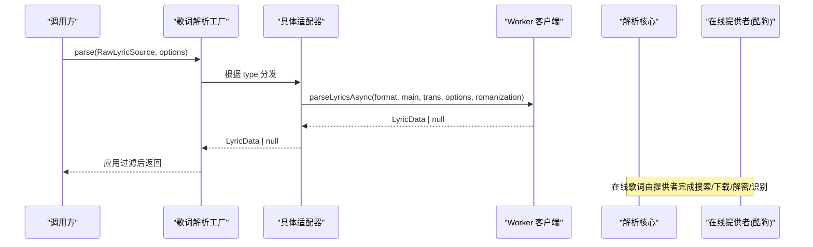
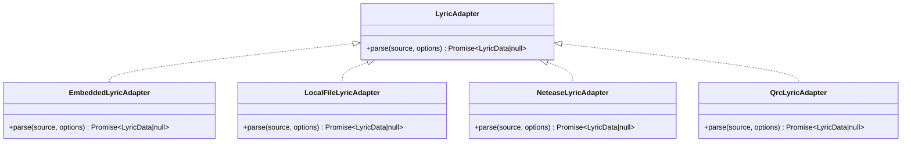
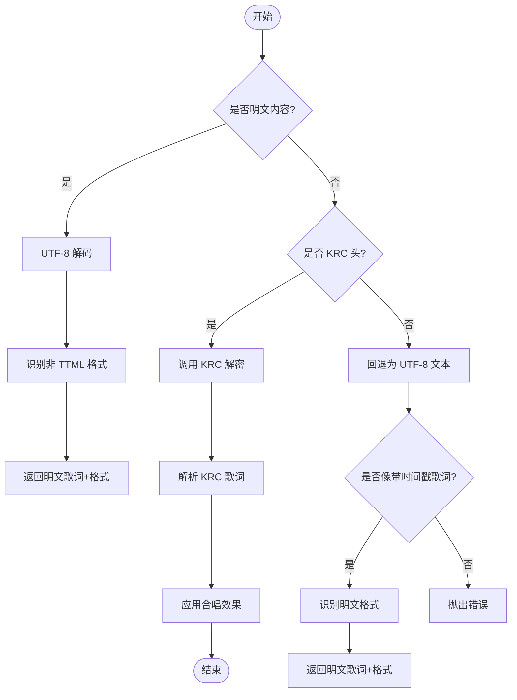
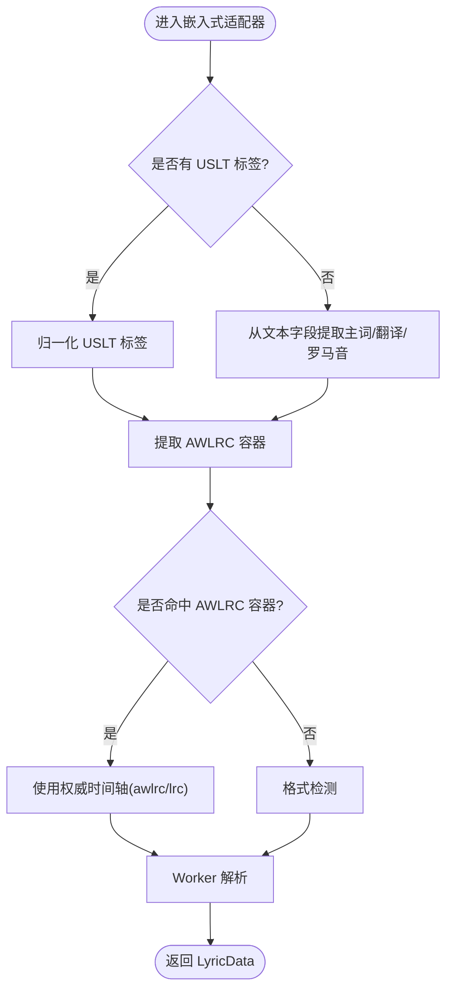
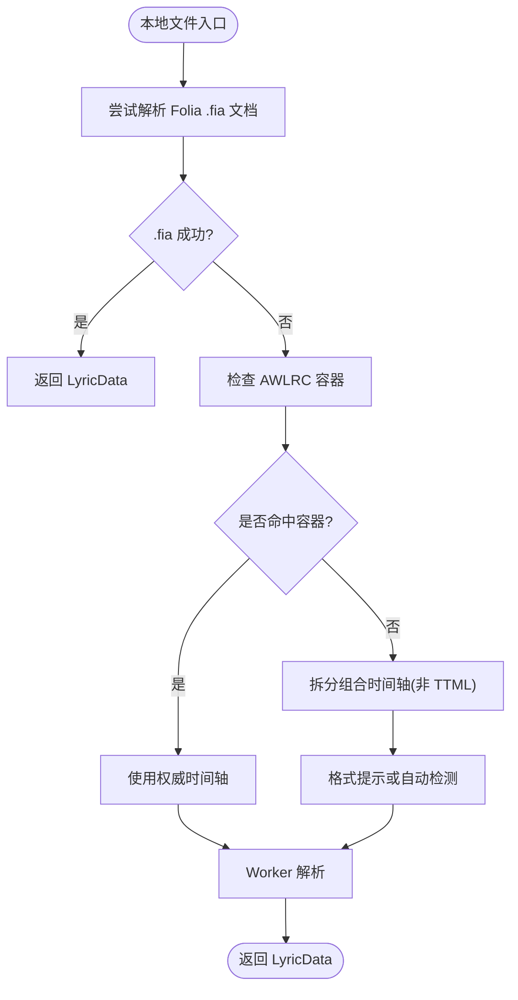
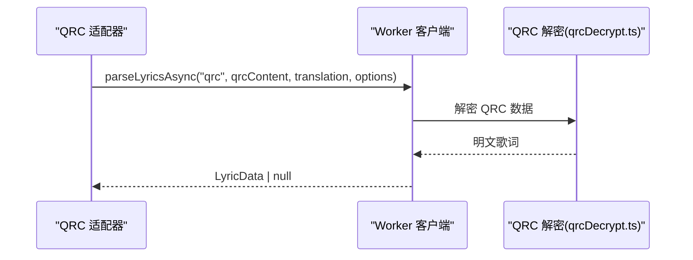
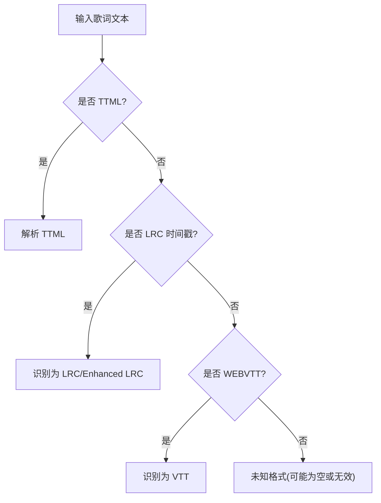
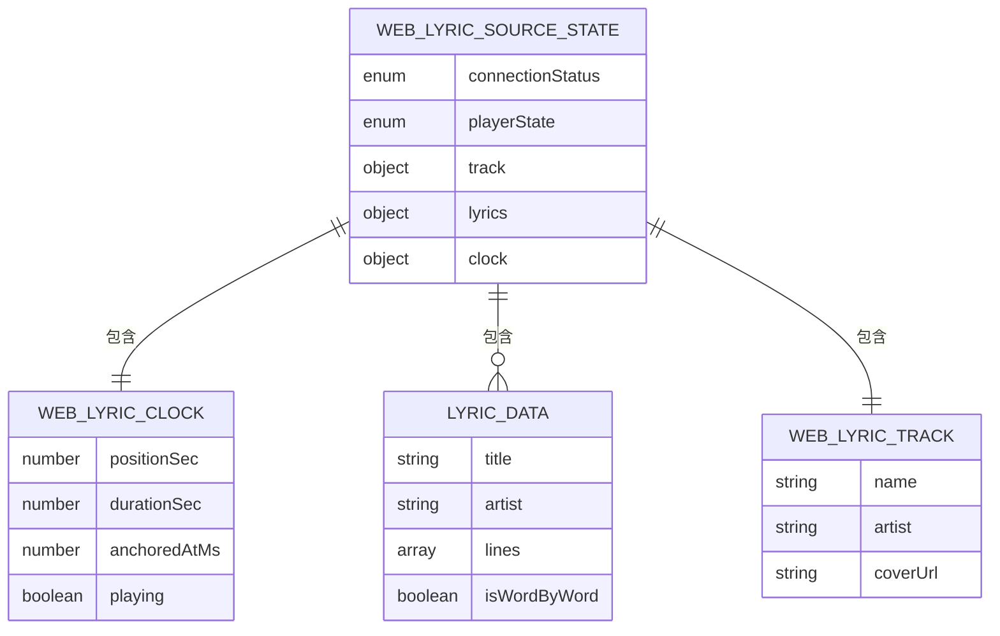
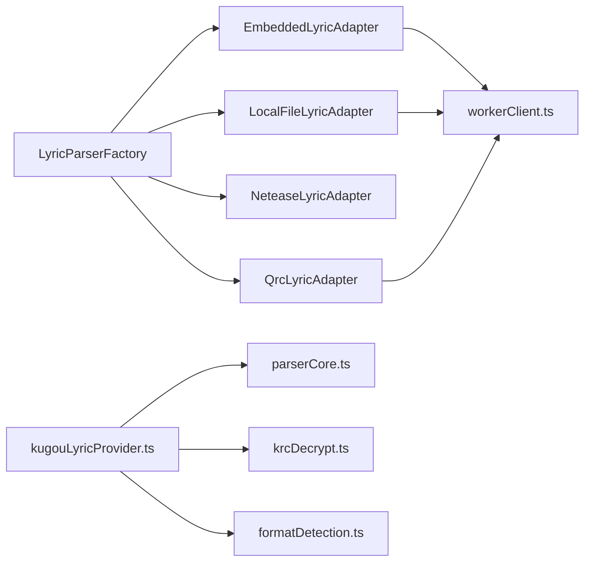

# 歌词格式支持

<cite>
**本文引用的文件**   
- [LyricAdapter.ts](file://src/utils/lyrics/LyricAdapter.ts)
- [LyricParserFactory.ts](file://src/utils/lyrics/LyricParserFactory.ts)
- [EmbeddedLyricAdapter.ts](file://src/utils/lyrics/adapters/EmbeddedLyricAdapter.ts)
- [LocalFileLyricAdapter.ts](file://src/utils/lyrics/adapters/LocalFileLyricAdapter.ts)
- [NeteaseLyricAdapter.ts](file://src/utils/lyrics/adapters/NeteaseLyricAdapter.ts)
- [QrcLyricAdapter.ts](file://src/utils/lyrics/adapters/QrcLyricAdapter.ts)
- [kugouLyricProvider.ts](file://src/utils/lyrics/providers/kugouLyricProvider.ts)
- [krcDecrypt.ts](file://src/utils/lyrics/providers/krcDecrypt.ts)
- [qrcDecrypt.ts](file://src/utils/lyrics/providers/qrcDecrypt.ts)
- [parserCore.ts](file://src/utils/lyrics/parserCore.ts)
- [formatDetection.ts](file://src/utils/lyrics/formatDetection.ts)
- [workerClient.ts](file://src/utils/lyrics/workerClient.ts)
- [embeddedLrcNormalization.ts](file://src/utils/lyrics/embeddedLrcNormalization.ts)
- [awlrcContainer.ts](file://src/utils/lyrics/awlrcContainer.ts)
- [timelineSplitter.ts](file://src/utils/lyrics/timelineSplitter.ts)
- [foliaLyricDocument.ts](file://src/utils/lyrics/foliaLyricDocument.ts)
- [neteaseProcessing.ts](file://src/utils/lyrics/neteaseProcessing.ts)
- [types.ts](file://src/utils/lyrics/types.ts)
- [webLyricSource.ts](file://src/types/webLyricSource.ts)
</cite>

## 目录
1. [简介](#简介)
2. [项目结构](#项目结构)
3. [核心组件](#核心组件)
4. [架构总览](#架构总览)
5. [详细组件分析](#详细组件分析)
6. [依赖关系分析](#依赖关系分析)
7. [性能与兼容性](#性能与兼容性)
8. [故障排查指南](#故障排查指南)
9. [结论](#结论)

## 简介
本文件系统性梳理 Folia Major 的歌词格式支持体系，覆盖标准 LRC、增强型 LRC、YRC（网易云）、QRC（QQ音乐）、KRC（酷狗音乐）、AWLRC、VTT、TTML 等格式的规范定义与解析实现。文档重点说明：
- 歌词适配器的抽象设计与统一接口
- 在线歌词提供商集成方式（API 调用、签名认证、数据转换）
- 嵌入歌词提取与处理（含 USLT、AWLRC 容器）
- 加密歌词解密流程（QRC、KRC）
- 格式检测与自动识别机制
- 格式转换与兼容性策略

## 项目结构
歌词相关代码主要位于 src/utils/lyrics 目录，采用“适配器 + 工厂 + 提供者”的分层组织：
- 适配器层：针对不同来源（嵌入式、本地文件、网易云、QQ音乐 QRC、Navidrome 等）提供统一的 parse 接口
- 工厂层：根据来源类型路由到具体适配器，并应用显示过滤
- 提供者层：对接在线服务（如酷狗），负责搜索、下载、解密与格式识别
- 解析核心：通用解析器、格式检测、时间轴拆分、AWLRC 容器处理、Folia 专有文档加载
- Web 歌词源类型：面向 OBS 等外部消费方的统一状态契约

图示来源
- [LyricParserFactory.ts:11-38](file://src/utils/lyrics/LyricParserFactory.ts#L11-L38)
- [EmbeddedLyricAdapter.ts:9-41](file://src/utils/lyrics/adapters/EmbeddedLyricAdapter.ts#L9-L41)
- [LocalFileLyricAdapter.ts:10-42](file://src/utils/lyrics/adapters/LocalFileLyricAdapter.ts#L10-L42)
- [NeteaseLyricAdapter.ts:6-9](file://src/utils/lyrics/adapters/NeteaseLyricAdapter.ts#L6-L9)
- [QrcLyricAdapter.ts:6-11](file://src/utils/lyrics/adapters/QrcLyricAdapter.ts#L6-L11)
- [kugouLyricProvider.ts:35-65](file://src/utils/lyrics/providers/kugouLyricProvider.ts#L35-L65)

章节来源
- [LyricParserFactory.ts:11-38](file://src/utils/lyrics/LyricParserFactory.ts#L11-L38)
- [webLyricSource.ts:1-51](file://src/types/webLyricSource.ts#L1-L51)

## 核心组件
- 歌词适配器接口：所有来源统一暴露 parse(source, options) 方法，返回标准化的 LyricData 或 null
- 歌词解析工厂：按 source.type 分发到对应适配器，并在最后应用显示过滤
- 嵌入式歌词适配器：从 USLT 标签或文本内容中提取主词、翻译、罗马音；优先处理 AWLRC 容器；否则走格式检测
- 本地文件歌词适配器：优先尝试 Folia 专有 .fia 文档；其次处理 AWLRC 容器；再拆分组合时间轴；最后走 Worker 解析
- 网易云歌词适配器：委托 neteaseProcessing 进行网易云特有数据处理
- QQ音乐 QRC 适配器：直接交给 Worker 以 qrc 格式解析
- 酷狗歌词提供者：搜索歌曲、下载歌词、检测 KRC 头、解密 KRC、回退为明文 LRC/VTT，并应用合唱效果

章节来源
- [LyricAdapter.ts:1-7](file://src/utils/lyrics/LyricAdapter.ts#L1-L7)
- [LyricParserFactory.ts:11-38](file://src/utils/lyrics/LyricParserFactory.ts#L11-L38)
- [EmbeddedLyricAdapter.ts:9-41](file://src/utils/lyrics/adapters/EmbeddedLyricAdapter.ts#L9-L41)
- [LocalFileLyricAdapter.ts:10-42](file://src/utils/lyrics/adapters/LocalFileLyricAdapter.ts#L10-L42)
- [NeteaseLyricAdapter.ts:6-9](file://src/utils/lyrics/adapters/NeteaseLyricAdapter.ts#L6-L9)
- [QrcLyricAdapter.ts:6-11](file://src/utils/lyrics/adapters/QrcLyricAdapter.ts#L6-L11)
- [kugouLyricProvider.ts:35-65](file://src/utils/lyrics/providers/kugouLyricProvider.ts#L35-L65)

## 架构总览
整体流程如下：
- 上层通过 LyricParserFactory.parse 接收 RawLyricSource
- 工厂根据 type 选择适配器
- 适配器将原始数据交给 Worker 或解析核心进行解析
- 在线提供者负责网络请求、签名、解密与格式识别
- 最终输出标准化 LyricData，供播放器与可视化渲染使用

图示来源
- [LyricParserFactory.ts:11-38](file://src/utils/lyrics/LyricParserFactory.ts#L11-L38)
- [workerClient.ts](file://src/utils/lyrics/workerClient.ts)
- [parserCore.ts:347-385](file://src/utils/lyrics/parserCore.ts#L347-L385)
- [kugouLyricProvider.ts:291-376](file://src/utils/lyrics/providers/kugouLyricProvider.ts#L291-L376)

## 详细组件分析

### 歌词适配器抽象与实现
- 抽象接口：LyricAdapter<T extends RawLyricSource> 定义统一的 parse(source, options) 协议
- 嵌入式适配器：
  - 优先处理 USLT 标签，归一化为主词、翻译、罗马音
  - 若存在 AWLRC 容器，则直接取权威时间轴，避免重复解析冗余显示层
  - 否则走格式检测，交由 Worker 解析
- 本地文件适配器：
  - 优先尝试 Folia 专有 .fia 文档，直接加载 LyricData
  - 若包含 AWLRC 容器，直接取权威时间轴
  - 对非 TTML 文本，先拆分组合时间轴，再走 Worker 解析
- 网易云适配器：委托 neteaseProcessing 进行网易云特有逻辑
- QQ音乐 QRC 适配器：直接以 qrc 格式交给 Worker 解析

图示来源
- [LyricAdapter.ts:1-7](file://src/utils/lyrics/LyricAdapter.ts#L1-L7)
- [EmbeddedLyricAdapter.ts:9-41](file://src/utils/lyrics/adapters/EmbeddedLyricAdapter.ts#L9-L41)
- [LocalFileLyricAdapter.ts:10-42](file://src/utils/lyrics/adapters/LocalFileLyricAdapter.ts#L10-L42)
- [NeteaseLyricAdapter.ts:6-9](file://src/utils/lyrics/adapters/NeteaseLyricAdapter.ts#L6-L9)
- [QrcLyricAdapter.ts:6-11](file://src/utils/lyrics/adapters/QrcLyricAdapter.ts#L6-L11)

章节来源
- [LyricAdapter.ts:1-7](file://src/utils/lyrics/LyricAdapter.ts#L1-L7)
- [EmbeddedLyricAdapter.ts:9-41](file://src/utils/lyrics/adapters/EmbeddedLyricAdapter.ts#L9-L41)
- [LocalFileLyricAdapter.ts:10-42](file://src/utils/lyrics/adapters/LocalFileLyricAdapter.ts#L10-L42)
- [NeteaseLyricAdapter.ts:6-9](file://src/utils/lyrics/adapters/NeteaseLyricAdapter.ts#L6-L9)
- [QrcLyricAdapter.ts:6-11](file://src/utils/lyrics/adapters/QrcLyricAdapter.ts#L6-L11)

### 在线歌词提供商集成（以酷狗为例）
- 搜索：构造查询参数，计算签名，通过代理或直接发起请求，返回候选歌曲列表
- 下载：根据候选项获取 accesskey/id，下载歌词二进制
- 解密与识别：
  - 检测 KRC 头部字节，若是 KRC 则调用 krcDecrypt 解密
  - 解密失败时回退为 UTF-8 文本，并通过正则判断是否为带时间戳的歌词
  - 若非 KRC，则按明文内容识别格式（LRC/Enhanced LRC/VTT）
- 解析与应用：
  - 使用 parseLyricsByFormat 解析为 LyricData
  - 标记逐字时间轴（isWordByWord）
  - 应用合唱效果（基于时间范围或自动检测）

图示来源
- [kugouLyricProvider.ts:35-65](file://src/utils/lyrics/providers/kugouLyricProvider.ts#L35-L65)
- [krcDecrypt.ts](file://src/utils/lyrics/providers/krcDecrypt.ts)
- [parserCore.ts:347-385](file://src/utils/lyrics/parserCore.ts#L347-L385)

章节来源
- [kugouLyricProvider.ts:70-147](file://src/utils/lyrics/providers/kugouLyricProvider.ts#L70-L147)
- [kugouLyricProvider.ts:152-206](file://src/utils/lyrics/providers/kugouLyricProvider.ts#L152-L206)
- [kugouLyricProvider.ts:291-376](file://src/utils/lyrics/providers/kugouLyricProvider.ts#L291-L376)

### 嵌入歌词提取与处理
- USLT 标签处理：
  - 从音频元数据的 USLT 标签中抽取主词、翻译、罗马音
  - 归一化处理（去除 BOM、规范化换行等）
- AWLRC 容器：
  - 优先提取权威时间轴（awlrc），忽略冗余显示层（lrc）
  - 同时支持翻译（tlrc）与罗马音（rlrc）
- 文本内容处理：
  - 若无 USLT，则从文本字段提取主词与翻译
  - 再次检查是否存在 AWLRC 容器，优先使用权威时间轴
- 格式检测：
  - 若无容器，则通过 detectTimedLyricFormat 自动识别 LRC/Enhanced LRC/YRC/QRC/KRC/VTT/TTML 等

图示来源
- [EmbeddedLyricAdapter.ts:9-41](file://src/utils/lyrics/adapters/EmbeddedLyricAdapter.ts#L9-L41)
- [embeddedLrcNormalization.ts](file://src/utils/lyrics/embeddedLrcNormalization.ts)
- [awlrcContainer.ts](file://src/utils/lyrics/awlrcContainer.ts)
- [formatDetection.ts](file://src/utils/lyrics/formatDetection.ts)

章节来源
- [EmbeddedLyricAdapter.ts:9-41](file://src/utils/lyrics/adapters/EmbeddedLyricAdapter.ts#L9-L41)
- [embeddedLrcNormalization.ts](file://src/utils/lyrics/embeddedLrcNormalization.ts)
- [awlrcContainer.ts](file://src/utils/lyrics/awlrcContainer.ts)

### 本地文件歌词处理与 Folia 专有文档
- Folia 专有 .fia 文档：
  - 直接解析为 LyricData，跳过常规解析器，提升性能与一致性
- AWLRC 容器：
  - 优先使用权威时间轴，避免重复解析冗余显示层
- 组合时间轴拆分：
  - 对非 TTML 文本，先拆分主词、翻译、罗马音的时间轴
  - 再根据格式提示或自动检测结果交给 Worker 解析
- TTML 特殊处理：
  - 不执行组合时间轴拆分，直接交给 Worker 解析

图示来源
- [LocalFileLyricAdapter.ts:10-42](file://src/utils/lyrics/adapters/LocalFileLyricAdapter.ts#L10-L42)
- [foliaLyricDocument.ts](file://src/utils/lyrics/foliaLyricDocument.ts)
- [awlrcContainer.ts](file://src/utils/lyrics/awlrcContainer.ts)
- [timelineSplitter.ts](file://src/utils/lyrics/timelineSplitter.ts)
- [formatDetection.ts](file://src/utils/lyrics/formatDetection.ts)

章节来源
- [LocalFileLyricAdapter.ts:10-42](file://src/utils/lyrics/adapters/LocalFileLyricAdapter.ts#L10-L42)
- [foliaLyricDocument.ts](file://src/utils/lyrics/foliaLyricDocument.ts)
- [timelineSplitter.ts](file://src/utils/lyrics/timelineSplitter.ts)

### 歌词加密解密流程（QRC、KRC）
- KRC（酷狗音乐）：
  - 检测二进制前缀是否为 KRC 头
  - 调用 krcDecrypt 进行解密
  - 解密失败时回退为明文歌词并进行格式识别
- QRC（QQ音乐）：
  - 通过 QrcLyricAdapter 将 qrcContent 交给 Worker 解析
  - 内部由 qrcDecrypt 模块处理解密逻辑

图示来源
- [QrcLyricAdapter.ts:6-11](file://src/utils/lyrics/adapters/QrcLyricAdapter.ts#L6-L11)
- [qrcDecrypt.ts](file://src/utils/lyrics/providers/qrcDecrypt.ts)
- [workerClient.ts](file://src/utils/lyrics/workerClient.ts)

章节来源
- [QrcLyricAdapter.ts:6-11](file://src/utils/lyrics/adapters/QrcLyricAdapter.ts#L6-L11)
- [qrcDecrypt.ts](file://src/utils/lyrics/providers/qrcDecrypt.ts)

### 格式检测与自动识别机制
- 非 TTML 文本识别：
  - 通过正则匹配 LRC 时间戳、增强型 LRC 尖括号时间戳、WEBVTT 头
  - 返回 lrc / enhanced-lrc / vtt 等格式标识
- TTML 识别：
  - 由 Worker 或解析核心处理 XML 结构的 TTML 歌词
- YRC（网易云）：
  - 由 neteaseProcessing 进行网易云特有解析与增强
- 综合策略：
  - 优先使用 AWLRC 容器中的权威时间轴
  - 若无容器，则根据内容特征自动识别格式

图示来源
- [formatDetection.ts](file://src/utils/lyrics/formatDetection.ts)
- [parserCore.ts:347-385](file://src/utils/lyrics/parserCore.ts#L347-L385)

章节来源
- [formatDetection.ts](file://src/utils/lyrics/formatDetection.ts)
- [parserCore.ts:347-385](file://src/utils/lyrics/parserCore.ts#L347-L385)

### 歌词数据模型与 Web 歌词源契约
- LyricData：标准化歌词数据结构，包含标题、艺人、行、逐字时间轴等
- WebLyricSourceState：面向 OBS 等外部消费方的统一状态，包括连接状态、播放状态、曲目信息、歌词与时钟
- 时钟外推：通过 anchoredAtMs 与 positionSec/durationSec 计算当前歌词时间

图示来源
- [webLyricSource.ts:1-51](file://src/types/webLyricSource.ts#L1-L51)

章节来源
- [webLyricSource.ts:1-51](file://src/types/webLyricSource.ts#L1-L51)

## 依赖关系分析
- 适配器依赖 Worker 客户端进行实际解析
- 工厂依赖各适配器与显示过滤逻辑
- 在线提供者依赖解析核心与解密模块
- 嵌入式与本地文件适配器依赖 AWLRC 容器、时间轴拆分与格式检测

图示来源
- [LyricParserFactory.ts:11-38](file://src/utils/lyrics/LyricParserFactory.ts#L11-L38)
- [EmbeddedLyricAdapter.ts:9-41](file://src/utils/lyrics/adapters/EmbeddedLyricAdapter.ts#L9-L41)
- [LocalFileLyricAdapter.ts:10-42](file://src/utils/lyrics/adapters/LocalFileLyricAdapter.ts#L10-L42)
- [QrcLyricAdapter.ts:6-11](file://src/utils/lyrics/adapters/QrcLyricAdapter.ts#L6-L11)
- [kugouLyricProvider.ts:35-65](file://src/utils/lyrics/providers/kugouLyricProvider.ts#L35-L65)

章节来源
- [LyricParserFactory.ts:11-38](file://src/utils/lyrics/LyricParserFactory.ts#L11-L38)
- [kugouLyricProvider.ts:35-65](file://src/utils/lyrics/providers/kugouLyricProvider.ts#L35-L65)

## 性能与兼容性
- 权威时间轴优先：AWLRC 容器可避免冗余解析，减少 CPU 与内存占用
- Folia 专有文档：.fia 直接加载 LyricData，跳过解析器，提升导入性能
- Worker 异步解析：将耗时解析任务卸载至 Worker，避免阻塞 UI
- 组合时间轴拆分：仅在必要时拆分主词/翻译/罗马音，降低不必要的字符串操作
- 格式检测优化：优先使用 formatHint，减少正则匹配开销
- 兼容回退：KRC 解密失败时回退为明文歌词，保证可用性

[本节为通用指导，无需列出具体文件来源]

## 故障排查指南
- 在线请求失败：
  - 检查代理路径与 headers（User-Agent、KG-Rec、KG-RC、KG-CLIENTTIMEMS、mid）
  - 确认签名生成逻辑与参数排序是否正确
- KRC 解密异常：
  - 校验二进制前缀是否为 KRC 头
  - 捕获解密异常并回退为明文歌词
- 歌词解析结果为空：
  - 检查输入文本是否为空或仅包含空白字符
  - 确认 AWLRC 容器是否被正确提取
  - 验证格式检测是否误判
- 时间轴错乱：
  - 检查组合时间轴拆分是否生效
  - 确认 TTML 未误入拆分流程
- 网易云歌词异常：
  - 检查 neteaseProcessing 的处理逻辑与数据清洗步骤

章节来源
- [kugouLyricProvider.ts:70-147](file://src/utils/lyrics/providers/kugouLyricProvider.ts#L70-L147)
- [kugouLyricProvider.ts:35-65](file://src/utils/lyrics/providers/kugouLyricProvider.ts#L35-L65)
- [EmbeddedLyricAdapter.ts:9-41](file://src/utils/lyrics/adapters/EmbeddedLyricAdapter.ts#L9-L41)
- [LocalFileLyricAdapter.ts:10-42](file://src/utils/lyrics/adapters/LocalFileLyricAdapter.ts#L10-L42)

## 结论
Folia Major 的歌词系统通过统一的适配器接口与工厂分发机制，实现了对多种歌词格式的广泛支持与高兼容性。在线提供者负责复杂的数据获取与解密，解析核心与 Worker 承担高性能解析任务。AWLRC 容器与 Folia 专有文档进一步提升了权威时间轴的可靠性与导入效率。整体架构清晰、扩展性强，便于后续新增格式与提供商接入。