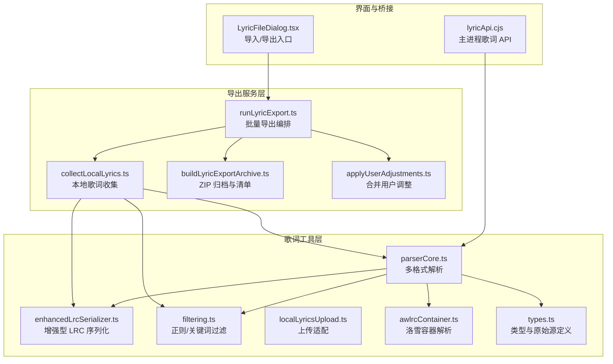
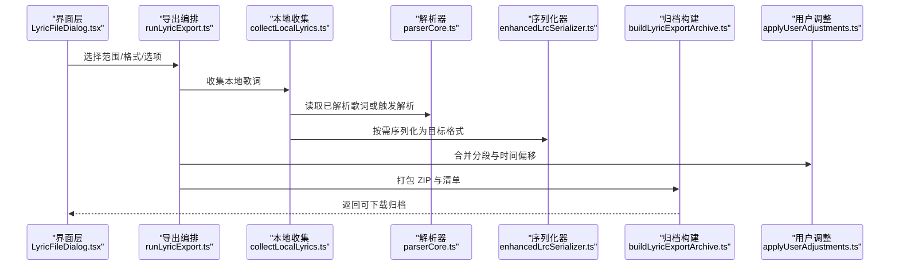
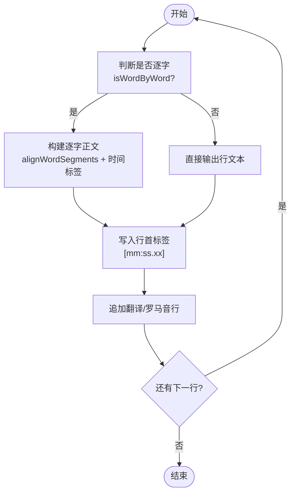
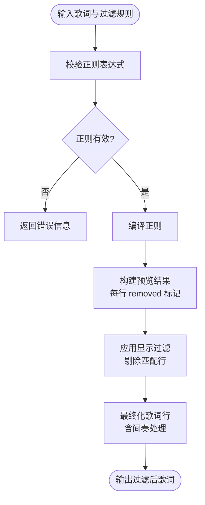
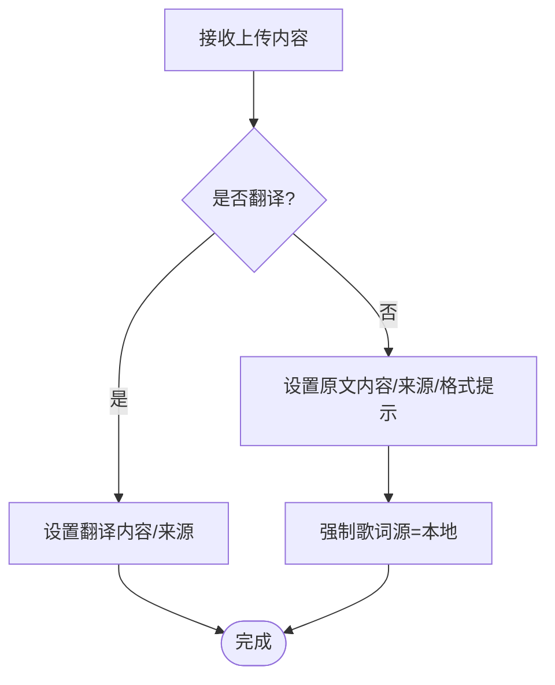
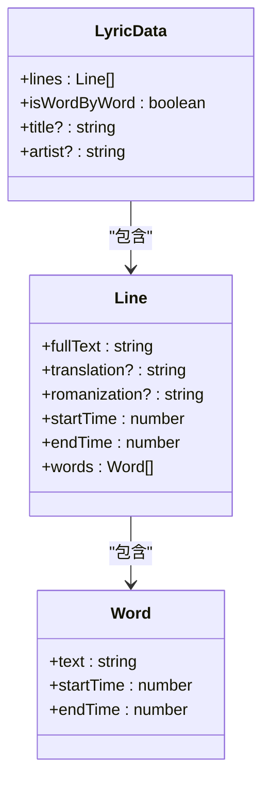
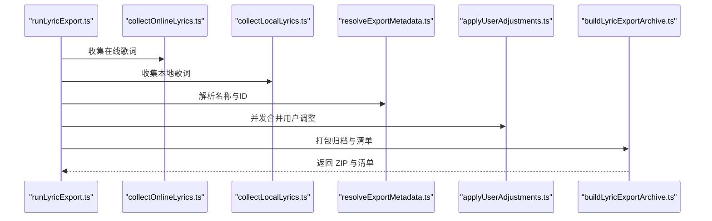
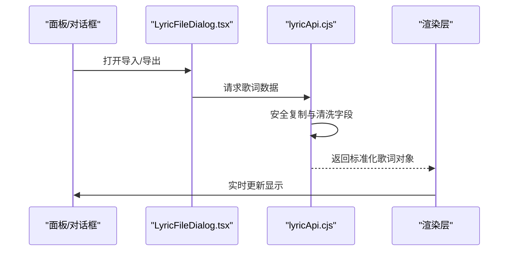
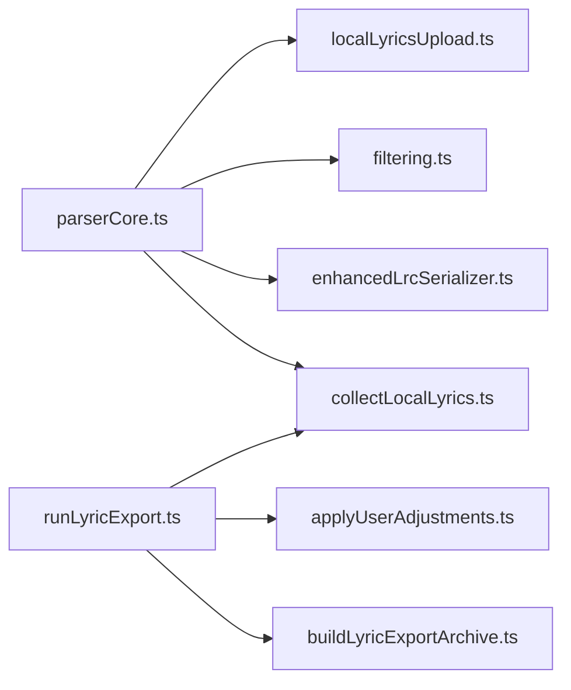
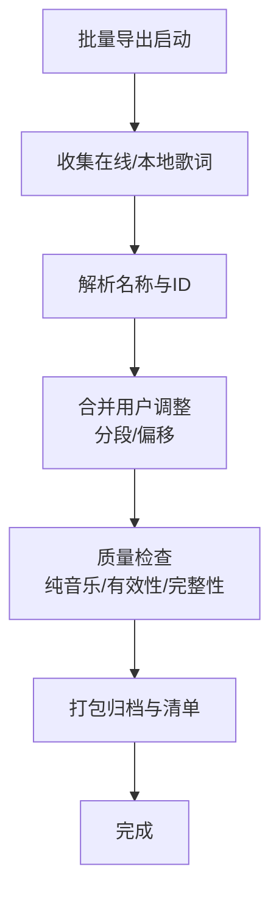

# 歌词管理与编辑

<cite>
**本文引用的文件**   
- [enhancedLrcSerializer.ts](file://src/utils/lyrics/enhancedLrcSerializer.ts)
- [filtering.ts](file://src/utils/lyrics/filtering.ts)
- [localLyricsUpload.ts](file://src/utils/lyrics/localLyricsUpload.ts)
- [runLyricExport.ts](file://src/services/lyricExport/runLyricExport.ts)
- [collectLocalLyrics.ts](file://src/services/lyricExport/collectLocalLyrics.ts)
- [buildLyricExportArchive.ts](file://src/services/lyricExport/buildLyricExportArchive.ts)
- [applyUserAdjustments.ts](file://src/services/lyricExport/applyUserAdjustments.ts)
- [parserCore.ts](file://src/utils/lyrics/parserCore.ts)
- [awlrcContainer.ts](file://src/utils/lyrics/owlrcContainer.ts)
- [types.ts](file://src/utils/lyrics/types.ts)
- [LyricFileDialog.tsx](file://src/components/panelTab/LyricFileDialog.tsx)
- [lyricApi.cjs](file://electron/lyricApi.cjs)
</cite>

## 目录
1. [简介](#简介)
2. [项目结构](#项目结构)
3. [核心组件](#核心组件)
4. [架构总览](#架构总览)
5. [详细组件分析](#详细组件分析)
6. [依赖关系分析](#依赖关系分析)
7. [性能与缓存策略](#性能与缓存策略)
8. [批量操作与质量检查](#批量操作与质量检查)
9. [故障排查指南](#故障排查指南)
10. [结论](#结论)

## 简介
本文面向 Folia Major 的歌词管理与编辑能力，聚焦以下目标：
- 本地歌词文件扫描、导入导出与版本控制
- 基于正则表达式、关键词和时间范围的歌词过滤
- 增强型 LRC 序列化器（支持翻译、罗马音、注释等扩展字段）
- 歌词编辑界面的数据绑定与实时更新机制
- 歌词缓存策略（内存、磁盘与失效）
- 批量操作（时间偏移、文本替换、格式转换）
- 歌词质量检查与完整性验证

## 项目结构
歌词相关代码主要分布在两个区域：
- utils/lyrics：歌词解析、序列化、过滤、上传适配、容器处理等通用工具
- services/lyricExport：批量导出流程、归档打包、用户调整合并
- electron/lyricApi.cjs：主进程侧对外暴露的歌词 API，负责数据清洗与跨进程传输
- components/panelTab/LyricFileDialog.tsx：歌词导入/导出入口 UI

**图示来源**
- [parserCore.ts:1-800](file://src/utils/lyrics/parserCore.ts#L1-L800)
- [enhancedLrcSerializer.ts:1-171](file://src/utils/lyrics/enhancedLrcSerializer.ts#L1-L171)
- [filtering.ts:1-106](file://src/utils/lyrics/filtering.ts#L1-L106)
- [localLyricsUpload.ts:1-35](file://src/utils/lyrics/localLyricsUpload.ts#L1-L35)
- [awlrcContainer.ts:1-91](file://src/utils/lyrics/owlrcContainer.ts#L1-L91)
- [types.ts:1-103](file://src/utils/lyrics/types.ts#L1-L103)
- [runLyricExport.ts:1-70](file://src/services/lyricExport/runLyricExport.ts#L1-L70)
- [collectLocalLyrics.ts:1-95](file://src/services/lyricExport/collectLocalLyrics.ts#L1-L95)
- [buildLyricExportArchive.ts:1-138](file://src/services/lyricExport/buildLyricExportArchive.ts#L1-L138)
- [applyUserAdjustments.ts:1-24](file://src/services/lyricExport/applyUserAdjustments.ts#L1-L24)
- [LyricFileDialog.tsx:18-44](file://src/components/panelTab/LyricFileDialog.tsx#L18-L44)
- [lyricApi.cjs:50-91](file://electron/lyricApi.cjs#L50-L91)

**章节来源**
- [parserCore.ts:1-800](file://src/utils/lyrics/parserCore.ts#L1-L800)
- [runLyricExport.ts:1-70](file://src/services/lyricExport/runLyricExport.ts#L1-L70)

## 核心组件
- 多格式解析器：统一将 LRC/YRC/QRC/VTT/TTML/AWLRC 等输入转为内部 LyricData，并自动对齐翻译与罗马音轨。
- 增强型 LRC 序列化器：输出带行首标签和逐字时轴的“增强 LRC”，兼容回读；同时保留标题、艺术家、专辑、时长等元信息。
- 歌词过滤系统：提供正则校验、预览与显示过滤，支持排除间奏行。
- 本地歌词上传适配：区分原文与翻译上传，记录来源与格式提示，并在需要时切换歌词源为本地。
- 批量导出编排：按在线/本地范围收集歌词，合并用户调整（分段、时间偏移），生成 ZIP 归档与清单。
- 主进程歌词 API：对歌词数据进行安全拷贝与清洗，屏蔽敏感字段，保证跨进程传输稳定。

**章节来源**
- [enhancedLrcSerializer.ts:1-171](file://src/utils/lyrics/enhancedLrcSerializer.ts#L1-L171)
- [filtering.ts:1-106](file://src/utils/lyrics/filtering.ts#L1-L106)
- [localLyricsUpload.ts:1-35](file://src/utils/lyrics/localLyricsUpload.ts#L1-L35)
- [runLyricExport.ts:1-70](file://src/services/lyricExport/runLyricExport.ts#L1-L70)
- [lyricApi.cjs:50-91](file://electron/lyricApi.cjs#L50-L91)

## 架构总览
歌词从“来源”到“展示/导出”的整体路径如下：

**图示来源**
- [LyricFileDialog.tsx:18-44](file://src/components/panelTab/LyricFileDialog.tsx#L18-L44)
- [runLyricExport.ts:1-70](file://src/services/lyricExport/runLyricExport.ts#L1-L70)
- [collectLocalLyrics.ts:1-95](file://src/services/lyricExport/collectLocalLyrics.ts#L1-L95)
- [parserCore.ts:1-800](file://src/utils/lyrics/parserCore.ts#L1-L800)
- [enhancedLrcSerializer.ts:1-171](file://src/utils/lyrics/enhancedLrcSerializer.ts#L1-L171)
- [buildLyricExportArchive.ts:1-138](file://src/services/lyricExport/buildLyricExportArchive.ts#L1-L138)
- [applyUserAdjustments.ts:1-24](file://src/services/lyricExport/applyUserAdjustments.ts#L1-L24)

## 详细组件分析

### 增强型 LRC 序列化器
- 功能要点
  - 输出“增强 LRC”（A2 扩展风格）：行首标签 `[mm:ss.xx]` + 可选逐字标签 `<mm:ss.xxx>`
  - 支持翻译、罗马音作为同一时间戳下的后续行
  - 自动跳过间奏行，避免回读产生多余行
  - 通过 `isWordByWord` 判断是否使用逐字时轴；若未显式标记则降级为逐行
  - 元数据写入标题、艺术家、专辑、时长，并标注来源为 Folia
- 关键实现点
  - 行首标签精度为 10ms，避免相邻行标签冲突导致被合并
  - 逐字正文通过词段对齐 fullText，西文空格由对齐逻辑补齐
  - 超长行或超长时间戳会截断，确保输出合法

**图示来源**
- [enhancedLrcSerializer.ts:62-171](file://src/utils/lyrics/enhancedLrcSerializer.ts#L62-L171)

**章节来源**
- [enhancedLrcSerializer.ts:1-171](file://src/utils/lyrics/enhancedLrcSerializer.ts#L1-L171)

### 歌词过滤系统
- 功能要点
  - 正则表达式校验与编译
  - 预览模式：逐行标注是否匹配，统计移除数量
  - 显示过滤：在渲染前剔除匹配行，并自动处理间奏行
  - 当存在过滤规则时，默认不包含间奏行；可通过选项覆盖
- 复杂度
  - 预览与过滤均为 O(n)，n 为行数
  - 正则编译失败时返回错误消息，不中断流程

**图示来源**
- [filtering.ts:10-106](file://src/utils/lyrics/filtering.ts#L10-L106)

**章节来源**
- [filtering.ts:1-106](file://src/utils/lyrics/filtering.ts#L1-L106)

### 本地歌词上传与来源管理
- 功能要点
  - 区分原文与翻译上传，分别设置对应内容与来源标记
  - 原文上传时记录文件格式提示，便于后续解析
  - 上传原文后强制切换歌词源为本地，避免仍显示在线歌词
- 设计动机
  - 明确“显式上传”意图，防止旧来源锁定导致无感更新

**图示来源**
- [localLyricsUpload.ts:13-34](file://src/utils/lyrics/localLyricsUpload.ts#L13-L34)

**章节来源**
- [localLyricsUpload.ts:1-35](file://src/utils/lyrics/localLyricsUpload.ts#L1-L35)

### 多格式解析与 AWLRC 容器
- 解析器能力
  - 支持 LRC/YRC/QRC/VTT/TTML 等格式，统一产出 LyricData
  - 自动对齐翻译与罗马音轨，采用最近邻匹配窗口 ±1s
  - 自动插入间奏行，提升空档可视化体验
- AWLRC 容器
  - 解析洛雪音乐写在 LRC 末尾的容器，解码 lrc/tlrc/rlrc/awlrc 四轨
  - rlrc 若为汉字音译则丢弃，避免误挂到罗马音字段
  - 命中容器时优先取权威数据，忽略正文降级视图

**图示来源**
- [parserCore.ts:11-28](file://src/utils/lyrics/parserCore.ts#L11-L28)
- [parserCore.ts:428-487](file://src/utils/lyrics/parserCore.ts#L428-L487)
- [parserCore.ts:489-568](file://src/utils/lyrics/parserCore.ts#L489-L568)
- [parserCore.ts:570-700](file://src/utils/lyrics/parserCore.ts#L570-L700)
- [awlrcContainer.ts:14-91](file://src/utils/lyrics/owlrcContainer.ts#L14-L91)

**章节来源**
- [parserCore.ts:1-800](file://src/utils/lyrics/parserCore.ts#L1-L800)
- [awlrcContainer.ts:1-91](file://src/utils/lyrics/owlrcContainer.ts#L1-L91)

### 批量导出流程
- 流程概览
  - 收集在线歌词与本地歌词（仅导出在线匹配且非纯音乐的条目）
  - 解析歌曲名称与 ID，用于命名与偏移键
  - 并发合并用户调整（分段、时间偏移）
  - 按格式生成文件内容，打包 ZIP，附带 manifest 清单
- 本地歌词筛选
  - 仅导出当前活跃源为“在线匹配”的歌曲，避免重复导出已有 sidecar 文件
  - 纯音乐判定优先信任已有标记，否则根据歌词文本推断

**图示来源**
- [runLyricExport.ts:27-69](file://src/services/lyricExport/runLyricExport.ts#L27-L69)
- [collectLocalLyrics.ts:43-95](file://src/services/lyricExport/collectLocalLyrics.ts#L43-L95)
- [buildLyricExportArchive.ts:66-138](file://src/services/lyricExport/buildLyricExportArchive.ts#L66-L138)
- [applyUserAdjustments.ts:14-23](file://src/services/lyricExport/applyUserAdjustments.ts#L14-L23)

**章节来源**
- [runLyricExport.ts:1-70](file://src/services/lyricExport/runLyricExport.ts#L1-L70)
- [collectLocalLyrics.ts:1-95](file://src/services/lyricExport/collectLocalLyrics.ts#L1-L95)
- [buildLyricExportArchive.ts:1-138](file://src/services/lyricExport/buildLyricExportArchive.ts#L1-L138)
- [applyUserAdjustments.ts:1-24](file://src/services/lyricExport/applyUserAdjustments.ts#L1-L24)

### 歌词编辑界面与实时数据绑定
- 导入入口
  - 支持多种歌词格式后缀，包括 `.lrc/.vtt/.ttml/.qrc/.yrc/.krc/.txt/.fia/.json`
  - 提供当前歌词导出与批量导出入口
- 实时绑定
  - 通过 Electron 主进程歌词 API 进行数据清洗与传输，确保渲染层只拿到安全字段
  - 主进程侧复制时间、文本、逐字时轴、翻译、罗马音、背景和声等字段，并清理无效值

**图示来源**
- [LyricFileDialog.tsx:18-44](file://src/components/panelTab/LyricFileDialog.tsx#L18-L44)
- [lyricApi.cjs:50-91](file://electron/lyricApi.cjs#L50-L91)

**章节来源**
- [LyricFileDialog.tsx:18-44](file://src/components/panelTab/LyricFileDialog.tsx#L18-L44)
- [lyricApi.cjs:50-91](file://electron/lyricApi.cjs#L50-L91)

## 依赖关系分析
- 模块耦合
  - 解析器是基础依赖，被上传适配、过滤、序列化、导出收集等多处引用
  - 导出编排依赖本地收集、用户调整、归档构建三个子模块
  - 主进程 API 依赖解析器产出的数据结构，但不直接参与业务逻辑
- 外部依赖
  - 归档构建使用 fflate 库进行 ZIP 压缩
  - TTML 解析使用 @applemusic-like-lyrics/ttml 与 @xmldom/xmldom

**图示来源**
- [parserCore.ts:1-800](file://src/utils/lyrics/parserCore.ts#L1-L800)
- [localLyricsUpload.ts:1-35](file://src/utils/lyrics/localLyricsUpload.ts#L1-L35)
- [filtering.ts:1-106](file://src/utils/lyrics/filtering.ts#L1-L106)
- [enhancedLrcSerializer.ts:1-171](file://src/utils/lyrics/enhancedLrcSerializer.ts#L1-L171)
- [collectLocalLyrics.ts:1-95](file://src/services/lyricExport/collectLocalLyrics.ts#L1-L95)
- [runLyricExport.ts:1-70](file://src/services/lyricExport/runLyricExport.ts#L1-L70)
- [applyUserAdjustments.ts:1-24](file://src/services/lyricExport/applyUserAdjustments.ts#L1-L24)
- [buildLyricExportArchive.ts:1-138](file://src/services/lyricExport/buildLyricExportArchive.ts#L1-L138)

**章节来源**
- [runLyricExport.ts:1-70](file://src/services/lyricExport/runLyricExport.ts#L1-L70)
- [parserCore.ts:1-800](file://src/utils/lyrics/parserCore.ts#L1-L800)

## 性能与缓存策略
- 内存缓存
  - 歌词解析结果以 LyricData 形式驻留内存，避免重复解析
  - 过滤预览与显示过滤均基于内存中的 lines 数组，O(n) 线性处理
- 磁盘缓存
  - 本地歌词内容存储在 LocalSong 实体中（原文/翻译内容与来源标记）
  - 批量导出时直接从数据库读取本地歌曲列表，减少额外 IO
- 失效机制
  - 上传新歌词会重置来源标记并切换歌词源，确保下次渲染使用最新数据
  - 导出时合并用户调整（分段、偏移），使导出产物与播放时的最终状态一致
- 并发优化
  - 批量导出对用户调整阶段使用并发映射（默认并发度 8），缩短整体耗时

**章节来源**
- [localLyricsUpload.ts:13-34](file://src/utils/lyrics/localLyricsUpload.ts#L13-L34)
- [runLyricExport.ts:19-54](file://src/services/lyricExport/runLyricExport.ts#L19-L54)
- [collectLocalLyrics.ts:79-95](file://src/services/lyricExport/collectLocalLyrics.ts#L79-L95)

## 批量操作与质量检查
- 批量操作
  - 时间偏移调整：通过 per-song 偏移键读取偏移量，合并到导出歌词
  - 文本替换：可在过滤预览基础上进行二次编辑（由上层编辑器实现）
  - 格式转换：导出时按所选格式生成文件内容（LRC/YRC/QRC/VTT/TTML 等）
- 质量检查
  - 纯音乐检测：优先使用已有标记，否则根据歌词文本特征判断
  - 有效性校验：正则表达式合法性检查，避免非法规则影响预览与过滤
  - 完整性验证：导出清单记录导出与跳过原因，便于审计与回溯

**图示来源**
- [runLyricExport.ts:27-69](file://src/services/lyricExport/runLyricExport.ts#L27-L69)
- [collectLocalLyrics.ts:35-57](file://src/services/lyricExport/collectLocalLyrics.ts#L35-L57)
- [buildLyricExportArchive.ts:81-138](file://src/services/lyricExport/buildLyricExportArchive.ts#L81-L138)
- [applyUserAdjustments.ts:14-23](file://src/services/lyricExport/applyUserAdjustments.ts#L14-L23)

**章节来源**
- [runLyricExport.ts:1-70](file://src/services/lyricExport/runLyricExport.ts#L1-L70)
- [collectLocalLyrics.ts:1-95](file://src/services/lyricExport/collectLocalLyrics.ts#L1-L95)
- [buildLyricExportArchive.ts:1-138](file://src/services/lyricExport/buildLyricExportArchive.ts#L1-L138)
- [applyUserAdjustments.ts:1-24](file://src/services/lyricExport/applyUserAdjustments.ts#L1-L24)

## 故障排查指南
- 正则过滤报错
  - 现象：预览或过滤时报错
  - 排查：检查正则语法是否正确；使用内置示例规则验证
  - 参考：正则校验与编译函数
- 导出为空或跳过过多
  - 现象：导出 ZIP 为空或大量歌曲被跳过
  - 排查：确认歌曲是否为在线匹配且非纯音乐；检查歌词是否存在
  - 参考：本地歌词收集与纯音乐判定逻辑
- 导出文件名冲突
  - 现象：同名文件被重命名为 “(2)” 等
  - 排查：查看 manifest.json 中的 renamedFrom 字段，确认原路径
  - 参考：唯一文件名分配与清单记录
- 主进程歌词数据异常
  - 现象：渲染层收到不完整或异常字段
  - 排查：检查主进程 API 的数据清洗逻辑，确认字段复制顺序与空值处理
  - 参考：主进程歌词 API 的数据复制与清洗

**章节来源**
- [filtering.ts:10-37](file://src/utils/lyrics/filtering.ts#L10-L37)
- [collectLocalLyrics.ts:35-57](file://src/services/lyricExport/collectLocalLyrics.ts#L35-L57)
- [buildLyricExportArchive.ts:44-54](file://src/services/lyricExport/buildLyricExportArchive.ts#L44-L54)
- [buildLyricExportArchive.ts:115-138](file://src/services/lyricExport/buildLyricExportArchive.ts#L115-L138)
- [lyricApi.cjs:50-91](file://electron/lyricApi.cjs#L50-L91)

## 结论
Folia Major 的歌词管理与编辑体系围绕“统一解析、灵活过滤、增强序列化、稳健导出”展开：
- 解析层统一多格式输入，自动对齐翻译与罗马音，并提供间奏行增强
- 过滤层提供正则校验与预览，保障显示一致性
- 序列化层输出兼容性强、可读性高的增强 LRC，支持翻译与罗马音
- 导出层按范围收集、合并用户调整、打包归档并生成可审计清单
- 界面与主进程协作，确保数据绑定安全、实时、稳定

该体系在保证性能与可扩展性的同时，兼顾了用户体验与可维护性，适合大规模本地与在线歌词的统一管理。