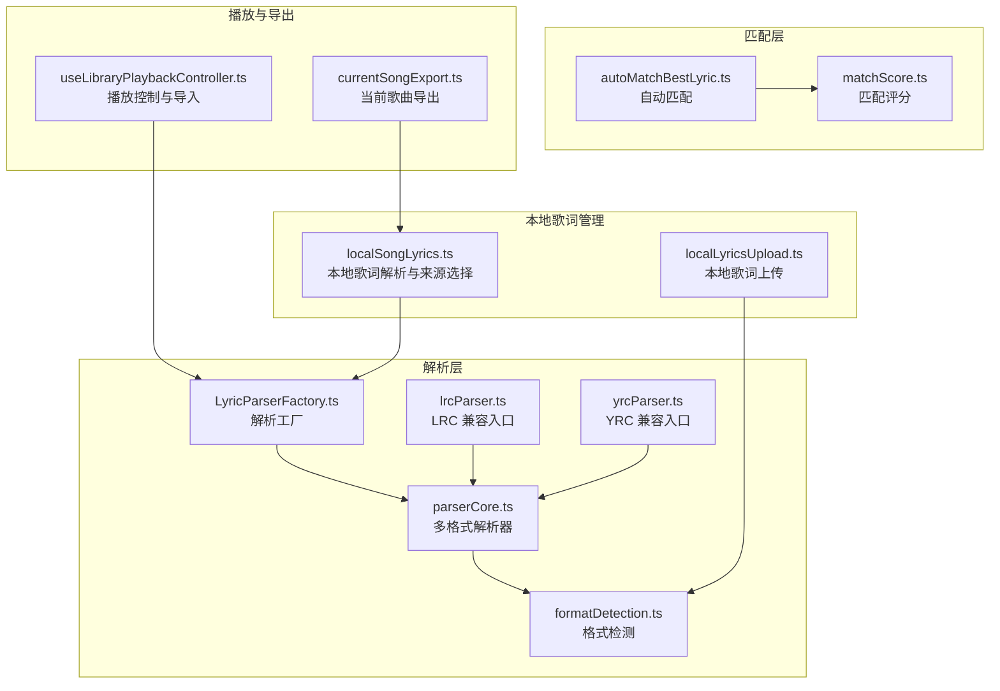
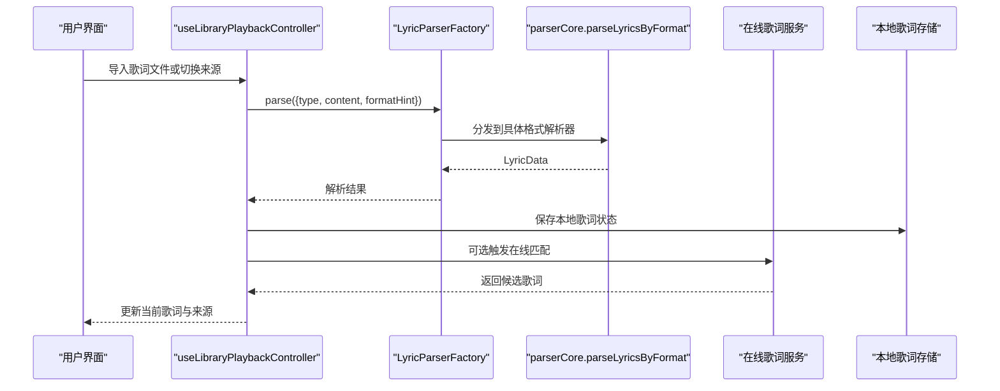
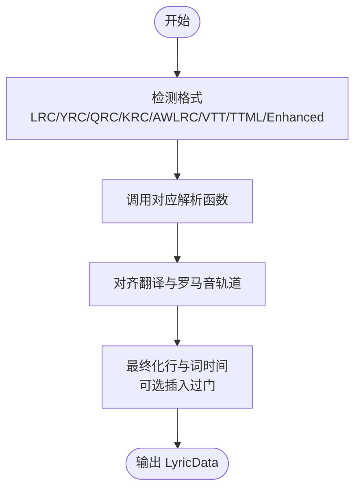
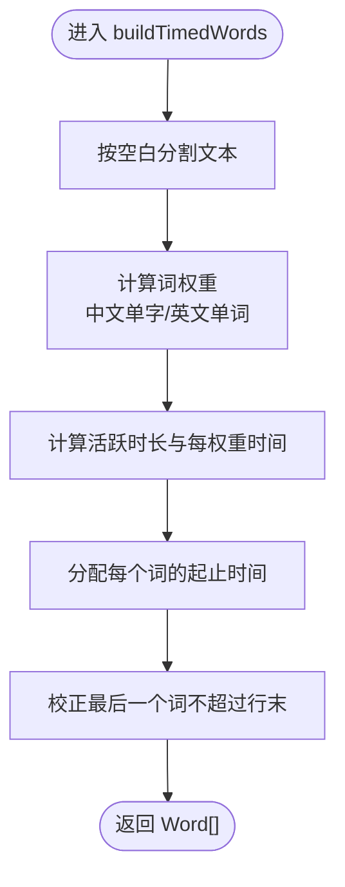
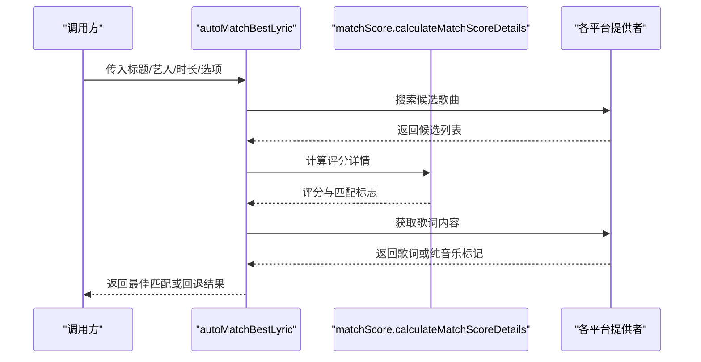
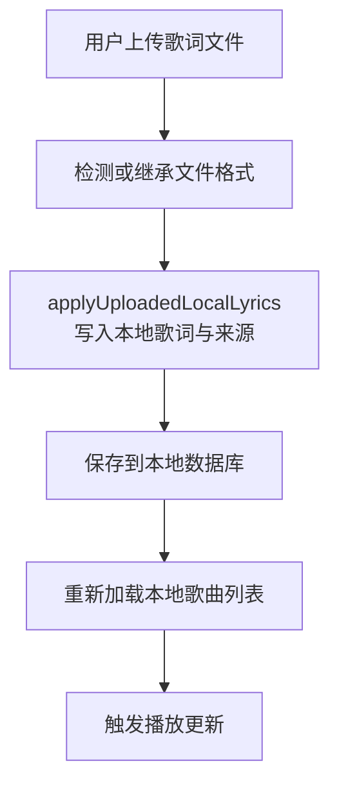
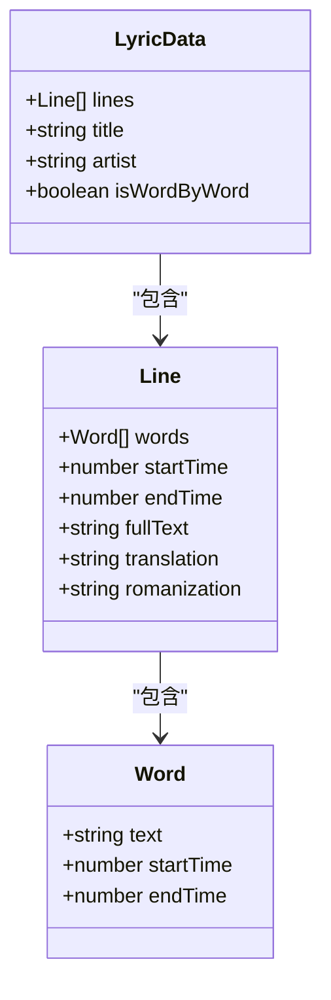
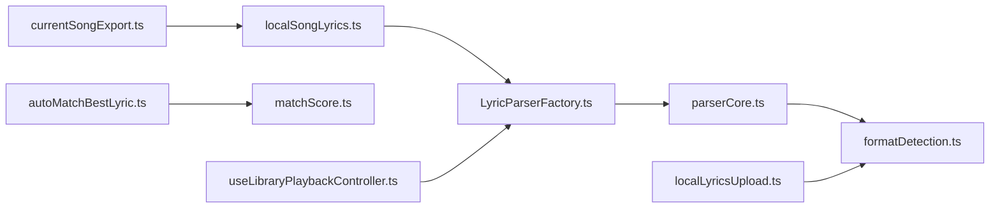

# 歌词系统

<cite>
**本文引用的文件**   
- [parserCore.ts](file://src/utils/lyrics/parserCore.ts)
- [formatDetection.ts](file://src/utils/lyrics/formatDetection.ts)
- [LyricParserFactory.ts](file://src/utils/lyrics/LyricParserFactory.ts)
- [autoMatchBestLyric.ts](file://src/utils/lyrics/autoMatchBestLyric.ts)
- [matchScore.ts](file://src/utils/lyrics/matchScore.ts)
- [localSongLyrics.ts](file://src/utils/lyrics/localSongLyrics.ts)
- [localLyricsUpload.ts](file://src/utils/lyrics/localLyricsUpload.ts)
- [currentSongExport.ts](file://src/services/lyricExport/currentSongExport.ts)
- [useLibraryPlaybackController.ts](file://src/hooks/useLibraryPlaybackController.ts)
- [lrcParser.ts](file://src/utils/lrcParser.ts)
- [yrcParser.ts](file://src/utils/yrcParser.ts)
- [architecture.test.ts](file://test/unit/lyrics/architecture.test.ts)
</cite>

## 目录
1. [引言](#引言)
2. [项目结构](#项目结构)
3. [核心组件](#核心组件)
4. [架构总览](#架构总览)
5. [详细组件分析](#详细组件分析)
6. [依赖关系分析](#依赖关系分析)
7. [性能与错误处理](#性能与错误处理)
8. [故障排查指南](#故障排查指南)
9. [结论](#结论)

## 引言
本技术文档聚焦 Folia Major 的歌词系统，覆盖多格式歌词解析、时间轴同步、逐词高亮、歌词匹配、本地与在线歌词管理、增强型格式支持（含 LDDC 生成的逐字歌词）、过滤与翻译显示、编辑与导出等能力。目标是帮助开发者快速理解歌词系统的代码组织、数据流、关键算法与扩展点，同时为非专业读者提供清晰的概念说明和排错指引。

## 项目结构
歌词系统主要分布在以下位置：
- 解析与格式化：`src/utils/lyrics/parserCore.ts`、`src/utils/lyrics/formatDetection.ts`、`src/utils/lyrics/LyricParserFactory.ts`
- 自动匹配与评分：`src/utils/lyrics/autoMatchBestLyric.ts`、`src/utils/lyrics/matchScore.ts`
- 本地歌词选择与上传：`src/utils/lyrics/localSongLyrics.ts`、`src/utils/lyrics/localLyricsUpload.ts`
- 播放与导入流程：`src/hooks/useLibraryPlaybackController.ts`
- 导出服务：`src/services/lyricExport/currentSongExport.ts`
- 历史兼容入口：`src/utils/lrcParser.ts`、`src/utils/yrcParser.ts`
- 架构约束测试：`test/unit/lyrics/architecture.test.ts`

**图示来源**
- [parserCore.ts:1-10](file://src/utils/lyrics/parserCore.ts#L1-L10)
- [formatDetection.ts:1-15](file://src/utils/lyrics/formatDetection.ts#L1-L15)
- [autoMatchBestLyric.ts:1-22](file://src/utils/lyrics/autoMatchBestLyric.ts#L1-L22)
- [matchScore.ts:12-17](file://src/utils/lyrics/matchScore.ts#L12-L17)
- [localSongLyrics.ts:1-10](file://src/utils/lyrics/localSongLyrics.ts#L1-L10)
- [localLyricsUpload.ts:1-11](file://src/utils/lyrics/localLyricsUpload.ts#L1-L11)
- [useLibraryPlaybackController.ts:987-1007](file://src/hooks/useLibraryPlaybackController.ts#L987-L1007)
- [currentSongExport.ts:45-85](file://src/services/lyricExport/currentSongExport.ts#L45-L85)

**章节来源**
- [parserCore.ts:1-10](file://src/utils/lyrics/parserCore.ts#L1-L10)
- [formatDetection.ts:1-15](file://src/utils/lyrics/formatDetection.ts#L1-L15)
- [autoMatchBestLyric.ts:1-22](file://src/utils/lyrics/autoMatchBestLyric.ts#L1-L22)
- [matchScore.ts:12-17](file://src/utils/lyrics/matchScore.ts#L12-L17)
- [localSongLyrics.ts:1-10](file://src/utils/lyrics/localSongLyrics.ts#L1-L10)
- [localLyricsUpload.ts:1-11](file://src/utils/lyrics/localLyricsUpload.ts#L1-L11)
- [useLibraryPlaybackController.ts:987-1007](file://src/hooks/useLibraryPlaybackController.ts#L987-L1007)
- [currentSongExport.ts:45-85](file://src/services/lyricExport/currentSongExport.ts#L45-L85)

## 核心组件
- 多格式解析器：统一入口 `parseLyricsByFormat`，分发到 LRC、YRC、QRC、KRC、AWLRC、VTT、TTML、Enhanced LRC 等解析函数；所有解析结果统一为 `LyricData`，包含行、词、时间戳、翻译、罗马音、是否逐词标记等字段。
- 时间轴与逐词高亮：通过 `buildTimedWords` 将文本切分为词级时间片段，结合行级起止时间生成逐词高亮所需的数据结构；对无精确词时间的普通 LRC/VTT 也进行估算分配。
- 翻译与罗马音对齐：`findTranslationsForSortedStartTimes` 在 ±1s 窗口内按时间差贪心配对，避免重复借用或错位。
- 自动匹配：`autoMatchBestLyric` 聚合网易云、QQ、酷狗、AMLLDB 等多源搜索结果，使用 `calculateMatchScoreDetails` 计算标题、艺人、专辑、时长相似度，优先返回逐词歌词，否则回退到逐行歌词。
- 本地歌词管理：`selectLocalSongLyricsSource` 根据显式选择与优先级策略决定使用在线、本地或嵌入歌词；`applyUploadedLocalLyrics` 记录上传来源并强制切换至本地来源。
- 播放与导入：播放控制器中集成歌词导入逻辑，支持从 `.txt` 或带格式提示的文件解析并保存为在线歌词状态。
- 导出：`currentSongExport` 读取在线或本地歌词，打包为 `.fia` 与增强型 LRC 两种格式。

**章节来源**
- [parserCore.ts:1234-1260](file://src/utils/lyrics/parserCore.ts#L1234-L1260)
- [parserCore.ts:58-117](file://src/utils/lyrics/parserCore.ts#L58-L117)
- [parserCore.ts:211-247](file://src/utils/lyrics/parserCore.ts#L211-L247)
- [autoMatchBestLyric.ts:166-202](file://src/utils/lyrics/autoMatchBestLyric.ts#L166-L202)
- [matchScore.ts:155-208](file://src/utils/lyrics/matchScore.ts#L155-L208)
- [localSongLyrics.ts:12-28](file://src/utils/lyrics/localSongLyrics.ts#L12-L28)
- [localLyricsUpload.ts:13-34](file://src/utils/lyrics/localLyricsUpload.ts#L13-L34)
- [useLibraryPlaybackController.ts:987-1007](file://src/hooks/useLibraryPlaybackController.ts#L987-L1007)
- [currentSongExport.ts:45-85](file://src/services/lyricExport/currentSongExport.ts#L45-L85)

## 架构总览
歌词系统采用“解析—匹配—展示”的分层架构：
- 解析层负责将不同格式的原始歌词转换为统一的内部模型 `LyricData`，并标注行、词、翻译、罗马音、纯音乐标记等元信息。
- 匹配层负责跨平台搜索、评分与候选排序，优先选择逐词歌词，必要时保留逐行回退。
- 展示层由播放器与可视化模块消费 `LyricData`，依据时间轴进行逐词高亮、翻译显示、过滤与编辑。

**图示来源**
- [useLibraryPlaybackController.ts:987-1007](file://src/hooks/useLibraryPlaybackController.ts#L987-L1007)
- [parserCore.ts:1234-1260](file://src/utils/lyrics/parserCore.ts#L1234-L1260)

## 详细组件分析

### 多格式歌词解析器
- 统一入口 `parseLyricsByFormat` 根据格式类型调用对应解析函数：
  - LRC：基础时间标签解析，支持翻译与罗马音轨道，估算词时间。
  - YRC/QRC/KRC：逐词时间标签解析，支持相对偏移与绝对时间，内置翻译与罗马音轨道对齐。
  - VTT：字幕块解析，清理 HTML 实体与标签，估算词时间。
  - TTML：借助外部库解析，适配为内部模型。
  - Enhanced LRC：混合精确词时间与普通行的增强格式，支持角度标签与括号内联时间。
  - AWLRC：LX Music 容器中的逐字歌词，修复零时长与倒序标记，精确对齐替代轨道。
- 通用能力：
  - 时间戳解析与排序优化：若输入已有序则跳过排序。
  - 翻译/罗马音对齐：基于时间差的贪心配对，避免重复借用。
  - 行尾与词尾边界修正：防止最后一词超出下一行起始时间。
  - 过门插入：可选在长间隙插入占位过门行。

**图示来源**
- [parserCore.ts:1234-1260](file://src/utils/lyrics/parserCore.ts#L1234-L1260)
- [parserCore.ts:211-247](file://src/utils/lyrics/parserCore.ts#L211-L247)
- [parserCore.ts:165-174](file://src/utils/lyrics/parserCore.ts#L165-L174)

**章节来源**
- [parserCore.ts:428-487](file://src/utils/lyrics/parserCore.ts#L428-L487)
- [parserCore.ts:489-568](file://src/utils/lyrics/parserCore.ts#L489-L568)
- [parserCore.ts:570-700](file://src/utils/lyrics/parserCore.ts#L570-L700)
- [parserCore.ts:780-816](file://src/utils/lyrics/parserCore.ts#L780-L816)
- [parserCore.ts:818-836](file://src/utils/lyrics/parserCore.ts#L818-L836)
- [parserCore.ts:838-946](file://src/utils/lyrics/parserCore.ts#L838-L946)
- [parserCore.ts:953-1078](file://src/utils/lyrics/parserCore.ts#L953-L1078)
- [parserCore.ts:1154-1232](file://src/utils/lyrics/parserCore.ts#L1154-L1232)

### 时间轴同步与逐词高亮
- 词级时间估算：对于无精确词时间的文本，`buildTimedWords` 按字符权重分配时间，中文标点权重为 0，英文单词按长度加权，确保视觉节奏合理。
- 行级时间边界：下一行起始时间作为当前行结束上限，避免重叠；最后一行默认最小持续时间。
- 过门行：当行间间隙超过阈值时插入占位过门，提升可视化体验。
- 精确时间优先：若存在精确词时间（如 YRC/QRC/KRC/AWLRC），直接使用该时间；否则估算。

**图示来源**
- [parserCore.ts:58-117](file://src/utils/lyrics/parserCore.ts#L58-L117)

**章节来源**
- [parserCore.ts:58-117](file://src/utils/lyrics/parserCore.ts#L58-L117)
- [parserCore.ts:121-163](file://src/utils/lyrics/parserCore.ts#L121-L163)

### 歌词匹配系统
- 候选搜索：按配置顺序依次查询网易云、QQ、酷狗、AMLLDB，限制单次搜索数量与超时。
- 评分机制：标题、艺人、专辑、时长四个维度加权，标题相似性使用 Jaccard 字符集相似度，艺人拆分后主艺人加分，时长差异分档。
- 优选策略：优先返回逐词歌词；若无逐词，保留逐行回退；纯音乐直接短路返回。
- 合唱标记：若来源提供合唱区间，应用合唱效果以增强可视化。

**图示来源**
- [autoMatchBestLyric.ts:166-202](file://src/utils/lyrics/autoMatchBestLyric.ts#L166-L202)
- [matchScore.ts:155-208](file://src/utils/lyrics/matchScore.ts#L155-L208)

**章节来源**
- [autoMatchBestLyric.ts:95-138](file://src/utils/lyrics/autoMatchBestLyric.ts#L95-L138)
- [autoMatchBestLyric.ts:140-158](file://src/utils/lyrics/autoMatchBestLyric.ts#L140-L158)
- [autoMatchBestLyric.ts:399-553](file://src/utils/lyrics/autoMatchBestLyric.ts#L399-L553)
- [matchScore.ts:38-47](file://src/utils/lyrics/matchScore.ts#L38-L47)
- [matchScore.ts:64-81](file://src/utils/lyrics/matchScore.ts#L64-L81)
- [matchScore.ts:92-114](file://src/utils/lyrics/matchScore.ts#L92-L114)
- [matchScore.ts:126-153](file://src/utils/lyrics/matchScore.ts#L126-L153)

### 歌词文件管理与缓存策略
- 本地歌词识别：根据文件名后缀判断显式格式（vtt/ttml/qrc/yrc/krc），否则通过内容检测（WEBVTT、TTML 根节点、Enhanced LRC 模式）推断格式。
- 在线歌词获取：播放控制器支持导入在线歌词状态，包括来源名称、覆盖标记、匹配信息等。
- 缓存策略：导出服务读取在线歌词状态与缓存，迁移旧渲染提示，合并本地与在线歌词。
- 上传行为：上传本地歌词会设置来源为本地，并保留显式格式提示，避免被在线来源覆盖。

**图示来源**
- [localLyricsUpload.ts:13-34](file://src/utils/lyrics/localLyricsUpload.ts#L13-L34)
- [useLibraryPlaybackController.ts:886-901](file://src/hooks/useLibraryPlaybackController.ts#L886-L901)

**章节来源**
- [formatDetection.ts:17-50](file://src/utils/lyrics/formatDetection.ts#L17-L50)
- [formatDetection.ts:57-60](file://src/utils/lyrics/formatDetection.ts#L57-L60)
- [localLyricsUpload.ts:13-34](file://src/utils/lyrics/localLyricsUpload.ts#L13-L34)
- [useLibraryPlaybackController.ts:987-1007](file://src/hooks/useLibraryPlaybackController.ts#L987-L1007)
- [currentSongExport.ts:45-85](file://src/services/lyricExport/currentSongExport.ts#L45-L85)

### 增强型歌词格式与 LDDC 逐字歌词
- Enhanced LRC：支持角度标签 `<mm:ss.ms>` 与括号内联时间 `[mm:ss.ms]`，可混合精确词时间与普通行，自动标记是否为逐词。
- AWLRC：LX Music 容器的逐字歌词，修复毫秒分数语义（非小数而是毫秒余数），精确对齐替代轨道，避免错位。
- KRC：酷狗 KRC 支持相对偏移与嵌入式语言轨道（翻译/罗马音），解码 Base64 语言标签并合并外部轨道。

**图示来源**
- [parserCore.ts:1-15](file://src/utils/lyrics/parserCore.ts#L1-L15)
- [parserCore.ts:17-28](file://src/utils/lyrics/parserCore.ts#L17-L28)

**章节来源**
- [parserCore.ts:838-946](file://src/utils/lyrics/parserCore.ts#L838-L946)
- [parserCore.ts:1089-1114](file://src/utils/lyrics/parserCore.ts#L1089-L1114)
- [parserCore.ts:1154-1232](file://src/utils/lyrics/parserCore.ts#L1154-L1232)
- [parserCore.ts:953-1078](file://src/utils/lyrics/parserCore.ts#L953-L1078)

### 歌词过滤、翻译显示与编辑
- 过滤：系统支持歌词过滤功能（见命令面板与设置模态框），通常基于行文本、翻译、罗马音或来源进行筛选。
- 翻译显示：解析阶段将翻译轨道与主歌词行按时间对齐，渲染层可选择显示原文、翻译或双语。
- 编辑：播放控制器支持导入在线歌词状态，允许用户手动修正来源与覆盖标记；本地上传可直接替换当前歌词。

**章节来源**
- [parserCore.ts:211-247](file://src/utils/lyrics/parserCore.ts#L211-L247)
- [useLibraryPlaybackController.ts:903-912](file://src/hooks/useLibraryPlaybackController.ts#L903-L912)
- [useLibraryPlaybackController.ts:987-1007](file://src/hooks/useLibraryPlaybackController.ts#L987-L1007)

## 依赖关系分析
- 解析器依赖：
  - `parserCore` 依赖 `formatDetection` 进行格式推断。
  - `LyricParserFactory` 封装解析入口，供播放控制器与本地歌词解析调用。
- 匹配器依赖：
  - `autoMatchBestLyric` 依赖 `matchScore` 计算评分，依赖在线提供者接口。
- 本地歌词依赖：
  - `localSongLyrics` 依赖 `LyricParserFactory` 解析本地与嵌入歌词。
  - `localLyricsUpload` 依赖 `formatDetection` 保留显式格式。
- 导出依赖：
  - `currentSongExport` 依赖在线歌词状态与本地歌词解析。

**图示来源**
- [parserCore.ts:1-10](file://src/utils/lyrics/parserCore.ts#L1-L10)
- [formatDetection.ts:1-15](file://src/utils/lyrics/formatDetection.ts#L1-L15)
- [localSongLyrics.ts:1-10](file://src/utils/lyrics/localSongLyrics.ts#L1-L10)
- [localLyricsUpload.ts:1-11](file://src/utils/lyrics/localLyricsUpload.ts#L1-L11)
- [autoMatchBestLyric.ts:1-22](file://src/utils/lyrics/autoMatchBestLyric.ts#L1-L22)
- [matchScore.ts:1-17](file://src/utils/lyrics/matchScore.ts#L1-L17)
- [useLibraryPlaybackController.ts:987-1007](file://src/hooks/useLibraryPlaybackController.ts#L987-L1007)
- [currentSongExport.ts:45-85](file://src/services/lyricExport/currentSongExport.ts#L45-L85)

**章节来源**
- [parserCore.ts:1-10](file://src/utils/lyrics/parserCore.ts#L1-L10)
- [formatDetection.ts:1-15](file://src/utils/lyrics/formatDetection.ts#L1-L15)
- [localSongLyrics.ts:1-10](file://src/utils/lyrics/localSongLyrics.ts#L1-L10)
- [localLyricsUpload.ts:1-11](file://src/utils/lyrics/localLyricsUpload.ts#L1-L11)
- [autoMatchBestLyric.ts:1-22](file://src/utils/lyrics/autoMatchBestLyric.ts#L1-L22)
- [matchScore.ts:1-17](file://src/utils/lyrics/matchScore.ts#L1-L17)
- [useLibraryPlaybackController.ts:987-1007](file://src/hooks/useLibraryPlaybackController.ts#L987-L1007)
- [currentSongExport.ts:45-85](file://src/services/lyricExport/currentSongExport.ts#L45-L85)

## 性能与错误处理
- 性能优化：
  - 输入有序检测：解析器在检测到输入已按时间排序时跳过排序，减少 O(n log n) 开销。
  - 二分查找：翻译轨道匹配使用下界查找，降低线性扫描成本。
  - 超时保护：自动匹配对各平台搜索与歌词获取设置超时，避免阻塞主流程。
  - 候选限制：自动匹配限制候选数量，减少网络与计算压力。
- 错误处理：
  - 解析异常：KRC 语言轨道解码失败时记录错误日志并继续解析。
  - 网络异常：在线匹配捕获搜索与获取异常，记录日志并降级。
  - 数据校验：空文本、无效时间戳、负持续时间为常见边界，解析器进行最小值保护与归一化。

**章节来源**
- [parserCore.ts:176-182](file://src/utils/lyrics/parserCore.ts#L176-L182)
- [parserCore.ts:186-199](file://src/utils/lyrics/parserCore.ts#L186-L199)
- [autoMatchBestLyric.ts:140-158](file://src/utils/lyrics/autoMatchBestLyric.ts#L140-L158)
- [autoMatchBestLyric.ts:199-202](file://src/utils/lyrics/autoMatchBestLyric.ts#L199-L202)
- [parserCore.ts:969-994](file://src/utils/lyrics/parserCore.ts#L969-L994)

## 故障排查指南
- 歌词未显示：
  - 检查本地歌词来源是否被设置为在线或嵌入，确认 `lyricsSource` 字段。
  - 验证文件格式是否正确，尤其是 Enhanced LRC 与 AWLRC 的时间戳语义。
- 时间轴错位：
  - 检查翻译轨道与主歌词轨道的时间对齐，确认是否存在重复借用。
  - 对于 KRC/AWLRC，确认相对偏移与毫秒分数语义是否正确。
- 匹配失败：
  - 查看自动匹配日志，确认标题、艺人、专辑、时长评分是否过低。
  - 检查平台搜索超时与候选数量限制。
- 导出异常：
  - 确认在线歌词状态与缓存是否可用，检查迁移逻辑是否生效。

**章节来源**
- [localSongLyrics.ts:12-28](file://src/utils/lyrics/localSongLyrics.ts#L12-L28)
- [parserCore.ts:211-247](file://src/utils/lyrics/parserCore.ts#L211-L247)
- [parserCore.ts:1089-1114](file://src/utils/lyrics/parserCore.ts#L1089-L1114)
- [autoMatchBestLyric.ts:111-138](file://src/utils/lyrics/autoMatchBestLyric.ts#L111-L138)
- [currentSongExport.ts:45-85](file://src/services/lyricExport/currentSongExport.ts#L45-L85)

## 结论
Folia Major 的歌词系统通过统一解析模型、智能匹配算法与精细的时间轴处理，实现了多格式、高精度、可扩展的歌词能力。系统在性能与错误处理方面采取了多项优化与保护措施，确保在复杂场景下的稳定性与用户体验。未来可进一步扩展更多第三方格式、增强 AI 辅助分段与翻译质量，并优化大规模歌词集的渲染性能。