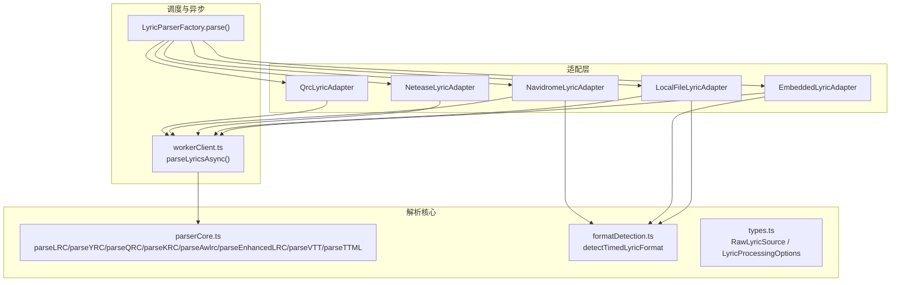
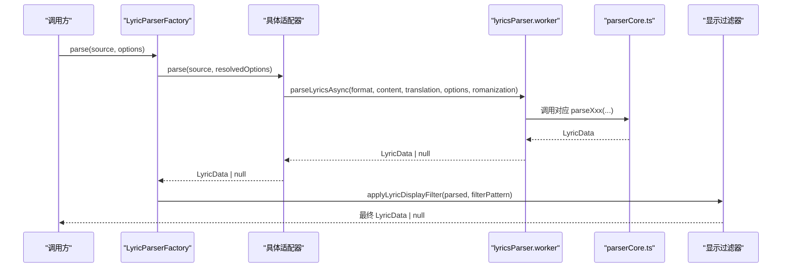
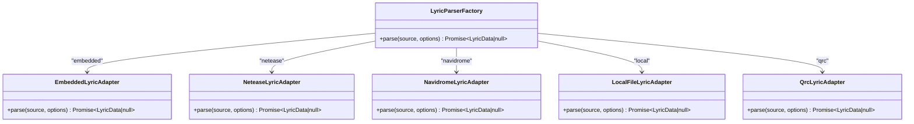
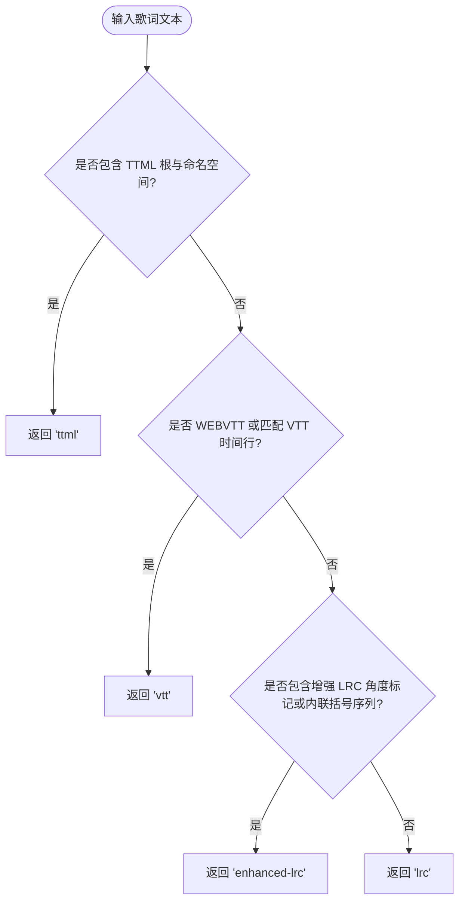
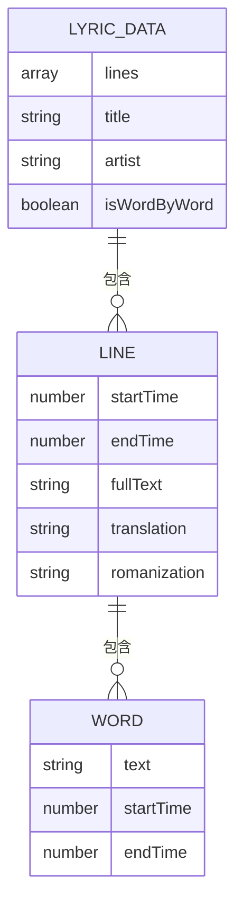
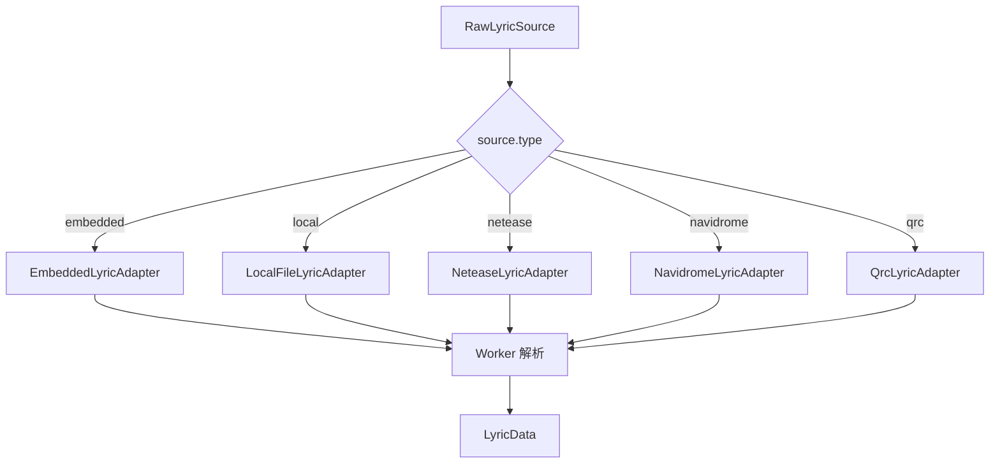
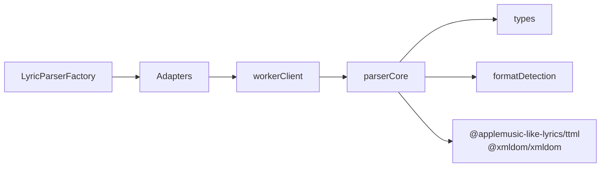

# 歌词解析核心

<cite>
**本文引用的文件**   
- [LyricParserFactory.ts](file://src/utils/lyrics/LyricParserFactory.ts)
- [parserCore.ts](file://src/utils/lyrics/parserCore.ts)
- [types.ts](file://src/utils/lyrics/types.ts)
- [formatDetection.ts](file://src/utils/lyrics/formatDetection.ts)
- [workerClient.ts](file://src/utils/lyrics/workerClient.ts)
- [EmbeddedLyricAdapter.ts](file://src/utils/lyrics/adapters/EmbeddedLyricAdapter.ts)
- [LocalFileLyricAdapter.ts](file://src/utils/lyrics/adapters/LocalFileLyricAdapter.ts)
- [NeteaseLyricAdapter.ts](file://src/utils/lyrics/adapters/NeteaseLyricAdapter.ts)
- [NavidromeLyricAdapter.ts](file://src/utils/lyrics/adapters/NavidromeLyricAdapter.ts)
- [QrcLyricAdapter.ts](file://src/utils/lyrics/adapters/QrcLyricAdapter.ts)
- [awlrcContainer.ts](file://src/utils/lyrics/awlrcContainer.ts)
- [lrcParser.ts](file://src/utils/lrcParser.ts)
- [yrcParser.ts](file://src/utils/yrcParser.ts)
</cite>

## 目录
1. [简介](#简介)
2. [项目结构](#项目结构)
3. [核心组件](#核心组件)
4. [架构总览](#架构总览)
5. [详细组件分析](#详细组件分析)
6. [依赖关系分析](#依赖关系分析)
7. [性能与内存优化](#性能与内存优化)
8. [错误处理与降级策略](#错误处理与降级策略)
9. [故障排查指南](#故障排查指南)
10. [结论](#结论)

## 简介
本文件面向 Folia Major 的歌词解析核心系统，系统性说明多格式歌词解析器的架构设计、工厂模式调度、标准化数据结构、时间戳与文本清洗、元数据提取、错误处理与降级策略，以及流式与异步解析、缓存与内存管理等性能优化实践。覆盖 LRC、YRC、QRC、KRC、AWLRC、Enhanced LRC、VTT、TTML 等格式的解析实现与统一输出。

## 项目结构
歌词解析相关代码集中在 utils/lyrics 目录，采用“适配器 + 解析器核心 + 格式检测 + 工作线程”的分层组织：
- 适配器层：按来源（嵌入、本地文件、网易云、Navidrome、QRC）将原始输入归一化为标准参数后交给解析流程。
- 解析器核心：提供各格式的具体解析函数，并统一产出标准化的 LyricData。
- 格式检测：根据内容特征自动识别 VTT、TTML、Enhanced LRC、LRC 等格式。
- 工作线程：通过 Worker 异步执行解析，避免阻塞主线程。
- 工厂类：根据 RawLyricSource.type 选择对应适配器进行解析，并在最后应用显示过滤。

图示来源
- [LyricParserFactory.ts:11-38](file://src/utils/lyrics/LyricParserFactory.ts#L11-L38)
- [parserCore.ts:428-1260](file://src/utils/lyrics/parserCore.ts#L428-L1260)
- [formatDetection.ts:17-50](file://src/utils/lyrics/formatDetection.ts#L17-L50)
- [types.ts:49-102](file://src/utils/lyrics/types.ts#L49-L102)
- [workerClient.ts:46-67](file://src/utils/lyrics/workerClient.ts#L46-L67)

章节来源
- [LyricParserFactory.ts:11-38](file://src/utils/lyrics/LyricParserFactory.ts#L11-L38)
- [parserCore.ts:428-1260](file://src/utils/lyrics/parserCore.ts#L428-L1260)
- [formatDetection.ts:17-50](file://src/utils/lyrics/formatDetection.ts#L17-L50)
- [types.ts:49-102](file://src/utils/lyrics/types.ts#L49-L102)
- [workerClient.ts:46-67](file://src/utils/lyrics/workerClient.ts#L46-L67)

## 核心组件
- 解析器工厂：根据 RawLyricSource.type 分发到具体适配器；最终对结果应用显示过滤。
- 适配器族：
  - EmbeddedLyricAdapter：从媒体元数据或内嵌文本中抽取主词、翻译、罗马音，并优先尝试 AWLRC 容器。
  - LocalFileLyricAdapter：支持本地文件，优先解析 AWLRC 容器，否则拆分组合时间轴并按格式检测解析。
  - NeteaseLyricAdapter：走网易云专用处理管线。
  - NavidromeLyricAdapter：优先结构化歌词（OpenSubsonic），回退到普通 LRC/VTT 等。
  - QrcLyricAdapter：直接解析 QRC 内容。
- 解析器核心：统一实现 LRC/YRC/QRC/KRC/AWLRC/Enhanced LRC/VTT/TTML 解析，输出统一的 LyricData。
- 格式检测：基于内容特征识别 VTT/TTML/Enhanced LRC/LRC。
- 工作线程客户端：封装 Worker 通信，异步执行解析。

章节来源
- [LyricParserFactory.ts:11-38](file://src/utils/lyrics/LyricParserFactory.ts#L11-L38)
- [EmbeddedLyricAdapter.ts:9-41](file://src/utils/lyrics/adapters/EmbeddedLyricAdapter.ts#L9-L41)
- [LocalFileLyricAdapter.ts:18-41](file://src/utils/lyrics/adapters/LocalFileLyricAdapter.ts#L18-L41)
- [NeteaseLyricAdapter.ts:6-9](file://src/utils/lyrics/adapters/NeteaseLyricAdapter.ts#L6-L9)
- [NavidromeLyricAdapter.ts:15-73](file://src/utils/lyrics/adapters/NavidromeLyricAdapter.ts#L15-L73)
- [QrcLyricAdapter.ts:6-11](file://src/utils/lyrics/adapters/QrcLyricAdapter.ts#L6-L11)
- [parserCore.ts:428-1260](file://src/utils/lyrics/parserCore.ts#L428-L1260)
- [formatDetection.ts:17-50](file://src/utils/lyrics/formatDetection.ts#L17-L50)
- [workerClient.ts:46-67](file://src/utils/lyrics/workerClient.ts#L46-L67)

## 架构总览
下图展示从原始歌词源到统一 LyricData 的完整调用链，包括工厂分发、适配器预处理、Worker 异步解析、核心解析器与格式化输出。

图示来源
- [LyricParserFactory.ts:11-38](file://src/utils/lyrics/LyricParserFactory.ts#L11-L38)
- [workerClient.ts:46-67](file://src/utils/lyrics/workerClient.ts#L46-L67)
- [parserCore.ts:1234-1260](file://src/utils/lyrics/parserCore.ts#L1234-L1260)

## 详细组件分析

### 解析器工厂与适配器
- 工厂职责：
  - 解析并合并选项。
  - 根据 source.type 选择适配器。
  - 对结果应用显示过滤。
- 适配器职责：
  - 规范化输入（如从 USLT 标签、结构化歌词、本地文件、QRC 中提取主词/翻译/罗马音）。
  - 优先尝试 AWLRC 容器（酷狗/洛雪权威词轨）。
  - 调用 Worker 异步解析。

图示来源
- [LyricParserFactory.ts:11-38](file://src/utils/lyrics/LyricParserFactory.ts#L11-L38)
- [EmbeddedLyricAdapter.ts:9-41](file://src/utils/lyrics/adapters/EmbeddedLyricAdapter.ts#L9-L41)
- [LocalFileLyricAdapter.ts:18-41](file://src/utils/lyrics/adapters/LocalFileLyricAdapter.ts#L18-L41)
- [NeteaseLyricAdapter.ts:6-9](file://src/utils/lyrics/adapters/NeteaseLyricAdapter.ts#L6-L9)
- [NavidromeLyricAdapter.ts:15-73](file://src/utils/lyrics/adapters/NavidromeLyricAdapter.ts#L15-L73)
- [QrcLyricAdapter.ts:6-11](file://src/utils/lyrics/adapters/QrcLyricAdapter.ts#L6-L11)

章节来源
- [LyricParserFactory.ts:11-38](file://src/utils/lyrics/LyricParserFactory.ts#L11-L38)
- [EmbeddedLyricAdapter.ts:9-41](file://src/utils/lyrics/adapters/EmbeddedLyricAdapter.ts#L9-L41)
- [LocalFileLyricAdapter.ts:18-41](file://src/utils/lyrics/adapters/LocalFileLyricAdapter.ts#L18-L41)
- [NeteaseLyricAdapter.ts:6-9](file://src/utils/lyrics/adapters/NeteaseLyricAdapter.ts#L6-L9)
- [NavidromeLyricAdapter.ts:15-73](file://src/utils/lyrics/adapters/NavidromeLyricAdapter.ts#L15-L73)
- [QrcLyricAdapter.ts:6-11](file://src/utils/lyrics/adapters/QrcLyricAdapter.ts#L6-L11)

### 格式检测与自动路由
- detectTimedLyricFormat 根据内容特征判断是否为 TTML、VTT、Enhanced LRC 或 LRC。
- 显式扩展名映射：vtt/ttml/qrc/yrc/krc 可直接确定格式。
- 在嵌入和 Navidrome 场景中，先做结构化/USLT 归一化，再使用格式检测决定解析器。

图示来源
- [formatDetection.ts:17-50](file://src/utils/lyrics/formatDetection.ts#L17-L50)

章节来源
- [formatDetection.ts:17-50](file://src/utils/lyrics/formatDetection.ts#L17-L50)

### 统一数据结构与标准化处理
- 统一输出为 LyricData，包含 lines、title、artist、isWordByWord 等字段。
- 每行 Line 包含 words、startTime、endTime、fullText、translation、romanization。
- 时间戳统一为秒级浮点，毫秒精度保留。
- 文本清洗：去除 BOM、换行、HTML 实体、多余空白等。
- 元数据提取：LRC 的 ti/ar 标签被解析为 title/artist。
- 翻译与罗马音对齐：基于时间戳最近邻匹配，窗口 ±1s，精确命中优先。

图示来源
- [parserCore.ts:428-486](file://src/utils/lyrics/parserCore.ts#L428-L486)
- [parserCore.ts:489-567](file://src/utils/lyrics/parserCore.ts#L489-L567)
- [parserCore.ts:570-699](file://src/utils/lyrics/parserCore.ts#L570-L699)
- [parserCore.ts:780-815](file://src/utils/lyrics/parserCore.ts#L780-L815)
- [parserCore.ts:818-836](file://src/utils/lyrics/parserCore.ts#L818-L836)
- [parserCore.ts:838-946](file://src/utils/lyrics/parserCore.ts#L838-L946)
- [parserCore.ts:953-1077](file://src/utils/lyrics/parserCore.ts#L953-L1077)
- [parserCore.ts:1154-1231](file://src/utils/lyrics/parserCore.ts#L1154-L1231)

章节来源
- [parserCore.ts:428-486](file://src/utils/lyrics/parserCore.ts#L428-L486)
- [parserCore.ts:489-567](file://src/utils/lyrics/parserCore.ts#L489-L567)
- [parserCore.ts:570-699](file://src/utils/lyrics/parserCore.ts#L570-L699)
- [parserCore.ts:780-815](file://src/utils/lyrics/parserCore.ts#L780-L815)
- [parserCore.ts:818-836](file://src/utils/lyrics/parserCore.ts#L818-L836)
- [parserCore.ts:838-946](file://src/utils/lyrics/parserCore.ts#L838-L946)
- [parserCore.ts:953-1077](file://src/utils/lyrics/parserCore.ts#L953-L1077)
- [parserCore.ts:1154-1231](file://src/utils/lyrics/parserCore.ts#L1154-L1231)

### 各格式解析要点

#### LRC
- 解析简单时间戳行，构建行与字的时间估算。
- 支持翻译与罗马音轨道，基于时间对齐。
- 标题/艺人元数据来自 ti/ar 标签。

章节来源
- [parserCore.ts:428-486](file://src/utils/lyrics/parserCore.ts#L428-L486)
- [lrcParser.ts:1-6](file://src/utils/lrcParser.ts#L1-L6)

#### YRC
- 行头为毫秒起止，词段为 (startMs,durationMs,flag)text。
- 标记 isWordByWord=true，表示真实字级时间。

章节来源
- [parserCore.ts:489-567](file://src/utils/lyrics/parserCore.ts#L489-L567)
- [yrcParser.ts:1-6](file://src/utils/yrcParser.ts#L1-L6)

#### QRC
- 行头毫秒起止，词段为 (startMs,durationMs[,extra]) 形式。
- 对前后文本片段进行取舍策略，保证语义连贯。
- isWordByWord=true。

章节来源
- [parserCore.ts:570-699](file://src/utils/lyrics/parserCore.ts#L570-L699)
- [QrcLyricAdapter.ts:6-11](file://src/utils/lyrics/adapters/QrcLyricAdapter.ts#L6-L11)

#### KRC
- 行头毫秒起止，词段使用 <offsetMs,durationMs[,extra]> 相对偏移。
- 支持从语言标签解码内嵌翻译/罗马音。
- isWordByWord=true。

章节来源
- [parserCore.ts:953-1077](file://src/utils/lyrics/parserCore.ts#L953-L1077)

#### AWLRC（洛雪/酷狗容器）
- 解析 awlrc 行头与 <offsetMs,durationMs> 词段。
- 修复零时长与倒序音节标记。
- 翻译/罗马音轨道以毫秒精度精确匹配，无精确命中则回退最近邻。
- isWordByWord=true。

章节来源
- [parserCore.ts:1089-1231](file://src/utils/lyrics/parserCore.ts#L1089-L1231)
- [awlrcContainer.ts:50-90](file://src/utils/lyrics/awlrcContainer.ts#L50-L90)

#### Enhanced LRC
- 支持角度标记 <mm:ss.ms> 与内联括号序列。
- 混合纯文本行与带字级时间的行，isWordByWord 由是否存在字级时间决定。
- 行末时间由下一行或最后一个词推导。

章节来源
- [parserCore.ts:838-946](file://src/utils/lyrics/parserCore.ts#L838-L946)

#### VTT
- 解析 WEBVTT cue，清理 HTML 实体与样式。
- 行末时间缺失时回退到下一行开始或最小持续时间。
- isWordByWord=false。

章节来源
- [parserCore.ts:702-815](file://src/utils/lyrics/parserCore.ts#L702-L815)

#### TTML
- 借助外部库解析 TTML，转换为内部 LyricData。
- 适用于 Apple Music 风格字幕。

章节来源
- [parserCore.ts:818-836](file://src/utils/lyrics/parserCore.ts#L818-L836)

### 解析器工厂模式与自动选择
- 工厂根据 source.type 选择适配器，适配器负责：
  - 从不同来源抽取主词、翻译、罗马音。
  - 优先尝试 AWLRC 容器（若存在）。
  - 调用 Worker 异步解析。
- 最终对结果应用显示过滤。

图示来源
- [LyricParserFactory.ts:11-38](file://src/utils/lyrics/LyricParserFactory.ts#L11-L38)
- [EmbeddedLyricAdapter.ts:9-41](file://src/utils/lyrics/adapters/EmbeddedLyricAdapter.ts#L9-L41)
- [LocalFileLyricAdapter.ts:18-41](file://src/utils/lyrics/adapters/LocalFileLyricAdapter.ts#L18-L41)
- [NeteaseLyricAdapter.ts:6-9](file://src/utils/lyrics/adapters/NeteaseLyricAdapter.ts#L6-L9)
- [NavidromeLyricAdapter.ts:15-73](file://src/utils/lyrics/adapters/NavidromeLyricAdapter.ts#L15-L73)
- [QrcLyricAdapter.ts:6-11](file://src/utils/lyrics/adapters/QrcLyricAdapter.ts#L6-L11)

章节来源
- [LyricParserFactory.ts:11-38](file://src/utils/lyrics/LyricParserFactory.ts#L11-L38)

## 依赖关系分析
- 模块耦合：
  - 工厂仅依赖适配器接口与过滤逻辑，低耦合。
  - 适配器依赖 Worker 客户端与格式检测，解耦具体解析实现。
  - 解析器核心集中实现各格式解析，对外暴露统一 API。
- 外部依赖：
  - TTML 解析依赖 @applemusic-like-lyrics/ttml 与 @xmldom/xmldom。
- 潜在循环依赖：
  - 当前结构清晰，未见循环导入。

图示来源
- [LyricParserFactory.ts:11-38](file://src/utils/lyrics/LyricParserFactory.ts#L11-L38)
- [workerClient.ts:46-67](file://src/utils/lyrics/workerClient.ts#L46-L67)
- [parserCore.ts:1-8](file://src/utils/lyrics/parserCore.ts#L1-L8)
- [formatDetection.ts:17-50](file://src/utils/lyrics/formatDetection.ts#L17-L50)
- [types.ts:49-102](file://src/utils/lyrics/types.ts#L49-L102)

章节来源
- [LyricParserFactory.ts:11-38](file://src/utils/lyrics/LyricParserFactory.ts#L11-L38)
- [workerClient.ts:46-67](file://src/utils/lyrics/workerClient.ts#L46-L67)
- [parserCore.ts:1-8](file://src/utils/lyrics/parserCore.ts#L1-L8)
- [formatDetection.ts:17-50](file://src/utils/lyrics/formatDetection.ts#L17-L50)
- [types.ts:49-102](file://src/utils/lyrics/types.ts#L49-L102)

## 性能与内存优化
- 异步解析与工作线程：
  - 所有解析通过 parseLyricsAsync 进入 Worker，避免阻塞 UI。
  - Worker 消息协议仅传递可结构化克隆的数据，回调函数不跨线程。
- 流式与增量处理：
  - 逐行扫描与正则匹配，避免一次性加载大对象。
  - 对 VTT/TTML 等大块文本进行分块解析。
- 排序优化：
  - 尽量保持输入有序，仅在必要时触发排序。
  - 使用二分下界查找加速翻译/罗马音对齐。
- 内存管理：
  - 及时释放中间数组与临时字符串。
  - 对 AWLRC 容器解码失败时记录警告并回退。
- 缓存机制：
  - 当前未实现全局解析结果缓存；可在上层（如服务层）按 songId 缓存 LyricData。
- 渲染提示：
  - finalizeParsedLyricLines 附加渲染提示，减少后续计算。

章节来源
- [workerClient.ts:22-67](file://src/utils/lyrics/workerClient.ts#L22-L67)
- [parserCore.ts:176-182](file://src/utils/lyrics/parserCore.ts#L176-L182)
- [parserCore.ts:186-199](file://src/utils/lyrics/parserCore.ts#L186-L199)
- [parserCore.ts:211-247](file://src/utils/lyrics/parserCore.ts#L211-L247)
- [parserCore.ts:1211-1231](file://src/utils/lyrics/parserCore.ts#L1211-L1231)

## 错误处理与降级策略
- 格式检测失败：
  - 默认回退到 LRC 解析。
- 解析异常：
  - Worker 收到错误消息时返回 null，调用方可降级或重试。
- AWLRC 容器解码失败：
  - 记录警告并回退到常规 LRC 流程。
- KRC 语言标签解码失败：
  - 捕获异常并记录错误，继续解析主体。
- 时间戳异常：
  - 对无效或倒序时间戳进行修正（如 cursor 推进、最小持续时间保障）。
- 空内容：
  - 适配器对空输入直接返回 null，避免无意义解析。

章节来源
- [EmbeddedLyricAdapter.ts:29-40](file://src/utils/lyrics/adapters/EmbeddedLyricAdapter.ts#L29-L40)
- [LocalFileLyricAdapter.ts:18-41](file://src/utils/lyrics/adapters/LocalFileLyricAdapter.ts#L18-L41)
- [parserCore.ts:969-994](file://src/utils/lyrics/parserCore.ts#L969-L994)
- [parserCore.ts:1177-1199](file://src/utils/lyrics/parserCore.ts#L1177-L1199)
- [workerClient.ts:29-41](file://src/utils/lyrics/workerClient.ts#L29-L41)

## 故障排查指南
- 现象：解析结果为 null
  - 检查输入是否为空或格式不被识别。
  - 查看 Worker 错误日志。
- 现象：翻译/罗马音错位
  - 检查时间戳是否一致；AWLRC 要求毫秒级精确匹配。
  - 确认翻译/罗马音轨道是否与主轨道时间对齐。
- 现象：Enhanced LRC 时间错乱
  - 检查角度标记与内联括号序列是否正确。
  - 确认行末时间推导是否符合预期。
- 现象：VTT 文本含 HTML 标签
  - 确认 stripVttCueText 已清理标签与实体。
- 现象：KRC 翻译为空
  - 检查语言标签 Base64 解码与 JSON 结构。

章节来源
- [parserCore.ts:702-815](file://src/utils/lyrics/parserCore.ts#L702-L815)
- [parserCore.ts:953-1077](file://src/utils/lyrics/parserCore.ts#L953-L1077)
- [parserCore.ts:838-946](file://src/utils/lyrics/parserCore.ts#L838-L946)

## 结论
Folia Major 的歌词解析核心通过工厂+适配器+核心解析器的分层架构，实现了多格式歌词的统一解析与标准化输出。借助 Worker 异步解析、格式自动检测、时间戳对齐与文本清洗，系统在准确性与性能之间取得良好平衡。针对 AWLRC 容器、KRC 语言标签、Enhanced LRC 混合行等复杂场景提供了稳健的降级与纠错机制。建议在更高层引入结果缓存与指标统计，进一步提升大规模歌词处理的吞吐与稳定性。