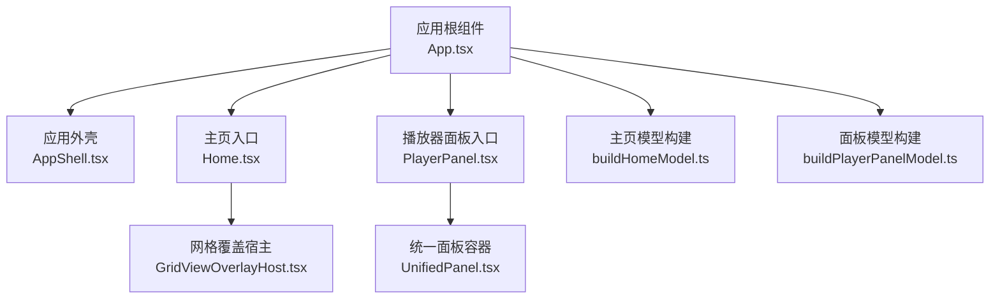
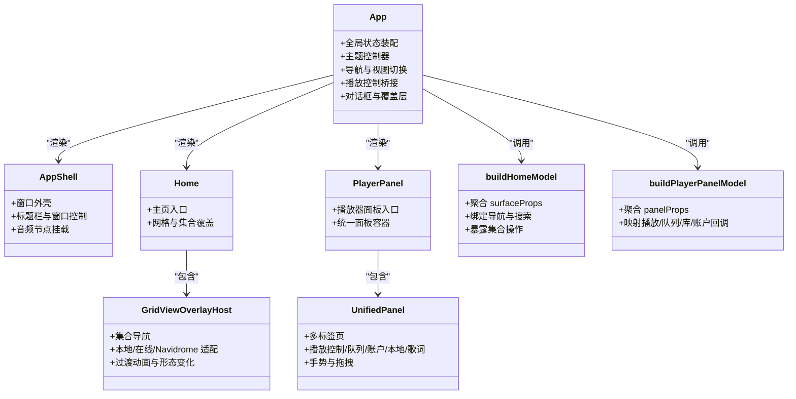
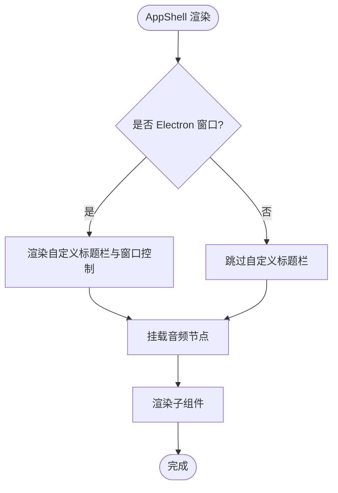
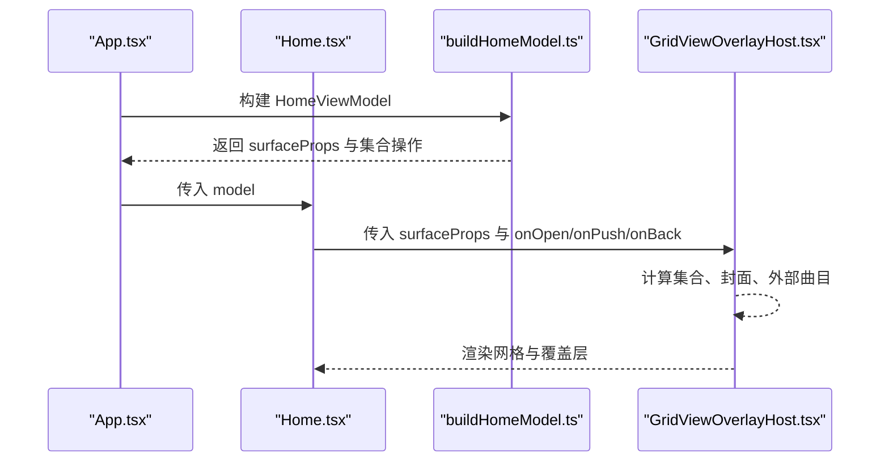
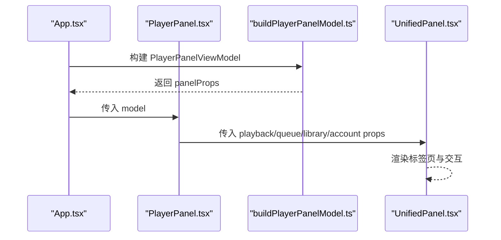
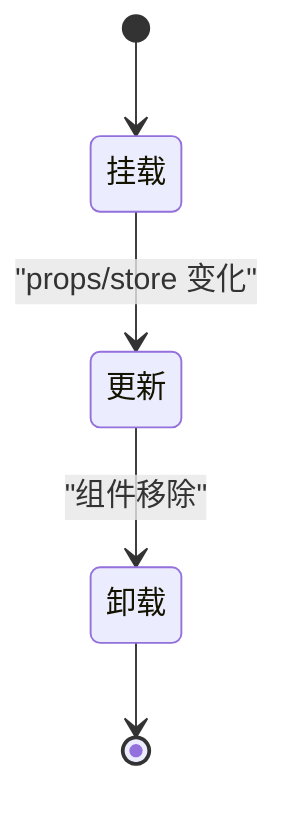
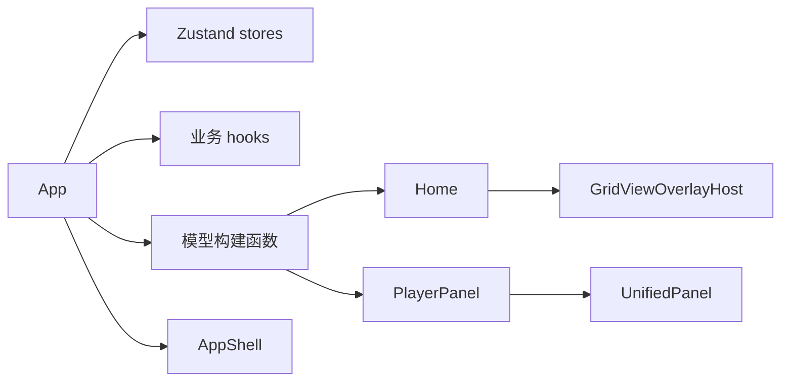

# React组件架构

<cite>
**本文引用的文件**   
- [App.tsx](file://src/App.tsx)
- [AppShell.tsx](file://src/components/app/AppShell.tsx)
- [Home.tsx](file://src/components/app/Home.tsx)
- [PlayerPanel.tsx](file://src/components/app/PlayerPanel.tsx)
- [buildHomeModel.ts](file://src/components/app/home/buildHomeModel.ts)
- [GridViewOverlayHost.tsx](file://src/components/app/home/GridViewOverlayHost.tsx)
- [UnifiedPanel.tsx](file://src/components/UnifiedPanel.tsx)
- [buildPlayerPanelModel.ts](file://src/components/app/player-panel/buildPlayerPanelModel.ts)
</cite>

## 目录
1. [引言](#引言)
2. [项目结构](#项目结构)
3. [核心组件](#核心组件)
4. [架构总览](#架构总览)
5. [详细组件分析](#详细组件分析)
6. [依赖关系分析](#依赖关系分析)
7. [性能优化策略](#性能优化策略)
8. [测试与调试指南](#测试与调试指南)
9. [开发规范与命名约定](#开发规范与命名约定)
10. [结论](#结论)

## 引言
本文面向 Folia Major 的 React 前端，聚焦应用级组件架构：以 App 为根、AppShell 作为窗口外壳、Home 作为主页表面、PlayerPanel 作为播放器侧面板。文档从组件层次、通信模式、生命周期管理、复用模式、性能优化、测试与调试以及开发规范等维度展开，帮助开发者在复杂播放与可视化场景中稳定扩展界面。

## 项目结构
Folia Major 的前端采用“应用层 + 功能域”的组织方式：
- 应用层位于 `src/components/app`，负责顶层布局、导航、状态装配与页面组合。
- 功能域按能力拆分，例如 `home`（主页）、`player-panel`（播放器面板）、`lattice`（舞台）、`overlays`（覆盖层）等。
- 通用 UI 与交互逻辑下沉到 `components/shared`、`components/floating-player`、`components/panelTab` 等可复用模块。
- 状态集中在 `stores` 与 `services`，React 组件通过 hooks 订阅 store，避免深层 props 传递。

**图表来源**
- [App.tsx:1-150](file://src/App.tsx#L1-L150)
- [AppShell.tsx:1-161](file://src/components/app/AppShell.tsx#L1-L161)
- [Home.tsx:1-44](file://src/components/app/Home.tsx#L1-L44)
- [PlayerPanel.tsx:1-19](file://src/components/app/PlayerPanel.tsx#L1-L19)
- [GridViewOverlayHost.tsx:1-120](file://src/components/app/home/GridViewOverlayHost.tsx#L1-L120)
- [UnifiedPanel.tsx:1-141](file://src/components/UnifiedPanel.tsx#L1-L141)
- [buildHomeModel.ts:1-149](file://src/components/app/home/buildHomeModel.ts#L1-L149)
- [buildPlayerPanelModel.ts:1-301](file://src/components/app/player-panel/buildPlayerPanelModel.ts#L1-L301)

**章节来源**
- [App.tsx:1-150](file://src/App.tsx#L1-L150)
- [AppShell.tsx:1-161](file://src/components/app/AppShell.tsx#L1-L161)
- [Home.tsx:1-44](file://src/components/app/Home.tsx#L1-L44)
- [PlayerPanel.tsx:1-19](file://src/components/app/PlayerPanel.tsx#L1-L19)

## 核心组件
- App：应用根组件，负责全局状态装配、主题控制器、导航、播放控制桥接、设置与对话框、命令面板、视觉化渲染等。它把大量业务回调与数据聚合后，再传递给子组件或模型构建函数。
- AppShell：应用外壳，封装 Electron 标题栏、窗口控制、点击穿透开关、音频节点挂载和整体样式容器。
- Home：主页入口，接收由 `buildHomeModel` 生成的视图模型，渲染网格与集合覆盖层。
- PlayerPanel：播放器面板入口，接收由 `buildPlayerPanelModel` 生成的面板模型，渲染 `UnifiedPanel`。

这些组件共同构成“根容器 + 主内容 + 侧面板”的稳定骨架，所有业务细节被收敛到模型构建函数与 store/hook 中，使 UI 层保持简洁。

**章节来源**
- [App.tsx:1-150](file://src/App.tsx#L1-L150)
- [AppShell.tsx:1-161](file://src/components/app/AppShell.tsx#L1-L161)
- [Home.tsx:1-44](file://src/components/app/Home.tsx#L1-L44)
- [PlayerPanel.tsx:1-19](file://src/components/app/PlayerPanel.tsx#L1-L19)

## 架构总览
Folia Major 的组件架构遵循“状态提升 + 模型装配 + 纯展示”的分层原则：
- 状态层：Zustand store（如 `usePlaybackStore`、`useAppViewStore`、`useThemeSettingsStore` 等）集中管理播放、视图、主题、设置等状态。
- 装配层：`App.tsx` 将 store 值、服务回调、平台桥接整合成稳定的对象或回调，并通过 `buildHomeModel` / `buildPlayerPanelModel` 生成视图模型。
- 展示层：`Home` 与 `PlayerPanel` 只消费模型，不直接耦合 store；内部具体实现下沉到 `GridViewOverlayHost`、`UnifiedPanel` 等更细粒度的组件。

**图表来源**
- [App.tsx:1-150](file://src/App.tsx#L1-L150)
- [AppShell.tsx:1-161](file://src/components/app/AppShell.tsx#L1-L161)
- [Home.tsx:1-44](file://src/components/app/Home.tsx#L1-L44)
- [PlayerPanel.tsx:1-19](file://src/components/app/PlayerPanel.tsx#L1-L19)
- [GridViewOverlayHost.tsx:1-120](file://src/components/app/home/GridViewOverlayHost.tsx#L1-L120)
- [UnifiedPanel.tsx:1-141](file://src/components/UnifiedPanel.tsx#L1-L141)
- [buildHomeModel.ts:1-149](file://src/components/app/home/buildHomeModel.ts#L1-L149)
- [buildPlayerPanelModel.ts:1-301](file://src/components/app/player-panel/buildPlayerPanelModel.ts#L1-L301)

## 详细组件分析

### AppShell：根容器的职责
AppShell 是应用的固定外壳，承担以下职责：
- 提供全屏容器与背景样式，支持圆角与透明边框。
- 在 Electron 环境下集成自定义标题栏、窗口控制按钮与点击穿透开关。
- 挂载音频元素，确保音频节点与应用生命周期一致。
- 根据当前视图（是否播放器视图）与用户偏好动态调整标题栏遮罩与可见性。

其 props 设计清晰区分了环境参数（Electron、窗口半径、透明度）、UI 行为（标题栏显示、点击穿透）与内容区域（children、audioElement），便于在不同部署模式下复用。

**图表来源**
- [AppShell.tsx:1-161](file://src/components/app/AppShell.tsx#L1-L161)

**章节来源**
- [AppShell.tsx:1-161](file://src/components/app/AppShell.tsx#L1-L161)

### Home：主页组件的组织结构
Home 是一个薄包装组件，主要职责：
- 接收 `HomeViewModel`，将其中的 `surfaceProps` 传给网格与覆盖宿主。
- 根据 `isHomeFullyHidden` 决定是否渲染，避免无意义更新。
- 使用 `countRender` 进行渲染计数，便于性能分析。
- 通过 `React.memo` 包裹，减少因 App 频繁重渲染导致的整棵主页树重建。

内部实际渲染由 `GridViewOverlayHost` 接管，后者负责集合导航、封面解析、外部曲目加载、本地/在线/Navidrome 适配与过渡动画。

**图表来源**
- [Home.tsx:1-44](file://src/components/app/Home.tsx#L1-L44)
- [buildHomeModel.ts:1-149](file://src/components/app/home/buildHomeModel.ts#L1-L149)
- [GridViewOverlayHost.tsx:1-120](file://src/components/app/home/GridViewOverlayHost.tsx#L1-L120)

**章节来源**
- [Home.tsx:1-44](file://src/components/app/Home.tsx#L1-L44)
- [GridViewOverlayHost.tsx:1-120](file://src/components/app/home/GridViewOverlayHost.tsx#L1-L120)

### PlayerPanel：播放器面板的组件树
PlayerPanel 同样是一个薄包装组件，主要职责：
- 接收 `PlayerPanelViewModel`，将其中的 `panelProps` 透传给 `UnifiedPanel`。
- 使用 `React.memo` 包裹，避免面板随无关状态变化而重渲染。

`UnifiedPanel` 是播放器面板的核心容器，负责：
- 多标签页（封面、控制、队列、账户、本地、Navidrome、在线歌词、模组扩展标签）。
- 播放控制、音量、循环模式、喜欢状态、主题与可视化模式。
- 队列操作（播放、打乱、移除、移动）。
- 账户信息、缓存、同步、音质设置。
- 手势与拖拽打开命令面板、封面操作区显隐、底部栏高度适配。

**图表来源**
- [PlayerPanel.tsx:1-19](file://src/components/app/PlayerPanel.tsx#L1-L19)
- [buildPlayerPanelModel.ts:1-301](file://src/components/app/player-panel/buildPlayerPanelModel.ts#L1-L301)
- [UnifiedPanel.tsx:1-141](file://src/components/UnifiedPanel.tsx#L1-L141)

**章节来源**
- [PlayerPanel.tsx:1-19](file://src/components/app/PlayerPanel.tsx#L1-L19)
- [UnifiedPanel.tsx:1-141](file://src/components/UnifiedPanel.tsx#L1-L141)

### 组件间通信模式
- Props 传递：App 将 store 值与服务回调组装后，通过 `buildHomeModel` / `buildPlayerPanelModel` 生成稳定的模型对象，再传给 Home / PlayerPanel。这种“模型装配”避免了在 App 中手写大量嵌套 props。
- 事件冒泡：Home 的集合导航通过 `onOpenCollection` / `onPushCollection` / `onBackCollection` 向上传递，由上层 store 或导航逻辑处理；PlayerPanel 的标签切换、播放控制、队列操作通过 `UnifiedPanel` 的 props 回调向上触发。
- 上下文提供者：项目中广泛使用 Zustand store 作为全局状态源，组件通过 hooks 订阅所需字段，而不是通过 React Context 层层传递。
- 状态提升：播放状态、视图状态、主题设置、音频设置等均提升到 store，组件仅持有最小必要状态，保证单一数据源与可预测更新。

**章节来源**
- [buildHomeModel.ts:1-149](file://src/components/app/home/buildHomeModel.ts#L1-L149)
- [buildPlayerPanelModel.ts:1-301](file://src/components/app/player-panel/buildPlayerPanelModel.ts#L1-L301)
- [GridViewOverlayHost.tsx:120-226](file://src/components/app/home/GridViewOverlayHost.tsx#L120-L226)
- [UnifiedPanel.tsx:141-301](file://src/components/UnifiedPanel.tsx#L141-L301)

### 组件生命周期管理
- 挂载阶段：
  - App 初始化同步协调器、主题控制器、导航、播放桥接、自动扫描、媒体会话桥接等。
  - AppShell 在 Electron 环境中监听窗口最大化状态并同步 UI。
  - GridViewOverlayHost 在集合变化时加载外部曲目、解析封面、准备过渡动画。
- 更新阶段：
  - Home 与 PlayerPanel 通过 `React.memo` 减少不必要的重渲染。
  - UnifiedPanel 根据当前歌曲来源（本地、在线、Navidrome、Stage）动态调整标签与可用操作。
- 卸载阶段：
  - AppShell 在组件卸载时移除窗口 resize 监听。
  - GridViewOverlayHost 在 effect 清理中取消异步请求与定时器，避免内存泄漏。

**图表来源**
- [AppShell.tsx:48-76](file://src/components/app/AppShell.tsx#L48-L76)
- [GridViewOverlayHost.tsx:477-510](file://src/components/app/home/GridViewOverlayHost.tsx#L477-L510)

**章节来源**
- [AppShell.tsx:48-76](file://src/components/app/AppShell.tsx#L48-L76)
- [GridViewOverlayHost.tsx:477-510](file://src/components/app/home/GridViewOverlayHost.tsx#L477-L510)

### 组件复用模式
- 高阶组件：项目较少使用传统 HOC，更多通过 hooks 与模型构建函数实现复用。例如 `buildHomeModel` / `buildPlayerPanelModel` 将复杂装配逻辑抽取为可复用的工厂。
- 渲染属性：`GridViewOverlayHost` 使用 render props 模式，将 `openGridView` 与 `isHomeGridInteractive` 暴露给父级，以便 Home 控制网格交互状态。
- 自定义 Hook：大量业务逻辑下沉到 hooks（如 `useAppNavigation`、`useThemeController`、`usePlaybackRuntimeRefs` 等），组件只负责组合与呈现。

**章节来源**
- [buildHomeModel.ts:1-149](file://src/components/app/home/buildHomeModel.ts#L1-L149)
- [buildPlayerPanelModel.ts:1-301](file://src/components/app/player-panel/buildPlayerPanelModel.ts#L1-L301)
- [GridViewOverlayHost.tsx:42-52](file://src/components/app/home/GridViewOverlayHost.tsx#L42-L52)

### 组件性能优化策略
- React.memo：Home 与 PlayerPanel 均使用 `React.memo` 包裹，避免 App 中任何 store 写入导致整棵树重渲染。
- useMemo：App 中多处使用 `useMemo` 缓存回调与配置（如过渡设置、歌词设置、在线恢复控制器、封面 URL 解析器等），减少高频播放帧下的重建开销。
- useCallback：对需要作为依赖传入子组件或 memo 对象的回调使用 `useCallback`，保证引用稳定。
- 选择式订阅：通过 `useShallow` 与精确字段选择，避免订阅整个 store 对象引发的不必要更新。
- 懒加载：部分重型组件（如 Lattice、AutomixTransitionAnimation）使用 `lazy` 与 `Suspense`，仅在需要时加载。

**章节来源**
- [Home.tsx:40-44](file://src/components/app/Home.tsx#L40-L44)
- [PlayerPanel.tsx:16-19](file://src/components/app/PlayerPanel.tsx#L16-L19)
- [App.tsx:270-275](file://src/App.tsx#L270-L275)
- [App.tsx:564-588](file://src/App.tsx#L564-L588)

## 依赖关系分析
- App 依赖多个 store 与 hooks，负责装配全局状态与业务回调。
- Home 依赖 `buildHomeModel` 提供的 `HomeViewModel`，并通过 `GridViewOverlayHost` 实现集合导航与覆盖层。
- PlayerPanel 依赖 `buildPlayerPanelModel` 提供的 `PlayerPanelViewModel`，并通过 `UnifiedPanel` 实现播放器面板的多标签页与交互。
- AppShell 依赖 Electron API 与窗口控制组件，提供稳定的外壳。

**图表来源**
- [App.tsx:1-150](file://src/App.tsx#L1-L150)
- [buildHomeModel.ts:1-149](file://src/components/app/home/buildHomeModel.ts#L1-L149)
- [buildPlayerPanelModel.ts:1-301](file://src/components/app/player-panel/buildPlayerPanelModel.ts#L1-L301)
- [GridViewOverlayHost.tsx:1-120](file://src/components/app/home/GridViewOverlayHost.tsx#L1-L120)
- [UnifiedPanel.tsx:1-141](file://src/components/UnifiedPanel.tsx#L1-L141)
- [AppShell.tsx:1-161](file://src/components/app/AppShell.tsx#L1-L161)

**章节来源**
- [App.tsx:1-150](file://src/App.tsx#L1-L150)
- [buildHomeModel.ts:1-149](file://src/components/app/home/buildHomeModel.ts#L1-L149)
- [buildPlayerPanelModel.ts:1-301](file://src/components/app/player-panel/buildPlayerPanelModel.ts#L1-L301)

## 性能优化策略
- 组件级别优化：
  - 使用 `React.memo` 包裹 Home 与 PlayerPanel，避免无关更新。
  - 在 GridViewOverlayHost 中使用 `useMemo` 计算集合与封面，减少重复计算。
- 回调级别优化：
  - 使用 `useCallback` 稳定回调引用，避免子组件因函数变化而重渲染。
  - 使用 `useShallow` 精确订阅 store 字段，降低更新频率。
- 资源级别优化：
  - 懒加载重型组件，减少初始包体积。
  - 使用 `requestAnimationFrame` 与节流策略优化音量预览与动画。
- 渲染计数：
  - 通过 `countRender` 对关键组件进行渲染计数，辅助定位性能瓶颈。

**章节来源**
- [Home.tsx:40-44](file://src/components/app/Home.tsx#L40-L44)
- [PlayerPanel.tsx:16-19](file://src/components/app/PlayerPanel.tsx#L16-L19)
- [GridViewOverlayHost.tsx:145-176](file://src/components/app/home/GridViewOverlayHost.tsx#L145-L176)
- [App.tsx:548-562](file://src/App.tsx#L548-L562)

## 测试与调试指南
- 单元测试：
  - 针对 Folium 事件总线、主机动作、挂载宿主等进行单元测试，验证事件优先级、错误隔离与生命周期。
  - 使用 `vi.hoisted` 模拟 localStorage，避免导入时副作用影响测试。
- 组件测试：
  - 使用 Playwright 进行 UI 截图与交互测试，覆盖命令面板、网格、设置等场景。
  - 使用 Vitest 进行单元与组件测试，结合 `act` 与 `createRoot` 模拟 React 渲染。
- 调试技巧：
  - 使用 `countRender` 统计关键组件渲染次数，定位过度渲染。
  - 使用 `dev-probe.html` 与探针脚本独立运行特定组件，隔离主应用干扰。
  - 在 Electron 环境中使用控制台日志与状态快照，检查播放状态、主题、窗口行为。

**章节来源**
- [test/unit/mod-system/foliumEvents.test.ts:29-54](file://test/unit/mod-system/foliumEvents.test.ts#L29-L54)
- [test/unit/mod-system/foliumHostActions.test.ts:1-64](file://test/unit/mod-system/foliumHostActions.test.ts#L1-L64)
- [dev-probe.html:1-18](file://dev-probe.html#L1-L18)

## 开发规范与命名约定
- 组件命名：
  - 使用 PascalCase 命名组件文件与组件名，如 `AppShell`、`Home`、`PlayerPanel`。
  - 模型构建函数使用动词短语，如 `buildHomeModel`、`buildPlayerPanelModel`。
- 状态管理：
  - 优先使用 Zustand store 与 hooks，避免在组件内维护全局状态。
  - 使用 `useShallow` 与精确字段选择，减少不必要更新。
- 通信模式：
  - 通过 props 传递数据与回调，避免深层嵌套。
  - 使用模型构建函数聚合复杂 props，提高可读性与可维护性。
- 性能优化：
  - 对高频更新的组件使用 `React.memo`。
  - 对计算密集型逻辑使用 `useMemo`。
  - 对回调使用 `useCallback`，确保引用稳定。
- 测试与调试：
  - 为关键组件编写单元测试与 UI 测试。
  - 使用 `countRender` 与探针脚本进行性能分析与调试。

**章节来源**
- [App.tsx:1-150](file://src/App.tsx#L1-L150)
- [buildHomeModel.ts:1-149](file://src/components/app/home/buildHomeModel.ts#L1-L149)
- [buildPlayerPanelModel.ts:1-301](file://src/components/app/player-panel/buildPlayerPanelModel.ts#L1-L301)

## 结论
Folia Major 的 React 组件架构以 App 为根、AppShell 为外壳、Home 与 PlayerPanel 为核心内容，通过模型构建函数与 store 实现清晰的职责分离。组件间通信以 props 为主，辅以 store 与 hooks 进行状态管理。生命周期管理严谨，性能优化策略完善，测试与调试工具齐全。遵循本文的开发规范与命名约定，可以在复杂播放与可视化场景中稳定扩展界面，同时保持代码的可读性与可维护性。