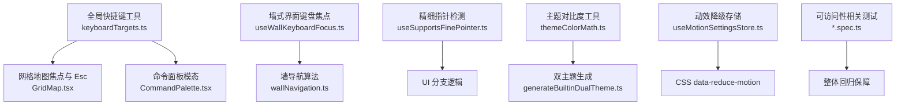
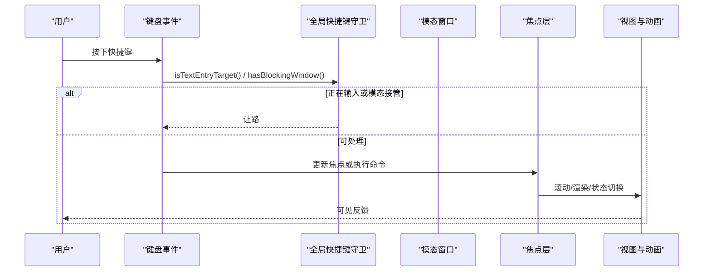
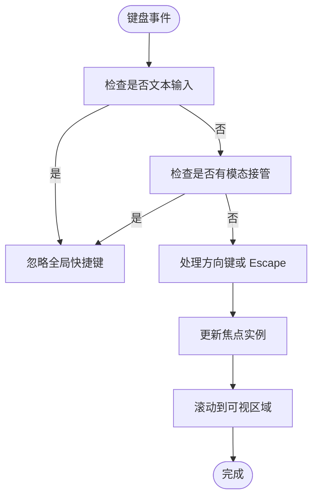
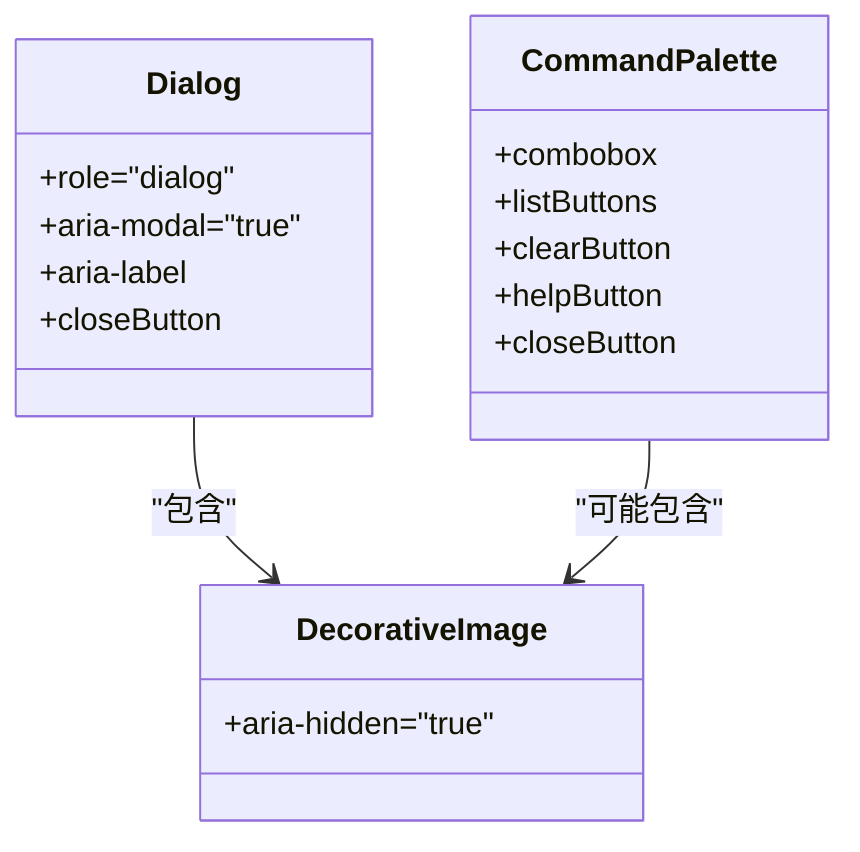
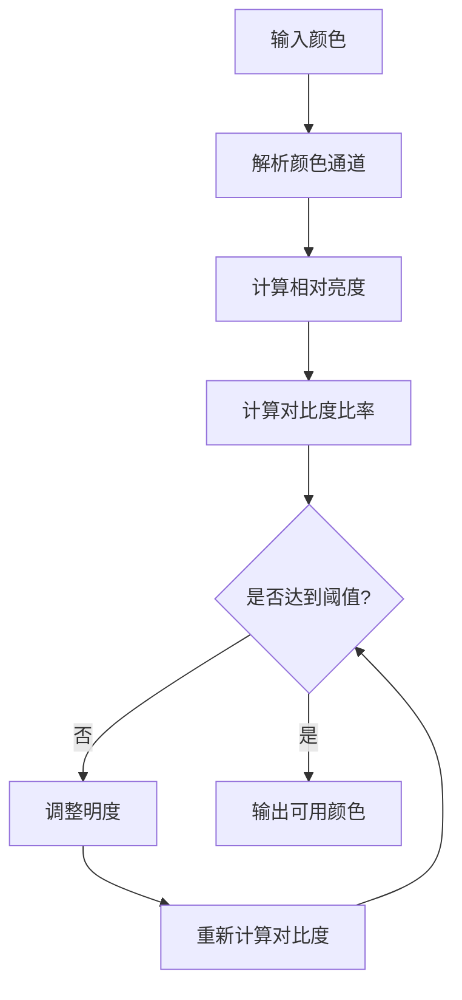
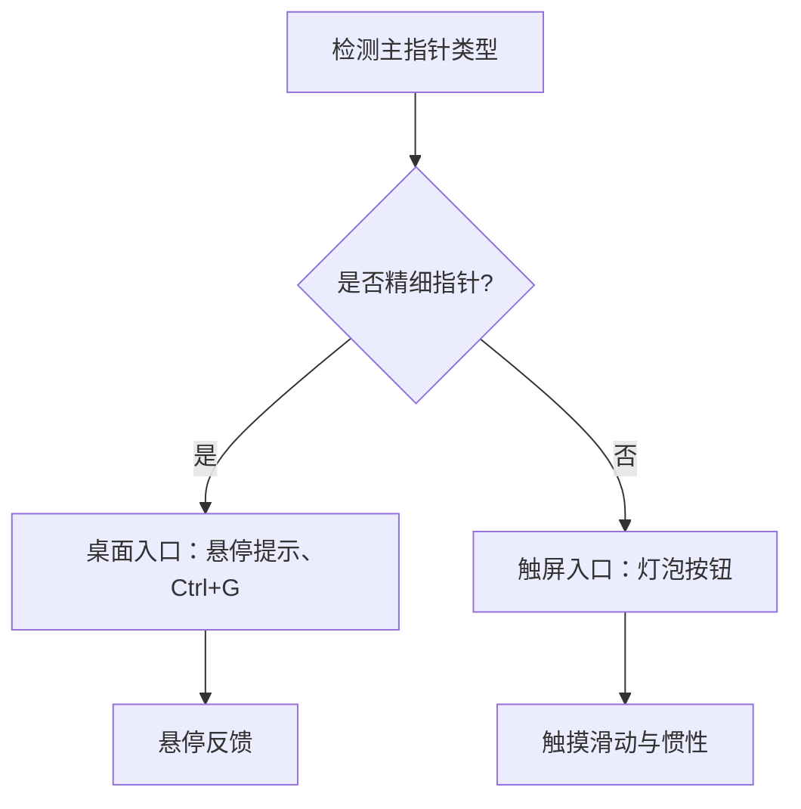
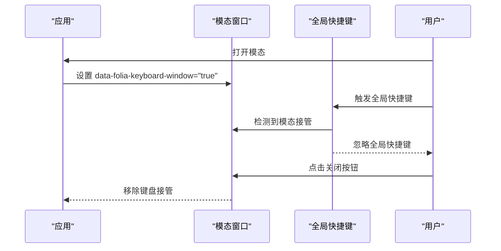
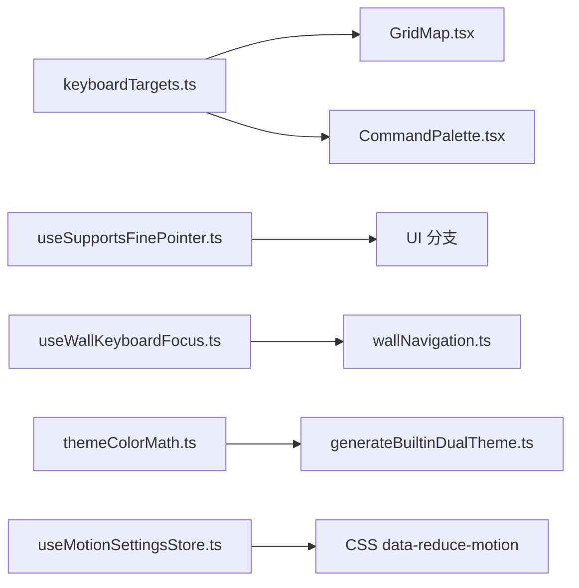

# 可访问性支持

<cite>
**本文引用的文件**   
- [keyboardTargets.ts](file://src/utils/keyboardTargets.ts)
- [useSupportsFinePointer.ts](file://src/hooks/useSupportsFinePointer.ts)
- [useWallKeyboardFocus.ts](file://src/components/app/lattice/useWallKeyboardFocus.ts)
- [wallNavigation.ts](file://src/components/app/lattice/wallNavigation.ts)
- [GridMap.tsx](file://src/components/GridMap.tsx)
- [CommandPalette.tsx](file://src/components/command-palette/CommandPalette.tsx)
- [ThemeParkColorPanel.tsx](file://src/components/modal/theme-park/ThemeParkColorPanel.tsx)
- [generateBuiltinDualTheme.ts](file://src/utils/builtinTheme/generateBuiltinDualTheme.ts)
- [themeColorMath.ts](file://src/utils/themeColorMath.ts)
- [dioramaKeywordColor.ts](file://src/components/visualizer/diorama/dioramaKeywordColor.ts)
- [useMotionSettingsStore.ts](file://src/stores/useMotionSettingsStore.ts)
- [OnlineProviderLoginModal.tsx](file://src/components/app/home/OnlineProviderLoginModal.tsx)
- [settingsHelpActions.spec.ts](file://test/component/settingsHelpActions.spec.ts)
- [lattice.spec.ts](file://test/component/lattice.spec.ts)
- [ponderHint.spec.ts](file://test/component/ponderHint.spec.ts)
- [commandPaletteVirtualList.spec.ts](file://test/ui/commandPaletteVirtualList.spec.ts)
</cite>

## 目录
1. [简介](#简介)
2. [项目结构中的可访问性位置](#项目结构中的可访问性位置)
3. [核心可访问性组件与能力](#核心可访问性组件与能力)
4. [架构总览](#架构总览)
5. [详细组件分析](#详细组件分析)
6. [依赖关系分析](#依赖关系分析)
7. [性能与体验特性](#性能与体验特性)
8. [无障碍测试策略](#无障碍测试策略)
9. [WCAG 合规指导与最佳实践](#wcag-合规指导与最佳实践)
10. [调试工具与排错建议](#调试工具与排错建议)
11. [结论](#结论)

## 简介
本文面向 Folia Major 的可访问性实现，聚焦以下目标：
- 键盘导航与焦点管理：包括全局快捷键守卫、模态窗口键盘接管、网格与墙式界面的方向键导航。
- 屏幕阅读器兼容：ARIA 属性使用、语义化标记和朗读顺序控制。
- 高对比度与视觉可读性：颜色主题生成、对比度计算、动效降级。
- 触摸与鼠标交互统一：指针设备检测、悬停与触屏入口分流。
- 焦点陷阱与对话框：模态框键盘接管、Esc 行为、焦点恢复。
- 无障碍测试：自动化测试、手动流程与用户体验评估。
- WCAG 合规性与开发调试建议。

## 项目结构中的可访问性位置
Folia Major 的可访问性能力分散在工具函数、React Hooks、页面组件、模态组件和测试文件中，形成“全局快捷键守卫 + 局部焦点层 + 模态键盘接管 + 主题与动效适配”的协作模式。

**图表来源**
- [keyboardTargets.ts:1-33](file://src/utils/keyboardTargets.ts#L1-L33)
- [GridMap.tsx:830-896](file://src/components/GridMap.tsx#L830-L896)
- [CommandPalette.tsx:380-470](file://src/components/command-palette/CommandPalette.tsx#L380-L470)
- [useWallKeyboardFocus.ts:1-175](file://src/components/app/lattice/useWallKeyboardFocus.ts#L1-L175)
- [wallNavigation.ts:109-131](file://src/components/app/lattice/wallNavigation.ts#L109-L131)
- [useSupportsFinePointer.ts:1-14](file://src/hooks/useSupportsFinePointer.ts#L1-L14)
- [themeColorMath.ts:111-152](file://src/utils/themeColorMath.ts#L111-L152)
- [generateBuiltinDualTheme.ts:74-116](file://src/utils/builtinTheme/generateBuiltinDualTheme.ts#L74-L116)
- [useMotionSettingsStore.ts:112-136](file://src/stores/useMotionSettingsStore.ts#L112-L136)

**章节来源**
- [keyboardTargets.ts:1-33](file://src/utils/keyboardTargets.ts#L1-L33)
- [useSupportsFinePointer.ts:1-14](file://src/hooks/useSupportsFinePointer.ts#L1-L14)
- [useWallKeyboardFocus.ts:1-175](file://src/components/app/lattice/useWallKeyboardFocus.ts#L1-L175)
- [GridMap.tsx:830-896](file://src/components/GridMap.tsx#L830-L896)
- [CommandPalette.tsx:380-470](file://src/components/command-palette/CommandPalette.tsx#L380-L470)
- [themeColorMath.ts:111-152](file://src/utils/themeColorMath.ts#L111-L152)
- [generateBuiltinDualTheme.ts:74-116](file://src/utils/builtinTheme/generateBuiltinDualTheme.ts#L74-L116)
- [useMotionSettingsStore.ts:112-136](file://src/stores/useMotionSettingsStore.ts#L112-L136)

## 核心可访问性组件与能力
- 全局快捷键守卫：判断是否处于文本输入、是否存在模态窗口接管键盘。
- 精细指针检测：区分桌面悬停与触屏入口，避免同时出现悬停提示与触屏灯泡。
- 墙式界面键盘导航：方向键移动焦点、Escape 退出或返回、自动滚动到可视区域。
- 网格地图焦点与 Esc：容器焦点管理、Esc 层级处理、忽略输入框和模态窗口。
- 命令面板模态：声明键盘接管、提供关闭按钮、列表项可操作。
- 主题对比度与动效降级：确保前景色与背景色满足对比度阈值，支持减少动效。
- 屏幕阅读器标记：aria-label、aria-modal、role="dialog"、aria-hidden 等。

**章节来源**
- [keyboardTargets.ts:10-33](file://src/utils/keyboardTargets.ts#L10-L33)
- [useSupportsFinePointer.ts:3-14](file://src/hooks/useSupportsFinePointer.ts#L3-L14)
- [useWallKeyboardFocus.ts:23-135](file://src/components/app/lattice/useWallKeyboardFocus.ts#L23-L135)
- [GridMap.tsx:830-896](file://src/components/GridMap.tsx#L830-L896)
- [CommandPalette.tsx:380-470](file://src/components/command-palette/CommandPalette.tsx#L380-L470)
- [themeColorMath.ts:111-152](file://src/utils/themeColorMath.ts#L111-L152)
- [useMotionSettingsStore.ts:112-136](file://src/stores/useMotionSettingsStore.ts#L112-L136)
- [OnlineProviderLoginModal.tsx:71-85](file://src/components/app/home/OnlineProviderLoginModal.tsx#L71-L85)

## 架构总览
Folia Major 的可访问性架构围绕“事件源 → 守卫判断 → 焦点层 → 视图反馈”展开：
- 事件源：键盘事件、指针事件、模态打开/关闭。
- 守卫判断：是否文本输入、是否模态接管、是否精细指针。
- 焦点层：网格容器、墙式卡片、命令面板输入框。
- 视图反馈：滚动定位、状态切换、动效降级、对比度调整。

**图表来源**
- [keyboardTargets.ts:10-33](file://src/utils/keyboardTargets.ts#L10-L33)
- [GridMap.tsx:830-896](file://src/components/GridMap.tsx#L830-L896)
- [CommandPalette.tsx:380-470](file://src/components/command-palette/CommandPalette.tsx#L380-L470)

## 详细组件分析

### 键盘导航与焦点管理
- 全局快捷键守卫：
  - 文本输入检测：input、textarea、select、contentEditable。
  - 模态接管检测：DOM 属性 `data-folia-keyboard-window="true"`。
- 网格地图焦点：
  - 容器 focus 时跳过输入框与模态窗口。
  - Escape 处理：忽略重复按键、忽略输入框、忽略模态窗口，按层级执行清除搜索、关闭侧栏、关闭信息面板、退出编辑或返回。
- 墙式界面键盘焦点：
  - 方向键映射为墙导航方向。
  - 首次箭头键只选择当前可视实例，后续箭头键沿墙移动。
  - 通过 `requestAnimationFrame` 与延迟 focus 避免样式重计算抖动。
  - 容器自身持有焦点，使方向键能进入处理器。

**图表来源**
- [keyboardTargets.ts:10-33](file://src/utils/keyboardTargets.ts#L10-L33)
- [GridMap.tsx:830-896](file://src/components/GridMap.tsx#L830-L896)
- [useWallKeyboardFocus.ts:98-135](file://src/components/app/lattice/useWallKeyboardFocus.ts#L98-L135)

**章节来源**
- [keyboardTargets.ts:10-33](file://src/utils/keyboardTargets.ts#L10-L33)
- [GridMap.tsx:830-896](file://src/components/GridMap.tsx#L830-L896)
- [useWallKeyboardFocus.ts:23-175](file://src/components/app/lattice/useWallKeyboardFocus.ts#L23-L175)
- [wallNavigation.ts:109-131](file://src/components/app/lattice/wallNavigation.ts#L109-L131)

### 屏幕阅读器兼容
- ARIA 属性：
  - 模态对话框使用 `role="dialog"`、`aria-modal="true"`、`aria-label`。
  - 关闭按钮提供 `aria-label`。
  - 装饰性图片使用 `aria-hidden="true"`。
  - 组合框、按钮、标签等具备语义角色与可访问名称。
- 语义化标记：
  - 命令面板列表项为按钮，具有标题、描述、分组标签。
  - 网格与墙式界面通过 DOM 属性与数据节点辅助测试与可访问性扫描。
- 朗读顺序控制：
  - 焦点移动到目标实例后，原生 ring、Enter/Space 与屏幕阅读器跟随。
  - 命令面板关闭按钮、清空按钮、帮助按钮均有明确 aria-label。

**图表来源**
- [OnlineProviderLoginModal.tsx:71-85](file://src/components/app/home/OnlineProviderLoginModal.tsx#L71-L85)
- [CommandPalette.tsx:422-470](file://src/components/command-palette/CommandPalette.tsx#L422-L470)

**章节来源**
- [OnlineProviderLoginModal.tsx:71-85](file://src/components/app/home/OnlineProviderLoginModal.tsx#L71-L85)
- [CommandPalette.tsx:422-470](file://src/components/command-palette/CommandPalette.tsx#L422-L470)

### 高对比度模式与颜色主题
- 对比度计算：
  - 相对亮度计算与对比度比率计算。
  - 根据背景色调整前景色明度以满足最小对比度阈值。
- 双主题生成：
  - 主色、强调色、次要色均经过对比度调整。
  - 当强调色与主色冲突时，调整强调色明度以保证可读性。
- 可视化关键词对比度：
  - 对三维场景中的关键词颜色进行对比度测量与调整。
- 主题面板：
  - 颜色面板按钮展示当前颜色值与说明，便于用户理解与调整。

**图表来源**
- [themeColorMath.ts:111-152](file://src/utils/themeColorMath.ts#L111-L152)
- [generateBuiltinDualTheme.ts:74-116](file://src/utils/builtinTheme/generateBuiltinDualTheme.ts#L74-L116)
- [dioramaKeywordColor.ts:64-86](file://src/components/visualizer/diorama/dioramaKeywordColor.ts#L64-L86)
- [ThemeParkColorPanel.tsx:73-99](file://src/components/modal/theme-park/ThemeParkColorPanel.tsx#L73-L99)

**章节来源**
- [themeColorMath.ts:111-152](file://src/utils/themeColorMath.ts#L111-L152)
- [generateBuiltinDualTheme.ts:74-116](file://src/utils/builtinTheme/generateBuiltinDualTheme.ts#L74-L116)
- [dioramaKeywordColor.ts:64-86](file://src/components/visualizer/diorama/dioramaKeywordColor.ts#L64-L86)
- [ThemeParkColorPanel.tsx:73-99](file://src/components/modal/theme-park/ThemeParkColorPanel.tsx#L73-L99)

### 触摸与鼠标交互统一
- 精细指针检测：
  - 使用媒体查询 `(hover: hover) and (pointer: fine)` 判断主指针是否为精确指针。
  - 避免将带触屏的笔记本误判为触屏，也避免浏览器未识别触屏时的误判。
- 悬停与触屏分流：
  - 桌面端显示悬停提示与 Ctrl+G 说明。
  - 触屏端显示灯泡按钮，且不会与桌面悬停提示同时出现。
- 触摸滑动与惯性：
  - 测试中模拟 CDP 触摸事件，验证滑动与惯性行为。

**图表来源**
- [useSupportsFinePointer.ts:3-14](file://src/hooks/useSupportsFinePointer.ts#L3-L14)
- [lattice.spec.ts:155-174](file://test/component/lattice.spec.ts#L155-L174)
- [ponderHint.spec.ts:157-178](file://test/component/ponderHint.spec.ts#L157-L178)

**章节来源**
- [useSupportsFinePointer.ts:3-14](file://src/hooks/useSupportsFinePointer.ts#L3-L14)
- [lattice.spec.ts:155-174](file://test/component/lattice.spec.ts#L155-L174)
- [ponderHint.spec.ts:157-178](file://test/component/ponderHint.spec.ts#L157-L178)

### 焦点陷阱管理与对话框
- 模态窗口键盘接管：
  - 所有模态组件通过 `data-folia-keyboard-window="true"` 声明接管键盘。
  - 全局快捷键与网格地图 Esc 处理会跳过这些模态。
- 命令面板：
  - 打开时设置键盘接管，提供关闭按钮与帮助按钮。
  - 输入框与列表项具备可访问名称与状态。
- 对话框导航：
  - 登录模态使用 `role="dialog"`、`aria-modal="true"`、`aria-label`。
  - 关闭按钮具备明确的 aria-label。

**图表来源**
- [keyboardTargets.ts:25-33](file://src/utils/keyboardTargets.ts#L25-L33)
- [CommandPalette.tsx:380-470](file://src/components/command-palette/CommandPalette.tsx#L380-L470)
- [OnlineProviderLoginModal.tsx:71-85](file://src/components/app/home/OnlineProviderLoginModal.tsx#L71-L85)

**章节来源**
- [keyboardTargets.ts:25-33](file://src/utils/keyboardTargets.ts#L25-L33)
- [CommandPalette.tsx:380-470](file://src/components/command-palette/CommandPalette.tsx#L380-L470)
- [OnlineProviderLoginModal.tsx:71-85](file://src/components/app/home/OnlineProviderLoginModal.tsx#L71-L85)

## 依赖关系分析
可访问性相关模块之间的依赖如下：
- `keyboardTargets.ts` 被 `GridMap.tsx`、`CommandPalette.tsx`、`usePonderHoldToEnter.ts` 等引用，作为全局快捷键守卫。
- `useSupportsFinePointer.ts` 被 UI 分支逻辑引用，用于区分桌面与触屏入口。
- `useWallKeyboardFocus.ts` 依赖 `wallNavigation.ts` 进行墙式导航。
- `themeColorMath.ts` 被 `generateBuiltinDualTheme.ts` 与可视化组件引用，用于对比度计算。
- `useMotionSettingsStore.ts` 同步 `data-reduce-motion` 属性，供 CSS 读取。

**图表来源**
- [keyboardTargets.ts:1-33](file://src/utils/keyboardTargets.ts#L1-L33)
- [useSupportsFinePointer.ts:1-14](file://src/hooks/useSupportsFinePointer.ts#L1-L14)
- [useWallKeyboardFocus.ts:1-175](file://src/components/app/lattice/useWallKeyboardFocus.ts#L1-L175)
- [wallNavigation.ts:109-131](file://src/components/app/lattice/wallNavigation.ts#L109-L131)
- [themeColorMath.ts:111-152](file://src/utils/themeColorMath.ts#L111-L152)
- [generateBuiltinDualTheme.ts:74-116](file://src/utils/builtinTheme/generateBuiltinDualTheme.ts#L74-L116)
- [useMotionSettingsStore.ts:112-136](file://src/stores/useMotionSettingsStore.ts#L112-L136)

**章节来源**
- [keyboardTargets.ts:1-33](file://src/utils/keyboardTargets.ts#L1-L33)
- [useSupportsFinePointer.ts:1-14](file://src/hooks/useSupportsFinePointer.ts#L1-L14)
- [useWallKeyboardFocus.ts:1-175](file://src/components/app/lattice/useWallKeyboardFocus.ts#L1-L175)
- [wallNavigation.ts:109-131](file://src/components/app/lattice/wallNavigation.ts#L109-L131)
- [themeColorMath.ts:111-152](file://src/utils/themeColorMath.ts#L111-L152)
- [generateBuiltinDualTheme.ts:74-116](file://src/utils/builtinTheme/generateBuiltinDualTheme.ts#L74-L116)
- [useMotionSettingsStore.ts:112-136](file://src/stores/useMotionSettingsStore.ts#L112-L136)

## 性能与体验特性
- 焦点同步优化：
  - 使用 `requestAnimationFrame` 与延迟 `setTimeout` 避免频繁样式重计算。
  - 队列变化时仅更新必要状态，避免整个墙式界面重渲染。
- 动效降级：
  - 通过 `data-reduce-motion` 属性控制 CSS 动效，支持系统级减少动效偏好。
- 对比度自适应：
  - 动态调整颜色明度以满足 WCAG 对比度阈值，避免低对比度文本。

**章节来源**
- [useWallKeyboardFocus.ts:137-175](file://src/components/app/lattice/useWallKeyboardFocus.ts#L137-L175)
- [useMotionSettingsStore.ts:112-136](file://src/stores/useMotionSettingsStore.ts#L112-L136)
- [themeColorMath.ts:111-152](file://src/utils/themeColorMath.ts#L111-L152)

## 无障碍测试策略
- 自动化测试：
  - Playwright 组件测试覆盖触摸滑动、命令面板虚拟列表、设置帮助动作等。
  - 断言包含 `data-testid`、`role`、`aria-*` 属性，确保可访问性标记存在。
- 手动测试流程：
  - 使用键盘导航验证焦点顺序、Esc 行为、模态接管。
  - 使用屏幕阅读器验证朗读顺序与 ARIA 名称。
  - 在高对比度模式下验证颜色可读性。
- 用户体验评估：
  - 关注焦点移动是否自然、命令面板是否易用、模态是否可关闭。
  - 观察触屏设备上灯泡按钮是否出现且位置合理。

**章节来源**
- [lattice.spec.ts:155-174](file://test/component/lattice.spec.ts#L155-L174)
- [commandPaletteVirtualList.spec.ts:79-104](file://test/ui/commandPaletteVirtualList.spec.ts#L79-L104)
- [settingsHelpActions.spec.ts:87-113](file://test/component/settingsHelpActions.spec.ts#L87-L113)
- [ponderHint.spec.ts:157-178](file://test/component/ponderHint.spec.ts#L157-L178)

## WCAG 合规指导与最佳实践
- 可感知：
  - 确保文本与背景对比度至少 4.5:1（AA），大文本至少 3:1。
  - 为装饰性图片添加 `aria-hidden="true"`，避免干扰朗读。
- 可操作：
  - 所有功能可通过键盘访问，焦点顺序符合逻辑。
  - 模态窗口提供关闭方式，Esc 键有效。
- 可理解：
  - 使用语义化 HTML 与 ARIA 属性，确保屏幕阅读器正确朗读。
  - 按钮、输入框、组合框具备明确的 `aria-label` 或关联标签。
- 健壮性：
  - 在不同设备与浏览器上测试键盘与触摸交互。
  - 使用自动化测试覆盖关键可访问性路径。

[本节为通用指导，不直接分析具体文件]

## 调试工具与排错建议
- 键盘导航问题：
  - 检查 `isTextEntryTarget` 与 `hasBlockingWindow` 是否正确判断。
  - 确认模态窗口是否设置了 `data-folia-keyboard-window="true"`。
- 焦点丢失：
  - 检查容器是否调用 `focus({ preventScroll: true })`。
  - 确认墙式界面是否在 `requestAnimationFrame` 后延迟 focus。
- 屏幕阅读器无响应：
  - 检查 ARIA 属性是否缺失或错误。
  - 确认语义化标记是否正确。
- 颜色对比度不足：
  - 使用 `getContrastRatio` 与 `adjustLightnessForContrast` 验证颜色。
  - 检查主题生成逻辑是否应用了对比度调整。
- 动效干扰：
  - 检查 `data-reduce-motion` 属性是否正确设置。
  - 确认 CSS 是否读取该属性并降级动效。

**章节来源**
- [keyboardTargets.ts:10-33](file://src/utils/keyboardTargets.ts#L10-L33)
- [useWallKeyboardFocus.ts:137-175](file://src/components/app/lattice/useWallKeyboardFocus.ts#L137-L175)
- [themeColorMath.ts:111-152](file://src/utils/themeColorMath.ts#L111-L152)
- [useMotionSettingsStore.ts:112-136](file://src/stores/useMotionSettingsStore.ts#L112-L136)

## 结论
Folia Major 的可访问性支持通过全局快捷键守卫、局部焦点层、模态键盘接管、主题对比度调整与动效降级，构建了较为完整的无障碍体验。键盘导航、屏幕阅读器兼容、高对比度模式、触摸与鼠标统一处理、焦点陷阱管理以及自动化测试共同保障了用户在多种设备与辅助技术下的可用性。建议在后续开发中持续遵循 WCAG 准则，完善 ARIA 标记，强化测试覆盖，并关注真实用户的无障碍反馈。

[本节为总结性内容，不直接分析具体文件]