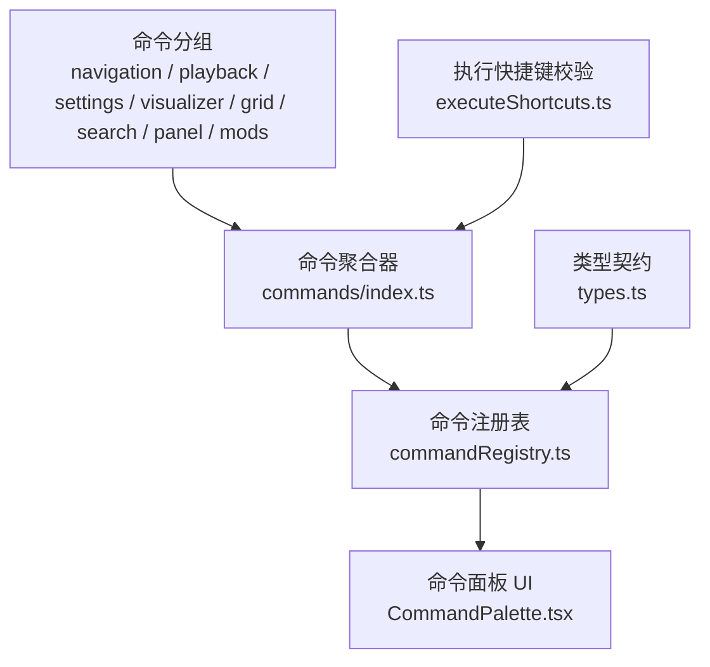
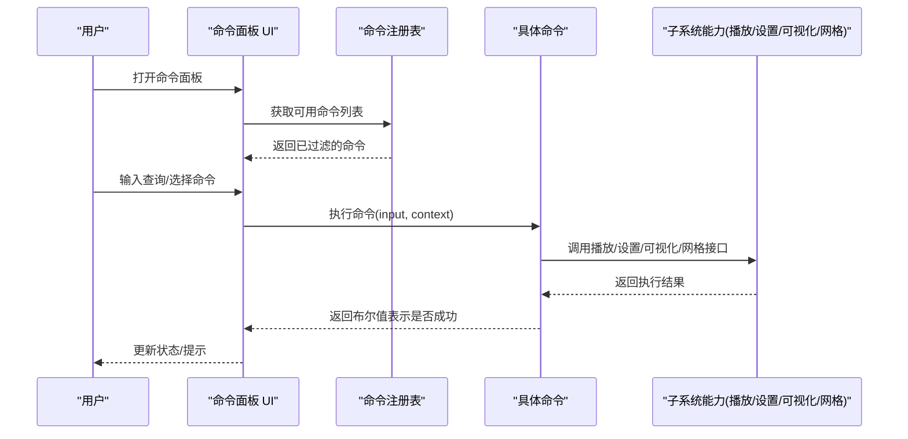
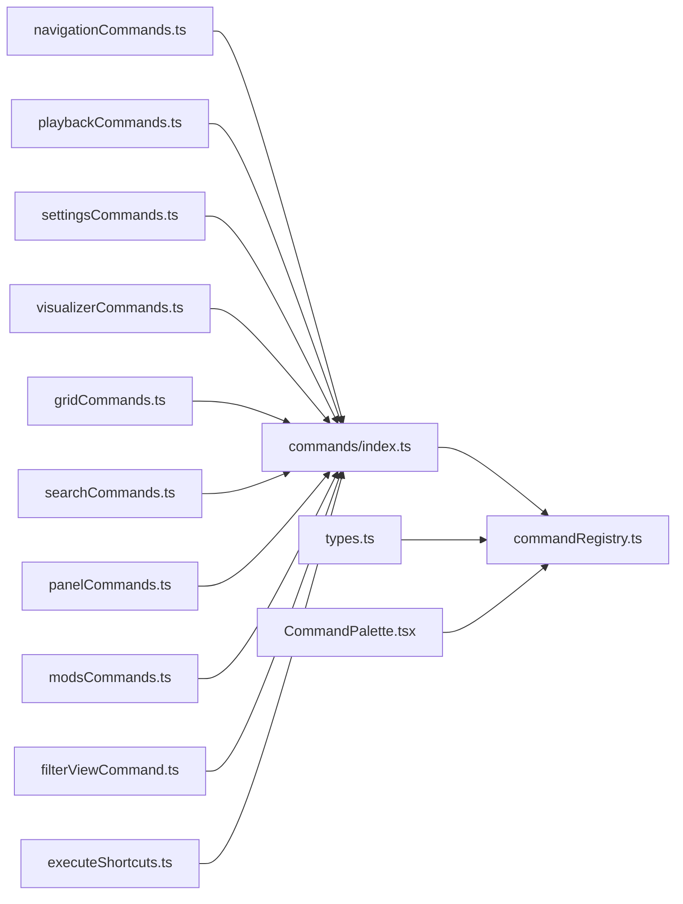

# 内置命令集

<cite>
**本文引用的文件**   
- [src/components/command-palette/commands/index.ts](file://src/components/command-palette/commands/index.ts)
- [src/components/command-palette/commandRegistry.ts](file://src/components/command-palette/commandRegistry.ts)
- [src/components/command-palette/types.ts](file://src/components/command-palette/types.ts)
- [src/components/command-palette/executeShortcuts.ts](file://src/components/command-palette/executeShortcuts.ts)
- [src/components/command-palette/CommandPalette.tsx](file://src/components/command-palette/CommandPalette.tsx)
- [src/components/command-palette/commands/navigationCommands.ts](file://src/components/command-palette/commands/navigationCommands.ts)
- [src/components/command-palette/commands/playbackCommands.ts](file://src/components/command-palette/commands/playbackCommands.ts)
- [src/components/command-palette/commands/settingsCommands.ts](file://src/components/command-palette/commands/settingsCommands.ts)
- [src/components/command-palette/commands/visualizerCommands.ts](file://src/components/command-palette/commands/visualizerCommands.ts)
- [src/components/command-palette/commands/gridCommands.ts](file://src/components/command-palette/commands/gridCommands.ts)
- [src/components/command-palette/commands/volumeCommand.ts](file://src/components/command-palette/commands/volumeCommand.ts)
- [src/components/command-palette/commands/searchCommands.ts](file://src/components/command-palette/commands/searchCommands.ts)
- [src/components/command-palette/commands/panelCommands.ts](file://src/components/command-palette/commands/panelCommands.ts)
- [src/components/command-palette/commands/modsCommands.ts](file://src/components/command-palette/commands/modsCommands.ts)
- [src/components/command-palette/commands/filterViewCommand.ts](file://src/components/command-palette/commands/filterViewCommand.ts)
</cite>

## 目录
1. [引言](#引言)
2. [项目结构](#项目结构)
3. [核心组件](#核心组件)
4. [架构总览](#架构总览)
5. [详细组件分析](#详细组件分析)
6. [依赖关系分析](#依赖关系分析)
7. [性能与可用性特性](#性能与可用性特性)
8. [参数规范与语法](#参数规范与语法)
9. [命令组合与批量处理](#命令组合与批量处理)
10. [分组、标签与搜索优化](#分组标签与搜索优化)
11. [使用示例与最佳实践](#使用示例与最佳实践)
12. [常见问题排查](#常见问题排查)
13. [结论](#结论)

## 引言
本文件为 Folia Major 的“命令面板”内置命令集提供系统化技术文档。内容覆盖导航、播放控制、设置操作、可视化、网格等命令的功能说明、参数规范、组合用法、分组组织方式，以及常见问题的定位方法。读者无需深入源码即可理解命令体系的设计与使用方式；同时，文档在关键处给出源码路径，便于进一步查阅实现细节。

## 项目结构
命令系统以“命令注册表 + 分组命令模块 + 类型契约 + 执行入口”的方式组织：
- 命令定义按功能分组存放于 commands 子目录，如 navigation、playback、settings、visualizer、grid、search、panel、mods 等。
- 所有命令最终汇聚到 index.ts，完成去重、快捷键冲突检查与构建全局索引。
- commandRegistry.ts 暴露可用命令列表、匹配与排序能力。
- types.ts 定义命令契约、上下文、分组、作用域等核心类型。
- executeShortcuts.ts 校验并构建“执行模式”下的 Vim 风格快捷键索引。
- CommandPalette.tsx 是命令面板 UI 渲染与交互入口。

**图示来源**
- [src/components/command-palette/commands/index.ts:76-88](file://src/components/command-palette/commands/index.ts#L76-L88)
- [src/components/command-palette/commandRegistry.ts:1-44](file://src/components/command-palette/commandRegistry.ts#L1-L44)
- [src/components/command-palette/types.ts:28-84](file://src/components/command-palette/types.ts#L28-L84)
- [src/components/command-palette/executeShortcuts.ts:33-61](file://src/components/command-palette/executeShortcuts.ts#L33-L61)
- [src/components/command-palette/CommandPalette.tsx:512-530](file://src/components/command-palette/CommandPalette.tsx#L512-L530)

**章节来源**
- [src/components/command-palette/commands/index.ts:1-107](file://src/components/command-palette/commands/index.ts#L1-L107)
- [src/components/command-palette/commandRegistry.ts:1-44](file://src/components/command-palette/commandRegistry.ts#L1-L44)
- [src/components/command-palette/types.ts:28-84](file://src/components/command-palette/types.ts#L28-L84)

## 核心组件
- 命令契约与上下文
  - CommandPaletteCommand：描述命令 id、分组、标题、描述、关键词、图标、是否需输入、平台/作用域/状态门控、打开热键、执行快捷键、自定义面板、语法、初始输入、预览文本、队列关联、设置跳转目标、执行函数等。
  - CommandPaletteContext：命令执行时获取的能力集合，包含共享能力（翻译、状态消息、当前歌曲、歌词、播放器状态）、搜索上下文、播放上下文、导航上下文、面板上下文、设置上下文、可视化上下文、作用域上下文等。
- 命令注册与过滤
  - COMMAND_PALETTE_COMMANDS：由 commands/index.ts 聚合所有分组命令，并进行 id 唯一性、openHotkey 唯一性、executeShortcut 前缀无冲突等断言。
  - getAvailableCommandPaletteCommands：根据 platform、scope、isAvailable 和 hidden 过滤出当前可用的命令。
- 执行快捷键
  - executeShortcuts.ts 保证同一作用域下 executeShortcut 不重复且无前缀冲突，并构建映射索引供“执行模式”快速查找。

**章节来源**
- [src/components/command-palette/types.ts:28-84](file://src/components/command-palette/types.ts#L28-L84)
- [src/components/command-palette/types.ts:94-377](file://src/components/command-palette/types.ts#L94-L377)
- [src/components/command-palette/commandRegistry.ts:13-43](file://src/components/command-palette/commandRegistry.ts#L13-L43)
- [src/components/command-palette/executeShortcuts.ts:33-61](file://src/components/command-palette/executeShortcuts.ts#L33-L61)

## 架构总览
命令面板的整体流程如下：
1. 用户通过全局快捷键或界面触发打开命令面板。
2. 命令面板从注册表获取可用命令列表，进行匹配与排序。
3. 用户输入后，命令面板显示预览与结果。
4. 用户确认执行后，调用对应命令的 execute(input, context)。
5. 命令通过 context 访问播放、设置、可视化、网格等子系统能力，完成业务动作。

**图示来源**
- [src/components/command-palette/commandRegistry.ts:39-43](file://src/components/command-palette/commandRegistry.ts#L39-L43)
- [src/components/command-palette/CommandPalette.tsx:512-530](file://src/components/command-palette/CommandPalette.tsx#L512-L530)
- [src/components/command-palette/types.ts:43-84](file://src/components/command-palette/types.ts#L43-L84)

## 详细组件分析

### 导航命令
导航命令用于在不同视图之间切换，包括首页、播放器、队列拼贴（Lattice），以及浏览器全屏、遥控窗口、主窗口置顶等桌面端能力。典型命令包括：
- 聚焦当前歌曲（队列拼贴）
- 返回首页/播放器/队列拼贴
- 浏览器全屏
- 打开各首页标签（歌单、本地音乐、专辑、Navidrome、电台）
- 桌面端：切换遥控窗口、主窗口置顶

这些命令通过 isAvailable 限制在特定作用域或状态下出现，例如在壁纸模式下禁用某些窗口级开关。

**章节来源**
- [src/components/command-palette/commands/navigationCommands.ts:7-58](file://src/components/command-palette/commands/navigationCommands.ts#L7-L58)

### 播放控制命令
播放控制命令涵盖传输控制、队列管理、音量调节、个人 FM 模式、ReplayGain、音效预设、收藏、添加到歌单、静音、随机播放、清空队列、自动匹配最佳歌词等。重点能力：
- 播放/暂停：根据当前播放器状态安全切换。
- 上一首/下一首、循环、随机、静音。
- 收藏与添加到歌单：需要当前有歌曲且支持该操作。
- 清空队列：FM 模式下不可用，队列为空时跳过。
- 音频效果：打开控制面板并进入均衡器。
- 自动匹配最佳歌词：一键运行最佳歌词匹配。

**章节来源**
- [src/components/command-palette/commands/playbackCommands.ts:14-137](file://src/components/command-palette/commands/playbackCommands.ts#L14-L137)

### 设置操作命令
设置命令覆盖广泛的应用配置与主题相关操作，包括：
- 打开帮助、选项中心、外观、通用、交互、播放、集成、存储、图形、模组、实验室等设置页。
- 锚点跳转：主题预设、歌词渲染、卡片样式、首页标签可见性、播放进入视图、固定命令槽位、自定义快捷键、网格动作按钮、队列行为、网易云听歌打卡、音频输出、智能过渡、本地歌词优先级与格式优先级、OBS 浏览器源、媒体缓存、同步服务器、本地文件夹监视、底部栏位置、播放器按钮槽位、可视化工作区、主题公园、全局时间偏移、歌词过滤等。
- 开关类设置：透明背景、明暗模式、始终显示返回按钮、队列拼贴暗角、自动跟随切歌、减少动效、跟随系统动效、始终显示切歌箭头、始终显示窗口控制按钮、隐藏全屏按钮、原生 macOS 全屏按钮、鼠标指针随控件隐藏、启动自动播放、转码回退、底部字幕层、字幕内容模式、字幕背景、语言切换等。
- 高级能力：AI 主题生成、主题来源切换、快速主题编辑器、歌词署名策略与吸收模式、智能过渡开关与模式、过渡性能模式、OBS CSS 复制、立即同步 AI 主题等。

**章节来源**
- [src/components/command-palette/commands/settingsCommands.ts:18-594](file://src/components/command-palette/commands/settingsCommands.ts#L18-L594)

### 可视化命令
可视化命令负责歌词动画模式与背景布局的选择与调整：
- 可视化选择器：浏览并切换歌词动画模式。
- 背景选择器：浏览并切换背景布局。
- 多种可视化模式：Sonnet、Tempera、Lumiere、Classic、Cadenza、Partita、Fume、Tilt、Claddagh、Monet、Pendolo、Cappella、Diorama、Still。
- 视频层：开关与选择本地视频作为歌词后方背景。
- Linux 发光模糊量化修复：解决长播放后歌词动画卡死问题。
- 每首歌随机可视化：切换后每次切歌随机选择一种可视化。
- 背景模式：通用、Nomand、Latent（像素/流体/混合）、URL 嵌入、Sora、Tide 等，部分支持参数微调。

**章节来源**
- [src/components/command-palette/commands/visualizerCommands.ts:11-202](file://src/components/command-palette/commands/visualizerCommands.ts#L11-L202)

### 网格命令
网格命令面向曲目网格的本地库管理与在线集合刷新：
- 排序：文件名、修改时间、专辑音轨号；升序/降序切换。
- 面板开关：合集信息面板、曲目列表侧边栏。
- 文件夹重扫描：单个文件夹、全部文件夹。
- 元数据整理：清理标题、艺人、专辑等。
- 导出歌单：保存为 m3u8。
- 实体编辑：编辑专辑或艺人。
- 编辑模式：进入/退出可删除歌曲的模式。
- 在线集合重载：绕过缓存重新加载。

**章节来源**
- [src/components/command-palette/commands/gridCommands.ts:17-122](file://src/components/command-palette/commands/gridCommands.ts#L17-L122)

### 音量命令
音量命令接受 0-100 的数字输入，并通过滑块表面进行拖拽调节：
- 必填参数：音量百分比（0-100）。
- 初始输入：当前音量百分比。
- 预览文本：当前音量或即将设置的音量。
- 执行逻辑：将输入解析为 0-1 的浮点后调用 setVolume。

**章节来源**
- [src/components/command-palette/commands/volumeCommand.ts:9-53](file://src/components/command-palette/commands/volumeCommand.ts#L9-L53)

### 搜索命令
搜索命令在当前音乐源中执行查询并跳转到结果页面：
- 当前源搜索：仅在当前应用内可用。
- 本地音乐搜索、Navidrome 搜索、网易云搜索：可通过工厂函数创建不同源的命令。
- 预览文本：显示“搜索某源歌曲：查询词”。
- 执行逻辑：提交搜索并导航到搜索结果，返回视图为播放器。

**章节来源**
- [src/components/command-palette/commands/searchCommands.ts:8-105](file://src/components/command-palette/commands/searchCommands.ts#L8-L105)

### 面板命令
面板命令用于打开统一侧面板的指定标签页：
- 封面、控制、队列、账号、本地、Navidrome、在线歌词等面板。
- 支持图标与打开热键配置。

**章节来源**
- [src/components/command-palette/commands/panelCommands.ts:8-16](file://src/components/command-palette/commands/panelCommands.ts#L8-L16)

### 模组命令
模组命令是一个“接管面板”的命令，打开完整的模组管理器：
- 受“模组系统开关”门控，关闭时不可见。
- 需要输入以打开内部面板。

**章节来源**
- [src/components/command-palette/commands/modsCommands.ts:11-25](file://src/components/command-palette/commands/modsCommands.ts#L11-L25)

### 筛选视图命令
筛选视图命令用于对当前正在读取键盘输入的网格或今日视图进行筛选：
- 打开热键：Ctrl/Cmd+F。
- 语法：GRID_FILTER_SYNTAX_SPEC，支持 --play/--add 等标志。
- 作用域：filtering-surface。
- 初始输入：恢复当前筛选查询。
- 执行逻辑：由表面处理键盘输入与回车，命令本身返回 true 表示不执行额外动作。

**章节来源**
- [src/components/command-palette/commands/filterViewCommand.ts:11-34](file://src/components/command-palette/commands/filterViewCommand.ts#L11-L34)

## 依赖关系分析
命令系统的依赖关系如下：
- 所有分组命令模块被 commands/index.ts 聚合，并进行 id 唯一性与 openHotkey 唯一性断言。
- commandRegistry.ts 对外暴露可用命令列表、匹配与排序能力。
- types.ts 定义命令契约与上下文，贯穿所有命令模块。
- executeShortcuts.ts 校验 executeShortcut 的唯一性与前缀无冲突，并构建索引。
- CommandPalette.tsx 渲染命令列表与交互。

**图示来源**
- [src/components/command-palette/commands/index.ts:76-88](file://src/components/command-palette/commands/index.ts#L76-L88)
- [src/components/command-palette/commandRegistry.ts:1-44](file://src/components/command-palette/commandRegistry.ts#L1-L44)
- [src/components/command-palette/types.ts:28-84](file://src/components/command-palette/types.ts#L28-L84)
- [src/components/command-palette/executeShortcuts.ts:33-61](file://src/components/command-palette/executeShortcuts.ts#L33-L61)
- [src/components/command-palette/CommandPalette.tsx:512-530](file://src/components/command-palette/CommandPalette.tsx#L512-L530)

**章节来源**
- [src/components/command-palette/commands/index.ts:16-88](file://src/components/command-palette/commands/index.ts#L16-L88)
- [src/components/command-palette/commandRegistry.ts:13-43](file://src/components/command-palette/commandRegistry.ts#L13-L43)

## 性能与可用性特性
- 命令可用性判断
  - platform：构建环境门控（如 electron、win、mac、linux）。
  - scope：作用域门控（player-surface、filtering-surface、lattice、grid-surface）。
  - isAvailable：状态门控（如 FM 模式、模型下载完成、是否支持某能力）。
  - hidden：仅影响展示，不影响快捷键直达。
- 快捷键与执行模式
  - openHotkey：全局打开命令面板并直达某个命令。
  - executeShortcut：Vim 风格序列，要求同作用域下唯一且无前缀冲突。
- 性能优化
  - 打开热键索引：避免每次按键都遍历所有命令。
  - 可用命令过滤：仅在面板打开时计算一次，避免 React memo 导致的陈旧快照问题。

**章节来源**
- [src/components/command-palette/types.ts:53-84](file://src/components/command-palette/types.ts#L53-L84)
- [src/components/command-palette/commandRegistry.ts:15-43](file://src/components/command-palette/commandRegistry.ts#L15-L43)
- [src/components/command-palette/commands/index.ts:56-74](file://src/components/command-palette/commands/index.ts#L56-L74)

## 参数规范与语法
- 必填参数
  - 音量命令：0-100 的数字，超出范围视为无效。
  - 搜索命令：非空查询词。
  - 筛选视图命令：筛选表达式（遵循 GRID_FILTER_SYNTAX_SPEC）。
- 可选参数
  - 可视化背景模式：部分背景支持 layout/displayMode 等参数（如 Monet 的全屏叠色/半屏渐变，Latent 的像素/流体/混合）。
  - 设置锚点：通过 anchorId 跳转到设置页的具体段落。
- 默认值处理
  - 音量命令：初始输入为当前音量百分比。
  - 筛选视图命令：初始输入为当前筛选查询。
  - 搜索命令：预览文本根据当前源动态生成。
- 语法扩展
  - 命令可通过 syntax 字段声明支持的标志语法，如筛选视图命令的 --play/--add。

**章节来源**
- [src/components/command-palette/commands/volumeCommand.ts:9-53](file://src/components/command-palette/commands/volumeCommand.ts#L9-L53)
- [src/components/command-palette/commands/searchCommands.ts:18-98](file://src/components/command-palette/commands/searchCommands.ts#L18-L98)
- [src/components/command-palette/commands/filterViewCommand.ts:21-33](file://src/components/command-palette/commands/filterViewCommand.ts#L21-L33)
- [src/components/command-palette/commands/visualizerCommands.ts:76-201](file://src/components/command-palette/commands/visualizerCommands.ts#L76-L201)

## 命令组合与批量处理
- 管道操作
  - 命令面板不支持传统意义上的“管道”，但可通过“筛选视图命令 + 播放/添加标志”实现对当前筛选集的批量操作（如 --play 播放筛选结果、--add 添加到歌单）。
- 条件执行
  - 通过 isAvailable 与 scope 控制命令在不同环境与状态下的可见性与可用性，例如 FM 模式下禁用随机播放与清空队列。
- 批量处理
  - 队列批量操作：通过 playback.applyQueueBatchOperation 对选中的队列项执行批量动作（如移动、删除等）。
  - 网格批量操作：通过 createGridSurfaceCommand 提供的网格能力，对当前集合执行批量重扫描、元数据整理、导出等操作。

**章节来源**
- [src/components/command-palette/commands/filterViewCommand.ts:21-33](file://src/components/command-palette/commands/filterViewCommand.ts#L21-L33)
- [src/components/command-palette/types.ts:132-173](file://src/components/command-palette/types.ts#L132-L173)
- [src/components/command-palette/commands/gridCommands.ts:17-122](file://src/components/command-palette/commands/gridCommands.ts#L17-L122)

## 分组、标签与搜索优化
- 分组
  - search、settings、navigation、panel、playback、visualizer、grid 等分组，每个分组文件维护内部顺序。
- 标签系统
  - keywords：多语言关键词，提升搜索命中率。
  - icon：图标增强识别度。
  - textSource：支持 i18n 或运行时文本。
- 搜索优化
  - DEFAULT_LANDING_COMMAND_IDS：命令面板默认着陆命令，避免无意义的占位条目。
  - OPEN_HOTKEY_INDEX：打开热键索引，加速全局快捷键匹配。
  - 匹配与排序：commandRegistry 暴露 getCommandPaletteMatches、matchCommandsExactly、rankCommands，用于精确匹配与评分排序。

**章节来源**
- [src/components/command-palette/commands/index.ts:91-107](file://src/components/command-palette/commands/index.ts#L91-L107)
- [src/components/command-palette/commandRegistry.ts:1-12](file://src/components/command-palette/commandRegistry.ts#L1-L12)
- [src/components/command-palette/types.ts:43-84](file://src/components/command-palette/types.ts#L43-L84)

## 使用示例与最佳实践
- 导航示例
  - 打开队列拼贴并聚焦当前歌曲：使用“Lattice focus current song”命令。
  - 切换到播放器视图：使用“Go player”命令。
- 播放控制示例
  - 播放/暂停：根据当前状态安全切换。
  - 设置音量：输入 0-100 的数字或使用滑块。
  - 清空队列：在非 FM 模式下且队列非空时执行。
- 设置操作示例
  - 打开外观设置：使用“Appearance settings”命令。
  - 切换明暗模式：使用“Toggle light/dark”命令。
  - 生成 AI 主题：在支持的情况下执行“Generate AI theme”。
- 可视化示例
  - 选择可视化模式：使用“Pick a visualizer”命令。
  - 切换背景：使用“Pick a background”命令或具体背景命令（如 Monet Full Screen Overlay）。
- 网格示例
  - 按文件名排序：使用“Sort by file name”命令。
  - 重新扫描文件夹：使用“Reimport this folder”命令。
- 最佳实践
  - 使用 isAvailable 与 scope 确保命令只在合适的环境与作用域中出现。
  - 使用 keywords 丰富搜索命中，避免歧义。
  - 对于危险或不可逆操作，避免绑定 executeShortcut。
  - 对于需要输入的命令，提供 getInitialInput 与 getPreview 提升用户体验。

**章节来源**
- [src/components/command-palette/commands/navigationCommands.ts:7-58](file://src/components/command-palette/commands/navigationCommands.ts#L7-L58)
- [src/components/command-palette/commands/playbackCommands.ts:46-137](file://src/components/command-palette/commands/playbackCommands.ts#L46-L137)
- [src/components/command-palette/commands/settingsCommands.ts:18-594](file://src/components/command-palette/commands/settingsCommands.ts#L18-L594)
- [src/components/command-palette/commands/visualizerCommands.ts:11-202](file://src/components/command-palette/commands/visualizerCommands.ts#L11-L202)
- [src/components/command-palette/commands/gridCommands.ts:17-122](file://src/components/command-palette/commands/gridCommands.ts#L17-L122)

## 常见问题排查
- 命令未出现
  - 检查 platform、scope、isAvailable 与 hidden 配置是否正确。
  - 确认命令未被 hidden 或处于不可用状态。
- 快捷键冲突
  - 检查 openHotkey 是否与面板打开快捷键冲突。
  - 检查 executeShortcut 是否存在重复或前缀冲突。
- 执行失败
  - 检查命令是否需要输入且输入是否有效。
  - 检查上下文能力是否满足（如 FM 模式、模型下载完成、是否支持某能力）。
- 预览文本异常
  - 检查 getPreview 的实现逻辑，确保输入解析正确。
- 面板无法打开
  - 检查 CommandPalette 的渲染与匹配逻辑是否正常。

**章节来源**
- [src/components/command-palette/commandRegistry.ts:15-43](file://src/components/command-palette/commandRegistry.ts#L15-L43)
- [src/components/command-palette/executeShortcuts.ts:33-61](file://src/components/command-palette/executeShortcuts.ts#L33-L61)
- [src/components/command-palette/CommandPalette.tsx:512-530](file://src/components/command-palette/CommandPalette.tsx#L512-L530)

## 结论
Folia Major 的命令系统以清晰的契约与上下文为基础，通过分组命令模块、注册表与 UI 入口形成完整闭环。命令设计强调可用性（platform/scope/isAvailable）、可发现性（keywords/icon/textSource）、可扩展性（syntax/surface）与性能（索引与过滤）。掌握命令参数规范、组合用法与分组组织方式，有助于高效使用与扩展内置命令集。