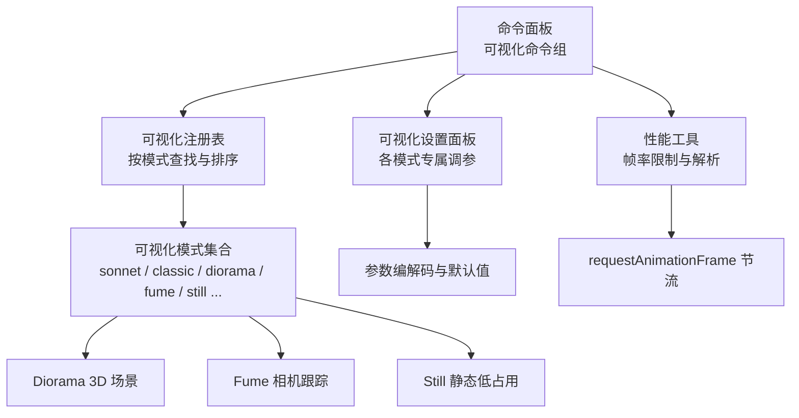
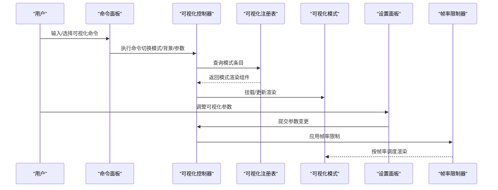
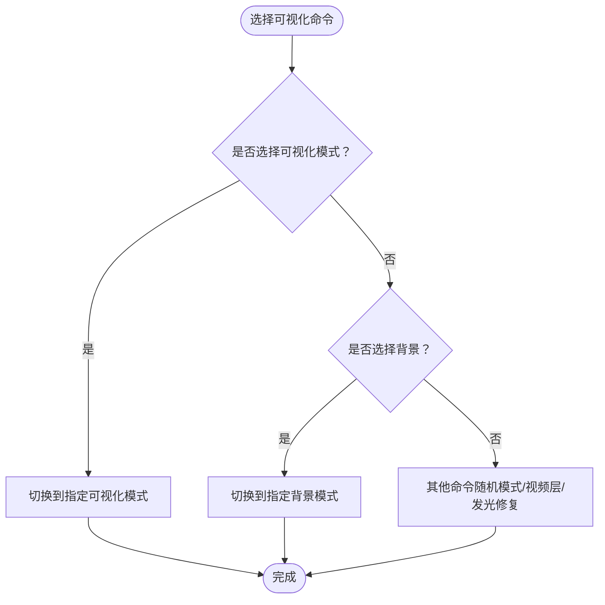
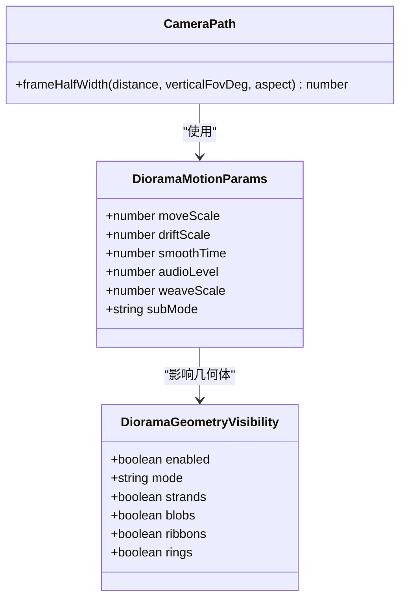
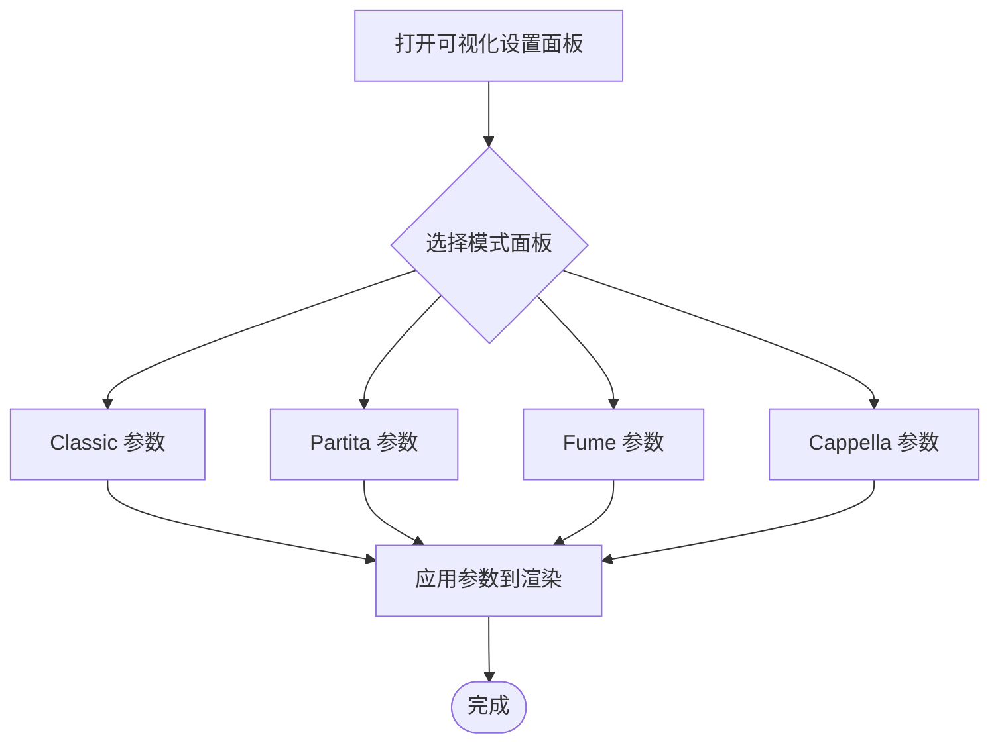
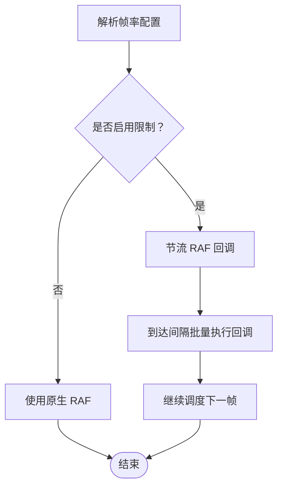
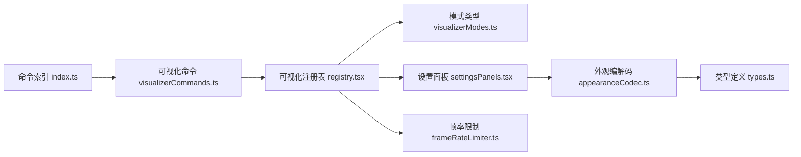

# 可视化命令

<cite>
**本文引用的文件**   
- [visualizerCommands.ts](file://src/components/command-palette/commands/visualizerCommands.ts)
- [settingsCommands.ts](file://src/components/command-palette/commands/settingsCommands.ts)
- [index.ts](file://src/components/command-palette/commands/index.ts)
- [registry.tsx](file://src/components/visualizer/registry.tsx)
- [visualizerModes.ts](file://src/types/visualizerModes.ts)
- [frameRateLimiter.ts](file://src/utils/frameRateLimiter.ts)
- [settingsPanels.tsx](file://src/components/visualizer/settingsPanels.tsx)
- [VisualizerDiorama.tsx](file://src/components/visualizer/diorama/VisualizerDiorama.tsx)
- [cameraPath.ts](file://src/components/visualizer/diorama/cameraPath.ts)
- [appearanceCodec.ts](file://src/utils/appearanceCodec.ts)
- [types.ts](file://src/types.ts)
- [fumeCameraStep.ts](file://src/components/visualizer/fume/fumeCameraStep.ts)
- [SoraBackground.tsx](file://src/components/visualizer/backgrounds/sora/SoraBackground.tsx)
- [commandRegistry.test.ts](file://test/unit/command-palette/commandRegistry.test.ts)
- [frameRateLimiter.test.ts](file://test/unit/utils/frameRateLimiter.test.ts)
</cite>

## 目录
1. [简介](#简介)
2. [项目结构](#项目结构)
3. [核心组件](#核心组件)
4. [架构总览](#架构总览)
5. [详细组件分析](#详细组件分析)
6. [依赖关系分析](#依赖关系分析)
7. [性能与优化](#性能与优化)
8. [故障排查指南](#故障排查指南)
9. [结论](#结论)
10. [附录：命令速查与示例](#附录命令速查与示例)

## 简介
本文件面向“可视化命令”的完整使用与实现说明，覆盖以下目标：
- 视觉效果切换命令：3D 场景切换、动画模式选择、参数调节。
- 主题控制命令：颜色方案切换、背景效果调整、透明度设置。
- 可视化性能命令：帧率控制、渲染质量调节、内存优化。
- 自定义可视化命令：着色器参数调整、粒子效果控制、相机运动。
- 可视化预览与实时调试支持。
- 提供具体命令语法示例与典型使用场景。

## 项目结构
可视化能力由“命令面板组 + 可视化注册表 + 各可视化模式 + 设置面板 + 性能工具”共同组成：
- 命令面板组负责暴露用户可执行的可视化相关命令。
- 可视化注册表集中发现并管理所有内建与扩展的可视化模式。
- 各可视化模式（如 Diorama、Fume、Still 等）提供具体渲染逻辑与调参面板。
- 性能工具提供全局帧率限制与解析能力。
- 类型定义与编解码器负责持久化与校验可视化参数。

**图表来源**
- [index.ts:76-86](file://src/components/command-palette/commands/index.ts#L76-L86)
- [registry.tsx:16-44](file://src/components/visualizer/registry.tsx#L16-L44)
- [visualizerModes.ts:15-43](file://src/types/visualizerModes.ts#L15-L43)
- [frameRateLimiter.ts:22-40](file://src/utils/frameRateLimiter.ts#L22-L40)

**章节来源**
- [index.ts:76-86](file://src/components/command-palette/commands/index.ts#L76-L86)
- [registry.tsx:16-44](file://src/components/visualizer/registry.tsx#L16-L44)
- [visualizerModes.ts:15-43](file://src/types/visualizerModes.ts#L15-L43)

## 核心组件
- 可视化命令组：提供可视化模式切换、背景切换、随机模式开关、视频层控制、Linux 发光修复开关等命令入口。
- 可视化注册表：通过 glob 自动发现各模式的 entry 模块，构建有序列表与按模式索引，并提供运行时追加/移除扩展模式的能力。
- 可视化模式清单：权威声明内建可视化模式与背景模式，并在注册表初始化时进行一致性断言。
- 帧率限制器：提供可视化的全局 requestAnimationFrame 节流、帧率解析与安装/恢复机制。
- 可视化设置面板：为各模式提供专属调参 UI，包括相机速度、运动幅度、音频响应、几何可见性、粒子密度/尺寸/发光、辉光、灵魂强度、渐变强度、关键词着色等。
- Diorama 3D 场景：包含相机路径、子模式（平静/正常/混乱）、运动参数、几何体可见性（点云簇/走廊）等。
- Fume 相机跟踪：根据动画强度（平静/正常/混乱）计算相机浮动与缩放范围。
- Sora 星空背景：基于着色器的粒子闪烁与颜色混合。

**章节来源**
- [visualizerCommands.ts:11-203](file://src/components/command-palette/commands/visualizerCommands.ts#L11-L203)
- [registry.tsx:16-113](file://src/components/visualizer/registry.tsx#L16-L113)
- [visualizerModes.ts:15-75](file://src/types/visualizerModes.ts#L15-L75)
- [frameRateLimiter.ts:22-197](file://src/utils/frameRateLimiter.ts#L22-L197)
- [settingsPanels.tsx:24-427](file://src/components/visualizer/settingsPanels.tsx#L24-L427)
- [VisualizerDiorama.tsx:395-424](file://src/components/visualizer/diorama/VisualizerDiorama.tsx#L395-L424)
- [cameraPath.ts:139-162](file://src/components/visualizer/diorama/cameraPath.ts#L139-L162)
- [fumeCameraStep.ts:211-233](file://src/components/visualizer/fume/fumeCameraStep.ts#L211-L233)
- [SoraBackground.tsx:39-87](file://src/components/visualizer/backgrounds/sora/SoraBackground.tsx#L39-L87)

## 架构总览
可视化命令的执行流程如下：
1. 用户在命令面板输入或点击命令。
2. 命令执行函数调用上下文中的可视化控制器方法（切换模式、背景、参数）。
3. 可视化注册表根据模式 ID 找到对应渲染组件。
4. 设置面板将用户调参写入状态，并通过编解码器持久化。
5. 渲染循环受帧率限制器控制，按需节流。

**图表来源**
- [visualizerCommands.ts:11-203](file://src/components/command-palette/commands/visualizerCommands.ts#L11-L203)
- [registry.tsx:56-77](file://src/components/visualizer/registry.tsx#L56-L77)
- [frameRateLimiter.ts:133-197](file://src/utils/frameRateLimiter.ts#L133-L197)

## 详细组件分析

### 视觉效果切换命令
- 可视化模式切换：提供 sonnet、tempera、lumiere、classic、cadenza、partita、fume、tilt、claddagh、monet、pendolo、cappella、diorama、still 等模式切换命令。
- 背景切换：common、nomand、latent（含像素/流体/混合子模式）、monet（全屏叠色/半屏渐变）、sora、tide、url 嵌入网页。
- 随机模式：每首歌随机切换可视化模式。
- 视频层：显示/隐藏歌词后方视频层，支持选择本地视频文件。
- Linux 发光修复：切换发光模糊量化策略，避免长时间播放后画面卡死。

**图表来源**
- [visualizerCommands.ts:11-203](file://src/components/command-palette/commands/visualizerCommands.ts#L11-L203)

**章节来源**
- [visualizerCommands.ts:11-203](file://src/components/command-palette/commands/visualizerCommands.ts#L11-L203)

### 3D 场景与相机运动（Diorama）
- 相机路径与视口：根据距离与垂直 FOV 计算可见半宽，用于构图与飞行路径。
- 运动参数：moveScale、driftScale、smoothTime、audioLevel、weaveScale、subMode（calm/normal/chaotic）。
- 几何可见性：支持“点云簇”和“走廊”两种互斥模式，以及 strands/blobs/ribbons/rings 子项。
- 相机跟随：平滑阻尼时间常数控制跟随灵敏度；音频反应仅作用于几何体，不直接作用于相机。

**图表来源**
- [cameraPath.ts:139-162](file://src/components/visualizer/diorama/cameraPath.ts#L139-L162)
- [types.ts:788-814](file://src/types.ts#L788-L814)

**章节来源**
- [cameraPath.ts:139-162](file://src/components/visualizer/diorama/cameraPath.ts#L139-L162)
- [types.ts:788-814](file://src/types.ts#L788-L814)

### 动画模式选择与参数调节
- 各模式专属设置面板：Classic、Partita、Fume、Cappella 等提供可调参数。
- Fume 相机跟踪：stepped/smooth 两种模式，相机速度与辉光强度可调。
- Classic 词旋转、呼吸浮动倍数、字间距、旧布局开关。
- Partita 引导线、语义布局、最小/最大错位。
- Cappella 表情包与头像来源、自定义资源导入与清理。

**图表来源**
- [settingsPanels.tsx:24-427](file://src/components/visualizer/settingsPanels.tsx#L24-L427)

**章节来源**
- [settingsPanels.tsx:24-427](file://src/components/visualizer/settingsPanels.tsx#L24-L427)

### 主题控制命令
- 明暗模式切换：日间/夜间主题切换。
- 透明度切换：播放器背景透明开关。
- 主题生成与编辑器：AI 主题生成、封面取色主题源、快速主题编辑器。
- 网格卡片样式与拼贴暗角：全画幅封面、正方形卡片、队列拼贴海报叠色。
- 字幕背景与底部字幕层：字幕可读性背景开关、底部字幕层显隐。

**章节来源**
- [settingsCommands.ts:480-589](file://src/components/command-palette/commands/settingsCommands.ts#L480-L589)

### 可视化性能命令
- 帧率限制：支持 off/auto/60/90/120，解析与节流逻辑统一。
- 全局安装/恢复：替换 window.requestAnimationFrame 与 cancelAnimationFrame，支持动态切换帧率。
- 测试覆盖：解析合法帧率、跳过未达间隔帧、关闭时始终处理。

**图表来源**
- [frameRateLimiter.ts:33-54](file://src/utils/frameRateLimiter.ts#L33-L54)
- [frameRateLimiter.ts:64-129](file://src/utils/frameRateLimiter.ts#L64-L129)
- [frameRateLimiter.ts:133-197](file://src/utils/frameRateLimiter.ts#L133-L197)

**章节来源**
- [frameRateLimiter.ts:22-197](file://src/utils/frameRateLimiter.ts#L22-L197)
- [frameRateLimiter.test.ts:1-27](file://test/unit/utils/frameRateLimiter.test.ts#L1-L27)

### 自定义可视化命令（着色器、粒子、相机）
- 着色器参数：Latent 背景的像素层/流体层/混合显示模式；Nomand 抖动背景；Sora 星空粒子闪烁与颜色混合。
- 粒子效果：Sora 背景的点大小、闪烁强度、颜色类型；Diorama 粒子密度/尺寸/发光强度/背景粒子周长/径向分布。
- 相机运动：Fume 相机跟踪模式与速度；Diorama 子模式与运动幅度；相机跟随平滑时间与音频反应。

**章节来源**
- [visualizerCommands.ts:122-201](file://src/components/command-palette/commands/visualizerCommands.ts#L122-L201)
- [SoraBackground.tsx:39-87](file://src/components/visualizer/backgrounds/sora/SoraBackground.tsx#L39-L87)
- [settingsPanels.tsx:903-931](file://src/components/visualizer/settingsPanels.tsx#L903-L931)
- [fumeCameraStep.ts:211-233](file://src/components/visualizer/fume/fumeCameraStep.ts#L211-L233)

### 可视化预览与实时调试
- 可视化预览：注册表提供预览起始偏移与种子，便于在预览中稳定展示。
- Ponder 教程与热区：交互式引导页面包含预览窗格与热区标记，辅助定位控制面板元素。
- 内存探针：可视化内存探针脚本周期性采样内存，输出按类型分组的 MB 统计，便于观察着色器编译、字体加载、纹理预热后的稳定区间。

**章节来源**
- [registry.tsx:68-77](file://src/components/visualizer/registry.tsx#L68-L77)
- [PonderFullEditorSurfaces.tsx:265-281](file://src/components/ponder/surfaces/PonderFullEditorSurfaces.tsx#L265-L281)
- [visualizer-memory-probe.mjs:124-157](file://test/manual/visualizer-memory-probe.mjs#L124-L157)

## 依赖关系分析
- 命令面板组聚合多个子命令组，其中 visualizerCommands 提供可视化相关命令。
- 可视化注册表集中管理模式条目，确保模式 ID 唯一且有序。
- 类型定义与编解码器保证可视化参数的合法性与持久化。
- 帧率限制器作为全局基础设施，被可视化渲染循环依赖。

**图表来源**
- [index.ts:76-86](file://src/components/command-palette/commands/index.ts#L76-L86)
- [registry.tsx:16-113](file://src/components/visualizer/registry.tsx#L16-L113)
- [visualizerModes.ts:15-75](file://src/types/visualizerModes.ts#L15-L75)
- [appearanceCodec.ts:149-198](file://src/utils/appearanceCodec.ts#L149-L198)
- [types.ts:788-814](file://src/types.ts#L788-L814)
- [frameRateLimiter.ts:22-197](file://src/utils/frameRateLimiter.ts#L22-L197)

**章节来源**
- [index.ts:76-86](file://src/components/command-palette/commands/index.ts#L76-L86)
- [registry.tsx:16-113](file://src/components/visualizer/registry.tsx#L16-L113)
- [visualizerModes.ts:15-75](file://src/types/visualizerModes.ts#L15-L75)
- [appearanceCodec.ts:149-198](file://src/utils/appearanceCodec.ts#L149-L198)
- [types.ts:788-814](file://src/types.ts#L788-L814)
- [frameRateLimiter.ts:22-197](file://src/utils/frameRateLimiter.ts#L22-L197)

## 性能与优化
- 帧率限制：建议在高刷新率显示器上开启 90/120 FPS，或在低端设备上设置为 off 以节省功耗。
- 渲染质量：降低 Diorama 粒子密度与尺寸、关闭不必要的几何体（如 rings/ribbons），减少辉光与灵魂强度。
- 背景复杂度：Latent 混合模式较单图层更耗资源；Sora 星空粒子数量与闪烁频率可通过着色器参数微调。
- 相机运动：增大 smoothTime 可降低相机抖动，但会牺牲跟手性；audioLevel 仅影响几何体，不影响相机。
- 内存优化：使用 Still 模式作为低占用替代；定期运行内存探针观察稳定区间，避免频繁切换高开销模式。

[本节为通用指导，不直接分析具体文件]

## 故障排查指南
- 命令不可用：检查命令 availability 条件（例如 AI 主题生成需要 canGenerateAITheme 且不在生成中）。
- 可视化冻结（Linux）：启用“修复歌词动画卡死”命令，切换发光模糊量化策略。
- 帧率异常：确认帧率解析结果是否为 off/60/90/120；若为 off，则不会节流。
- 主题切换无效：确认 daylight/transparent 开关已正确触发，并检查设置面板是否处于可用状态。
- 预览不稳定：检查预览起始偏移与种子是否一致；确保预览播放状态与热区标记正确。

**章节来源**
- [settingsCommands.ts:421-479](file://src/components/command-palette/commands/settingsCommands.ts#L421-L479)
- [visualizerCommands.ts:67-74](file://src/components/command-palette/commands/visualizerCommands.ts#L67-L74)
- [frameRateLimiter.test.ts:1-27](file://test/unit/utils/frameRateLimiter.test.ts#L1-L27)
- [commandRegistry.test.ts:467-540](file://test/unit/command-palette/commandRegistry.test.ts#L467-L540)

## 结论
可视化命令体系通过命令面板、注册表、设置面板与性能工具的协同工作，提供了从模式切换、背景调整到参数精细控制的完整能力。借助 Diorama 的 3D 场景与相机运动、Fume 的相机跟踪、Sora 的粒子着色器，以及帧率限制器，用户可以在不同设备与场景下获得流畅且可控的可视化体验。结合 Ponder 教程与内存探针，可实现可视化预览与实时调试，帮助开发者与用户快速定位问题并优化性能。

[本节为总结性内容，不直接分析具体文件]

## 附录：命令速查与示例
- 可视化模式切换
  - 命令示例：切换到 Sonnet、Tempera、Lumiere、Classic、Cadenza、Partita、Fume、Tilt、Claddagh、Monet、Pendolo、Cappella、Diorama、Still。
  - 使用场景：根据歌曲风格选择匹配的可视化模式。
- 背景切换
  - 命令示例：切换到 Common、Nomand、Latent（Pixel/Mesh/Both）、Monet（Full Overlay/Half Gradient）、Sora、Tide、URL 嵌入网页。
  - 使用场景：配合主题色与歌词情绪营造氛围。
- 随机模式
  - 命令示例：每首歌随机切换可视化模式。
  - 使用场景：探索不同可视化风格的组合。
- 视频层
  - 命令示例：显示/隐藏歌词后方视频层；选择本地视频文件。
  - 使用场景：MV 或动态背景增强沉浸感。
- 性能与兼容性
  - 命令示例：修复 Linux 发光卡顿；切换明暗模式；切换透明度；打开图形设置（帧率、静态模式、减少动效）。
  - 使用场景：提升稳定性与能效。
- 主题控制
  - 命令示例：生成 AI 主题；切换主题来源（AI/封面）；打开快速主题编辑器；网格卡片样式调整；拼贴暗角调整。
  - 使用场景：定制界面配色与视觉层次。
- 自定义可视化
  - 命令示例：Latent 背景像素/流体/混合；Sora 星空背景；Diorama 粒子与几何体开关；Fume 相机跟踪模式与速度。
  - 使用场景：精细化控制视觉效果与性能平衡。

**章节来源**
- [visualizerCommands.ts:11-203](file://src/components/command-palette/commands/visualizerCommands.ts#L11-L203)
- [settingsCommands.ts:306-589](file://src/components/command-palette/commands/settingsCommands.ts#L306-L589)