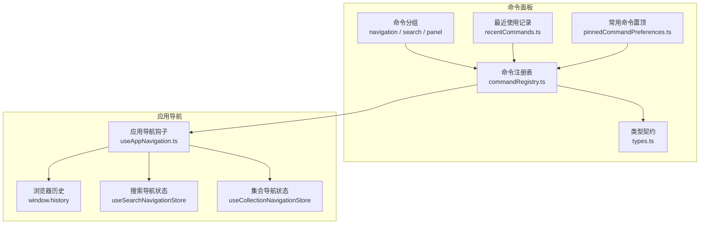
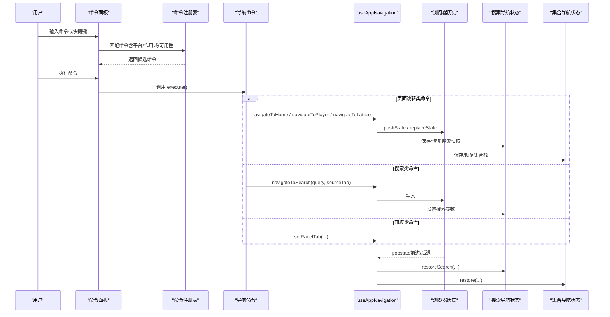
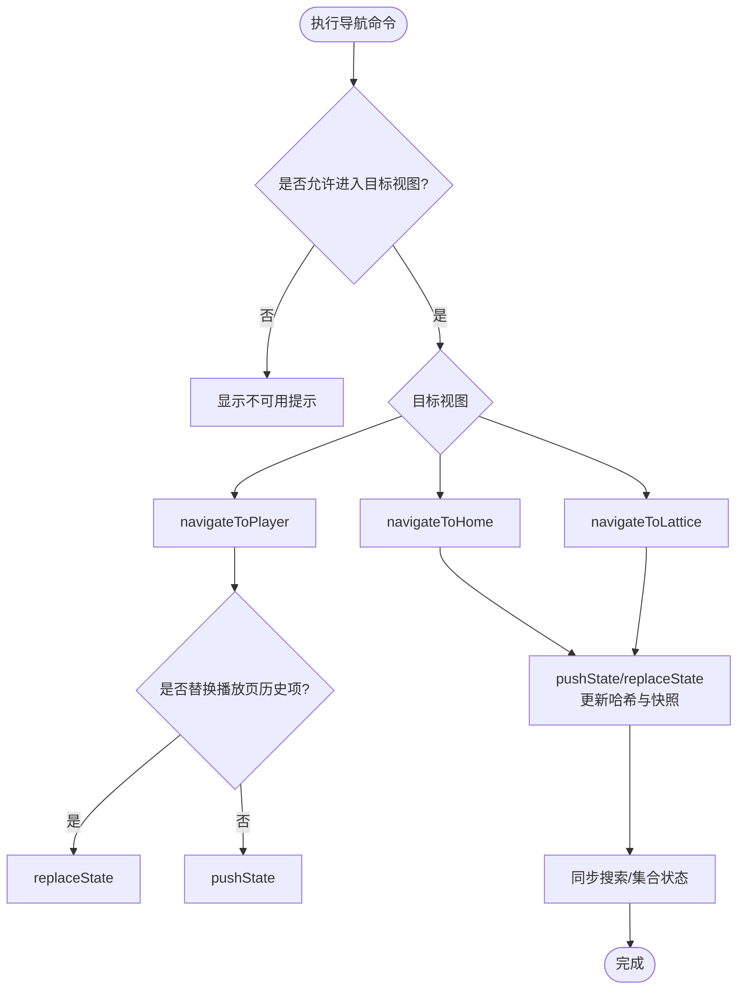
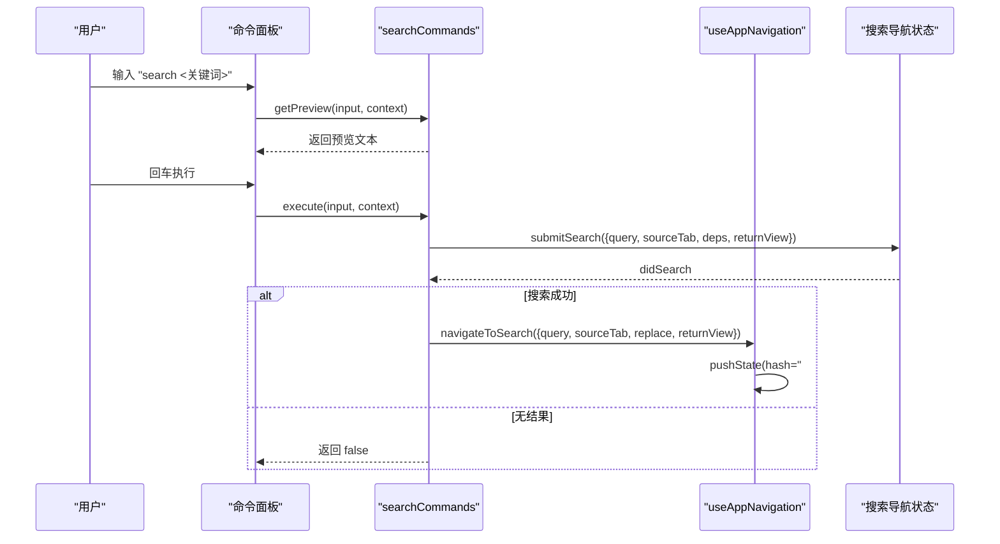
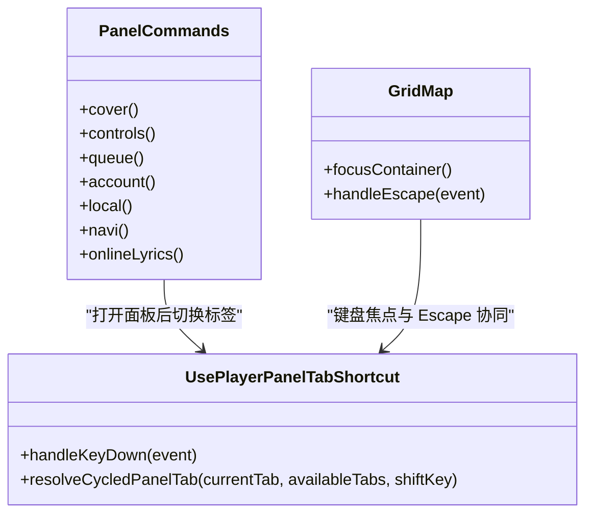
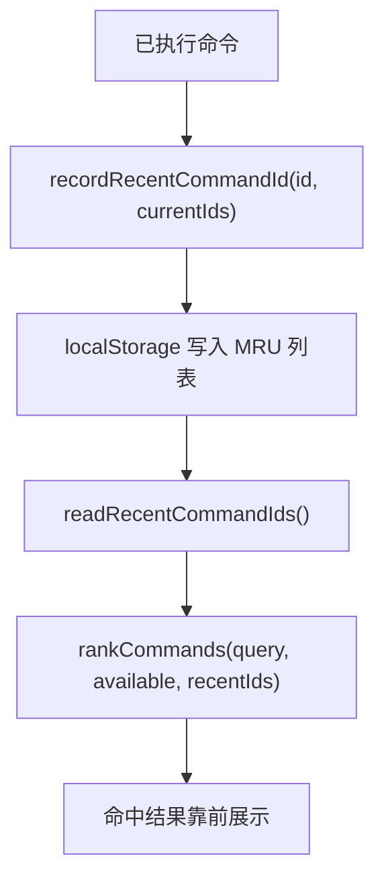
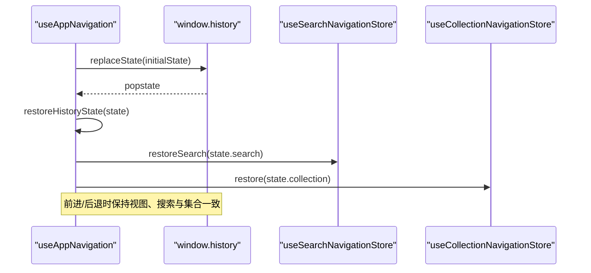
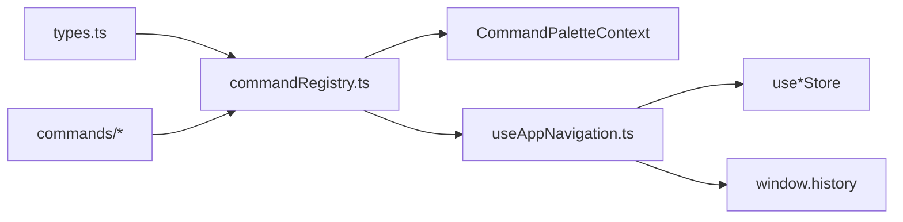

# 导航命令

<cite>
**本文引用的文件**   
- [src/components/command-palette/commands/index.ts](file://src/components/command-palette/commands/index.ts)
- [src/components/command-palette/commands/navigationCommands.ts](file://src/components/command-palette/commands/navigationCommands.ts)
- [src/components/command-palette/commands/searchCommands.ts](file://src/components/command-palette/commands/searchCommands.ts)
- [src/components/command-palette/commands/panelCommands.ts](file://src/components/command-palette/commands/panelCommands.ts)
- [src/components/command-palette/commandRegistry.ts](file://src/components/command-palette/commandRegistry.ts)
- [src/components/command-palette/types.ts](file://src/components/command-palette/types.ts)
- [src/components/command-palette/recentCommands.ts](file://src/components/command-palette/recentCommands.ts)
- [src/components/command-palette/pinnedCommandPreferences.ts](file://src/components/command-palette/pinnedCommandPreferences.ts)
- [src/hooks/useAppNavigation.ts](file://src/hooks/useAppNavigation.ts)
- [test/unit/navigation/appNavigationHistory.test.ts](file://test/unit/navigation/appNavigationHistory.test.ts)
- [src/components/GridMap.tsx](file://src/components/GridMap.tsx)
- [src/hooks/usePlayerPanelTabShortcut.ts](file://src/hooks/usePlayerPanelTabShortcut.ts)
</cite>

## 目录
1. [简介](#简介)
2. [项目结构](#项目结构)
3. [核心组件](#核心组件)
4. [架构总览](#架构总览)
5. [详细组件分析](#详细组件分析)
6. [依赖关系分析](#依赖关系分析)
7. [性能与可用性](#性能与可用性)
8. [故障排查指南](#故障排查指南)
9. [结论](#结论)

## 简介
本文件为“导航命令”专题文档，聚焦命令面板中的三类能力：页面跳转、搜索、面板切换。围绕这些能力，文档说明路由切换、历史记录管理、深度链接、全局搜索与高级过滤、搜索结果导航、侧边栏控制、模态框管理与焦点转移、命令历史（最近使用记录、常用命令置顶、历史查询），以及导航状态同步与浏览器前进后退支持，并给出具体命令语法示例和使用场景。

## 项目结构
命令系统以“命令注册表 + 分组命令 + 上下文 + 排序匹配 + 持久化”的方式组织：
- 命令分组：navigation、search、panel 等分别定义在 commands 子目录中。
- 命令注册表：汇总所有命令，提供可用性与热键索引。
- 类型契约：types.ts 定义命令、上下文、分组等统一接口。
- 历史与偏好：recentCommands.ts 与 pinnedCommandPreferences.ts 负责最近使用与常用置顶的本地存储。
- 应用导航：useAppNavigation.ts 负责视图切换、浏览器历史、集合导航与搜索路由。

图表来源
- [src/components/command-palette/commandRegistry.ts:10-43](file://src/components/command-palette/commandRegistry.ts#L10-L43)
- [src/components/command-palette/commands/index.ts:76-88](file://src/components/command-palette/commands/index.ts#L76-L88)
- [src/hooks/useAppNavigation.ts:151-185](file://src/hooks/useAppNavigation.ts#L151-L185)

章节来源
- [src/components/command-palette/commands/index.ts:1-107](file://src/components/command-palette/commands/index.ts#L1-L107)
- [src/components/command-palette/commandRegistry.ts:1-44](file://src/components/command-palette/commandRegistry.ts#L1-L44)
- [src/hooks/useAppNavigation.ts:1-445](file://src/hooks/useAppNavigation.ts#L1-L445)

## 核心组件
- 导航命令组：提供首页、播放页、队列拼贴、全屏、远程窗口、主窗口置顶、各主页标签页跳转等命令。
- 搜索命令组：提供当前源搜索、本地库搜索、服务器搜索、在线音乐搜索，支持预览与结果导航。
- 面板命令组：打开统一侧边栏的不同标签页（封面、控制、队列、账号、本地、服务器、歌词）。
- 命令注册表：聚合命令、去重、校验热键冲突、构建热键索引、暴露匹配与排序入口。
- 应用导航钩子：封装 push/replace 历史、恢复历史、集合栈、搜索路由、播放器返回策略等。
- 命令历史与置顶：最近使用记录（最多 10 条）与三个常用命令槽位，均持久化到 localStorage。

章节来源
- [src/components/command-palette/commands/navigationCommands.ts:1-59](file://src/components/command-palette/commands/navigationCommands.ts#L1-L59)
- [src/components/command-palette/commands/searchCommands.ts:1-106](file://src/components/command-palette/commands/searchCommands.ts#L1-L106)
- [src/components/command-palette/commands/panelCommands.ts:1-17](file://src/components/command-palette/commands/panelCommands.ts#L1-L17)
- [src/components/command-palette/commandRegistry.ts:10-43](file://src/components/command-palette/commandRegistry.ts#L10-L43)
- [src/hooks/useAppNavigation.ts:109-445](file://src/hooks/useAppNavigation.ts#L109-L445)
- [src/components/command-palette/recentCommands.ts:1-62](file://src/components/command-palette/recentCommands.ts#L1-L62)
- [src/components/command-palette/pinnedCommandPreferences.ts:1-77](file://src/components/command-palette/pinnedCommandPreferences.ts#L1-L77)

## 架构总览
命令面板与应用导航之间的交互流程如下：

图表来源
- [src/components/command-palette/commands/navigationCommands.ts:7-57](file://src/components/command-palette/commands/navigationCommands.ts#L7-L57)
- [src/components/command-palette/commands/searchCommands.ts:38-69](file://src/components/command-palette/commands/searchCommands.ts#L38-L69)
- [src/components/command-palette/commandRegistry.ts:15-43](file://src/components/command-palette/commandRegistry.ts#L15-L43)
- [src/hooks/useAppNavigation.ts:151-185](file://src/hooks/useAppNavigation.ts#L151-L185)
- [src/hooks/useAppNavigation.ts:339-358](file://src/hooks/useAppNavigation.ts#L339-L358)

## 详细组件分析

### 页面跳转命令（导航组）
- 功能要点
  - 首页、播放页、队列拼贴（Lattice）之间切换。
  - 浏览器全屏、遥控窗口开关、主窗口置顶（Electron）。
  - 主页标签页快捷跳转（歌单、本地音乐、专辑、服务器、电台）。
  - 在 Lattice 模式下，若处于 FM 模式则阻止进入队列拼贴，避免不支持的视图。
- 关键行为
  - 播放页返回策略：如果播放器是从应用页面打开的，优先走浏览器历史返回；否则直接回到首页。
  - 从 Lattice 返回：若历史可回退则走浏览器历史，否则返回首页。
  - 播放入口视图：根据设置决定播放后进入“播放页”还是“队列拼贴”，FM 模式自动回退到播放页。
- 典型用法
  - “前往首页”：navigate-home
  - “前往播放页”：navigate-player
  - “打开队列拼贴”：navigate-lattice（快捷键 Ctrl+B，macOS 上 Cmd+B）
  - “打开歌单标签”：playlist
  - “打开本地音乐标签”：local
  - “打开专辑标签”：albums
  - “打开服务器标签”：navidrome
  - “打开电台标签”：radio
  - “浏览器全屏”：browser-fullscreen
  - “切换遥控窗口”：desktop-toggle-remote-control（仅 Electron）
  - “主窗口置顶”：desktop-toggle-main-window-always-on-top（仅 Electron）

图表来源
- [src/hooks/useAppNavigation.ts:224-270](file://src/hooks/useAppNavigation.ts#L224-L270)
- [src/hooks/useAppNavigation.ts:307-337](file://src/hooks/useAppNavigation.ts#L307-L337)
- [src/hooks/useAppNavigation.ts:283-292](file://src/hooks/useAppNavigation.ts#L283-L292)

章节来源
- [src/components/command-palette/commands/navigationCommands.ts:7-57](file://src/components/command-palette/commands/navigationCommands.ts#L7-L57)
- [src/hooks/useAppNavigation.ts:103-107](file://src/hooks/useAppNavigation.ts#L103-L107)
- [src/hooks/useAppNavigation.ts:224-337](file://src/hooks/useAppNavigation.ts#L224-L337)

### 搜索命令（搜索组）
- 功能要点
  - 全局搜索：在当前源、本地库、服务器、网易云音乐之间选择数据源进行搜索。
  - 预览：输入时生成预览文案，提示将搜索哪个源的哪些内容。
  - 结果导航：提交搜索后跳转到搜索结果页，并携带 returnView 以便关闭搜索后回到合适视图。
- 高级过滤
  - 搜索命令本身通过 context.search.submitSearch 提交查询，并在 navigateToSearch 中写入搜索哈希与返回视图。
  - 搜索结果的具体过滤逻辑由搜索子系统处理，命令层保证正确的源与返回视图。
- 典型用法
  - “搜索歌曲”：search-current（默认快捷键 f）
  - “搜索本地歌曲”：search-local
  - “搜索服务器歌曲”：search-navidrome
  - “搜索网易云歌曲”：search-netease

图表来源
- [src/components/command-palette/commands/searchCommands.ts:18-69](file://src/components/command-palette/commands/searchCommands.ts#L18-L69)
- [src/hooks/useAppNavigation.ts:339-358](file://src/hooks/useAppNavigation.ts#L339-L358)

章节来源
- [src/components/command-palette/commands/searchCommands.ts:1-106](file://src/components/command-palette/commands/searchCommands.ts#L1-L106)
- [src/hooks/useAppNavigation.ts:339-358](file://src/hooks/useAppNavigation.ts#L339-L358)

### 面板切换命令（面板组）
- 功能要点
  - 打开统一侧边栏并切换到指定标签页：封面、控制、队列、账号、本地、服务器、歌词。
  - 面板内部标签切换可通过 Tab 键循环，Shift+Tab 反向。
  - 面板按钮与面板主体解耦：按钮负责展开，面板主体负责多标签渲染。
- 焦点与模态框
  - 网格地图（GridMap）会拦截 Escape，避免在弹窗或输入框内误触发退出。
  - 面板标签切换监听 Tab，忽略组合键与重复按键，确保无障碍体验。
- 典型用法
  - “面板：封面”：cover
  - “面板：控制”：controls
  - “面板：队列”：queue（快捷键 c）
  - “面板：账号”：account
  - “面板：本地”：local
  - “面板：服务器”：navi
  - “面板：歌词”：onlineLyrics

图表来源
- [src/components/command-palette/commands/panelCommands.ts:8-16](file://src/components/command-palette/commands/panelCommands.ts#L8-L16)
- [src/hooks/usePlayerPanelTabShortcut.ts:43-68](file://src/hooks/usePlayerPanelTabShortcut.ts#L43-L68)
- [src/components/GridMap.tsx:832-864](file://src/components/GridMap.tsx#L832-L864)

章节来源
- [src/components/command-palette/commands/panelCommands.ts:1-17](file://src/components/command-palette/commands/panelCommands.ts#L1-L17)
- [src/hooks/usePlayerPanelTabShortcut.ts:43-68](file://src/hooks/usePlayerPanelTabShortcut.ts#L43-L68)
- [src/components/GridMap.tsx:832-864](file://src/components/GridMap.tsx#L832-L864)

### 命令历史与常用命令
- 最近使用记录
  - 最多保留 10 条最近使用的命令 ID，按 MRU 顺序持久化。
  - 读取时截断至上限，写入时去重并截断。
- 常用命令置顶
  - 三个固定槽位，支持空槽位与未知 ID 的安全解析。
  - 默认槽位包含“上一首”、“下一首”、“队列面板”。
  - 设置界面提供可视化配置。
- 历史查询
  - 命令匹配器会将最近使用记录作为排序权重之一，近期常用命令更容易出现在顶部。

图表来源
- [src/components/command-palette/recentCommands.ts:53-60](file://src/components/command-palette/recentCommands.ts#L53-L60)
- [src/components/command-palette/pinnedCommandPreferences.ts:21-77](file://src/components/command-palette/pinnedCommandPreferences.ts#L21-L77)
- [src/components/command-palette/search/rankCommands.ts:214-253](file://src/components/command-palette/search/rankCommands.ts#L214-L253)

章节来源
- [src/components/command-palette/recentCommands.ts:1-62](file://src/components/command-palette/recentCommands.ts#L1-L62)
- [src/components/command-palette/pinnedCommandPreferences.ts:1-77](file://src/components/command-palette/pinnedCommandPreferences.ts#L1-L77)
- [src/components/command-palette/search/rankCommands.ts:214-253](file://src/components/command-palette/search/rankCommands.ts#L214-L253)

### 导航状态同步与浏览器前进后退
- 状态结构
  - NavigationHistoryState 包含 view、search、collection、appHistoryIndex。
- 历史写入
  - pushNavigationState 根据 replace 标志选择 pushState 或 replaceState，并同步恢复状态。
- 历史恢复
  - 初始化时写入初始历史项，监听 popstate 事件恢复视图、搜索与集合状态。
- 播放器返回策略
  - shouldNavigatePlayerBackThroughHistory：当播放器来自应用页面且 appHistoryIndex > 0 时，走浏览器历史返回。
  - shouldReplacePlayerNavigation：播放器视图下使用 replace 避免重复历史项。
- 集合导航
  - navigateToCollection / pushCollection / backCollection 维护集合栈与哈希，支持从搜索进入集合后再返回。

图表来源
- [src/hooks/useAppNavigation.ts:151-185](file://src/hooks/useAppNavigation.ts#L151-L185)
- [src/hooks/useAppNavigation.ts:198-222](file://src/hooks/useAppNavigation.ts#L198-L222)
- [src/hooks/useAppNavigation.ts:372-418](file://src/hooks/useAppNavigation.ts#L372-L418)

章节来源
- [src/hooks/useAppNavigation.ts:37-71](file://src/hooks/useAppNavigation.ts#L37-L71)
- [src/hooks/useAppNavigation.ts:151-222](file://src/hooks/useAppNavigation.ts#L151-L222)
- [src/hooks/useAppNavigation.ts:372-418](file://src/hooks/useAppNavigation.ts#L372-L418)
- [test/unit/navigation/appNavigationHistory.test.ts:31-38](file://test/unit/navigation/appNavigationHistory.test.ts#L31-L38)

## 依赖关系分析
- 命令注册表依赖
  - 所有命令分组（grid、search、playback、settings、navigation、panel、mods、visualizer）。
  - 可用性判定（platform、scope、isAvailable）、热键冲突检测、ID 唯一性检查。
- 类型契约
  - CommandPaletteCommand 定义命令元数据、执行函数、预览、语法、快捷键等。
  - CommandPaletteContext 提供跨组能力（shared、search、playback、navigation、panel、settings、visualizer）。
- 应用导航依赖
  - useAppViewStore、usePlaybackStore、useSearchNavigationStore、useCollectionNavigationStore。
  - window.history API 用于深度链接与前进后退。

图表来源
- [src/components/command-palette/types.ts:43-84](file://src/components/command-palette/types.ts#L43-L84)
- [src/components/command-palette/types.ts:367-377](file://src/components/command-palette/types.ts#L367-L377)
- [src/components/command-palette/commandRegistry.ts:10-43](file://src/components/command-palette/commandRegistry.ts#L10-L43)
- [src/hooks/useAppNavigation.ts:109-185](file://src/hooks/useAppNavigation.ts#L109-L185)

章节来源
- [src/components/command-palette/types.ts:1-377](file://src/components/command-palette/types.ts#L1-L377)
- [src/components/command-palette/commandRegistry.ts:1-44](file://src/components/command-palette/commandRegistry.ts#L1-L44)
- [src/hooks/useAppNavigation.ts:109-185](file://src/hooks/useAppNavigation.ts#L109-L185)

## 性能与可用性
- 命令匹配与排序
  - 注册表对命令进行一次性过滤与排序，避免每次按键都全量扫描。
  - 最近使用记录参与排序，提升常用命令命中率。
- 热键索引
  - 构建 openHotkeyIndex，将全局快捷键查找从 O(n) 降为 O(1)。
- 可用性判断
  - isAvailable 每次打开命令面板时重新计算，避免缓存陈旧状态导致的错误可见性。
- 历史与状态
  - 使用 replaceState 减少重复历史项，popstate 同步恢复状态，避免 UI 不一致。

章节来源
- [src/components/command-palette/commands/index.ts:66-88](file://src/components/command-palette/commands/index.ts#L66-L88)
- [src/components/command-palette/commandRegistry.ts:28-43](file://src/components/command-palette/commandRegistry.ts#L28-L43)
- [src/hooks/useAppNavigation.ts:198-222](file://src/hooks/useAppNavigation.ts#L198-L222)

## 故障排查指南
- 播放器返回异常
  - 现象：点击返回直接进入首页而非上一页。
  - 原因：appHistoryIndex 为 0，shouldNavigatePlayerBackThroughHistory 返回 false。
  - 解决：确认播放器是否从应用页面打开，或检查历史状态是否正确写入。
- 搜索未跳转
  - 现象：执行搜索命令后没有进入搜索结果页。
  - 原因：submitSearch 返回 false（无结果或无效查询）。
  - 解决：检查 query 是否为空、sourceTab 是否有效、returnView 是否符合预期。
- 面板标签无法切换
  - 现象：Tab 键无效或重复触发。
  - 原因：存在组合键、重复按键或被弹窗拦截。
  - 解决：检查 hasBlockingWindow 与 event.repeat，确保焦点不在输入框内。
- 历史前进后退不同步
  - 现象：浏览器前进/后退后视图或搜索状态不正确。
  - 原因：popstate 未正确恢复 search/collection。
  - 解决：确认 restoreHistoryState 被调用，且 search/collection 快照正确。

章节来源
- [test/unit/navigation/appNavigationHistory.test.ts:31-38](file://test/unit/navigation/appNavigationHistory.test.ts#L31-L38)
- [src/components/command-palette/commands/searchCommands.ts:38-69](file://src/components/command-palette/commands/searchCommands.ts#L38-L69)
- [src/hooks/usePlayerPanelTabShortcut.ts:43-68](file://src/hooks/usePlayerPanelTabShortcut.ts#L43-L68)
- [src/hooks/useAppNavigation.ts:198-222](file://src/hooks/useAppNavigation.ts#L198-L222)

## 结论
导航命令体系通过清晰的命令分组、统一的类型契约、健壮的注册表与热键索引，以及与浏览器历史的深度集成，实现了稳定可靠的页面跳转、搜索与面板切换能力。配合最近使用记录与常用命令置顶，用户在高频操作中获得更高效的体验。同时，导航状态同步与前进后退支持确保了多入口、多路径下的状态一致性。