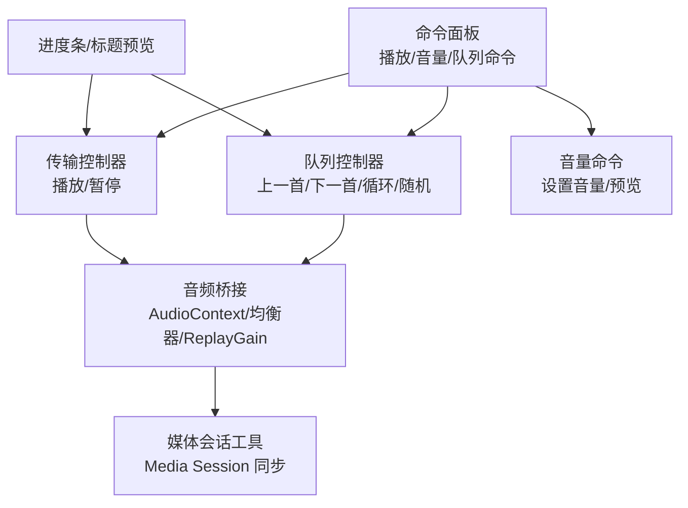
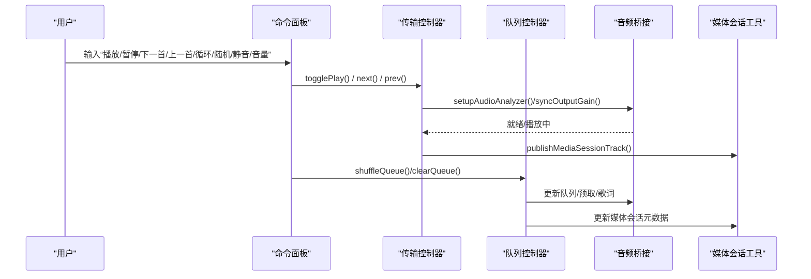
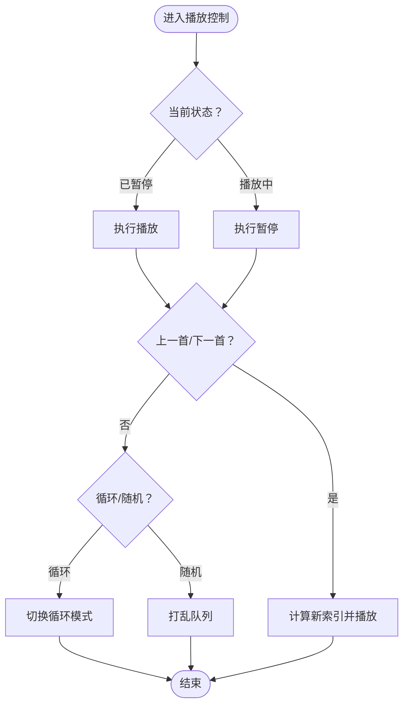
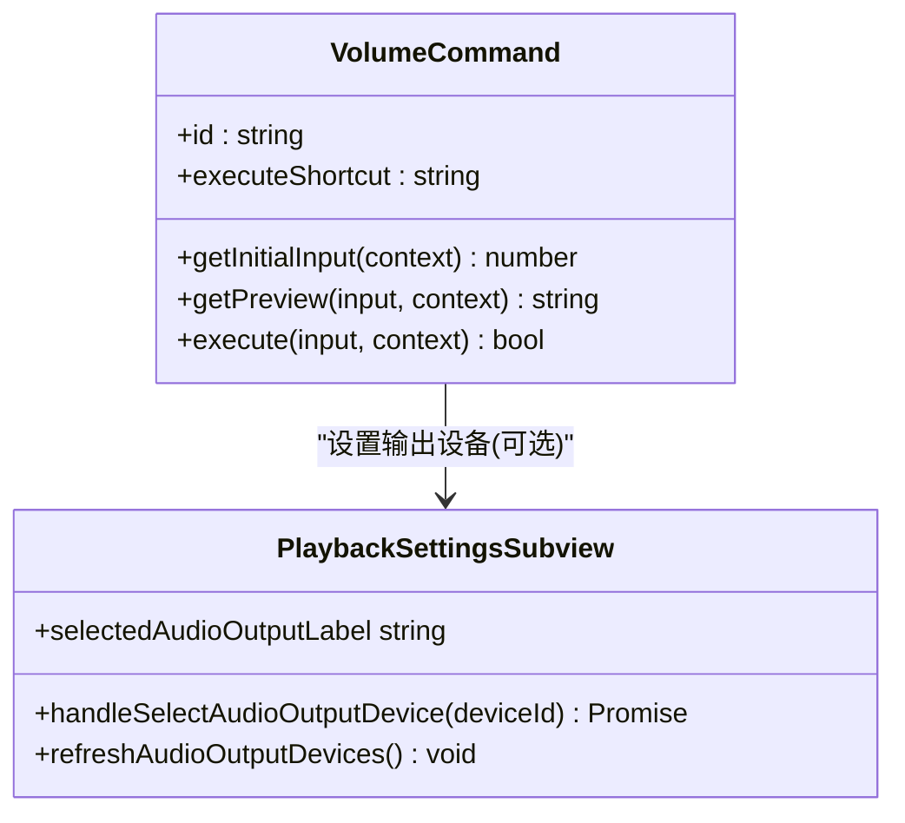
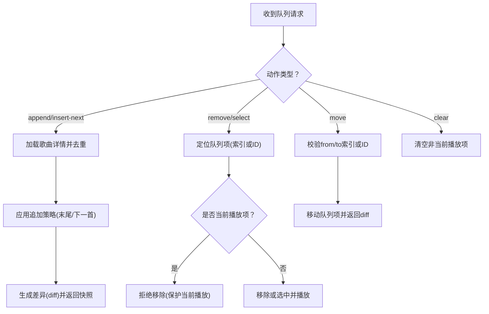
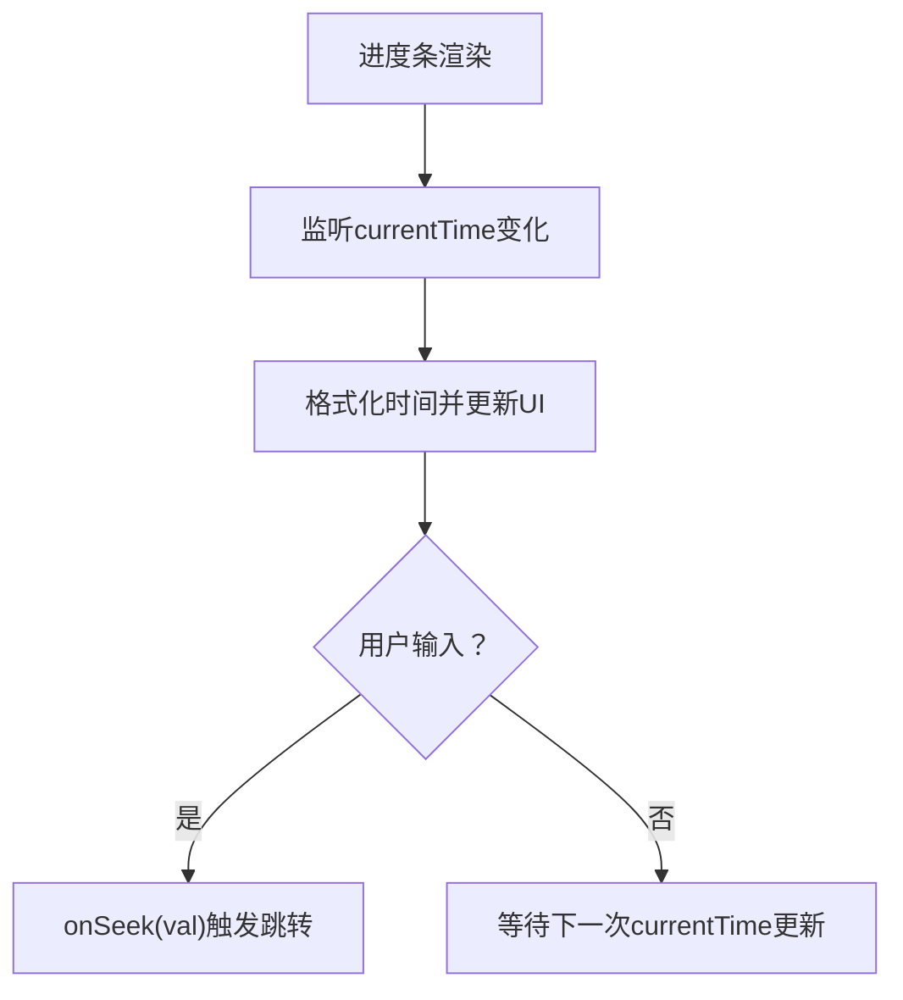
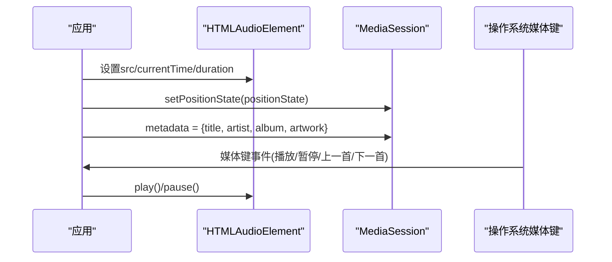
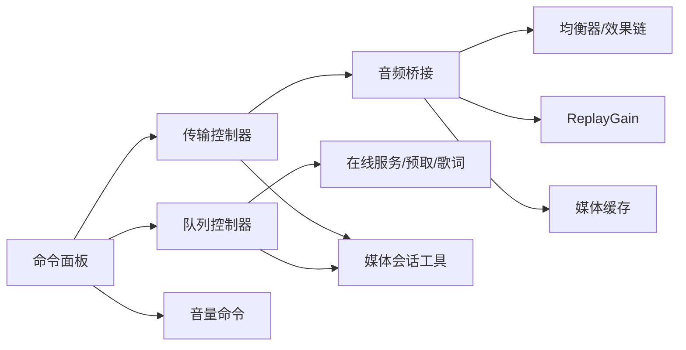

# 播放控制命令

<cite>
**本文引用的文件**   
- [playbackCommands.ts](file://src/components/command-palette/commands/playbackCommands.ts)
- [volumeCommand.ts](file://src/components/command-palette/commands/volumeCommand.ts)
- [queueCommand.ts](file://src/components/command-palette/commands/queueCommand.ts)
- [usePlaybackTransportController.ts](file://src/hooks/usePlaybackTransportController.ts)
- [usePlaybackQueueController.ts](file://src/hooks/usePlaybackQueueController.ts)
- [usePlaybackAudioBridge.ts](file://src/hooks/usePlaybackAudioBridge.ts)
- [mediaSessionSync.ts](file://src/utils/mediaSessionSync.ts)
- [PlaybackSettingsSubview.tsx](file://src/components/modal/settings/PlaybackSettingsSubview.tsx)
- [stage-client.html](file://stage-client.html)
- [ProgressBar.tsx](file://src/components/ProgressBar.tsx)
</cite>

## 目录
1. [简介](#简介)
2. [项目结构](#项目结构)
3. [核心组件](#核心组件)
4. [架构总览](#架构总览)
5. [详细组件分析](#详细组件分析)
6. [依赖关系分析](#依赖关系分析)
7. [性能与体验要点](#性能与体验要点)
8. [故障排查指南](#故障排查指南)
9. [结论](#结论)
10. [附录：命令语法与使用示例](#附录命令语法与使用示例)

## 简介
本文件面向“播放控制命令”的完整说明，覆盖以下能力：
- 播放控制：播放/暂停、上一首/下一首、随机播放、循环模式。
- 音量控制：音量调节、静音切换、音频输出设备选择。
- 队列管理：歌曲添加、移除、排序与播放列表操作。
- 播放进度：跳转、快进快退、时间显示。
- 媒体会话集成：系统级播放控制（操作系统媒体键、锁屏/通知栏控制）。
- 命令语法与场景示例：通过命令面板输入或快捷键触发各类播放行为。

## 项目结构
播放控制命令由“命令面板命令层 + 播放控制器层 + 音频桥接层 + 媒体会话工具层”组成：
- 命令面板命令层：定义用户可执行的命令、快捷键、关键词与交互界面。
- 播放控制器层：封装播放状态机、队列导航、在线/本地/远程源加载与错误恢复。
- 音频桥接层：负责 AudioContext、均衡器、ReplayGain、自动播放与缓存。
- 媒体会话工具层：将当前播放状态同步到系统 Media Session。

图示来源
- [playbackCommands.ts:14-137](file://src/components/command-palette/commands/playbackCommands.ts#L14-L137)
- [volumeCommand.ts:18-53](file://src/components/command-palette/commands/volumeCommand.ts#L18-L53)
- [queueCommand.ts:15-38](file://src/components/command-palette/commands/queueCommand.ts#L15-L38)
- [usePlaybackTransportController.ts:47-168](file://src/hooks/usePlaybackTransportController.ts#L47-L168)
- [usePlaybackQueueController.ts:845-942](file://src/hooks/usePlaybackQueueController.ts#L845-L942)
- [usePlaybackAudioBridge.ts:133-164](file://src/hooks/usePlaybackAudioBridge.ts#L133-L164)
- [mediaSessionSync.ts:76-96](file://src/utils/mediaSessionSync.ts#L76-L96)

章节来源
- [playbackCommands.ts:14-137](file://src/components/command-palette/commands/playbackCommands.ts#L14-L137)
- [volumeCommand.ts:18-53](file://src/components/command-palette/commands/volumeCommand.ts#L18-L53)
- [queueCommand.ts:15-38](file://src/components/command-palette/commands/queueCommand.ts#L15-L38)

## 核心组件
- 播放控制命令：提供播放/暂停、上一首/下一首、循环、随机、静音、清空队列等命令入口。
- 音量命令：支持 0-100 百分比输入与滑块预览，最终调用播放上下文设置音量。
- 队列命令：打开队列搜索与批量操作界面，支持按名称/艺人/专辑/索引查找。
- 传输控制器：统一处理播放/暂停逻辑，兼容 Stage 歌词模式与在线源恢复。
- 队列控制器：实现上一首/下一首、FM 模式扩展、不可用曲目替换与自动跳过、队列去重与追加策略。
- 音频桥接：初始化 AudioContext、均衡器、ReplayGain、自动播放、媒体缓存。
- 媒体会话工具：将当前曲目标题、艺术家、封面与播放位置同步至系统媒体会话。

章节来源
- [playbackCommands.ts:46-137](file://src/components/command-palette/commands/playbackCommands.ts#L46-L137)
- [usePlaybackTransportController.ts:47-168](file://src/hooks/usePlaybackTransportController.ts#L47-L168)
- [usePlaybackQueueController.ts:845-942](file://src/hooks/usePlaybackQueueController.ts#L845-L942)
- [usePlaybackAudioBridge.ts:133-164](file://src/hooks/usePlaybackAudioBridge.ts#L133-L164)
- [mediaSessionSync.ts:76-96](file://src/utils/mediaSessionSync.ts#L76-L96)

## 架构总览
播放控制命令的执行路径如下：
- 用户在命令面板输入命令或按下快捷键。
- 命令解析后调用对应上下文方法（如 togglePlay、next、prev、toggleLoop、setVolume、toggleMute、shuffleQueue、clearQueue）。
- 传输控制器与队列控制器协调播放状态与队列导航。
- 音频桥接负责实际音频元素与 Web Audio API 的启动、增益与效果链。
- 媒体会话工具将当前播放信息同步给系统媒体会话，以支持系统级控制。

图示来源
- [playbackCommands.ts:46-137](file://src/components/command-palette/commands/playbackCommands.ts#L46-L137)
- [usePlaybackTransportController.ts:68-132](file://src/hooks/usePlaybackTransportController.ts#L68-L132)
- [usePlaybackQueueController.ts:845-942](file://src/hooks/usePlaybackQueueController.ts#L845-L942)
- [usePlaybackAudioBridge.ts:133-164](file://src/hooks/usePlaybackAudioBridge.ts#L133-L164)
- [mediaSessionSync.ts:76-96](file://src/utils/mediaSessionSync.ts#L76-L96)

## 详细组件分析

### 播放控制命令（播放/暂停、上一首/下一首、随机、循环）
- 播放/暂停：根据当前播放器状态切换播放；若已播放则暂停，若已暂停则播放。
- 上一首/下一首：在队列中向前/向后移动；考虑 FM 模式与循环模式边界。
- 随机播放：打乱当前队列（非 FM 模式下可用）。
- 循环模式：切换循环状态（单曲/全部/关闭），影响上一首/下一首的边界行为。

图示来源
- [playbackCommands.ts:46-137](file://src/components/command-palette/commands/playbackCommands.ts#L46-L137)
- [usePlaybackTransportController.ts:68-168](file://src/hooks/usePlaybackTransportController.ts#L68-L168)
- [usePlaybackQueueController.ts:845-942](file://src/hooks/usePlaybackQueueController.ts#L845-L942)

章节来源
- [playbackCommands.ts:46-137](file://src/components/command-palette/commands/playbackCommands.ts#L46-L137)
- [usePlaybackTransportController.ts:68-168](file://src/hooks/usePlaybackTransportController.ts#L68-L168)
- [usePlaybackQueueController.ts:845-942](file://src/hooks/usePlaybackQueueController.ts#L845-L942)

### 音量控制命令（音量调节、静音切换、音频输出设备选择）
- 音量调节：命令接受 0-100 百分比输入，预览当前/目标音量，最终调用 setVolume。
- 静音切换：切换静音状态，不影响音量数值本身。
- 音频输出设备选择：在设置页中选择具体输出设备（浏览器支持 selectAudioOutput 时优先使用），否则回退到应用内设置。

图示来源
- [volumeCommand.ts:18-53](file://src/components/command-palette/commands/volumeCommand.ts#L18-L53)
- [PlaybackSettingsSubview.tsx:134-162](file://src/components/modal/settings/PlaybackSettingsSubview.tsx#L134-L162)

章节来源
- [volumeCommand.ts:18-53](file://src/components/command-palette/commands/volumeCommand.ts#L18-L53)
- [PlaybackSettingsSubview.tsx:134-162](file://src/components/modal/settings/PlaybackSettingsSubview.tsx#L134-L162)

### 队列管理命令（添加、移除、排序、播放列表操作）
- 添加：支持 append 与 insert-next 两种行为，Folia 会对歌曲自动去重，重复项移动到目标位置而非重复添加。
- 移除：支持 remove 与 select（select 会切到该队列项播放），支持 queueItemId 或 index。
- 移动：move 支持 fromIndex/fromQueueItemId 与 toIndex。
- 清空：clear 清空队列中非当前播放项。
- 批量操作：队列命令表面支持搜索与批量操作，适用于非 FM 模式。

图示来源
- [stage-client.html:558-593](file://stage-client.html#L558-L593)
- [usePlaybackQueueController.ts:1143-1200](file://src/hooks/usePlaybackQueueController.ts#L1143-L1200)

章节来源
- [stage-client.html:558-593](file://stage-client.html#L558-L593)
- [usePlaybackQueueController.ts:1143-1200](file://src/hooks/usePlaybackQueueController.ts#L1143-L1200)

### 播放进度控制（跳转、快进快退、时间显示）
- 跳转：进度条支持输入秒数并触发 onSeek；兼容 iOS Safari 事件时序差异。
- 时间显示：基于 motion signal 的 currentTime 驱动进度条文本与输入框同步。
- 快进快退：可通过外部控制或命令面板扩展（例如自定义快捷方式）调整 playbackRate（需结合播放器能力）。

图示来源
- [ProgressBar.tsx:82-114](file://src/components/ProgressBar.tsx#L82-L114)

章节来源
- [ProgressBar.tsx:82-114](file://src/components/ProgressBar.tsx#L82-L114)

### 媒体会话集成与系统级播放控制
- 媒体会话同步：当音频元素具备有效 duration 与 currentSrc 时，发布 positionState 与 metadata（标题、艺人、专辑、封面）。
- 系统媒体键：应用支持系统媒体键（播放/暂停/上一首/下一首），后台听歌也能控制。
- 远程控制：Stage 客户端文档定义了推送媒体会话与队列操作的接口。

图示来源
- [mediaSessionSync.ts:76-96](file://src/utils/mediaSessionSync.ts#L76-L96)
- [stage-client.html:261-279](file://stage-client.html#L261-L279)

章节来源
- [mediaSessionSync.ts:76-96](file://src/utils/mediaSessionSync.ts#L76-L96)
- [stage-client.html:261-279](file://stage-client.html#L261-L279)

## 依赖关系分析
- 命令面板命令依赖播放上下文（context.playback）提供的播放、队列、音量等方法。
- 传输控制器依赖播放存储（playerState、audioSrc、duration）与音频桥接（setupAudioAnalyzer、syncOutputGain）。
- 队列控制器依赖在线服务（omni）、预取服务（prefetchService）、歌词服务（loadOnlineSongLyrics）与播放存储。
- 音频桥接依赖均衡器与效果链、ReplayGain 计算与媒体缓存。
- 媒体会话工具依赖 HTMLAudioElement 的状态与 URL 规范化。

图示来源
- [playbackCommands.ts:14-137](file://src/components/command-palette/commands/playbackCommands.ts#L14-L137)
- [usePlaybackTransportController.ts:47-168](file://src/hooks/usePlaybackTransportController.ts#L47-L168)
- [usePlaybackQueueController.ts:441-691](file://src/hooks/usePlaybackQueueController.ts#L441-L691)
- [usePlaybackAudioBridge.ts:133-164](file://src/hooks/usePlaybackAudioBridge.ts#L133-L164)
- [mediaSessionSync.ts:76-96](file://src/utils/mediaSessionSync.ts#L76-L96)

章节来源
- [playbackCommands.ts:14-137](file://src/components/command-palette/commands/playbackCommands.ts#L14-L137)
- [usePlaybackTransportController.ts:47-168](file://src/hooks/usePlaybackTransportController.ts#L47-L168)
- [usePlaybackQueueController.ts:441-691](file://src/hooks/usePlaybackQueueController.ts#L441-L691)
- [usePlaybackAudioBridge.ts:133-164](file://src/hooks/usePlaybackAudioBridge.ts#L133-L164)
- [mediaSessionSync.ts:76-96](file://src/utils/mediaSessionSync.ts#L76-L96)

## 性能与体验要点
- 自动播放与过渡：音频桥接在 automix 过渡期间避免误消费 autoplay 意图，确保暂停语义正确。
- 预取与缓存：队列控制器对邻近歌曲进行预取，音频桥接对已播放曲目进行媒体缓存，减少重复加载。
- ReplayGain：按轨道/专辑模式计算增益，并在混音链上平滑过渡，避免音量突变。
- 进度条与标题预览：基于 motion signal 的轻量更新，避免逐帧追踪，提升流畅度。

章节来源
- [usePlaybackAudioBridge.ts:241-325](file://src/hooks/usePlaybackAudioBridge.ts#L241-L325)
- [usePlaybackQueueController.ts:688-691](file://src/hooks/usePlaybackQueueController.ts#L688-L691)
- [usePlaybackAudioBridge.ts:79-131](file://src/hooks/usePlaybackAudioBridge.ts#L79-L131)
- [ProgressBar.tsx:82-114](file://src/components/ProgressBar.tsx#L82-L114)

## 故障排查指南
- 播放失败：传输控制器捕获 NotAllowedError 与通用错误，提示用户点击播放或显示错误消息。
- 歌曲不可用：队列控制器尝试获取替代曲目，必要时弹出确认对话框或自动跳过（有限次数）。
- 音频上下文异常：音频桥接在创建 AnalyserNode 与连接 decks 时捕获异常并记录日志。
- 媒体会话无效：媒体会话工具在 duration 无效或 source 不匹配时拒绝发布，避免系统会话被清空。

章节来源
- [usePlaybackTransportController.ts:103-132](file://src/hooks/usePlaybackTransportController.ts#L103-L132)
- [usePlaybackQueueController.ts:560-584](file://src/hooks/usePlaybackQueueController.ts#L560-L584)
- [usePlaybackAudioBridge.ts:133-164](file://src/hooks/usePlaybackAudioBridge.ts#L133-L164)
- [mediaSessionSync.ts:37-52](file://src/utils/mediaSessionSync.ts#L37-L52)

## 结论
播放控制命令通过命令面板暴露统一的播放、音量与队列管理能力，底层由传输控制器、队列控制器与音频桥接协同完成，同时借助媒体会话工具与系统媒体键集成，提供一致的跨平台体验。建议在自动化脚本或外部控制场景中优先使用命令面板与 Stage 客户端接口，以获得更稳定的状态与差异同步。

## 附录：命令语法与使用示例
- 播放/暂停
  - 命令：播放 / 暂停
  - 快捷键：n（下一首）、b（上一首）、l（循环）、r（随机）、v（音量）
  - 场景：在后台听歌时使用系统媒体键或键盘快捷键快速控制。
- 上一首/下一首
  - 命令：上一首 / 下一首
  - 快捷键：b / n
  - 场景：在队列中快速导航，或在 FM 模式下扩展到更多推荐曲目。
- 随机播放
  - 命令：随机播放
  - 快捷键：r
  - 场景：打乱当前队列，适合探索式聆听。
- 循环模式
  - 命令：循环
  - 快捷键：l
  - 场景：单曲循环或全部循环，影响上一首/下一首的边界行为。
- 音量控制
  - 命令：音量 0-100
  - 快捷键：v
  - 场景：精确设置音量百分比，或通过设置页选择音频输出设备。
- 静音切换
  - 命令：静音 / 取消静音
  - 场景：临时静音而不改变音量数值。
- 队列管理
  - 命令：队列搜索（q）
  - 场景：在队列中搜索歌曲名、艺人、专辑或索引，并进行批量操作。
  - 外部接口：append / insert-next / remove / move / select / clear（见 Stage 客户端文档）。
- 播放进度
  - 命令：进度条输入秒数
  - 场景：快速跳转到指定时间点，兼容移动端事件时序差异。

章节来源
- [playbackCommands.ts:46-137](file://src/components/command-palette/commands/playbackCommands.ts#L46-L137)
- [volumeCommand.ts:18-53](file://src/components/command-palette/commands/volumeCommand.ts#L18-L53)
- [queueCommand.ts:15-38](file://src/components/command-palette/commands/queueCommand.ts#L15-L38)
- [stage-client.html:558-593](file://stage-client.html#L558-L593)
- [ProgressBar.tsx:82-114](file://src/components/ProgressBar.tsx#L82-L114)