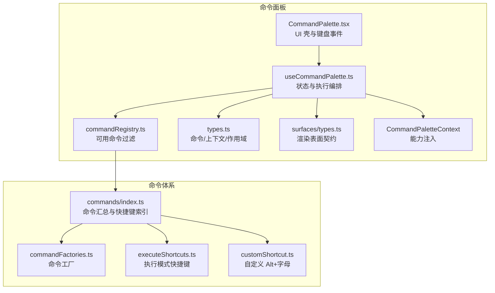
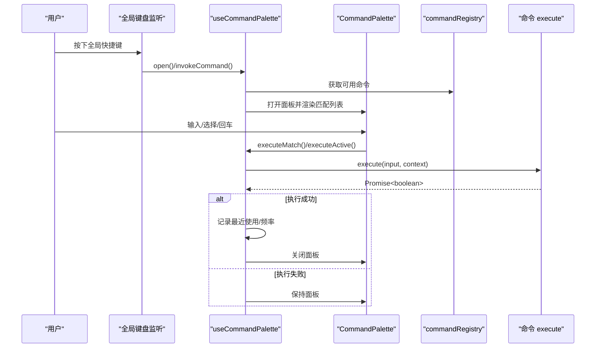
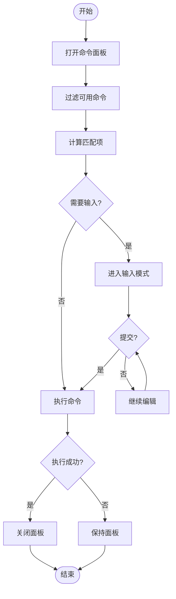
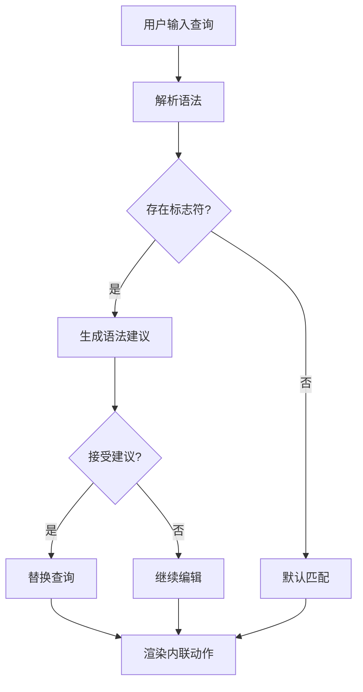
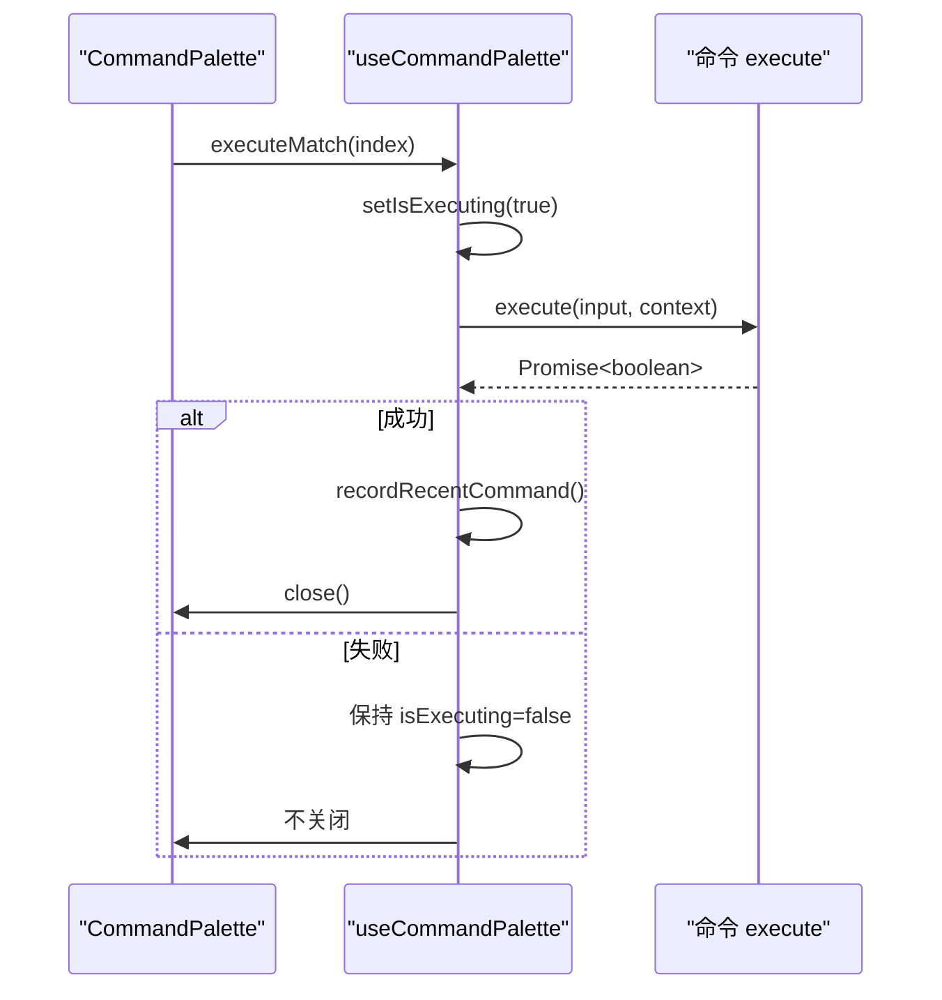
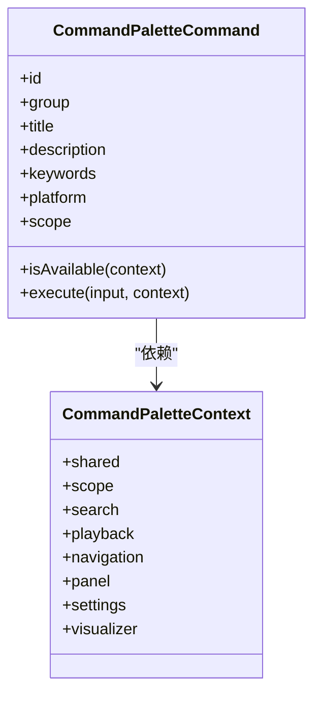
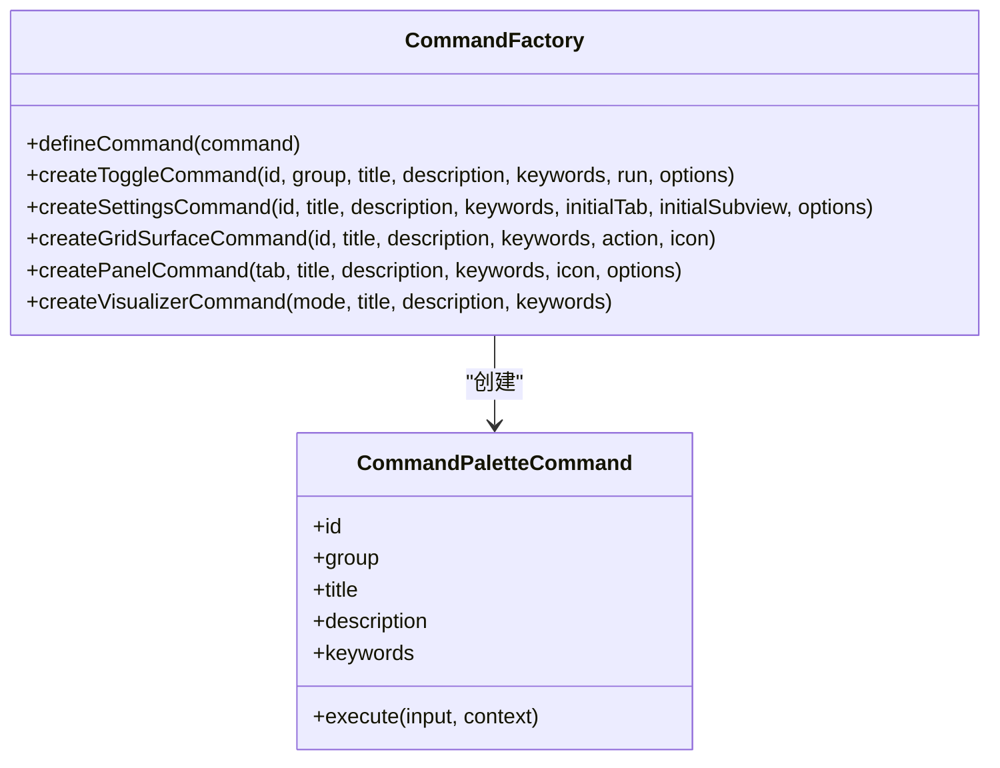
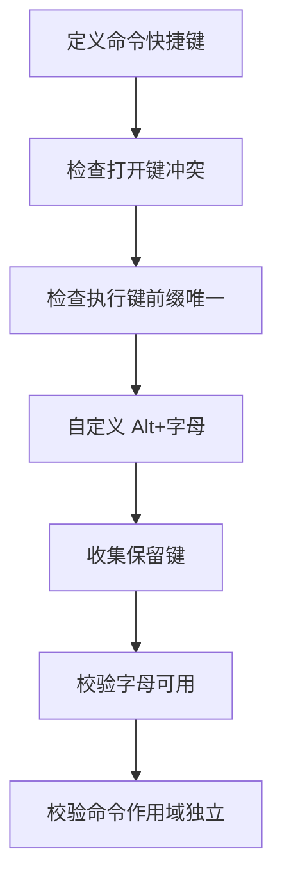
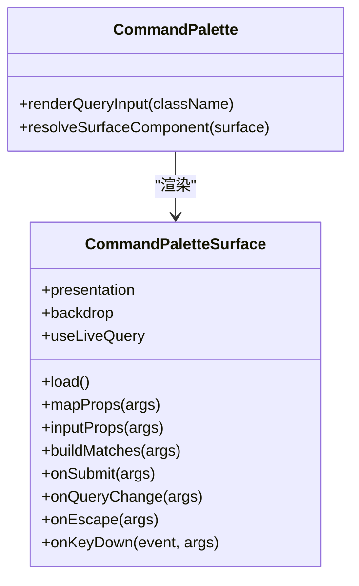
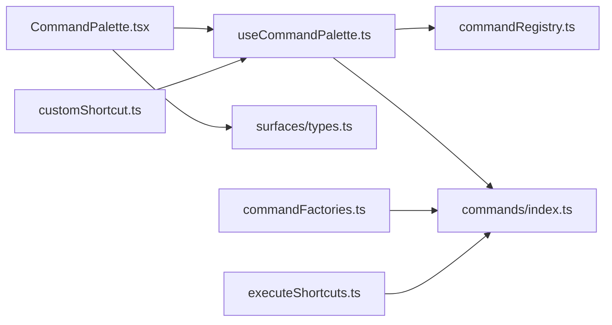

# 命令执行框架

<cite>
**本文引用的文件**   
- [CommandPalette.tsx](file://src/components/command-palette/CommandPalette.tsx)
- [useCommandPalette.ts](file://src/components/command-palette/useCommandPalette.ts)
- [commandFactories.ts](file://src/components/command-palette/commandFactories.ts)
- [commandRegistry.ts](file://src/components/command-palette/commandRegistry.ts)
- [types.ts](file://src/components/command-palette/types.ts)
- [surfaces/types.ts](file://src/components/command-palette/surfaces/types.ts)
- [executeShortcuts.ts](file://src/components/command-palette/executeShortcuts.ts)
- [customShortcut.ts](file://src/components/command-palette/customShortcut.ts)
- [commands/index.ts](file://src/components/command-palette/commands/index.ts)
</cite>

## 目录
1. [引言](#引言)
2. [项目结构](#项目结构)
3. [核心组件](#核心组件)
4. [架构总览](#架构总览)
5. [详细组件分析](#详细组件分析)
6. [依赖关系分析](#依赖关系分析)
7. [性能与可观测性](#性能与可观测性)
8. [故障排查指南](#故障排查指南)
9. [结论](#结论)

## 引言
本文件面向 Folia Major 的命令执行框架，聚焦命令面板（Command Palette）的完整执行链路：从快捷键触发、参数解析、上下文准备、匹配排序，到命令工厂创建、异步执行调度、错误处理、作用域隔离、资源清理，以及快捷键绑定与冲突检测。文档同时给出可视化架构图与时序图，帮助读者快速理解“用户输入 → 命令执行 → 结果反馈”的全流程。

## 项目结构
命令执行框架位于 `src/components/command-palette`，采用“声明式命令 + 注册表 + 渲染表面 + 钩子编排”的分层组织方式：
- 命令定义与分组：`commands/*` 按功能域组织命令；`commandFactories.ts` 提供统一构造器。
- 注册与可用性过滤：`commandRegistry.ts` 聚合命令并暴露可用集合。
- 类型契约：`types.ts` 定义命令、上下文、分组与作用域等核心类型。
- 渲染表面：`surfaces/types.ts` 定义命令自定义 UI 的契约。
- 交互编排：`useCommandPalette.ts` 管理打开、关闭、输入、匹配、执行、快捷键监听。
- 界面壳：`CommandPalette.tsx` 负责键盘事件、语法提示、内联/全屏渲染。
- 快捷键系统：`executeShortcuts.ts`、`customShortcut.ts`、`commands/index.ts` 负责执行模式快捷键与全局打开快捷键索引。

**图表来源**
- [CommandPalette.tsx:1-602](file://src/components/command-palette/CommandPalette.tsx#L1-L602)
- [useCommandPalette.ts:1-628](file://src/components/command-palette/useCommandPalette.ts#L1-L628)
- [commandRegistry.ts:1-44](file://src/components/command-palette/commandRegistry.ts#L1-L44)
- [types.ts:1-377](file://src/components/command-palette/types.ts#L1-L377)
- [surfaces/types.ts:1-79](file://src/components/command-palette/surfaces/types.ts#L1-L79)
- [commandFactories.ts:1-228](file://src/components/command-palette/commandFactories.ts#L1-L228)
- [commands/index.ts:1-107](file://src/components/command-palette/commands/index.ts#L1-L107)
- [executeShortcuts.ts:1-83](file://src/components/command-palette/executeShortcuts.ts#L1-L83)
- [customShortcut.ts:1-68](file://src/components/command-palette/customShortcut.ts#L1-L68)

**章节来源**
- [CommandPalette.tsx:1-602](file://src/components/command-palette/CommandPalette.tsx#L1-L602)
- [useCommandPalette.ts:1-628](file://src/components/command-palette/useCommandPalette.ts#L1-L628)
- [commandRegistry.ts:1-44](file://src/components/command-palette/commandRegistry.ts#L1-L44)
- [types.ts:1-377](file://src/components/command-palette/types.ts#L1-L377)
- [surfaces/types.ts:1-79](file://src/components/command-palette/surfaces/types.ts#L1-L79)
- [commandFactories.ts:1-228](file://src/components/command-palette/commandFactories.ts#L1-L228)
- [commands/index.ts:1-107](file://src/components/command-palette/commands/index.ts#L1-L107)
- [executeShortcuts.ts:1-83](file://src/components/command-palette/executeShortcuts.ts#L1-L83)
- [customShortcut.ts:1-68](file://src/components/command-palette/customShortcut.ts#L1-L68)

## 核心组件
- 命令面板 UI 壳：负责展示输入框、匹配列表、语法提示、内联/全屏渲染、Esc/方向键/Enter 行为。
- 命令面板钩子：集中管理打开/关闭、查询去抖、匹配计算、最近使用记录、频率统计、快捷键监听、命令执行入口。
- 命令注册表：聚合所有命令，按平台、作用域、状态门控过滤出可用命令。
- 命令工厂：提供 `createToggleCommand`、`createSettingsCommand`、`createGridSurfaceCommand`、`createPanelCommand`、`createVisualizerCommand` 等便捷构造器，统一封装标题、描述、关键词、执行逻辑。
- 渲染表面契约：允许命令替换默认匹配列表，支持内联渲染、延迟加载、自定义输入属性、提交与按键拦截。
- 快捷键系统：
  - 全局打开快捷键：通过 `openHotkeyStroke` 构建索引，支持平台主修饰键语义。
  - 执行模式快捷键：vim 风格序列，要求前缀唯一且跨作用域不冲突。
  - 自定义快捷键：Alt + 字母，需避开保留键且命令必须无作用域限制。

**章节来源**
- [CommandPalette.tsx:1-602](file://src/components/command-palette/CommandPalette.tsx#L1-L602)
- [useCommandPalette.ts:1-628](file://src/components/command-palette/useCommandPalette.ts#L1-L628)
- [commandRegistry.ts:1-44](file://src/components/command-palette/commandRegistry.ts#L1-L44)
- [commandFactories.ts:1-228](file://src/components/command-palette/commandFactories.ts#L1-L228)
- [surfaces/types.ts:1-79](file://src/components/command-palette/surfaces/types.ts#L1-L79)
- [commands/index.ts:1-107](file://src/components/command-palette/commands/index.ts#L1-L107)
- [executeShortcuts.ts:1-83](file://src/components/command-palette/executeShortcuts.ts#L1-L83)
- [customShortcut.ts:1-68](file://src/components/command-palette/customShortcut.ts#L1-L68)

## 架构总览
命令执行框架的整体数据流如下：
1. 用户通过全局快捷键或自定义快捷键触发命令面板。
2. 钩子根据当前上下文过滤可用命令，计算匹配项并排序。
3. 用户在面板中输入，触发语法提示与实时预览。
4. 用户确认执行后，钩子调用命令的 `execute`，返回 Promise<boolean>。
5. 成功则记录最近使用与频率，关闭面板；失败保持面板以便重试或修正。
6. 命令可通过 `context` 访问播放、导航、设置、可视化、搜索、面板、共享能力。

**图表来源**
- [useCommandPalette.ts:475-598](file://src/components/command-palette/useCommandPalette.ts#L475-L598)
- [useCommandPalette.ts:269-324](file://src/components/command-palette/useCommandPalette.ts#L269-L324)
- [CommandPalette.tsx:276-357](file://src/components/command-palette/CommandPalette.tsx#L276-L357)
- [commandRegistry.ts:19-43](file://src/components/command-palette/commandRegistry.ts#L19-L43)

## 详细组件分析

### 命令生命周期与执行流程
- 打开入口：
  - 全局快捷键：`ctrl+k` 或平台主修饰键组合，由 `commands/index.ts` 中的 `OPEN_HOTKEY_INDEX` 查找命令。
  - 自定义快捷键：`Alt + 字母`，由 `customShortcut.ts` 校验是否保留键与命令作用域独立。
  - 过滤视图裸键：在网格过滤场景下，单字符裸键进入过滤命令，除非是显式打开键（如 `:`）。
- 匹配与排序：
  - 默认匹配：基于查询文本、最近使用、频率统计与语言环境进行排序。
  - 表面匹配：命令自定义 `buildMatches` 覆盖默认列表。
  - 输入模式匹配：对需要输入的命名列出候选。
- 执行路径：
  - 有表面的命令：先打开面板，再由表面决定提交或继续编辑。
  - 无表面的命令：直接执行 `execute`，成功后关闭面板。
- 异步与取消：
  - 命令返回 `Promise<boolean>`，钩子在 `finally` 中重置执行锁。
  - 未实现超时与取消机制；如需扩展，可在钩子层引入 AbortController 或超时包装。

**图表来源**
- [useCommandPalette.ts:197-230](file://src/components/command-palette/useCommandPalette.ts#L197-L230)
- [useCommandPalette.ts:269-324](file://src/components/command-palette/useCommandPalette.ts#L269-L324)
- [useCommandPalette.ts:435-455](file://src/components/command-palette/useCommandPalette.ts#L435-L455)
- [CommandPalette.tsx:276-357](file://src/components/command-palette/CommandPalette.tsx#L276-L357)

**章节来源**
- [useCommandPalette.ts:197-324](file://src/components/command-palette/useCommandPalette.ts#L197-L324)
- [useCommandPalette.ts:435-455](file://src/components/command-palette/useCommandPalette.ts#L435-L455)
- [CommandPalette.tsx:276-357](file://src/components/command-palette/CommandPalette.tsx#L276-L357)

### 参数解析与语法提示
- 语法规范：命令可声明 `syntax`，由 `./syntax` 模块解析 `--flag @facet:value` 形式。
- 实时建议：面板根据当前查询与语法规范生成补全项，支持上下箭头选择与 Tab/Enter 接受。
- 内联动作：对于网格过滤命令，面板会解析为内联动作并在输入框下方显示待执行操作。

**图表来源**
- [CommandPalette.tsx:133-161](file://src/components/command-palette/CommandPalette.tsx#L133-L161)
- [CommandPalette.tsx:311-328](file://src/components/command-palette/CommandPalette.tsx#L311-L328)

**章节来源**
- [CommandPalette.tsx:133-161](file://src/components/command-palette/CommandPalette.tsx#L133-L161)
- [CommandPalette.tsx:311-328](file://src/components/command-palette/CommandPalette.tsx#L311-L328)

### 异步命令处理与错误恢复
- Promise 支持：命令 `execute` 返回 `Promise<boolean>`，钩子 await 后根据布尔值决定是否关闭面板。
- 执行锁：`isExecuting` 防止重复执行；在 `finally` 中确保释放。
- 错误恢复：当前未捕获异常；建议在钩子层包裹 try/catch 并上报错误，同时向用户展示状态消息。
- 超时与取消：当前未实现；可扩展为在钩子层包装 Promise 并支持取消。

**图表来源**
- [useCommandPalette.ts:269-302](file://src/components/command-palette/useCommandPalette.ts#L269-L302)
- [useCommandPalette.ts:304-324](file://src/components/command-palette/useCommandPalette.ts#L304-L324)

**章节来源**
- [useCommandPalette.ts:269-324](file://src/components/command-palette/useCommandPalette.ts#L269-L324)

### 执行上下文与作用域隔离
- 上下文结构：`CommandPaletteContext` 包含 `shared`、`scope`、`search`、`playback`、`navigation`、`panel`、`settings`、`visualizer` 等命名空间。
- 作用域门控：命令可声明 `scope`（如 `player-surface`、`grid-surface`），注册表据此过滤。
- 状态共享：上下文通过钩子注入，命令仅能访问其声明的能力，避免隐式耦合。
- 资源清理：命令执行完成后，钩子负责关闭面板与重置状态；命令自身应保证副作用可撤销或幂等。

**图表来源**
- [types.ts:94-377](file://src/components/command-palette/types.ts#L94-L377)
- [types.ts:43-84](file://src/components/command-palette/types.ts#L43-L84)

**章节来源**
- [types.ts:94-377](file://src/components/command-palette/types.ts#L94-L377)
- [types.ts:43-84](file://src/components/command-palette/types.ts#L43-L84)

### 命令工厂模式
- 统一构造器：`defineCommand`、`createToggleCommand`、`createSettingsCommand`、`createGridSurfaceCommand`、`createAppLanguageCommand`、`createReplayGainCommand`、`createSoundPresetCommand`、`createHomeTabCommand`、`createPanelCommand`、`createVisualizerCommand`。
- 动态创建：工厂函数接收 id、组、标题、描述、关键词与执行逻辑，自动填充元数据。
- 依赖注入：命令通过 `context` 访问外部能力，无需直接导入服务。
- 配置管理：设置类命令通过 `settingsTarget` 指向设置面板的子视图与锚点。

**图表来源**
- [commandFactories.ts:14-228](file://src/components/command-palette/commandFactories.ts#L14-L228)

**章节来源**
- [commandFactories.ts:14-228](file://src/components/command-palette/commandFactories.ts#L14-L228)

### 快捷键绑定与冲突检测
- 全局打开快捷键：
  - 通过 `openHotkeyStroke` 构建索引，支持平台主修饰键语义。
  - 冲突检测：禁止重复键、禁止占用面板自身打开键（`s`、`ctrl+k`）。
- 执行模式快捷键：
  - vim 风格序列，要求前缀唯一且跨作用域不冲突。
  - 冲突检测：断言相同键与前缀关系，抛出错误。
- 自定义快捷键：
  - Alt + 字母，需避开保留键且命令必须无作用域限制。
  - 校验逻辑：`collectReservedShortcutStrokes`、`isCustomShortcutLetterAvailable`、`resolveCustomShortcutCommand`。

**图表来源**
- [commands/index.ts:27-45](file://src/components/command-palette/commands/index.ts#L27-L45)
- [commands/index.ts:66-88](file://src/components/command-palette/commands/index.ts#L66-L88)
- [executeShortcuts.ts:23-51](file://src/components/command-palette/executeShortcuts.ts#L23-L51)
- [customShortcut.ts:24-37](file://src/components/command-palette/customShortcut.ts#L24-L37)
- [customShortcut.ts:56-67](file://src/components/command-palette/customShortcut.ts#L56-L67)

**章节来源**
- [commands/index.ts:27-88](file://src/components/command-palette/commands/index.ts#L27-L88)
- [executeShortcuts.ts:23-83](file://src/components/command-palette/executeShortcuts.ts#L23-L83)
- [customShortcut.ts:24-67](file://src/components/command-palette/customShortcut.ts#L24-L67)

### 渲染表面与内联模式
- 表面契约：命令可声明 `surface`，支持 `overlay` 与 `inline` 两种呈现模式。
- 内联模式：面板以输入框形式嵌入目标控件位置，适合网格过滤等场景。
- 延迟加载：表面组件通过 `React.lazy` 懒加载，避免污染模块图。
- 属性映射：`mapProps` 与 `inputProps` 允许表面定制渲染与输入行为。

**图表来源**
- [surfaces/types.ts:38-79](file://src/components/command-palette/surfaces/types.ts#L38-L79)
- [CommandPalette.tsx:51-67](file://src/components/command-palette/CommandPalette.tsx#L51-L67)
- [CommandPalette.tsx:163-177](file://src/components/command-palette/CommandPalette.tsx#L163-L177)

**章节来源**
- [surfaces/types.ts:38-79](file://src/components/command-palette/surfaces/types.ts#L38-L79)
- [CommandPalette.tsx:51-67](file://src/components/command-palette/CommandPalette.tsx#L51-L67)
- [CommandPalette.tsx:163-177](file://src/components/command-palette/CommandPalette.tsx#L163-L177)

## 依赖关系分析
命令执行框架的内部依赖如下：
- `useCommandPalette` 依赖 `commandRegistry` 获取可用命令，依赖 `commands/index.ts` 获取打开快捷键索引。
- `CommandPalette` 依赖 `useCommandPalette` 提供的状态与方法，依赖 `surfaces/types` 渲染自定义表面。
- `commandFactories` 被各命令组文件引用，用于统一构造命令对象。
- `executeShortcuts` 与 `customShortcut` 被 `commands/index.ts` 与 `useCommandPalette` 引用，用于快捷键校验与解析。

**图表来源**
- [useCommandPalette.ts:1-15](file://src/components/command-palette/useCommandPalette.ts#L1-L15)
- [CommandPalette.tsx:1-20](file://src/components/command-palette/CommandPalette.tsx#L1-L20)
- [commandFactories.ts:1-8](file://src/components/command-palette/commandFactories.ts#L1-L8)
- [commands/index.ts:1-12](file://src/components/command-palette/commands/index.ts#L1-L12)
- [executeShortcuts.ts:1-7](file://src/components/command-palette/executeShortcuts.ts#L1-L7)
- [customShortcut.ts:1-8](file://src/components/command-palette/customShortcut.ts#L1-L8)

**章节来源**
- [useCommandPalette.ts:1-15](file://src/components/command-palette/useCommandPalette.ts#L1-L15)
- [CommandPalette.tsx:1-20](file://src/components/command-palette/CommandPalette.tsx#L1-L20)
- [commandFactories.ts:1-8](file://src/components/command-palette/commandFactories.ts#L1-L8)
- [commands/index.ts:1-12](file://src/components/command-palette/commands/index.ts#L1-L12)
- [executeShortcuts.ts:1-7](file://src/components/command-palette/executeShortcuts.ts#L1-L7)
- [customShortcut.ts:1-8](file://src/components/command-palette/customShortcut.ts#L1-L8)

## 性能与可观测性
- 性能优化：
  - 可用命令集稳定化：钩子层缓存已过滤命令数组，避免每次渲染重新排序。
  - 匹配计算分三路：默认匹配、表面匹配、输入模式匹配，减少不必要的上下文依赖。
  - 语法建议实时生成但仅在需要时显示，避免阻塞输入。
- 可观测性：
  - 最近使用命令与频率统计：用于提升常用命令的排序权重。
  - 调试工具：可通过测试用例与探针观察命令面板行为，例如虚拟列表、大小适配、快捷键响应。
- 监控建议：
  - 在执行钩子中加入计时与错误上报，便于定位慢命令与异常。
  - 对长耗时命令引入超时与取消机制，提升用户体验。

[本节为通用指导，不直接分析具体文件]

## 故障排查指南
- 快捷键冲突：
  - 检查命令是否声明重复的 `openHotkey` 或占用面板自身打开键。
  - 检查执行模式快捷键是否存在前缀冲突。
- 命令不可用：
  - 检查命令的 `platform`、`scope`、`isAvailable` 是否符合当前上下文。
  - 检查自定义快捷键是否绑定了有作用域限制的命令。
- 执行失败：
  - 检查命令 `execute` 是否正确返回布尔值。
  - 检查是否有未捕获异常；建议在钩子层增加错误处理。
- 内联模式异常：
  - 检查表面是否提供正确的锚点元素。
  - 检查 `onSubmit` 与 `onQueryChange` 是否正确处理返回值。

**章节来源**
- [commands/index.ts:27-45](file://src/components/command-palette/commands/index.ts#L27-L45)
- [executeShortcuts.ts:23-51](file://src/components/command-palette/executeShortcuts.ts#L23-L51)
- [customShortcut.ts:56-67](file://src/components/command-palette/customShortcut.ts#L56-L67)
- [useCommandPalette.ts:269-324](file://src/components/command-palette/useCommandPalette.ts#L269-L324)

## 结论
Folia Major 的命令执行框架通过声明式命令、注册表过滤、渲染表面与钩子编排，实现了高内聚、低耦合的命令系统。其优势包括：
- 清晰的职责分离：命令定义、注册、渲染、交互各自独立。
- 强大的扩展性：工厂模式与表面契约支持动态命令创建与自定义 UI。
- 健壮的快捷键系统：全局打开、执行模式与自定义快捷键均有冲突检测。
- 良好的性能优化：命令过滤与匹配计算避免不必要的重排。

未来可考虑增强：
- 统一的错误处理与用户反馈机制。
- 超时与取消支持，提升长耗时命令的体验。
- 更丰富的监控与调试工具，便于生产问题定位。

[本节为总结性内容，不直接分析具体文件]