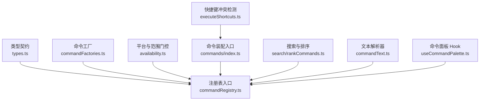
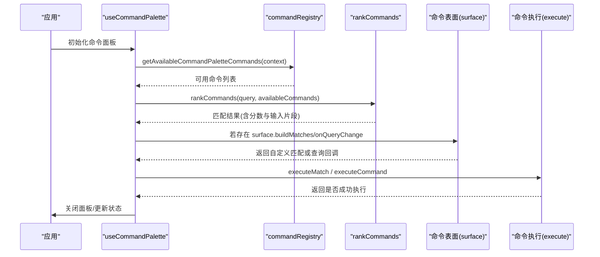
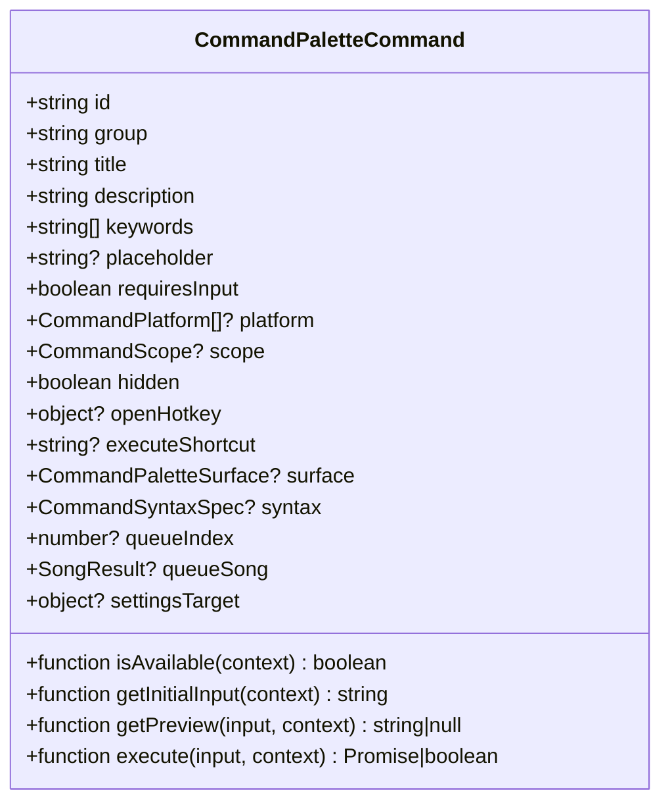
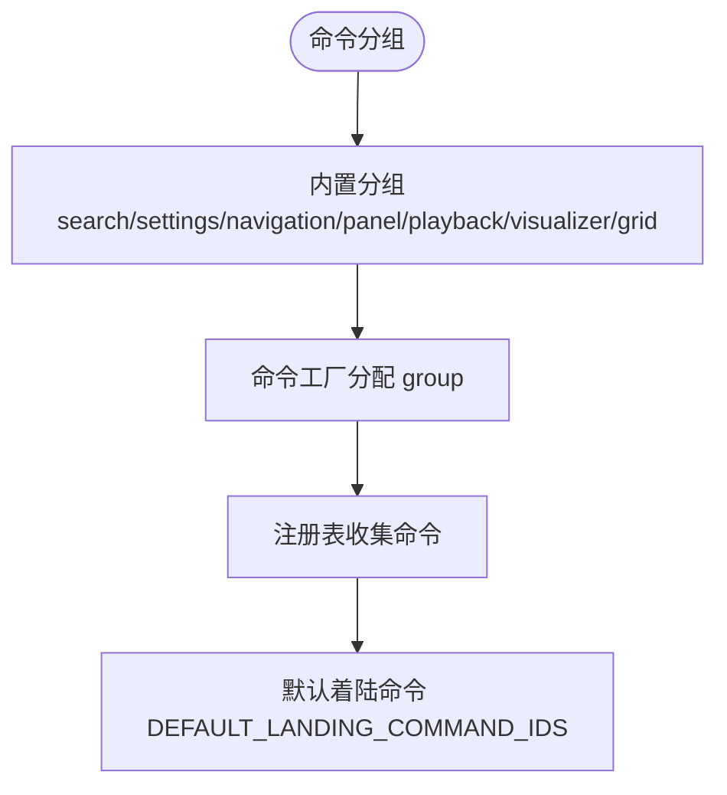
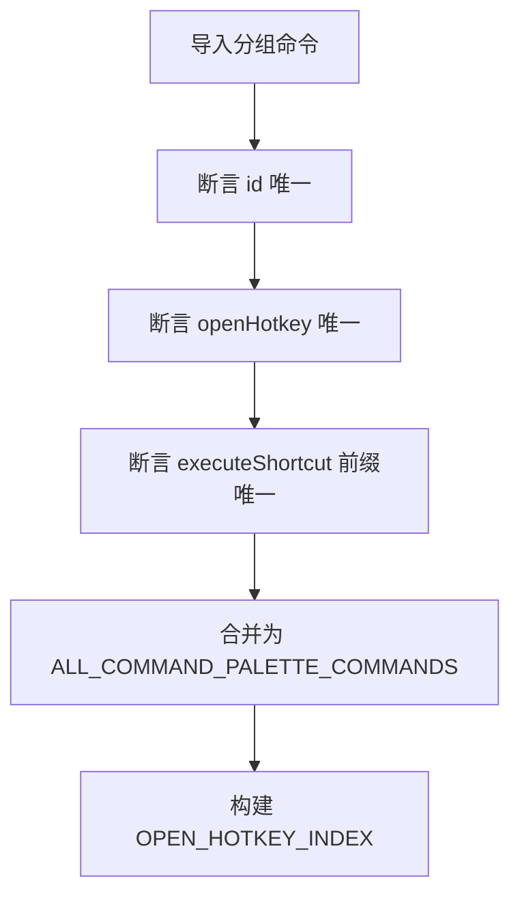
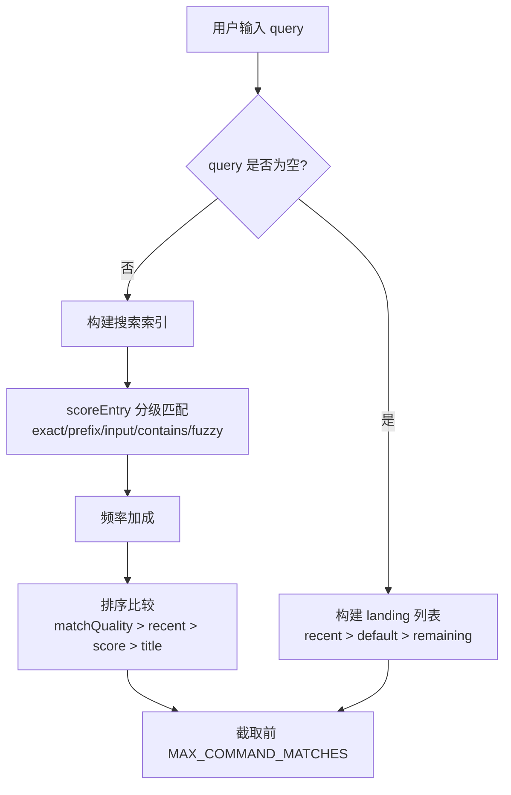
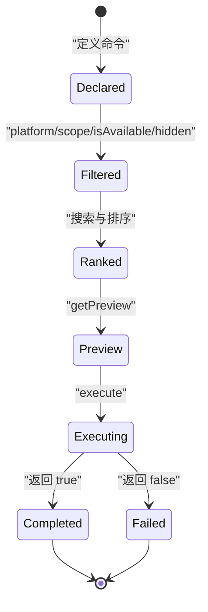
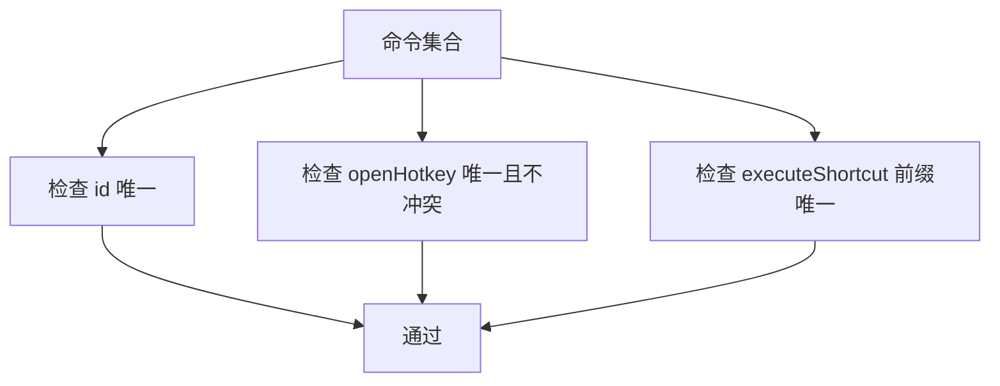
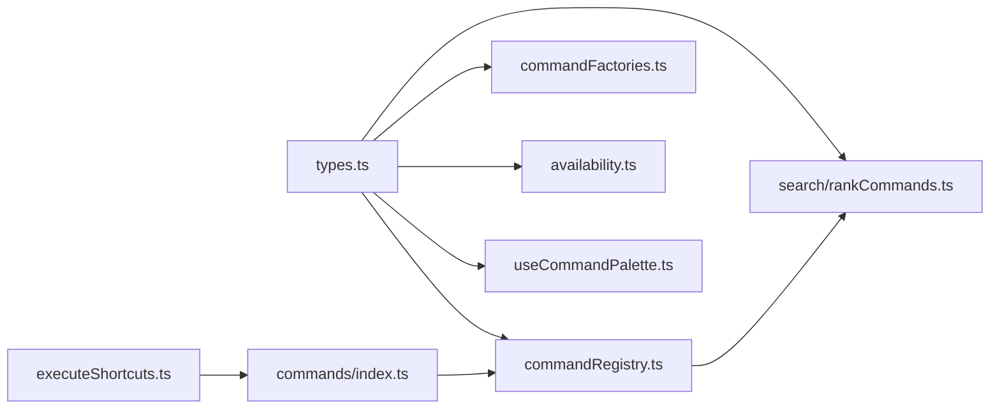

# 命令注册表

<cite>
**本文引用的文件**   
- [types.ts](file://src/components/command-palette/types.ts)
- [commandRegistry.ts](file://src/components/command-palette/commandRegistry.ts)
- [commandFactories.ts](file://src/components/command-palette/commandFactories.ts)
- [availability.ts](file://src/components/command-palette/availability.ts)
- [commands/index.ts](file://src/components/command-palette/commands/index.ts)
- [search/rankCommands.ts](file://src/components/command-palette/search/rankCommands.ts)
- [commandText.ts](file://src/components/command-palette/commandText.ts)
- [useCommandPalette.ts](file://src/components/command-palette/useCommandPalette.ts)
- [executeShortcuts.ts](file://src/components/command-palette/executeShortcuts.ts)
</cite>

## 目录
1. [引言](#引言)
2. [项目结构](#项目结构)
3. [核心组件](#核心组件)
4. [架构总览](#架构总览)
5. [详细组件分析](#详细组件分析)
6. [依赖关系分析](#依赖关系分析)
7. [性能考量](#性能考量)
8. [故障排查指南](#故障排查指南)
9. [结论](#结论)
10. [附录：扩展与最佳实践](#附录扩展与最佳实践)

## 引言
本文面向 Folia Major 的命令注册表系统，聚焦命令面板（Command Palette）背后的命令发现、注册、分组、排序、执行与冲突检测机制。文档将解释 CommandPaletteCommand 接口定义、命令元数据结构（id、title、description、group、icon、keywords）、优先级排序算法、生命周期管理（动态可用性与上下文门控）、分组体系（内置分组与自定义扩展点）、命令发现流程（静态扫描与集中装配）、冲突检测策略（命名空间、快捷键与别名），以及第三方命令集成建议与性能优化要点。

## 项目结构
命令注册表位于前端 React 应用中的命令面板模块，核心由类型契约、工厂函数、可用性门控、命令装配入口、搜索与排序、以及 UI Hook 组成。

**图表来源**
- [types.ts:28-84](file://src/components/command-palette/types.ts#L28-L84)
- [commandRegistry.ts:1-44](file://src/components/command-palette/commandRegistry.ts#L1-L44)
- [commandFactories.ts:1-228](file://src/components/command-palette/commandFactories.ts#L1-L228)
- [availability.ts:1-88](file://src/components/command-palette/availability.ts#L1-L88)
- [commands/index.ts:1-107](file://src/components/command-palette/commands/index.ts#L1-L107)
- [search/rankCommands.ts:1-254](file://src/components/command-palette/search/rankCommands.ts#L1-L254)
- [commandText.ts:1-19](file://src/components/command-palette/commandText.ts#L1-L19)
- [useCommandPalette.ts:1-628](file://src/components/command-palette/useCommandPalette.ts#L1-L628)
- [executeShortcuts.ts:33-61](file://src/components/command-palette/executeShortcuts.ts#L33-L61)

**章节来源**
- [types.ts:28-84](file://src/components/command-palette/types.ts#L28-L84)
- [commandRegistry.ts:1-44](file://src/components/command-palette/commandRegistry.ts#L1-L44)
- [commands/index.ts:1-107](file://src/components/command-palette/commands/index.ts#L1-L107)

## 核心组件
- 类型契约：CommandPaletteCommand、CommandPaletteGroup、CommandPaletteContext 等定义了命令的元数据、分组、上下文能力与作用域。
- 注册表入口：聚合所有命令、过滤可用命令、导出排序与匹配工具。
- 命令工厂：提供 createToggleCommand、createSettingsCommand、createGridSurfaceCommand 等便捷构造器，统一命令声明风格。
- 可用性门控：按平台（web/electron/win/mac/linux）与作用域（player-surface/filtering-surface/lattice/grid-surface）决定是否显示或启用命令。
- 命令装配：集中导入各分组命令数组，进行 id 唯一性、openHotkey 唯一性、executeShortcut 前缀唯一性等断言，并构建 openHotkey 索引。
- 搜索与排序：基于触发词、标题词、首字母、子串与模糊匹配的分级评分，结合最近使用与频率加成输出最终列表。
- 文本解析：根据 textSource 决定从 i18n 键值还是运行时字符串获取 title/description。
- UI Hook：管理打开、输入、匹配、预览、执行、快捷键分发与状态稳定化。

**章节来源**
- [types.ts:28-84](file://src/components/command-palette/types.ts#L28-L84)
- [commandRegistry.ts:1-44](file://src/components/command-palette/commandRegistry.ts#L1-L44)
- [commandFactories.ts:1-228](file://src/components/command-palette/commandFactories.ts#L1-L228)
- [availability.ts:1-88](file://src/components/command-palette/availability.ts#L1-L88)
- [commands/index.ts:1-107](file://src/components/command-palette/commands/index.ts#L1-L107)
- [search/rankCommands.ts:1-254](file://src/components/command-palette/search/rankCommands.ts#L1-L254)
- [commandText.ts:1-19](file://src/components/command-palette/commandText.ts#L1-L19)
- [useCommandPalette.ts:1-628](file://src/components/command-palette/useCommandPalette.ts#L1-L628)

## 架构总览
命令注册表的运行流程可概括为：
- 启动时：集中装配所有命令，执行 id 与快捷键冲突检查，构建 openHotkey 索引。
- 渲染时：根据当前 context 计算可用命令集合（platform/scope/isAvailable/hidden）。
- 交互时：用户输入触发搜索与排序；命中后生成预览；执行命令并记录最近使用与频率。
- 快捷键：全局监听窗口按键，通过 openHotkey 索引快速定位命令，再校验可用性后执行。

**图表来源**
- [useCommandPalette.ts:141-190](file://src/components/command-palette/useCommandPalette.ts#L141-L190)
- [useCommandPalette.ts:269-324](file://src/components/command-palette/useCommandPalette.ts#L269-L324)
- [commandRegistry.ts:39-44](file://src/components/command-palette/commandRegistry.ts#L39-L44)
- [search/rankCommands.ts:184-233](file://src/components/command-palette/search/rankCommands.ts#L184-L233)

**章节来源**
- [useCommandPalette.ts:141-190](file://src/components/command-palette/useCommandPalette.ts#L141-L190)
- [useCommandPalette.ts:269-324](file://src/components/command-palette/useCommandPalette.ts#L269-L324)
- [commandRegistry.ts:39-44](file://src/components/command-palette/commandRegistry.ts#L39-L44)
- [search/rankCommands.ts:184-233](file://src/components/command-palette/search/rankCommands.ts#L184-L233)

## 详细组件分析

### CommandPaletteCommand 接口与元数据
CommandPaletteCommand 是命令的核心契约，包含以下关键字段：
- id：命令唯一标识，用于注册表去重、快捷键映射与国际化键名。
- group：分组，限定命令类别（search/settings/navigation/panel/playback/visualizer/grid）。
- title/description：命令标题与描述，支持 i18n 或运行时文本。
- icon：可选图标。
- keywords：关键词数组，参与搜索索引与触发词匹配。
- placeholder/getInitialInput：输入提示与初始输入。
- requiresInput：是否需要用户输入。
- platform：平台门控（web/electron/win/mac/linux）。
- scope：作用域门控（player-surface/filtering-surface/lattice/grid-surface）。
- isAvailable：运行时可用性判断。
- hidden：仅隐藏于列表但保留 key-driven 入口。
- openHotkey：打开面板直达该命令的快捷键。
- executeShortcut：执行模式下的 Vim 风格快捷键。
- surface：命令自定义面板。
- syntax：语法规范（如 --flag @facet:value）。
- settingsTarget：设置面板锚点。
- queueIndex/queueSong：队列相关元数据。
- execute：命令执行逻辑，返回布尔表示是否成功。

**图表来源**
- [types.ts:43-84](file://src/components/command-palette/types.ts#L43-L84)

**章节来源**
- [types.ts:43-84](file://src/components/command-palette/types.ts#L43-L84)

### 命令分组与分类系统
- 内置分组：search、settings、navigation、panel、playback、visualizer、grid。
- 分组在 types.ts 中定义为联合类型 CommandPaletteGroup，并在命令工厂中用于归类命令。
- 分组顺序与默认着陆命令由 commands/index.ts 维护，DEFAULT_LANDING_COMMAND_IDS 控制面板刚打开时的展示项。

**图表来源**
- [types.ts:28-28](file://src/components/command-palette/types.ts#L28-L28)
- [commandFactories.ts:17-228](file://src/components/command-palette/commandFactories.ts#L17-L228)
- [commands/index.ts:91-107](file://src/components/command-palette/commands/index.ts#L91-L107)

**章节来源**
- [types.ts:28-28](file://src/components/command-palette/types.ts#L28-L28)
- [commandFactories.ts:17-228](file://src/components/command-palette/commandFactories.ts#L17-L228)
- [commands/index.ts:91-107](file://src/components/command-palette/commands/index.ts#L91-L107)

### 命令发现机制
- 静态扫描：commands/index.ts 集中导入各分组命令数组（filterViewCommand、gridCommands、searchCommands、playbackCommands、settingsCommands、navigationCommands、panelCommands、modsCommands、visualizerCommands）。
- 集中装配：对命令数组执行断言（id 唯一、openHotkey 唯一、executeShortcut 前缀唯一），然后合并为 ALL_COMMAND_PALETTE_COMMANDS。
- 延迟初始化：命令本身是纯对象，不引入重型模块；仅在需要时通过 context 访问服务。
- 动态加载：当前仓库未实现运行时动态加载命令模块；可通过扩展 commands/index.ts 的导入来新增分组。

**图表来源**
- [commands/index.ts:16-88](file://src/components/command-palette/commands/index.ts#L16-L88)

**章节来源**
- [commands/index.ts:16-88](file://src/components/command-palette/commands/index.ts#L16-L88)

### 优先级排序算法
排序由 search/rankCommands.ts 实现，关键步骤：
- 空查询：构建 landing 列表（最近使用 > 默认着陆命令 > 其余命令），限制最多 10 条。
- 非空查询：
  - 构建搜索索引（触发词、标题词、首字母、haystack、fuzzyTargets）。
  - 分级匹配：exact/prefix/input/contains/fuzzy，不同级别赋予不同分数区间。
  - 弱信号扣分：标题词与首字母有额外惩罚。
  - 频率加成：getCommandFrequencyBonus 增加历史使用频率加分。
  - 排序比较：先比 matchQuality，再比最近使用排名，最后比 score 与标题字典序。
- 输出：最多 10 条匹配结果，附带 input 片段与 previewText。

**图表来源**
- [search/rankCommands.ts:47-72](file://src/components/command-palette/search/rankCommands.ts#L47-L72)
- [search/rankCommands.ts:86-176](file://src/components/command-palette/search/rankCommands.ts#L86-L176)
- [search/rankCommands.ts:184-233](file://src/components/command-palette/search/rankCommands.ts#L184-L233)

**章节来源**
- [search/rankCommands.ts:47-72](file://src/components/command-palette/search/rankCommands.ts#L47-L72)
- [search/rankCommands.ts:86-176](file://src/components/command-palette/search/rankCommands.ts#L86-L176)
- [search/rankCommands.ts:184-233](file://src/components/command-palette/search/rankCommands.ts#L184-L233)

### 命令生命周期管理
- 动态注册：当前为静态装配；如需动态注册，可在运行时向 COMMAND_PALETTE_COMMANDS 追加命令并重建索引（需遵循断言规则）。
- 注销：可从列表中移除命令或标记 hidden，避免显示但仍保留 key-driven 入口。
- 依赖解析：通过 CommandPaletteContext 注入共享能力（t、playerState、lyrics、playback、navigation、panel、settings、visualizer、scope），命令按需读取。
- 版本兼容性：通过 platform 字段区分 web/electron/win/mac/linux；通过 scope 与 isAvailable 控制运行时可用性。

**图表来源**
- [commandRegistry.ts:15-44](file://src/components/command-palette/commandRegistry.ts#L15-L44)
- [useCommandPalette.ts:101-114](file://src/components/command-palette/useCommandPalette.ts#L101-L114)
- [useCommandPalette.ts:269-324](file://src/components/command-palette/useCommandPalette.ts#L269-L324)

**章节来源**
- [commandRegistry.ts:15-44](file://src/components/command-palette/commandRegistry.ts#L15-L44)
- [useCommandPalette.ts:101-114](file://src/components/command-palette/useCommandPalette.ts#L101-L114)
- [useCommandPalette.ts:269-324](file://src/components/command-palette/useCommandPalette.ts#L269-L324)

### 命令冲突检测与解决策略
- 命名空间管理：id 必须唯一，commands/index.ts 在装配时抛出重复 id 错误。
- 快捷键冲突：
  - openHotkey：每个命令声明一个打开直达快捷键；装配时断言唯一且不与面板自身快捷键冲突。
  - executeShortcut：执行模式下要求前缀唯一，避免歧义。
- 别名处理：通过 keywords 与 triggers（来自搜索索引）实现“别名”式匹配；title/description 也可作为 haystack 参与子串匹配。

**图表来源**
- [commands/index.ts:16-45](file://src/components/command-palette/commands/index.ts#L16-L45)
- [executeShortcuts.ts:33-61](file://src/components/command-palette/executeShortcuts.ts#L33-L61)

**章节来源**
- [commands/index.ts:16-45](file://src/components/command-palette/commands/index.ts#L16-L45)
- [executeShortcuts.ts:33-61](file://src/components/command-palette/executeShortcuts.ts#L33-L61)

### 命令扩展点与第三方集成
- 扩展点：
  - 新增分组：在 types.ts 扩展 CommandPaletteGroup，并在 commands/index.ts 导入新分组命令数组。
  - 命令工厂：使用 commandFactories.ts 提供的工厂函数创建命令，确保 group、keywords、platform、scope、isAvailable 等元数据一致。
  - 自定义表面：通过 surface 字段提供 CommandPaletteSurface，实现自定义输入与匹配逻辑。
- 第三方集成建议：
  - 保持 id 唯一，避免覆盖内置命令。
  - 使用 platform 与 scope 精确声明适用环境。
  - 提供清晰的 keywords 与 triggers，提升搜索命中率。
  - 谨慎使用 openHotkey 与 executeShortcut，避免与内置快捷键冲突。
  - 通过 context 访问能力，避免直接耦合内部模块。

**章节来源**
- [types.ts:28-84](file://src/components/command-palette/types.ts#L28-L84)
- [commandFactories.ts:1-228](file://src/components/command-palette/commandFactories.ts#L1-L228)
- [commands/index.ts:1-107](file://src/components/command-palette/commands/index.ts#L1-L107)

## 依赖关系分析
命令注册表模块内部依赖如下：
- types.ts 被所有其他文件引用，定义命令契约与上下文。
- commandRegistry.ts 聚合命令并导出过滤与排序工具。
- commandFactories.ts 提供命令构造器，被各分组命令文件使用。
- availability.ts 提供 platform/scope 门控逻辑。
- commands/index.ts 集中装配命令并构建 openHotkey 索引。
- search/rankCommands.ts 依赖 registry 与 frequency/recent 数据。
- useCommandPalette.ts 依赖 registry、commands、search 与外部 store。
- executeShortcuts.ts 提供 executeShortcut 前缀唯一性断言。

**图表来源**
- [types.ts:1-377](file://src/components/command-palette/types.ts#L1-L377)
- [commandRegistry.ts:1-44](file://src/components/command-palette/commandRegistry.ts#L1-L44)
- [commandFactories.ts:1-228](file://src/components/command-palette/commandFactories.ts#L1-L228)
- [availability.ts:1-88](file://src/components/command-palette/availability.ts#L1-L88)
- [commands/index.ts:1-107](file://src/components/command-palette/commands/index.ts#L1-L107)
- [search/rankCommands.ts:1-254](file://src/components/command-palette/search/rankCommands.ts#L1-L254)
- [useCommandPalette.ts:1-628](file://src/components/command-palette/useCommandPalette.ts#L1-L628)
- [executeShortcuts.ts:33-61](file://src/components/command-palette/executeShortcuts.ts#L33-L61)

**章节来源**
- [types.ts:1-377](file://src/components/command-palette/types.ts#L1-L377)
- [commandRegistry.ts:1-44](file://src/components/command-palette/commandRegistry.ts#L1-L44)
- [commands/index.ts:1-107](file://src/components/command-palette/commands/index.ts#L1-L107)

## 性能考量
- 可用命令集稳定化：useCommandPalette.ts 通过 useMemo 与 ref 对比，避免每次播放 tick 重新排序全部命令。
- 预构建索引：OPEN_HOTKEY_INDEX 与搜索索引在模块加载时构建，减少运行时扫描成本。
- 分级匹配与截断：rankCommands 限制最多 10 条结果，降低 UI 渲染压力。
- 预览计算边界：previewText 仅对当前匹配的前 10 条计算，避免全量预览。
- 快捷键查找优化：通过 openHotkeyStroke 与 Map 查找替代线性扫描。

[本节为通用性能指导，不直接分析具体代码行]

## 故障排查指南
- 重复 id：装配时抛出错误，检查 commands/index.ts 中命令定义。
- openHotkey 冲突：装配时抛出错误，检查命令的 openHotkey 是否与面板自身快捷键冲突。
- executeShortcut 前缀冲突：断言失败，调整命令的执行快捷键。
- 命令不可见：检查 platform、scope、isAvailable、hidden 配置是否正确。
- 搜索命中异常：确认 keywords、triggers、title/description 与 locale 设置。
- 快捷键无效：确认 isCommandPaletteCommandEnabled 返回 true，且未被文本输入目标拦截。

**章节来源**
- [commands/index.ts:16-45](file://src/components/command-palette/commands/index.ts#L16-L45)
- [executeShortcuts.ts:33-61](file://src/components/command-palette/executeShortcuts.ts#L33-L61)
- [commandRegistry.ts:15-44](file://src/components/command-palette/commandRegistry.ts#L15-L44)
- [useCommandPalette.ts:475-598](file://src/components/command-palette/useCommandPalette.ts#L475-L598)

## 结论
Folia Major 的命令注册表系统以类型契约为核心，通过集中装配、严格断言、分层门控与分级排序，实现了高内聚、低耦合的命令管理体系。其设计兼顾了可扩展性（分组与工厂）、可维护性（断言与索引）与高性能（稳定化与预构建）。对于第三方扩展，建议遵循现有约定，谨慎声明元数据与快捷键，并通过 context 访问能力，以确保命令的稳定与可预测行为。

[本节为总结性内容，不直接分析具体代码行]

## 附录：扩展与最佳实践
- 新增命令：
  - 使用 commandFactories.ts 的工厂函数创建命令。
  - 明确 group、keywords、platform、scope、isAvailable。
  - 如需自定义输入或面板，实现 surface 与 getInitialInput/getPreview。
- 新增分组：
  - 扩展 types.ts 的 CommandPaletteGroup。
  - 在 commands/index.ts 导入新分组命令数组。
- 快捷键设计：
  - 避免与面板自身快捷键冲突。
  - executeShortcut 保持前缀唯一。
- 搜索优化：
  - 提供准确的 keywords 与 triggers。
  - 合理使用 title/description 作为 haystack。
- 性能优化：
  - 避免在 isAvailable 中进行昂贵计算。
  - 使用 context getter 而非快照值。
  - 利用 useMemo 与 ref 稳定命令集。

[本节为通用指导，不直接分析具体代码行]