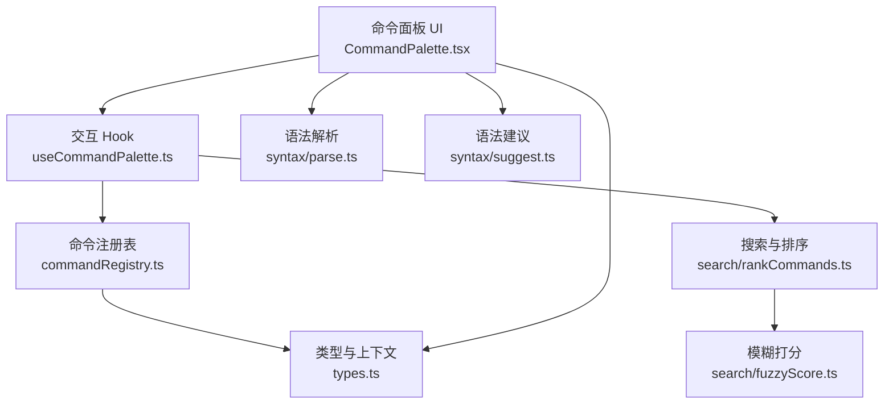
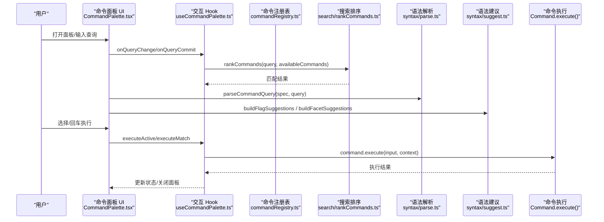
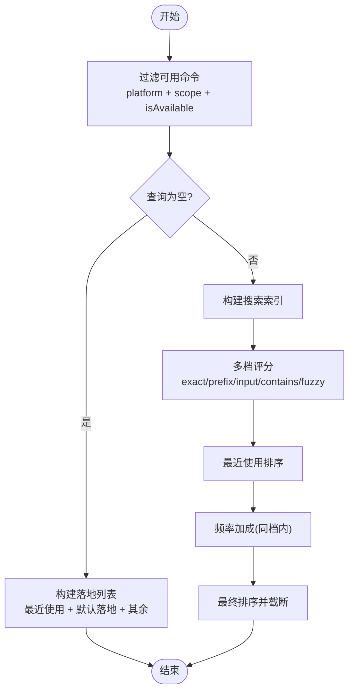
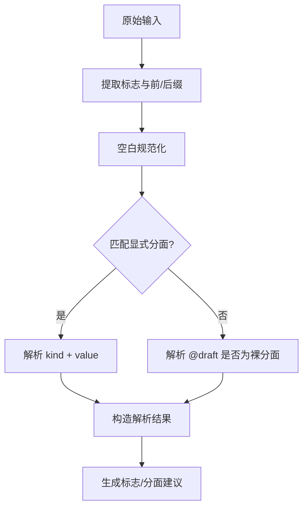
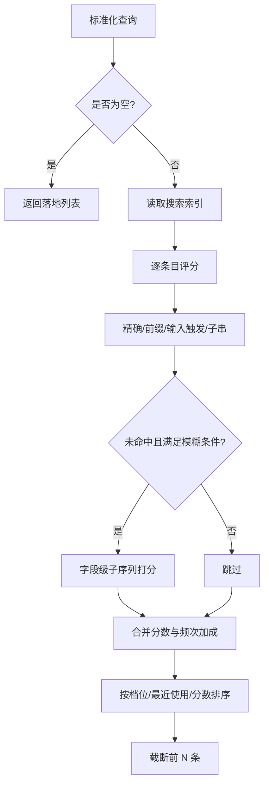
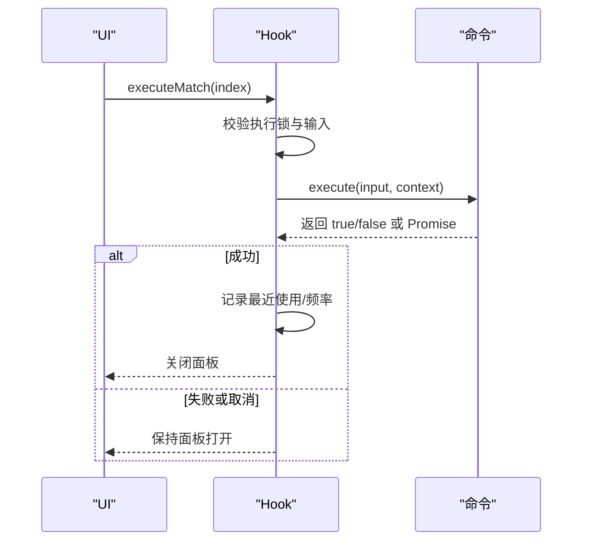
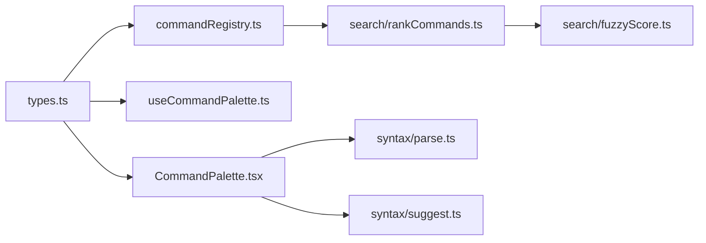

# 命令面板系统

<cite>
**本文引用的文件**   
- [CommandPalette.tsx](file://src/components/command-palette/CommandPalette.tsx)
- [useCommandPalette.ts](file://src/components/command-palette/useCommandPalette.ts)
- [commandRegistry.ts](file://src/components/command-palette/commandRegistry.ts)
- [types.ts](file://src/components/command-palette/types.ts)
- [parse.ts](file://src/components/command-palette/syntax/parse.ts)
- [suggest.ts](file://src/components/command-palette/syntax/suggest.ts)
- [rankCommands.ts](file://src/components/command-palette/search/rankCommands.ts)
- [fuzzyScore.ts](file://src/components/command-palette/search/fuzzyScore.ts)
</cite>

## 目录
1. [简介](#简介)
2. [项目结构](#项目结构)
3. [核心组件](#核心组件)
4. [架构总览](#架构总览)
5. [详细组件分析](#详细组件分析)
6. [依赖关系分析](#依赖关系分析)
7. [性能考量](#性能考量)
8. [故障排查指南](#故障排查指南)
9. [结论](#结论)
10. [附录](#附录)

## 简介
本文件为 Folia Major 的命令面板系统提供完整技术文档。内容覆盖命令注册机制、语法解析器、搜索与匹配算法、命令执行框架、智能提示系统、内置命令集概览、扩展机制与第三方集成方式，以及命令开发与调试实践。目标是在不泄露具体代码的前提下，帮助开发者快速理解并扩展该子系统。

## 项目结构
命令面板系统位于前端 React 应用内，围绕“命令注册—搜索排序—语法解析—UI 渲染—命令执行”的闭环组织：

- 命令注册与可用性过滤：`commandRegistry.ts`
- 类型契约与上下文定义：`types.ts`
- 搜索索引与排序：`search/rankCommands.ts`、`search/fuzzyScore.ts`
- 语法解析与补全：`syntax/parse.ts`、`syntax/suggest.ts`
- 交互 Hook 与状态机：`useCommandPalette.ts`
- UI 主面板与键盘事件：`CommandPalette.tsx`
- 内置命令集合：`commands/*`（导航、播放、设置、可视化等）

**图示来源**
- [CommandPalette.tsx:1-602](file://src/components/command-palette/CommandPalette.tsx#L1-L602)
- [useCommandPalette.ts:1-628](file://src/components/command-palette/useCommandPalette.ts#L1-L628)
- [commandRegistry.ts:1-44](file://src/components/command-palette/commandRegistry.ts#L1-L44)
- [rankCommands.ts:1-254](file://src/components/command-palette/search/rankCommands.ts#L1-L254)
- [fuzzyScore.ts:1-63](file://src/components/command-palette/search/fuzzyScore.ts#L1-L63)
- [parse.ts:1-97](file://src/components/command-palette/syntax/parse.ts#L1-L97)
- [suggest.ts:1-113](file://src/components/command-palette/syntax/suggest.ts#L1-L113)
- [types.ts:1-377](file://src/components/command-palette/types.ts#L1-L377)

**章节来源**
- [CommandPalette.tsx:1-602](file://src/components/command-palette/CommandPalette.tsx#L1-L602)
- [useCommandPalette.ts:1-628](file://src/components/command-palette/useCommandPalette.ts#L1-L628)
- [commandRegistry.ts:1-44](file://src/components/command-palette/commandRegistry.ts#L1-L44)
- [types.ts:1-377](file://src/components/command-palette/types.ts#L1-L377)

## 核心组件
- 命令注册与可用性过滤
  - 集中导出命令列表，并提供平台、作用域、运行时可用性的综合判定。
  - 暴露匹配、排序入口，供 Hook 和 UI 使用。
- 类型与上下文
  - 定义命令元数据、分组、快捷键、语法规格、预览、执行函数等。
  - 提供共享上下文、搜索上下文、播放上下文、导航上下文、面板上下文、设置上下文、可视化上下文与作用域上下文。
- 搜索与排序
  - 基于触发词、标题词、首字母、子串与模糊匹配的多档评分。
  - 最近使用与频率加成参与排序，但不会跨档。
- 语法解析与智能提示
  - 支持 `--flag @facet:value text` 风格语法。
  - 提供标志补全与分面候选补全，保持输入流稳定。
- 交互 Hook
  - 管理打开/关闭、查询去抖、激活命令、执行命令、最近使用记录、快捷键分发。
- UI 面板
  - 负责输入框、结果列表、语法提示、内联表面、固定命令行与键盘事件处理。

**章节来源**
- [commandRegistry.ts:1-44](file://src/components/command-palette/commandRegistry.ts#L1-L44)
- [types.ts:1-377](file://src/components/command-palette/types.ts#L1-L377)
- [rankCommands.ts:1-254](file://src/components/command-palette/search/rankCommands.ts#L1-L254)
- [parse.ts:1-97](file://src/components/command-palette/syntax/parse.ts#L1-L97)
- [suggest.ts:1-113](file://src/components/command-palette/syntax/suggest.ts#L1-L113)
- [useCommandPalette.ts:1-628](file://src/components/command-palette/useCommandPalette.ts#L1-L628)
- [CommandPalette.tsx:1-602](file://src/components/command-palette/CommandPalette.tsx#L1-L602)

## 架构总览
命令面板的整体流程如下：

**图示来源**
- [CommandPalette.tsx:1-602](file://src/components/command-palette/CommandPalette.tsx#L1-L602)
- [useCommandPalette.ts:1-628](file://src/components/command-palette/useCommandPalette.ts#L1-L628)
- [commandRegistry.ts:1-44](file://src/components/command-palette/commandRegistry.ts#L1-L44)
- [rankCommands.ts:1-254](file://src/components/command-palette/search/rankCommands.ts#L1-L254)
- [parse.ts:1-97](file://src/components/command-palette/syntax/parse.ts#L1-L97)
- [suggest.ts:1-113](file://src/components/command-palette/syntax/suggest.ts#L1-L113)

## 详细组件分析

### 命令注册机制与优先级
- 命令元数据
  - 包含标识、分组、标题、描述、图标、关键词、占位符、平台限制、作用域、运行时可用性、隐藏标记、全局快捷键、执行模式快捷键、自定义表面、语法规格、初始输入、预览文本、队列信息、设置跳转目标与执行函数。
- 可用性过滤
  - 通过平台、作用域与运行时谓词组合判断是否显示；隐藏命令不参与列表但仍可被键入直达。
- 排序策略
  - 空查询时优先展示最近使用、默认落地命令与其余命令。
  - 非空查询时按多档质量排序：精确 > 前缀 > 输入触发 > 子串 > 模糊。
  - 同档内比较最近使用顺序与分数；频率加成仅在同档内生效，不跨档。
- 主要入口
  - 公开可用命令集合、匹配与排序函数，供 Hook 与外部调用。

**图示来源**
- [commandRegistry.ts:1-44](file://src/components/command-palette/commandRegistry.ts#L1-L44)
- [rankCommands.ts:1-254](file://src/components/command-palette/search/rankCommands.ts#L1-L254)
- [types.ts:1-377](file://src/components/command-palette/types.ts#L1-L377)

**章节来源**
- [commandRegistry.ts:1-44](file://src/components/command-palette/commandRegistry.ts#L1-L44)
- [rankCommands.ts:1-254](file://src/components/command-palette/search/rankCommands.ts#L1-L254)
- [types.ts:1-377](file://src/components/command-palette/types.ts#L1-L377)

### 语法解析器与智能提示
- 语法规则
  - 支持前置或后置标志 `--flag`。
  - 支持显式分面 `@kind:"value"` 与简写 `@draft`。
  - 支持转义字符与空白规范化。
- 解析流程
  - 提取标志与草稿，归一化剩余文本，识别分面名称与值，返回结构化解析结果。
- 补全生成
  - 标志补全：根据规范与当前草稿匹配，生成替换字符串。
  - 分面补全：由命令提供候选，按偏好、前缀匹配、权重与字典序排序，限制数量。
- 与 UI 的协作
  - 在输入阶段实时计算语法建议，优先接管方向键与回车完成补全，避免干扰命令执行。

**图示来源**
- [parse.ts:1-97](file://src/components/command-palette/syntax/parse.ts#L1-L97)
- [suggest.ts:1-113](file://src/components/command-palette/syntax/suggest.ts#L1-L113)

**章节来源**
- [parse.ts:1-97](file://src/components/command-palette/syntax/parse.ts#L1-L97)
- [suggest.ts:1-113](file://src/components/command-palette/syntax/suggest.ts#L1-L113)

### 搜索与匹配算法
- 多档匹配
  - 精确匹配：触发词完全相等。
  - 前缀匹配：触发词以查询开头。
  - 输入触发：查询作为触发词后跟随用户输入片段。
  - 子串匹配：查询出现在标题词、同义词或语料中。
  - 模糊匹配：仅在 ASCII 查询且长度满足条件时启用，对每个字段单独打分，取最高值。
- 分数构成
  - 基础分来自档位与命中位置。
  - 标题词与首字母命中有额外扣分。
  - 频率加成在同档内提升排名，但不跨越档位。
- 模糊打分
  - 单趟扫描，奖励连续命中与边界命中，惩罚间隙与过长文本，保证低噪声。

**图示来源**
- [rankCommands.ts:1-254](file://src/components/command-palette/search/rankCommands.ts#L1-L254)
- [fuzzyScore.ts:1-63](file://src/components/command-palette/search/fuzzyScore.ts#L1-L63)

**章节来源**
- [rankCommands.ts:1-254](file://src/components/command-palette/search/rankCommands.ts#L1-L254)
- [fuzzyScore.ts:1-63](file://src/components/command-palette/search/fuzzyScore.ts#L1-L63)

### 命令执行框架
- 执行路径
  - 直接执行：无表面、无需输入的简单命令立即执行。
  - 激活输入：需要输入的命令进入激活态，填充初始输入。
  - 表面命令：打开面板并渲染自定义表面，由表面接管输入与提交。
- 异步与错误恢复
  - 执行函数返回 Promise 或布尔值；Hook 统一捕获异常并在 finally 中重置执行锁。
  - 成功执行后记录最近使用与频率，必要时自动关闭面板。
- 执行上下文
  - 将共享能力、作用域、搜索、播放、导航、面板、设置、可视化等上下文注入命令执行函数，确保命令具备一致的能力视图。

**图示来源**
- [useCommandPalette.ts:1-628](file://src/components/command-palette/useCommandPalette.ts#L1-L628)
- [types.ts:1-377](file://src/components/command-palette/types.ts#L1-L377)

**章节来源**
- [useCommandPalette.ts:1-628](file://src/components/command-palette/useCommandPalette.ts#L1-L628)
- [types.ts:1-377](file://src/components/command-palette/types.ts#L1-L377)

### 智能提示系统
- 标志补全
  - 从语法规范中提取标志与别名，按当前草稿过滤，生成替换文本。
- 分面补全
  - 由命令提供候选集合，按偏好、前缀匹配、权重与字典序排序，限制输出数量。
- 实时验证
  - 解析器在输入阶段即时识别标志与分面草稿，UI 据此决定是否接管键盘事件。
- 与命令的协作
  - 某些命令（如网格过滤）会结合上下文决定语法是否可用，避免无效补全。

**章节来源**
- [suggest.ts:1-113](file://src/components/command-palette/syntax/suggest.ts#L1-L113)
- [parse.ts:1-97](file://src/components/command-palette/syntax/parse.ts#L1-L97)
- [CommandPalette.tsx:1-602](file://src/components/command-palette/CommandPalette.tsx#L1-L602)

### 内置命令集概览
- 导航命令：首页、播放器、画廊、全屏浏览器、远程控制窗口、置顶窗口等。
- 播放控制：播放/暂停、上一首/下一首、循环、音量、随机播放、清空队列、收藏等。
- 设置操作：语言、主题、字幕、动效、自动扫描、本地库、网易云同步、睡眠定时器等。
- 可视化命令：切换可视化模式、背景模式、视频层、歌词分段等。
- 其他：队列操作、FM 模式、歌词导出、Mod 系统等。

说明：以上分类对应 `commands/*` 下的模块组织，具体实现由各命令文件提供。

**章节来源**
- [types.ts:1-377](file://src/components/command-palette/types.ts#L1-L377)

### 命令扩展机制与第三方集成
- 扩展点
  - 新增命令：在 `commands/*` 下定义命令元数据与执行逻辑，并通过注册表聚合。
  - 自定义表面：命令可声明 `surface`，由面板懒加载并渲染。
  - 语法扩展：通过 `syntax` 规范声明标志与分面，配合解析器与补全器工作。
  - 上下文扩展：在 `types.ts` 中扩展上下文接口，命令按需访问。
- 第三方集成
  - 通过 Mod 系统与插件机制注入新命令与表面，遵循相同类型契约与注册流程。
  - 利用 `isAvailable` 与 `scope` 控制命令在不同环境与界面中的可见性。

**章节来源**
- [types.ts:1-377](file://src/components/command-palette/types.ts#L1-L377)
- [commandRegistry.ts:1-44](file://src/components/command-palette/commandRegistry.ts#L1-L44)

### 命令开发指南与调试技巧
- 开发步骤
  - 定义命令元数据：id、group、title、description、keywords、icon、placeholder、platform、scope、isAvailable、hidden、openHotkey、executeShortcut、surface、syntax、getInitialInput、getPreview、execute。
  - 如需语法：在 `syntax` 中声明 flags 与 facets，并确保解析与补全能正确工作。
  - 注册命令：加入命令集合，确保排序与匹配符合预期。
- 调试建议
  - 使用“全部命令”列表检查命令是否可见与分组是否正确。
  - 观察最近使用与频率变化，确认执行成功路径。
  - 针对语法补全，逐步输入 `--flag` 与 `@kind:` 验证解析与候选排序。
  - 对于表面命令，关注 surface 的 props 映射与键盘事件接管。

**章节来源**
- [types.ts:1-377](file://src/components/command-palette/types.ts#L1-L377)
- [CommandPalette.tsx:1-602](file://src/components/command-palette/CommandPalette.tsx#L1-L602)
- [useCommandPalette.ts:1-628](file://src/components/command-palette/useCommandPalette.ts#L1-L628)

## 依赖关系分析
- 组件耦合
  - UI 依赖 Hook 提供的状态与回调；Hook 依赖注册表与搜索排序；UI 同时依赖语法解析与建议。
  - 类型与上下文贯穿所有模块，是契约中心。
- 外部依赖
  - 国际化、平台检测、存储与状态管理等由上层服务提供，命令面板通过上下文访问。
- 潜在循环
  - 命令模块应避免反向导入面板内部实现，仅通过类型与注册表交互。

**图示来源**
- [types.ts:1-377](file://src/components/command-palette/types.ts#L1-L377)
- [commandRegistry.ts:1-44](file://src/components/command-palette/commandRegistry.ts#L1-L44)
- [useCommandPalette.ts:1-628](file://src/components/command-palette/useCommandPalette.ts#L1-L628)
- [CommandPalette.tsx:1-602](file://src/components/command-palette/CommandPalette.tsx#L1-L602)
- [rankCommands.ts:1-254](file://src/components/command-palette/search/rankCommands.ts#L1-L254)
- [fuzzyScore.ts:1-63](file://src/components/command-palette/search/fuzzyScore.ts#L1-L63)
- [parse.ts:1-97](file://src/components/command-palette/syntax/parse.ts#L1-L97)
- [suggest.ts:1-113](file://src/components/command-palette/syntax/suggest.ts#L1-L113)

**章节来源**
- [types.ts:1-377](file://src/components/command-palette/types.ts#L1-L377)
- [commandRegistry.ts:1-44](file://src/components/command-palette/commandRegistry.ts#L1-L44)
- [useCommandPalette.ts:1-628](file://src/components/command-palette/useCommandPalette.ts#L1-L628)
- [CommandPalette.tsx:1-602](file://src/components/command-palette/CommandPalette.tsx#L1-L602)
- [rankCommands.ts:1-254](file://src/components/command-palette/search/rankCommands.ts#L1-L254)
- [fuzzyScore.ts:1-63](file://src/components/command-palette/search/fuzzyScore.ts#L1-L63)
- [parse.ts:1-97](file://src/components/command-palette/syntax/parse.ts#L1-L97)
- [suggest.ts:1-113](file://src/components/command-palette/syntax/suggest.ts#L1-L113)

## 性能考量
- 去抖与惰性计算
  - 查询去抖减少频繁重排；可用命令集合身份稳定，避免每次播放进度都重新排序。
- 预计算与缓存
  - 搜索索引按语言维度构建；表面组件懒加载并缓存。
- 轻量模糊打分
  - 模糊打分单趟扫描，不分配中间数组，降低每条未命中命令的计算成本。
- 结果截断
  - 搜索结果最多返回固定数量，避免长列表渲染开销。

[本节为通用指导，不直接分析具体文件]

## 故障排查指南
- 命令不可见
  - 检查 platform、scope、isAvailable 与 hidden 配置。
  - 确认命令已加入命令集合并被注册表聚合。
- 搜索不命中
  - 核对 keywords、title、description 与拼音文本是否充足。
  - 检查查询是否落入模糊档，ASCII 与长度条件是否满足。
- 语法补全异常
  - 确认 syntax 规范中 flags 与 facets 定义正确。
  - 检查解析器是否能识别标志与分面草稿。
- 执行失败或卡住
  - 检查 execute 返回值与 Promise 行为。
  - 查看 Hook 的执行锁与 finally 清理逻辑是否正常。

**章节来源**
- [commandRegistry.ts:1-44](file://src/components/command-palette/commandRegistry.ts#L1-L44)
- [rankCommands.ts:1-254](file://src/components/command-palette/search/rankCommands.ts#L1-L254)
- [parse.ts:1-97](file://src/components/command-palette/syntax/parse.ts#L1-L97)
- [useCommandPalette.ts:1-628](file://src/components/command-palette/useCommandPalette.ts#L1-L628)

## 结论
Folia Major 的命令面板系统以清晰的类型契约与模块化设计为核心，实现了可扩展的命令注册、稳健的搜索排序、灵活的语法解析与智能提示、可靠的执行框架与丰富的上下文能力。通过合理的使用最近使用、频率加成与多档匹配，系统在易用性与性能之间取得平衡。开发者可基于现有扩展点快速添加命令、语法与表面，并与 Mod 系统集成，形成统一的命令体验。

[本节为总结性内容，不直接分析具体文件]

## 附录
- 常用术语
  - 命令：可执行的界面操作单元。
  - 表面：命令自定义的渲染区域。
  - 语法：命令接受的参数方言。
  - 上下文：命令执行时可访问的能力集合。
- 参考路径
  - 命令类型与上下文：`types.ts`
  - 命令注册与排序：`commandRegistry.ts`、`search/rankCommands.ts`
  - 语法解析与建议：`syntax/parse.ts`、`syntax/suggest.ts`
  - 交互与 UI：`useCommandPalette.ts`、`CommandPalette.tsx`

[本节为补充信息，不直接分析具体文件]