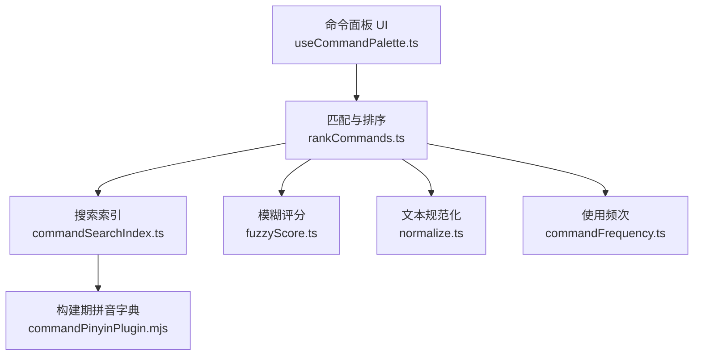
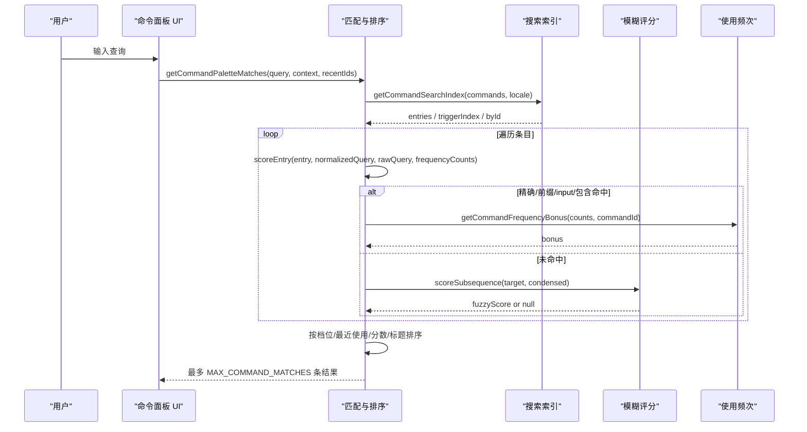
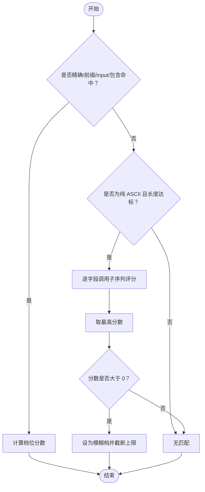
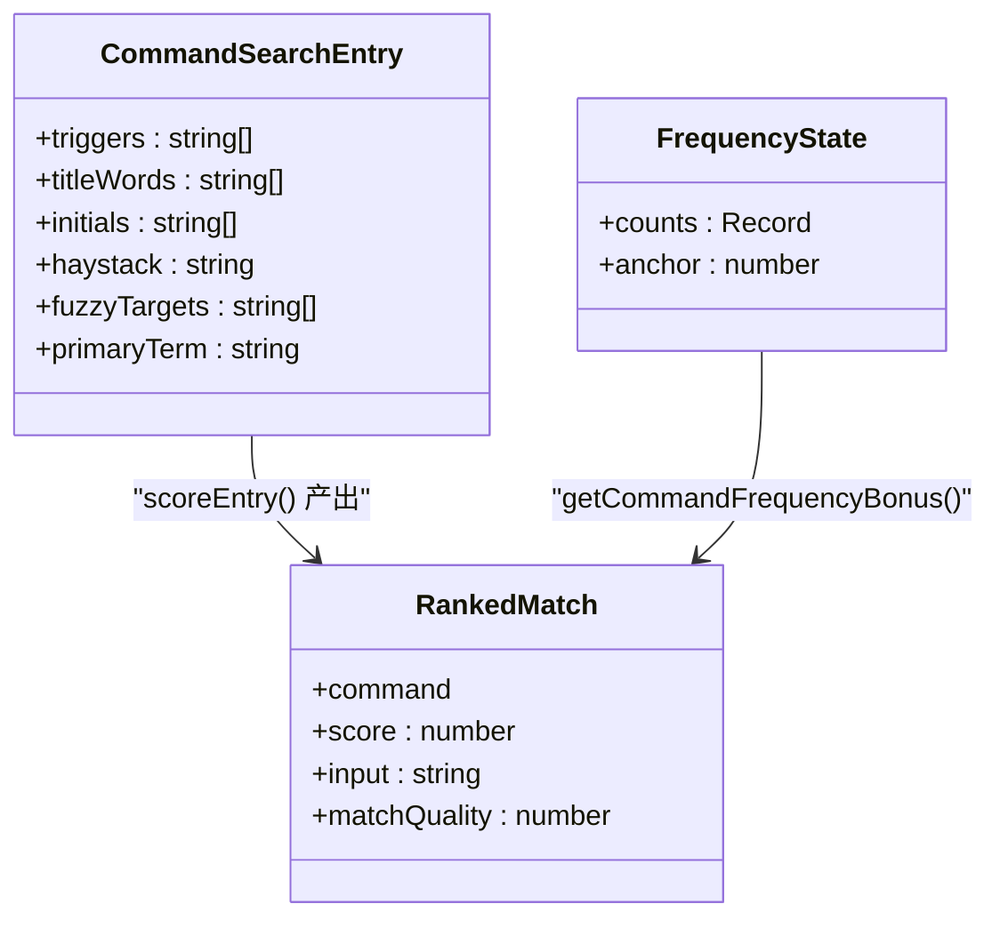
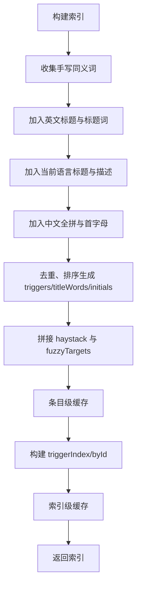
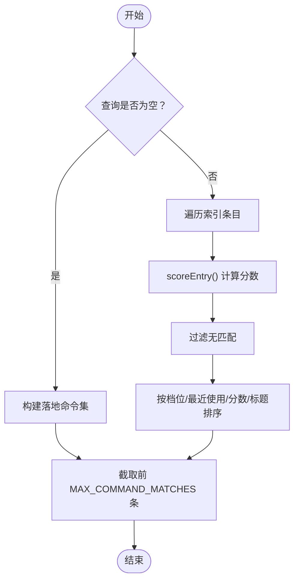
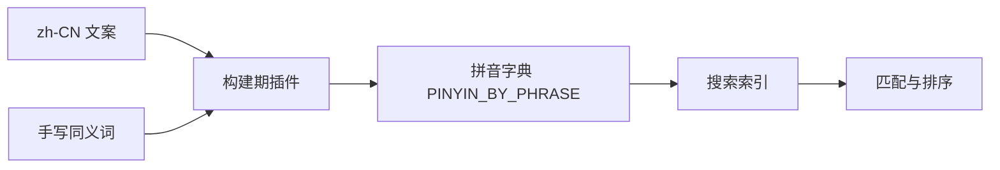
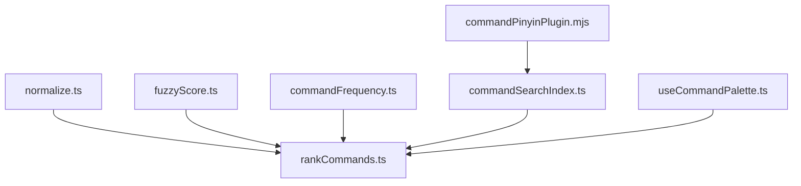

# 搜索与匹配

<cite>
**本文引用的文件**   
- [rankCommands.ts](file://src/components/command-palette/search/rankCommands.ts)
- [commandSearchIndex.ts](file://src/components/command-palette/search/commandSearchIndex.ts)
- [fuzzyScore.ts](file://src/components/command-palette/search/fuzzyScore.ts)
- [normalize.ts](file://src/components/command-palette/search/normalize.ts)
- [commandFrequency.ts](file://src/components/command-palette/commandFrequency.ts)
- [commandPinyinPlugin.mjs](file://dev/pinyin/commandPinyinPlugin.mjs)
- [useCommandPalette.ts](file://src/components/command-palette/useCommandPalette.ts)
- [commandRanking.test.ts](file://test/unit/command-palette/commandRanking.test.ts)
- [commandSearchIndex.test.ts](file://test/unit/command-palette/commandSearchIndex.test.ts)
- [commandPinyinDictionary.test.ts](file://test/unit/command-palette/commandPinyinDictionary.test.ts)
</cite>

## 目录
1. [引言](#引言)
2. [项目结构](#项目结构)
3. [核心组件](#核心组件)
4. [架构总览](#架构总览)
5. [详细组件分析](#详细组件分析)
6. [依赖关系分析](#依赖关系分析)
7. [性能考量](#性能考量)
8. [故障排查指南](#故障排查指南)
9. [结论](#结论)

## 引言
本文面向 Folia Major 的命令面板搜索与匹配系统，系统性说明其模糊搜索算法、相关性评分机制、搜索索引构建、结果排序策略、多语言支持以及性能优化实践。该系统以命令面板为核心入口，围绕“触发词 + 标题 + 描述 + 拼音 + 首字母 + 模糊子序列”的多通道检索模型，提供稳定、可预测且高性能的交互体验。

## 项目结构
命令搜索相关代码集中在命令面板模块中，按职责拆分为：
- 文本规范化与分词
- 搜索索引构建与缓存
- 匹配打分与排序
- 模糊子序列评分
- 使用频次统计
- 构建期拼音字典生成
- 命令面板 UI 集成

**图表来源**
- [useCommandPalette.ts:151-174](file://src/components/command-palette/useCommandPalette.ts#L151-L174)
- [rankCommands.ts:1-254](file://src/components/command-palette/search/rankCommands.ts#L1-L254)
- [commandSearchIndex.ts:1-287](file://src/components/command-palette/search/commandSearchIndex.ts#L1-L287)
- [fuzzyScore.ts:1-63](file://src/components/command-palette/search/fuzzyScore.ts#L1-L63)
- [normalize.ts:1-11](file://src/components/command-palette/search/normalize.ts#L1-L11)
- [commandFrequency.ts:1-149](file://src/components/command-palette/commandFrequency.ts#L1-L149)
- [commandPinyinPlugin.mjs:1-215](file://dev/pinyin/commandPinyinPlugin.mjs#L1-L215)

**章节来源**
- [useCommandPalette.ts:151-174](file://src/components/command-palette/useCommandPalette.ts#L151-L174)
- [rankCommands.ts:1-254](file://src/components/command-palette/search/rankCommands.ts#L1-L254)
- [commandSearchIndex.ts:1-287](file://src/components/command-palette/search/commandSearchIndex.ts#L1-L287)

## 核心组件
- 文本规范化与分词：统一小写、折叠空白、按空格切词，保证所有匹配路径输入一致。
- 搜索索引：将命令注册表预编译为触发词、标题词、拼音、首字母、语料和模糊目标集合，并提供 O(1) 触发词到命令的反查表。
- 匹配与排序：基于“精确 > 前缀 > input > 包含 > 模糊”的分档匹配，结合最近使用、使用频次与标题字典序进行综合排序。
- 模糊评分：对纯 ASCII 查询执行单趟子序列打分，奖励连续命中与边界命中，惩罚跳跃与过长语料。
- 使用频次：半衰期衰减 + 修剪，仅影响同档内排序，不跨档或覆盖最近使用优先级。
- 拼音字典：构建期扫描中文文案与手写同义词，生成短语到全拼与首字母的映射，运行时零额外体积。

**章节来源**
- [normalize.ts:1-11](file://src/components/command-palette/search/normalize.ts#L1-L11)
- [commandSearchIndex.ts:1-287](file://src/components/command-palette/search/commandSearchIndex.ts#L1-L287)
- [rankCommands.ts:1-254](file://src/components/command-palette/search/rankCommands.ts#L1-L254)
- [fuzzyScore.ts:1-63](file://src/components/command-palette/search/fuzzyScore.ts#L1-L63)
- [commandFrequency.ts:1-149](file://src/components/command-palette/commandFrequency.ts#L1-L149)
- [commandPinyinPlugin.mjs:1-215](file://dev/pinyin/commandPinyinPlugin.mjs#L1-L215)

## 架构总览
命令面板搜索的整体流程如下：

**图表来源**
- [useCommandPalette.ts:151-174](file://src/components/command-palette/useCommandPalette.ts#L151-L174)
- [rankCommands.ts:184-233](file://src/components/command-palette/search/rankCommands.ts#L184-L233)
- [commandSearchIndex.ts:252-287](file://src/components/command-palette/search/commandSearchIndex.ts#L252-L287)
- [fuzzyScore.ts:31-62](file://src/components/command-palette/search/fuzzyScore.ts#L31-L62)
- [commandFrequency.ts:137-148](file://src/components/command-palette/commandFrequency.ts#L137-L148)

## 详细组件分析

### 模糊搜索算法
- 分档匹配优先于模糊：系统先尝试精确、前缀、input（触发词后剩余输入）、包含四档；只有全部失败才进入模糊子序列匹配。
- 模糊匹配限制：
  - 仅对纯 ASCII 查询开放，CJK 查询要么子串命中，否则子序列容易噪声。
  - 最小长度阈值，避免短查询误判。
  - 逐字段打分取最高，禁止拼接长串导致“任意字母序列都成立”。
- 子序列评分：
  - 连续命中高权重，边界命中次之，普通命中最低。
  - 对跳跃距离和语料长度施加惩罚，最终分数需为正才保留。

**图表来源**
- [rankCommands.ts:86-176](file://src/components/command-palette/search/rankCommands.ts#L86-L176)
- [fuzzyScore.ts:31-62](file://src/components/command-palette/search/fuzzyScore.ts#L31-L62)

**章节来源**
- [rankCommands.ts:18-41](file://src/components/command-palette/search/rankCommands.ts#L18-L41)
- [rankCommands.ts:86-176](file://src/components/command-palette/search/rankCommands.ts#L86-L176)
- [fuzzyScore.ts:1-63](file://src/components/command-palette/search/fuzzyScore.ts#L1-L63)

### 相关性评分机制
- 档位质量：exact > prefix > input > contains > fuzzy。比较器首先比较档位，确保语义强匹配优先。
- 词条权重：
  - 触发词（手写同义词、同义词拼音、完整本地化标题）全额计分。
  - 标题机械切词走相同档位但扣分，避免“Panel: queue”等标题词压过同名命令。
  - 首字母匹配仅在查询长度至少为 2 时参与，且扣分较高。
  - 包含命中根据位置靠前加分。
- 频次加成：
  - 仅加在 score 上，作为比较器的第三键，不跨档也不覆盖最近使用。
  - 半衰期衰减 + 修剪，防止长期热门命令永久霸榜。
- 最近使用：
  - 空输入时优先展示最近使用与声明落地命令。
  - 有查询时，若任一候选在最近列表中出现，则按最近排名短路比较。

**图表来源**
- [commandSearchIndex.ts:32-72](file://src/components/command-palette/search/commandSearchIndex.ts#L32-L72)
- [rankCommands.ts:86-176](file://src/components/command-palette/search/rankCommands.ts#L86-L176)
- [commandFrequency.ts:27-38](file://src/components/command-palette/commandFrequency.ts#L27-L38)

**章节来源**
- [rankCommands.ts:18-41](file://src/components/command-palette/search/rankCommands.ts#L18-L41)
- [rankCommands.ts:104-176](file://src/components/command-palette/search/rankCommands.ts#L104-L176)
- [commandFrequency.ts:14-25](file://src/components/command-palette/commandFrequency.ts#L14-L25)
- [commandFrequency.ts:137-148](file://src/components/command-palette/commandFrequency.ts#L137-L148)

### 搜索索引构建
- 倒排索引：triggerIndex 将触发词映射到命令数组，O(1) 查找，用于空格转 pill 等高频操作。
- 分词处理：
  - 英文标题按空格切词，过滤短词与非法字符，形成 titleWords。
  - 中文文案通过构建期拼音字典生成 full pinyin 与 initials，加入 triggers、initials、haystack 与 fuzzyTargets。
- 缓存策略：
  - 条目级缓存：按命令对象 WeakMap 缓存，避免重复推导文本。
  - 索引级缓存：按命令数组身份与语言维度缓存，可用集不变时复用。
  - 失效条件：命令数组实例变化或界面语言变化。

**图表来源**
- [commandSearchIndex.ts:101-186](file://src/components/command-palette/search/commandSearchIndex.ts#L101-L186)
- [commandSearchIndex.ts:202-287](file://src/components/command-palette/search/commandSearchIndex.ts#L202-L287)

**章节来源**
- [commandSearchIndex.ts:1-287](file://src/components/command-palette/search/commandSearchIndex.ts#L1-L287)

### 结果排序算法
- 综合评分：档位质量为主键，最近使用为第二键，分数与标题字典序为第三键。
- 去重机制：
  - 空输入时通过已取集合去重，优先最近使用与声明落地命令，再补齐其余命令。
  - 触发词与标题词去重，避免重复计分。
- 分页处理：
  - 命令面板固定返回最多 10 条结果，保证 UI 响应与内存占用可控。
  - 设置侧栏搜索不使用模糊档且不截断，返回全集用于“哪些设置命令认得这个词”的场景。

**图表来源**
- [rankCommands.ts:49-72](file://src/components/command-palette/search/rankCommands.ts#L49-L72)
- [rankCommands.ts:184-226](file://src/components/command-palette/search/rankCommands.ts#L184-L226)
- [rankCommands.ts:228-253](file://src/components/command-palette/search/rankCommands.ts#L228-L253)

**章节来源**
- [rankCommands.ts:49-72](file://src/components/command-palette/search/rankCommands.ts#L49-L72)
- [rankCommands.ts:184-226](file://src/components/command-palette/search/rankCommands.ts#L184-L226)
- [rankCommands.ts:228-253](file://src/components/command-palette/search/rankCommands.ts#L228-L253)

### 多语言搜索支持
- 中文分词与拼音：
  - 构建期扫描 zh-CN 文案与手写同义词，生成短语到全拼与首字母的映射。
  - 运行时通过虚拟模块引入拼音字典，零额外体积。
- 拼音搜索：
  - 中文标题与描述的 full pinyin 与 initials 均参与索引。
  - 首字母匹配要求查询长度至少为 2，避免两三个字母的高碰撞率。
- 同义词扩展：
  - 手写同义词作为 triggers 全额计分，同时派生拼音与首字母。
  - 标题机械切词走扣分档，避免标题词与同义词打平导致错误排序。

**图表来源**
- [commandPinyinPlugin.mjs:146-178](file://dev/pinyin/commandPinyinPlugin.mjs#L146-L178)
- [commandSearchIndex.ts:88-99](file://src/components/command-palette/search/commandSearchIndex.ts#L88-L99)
- [commandSearchIndex.ts:142-152](file://src/components/command-palette/search/commandSearchIndex.ts#L142-L152)

**章节来源**
- [commandPinyinPlugin.mjs:1-215](file://dev/pinyin/commandPinyinPlugin.mjs#L1-L215)
- [commandSearchIndex.ts:88-99](file://src/components/command-palette/search/commandSearchIndex.ts#L88-L99)
- [commandSearchIndex.ts:142-152](file://src/components/command-palette/search/commandSearchIndex.ts#L142-L152)

### 搜索日志分析与用户体验优化
- 最近使用与落地命令：
  - 空输入时优先展示最近使用与声明落地命令，提升常用命令可见性。
  - 有查询时，最近使用命令在比较器中短路，保证高频命令始终靠前。
- 输入解析优化：
  - input 档切片按词数而非字符偏移，避免折叠空白导致的偏移错误。
  - 保留用户原始大小写，提升可读性与一致性。
- 稳定性保障：
  - 测试覆盖 input 档切片、拼音字典完整性、索引条目复用与语言隔离等关键行为。

**章节来源**
- [rankCommands.ts:49-84](file://src/components/command-palette/search/rankCommands.ts#L49-L84)
- [commandRanking.test.ts:53-78](file://test/unit/command-palette/commandRanking.test.ts#L53-L78)
- [commandSearchIndex.test.ts:138-157](file://test/unit/command-palette/commandSearchIndex.test.ts#L138-L157)
- [commandPinyinDictionary.test.ts:28-86](file://test/unit/command-palette/commandPinyinDictionary.test.ts#L28-L86)

## 依赖关系分析
- 模块耦合：
  - rankCommands.ts 依赖 normalize.ts、fuzzyScore.ts、commandSearchIndex.ts、commandFrequency.ts。
  - commandSearchIndex.ts 依赖 normalize.ts 与构建期拼音字典。
  - useCommandPalette.ts 调用 rankCommands.ts 公开接口。
- 外部依赖：
  - 拼音字典通过 Vite 虚拟模块注入，构建期生成，运行时零体积。
  - i18n 文案按语言加载，索引构建时区分 en、zh-CN、in。

**图表来源**
- [rankCommands.ts:1-7](file://src/components/command-palette/search/rankCommands.ts#L1-L7)
- [commandSearchIndex.ts:1-6](file://src/components/command-palette/search/commandSearchIndex.ts#L1-L6)
- [commandPinyinPlugin.mjs:1-28](file://dev/pinyin/commandPinyinPlugin.mjs#L1-L28)
- [useCommandPalette.ts:151-174](file://src/components/command-palette/useCommandPalette.ts#L151-L174)

**章节来源**
- [rankCommands.ts:1-7](file://src/components/command-palette/search/rankCommands.ts#L1-L7)
- [commandSearchIndex.ts:1-6](file://src/components/command-palette/search/commandSearchIndex.ts#L1-L6)
- [commandPinyinPlugin.mjs:1-28](file://dev/pinyin/commandPinyinPlugin.mjs#L1-L28)
- [useCommandPalette.ts:151-174](file://src/components/command-palette/useCommandPalette.ts#L151-L174)

## 性能考量
- 增量更新：
  - 条目级缓存避免重复推导文本；索引级缓存避免重复装配查找表。
  - 可用集变化频率低，主要发生在导航切换与设置开关处。
- 懒加载：
  - 拼音字典构建期生成，运行时按需导入虚拟模块。
  - 模糊评分仅在四档全部失败时触发，减少不必要的子序列扫描。
- 内存管理：
  - 使用 WeakMap 存储条目缓存与索引缓存，随命令数组生命周期回收。
  - 使用频次状态惰性衰减与修剪，控制 localStorage 体积。
- 时间复杂度：
  - 索引构建 O(N) 遍历命令与词条。
  - 匹配阶段 O(M) 遍历条目，模糊评分为单趟扫描，避免中间数组分配。

**章节来源**
- [commandSearchIndex.ts:188-287](file://src/components/command-palette/search/commandSearchIndex.ts#L188-L287)
- [fuzzyScore.ts:1-63](file://src/components/command-palette/search/fuzzyScore.ts#L1-L63)
- [commandFrequency.ts:84-114](file://src/components/command-palette/commandFrequency.ts#L84-L114)

## 故障排查指南
- 中文拼音缺失：
  - 检查构建期插件是否正确扫描 zh-CN 文案与手写同义词。
  - 验证拼音字典完整性测试是否通过。
- 匹配结果异常：
  - 确认文本规范化函数是否统一，避免不同模块漂移。
  - 检查 input 档切片逻辑是否按词数而非字符偏移。
- 索引性能问题：
  - 确认条目缓存与索引缓存是否生效，避免重复构建。
  - 检查可用集变化是否频繁，必要时合并变更批次。
- 使用频次异常：
  - 验证半衰期衰减与修剪逻辑是否按预期运行。
  - 检查 localStorage 读写是否被拦截或损坏。

**章节来源**
- [commandPinyinDictionary.test.ts:28-86](file://test/unit/command-palette/commandPinyinDictionary.test.ts#L28-L86)
- [normalize.ts:1-11](file://src/components/command-palette/search/normalize.ts#L1-L11)
- [commandRanking.test.ts:53-78](file://test/unit/command-palette/commandRanking.test.ts#L53-L78)
- [commandSearchIndex.test.ts:138-157](file://test/unit/command-palette/commandSearchIndex.test.ts#L138-L157)
- [commandFrequency.ts:84-114](file://src/components/command-palette/commandFrequency.ts#L84-L114)

## 结论
Folia Major 的命令搜索与匹配系统通过分层匹配、精细化评分、高效索引与稳健缓存，实现了高可用、高性能且用户体验友好的命令检索能力。其设计兼顾了多语言支持与模糊搜索的实用性，同时在性能与内存管理方面采取了多项优化措施。未来可在保持现有语义的前提下，进一步扩展同义词库与多语言分词策略，以适配更广泛的搜索场景。