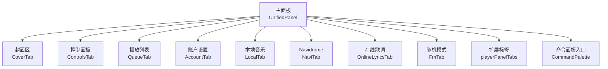
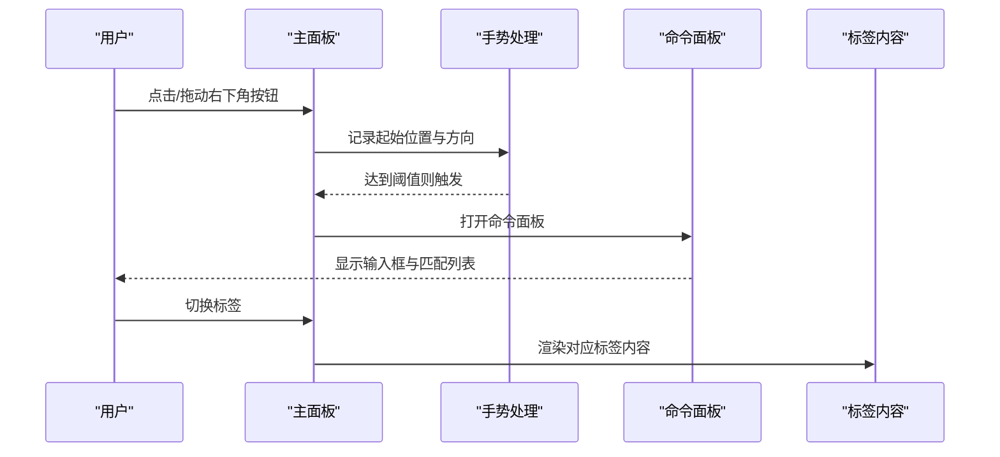
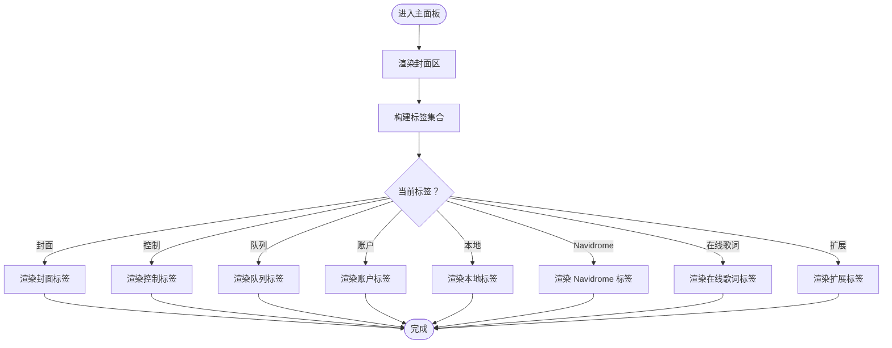
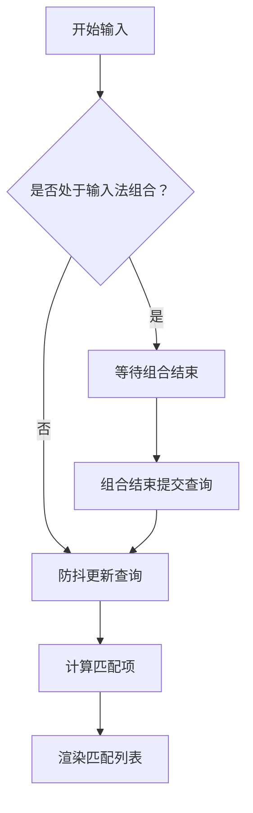
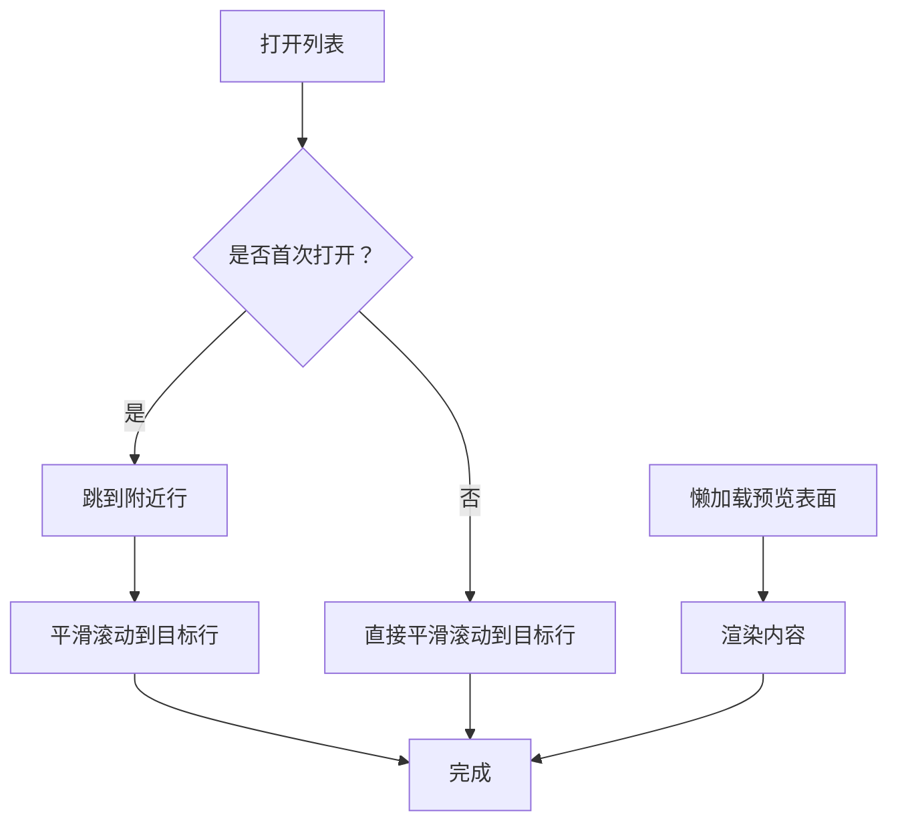
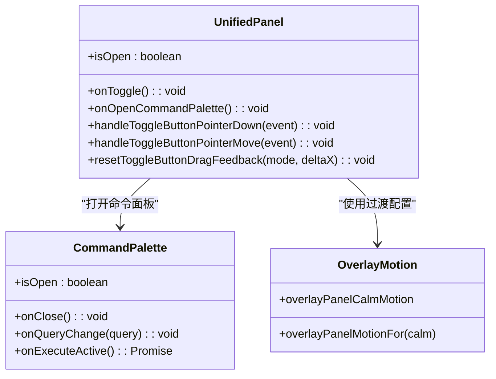
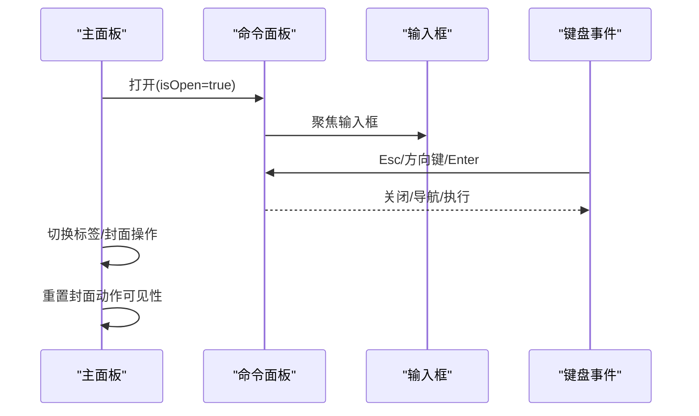
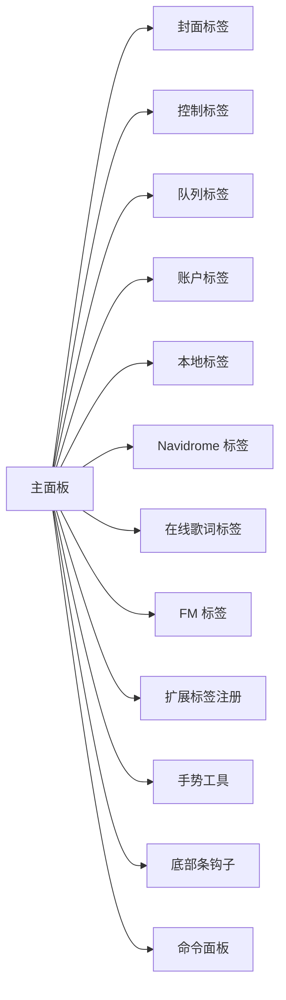

# 主面板组件

<cite>
**本文引用的文件**   
- [src/components/UnifiedPanel.tsx](file://src/components/UnifiedPanel.tsx)
- [src/utils/panelSlideGesture.ts](file://src/utils/panelSlideGesture.ts)
- [src/hooks/usePlayerBottomBarBottomPx.ts](file://src/hooks/usePlayerBottomBarBottomPx.ts)
- [src/components/panelTab/CoverTab.tsx](file://src/components/panelTab/CoverTab.tsx)
- [src/components/panelTab/ControlsTab.tsx](file://src/components/panelTab/ControlsTab.tsx)
- [src/components/panelTab/QueueTab.tsx](file://src/components/panelTab/QueueTab.tsx)
- [src/components/panelTab/AccountTab.tsx](file://src/components/panelTab/AccountTab.tsx)
- [src/components/panelTab/LocalTab.tsx](file://src/components/panelTab/LocalTab.tsx)
- [src/components/panelTab/FmTab.tsx](file://src/components/panelTab/FmTab.tsx)
- [src/components/panelTab/NaviTab.tsx](file://src/components/panelTab/NaviTab.tsx)
- [src/components/panelTab/OnlineLyricsTab.tsx](file://src/components/panelTab/OnlineLyricsTab.tsx)
- [src/mods/folium/registries/playerPanelTabs.ts](file://src/mods/folium/registries/playerPanelTabs.ts)
- [src/components/command-palette/CommandPalette.tsx](file://src/components/command-palette/CommandPalette.tsx)
- [src/components/shared/SidePanelList.tsx](file://src/components/shared/SidePanelList.tsx)
- [src/components/shared/overlayEntranceMotion.ts](file://src/components/shared/overlayEntranceMotion.ts)
</cite>

## 目录
1. [简介](#简介)
2. [项目结构](#项目结构)
3. [核心组件](#核心组件)
4. [架构总览](#架构总览)
5. [详细组件分析](#详细组件分析)
6. [依赖关系分析](#依赖关系分析)
7. [性能考量](#性能考量)
8. [故障排查指南](#故障排查指南)
9. [结论](#结论)

## 简介
本文件围绕“主面板组件”进行系统化文档化，覆盖以下关键主题：
- 面板布局结构：头部封面区、标签切换区、内容区与底部区域组织。
- 输入处理：文本输入、输入法（IME）支持、防抖机制以及与命令面板的联动。
- 结果展示：虚拟滚动、懒加载与性能优化策略。
- 动画系统：过渡效果、缓动函数与硬件加速使用。
- 状态管理：打开关闭、焦点控制、事件处理与手势交互。
- 主题适配与国际化：明暗主题、主题色驱动与多语言文案。

## 项目结构
主面板由一个聚合型容器组件承载，内部按“封面区 + 标签栏 + 标签内容区”三段式组织，并通过外部注入的 Tab 子组件渲染不同业务页面。同时，右下角提供可拖拽滑动的触发按钮，支持从面板边缘滑动打开命令面板。

图表来源
- [src/components/UnifiedPanel.tsx:268-286](file://src/components/UnifiedPanel.tsx#L268-L286)
- [src/components/UnifiedPanel.tsx:756-950](file://src/components/UnifiedPanel.tsx#L756-L950)
- [src/components/command-palette/CommandPalette.tsx:381-597](file://src/components/command-palette/CommandPalette.tsx#L381-L597)

章节来源
- [src/components/UnifiedPanel.tsx:143-286](file://src/components/UnifiedPanel.tsx#L143-L286)
- [src/components/UnifiedPanel.tsx:756-950](file://src/components/UnifiedPanel.tsx#L756-L950)

## 核心组件
- 主面板容器：负责整体布局、主题变量、标签集合构建、手势与动画、以及各 Tab 的挂载与参数传递。
- 标签页子组件：每个业务域以独立 Tab 组件实现，如封面、控制、队列、账户、本地、Navidrome、在线歌词、FM 等。
- 命令面板：全屏命令输入与执行界面，支持语法提示、组合输入、键盘导航与内联预览。
- 通用侧边列表：在需要长列表时提供虚拟滚动与聚焦滚动行为。

章节来源
- [src/components/UnifiedPanel.tsx:143-286](file://src/components/UnifiedPanel.tsx#L143-L286)
- [src/components/command-palette/CommandPalette.tsx:87-111](file://src/components/command-palette/CommandPalette.tsx#L87-L111)
- [src/components/shared/SidePanelList.tsx:64-88](file://src/components/shared/SidePanelList.tsx#L64-L88)

## 架构总览
主面板通过 props 接收播放、队列、库与账户相关能力，并在内部根据当前歌曲来源动态决定显示哪些标签。面板右侧提供可拖拽的触发按钮，支持水平滑动打开命令面板；面板主体采用毛玻璃背景与圆角卡片样式，配合 framer-motion 完成开合动画。

图表来源
- [src/components/UnifiedPanel.tsx:492-524](file://src/components/UnifiedPanel.tsx#L492-L524)
- [src/components/UnifiedPanel.tsx:958-1049](file://src/components/UnifiedPanel.tsx#L958-L1049)
- [src/components/command-palette/CommandPalette.tsx:381-597](file://src/components/command-palette/CommandPalette.tsx#L381-L597)

## 详细组件分析

### 布局结构与区域划分
- 顶部封面区：展示专辑封面或占位图标，支持悬停/触摸显示四角操作按钮（设置、返回主页、透明背景开关、加入歌单）。
- 中部标签栏：横向标签切换，包含封面、控制、队列、账户等固定标签，并根据歌曲来源插入本地、Navidrome、在线歌词等标签；还支持扩展标签注册。
- 内容区：根据当前标签渲染对应子组件，并传入必要的回调与状态。
- 底部区域：由面板高度与播放器底部条位置共同决定，确保面板不遮挡底部控件。

图表来源
- [src/components/UnifiedPanel.tsx:268-286](file://src/components/UnifiedPanel.tsx#L268-L286)
- [src/components/UnifiedPanel.tsx:756-950](file://src/components/UnifiedPanel.tsx#L756-L950)

章节来源
- [src/components/UnifiedPanel.tsx:618-754](file://src/components/UnifiedPanel.tsx#L618-L754)
- [src/components/UnifiedPanel.tsx:756-950](file://src/components/UnifiedPanel.tsx#L756-L950)

### 输入处理：文本输入、输入法支持与防抖
- 命令面板输入：
  - 提供统一输入框，支持 IME 组合输入（compositionstart/compositionend），避免在中文输入过程中误触发搜索与执行。
  - 支持语法提示（如 `--` 标志补全），并提供内联预览与键盘导航。
  - 防抖机制：查询变更走防抖流程，但语法补全与预览使用实时数据，保证体验流畅。
- 主面板触发命令面板：
  - 通过右下角按钮的水平滑动触发，具备阈值判定与视觉反馈（轨道填充、目标图标旋转与缩放）。
  - 支持鼠标悬停引导线与触摸热点提示，提升可发现性。

图表来源
- [src/components/command-palette/CommandPalette.tsx:181-210](file://src/components/command-palette/CommandPalette.tsx#L181-L210)
- [src/components/command-palette/CommandPalette.tsx:271-357](file://src/components/command-palette/CommandPalette.tsx#L271-L357)
- [src/components/UnifiedPanel.tsx:492-524](file://src/components/UnifiedPanel.tsx#L492-L524)

章节来源
- [src/components/command-palette/CommandPalette.tsx:181-210](file://src/components/command-palette/CommandPalette.tsx#L181-L210)
- [src/components/command-palette/CommandPalette.tsx:271-357](file://src/components/command-palette/CommandPalette.tsx#L271-L357)
- [src/components/UnifiedPanel.tsx:492-524](file://src/components/UnifiedPanel.tsx#L492-L524)

### 结果展示：虚拟滚动、懒加载与性能优化
- 虚拟滚动：
  - 侧边列表组件在打开或焦点变化时平滑滚动到目标行，首次打开采用“先跳后滚”的两段式滚动，减少抖动。
  - 对后续滚动更新进行延迟处理，避免频繁重排。
- 懒加载：
  - 命令面板的预览表面使用 React.lazy 与 Suspense，按需加载复杂 UI，降低首屏开销。
- 性能优化：
  - 列表项渲染最小化依赖，避免不必要的重渲染。
  - 使用稳定的 WeakMap 缓存 lazy 组件引用，减少重复创建成本。

图表来源
- [src/components/shared/SidePanelList.tsx:64-88](file://src/components/shared/SidePanelList.tsx#L64-L88)
- [src/components/command-palette/CommandPalette.tsx:51-67](file://src/components/command-palette/CommandPalette.tsx#L51-L67)
- [src/components/command-palette/CommandPalette.tsx:507-513](file://src/components/command-palette/CommandPalette.tsx#L507-L513)

章节来源
- [src/components/shared/SidePanelList.tsx:64-88](file://src/components/shared/SidePanelList.tsx#L64-L88)
- [src/components/command-palette/CommandPalette.tsx:51-67](file://src/components/command-palette/CommandPalette.tsx#L51-L67)
- [src/components/command-palette/CommandPalette.tsx:507-513](file://src/components/command-palette/CommandPalette.tsx#L507-L513)

### 动画系统：过渡效果、缓动函数与硬件加速
- 面板开合：
  - 使用 framer-motion 的 initial/animate/exit 配置，配合 scale 与 opacity 过渡，呈现弹出与收起效果。
- 触发按钮与滑动轨道：
  - 拖动过程中实时更新按钮位移、亮度、阴影与轨道填充宽度；达到阈值后触发命令面板，并以弹性缓动曲线完成退出动画。
- 硬件加速：
  - 大量使用 transform 与 opacity 属性，利于 GPU 合成，减少重排与重绘。
- 微动效开关：
  - 通过 overlayEntranceMotion 提供“安静模式”下的纯淡入淡出降级方案，满足无障碍与性能优先场景。

图表来源
- [src/components/UnifiedPanel.tsx:397-491](file://src/components/UnifiedPanel.tsx#L397-L491)
- [src/components/UnifiedPanel.tsx:618-634](file://src/components/UnifiedPanel.tsx#L618-L634)
- [src/components/shared/overlayEntranceMotion.ts:35-47](file://src/components/shared/overlayEntranceMotion.ts#L35-L47)

章节来源
- [src/components/UnifiedPanel.tsx:397-491](file://src/components/UnifiedPanel.tsx#L397-L491)
- [src/components/UnifiedPanel.tsx:618-634](file://src/components/UnifiedPanel.tsx#L618-L634)
- [src/components/shared/overlayEntranceMotion.ts:35-47](file://src/components/shared/overlayEntranceMotion.ts#L35-L47)

### 状态管理：打开关闭、焦点控制与事件处理
- 打开关闭：
  - 主面板通过 isOpen 控制显隐；命令面板同样受 isOpen 控制，并在打开时自动聚焦输入框。
- 焦点控制：
  - 命令面板在打开后主动 focus 输入框；在 iOS Safari 上为避免滚动问题，会在动画完成后主动 blur 再恢复。
  - 标签切换与封面操作会重置封面动作可见性，避免状态残留。
- 事件处理：
  - 键盘事件：Esc 关闭、方向键导航、Enter 执行、Backspace 清空并回退到命令词。
  - 指针事件：拖动触发命令面板，支持 touch/mouse 双端；悬停显示引导线，触摸热点延时隐藏。

图表来源
- [src/components/command-palette/CommandPalette.tsx:234-248](file://src/components/command-palette/CommandPalette.tsx#L234-L248)
- [src/components/command-palette/CommandPalette.tsx:271-357](file://src/components/command-palette/CommandPalette.tsx#L271-L357)
- [src/components/UnifiedPanel.tsx:582-596](file://src/components/UnifiedPanel.tsx#L582-L596)

章节来源
- [src/components/command-palette/CommandPalette.tsx:234-248](file://src/components/command-palette/CommandPalette.tsx#L234-L248)
- [src/components/command-palette/CommandPalette.tsx:271-357](file://src/components/command-palette/CommandPalette.tsx#L271-L357)
- [src/components/UnifiedPanel.tsx:582-596](file://src/components/UnifiedPanel.tsx#L582-L596)

### 主题适配与国际化
- 主题适配：
  - 根据明暗模式选择毛玻璃背景、边框颜色与高亮色；主题色用于强调元素与进度轨道填充。
  - 封面区与标签栏的背景与文字颜色随主题切换，保证可读性与一致性。
- 国际化：
  - 所有文案通过 i18n 的 t() 函数获取，包括标签名、按钮标题、空态提示与错误原因。
  - 命令面板的分组标签、占位符与帮助文案均支持多语言。

章节来源
- [src/components/UnifiedPanel.tsx:303-315](file://src/components/UnifiedPanel.tsx#L303-L315)
- [src/components/UnifiedPanel.tsx:268-286](file://src/components/UnifiedPanel.tsx#L268-L286)
- [src/components/command-palette/CommandPalette.tsx:112-130](file://src/components/command-palette/CommandPalette.tsx#L112-L130)

## 依赖关系分析
主面板依赖多个子组件与工具模块，形成清晰的职责边界：
- 子组件依赖：
  - 封面、控制、队列、账户、本地、Navidrome、在线歌词、FM 等标签页。
  - 扩展标签通过 registries.playerPanelTabs 注册，支持插件化扩展。
- 工具与钩子：
  - 手势常量来自 panelSlideGesture，用于阈值与轨迹长度。
  - 底部条位置通过 usePlayerBottomBarBottomPx 计算，确保面板定位准确。
- 命令面板：
  - 作为独立全屏输入层，与主面板通过回调解耦。

图表来源
- [src/components/UnifiedPanel.tsx:268-286](file://src/components/UnifiedPanel.tsx#L268-L286)
- [src/components/UnifiedPanel.tsx:21-25](file://src/components/UnifiedPanel.tsx#L21-L25)
- [src/components/UnifiedPanel.tsx:492-524](file://src/components/UnifiedPanel.tsx#L492-L524)

章节来源
- [src/components/UnifiedPanel.tsx:21-25](file://src/components/UnifiedPanel.tsx#L21-L25)
- [src/components/UnifiedPanel.tsx:268-286](file://src/components/UnifiedPanel.tsx#L268-L286)
- [src/components/UnifiedPanel.tsx:492-524](file://src/components/UnifiedPanel.tsx#L492-L524)

## 性能考量
- 动画性能：
  - 主要使用 transform 与 opacity，避免触发布局抖动；缓动曲线选用 easeOut 与弹性曲线，兼顾流畅与自然。
- 渲染优化：
  - 命令面板预览表面懒加载，减少首屏体积；列表滚动采用两段式策略，降低初始渲染压力。
- 交互优化：
  - 手势阈值与阻尼控制，避免误触发；悬停与触摸热点分别优化，提升可发现性与易用性。
- 主题与资源：
  - 根据主题动态选择背景与颜色，避免昂贵的运行时计算；图片加载使用异步解码与尺寸优化。

[本节为通用指导，无需具体文件引用]

## 故障排查指南
- 面板无法打开：
  - 检查 isOpen 状态与 onToggle 回调是否正确绑定。
  - 确认右下角按钮未被其他元素遮挡或禁用。
- 命令面板输入无响应：
  - 检查 IME 组合状态，避免在 composition 期间执行逻辑。
  - 确认防抖未过长导致输入滞后。
- 列表滚动异常：
  - 检查虚拟列表 ref 是否存在，滚动目标索引是否有效。
  - 首次打开时观察两段式滚动是否生效。
- 动画卡顿：
  - 检查是否大量使用 layout 属性（width/height/top/left），尽量改用 transform。
  - 确认微动效开关是否被意外关闭。

章节来源
- [src/components/command-palette/CommandPalette.tsx:271-357](file://src/components/command-palette/CommandPalette.tsx#L271-L357)
- [src/components/shared/SidePanelList.tsx:64-88](file://src/components/shared/SidePanelList.tsx#L64-L88)
- [src/components/UnifiedPanel.tsx:397-491](file://src/components/UnifiedPanel.tsx#L397-L491)

## 结论
主面板组件通过清晰的布局分层、完善的输入与手势处理、高效的虚拟滚动与懒加载、以及丰富的动画与主题支持，提供了稳定且易用的播放控制与信息展示入口。其模块化设计便于扩展与维护，适合在不同设备与主题环境下保持一致的用户体验。