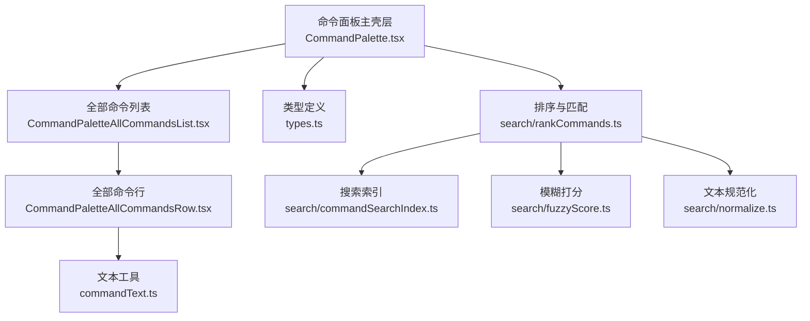
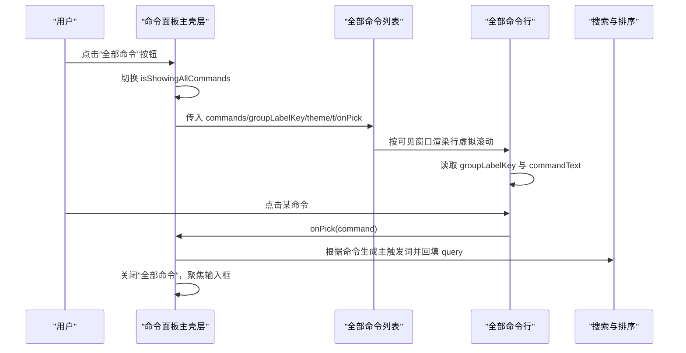
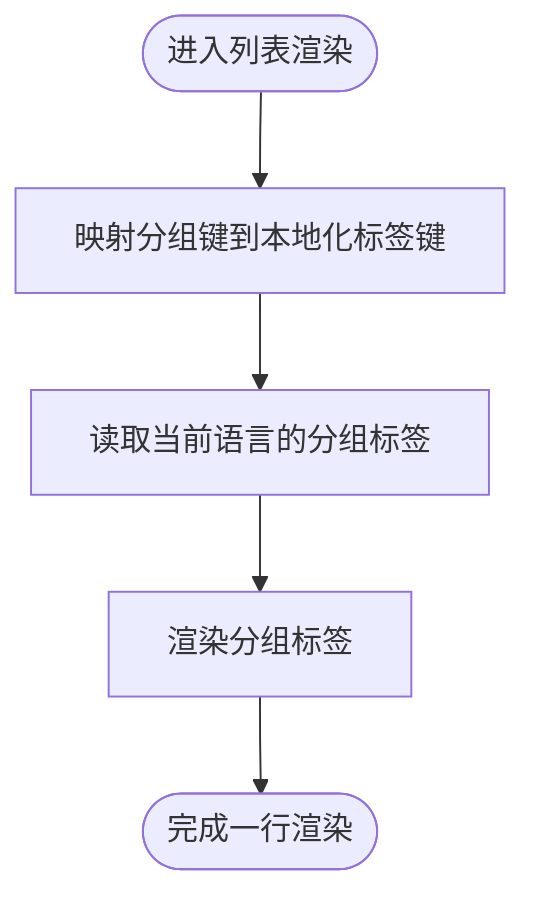
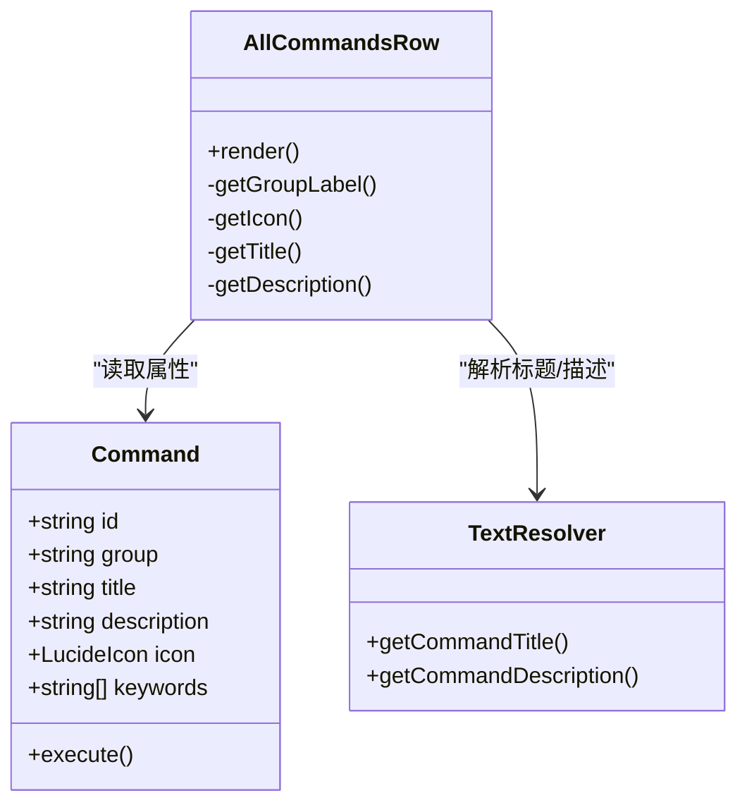
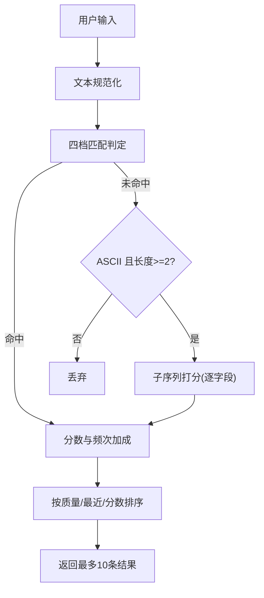
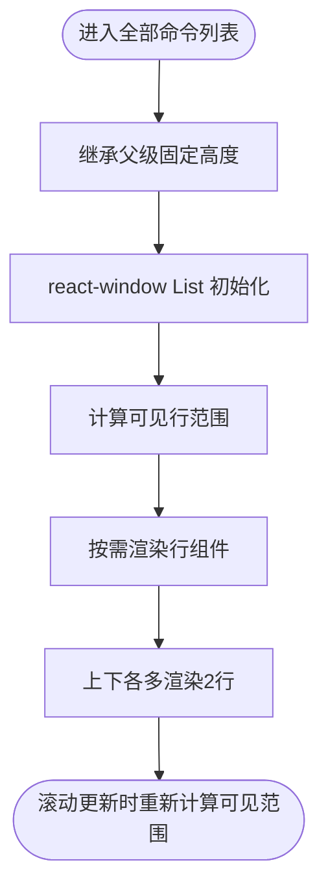
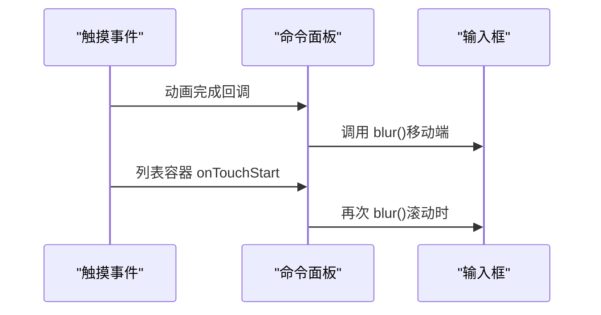
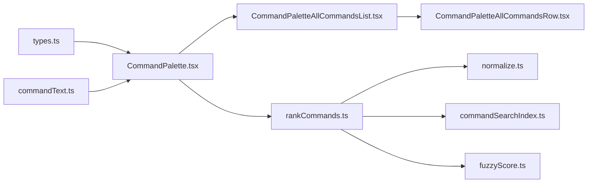
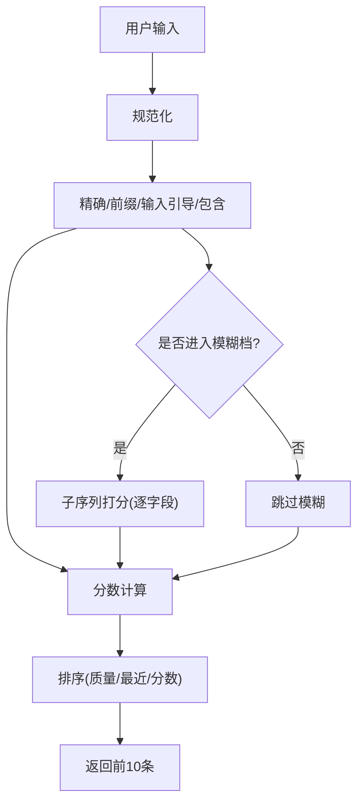

# 全部命令列表

<cite>
**本文引用的文件**   
- [CommandPalette.tsx](file://src/components/command-palette/CommandPalette.tsx)
- [CommandPaletteAllCommandsList.tsx](file://src/components/command-palette/CommandPaletteAllCommandsList.tsx)
- [CommandPaletteAllCommandsRow.tsx](file://src/components/command-palette/CommandPaletteAllCommandsRow.tsx)
- [types.ts](file://src/components/command-palette/types.ts)
- [commandText.ts](file://src/components/command-palette/commandText.ts)
- [commandSearchIndex.ts](file://src/components/command-palette/search/commandSearchIndex.ts)
- [rankCommands.ts](file://src/components/command-palette/search/rankCommands.ts)
- [fuzzyScore.ts](file://src/components/command-palette/search/fuzzyScore.ts)
- [normalize.ts](file://src/components/command-palette/search/normalize.ts)
</cite>

## 目录
1. [引言](#引言)
2. [项目结构](#项目结构)
3. [核心组件](#核心组件)
4. [架构总览](#架构总览)
5. [详细组件分析](#详细组件分析)
6. [依赖关系分析](#依赖关系分析)
7. [性能与虚拟化](#性能与虚拟化)
8. [搜索与过滤](#搜索与过滤)
9. [响应式与触摸支持](#响应式与触摸支持)
10. [故障排查](#故障排查)
11. [结论](#结论)

## 引言
本文件面向“全部命令列表”这一命令面板子视图，系统性说明其分组显示、命令行渲染、搜索过滤、虚拟化技术、响应式布局与触摸手势支持。该能力由命令面板主壳层与“全部命令”专用列表及行组件共同实现，并复用命令注册表、文本解析、搜索索引与排序模块。

## 项目结构
“全部命令列表”位于命令面板组件目录下，关键文件如下：
- 命令面板主壳层：负责输入、键盘交互、模式切换、内联预览与“全部命令”入口。
- “全部命令”列表：基于 react-window 的虚拟滚动列表。
- “全部命令”行：固定高度的单行渲染，展示图标、标题、分组标签与描述。
- 类型定义：命令分组、上下文、命令元数据等契约。
- 文本工具：从 i18n 或运行时解析命令标题与描述。
- 搜索子系统：索引构建、规范化、模糊打分与排序。

**图表来源**
- [CommandPalette.tsx:69-77](file://src/components/command-palette/CommandPalette.tsx#L69-L77)
- [CommandPaletteAllCommandsList.tsx:1-79](file://src/components/command-palette/CommandPaletteAllCommandsList.tsx#L1-L79)
- [CommandPaletteAllCommandsRow.tsx:1-77](file://src/components/command-palette/CommandPaletteAllCommandsRow.tsx#L1-L77)
- [types.ts:28-84](file://src/components/command-palette/types.ts#L28-L84)
- [commandText.ts:1-19](file://src/components/command-palette/commandText.ts#L1-L19)
- [commandSearchIndex.ts:1-287](file://src/components/command-palette/search/commandSearchIndex.ts#L1-L287)
- [rankCommands.ts:1-254](file://src/components/command-palette/search/rankCommands.ts#L1-L254)
- [fuzzyScore.ts:1-63](file://src/components/command-palette/search/fuzzyScore.ts#L1-L63)
- [normalize.ts:1-11](file://src/components/command-palette/search/normalize.ts#L1-L11)

**章节来源**
- [CommandPalette.tsx:69-77](file://src/components/command-palette/CommandPalette.tsx#L69-L77)
- [CommandPaletteAllCommandsList.tsx:1-79](file://src/components/command-palette/CommandPaletteAllCommandsList.tsx#L1-L79)
- [CommandPaletteAllCommandsRow.tsx:1-77](file://src/components/command-palette/CommandPaletteAllCommandsRow.tsx#L1-L77)
- [types.ts:28-84](file://src/components/command-palette/types.ts#L28-L84)
- [commandText.ts:1-19](file://src/components/command-palette/commandText.ts#L1-L19)
- [commandSearchIndex.ts:1-287](file://src/components/command-palette/search/commandSearchIndex.ts#L1-L287)
- [rankCommands.ts:1-254](file://src/components/command-palette/search/rankCommands.ts#L1-L254)
- [fuzzyScore.ts:1-63](file://src/components/command-palette/search/fuzzyScore.ts#L1-L63)
- [normalize.ts:1-11](file://src/components/command-palette/search/normalize.ts#L1-L11)

## 核心组件
- 命令面板主壳层：提供输入框、语法提示、内联预览、键盘导航、打开“全部命令”入口，以及将用户点击的命令回填到搜索框。
- “全部命令”列表：使用 react-window 的 List 进行虚拟滚动，固定行高，避免尺寸测量对面板高度契约的影响。
- “全部命令”行：固定高度行，展示命令图标、标题、分组标签与描述；点击后回填命令的主触发词并回到搜索视图。
- 类型与文本：统一命令分组、上下文与文本解析方式，保证 UI 文案与行为一致。
- 搜索子系统：为“全部命令”和搜索结果提供一致的检索语义（精确、前缀、包含、子序列模糊）与拼音能力。

**章节来源**
- [CommandPalette.tsx:87-602](file://src/components/command-palette/CommandPalette.tsx#L87-L602)
- [CommandPaletteAllCommandsList.tsx:17-79](file://src/components/command-palette/CommandPaletteAllCommandsList.tsx#L17-L79)
- [CommandPaletteAllCommandsRow.tsx:18-77](file://src/components/command-palette/CommandPaletteAllCommandsRow.tsx#L18-L77)
- [types.ts:28-84](file://src/components/command-palette/types.ts#L28-L84)
- [commandText.ts:1-19](file://src/components/command-palette/commandText.ts#L1-L19)

## 架构总览
“全部命令列表”并非独立应用，而是命令面板的一个可切换视图。其控制流如下：

**图表来源**
- [CommandPalette.tsx:453-506](file://src/components/command-palette/CommandPalette.tsx#L453-L506)
- [CommandPaletteAllCommandsList.tsx:49-74](file://src/components/command-palette/CommandPaletteAllCommandsList.tsx#L49-L74)
- [CommandPaletteAllCommandsRow.tsx:44-72](file://src/components/command-palette/CommandPaletteAllCommandsRow.tsx#L44-L72)
- [commandText.ts:8-18](file://src/components/command-palette/commandText.ts#L8-L18)

## 详细组件分析

### 命令分组显示
- 分组键映射：搜索、设置、导航、面板、播放、可视化、网格七类分组通过映射表转换为本地化标签键。
- 分组标签渲染：在搜索结果行与“全部命令”行中，均通过映射表取对应语言文案，未命中时回退到默认分组文案。
- 分组语义：分组不仅用于展示，也影响命令在面板中的定位与可用性判断（见类型定义中的 CommandPaletteGroup）。

**图表来源**
- [CommandPalette.tsx:69-77](file://src/components/command-palette/CommandPalette.tsx#L69-L77)
- [CommandPalette.tsx:520-565](file://src/components/command-palette/CommandPalette.tsx#L520-L565)
- [CommandPaletteAllCommandsRow.tsx:44-68](file://src/components/command-palette/CommandPaletteAllCommandsRow.tsx#L44-L68)
- [types.ts:28-28](file://src/components/command-palette/types.ts#L28-L28)

**章节来源**
- [CommandPalette.tsx:69-77](file://src/components/command-palette/CommandPalette.tsx#L69-L77)
- [CommandPalette.tsx:520-565](file://src/components/command-palette/CommandPalette.tsx#L520-L565)
- [CommandPaletteAllCommandsRow.tsx:44-68](file://src/components/command-palette/CommandPaletteAllCommandsRow.tsx#L44-L68)
- [types.ts:28-28](file://src/components/command-palette/types.ts#L28-L28)

### 命令行渲染（图标、标题、描述、快捷键）
- 图标：优先使用命令自定义图标，否则回退到通用命令图标。
- 标题与描述：通过文本工具从 i18n 或运行时字段解析，保证静态注册文案与动态文案的一致性。
- 分组标签：与分组映射配合，显示中文分组名。
- 快捷键提示：在搜索结果行中，当行被激活时显示运行提示；“全部命令”行不直接显示快捷键，但点击后会回填命令的主触发词，便于用户快速执行。

**图表来源**
- [CommandPaletteAllCommandsRow.tsx:28-72](file://src/components/command-palette/CommandPaletteAllCommandsRow.tsx#L28-L72)
- [commandText.ts:8-18](file://src/components/command-palette/commandText.ts#L8-L18)
- [types.ts:43-84](file://src/components/command-palette/types.ts#L43-L84)

**章节来源**
- [CommandPaletteAllCommandsRow.tsx:28-72](file://src/components/command-palette/CommandPaletteAllCommandsRow.tsx#L28-L72)
- [commandText.ts:8-18](file://src/components/command-palette/commandText.ts#L8-L18)
- [types.ts:43-84](file://src/components/command-palette/types.ts#L43-L84)

### 搜索过滤功能（模糊匹配、拼音搜索、高亮显示）
- 四档匹配：精确、前缀、输入引导、包含，优先级从高到低。
- 模糊匹配：仅在纯 ASCII 查询且长度满足条件时启用，采用子序列打分器，逐字段计算最高分，避免拼接串导致的误匹配。
- 拼音搜索：中文文案的全拼与首字母始终参与索引，不受界面语言限制；首字母匹配需至少两个字符以避免碰撞。
- 高亮显示：当前代码路径未在“全部命令”行中实现匹配高亮；搜索结果行通过 previewText 或描述展示预览信息。若需高亮，可在行组件中对标题/描述进行片段高亮处理。

**图表来源**
- [rankCommands.ts:16-41](file://src/components/command-palette/search/rankCommands.ts#L16-L41)
- [rankCommands.ts:86-176](file://src/components/command-palette/search/rankCommands.ts#L86-L176)
- [rankCommands.ts:184-233](file://src/components/command-palette/search/rankCommands.ts#L184-L233)
- [fuzzyScore.ts:31-62](file://src/components/command-palette/search/fuzzyScore.ts#L31-L62)
- [normalize.ts:7-10](file://src/components/command-palette/search/normalize.ts#L7-L10)

**章节来源**
- [rankCommands.ts:16-41](file://src/components/command-palette/search/rankCommands.ts#L16-L41)
- [rankCommands.ts:86-176](file://src/components/command-palette/search/rankCommands.ts#L86-L176)
- [rankCommands.ts:184-233](file://src/components/command-palette/search/rankCommands.ts#L184-L233)
- [fuzzyScore.ts:31-62](file://src/components/command-palette/search/fuzzyScore.ts#L31-L62)
- [normalize.ts:7-10](file://src/components/command-palette/search/normalize.ts#L7-L10)

### 虚拟化技术（虚拟滚动、按需加载、内存优化）
- 虚拟滚动：使用 react-window 的 List，指定 rowCount、rowHeight、rowComponent 与 rowProps，仅渲染可视区域附近的行。
- 固定行高：ALL_COMMANDS_ROW_HEIGHT 显式声明，确保 react-window 的行高与 DOM 行高一致，避免尺寸漂移。
- 预渲染缓冲：overscanCount=2，提升滚动流畅度。
- 高度策略：列表容器高度由父级命令面板固定，列表本身不做任何 ResizeObserver 或 AutoSizer 测量，以维持面板尺寸契约。
- 内存优化：行组件只渲染必要元素；图标、标题、分组标签与描述均为轻量 DOM；无额外中间数组分配。

**图表来源**
- [CommandPaletteAllCommandsList.tsx:49-74](file://src/components/command-palette/CommandPaletteAllCommandsList.tsx#L49-L74)
- [CommandPaletteAllCommandsRow.tsx:16-16](file://src/components/command-palette/CommandPaletteAllCommandsRow.tsx#L16-L16)
- [CommandPalette.tsx:477-481](file://src/components/command-palette/CommandPalette.tsx#L477-L481)

**章节来源**
- [CommandPaletteAllCommandsList.tsx:49-74](file://src/components/command-palette/CommandPaletteAllCommandsList.tsx#L49-L74)
- [CommandPaletteAllCommandsRow.tsx:16-16](file://src/components/command-palette/CommandPaletteAllCommandsRow.tsx#L16-L16)
- [CommandPalette.tsx:477-481](file://src/components/command-palette/CommandPalette.tsx#L477-L481)

### 响应式布局与触摸手势支持
- 面板宽度与高度：最大宽度与视口比例高度由 CSS 决定，适配不同屏幕尺寸。
- 触摸输入：在动画完成后主动 blur 输入框，使 iOS Safari 上首次触摸滚动生效；列表容器监听 onTouchStart 以在触摸时失焦输入框。
- 键盘与触摸协同：Esc 退出、方向键导航、Enter 执行；触摸场景下优先保证滚动体验。

**图表来源**
- [CommandPalette.tsx:404-411](file://src/components/command-palette/CommandPalette.tsx#L404-L411)
- [CommandPalette.tsx:477-481](file://src/components/command-palette/CommandPalette.tsx#L477-L481)

**章节来源**
- [CommandPalette.tsx:404-411](file://src/components/command-palette/CommandPalette.tsx#L404-L411)
- [CommandPalette.tsx:477-481](file://src/components/command-palette/CommandPalette.tsx#L477-L481)

## 依赖关系分析
- 命令面板主壳层依赖：
  - 类型定义：命令分组、上下文、命令元数据。
  - 文本工具：解析命令标题与描述。
  - 搜索与排序：获取匹配结果与主触发词。
- “全部命令”列表依赖：
  - react-window：虚拟滚动。
  - 行组件：固定高度与渲染逻辑。
- 搜索子系统依赖：
  - 文本规范化：统一大小写与空白折叠。
  - 拼音索引：构建全拼与首字母索引。
  - 模糊打分：子序列打分器。

**图表来源**
- [types.ts:28-84](file://src/components/command-palette/types.ts#L28-L84)
- [commandText.ts:1-19](file://src/components/command-palette/commandText.ts#L1-L19)
- [CommandPalette.tsx:87-602](file://src/components/command-palette/CommandPalette.tsx#L87-L602)
- [CommandPaletteAllCommandsList.tsx:1-79](file://src/components/command-palette/CommandPaletteAllCommandsList.tsx#L1-L79)
- [CommandPaletteAllCommandsRow.tsx:1-77](file://src/components/command-palette/CommandPaletteAllCommandsRow.tsx#L1-L77)
- [rankCommands.ts:1-254](file://src/components/command-palette/search/rankCommands.ts#L1-L254)
- [normalize.ts:1-11](file://src/components/command-palette/search/normalize.ts#L1-L11)
- [commandSearchIndex.ts:1-287](file://src/components/command-palette/search/commandSearchIndex.ts#L1-L287)
- [fuzzyScore.ts:1-63](file://src/components/command-palette/search/fuzzyScore.ts#L1-L63)

**章节来源**
- [types.ts:28-84](file://src/components/command-palette/types.ts#L28-L84)
- [commandText.ts:1-19](file://src/components/command-palette/commandText.ts#L1-L19)
- [CommandPalette.tsx:87-602](file://src/components/command-palette/CommandPalette.tsx#L87-L602)
- [CommandPaletteAllCommandsList.tsx:1-79](file://src/components/command-palette/CommandPaletteAllCommandsList.tsx#L1-L79)
- [CommandPaletteAllCommandsRow.tsx:1-77](file://src/components/command-palette/CommandPaletteAllCommandsRow.tsx#L1-L77)
- [rankCommands.ts:1-254](file://src/components/command-palette/search/rankCommands.ts#L1-L254)
- [normalize.ts:1-11](file://src/components/command-palette/search/normalize.ts#L1-L11)
- [commandSearchIndex.ts:1-287](file://src/components/command-palette/search/commandSearchIndex.ts#L1-L287)
- [fuzzyScore.ts:1-63](file://src/components/command-palette/search/fuzzyScore.ts#L1-L63)

## 性能与虚拟化
- 虚拟滚动：通过 react-window 的 List 与固定行高，避免长列表造成的重排与重绘。
- 预渲染缓冲：overscanCount=2，减少滚动时的闪烁与频繁重建。
- 文本与索引缓存：命令搜索索引按命令对象与语言缓存，避免重复推导；条目缓存降低可用集变化时的重建成本。
- 最小化 DOM：行组件仅渲染必要节点，图标与文字均为轻量元素。
- 面板高度契约：列表容器不做尺寸测量，保持面板尺寸稳定，避免 surface 布局失效。

**章节来源**
- [CommandPaletteAllCommandsList.tsx:49-74](file://src/components/command-palette/CommandPaletteAllCommandsList.tsx#L49-L74)
- [CommandPaletteAllCommandsRow.tsx:16-16](file://src/components/command-palette/CommandPaletteAllCommandsRow.tsx#L16-L16)
- [commandSearchIndex.ts:188-269](file://src/components/command-palette/search/commandSearchIndex.ts#L188-L269)
- [CommandPalette.tsx:477-481](file://src/components/command-palette/CommandPalette.tsx#L477-L481)

## 搜索与过滤
- 四档匹配：精确、前缀、输入引导、包含，保证常用查询的高命中率。
- 模糊匹配：仅对 ASCII 查询开放，子序列打分器逐字段计算最高分，避免拼接串导致误匹配。
- 拼音搜索：中文文案的全拼与首字母始终参与索引，不受界面语言限制；首字母匹配需至少两个字符。
- 主触发词：UI 提示与“全部命令”回填使用 primaryTerm，保证打进去能精确命中。
- 频率加成：最近使用与默认落地集合影响空输入时的展示顺序。

**图表来源**
- [rankCommands.ts:86-176](file://src/components/command-palette/search/rankCommands.ts#L86-L176)
- [rankCommands.ts:184-233](file://src/components/command-palette/search/rankCommands.ts#L184-L233)
- [fuzzyScore.ts:31-62](file://src/components/command-palette/search/fuzzyScore.ts#L31-L62)
- [commandSearchIndex.ts:281-286](file://src/components/command-palette/search/commandSearchIndex.ts#L281-L286)

**章节来源**
- [rankCommands.ts:86-176](file://src/components/command-palette/search/rankCommands.ts#L86-L176)
- [rankCommands.ts:184-233](file://src/components/command-palette/search/rankCommands.ts#L184-L233)
- [fuzzyScore.ts:31-62](file://src/components/command-palette/search/fuzzyScore.ts#L31-L62)
- [commandSearchIndex.ts:281-286](file://src/components/command-palette/search/commandSearchIndex.ts#L281-L286)

## 响应式与触摸支持
- 面板尺寸：最大宽度与视口比例高度，保证在不同设备上可读性。
- 触摸滚动：动画完成后主动 blur 输入框，确保首次触摸滚动生效；列表容器在 onTouchStart 时再次 blur，避免滚动冲突。
- 键盘导航：Esc 退出、方向键移动、Enter 执行；语法提示模式下箭头键与回车优先完成语法补全。

**章节来源**
- [CommandPalette.tsx:404-411](file://src/components/command-palette/CommandPalette.tsx#L404-L411)
- [CommandPalette.tsx:477-481](file://src/components/command-palette/CommandPalette.tsx#L477-L481)
- [CommandPalette.tsx:311-357](file://src/components/command-palette/CommandPalette.tsx#L311-L357)

## 故障排查
- 列表高度异常：检查是否引入了 ResizeObserver/AutoSizer/getBoundingClientRect；“全部命令”列表必须继承父级固定高度，不做内容驱动的尺寸测量。
- 行高漂移：确认 ALL_COMMANDS_ROW_HEIGHT 与行组件样式一致，避免 react-window 的 rowHeight 与实际 DOM 不一致。
- 搜索无结果：检查文本规范化是否一致；确认拼音索引已构建；确认 ASCII 模糊匹配长度与字符集条件。
- 触摸滚动卡顿：确认动画完成后 blur 输入框；确认列表容器 onTouchStart 处理正确。

**章节来源**
- [CommandPaletteAllCommandsList.tsx:11-15](file://src/components/command-palette/CommandPaletteAllCommandsList.tsx#L11-L15)
- [CommandPaletteAllCommandsRow.tsx:12-16](file://src/components/command-palette/CommandPaletteAllCommandsRow.tsx#L12-L16)
- [normalize.ts:7-10](file://src/components/command-palette/search/normalize.ts#L7-L10)
- [CommandPalette.tsx:404-411](file://src/components/command-palette/CommandPalette.tsx#L404-L411)

## 结论
“全部命令列表”通过命令面板主壳层与专用列表/行组件协作，实现了稳定的分组显示、清晰的命令行渲染、健壮的搜索过滤与高效的虚拟化。其设计强调面板尺寸契约、触摸体验与性能优化，适合在大规模命令注册表下保持流畅的用户体验。未来如需增强，可在行组件中加入匹配高亮，或在搜索子系统扩展更多语言与别名策略。