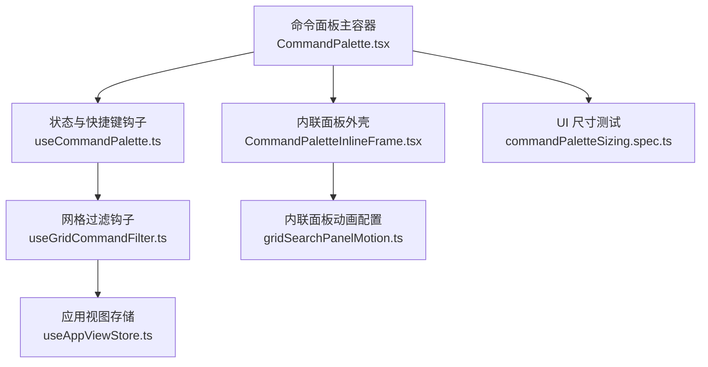
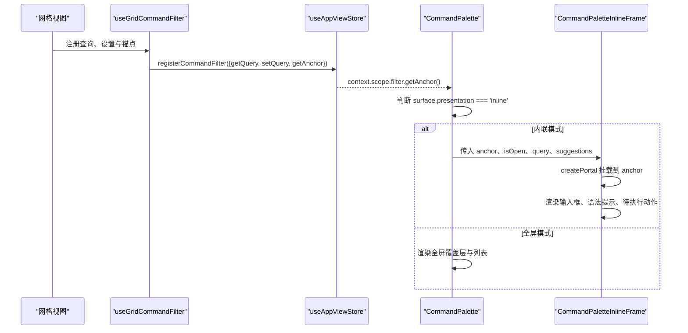
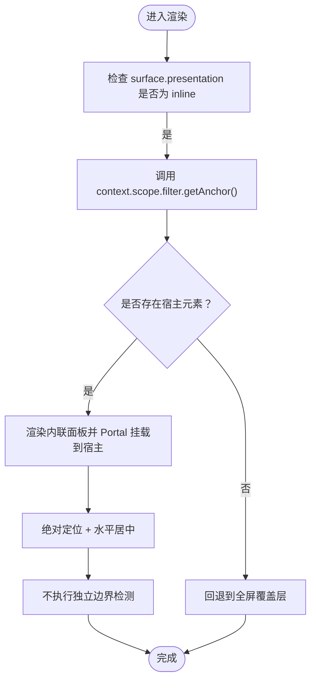
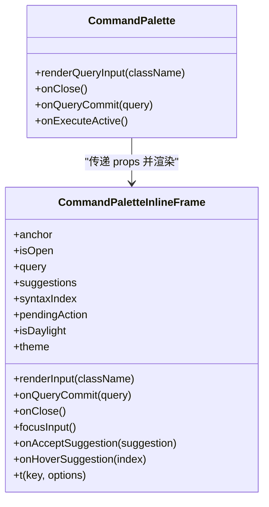
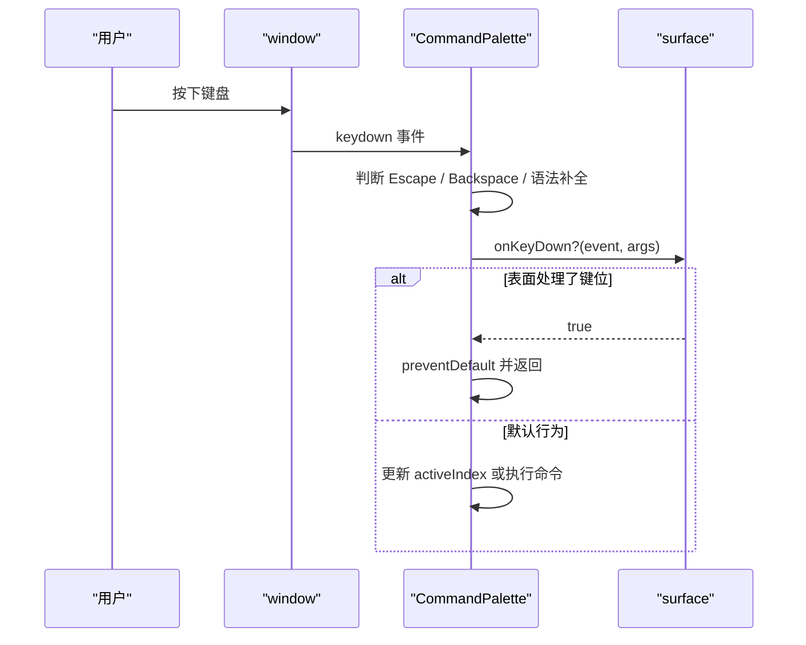
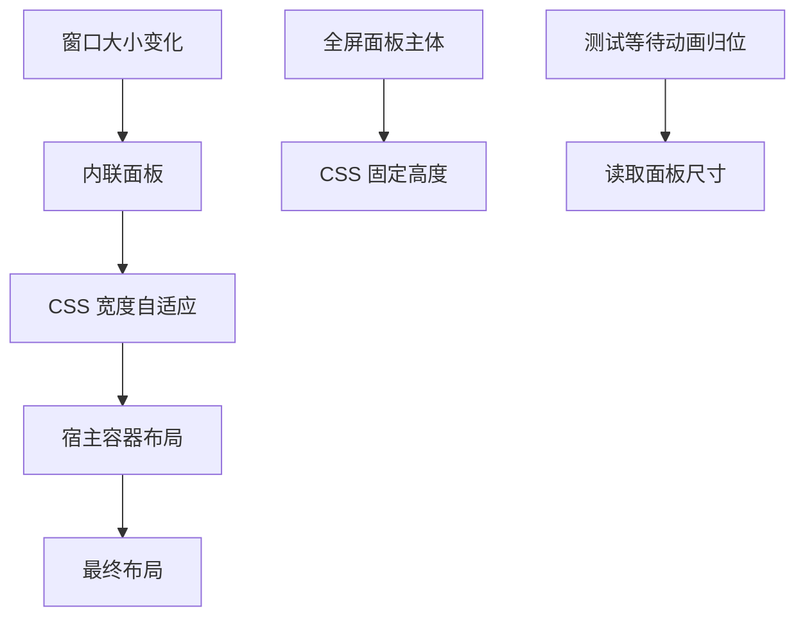
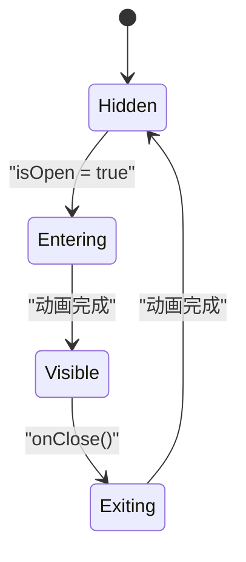
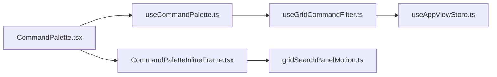

# 内联命令框架

<cite>
**本文引用的文件**   
- [CommandPalette.tsx](file://src/components/command-palette/CommandPalette.tsx)
- [CommandPaletteInlineFrame.tsx](file://src/components/command-palette/CommandPaletteInlineFrame.tsx)
- [useCommandPalette.ts](file://src/components/command-palette/useCommandPalette.ts)
- [useGridCommandFilter.ts](file://src/hooks/useGridCommandFilter.ts)
- [gridSearchPanelMotion.ts](file://src/components/shared/gridSearchPanelMotion.ts)
- [useAppViewStore.ts](file://src/stores/useAppViewStore.ts)
- [commandPaletteSizing.spec.ts](file://test/ui/commandPaletteSizing.spec.ts)
</cite>

## 目录
1. [简介](#简介)
2. [项目结构](#项目结构)
3. [核心组件](#核心组件)
4. [架构总览](#架构总览)
5. [详细组件分析](#详细组件分析)
6. [依赖关系分析](#依赖关系分析)
7. [性能与尺寸调整](#性能与尺寸调整)
8. [故障排查指南](#故障排查指南)
9. [结论](#结论)

## 简介
本文件为“内联命令框架”的专项技术文档，聚焦以下目标：
- 悬浮面板定位：锚点计算、位置调整与边界检测。
- 面板渲染：内容容器、边框样式与阴影效果。
- 交互处理：点击外部关闭、焦点管理与键盘导航。
- 动态尺寸调整：内容高度计算与窗口大小变化响应。
- 动画效果与过渡动画。

该框架在网格视图等场景中，将命令面板以内联方式挂载到宿主元素上，而不是使用全屏覆盖层；同时保留完整的全屏模式作为回退路径。

## 项目结构
内联命令框架由以下关键文件组成：
- 命令面板主容器：负责全屏模式、键盘事件、状态流转与内联分支选择。
- 内联面板外壳：通过 Portal 挂载到宿主元素，提供输入框、语法提示与待执行动作展示。
- 网格过滤钩子：向应用视图注册当前网格的查询、设置与锚点。
- 应用视图存储：维护“是否处于命令过滤模式”，并暴露 getAnchor 接口。
- 动画配置：定义内联面板的入场、出场与缓动曲线。
- UI 测试用例：验证面板尺寸稳定与测量行为。

**图表来源**
- [CommandPalette.tsx:87-378](file://src/components/command-palette/CommandPalette.tsx#L87-L378)
- [CommandPaletteInlineFrame.tsx:37-115](file://src/components/command-palette/CommandPaletteInlineFrame.tsx#L37-L115)
- [useCommandPalette.ts:31-627](file://src/components/command-palette/useCommandPalette.ts#L31-L627)
- [useGridCommandFilter.ts:22-43](file://src/hooks/useGridCommandFilter.ts#L22-L43)
- [useAppViewStore.ts:24-38](file://src/stores/useAppViewStore.ts#L24-L38)
- [gridSearchPanelMotion.ts:5-22](file://src/components/shared/gridSearchPanelMotion.ts#L5-L22)
- [commandPaletteSizing.spec.ts:81-134](file://test/ui/commandPaletteSizing.spec.ts#L81-L134)

**章节来源**
- [CommandPalette.tsx:87-378](file://src/components/command-palette/CommandPalette.tsx#L87-L378)
- [CommandPaletteInlineFrame.tsx:37-115](file://src/components/command-palette/CommandPaletteInlineFrame.tsx#L37-L115)
- [useCommandPalette.ts:31-627](file://src/components/command-palette/useCommandPalette.ts#L31-L627)
- [useGridCommandFilter.ts:22-43](file://src/hooks/useGridCommandFilter.ts#L22-L43)
- [useAppViewStore.ts:24-38](file://src/stores/useAppViewStore.ts#L24-L38)
- [gridSearchPanelMotion.ts:5-22](file://src/components/shared/gridSearchPanelMotion.ts#L5-L22)
- [commandPaletteSizing.spec.ts:81-134](file://test/ui/commandPaletteSizing.spec.ts#L81-L134)

## 核心组件
- 命令面板主容器（CommandPalette）
  - 管理打开/关闭、查询、匹配列表、活动项索引、命令执行状态。
  - 根据 surface 的 presentation 决定渲染全屏覆盖层或内联面板。
  - 统一处理键盘导航、输入法组合、语法补全与表面自定义键位。
- 内联面板外壳（CommandPaletteInlineFrame）
  - 使用 createPortal 将面板挂载到宿主元素，避免视口偏移猜测。
  - 提供搜索输入、清空/关闭按钮、语法提示与待执行动作文本。
  - 使用 framer-motion 播放内联面板的入场与出场动画。
- 网格过滤钩子（useGridCommandFilter）
  - 向 useAppViewStore 注册当前网格的查询、设置与锚点。
  - 返回 isFiltering 标志，供网格决定是否接管键盘输入。
- 应用视图存储（useAppViewStore）
  - 维护 isCommandFilterOpen 状态。
  - 暴露 filter.getAnchor()，用于内联面板的宿主定位。
- 动画配置（gridSearchPanelMotion）
  - 定义内联面板从上方滑入、淡入与退出时的位移与透明度。

**章节来源**
- [CommandPalette.tsx:87-378](file://src/components/command-palette/CommandPalette.tsx#L87-L378)
- [CommandPaletteInlineFrame.tsx:37-115](file://src/components/command-palette/CommandPaletteInlineFrame.tsx#L37-L115)
- [useGridCommandFilter.ts:22-43](file://src/hooks/useGridCommandFilter.ts#L22-L43)
- [useAppViewStore.ts:24-38](file://src/stores/useAppViewStore.ts#L24-L38)
- [gridSearchPanelMotion.ts:5-22](file://src/components/shared/gridSearchPanelMotion.ts#L5-L22)

## 架构总览
内联命令框架采用“主容器 + 内联外壳 + 宿主锚点”的分层设计：
- 主容器负责业务逻辑与渲染分支选择。
- 内联外壳只负责视觉呈现与宿主挂载。
- 宿主锚点由网格过滤钩子提供，确保面板出现在正确的控制区域。

**图表来源**
- [useGridCommandFilter.ts:29-39](file://src/hooks/useGridCommandFilter.ts#L29-L39)
- [CommandPalette.tsx:163-177](file://src/components/command-palette/CommandPalette.tsx#L163-L177)
- [CommandPalette.tsx:359-378](file://src/components/command-palette/CommandPalette.tsx#L359-L378)
- [CommandPaletteInlineFrame.tsx:53-115](file://src/components/command-palette/CommandPaletteInlineFrame.tsx#L53-L115)

## 详细组件分析

### 悬浮面板定位：锚点计算、位置调整与边界检测
- 锚点来源
  - 当 activeCommand 的 surface 声明 presentation 为 inline 时，主容器从 context.scope.filter.getAnchor() 获取宿主元素。
  - 如果不存在宿主元素，则回退到全屏覆盖层，避免把面板放在错误位置。
- 位置策略
  - 内联面板使用绝对定位，水平居中于宿主元素内部，宽度受最大宽度与视口边距限制。
  - 面板通过 createPortal 直接挂载到宿主元素，从而继承宿主的位置，而不是重新计算视口偏移。
- 边界检测
  - 内联面板没有独立的边界检测算法；它依赖宿主元素的布局约束与 CSS 的 min/max 宽度规则。
  - 若宿主元素本身被裁剪或滚动，面板会跟随宿主，不会自行做视口碰撞修正。
- 关闭与清理
  - 内联面板的关闭按钮会在有查询时先清空查询并重新聚焦输入框；否则调用 onClose 关闭面板。
  - 主容器在关闭时会重置 isOpen、activeCommand 与相关状态，并通过 lastFilterAnchorRef 保证退出动画期间仍挂载到原宿主。

**图表来源**
- [CommandPalette.tsx:163-177](file://src/components/command-palette/CommandPalette.tsx#L163-L177)
- [CommandPalette.tsx:359-378](file://src/components/command-palette/CommandPalette.tsx#L359-L378)
- [CommandPaletteInlineFrame.tsx:53-63](file://src/components/command-palette/CommandPaletteInlineFrame.tsx#L53-L63)

**章节来源**
- [CommandPalette.tsx:163-177](file://src/components/command-palette/CommandPalette.tsx#L163-L177)
- [CommandPalette.tsx:359-378](file://src/components/command-palette/CommandPalette.tsx#L359-L378)
- [CommandPaletteInlineFrame.tsx:53-63](file://src/components/command-palette/CommandPaletteInlineFrame.tsx#L53-L63)

### 面板渲染：内容容器、边框样式与阴影效果
- 内容容器
  - 内联面板外层使用 motion.div 包裹，并添加 data-folia-keyboard-window 标记，便于键盘窗口识别。
  - 输入框由主容器统一 renderQueryInput 生成，内联外壳只负责样式包装。
  - 语法提示与待执行动作以独立区块显示在输入框下方。
- 边框样式
  - 输入容器使用圆角、边框、阴影与毛玻璃背景类名，形成玻璃态外观。
  - 全屏模式下，面板容器也使用圆角、边框与阴影，并根据主题明暗切换边框颜色。
- 阴影效果
  - 内联面板与全屏面板均使用 shadow-2xl 强化层级感。
  - 毛玻璃效果通过 backdrop-blur-2xl 与主题类实现。

**图表来源**
- [CommandPalette.tsx:181-210](file://src/components/command-palette/CommandPalette.tsx#L181-L210)
- [CommandPalette.tsx:359-378](file://src/components/command-palette/CommandPalette.tsx#L359-L378)
- [CommandPaletteInlineFrame.tsx:18-35](file://src/components/command-palette/CommandPaletteInlineFrame.tsx#L18-L35)
- [CommandPaletteInlineFrame.tsx:64-110](file://src/components/command-palette/CommandPaletteInlineFrame.tsx#L64-L110)

**章节来源**
- [CommandPalette.tsx:181-210](file://src/components/command-palette/CommandPalette.tsx#L181-L210)
- [CommandPalette.tsx:414-421](file://src/components/command-palette/CommandPalette.tsx#L414-L421)
- [CommandPaletteInlineFrame.tsx:64-110](file://src/components/command-palette/CommandPaletteInlineFrame.tsx#L64-L110)

### 交互处理：点击外部关闭、焦点管理与键盘导航
- 点击外部关闭
  - 全屏覆盖层监听鼠标按下事件，点击空白区域触发 onClose。
  - 内联面板没有全局点击外部关闭；其关闭由输入框右侧按钮触发。
- 焦点管理
  - 打开面板后，主容器在 requestAnimationFrame 中聚焦输入框。
  - 内联面板清空查询后会再次聚焦输入框，保持用户输入连续性。
  - 在全屏模式动画完成后，针对 iOS Safari 的特殊情况主动失焦以避免滚动问题。
- 键盘导航
  - Escape：优先关闭“全部命令”视图，其次交给 surface.onEscape，最后关闭面板。
  - Backspace：在空查询且存在活动命令时，回退到命令主词。
  - 语法补全：上下箭头切换建议，Enter/Tab 接受建议。
  - 列表导航：上下箭头移动活动项，Enter 执行活动命令。
  - 表面自定义键位：surface.onKeyDown 拥有优先权，适合网格等复杂布局。

**图表来源**
- [CommandPalette.tsx:271-357](file://src/components/command-palette/CommandPalette.tsx#L271-L357)
- [CommandPalette.tsx:396-412](file://src/components/command-palette/CommandPalette.tsx#L396-L412)
- [CommandPaletteInlineFrame.tsx:67-83](file://src/components/command-palette/CommandPaletteInlineFrame.tsx#L67-L83)

**章节来源**
- [CommandPalette.tsx:271-357](file://src/components/command-palette/CommandPalette.tsx#L271-L357)
- [CommandPalette.tsx:396-412](file://src/components/command-palette/CommandPalette.tsx#L396-L412)
- [CommandPaletteInlineFrame.tsx:67-83](file://src/components/command-palette/CommandPaletteInlineFrame.tsx#L67-L83)

### 动态尺寸调整：内容高度计算与窗口大小变化响应
- 内容高度
  - 全屏模式下，面板主体高度由 CSS 固定为 min(496px, 50vh)，避免内容驱动高度导致测量不稳定。
  - 内联面板宽度由 min(28rem, calc(100%-2rem)) 控制，并水平居中。
- 窗口大小变化
  - 内联面板本身不直接监听 resize；它依赖宿主元素与 CSS 自适应。
  - 其他底部栏组件会通过 usePlayerBottomBarOffset 监听 resize 并重新计算偏移，但内联命令框架未复用该逻辑。
- 测试保障
  - UI 测试等待面板动画归位后再读取尺寸，避免因缩放导致的亚像素误差。
  - 测试断言面板与 body 盒子可见并可测量，确保尺寸稳定。

**图表来源**
- [CommandPalette.tsx:477-480](file://src/components/command-palette/CommandPalette.tsx#L477-L480)
- [CommandPaletteInlineFrame.tsx:62-63](file://src/components/command-palette/CommandPaletteInlineFrame.tsx#L62-L63)
- [commandPaletteSizing.spec.ts:81-134](file://test/ui/commandPaletteSizing.spec.ts#L81-L134)

**章节来源**
- [CommandPalette.tsx:477-480](file://src/components/command-palette/CommandPalette.tsx#L477-L480)
- [CommandPaletteInlineFrame.tsx:62-63](file://src/components/command-palette/CommandPaletteInlineFrame.tsx#L62-L63)
- [commandPaletteSizing.spec.ts:81-134](file://test/ui/commandPaletteSizing.spec.ts#L81-L134)

### 动画效果与过渡动画
- 内联面板动画
  - 使用 gridSearchPanelMotion 配置初始透明度与上移、动画结束位置与缓动曲线。
  - 面板出现时从上方滑入并淡入，离开时向上收起并淡出。
- 全屏面板动画
  - 覆盖层与面板分别设置 opacity、y、scale 的入场与离场动画。
  - 动画时长较短，强调快速响应。
- 动画稳定性
  - UI 测试通过等待 transform 归位来确认动画结束，避免中途采样造成尺寸误判。

**图表来源**
- [gridSearchPanelMotion.ts:5-22](file://src/components/shared/gridSearchPanelMotion.ts#L5-L22)
- [CommandPalette.tsx:392-403](file://src/components/command-palette/CommandPalette.tsx#L392-L403)
- [commandPaletteSizing.spec.ts:81-101](file://test/ui/commandPaletteSizing.spec.ts#L81-L101)

**章节来源**
- [gridSearchPanelMotion.ts:5-22](file://src/components/shared/gridSearchPanelMotion.ts#L5-L22)
- [CommandPalette.tsx:392-403](file://src/components/command-palette/CommandPalette.tsx#L392-L403)
- [commandPaletteSizing.spec.ts:81-101](file://test/ui/commandPaletteSizing.spec.ts#L81-L101)

## 依赖关系分析
- CommandPalette 依赖
  - useCommandPalette：提供 isOpen、query、matches、activeCommand 等状态与回调。
  - CommandPaletteInlineFrame：内联模式下的视觉外壳。
  - useGridCommandFilter：网格侧注册查询、设置与锚点。
  - useAppViewStore：维护 isCommandFilterOpen 与 filter.getAnchor。
  - gridSearchPanelMotion：内联面板动画配置。
- 耦合与内聚
  - CommandPalette 承担较多职责：状态、键盘、渲染分支、动画。
  - CommandPaletteInlineFrame 职责单一：仅负责内联外壳与宿主挂载。
  - useGridCommandFilter 与 useAppViewStore 解耦网格与全局状态。
- 外部依赖
  - framer-motion：动画与 AnimatePresence。
  - lucide-react：图标。
  - react-i18next：国际化。
  - react-dom.createPortal：宿主挂载。

**图表来源**
- [CommandPalette.tsx:87-378](file://src/components/command-palette/CommandPalette.tsx#L87-L378)
- [CommandPaletteInlineFrame.tsx:37-115](file://src/components/command-palette/CommandPaletteInlineFrame.tsx#L37-L115)
- [useCommandPalette.ts:31-627](file://src/components/command-palette/useCommandPalette.ts#L31-L627)
- [useGridCommandFilter.ts:22-43](file://src/hooks/useGridCommandFilter.ts#L22-L43)
- [useAppViewStore.ts:24-38](file://src/stores/useAppViewStore.ts#L24-L38)
- [gridSearchPanelMotion.ts:5-22](file://src/components/shared/gridSearchPanelMotion.ts#L5-L22)

**章节来源**
- [CommandPalette.tsx:87-378](file://src/components/command-palette/CommandPalette.tsx#L87-L378)
- [CommandPaletteInlineFrame.tsx:37-115](file://src/components/command-palette/CommandPaletteInlineFrame.tsx#L37-L115)
- [useCommandPalette.ts:31-627](file://src/components/command-palette/useCommandPalette.ts#L31-L627)
- [useGridCommandFilter.ts:22-43](file://src/hooks/useGridCommandFilter.ts#L22-L43)
- [useAppViewStore.ts:24-38](file://src/stores/useAppViewStore.ts#L24-L38)
- [gridSearchPanelMotion.ts:5-22](file://src/components/shared/gridSearchPanelMotion.ts#L5-L22)

## 性能与尺寸调整
- 渲染优化
  - 内联面板只在 isOpen 为真时渲染，并使用 AnimatePresence 管理生命周期。
  - 输入框与语法提示由主容器统一生成，减少重复逻辑。
- 尺寸稳定
  - 全屏面板主体使用 CSS 固定高度，避免内容驱动高度导致测量抖动。
  - 内联面板宽度使用 min 与 calc 组合，适配不同屏幕。
- 动画性能
  - 动画时长短，缓动曲线平滑，避免长时间阻塞主线程。
  - 测试通过等待 transform 归位，确保动画结束后再进行尺寸测量。

[本节为通用性能讨论，不直接分析具体代码文件]

## 故障排查指南
- 面板没有出现在预期位置
  - 检查 surface.presentation 是否为 inline。
  - 检查 context.scope.filter.getAnchor() 是否返回有效宿主元素。
  - 如果没有宿主元素，面板会回退到全屏模式。
- 键盘无法操作
  - 检查 isComposing 与 event.isComposing，输入法组合期间会跳过键盘导航。
  - 检查 surface.onKeyDown 是否吞掉了键位。
  - 检查 isExecuting 是否阻止了执行。
- 尺寸测量异常
  - 确保等待动画归位后再读取尺寸。
  - 检查面板是否被父级裁剪或隐藏。
- 关闭行为不符合预期
  - 内联面板关闭按钮在有查询时会先清空查询再聚焦输入框。
  - 全屏模式点击覆盖层空白区域会关闭面板。

**章节来源**
- [CommandPalette.tsx:163-177](file://src/components/command-palette/CommandPalette.tsx#L163-L177)
- [CommandPalette.tsx:271-357](file://src/components/command-palette/CommandPalette.tsx#L271-L357)
- [CommandPalette.tsx:396-412](file://src/components/command-palette/CommandPalette.tsx#L396-L412)
- [CommandPaletteInlineFrame.tsx:67-83](file://src/components/command-palette/CommandPaletteInlineFrame.tsx#L67-L83)
- [commandPaletteSizing.spec.ts:81-134](file://test/ui/commandPaletteSizing.spec.ts#L81-L134)

## 结论
内联命令框架通过“主容器 + 内联外壳 + 宿主锚点”的设计，实现了在网格等场景下精准定位的命令面板。它在保持完整键盘交互与动画体验的同时，避免了全屏覆盖层的侵入性。对于边界检测与动态尺寸调整，框架依赖宿主布局与 CSS 自适应，并在测试中通过等待动画归位来保证尺寸稳定。未来如需更复杂的边界碰撞与视口适配，可在内联外壳中引入独立的定位器，但仍需保持与宿主锚点的松耦合。