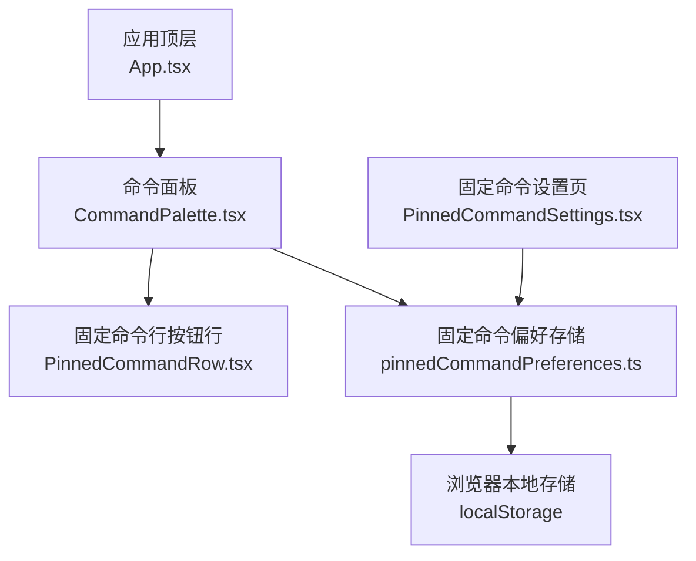
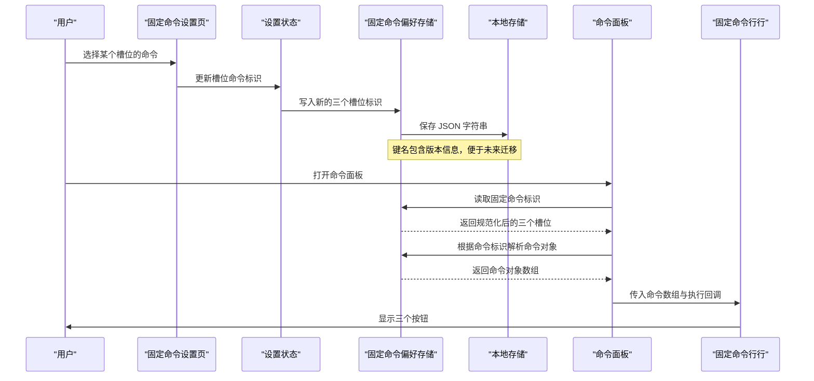
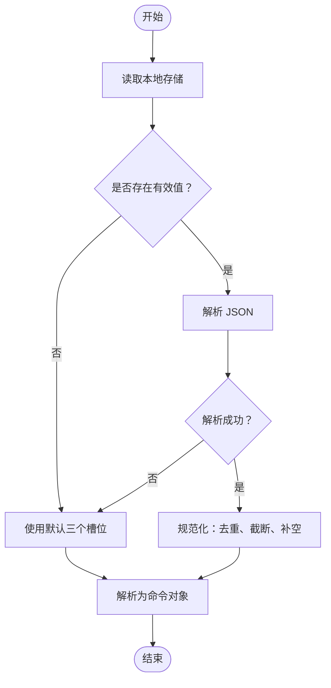
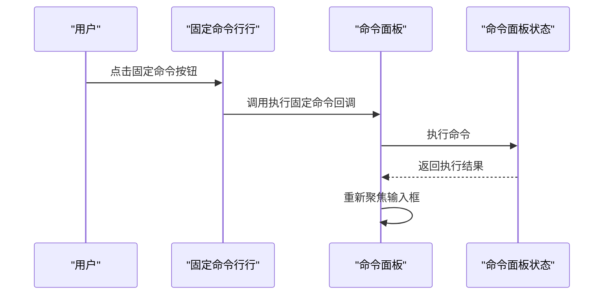
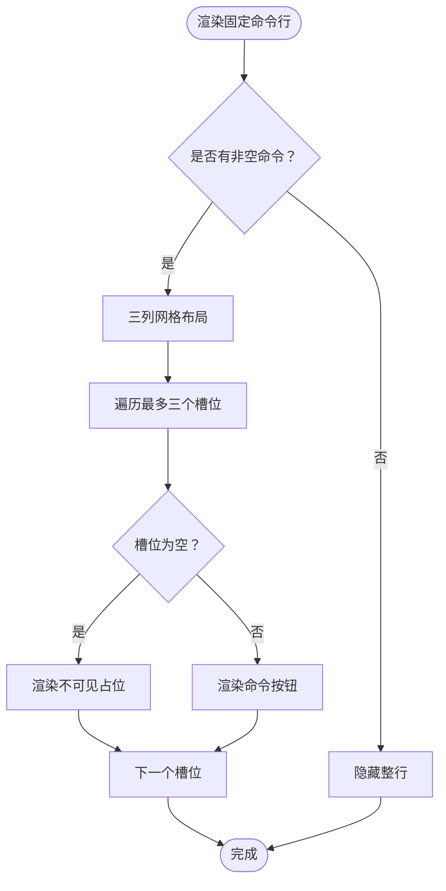
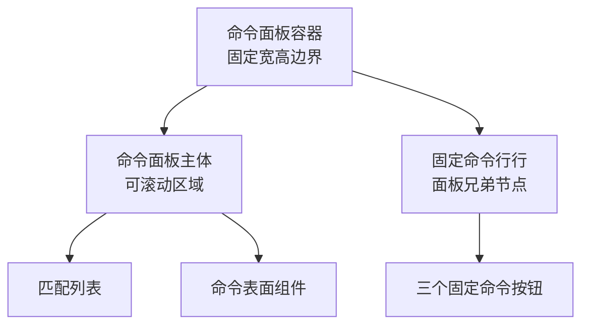
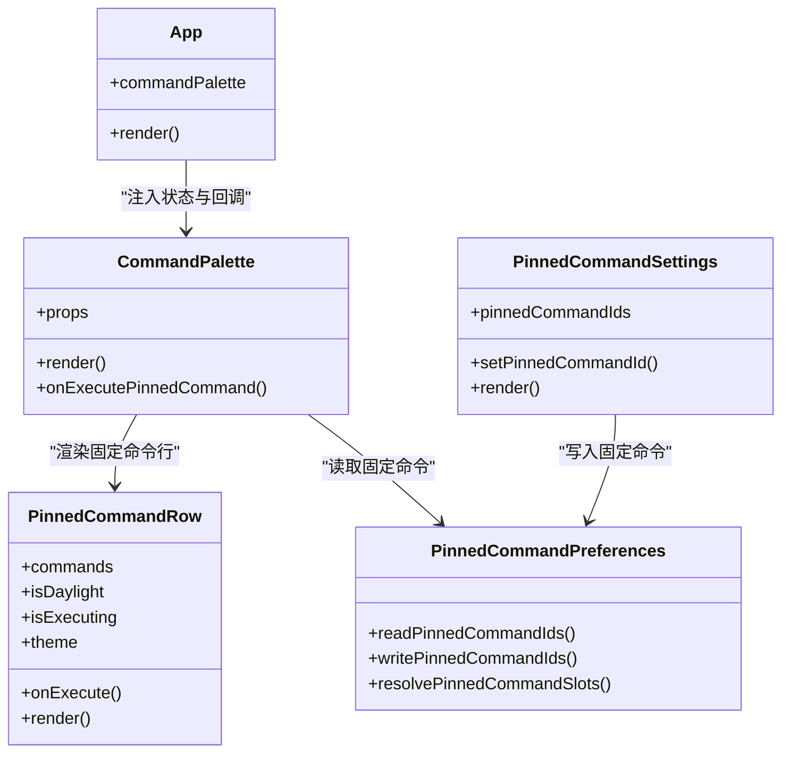

# 固定命令行

<cite>
**本文引用的文件**   
- [CommandPalette.tsx](file://src/components/command-palette/CommandPalette.tsx)
- [PinnedCommandRow.tsx](file://src/components/command-palette/PinnedCommandRow.tsx)
- [pinnedCommandPreferences.ts](file://src/components/command-palette/pinnedCommandPreferences.ts)
- [PinnedCommandSettings.tsx](file://src/components/modal/settings/PinnedCommandSettings.tsx)
- [App.tsx](file://src/App.tsx)
- [commandPaletteSizing.spec.ts](file://test/ui/commandPaletteSizing.spec.ts)
- [pinnedCommandPreferences.test.ts](file://test/unit/command-palette/pinnedCommandPreferences.test.ts)
</cite>

## 目录
1. [引言](#引言)
2. [项目结构定位](#项目结构定位)
3. [核心组件总览](#核心组件总览)
4. [架构与数据流](#架构与数据流)
5. [固定命令配置：用户自定义、持久化、导入导出](#固定命令配置用户自定义持久化导入导出)
6. [命令展示：图标、名称翻译与状态指示](#命令展示图标名称翻译与状态指示)
7. [交互行为：点击执行、悬停预览与键盘操作](#交互行为点击执行悬停预览与键盘操作)
8. [布局算法：自适应排列、溢出处理与滚动支持](#布局算法自适应排列溢出处理与滚动支持)
9. [拖拽排序与批量管理](#拖拽排序与批量管理)
10. [依赖关系分析](#依赖关系分析)
11. [性能与可维护性建议](#性能与可维护性建议)
12. [故障排查指南](#故障排查指南)
13. [结论](#结论)

## 引言
本文件面向“固定命令行”这一固定快捷入口能力，围绕以下目标展开：
- 解释固定命令的配置方式，包括用户通过设置界面选择三个槽位、本地持久化存储以及未来可扩展的导入导出。
- 说明固定命令在命令面板中的展示方式，包括图标显示、名称翻译和运行状态。
- 阐述交互行为，包括点击执行、悬停预览、键盘导航与执行。
- 解释布局算法，包括三列自适应排列、空槽占位、溢出隐藏与滚动区域。
- 明确当前是否支持拖拽排序与批量管理，并给出扩展建议。

该功能位于命令面板下方，作为三个位置固定的快捷按钮存在；它与命令列表的“最近使用”排序是两套独立机制。

## 项目结构定位
固定命令行相关代码主要分布在命令面板模块与设置模块中：
- 命令面板主视图负责渲染输入框、匹配列表、表面组件以及固定命令行。
- 固定命令行行组件负责把三个槽位的命令渲染为按钮。
- 偏好存储模块负责读取、写入和规范化三个槽位的命令标识。
- 设置页面提供三个下拉菜单，用于配置固定命令。
- 应用顶层将命令面板的状态与回调注入到具体组件。

**图表来源**
- [App.tsx:2789-2816](file://src/App.tsx#L2789-L2816)
- [CommandPalette.tsx:87-130](file://src/components/command-palette/CommandPalette.tsx#L87-L130)
- [PinnedCommandRow.tsx:19-67](file://src/components/command-palette/PinnedCommandRow.tsx#L19-L67)
- [pinnedCommandPreferences.ts:42-76](file://src/components/command-palette/pinnedCommandPreferences.ts#L42-L76)
- [PinnedCommandSettings.tsx:22-87](file://src/components/modal/settings/PinnedCommandSettings.tsx#L22-L87)

**章节来源**
- [CommandPalette.tsx:21-49](file://src/components/command-palette/CommandPalette.tsx#L21-L49)
- [PinnedCommandRow.tsx:8-17](file://src/components/command-palette/PinnedCommandRow.tsx#L8-L17)
- [pinnedCommandPreferences.ts:1-17](file://src/components/command-palette/pinnedCommandPreferences.ts#L1-L17)
- [PinnedCommandSettings.tsx:13-20](file://src/components/modal/settings/PinnedCommandSettings.tsx#L13-L20)

## 核心组件总览
| 组件或模块 | 职责 | 关键行为 |
|---|---|---|
| `CommandPalette` | 命令面板主容器 | 渲染输入框、匹配列表、语法提示、表面组件，并在底部渲染固定命令行 |
| `PinnedCommandRow` | 固定命令行按钮行 | 最多渲染三个命令按钮，空槽不显示内容但保留布局占位 |
| `pinnedCommandPreferences` | 固定命令偏好读写 | 从本地存储读取三个槽位命令标识，规范化后解析为可用命令对象 |
| `PinnedCommandSettings` | 设置页固定命令配置 | 提供三个下拉选项，限制同一命令不能重复占用多个槽位 |
| `App` | 应用状态注入 | 将命令面板状态、回调与主题传递给子组件 |

**章节来源**
- [CommandPalette.tsx:87-130](file://src/components/command-palette/CommandPalette.tsx#L87-L130)
- [PinnedCommandRow.tsx:19-67](file://src/components/command-palette/PinnedCommandRow.tsx#L19-L67)
- [pinnedCommandPreferences.ts:21-76](file://src/components/command-palette/pinnedCommandPreferences.ts#L21-L76)
- [PinnedCommandSettings.tsx:22-87](file://src/components/modal/settings/PinnedCommandSettings.tsx#L22-L87)
- [App.tsx:2789-2816](file://src/App.tsx#L2789-L2816)

## 架构与数据流
固定命令的数据流分为两条主线：
1. **配置主线**：用户在设置中选择三个槽位的命令，设置页调用状态更新，最终写入本地存储。
2. **展示主线**：命令面板读取本地存储中的三个命令标识，解析为命令对象数组，传给固定命令行行组件进行渲染。

**图表来源**
- [PinnedCommandSettings.tsx:54-80](file://src/components/modal/settings/PinnedCommandSettings.tsx#L54-L80)
- [pinnedCommandPreferences.ts:42-76](file://src/components/command-palette/pinnedCommandPreferences.ts#L42-L76)
- [CommandPalette.tsx:583-593](file://src/components/command-palette/CommandPalette.tsx#L583-L593)

**章节来源**
- [pinnedCommandPreferences.ts:12-17](file://src/components/command-palette/pinnedCommandPreferences.ts#L12-L17)
- [pinnedCommandPreferences.ts:42-67](file://src/components/command-palette/pinnedCommandPreferences.ts#L42-L67)
- [pinnedCommandPreferences.ts:69-76](file://src/components/command-palette/pinnedCommandPreferences.ts#L69-L76)

## 固定命令配置：用户自定义、持久化、导入导出

### 用户自定义
固定命令采用“三个位置槽位”的设计：
- 第一个槽位默认对应上一首播放命令。
- 第二个槽位默认对应下一首播放命令。
- 第三个槽位默认对应队列面板命令。

用户可在设置页面中为每个槽位选择一个命令。设置页会过滤掉已被其他槽位使用的命令，避免重复绑定。

| 槽位 | 默认值 | 说明 |
|---|---|---|
| 槽位一 | 上一首播放 | 快速回退播放进度 |
| 槽位二 | 下一首播放 | 快速前进播放进度 |
| 槽位三 | 队列面板 | 快速打开播放队列 |

**章节来源**
- [pinnedCommandPreferences.ts:13-17](file://src/components/command-palette/pinnedCommandPreferences.ts#L13-L17)
- [PinnedCommandSettings.tsx:54-80](file://src/components/modal/settings/PinnedCommandSettings.tsx#L54-L80)

### 持久化存储
固定命令以三个元素的数组形式存储在浏览器本地存储中：
- 存储键名为带版本号的键，便于后续数据结构升级。
- 读取时若本地存储不存在或解析失败，则回退到默认值。
- 写入时对数组进行规范化，确保长度固定、元素唯一且类型合法。

**图表来源**
- [pinnedCommandPreferences.ts:42-76](file://src/components/command-palette/pinnedCommandPreferences.ts#L42-L76)

**章节来源**
- [pinnedCommandPreferences.ts:21-40](file://src/components/command-palette/pinnedCommandPreferences.ts#L21-L40)
- [pinnedCommandPreferences.ts:42-67](file://src/components/command-palette/pinnedCommandPreferences.ts#L42-L67)
- [pinnedCommandPreferences.test.ts:39-89](file://test/unit/command-palette/pinnedCommandPreferences.test.ts#L39-L89)

### 导入导出
当前实现仅包含本地存储的读取与写入，没有显式的导入导出接口。如果需要支持导入导出，可基于现有 `readPinnedCommandIds` 与 `writePinnedCommandIds` 扩展：
- 导出：读取当前三个槽位标识，生成结构化数据供下载。
- 导入：校验导入数据的槽位数、命令标识合法性，再调用写入函数。

由于仓库中没有现成导入导出逻辑，本节为概念性扩展建议，不直接引用具体实现文件。

## 命令展示：图标、名称翻译与状态指示

### 图标显示
固定命令行按钮优先使用命令自身定义的图标；如果命令未定义图标，则回退到通用命令图标。图标颜色跟随主题强调色，尺寸固定，不会随文本长度变化。

**章节来源**
- [PinnedCommandRow.tsx:42-61](file://src/components/command-palette/PinnedCommandRow.tsx#L42-L61)

### 名称翻译
按钮标题通过命令标题函数获取，支持多语言翻译。这样即使命令内部使用英文标识，用户界面仍显示本地化名称。

**章节来源**
- [PinnedCommandRow.tsx:43-43](file://src/components/command-palette/PinnedCommandRow.tsx#L43-L43)

### 状态指示
固定命令行按钮具备以下状态表现：
- 正常状态：显示图标与名称。
- 悬停状态：浅色模式下背景变暗，深色模式下背景变亮。
- 执行中状态：整个命令面板处于执行状态时，按钮被禁用，透明度降低。
- 无障碍标签：按钮带有可读描述，便于屏幕阅读器朗读。

**章节来源**
- [PinnedCommandRow.tsx:45-62](file://src/components/command-palette/PinnedCommandRow.tsx#L45-L62)
- [CommandPalette.tsx:583-593](file://src/components/command-palette/CommandPalette.tsx#L583-L593)

## 交互行为：点击执行、悬停预览与键盘操作

### 点击执行
固定命令行按钮通过点击触发执行回调。命令执行完成后，命令面板会重新聚焦输入框，保持用户继续输入的能力。

**图表来源**
- [PinnedCommandRow.tsx:49-49](file://src/components/command-palette/PinnedCommandRow.tsx#L49-L49)
- [CommandPalette.tsx:588-592](file://src/components/command-palette/CommandPalette.tsx#L588-L592)

**章节来源**
- [PinnedCommandRow.tsx:45-50](file://src/components/command-palette/PinnedCommandRow.tsx#L45-L50)
- [CommandPalette.tsx:583-593](file://src/components/command-palette/CommandPalette.tsx#L583-L593)

### 悬停预览
固定命令行按钮本身不提供复杂预览面板。命令面板整体支持悬停高亮匹配项，但固定命令行更偏向“即点即执行”，而不是“悬停预览”。

**章节来源**
- [CommandPalette.tsx:532-542](file://src/components/command-palette/CommandPalette.tsx#L532-L542)
- [PinnedCommandRow.tsx:45-62](file://src/components/command-palette/PinnedCommandRow.tsx#L45-L62)

### 键盘操作
命令面板整体支持完整的键盘导航：
- `Escape`：关闭面板或退出全部命令列表。
- `ArrowDown` / `ArrowUp`：移动激活项。
- `Enter`：执行当前激活命令。
- `Backspace`：清空查询并回到命令主入口。
- 语法提示阶段：上下箭头切换建议，回车或制表符接受建议。

固定命令行按钮本身不是焦点管理的核心入口，它更多是鼠标或触控触发的快捷执行入口。

**章节来源**
- [CommandPalette.tsx:276-357](file://src/components/command-palette/CommandPalette.tsx#L276-L357)

## 布局算法：自适应排列、溢出处理与滚动支持

### 自适应排列
固定命令行使用三列网格布局：
- 最多显示三个命令按钮。
- 空槽不会渲染按钮，而是渲染不可见占位元素，保证布局稳定。
- 当没有任何固定命令时，整行隐藏。

**图表来源**
- [PinnedCommandRow.tsx:28-65](file://src/components/command-palette/PinnedCommandRow.tsx#L28-L65)

**章节来源**
- [PinnedCommandRow.tsx:32-65](file://src/components/command-palette/PinnedCommandRow.tsx#L32-L65)

### 溢出处理
固定命令行按钮文本使用截断样式，防止长名称破坏布局。按钮最小宽度允许收缩，但不会无限缩小，以保持可读性。

**章节来源**
- [PinnedCommandRow.tsx:45-62](file://src/components/command-palette/PinnedCommandRow.tsx#L45-L62)

### 滚动支持
命令面板主体区域具有固定最大高度，并启用垂直滚动。固定命令行行位于面板外部，因此固定命令的有无不会影响面板主体尺寸契约。测试用例明确验证了这一点。

**图表来源**
- [CommandPalette.tsx:398-481](file://src/components/command-palette/CommandPalette.tsx#L398-L481)
- [CommandPalette.tsx:583-593](file://src/components/command-palette/CommandPalette.tsx#L583-L593)
- [commandPaletteSizing.spec.ts:232-263](file://test/ui/commandPaletteSizing.spec.ts#L232-L263)

**章节来源**
- [CommandPalette.tsx:477-481](file://src/components/command-palette/CommandPalette.tsx#L477-L481)
- [commandPaletteSizing.spec.ts:232-263](file://test/ui/commandPaletteSizing.spec.ts#L232-L263)

## 拖拽排序与批量管理
当前固定命令行**不支持拖拽排序**。三个槽位是位置固定的下拉选择，而不是可拖拽卡片。也没有批量修改三个槽位的专用批量操作入口。

如果需要扩展：
- 拖拽排序：可为三个槽位添加拖拽手柄，交换槽位顺序，并同步更新本地存储。
- 批量管理：可增加“清空所有槽位”“恢复默认槽位”“批量替换命令”等操作。
- 约束校验：拖拽时需保证同一命令不重复出现在多个槽位。

这些属于扩展建议，当前仓库未实现对应逻辑。

**章节来源**
- [PinnedCommandSettings.tsx:54-80](file://src/components/modal/settings/PinnedCommandSettings.tsx#L54-L80)
- [pinnedCommandPreferences.ts:21-40](file://src/components/command-palette/pinnedCommandPreferences.ts#L21-L40)

## 依赖关系分析
固定命令行依赖以下关键模块：
- 命令面板主组件：负责渲染固定命令行行并传递执行回调。
- 固定命令行行组件：负责按钮渲染、图标与标题解析。
- 固定命令偏好存储：负责本地存储读写与命令解析。
- 设置页：负责用户配置入口。
- 应用顶层：负责状态注入。

**图表来源**
- [CommandPalette.tsx:87-130](file://src/components/command-palette/CommandPalette.tsx#L87-L130)
- [PinnedCommandRow.tsx:19-67](file://src/components/command-palette/PinnedCommandRow.tsx#L19-L67)
- [pinnedCommandPreferences.ts:42-76](file://src/components/command-palette/pinnedCommandPreferences.ts#L42-L76)
- [PinnedCommandSettings.tsx:22-87](file://src/components/modal/settings/PinnedCommandSettings.tsx#L22-L87)
- [App.tsx:2789-2816](file://src/App.tsx#L2789-L2816)

**章节来源**
- [CommandPalette.tsx:87-130](file://src/components/command-palette/CommandPalette.tsx#L87-L130)
- [PinnedCommandRow.tsx:19-67](file://src/components/command-palette/PinnedCommandRow.tsx#L19-L67)
- [pinnedCommandPreferences.ts:42-76](file://src/components/command-palette/pinnedCommandPreferences.ts#L42-L76)
- [PinnedCommandSettings.tsx:22-87](file://src/components/modal/settings/PinnedCommandSettings.tsx#L22-L87)
- [App.tsx:2789-2816](file://src/App.tsx#L2789-L2816)

## 性能与可维护性建议
- 固定命令数量固定为三个，复杂度较低，当前实现已经足够轻量。
- 设置页每次渲染都会对全部命令计算标题，注释中已指出可通过预计算优化；当前实现已通过 `useMemo` 缓存命令选项。
- 本地存储读写应尽量避免频繁序列化与反序列化，当前实现仅在设置变更时写入，符合常规实践。
- 如需扩展导入导出，建议新增独立的导入导出服务，避免污染现有偏好存储模块。

[本节为通用建议，不直接分析具体代码片段]

## 故障排查指南

### 固定命令没有显示
可能原因：
- 三个槽位均为空。
- 本地存储损坏或被清理。
- 命令标识对应的命令已从注册表中移除。

排查步骤：
1. 检查本地存储中固定命令键是否存在。
2. 确认三个槽位是否为空。
3. 检查命令标识是否仍能解析为有效命令。

**章节来源**
- [pinnedCommandPreferences.ts:42-57](file://src/components/command-palette/pinnedCommandPreferences.ts#L42-L57)
- [pinnedCommandPreferences.ts:69-76](file://src/components/command-palette/pinnedCommandPreferences.ts#L69-L76)
- [pinnedCommandPreferences.test.ts:39-76](file://test/unit/command-palette/pinnedCommandPreferences.test.ts#L39-L76)

### 固定命令导致面板尺寸异常
当前实现保证固定命令行行是命令面板容器的兄弟节点，而不是其子节点，因此固定命令的有无不会影响面板主体尺寸。如果观察到尺寸异常，可能是有人误将固定命令行移入面板内部。

**章节来源**
- [commandPaletteSizing.spec.ts:232-263](file://test/ui/commandPaletteSizing.spec.ts#L232-L263)

### 固定命令无法执行
可能原因：
- 命令面板正处于执行状态，按钮被禁用。
- 命令执行回调未正确传递。
- 命令本身抛出错误或长时间阻塞。

排查步骤：
1. 检查命令面板是否处于执行状态。
2. 检查固定命令行按钮是否被禁用。
3. 检查命令执行回调是否正确挂载。

**章节来源**
- [PinnedCommandRow.tsx:48-49](file://src/components/command-palette/PinnedCommandRow.tsx#L48-L49)
- [CommandPalette.tsx:588-592](file://src/components/command-palette/CommandPalette.tsx#L588-L592)

## 结论
固定命令行是一个简洁、稳定的快捷入口设计。它通过三个位置槽位提供用户自定义能力，并通过本地存储实现持久化。展示层使用图标与翻译名称，状态层与命令面板共享执行状态。布局层采用三列网格，空槽占位，溢出截断，滚动由命令面板主体承担。当前实现不包含拖拽排序与批量管理，但具备良好的扩展基础。若需要增强，可从导入导出、拖拽排序、批量操作和无障碍体验入手。