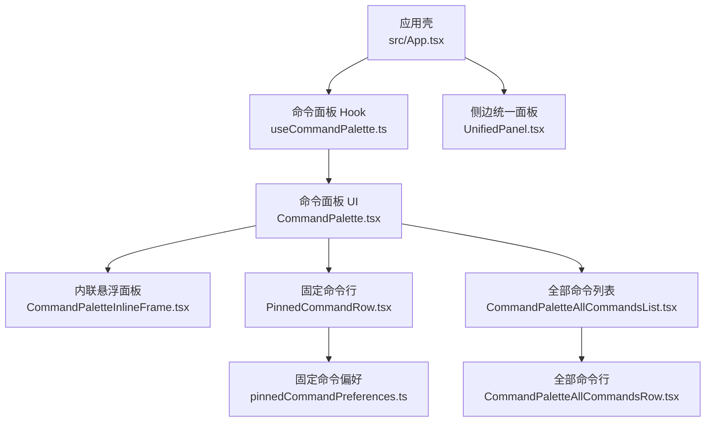
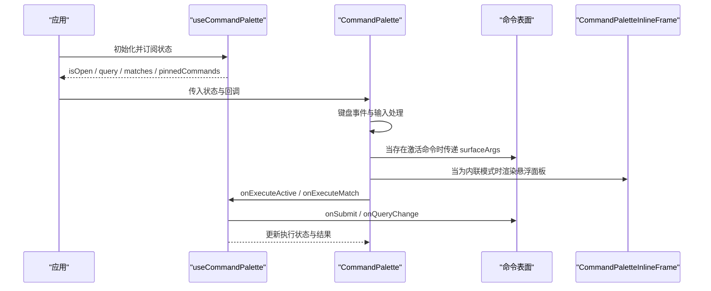
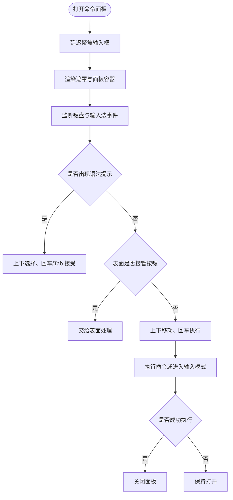
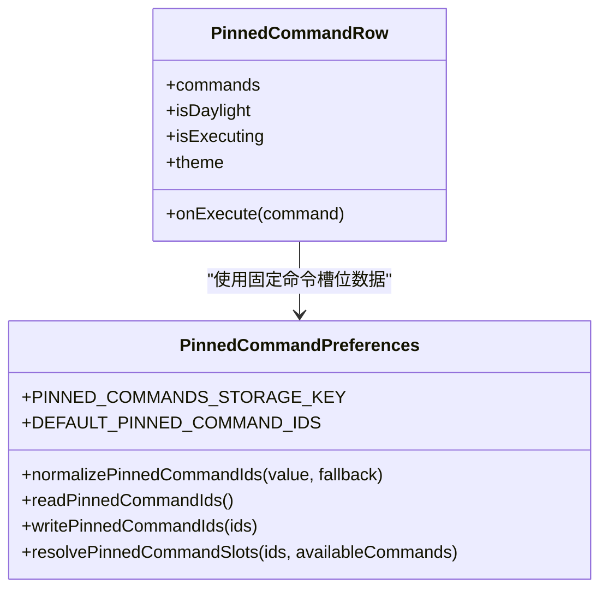
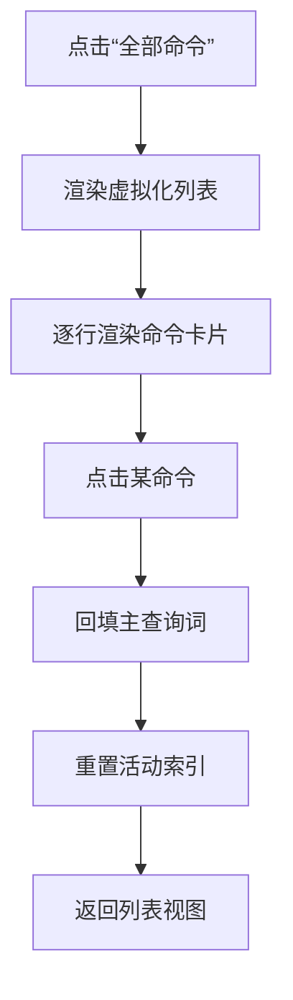
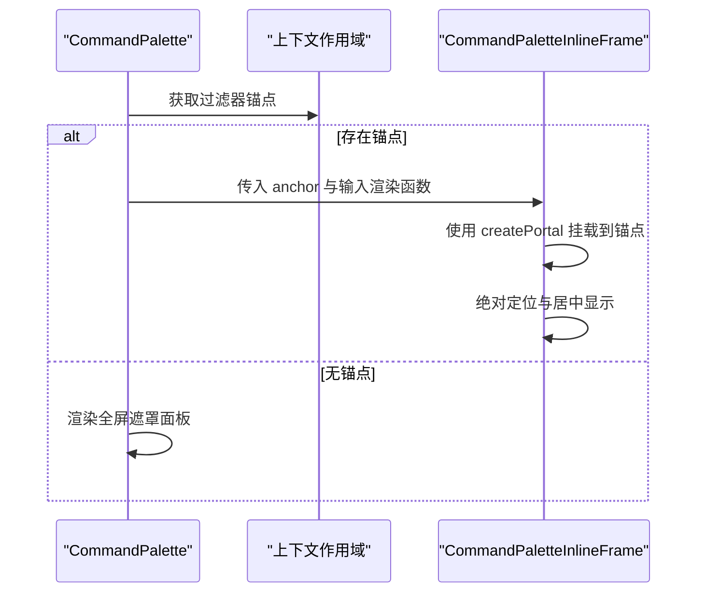
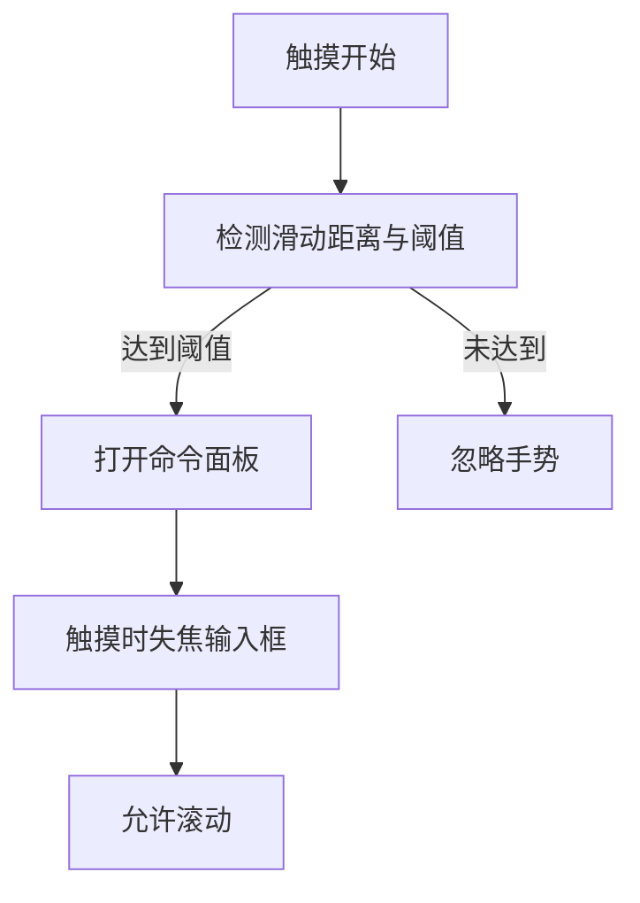
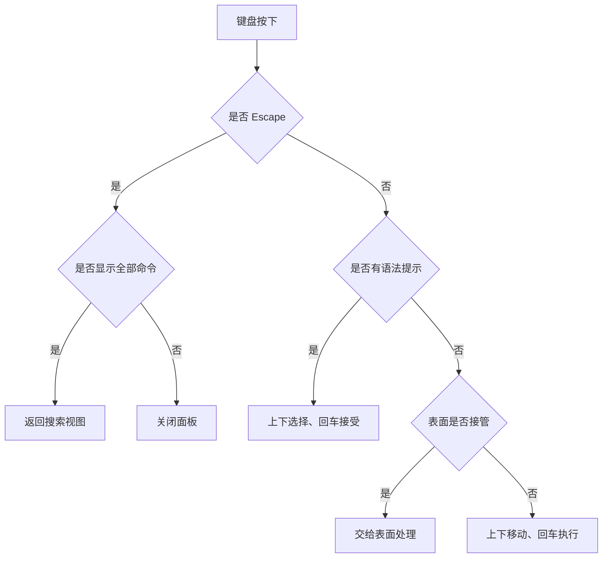
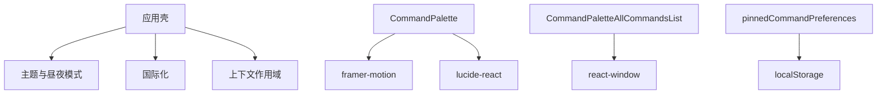

# 用户界面组件

<cite>
**本文引用的文件**   
- [CommandPalette.tsx](file://src/components/command-palette/CommandPalette.tsx)
- [useCommandPalette.ts](file://src/components/command-palette/useCommandPalette.ts)
- [PinnedCommandRow.tsx](file://src/components/command-palette/PinnedCommandRow.tsx)
- [pinnedCommandPreferences.ts](file://src/components/command-palette/pinnedCommandPreferences.ts)
- [CommandPaletteAllCommandsList.tsx](file://src/components/command-palette/CommandPaletteAllCommandsList.tsx)
- [CommandPaletteAllCommandsRow.tsx](file://src/components/command-palette/CommandPaletteAllCommandsRow.tsx)
- [CommandPaletteInlineFrame.tsx](file://src/components/command-palette/CommandPaletteInlineFrame.tsx)
- [App.tsx](file://src/App.tsx)
- [UnifiedPanel.tsx](file://src/components/UnifiedPanel.tsx)
</cite>

## 目录
1. [简介](#简介)
2. [项目结构](#项目结构)
3. [核心组件](#核心组件)
4. [架构总览](#架构总览)
5. [详细组件分析](#详细组件分析)
6. [依赖关系分析](#依赖关系分析)
7. [性能与可维护性](#性能与可维护性)
8. [故障排查指南](#故障排查指南)
9. [结论](#结论)

## 简介
本文件面向 Folia Major 的命令面板用户界面组件，聚焦以下目标：
- 主面板组件的输入框处理、结果列表渲染和动画效果。
- 固定命令行（常用命令展示、快捷访问、自定义配置）。
- 全部命令列表（浏览、分组显示、搜索过滤）。
- 内联命令框架（悬浮面板、位置计算、锚点定位）。
- 响应式设计（移动端适配、触摸手势、屏幕方向处理）。
- 可访问性支持（键盘导航、屏幕阅读器、焦点管理）。
- 主题定制与样式覆盖选项。

该文档以源码为依据，通过架构图、流程图和时序图解释实现细节，并给出排错建议与最佳实践。

## 项目结构
命令面板相关代码集中在 `src/components/command-palette` 目录下，采用“组件 + Hook + 子模块”的组织方式：
- 顶层 UI 组件：`CommandPalette.tsx`
- 状态与交互 Hook：`useCommandPalette.ts`
- 固定命令行：`PinnedCommandRow.tsx`、`pinnedCommandPreferences.ts`
- 全部命令列表：`CommandPaletteAllCommandsList.tsx`、`CommandPaletteAllCommandsRow.tsx`
- 内联悬浮面板：`CommandPaletteInlineFrame.tsx`
- 应用集成入口：`src/App.tsx`
- 侧边滑动打开入口：`src/components/UnifiedPanel.tsx`

**图表来源**
- [App.tsx:2789-2816](file://src/App.tsx#L2789-L2816)
- [useCommandPalette.ts:31-123](file://src/components/command-palette/useCommandPalette.ts#L31-L123)
- [CommandPalette.tsx:87-131](file://src/components/command-palette/CommandPalette.tsx#L87-L131)
- [CommandPaletteInlineFrame.tsx:18-35](file://src/components/command-palette/CommandPaletteInlineFrame.tsx#L18-L35)
- [PinnedCommandRow.tsx:11-25](file://src/components/command-palette/PinnedCommandRow.tsx#L11-L25)
- [CommandPaletteAllCommandsList.tsx:17-26](file://src/components/command-palette/CommandPaletteAllCommandsList.tsx#L17-L26)
- [CommandPaletteAllCommandsRow.tsx:18-26](file://src/components/command-palette/CommandPaletteAllCommandsRow.tsx#L18-L26)
- [pinnedCommandPreferences.ts:6-17](file://src/components/command-palette/pinnedCommandPreferences.ts#L6-L17)
- [UnifiedPanel.tsx:515-547](file://src/components/UnifiedPanel.tsx#L515-L547)

**章节来源**
- [CommandPalette.tsx:21-131](file://src/components/command-palette/CommandPalette.tsx#L21-L131)
- [useCommandPalette.ts:17-123](file://src/components/command-palette/useCommandPalette.ts#L17-L123)
- [CommandPaletteInlineFrame.tsx:11-35](file://src/components/command-palette/CommandPaletteInlineFrame.tsx#L11-L35)
- [PinnedCommandRow.tsx:8-25](file://src/components/command-palette/PinnedCommandRow.tsx#L8-L25)
- [CommandPaletteAllCommandsList.tsx:8-26](file://src/components/command-palette/CommandPaletteAllCommandsList.tsx#L8-L26)
- [CommandPaletteAllCommandsRow.tsx:8-26](file://src/components/command-palette/CommandPaletteAllCommandsRow.tsx#L8-L26)
- [pinnedCommandPreferences.ts:1-17](file://src/components/command-palette/pinnedCommandPreferences.ts#L1-L17)
- [App.tsx:2789-2816](file://src/App.tsx#L2789-L2816)
- [UnifiedPanel.tsx:515-547](file://src/components/UnifiedPanel.tsx#L515-L547)

## 核心组件
- 命令面板主组件负责：
  - 全屏遮罩与面板容器、输入框、语法提示、匹配结果列表、全部命令视图、固定命令行。
  - 根据当前激活命令决定是否渲染“内联悬浮面板”。
  - 使用 framer-motion 完成打开、关闭、列表项切换等动画。
  - 将主题、昼夜模式、国际化文案注入到各子组件。
- 命令面板 Hook 负责：
  - 打开/关闭、查询与匹配、命令执行、最近命令与使用频次记录。
  - 全局快捷键监听、IME 组合输入处理、命令表面回调分发。
  - 提供可用命令集合、固定命令槽位解析、命令调用 API。

**章节来源**
- [CommandPalette.tsx:87-131](file://src/components/command-palette/CommandPalette.tsx#L87-L131)
- [useCommandPalette.ts:31-123](file://src/components/command-palette/useCommandPalette.ts#L31-L123)

## 架构总览
命令面板由“状态层（Hook）+ 表现层（组件）+ 扩展层（命令表面）”组成。应用通过 Hook 暴露的状态驱动 UI；命令表面可以接管输入、构建匹配、处理提交；固定命令行与全部命令列表作为辅助视图嵌入主面板。

**图表来源**
- [App.tsx:2789-2816](file://src/App.tsx#L2789-L2816)
- [useCommandPalette.ts:339-356](file://src/components/command-palette/useCommandPalette.ts#L339-L356)
- [CommandPalette.tsx:117-131](file://src/components/command-palette/CommandPalette.tsx#L117-L131)
- [CommandPaletteInlineFrame.tsx:53-63](file://src/components/command-palette/CommandPaletteInlineFrame.tsx#L53-L63)

## 详细组件分析

### 主面板组件：输入框处理、结果列表渲染与动画
- 输入框处理
  - 统一渲染输入框，支持占位符轮换、禁用态、输入法组合输入、自动补全关闭、拼写检查关闭。
  - 在打开时延迟聚焦，避免 iOS Safari 滚动问题；触摸开始时主动失焦以提升滚动体验。
  - 支持语法提示补全（如 `--play`），并在补全列表拥有键盘优先权。
- 结果列表渲染
  - 默认匹配列表按评分排序，支持预览文本、分组标签、图标、命令提示词。
  - 空状态显示无匹配提示；激活命令且带表面时懒加载并渲染对应表面。
  - “全部命令”视图使用虚拟化列表，固定行高，避免尺寸抖动。
- 动画效果
  - 使用 framer-motion 的 AnimatePresence 控制遮罩淡入淡出。
  - 面板容器使用缩放、位移、透明度过渡，进入与退出均有缓动。
  - 内联悬浮面板复用网格搜索面板的入场动画，保持视觉一致性。

**图表来源**
- [CommandPalette.tsx:234-357](file://src/components/command-palette/CommandPalette.tsx#L234-L357)
- [CommandPalette.tsx:381-403](file://src/components/command-palette/CommandPalette.tsx#L381-L403)
- [CommandPalette.tsx:477-580](file://src/components/command-palette/CommandPalette.tsx#L477-L580)

**章节来源**
- [CommandPalette.tsx:181-210](file://src/components/command-palette/CommandPalette.tsx#L181-L210)
- [CommandPalette.tsx:234-357](file://src/components/command-palette/CommandPalette.tsx#L234-L357)
- [CommandPalette.tsx:381-403](file://src/components/command-palette/CommandPalette.tsx#L381-L403)
- [CommandPalette.tsx:477-580](file://src/components/command-palette/CommandPalette.tsx#L477-L580)

### 固定命令行：常用命令展示、快捷访问与自定义配置
- 展示逻辑
  - 最多三个槽位，若全部为空则不渲染整行，避免影响面板尺寸契约。
  - 每个槽位显示命令图标与标题，点击即执行；执行中禁用。
- 快捷访问
  - 通过 Hook 提供的 `executePinnedCommand` 直接执行命令，无需经过匹配流程。
  - 执行完成后恢复输入框焦点，保证后续操作连贯。
- 自定义配置
  - 固定命令 ID 数组持久化到本地存储，包含默认值与规范化逻辑。
  - 读取时校验类型、去重、长度限制；写入时规范化后保存。
  - 运行时将 ID 映射为可用命令对象，无效 ID 回退为空槽。

**图表来源**
- [PinnedCommandRow.tsx:11-25](file://src/components/command-palette/PinnedCommandRow.tsx#L11-L25)
- [pinnedCommandPreferences.ts:6-17](file://src/components/command-palette/pinnedCommandPreferences.ts#L6-L17)
- [pinnedCommandPreferences.ts:21-77](file://src/components/command-palette/pinnedCommandPreferences.ts#L21-L77)

**章节来源**
- [PinnedCommandRow.tsx:28-66](file://src/components/command-palette/PinnedCommandRow.tsx#L28-L66)
- [pinnedCommandPreferences.ts:1-77](file://src/components/command-palette/pinnedCommandPreferences.ts#L1-L77)

### 全部命令列表：浏览、分组显示与搜索过滤
- 浏览与虚拟化
  - 使用 react-window 的 List 进行虚拟化渲染，固定行高，减少 DOM 节点数量。
  - 顶部返回按钮与计数显示，便于快速返回搜索视图。
- 分组显示
  - 通过组标签键映射到国际化文案，未定义组回退为通用标签。
  - 每行显示命令图标、标题、分组标签与描述。
- 搜索过滤
  - 全部命令列表本身不参与实时搜索，而是作为命令字典供用户挑选后回填查询词。
  - 选择命令后回填主输入框并重置活动索引，随后重新触发匹配。

**图表来源**
- [CommandPaletteAllCommandsList.tsx:49-72](file://src/components/command-palette/CommandPaletteAllCommandsList.tsx#L49-L72)
- [CommandPaletteAllCommandsRow.tsx:47-72](file://src/components/command-palette/CommandPaletteAllCommandsRow.tsx#L47-L72)

**章节来源**
- [CommandPaletteAllCommandsList.tsx:8-79](file://src/components/command-palette/CommandPaletteAllCommandsList.tsx#L8-L79)
- [CommandPaletteAllCommandsRow.tsx:8-77](file://src/components/command-palette/CommandPaletteAllCommandsRow.tsx#L8-L77)

### 内联命令框架：悬浮面板、位置计算与锚点定位
- 悬浮面板
  - 当激活命令为“内联”呈现模式时，主面板不渲染全屏遮罩，而是将输入框与语法提示渲染到宿主元素的锚点容器中。
  - 使用 React Portal 将内容挂载到宿主元素，确保位置由宿主决定而非视口估算。
- 位置计算
  - 内联面板通过 CSS 绝对定位与居中偏移，宽度受最大宽度与视口宽度约束。
  - 入场动画复用网格搜索面板的 motion 配置，保证视觉一致。
- 锚点定位
  - 主面板从上下文作用域获取过滤器锚点元素；若不存在则回退到全屏遮罩。
  - 关闭过程中保留最后一次锚点引用，直到面板完全退出，避免中途消失导致布局异常。

**图表来源**
- [CommandPalette.tsx:166-177](file://src/components/command-palette/CommandPalette.tsx#L166-L177)
- [CommandPalette.tsx:359-379](file://src/components/command-palette/CommandPalette.tsx#L359-L379)
- [CommandPaletteInlineFrame.tsx:53-63](file://src/components/command-palette/CommandPaletteInlineFrame.tsx#L53-L63)

**章节来源**
- [CommandPalette.tsx:166-177](file://src/components/command-palette/CommandPalette.tsx#L166-L177)
- [CommandPalette.tsx:359-379](file://src/components/command-palette/CommandPalette.tsx#L359-L379)
- [CommandPaletteInlineFrame.tsx:11-63](file://src/components/command-palette/CommandPaletteInlineFrame.tsx#L11-L63)

### 响应式设计：移动端适配、触摸手势与屏幕方向处理
- 移动端适配
  - 面板宽度使用相对单位与视口约束，确保在小屏设备上仍可阅读。
  - 内联悬浮面板宽度取最小值与视口宽度计算值，避免溢出。
- 触摸手势
  - 侧边统一面板支持滑动打开命令面板，检测水平滑动距离与阈值，阻止默认行为并触发打开。
  - 面板内部在触摸开始时对输入框失焦，提升滚动体验。
- 屏幕方向处理
  - 面板高度使用 min(固定像素, 视口百分比)，在横屏与竖屏下均保持合理可视区域。
  - 背景遮罩与面板背景根据昼夜模式动态调整透明度与颜色，保证可读性。

**图表来源**
- [UnifiedPanel.tsx:515-547](file://src/components/UnifiedPanel.tsx#L515-L547)
- [CommandPalette.tsx:404-413](file://src/components/command-palette/CommandPalette.tsx#L404-L413)
- [CommandPalette.tsx:477-481](file://src/components/command-palette/CommandPalette.tsx#L477-L481)

**章节来源**
- [UnifiedPanel.tsx:515-547](file://src/components/UnifiedPanel.tsx#L515-L547)
- [CommandPalette.tsx:404-413](file://src/components/command-palette/CommandPalette.tsx#L404-L413)
- [CommandPalette.tsx:477-481](file://src/components/command-palette/CommandPalette.tsx#L477-L481)

### 可访问性支持：键盘导航、屏幕阅读器与焦点管理
- 键盘导航
  - 支持 Escape 关闭、Backspace 清空并回到首条关键词、上下箭头移动活动项、回车执行。
  - 语法提示列表拥有独立键盘优先级，Enter/Tab 接受补全。
  - 全局快捷键监听区分修饰键与平台主修饰键，避免冲突。
- 屏幕阅读器
  - 输入框设置 role="combobox"、aria-autocomplete="list"、aria-expanded 指示下拉状态。
  - 固定命令行按钮提供 aria-label 与 title，增强语义信息。
- 焦点管理
  - 打开时延迟聚焦输入框；切换全屏与内联模式时重新聚焦。
  - 执行命令成功后恢复焦点，保证连续操作流畅。

**图表来源**
- [CommandPalette.tsx:276-357](file://src/components/command-palette/CommandPalette.tsx#L276-L357)
- [CommandPalette.tsx:181-210](file://src/components/command-palette/CommandPalette.tsx#L181-L210)
- [PinnedCommandRow.tsx:45-62](file://src/components/command-palette/PinnedCommandRow.tsx#L45-L62)

**章节来源**
- [CommandPalette.tsx:276-357](file://src/components/command-palette/CommandPalette.tsx#L276-L357)
- [CommandPalette.tsx:181-210](file://src/components/command-palette/CommandPalette.tsx#L181-L210)
- [PinnedCommandRow.tsx:45-62](file://src/components/command-palette/PinnedCommandRow.tsx#L45-L62)

### 主题定制与样式覆盖选项
- 主题变量
  - 使用 CSS 变量 `--text-primary` 控制文本颜色，配合昼夜模式切换。
  - 强调色 `theme.accentColor` 用于图标与边框，保持一致的品牌感。
- 样式覆盖
  - 面板背景根据 backdrop 策略选择半透明或更密实填充，保证内容可读性。
  - 列表项活跃态与空闲态背景色随昼夜模式变化，hover 反馈清晰。
  - 内联悬浮面板使用玻璃拟态类名与阴影，保持视觉层次。

**章节来源**
- [CommandPalette.tsx:225-232](file://src/components/command-palette/CommandPalette.tsx#L225-L232)
- [CommandPalette.tsx:414-421](file://src/components/command-palette/CommandPalette.tsx#L414-L421)
- [CommandPaletteInlineFrame.tsx:64-66](file://src/components/command-palette/CommandPaletteInlineFrame.tsx#L64-L66)

## 依赖关系分析
命令面板的核心依赖包括：
- 应用壳：提供主题、昼夜模式、国际化与上下文作用域。
- 命令注册表与搜索索引：提供命令元数据、评分与匹配。
- 本地存储：持久化固定命令配置。
- 第三方库：framer-motion 用于动画，react-window 用于虚拟化列表，lucide-react 用于图标。

**图表来源**
- [App.tsx:2789-2816](file://src/App.tsx#L2789-L2816)
- [CommandPalette.tsx:1-10](file://src/components/command-palette/CommandPalette.tsx#L1-L10)
- [CommandPaletteAllCommandsList.tsx:1-6](file://src/components/command-palette/CommandPaletteAllCommandsList.tsx#L1-L6)
- [pinnedCommandPreferences.ts:42-67](file://src/components/command-palette/pinnedCommandPreferences.ts#L42-L67)

**章节来源**
- [App.tsx:2789-2816](file://src/App.tsx#L2789-L2816)
- [CommandPalette.tsx:1-10](file://src/components/command-palette/CommandPalette.tsx#L1-L10)
- [CommandPaletteAllCommandsList.tsx:1-6](file://src/components/command-palette/CommandPaletteAllCommandsList.tsx#L1-L6)
- [pinnedCommandPreferences.ts:42-67](file://src/components/command-palette/pinnedCommandPreferences.ts#L42-L67)

## 性能与可维护性
- 性能优化
  - 命令可用性缓存：稳定引用可用命令集合，避免每次扫描 125 个命令。
  - 匹配列表分三路生成：默认匹配、表面匹配、输入模式匹配，按需计算，降低无关上下文变更带来的重排。
  - 全部命令列表虚拟化：固定行高，减少 DOM 节点，避免大列表卡顿。
  - 动画与过渡使用硬件加速属性，避免布局抖动。
- 可维护性
  - 组件职责清晰：主面板负责 UI 与动画，Hook 负责状态与交互，子组件专注各自视图。
  - 配置与持久化分离：固定命令配置独立模块，便于测试与扩展。
  - 测试覆盖：尺寸回归测试确保面板与 body 尺寸不受固定命令行影响，保障表面画布契约。

**章节来源**
- [useCommandPalette.ts:101-145](file://src/components/command-palette/useCommandPalette.ts#L101-L145)
- [CommandPaletteAllCommandsList.tsx:8-16](file://src/components/command-palette/CommandPaletteAllCommandsList.tsx#L8-L16)
- [test/ui/commandPaletteSizing.spec.ts:232-263](file://test/ui/commandPaletteSizing.spec.ts#L232-L263)

## 故障排查指南
- 面板尺寸异常
  - 现象：面板高度或 body 高度随固定命令行变化。
  - 原因：固定命令行被错误地放入面板内部，破坏尺寸契约。
  - 解决：确认固定命令行位于面板外部兄弟节点，参考测试断言。
- 输入框无法聚焦
  - 现象：打开面板后输入框未获得焦点。
  - 原因：iOS Safari 在固定 + 模糊背景下滚动受限，需主动失焦后再聚焦。
  - 解决：在动画完成回调中对触摸设备执行失焦，再延迟聚焦。
- 内联面板位置错乱
  - 现象：内联悬浮面板不在预期位置。
  - 原因：锚点元素不存在或宿主已卸载。
  - 解决：确保上下文作用域提供有效锚点，并在宿主变化时关闭内联面板。
- 固定命令未生效
  - 现象：固定命令行未显示或点击无效。
  - 原因：本地存储损坏或命令 ID 无效。
  - 解决：检查本地存储格式，使用规范化函数修复；确认命令存在于可用命令集合。

**章节来源**
- [test/ui/commandPaletteSizing.spec.ts:232-263](file://test/ui/commandPaletteSizing.spec.ts#L232-L263)
- [CommandPalette.tsx:404-413](file://src/components/command-palette/CommandPalette.tsx#L404-L413)
- [CommandPalette.tsx:166-177](file://src/components/command-palette/CommandPalette.tsx#L166-L177)
- [pinnedCommandPreferences.ts:21-77](file://src/components/command-palette/pinnedCommandPreferences.ts#L21-L77)

## 结论
Folia Major 的命令面板组件通过清晰的职责划分与稳健的状态管理，实现了强大的命令输入、匹配与执行能力。主面板负责 UI 与动画，Hook 负责状态与交互，子组件专注各自视图。固定命令行与全部命令列表提供了便捷的快捷访问与命令浏览。内联悬浮面板确保了与宿主界面的无缝集成。响应式设计与可访问性支持保证了多端体验与无障碍使用。主题定制与样式覆盖选项使界面能够灵活适配不同品牌与场景。整体架构具备良好的性能与可维护性，适合持续扩展与迭代。