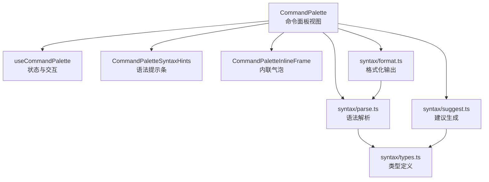
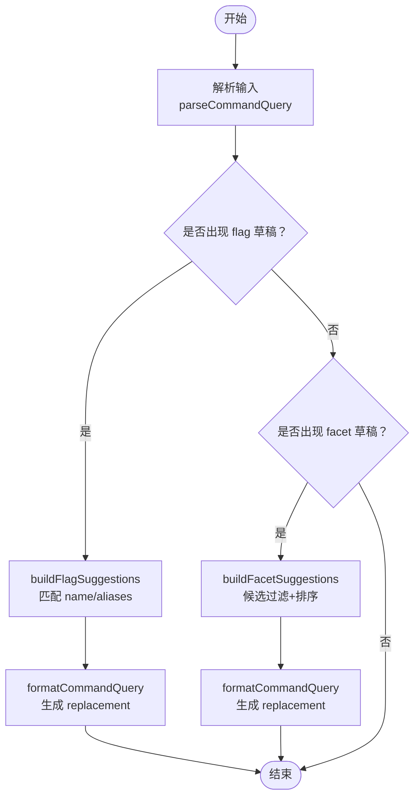
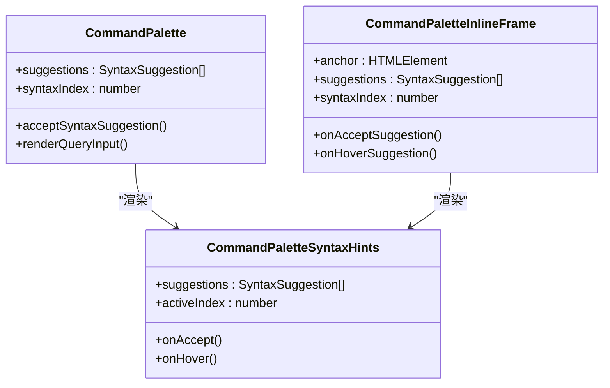
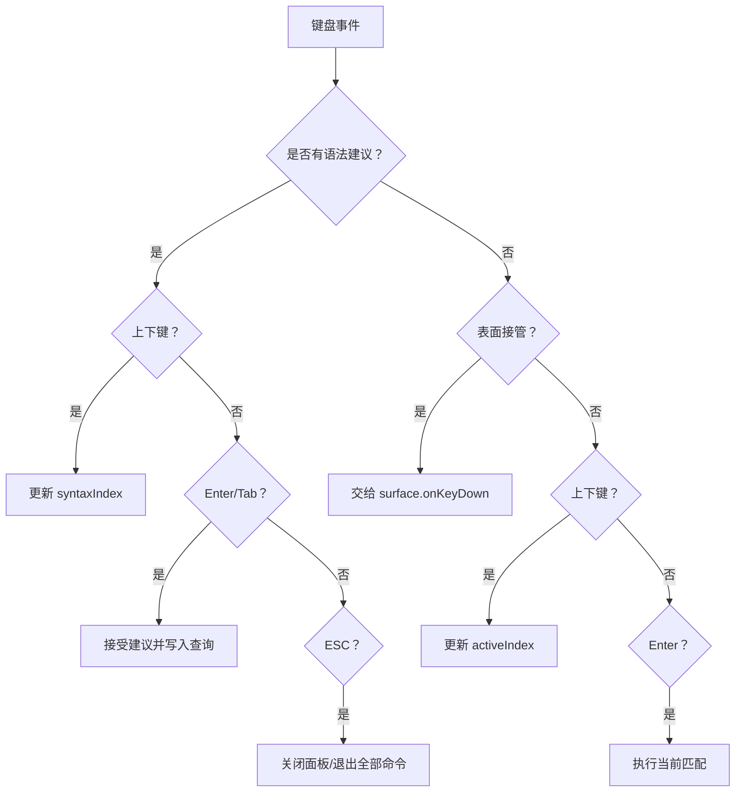
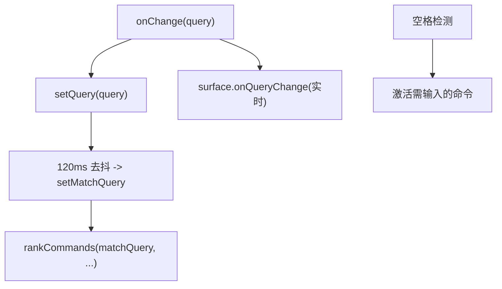
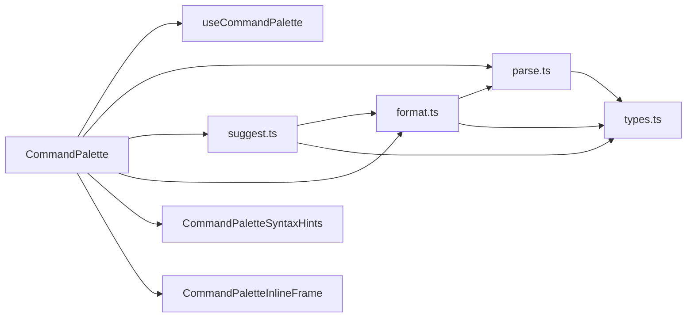

# 语法提示组件

<cite>
**本文引用的文件**   
- [CommandPalette.tsx](file://src/components/command-palette/CommandPalette.tsx)
- [useCommandPalette.ts](file://src/components/command-palette/useCommandPalette.ts)
- [CommandPaletteSyntaxHints.tsx](file://src/components/command-palette/CommandPaletteSyntaxHints.tsx)
- [CommandPaletteInlineFrame.tsx](file://src/components/command-palette/CommandPaletteInlineFrame.tsx)
- [types.ts（语法类型）](file://src/components/command-palette/syntax/types.ts)
- [parse.ts（语法解析）](file://src/components/command-palette/syntax/parse.ts)
- [suggest.ts（建议生成）](file://src/components/command-palette/syntax/suggest.ts)
- [format.ts（格式化工具）](file://src/components/command-palette/syntax/format.ts)
</cite>

## 目录
1. [引言](#引言)
2. [项目结构](#项目结构)
3. [核心组件](#核心组件)
4. [架构总览](#架构总览)
5. [详细组件分析](#详细组件分析)
6. [依赖关系分析](#依赖关系分析)
7. [性能考虑](#性能考虑)
8. [故障排查指南](#故障排查指南)
9. [结论](#结论)

## 引言
本文件面向“语法提示组件”，聚焦命令面板中的语法补全能力，包括：
- 语法建议生成：参数补全、选项提示与上下文感知。
- 建议列表渲染：高亮显示、分组组织与滚动支持。
- 键盘导航：上下选择、回车确认与 ESC 取消。
- 实时搜索：输入监听、过滤算法与性能优化。
- 主题适配与国际化支持。

该能力以“声明式语法规范”驱动，通过解析器、格式化器和建议生成器协作，为任意声明了语法的命令提供一致的 `--flag` 补全与 `@facet:value` 上下文体验。

## 项目结构
语法提示相关代码集中在命令面板模块中，采用“视图 + 状态钩子 + 语法工具层”的分层组织：
- 视图层
  - CommandPalette：全屏命令面板 UI，负责输入框、结果列表、语法提示条、内联框架等。
  - CommandPaletteSyntaxHints：语法提示条的纯展示组件。
  - CommandPaletteInlineFrame：将面板以“内联气泡”形式挂载到宿主元素上。
- 状态与交互层
  - useCommandPalette：管理打开/关闭、查询、匹配、执行、快捷键、IME 组合等。
- 语法工具层
  - syntax/types.ts：语法规范与解析结果的类型定义。
  - syntax/parse.ts：从用户输入解析出 flag、facet、自由文本等。
  - syntax/suggest.ts：根据规范与候选值生成补全建议。
  - syntax/format.ts：将结构化查询重新格式化为字符串，保证接受补全后不重复拼接。



**图表来源**
- [CommandPalette.tsx:133-162](file://src/components/command-palette/CommandPalette.tsx#L133-L162)
- [CommandPalette.tsx:482-490](file://src/components/command-palette/CommandPalette.tsx#L482-L490)
- [CommandPaletteInlineFrame.tsx:86-96](file://src/components/command-palette/CommandPaletteInlineFrame.tsx#L86-L96)
- [suggest.ts:43-112](file://src/components/command-palette/syntax/suggest.ts#L43-L112)
- [parse.ts:57-96](file://src/components/command-palette/syntax/parse.ts#L57-L96)
- [format.ts:12-54](file://src/components/command-palette/syntax/format.ts#L12-L54)
- [types.ts:5-39](file://src/components/command-palette/syntax/types.ts#L5-L39)

**章节来源**
- [CommandPalette.tsx:1-20](file://src/components/command-palette/CommandPalette.tsx#L1-L20)
- [CommandPaletteSyntaxHints.tsx:1-21](file://src/components/command-palette/CommandPaletteSyntaxHints.tsx#L1-L21)
- [CommandPaletteInlineFrame.tsx:1-35](file://src/components/command-palette/CommandPaletteInlineFrame.tsx#L1-L35)
- [useCommandPalette.ts:31-75](file://src/components/command-palette/useCommandPalette.ts#L31-L75)
- [types.ts:1-39](file://src/components/command-palette/syntax/types.ts#L1-L39)

## 核心组件
- CommandPalette：承载输入、键盘事件、结果列表、语法提示条和内联气泡；计算并维护语法建议列表及其选中索引。
- CommandPaletteSyntaxHints：渲染 `--flag` 提示行，支持高亮、别名展示、描述国际化与主题色。
- CommandPaletteInlineFrame：使用 Portal 将面板内容挂载到宿主元素，复用同一输入与语法提示逻辑。
- useCommandPalette：统一管理命令面板生命周期、查询去抖、匹配、执行、快捷键与 IME 组合输入。
- 语法工具层：
  - parse.ts：解析 `--flag @facet:value text` 方言，返回结构化查询。
  - suggest.ts：基于规范与候选值构建 flag/facet 建议。
  - format.ts：将结构化查询写回字符串，避免重复拼接。
  - types.ts：定义语法规范、解析结果与建议数据结构。

**章节来源**
- [CommandPalette.tsx:87-162](file://src/components/command-palette/CommandPalette.tsx#L87-L162)
- [CommandPaletteSyntaxHints.tsx:23-80](file://src/components/command-palette/CommandPaletteSyntaxHints.tsx#L23-L80)
- [CommandPaletteInlineFrame.tsx:37-115](file://src/components/command-palette/CommandPaletteInlineFrame.tsx#L37-L115)
- [useCommandPalette.ts:127-190](file://src/components/command-palette/useCommandPalette.ts#L127-L190)
- [parse.ts:57-96](file://src/components/command-palette/syntax/parse.ts#L57-L96)
- [suggest.ts:43-112](file://src/components/command-palette/syntax/suggest.ts#L43-L112)
- [format.ts:12-54](file://src/components/command-palette/syntax/format.ts#L12-L54)
- [types.ts:5-39](file://src/components/command-palette/syntax/types.ts#L5-L39)

## 架构总览
命令面板在用户输入时触发两条并行路径：
- 常规匹配路径：由 useCommandPalette 计算默认匹配或表面自定义匹配，用于命令列表。
- 语法提示路径：对当前命令的语法规范进行解析，生成 `--flag` 补全；若进入 facet 模式，则结合候选值生成 facet 补全。

```mermaid
sequenceDiagram
participant User as "用户"
participant Input as "输入框"
participant CP as "CommandPalette"
participant UCP as "useCommandPalette"
participant PAR as "parse.ts"
participant SUG as "suggest.ts"
participant View as "CommandPaletteSyntaxHints"
User->>Input : 键入 "--"
Input->>CP : onChange(query)
CP->>CP : useMemo(buildFlagSuggestions(parse(...)))
CP->>PAR : parseCommandQuery(spec, query)
PAR-->>CP : ParsedCommandQuery
CP->>SUG : buildFlagSuggestions(spec, parsed)
SUG-->>CP : SyntaxSuggestion[]
CP->>View : 渲染建议条(activeIndex, suggestions)
User->>View : 鼠标悬停/点击
View->>CP : onHover(index)/onAccept(suggestion)
CP->>UCP : onQueryCommit(replacement)
```

**图表来源**
- [CommandPalette.tsx:133-162](file://src/components/command-palette/CommandPalette.tsx#L133-L162)
- [CommandPalette.tsx:482-490](file://src/components/command-palette/CommandPalette.tsx#L482-L490)
- [parse.ts:57-96](file://src/components/command-palette/syntax/parse.ts#L57-L96)
- [suggest.ts:43-68](file://src/components/command-palette/syntax/suggest.ts#L43-L68)

## 详细组件分析

### 语法建议生成：参数补全、选项提示与上下文感知
- 参数补全（flag）
  - 当用户输入 `--` 开头或结尾的片段时，parse.ts 会识别 flag 前缀或后缀，并返回 flagDraft（未解析的拼写）或 flag（已解析的名称）。
  - suggest.ts 根据 spec.flags 过滤匹配的 flag 名称与其别名，生成 SyntaxSuggestion，replacement 通过 format.ts 重组查询，确保接受补全后不会重复拼接。
- 选项提示（facet）
  - 当用户输入 `@` 或 `@kind:` 时，parse.ts 提取 facetKind、facetValue、facetDraft 与 isBareFacet。
  - suggest.ts 接收调用方提供的候选集合（按 kind 分组），优先显示 isPreferred 项，并按前缀匹配、权重排序，限制数量。
- 上下文感知
  - 命令可声明 syntax.spec，包含 flags 与 facets。只有声明了 syntax 的命令才会启用语法提示。
  - 对于网格过滤命令，仅在网格语法可用时才显示 flag 提示，避免误完成。



**图表来源**
- [parse.ts:57-96](file://src/components/command-palette/syntax/parse.ts#L57-L96)
- [suggest.ts:43-112](file://src/components/command-palette/syntax/suggest.ts#L43-L112)
- [format.ts:12-26](file://src/components/command-palette/syntax/format.ts#L12-L26)

**章节来源**
- [types.ts:5-39](file://src/components/command-palette/syntax/types.ts#L5-L39)
- [parse.ts:10-55](file://src/components/command-palette/syntax/parse.ts#L10-L55)
- [parse.ts:57-96](file://src/components/command-palette/syntax/parse.ts#L57-L96)
- [suggest.ts:43-112](file://src/components/command-palette/syntax/suggest.ts#L43-L112)
- [format.ts:12-54](file://src/components/command-palette/syntax/format.ts#L12-L54)

### 建议列表渲染：高亮显示、分组组织与滚动支持
- 高亮显示
  - CommandPaletteSyntaxHints 根据 activeIndex 判断当前项，使用主题 accentColor 高亮 flag 文本，并根据 isDaylight 切换背景透明度。
  - 非活动项提供 hover 态，提升可发现性。
- 分组组织
  - 提示条顶部显示“Options”标题（国际化 key），每项展示 flag、可选 descriptionKey 与 aliases。
- 滚动支持
  - 主面板主体区域使用 overflow-y-auto 实现滚动；语法提示条位于滚动容器内部，随列表滚动。
  - 内联气泡同样包裹语法提示条，保持与全屏面板一致的交互。



**图表来源**
- [CommandPalette.tsx:133-162](file://src/components/command-palette/CommandPalette.tsx#L133-L162)
- [CommandPalette.tsx:482-490](file://src/components/command-palette/CommandPalette.tsx#L482-L490)
- [CommandPaletteSyntaxHints.tsx:23-80](file://src/components/command-palette/CommandPaletteSyntaxHints.tsx#L23-L80)
- [CommandPaletteInlineFrame.tsx:86-96](file://src/components/command-palette/CommandPaletteInlineFrame.tsx#L86-L96)

**章节来源**
- [CommandPaletteSyntaxHints.tsx:36-77](file://src/components/command-palette/CommandPaletteSyntaxHints.tsx#L36-L77)
- [CommandPalette.tsx:477-490](file://src/components/command-palette/CommandPalette.tsx#L477-L490)
- [CommandPaletteInlineFrame.tsx:86-109](file://src/components/command-palette/CommandPaletteInlineFrame.tsx#L86-L109)

### 键盘导航：上下选择、回车确认与 ESC 取消
- 语法提示条优先级
  - 当存在语法建议时，箭头键控制 syntaxIndex，Enter/Tab 接受当前建议，ESC 关闭面板或退出“全部命令”视图。
- 常规列表导航
  - 无语法建议时，ArrowDown/ArrowUp 移动 activeIndex，Enter 执行当前匹配。
- 组合输入保护
  - 在 IME 组合期间（isComposing 或 event.isComposing），忽略普通按键，避免破坏中文输入。
- 焦点管理
  - 接受建议后，使用 requestAnimationFrame 恢复输入框焦点，保证后续输入流畅。



**图表来源**
- [CommandPalette.tsx:276-357](file://src/components/command-palette/CommandPalette.tsx#L276-L357)
- [CommandPalette.tsx:159-162](file://src/components/command-palette/CommandPalette.tsx#L159-L162)

**章节来源**
- [CommandPalette.tsx:276-357](file://src/components/command-palette/CommandPalette.tsx#L276-L357)
- [CommandPalette.tsx:159-162](file://src/components/command-palette/CommandPalette.tsx#L159-L162)

### 实时搜索：输入监听、过滤算法与性能优化
- 输入监听
  - 输入框 onChange 触发 onQueryChange，同时重置“全部命令”视图与 activeIndex。
  - compositionStart/compositionEnd 处理 IME 组合输入，避免中间态干扰匹配。
- 过滤算法
  - useCommandPalette 维护 query（实时）与 matchQuery（去抖后），默认匹配基于 matchQuery 计算，减少频繁扫描。
  - 对于需要输入的指令，支持空格转 pill 的即时激活，并通过搜索索引快速定位。
- 性能优化
  - 语法建议基于 live query 计算，避免延迟感；但常规匹配使用 120ms 去抖。
  - enabledCommands 与 defaultMatches 使用 memo 与引用稳定性，避免每次播放进度刷新导致全量重排。
  - 预览计算限定在 MAX_COMMAND_MATCHES 范围内，降低上下文变化带来的开销。



**图表来源**
- [useCommandPalette.ts:435-467](file://src/components/command-palette/useCommandPalette.ts#L435-L467)
- [useCommandPalette.ts:141-190](file://src/components/command-palette/useCommandPalette.ts#L141-L190)
- [CommandPalette.tsx:181-210](file://src/components/command-palette/CommandPalette.tsx#L181-L210)

**章节来源**
- [useCommandPalette.ts:127-190](file://src/components/command-palette/useCommandPalette.ts#L127-L190)
- [useCommandPalette.ts:435-467](file://src/components/command-palette/useCommandPalette.ts#L435-L467)
- [CommandPalette.tsx:181-210](file://src/components/command-palette/CommandPalette.tsx#L181-L210)

### 主题适配与国际化支持
- 主题适配
  - 高亮颜色使用 theme.accentColor。
  - 明暗模式通过 isDaylight 切换背景透明度与边框颜色，面板整体使用 backdrop-blur 与玻璃质感。
- 国际化
  - 所有用户可见文案通过 t(key, options) 获取，如“Options”、占位符、按钮标签等。
  - 语法提示的描述字段支持 descriptionKey 与 descriptionFallback，便于多语言扩展。

**章节来源**
- [CommandPaletteSyntaxHints.tsx:38-73](file://src/components/command-palette/CommandPaletteSyntaxHints.tsx#L38-L73)
- [CommandPalette.tsx:225-232](file://src/components/command-palette/CommandPalette.tsx#L225-L232)
- [CommandPalette.tsx:414-421](file://src/components/command-palette/CommandPalette.tsx#L414-L421)

## 依赖关系分析
- CommandPalette 依赖：
  - useCommandPalette：提供 isOpen、query、matches、execute 等状态与方法。
  - syntax/parse.ts：解析当前命令的语法输入。
  - syntax/suggest.ts：生成 flag/facet 建议。
  - syntax/format.ts：将建议替换写回查询。
  - CommandPaletteSyntaxHints：渲染语法提示条。
  - CommandPaletteInlineFrame：内联气泡渲染。
- 语法工具层内部依赖：
  - suggest.ts 依赖 format.ts 与 types.ts。
  - parse.ts 依赖 types.ts。
  - format.ts 依赖 parse.ts 与 types.ts。



**图表来源**
- [CommandPalette.tsx:1-20](file://src/components/command-palette/CommandPalette.tsx#L1-L20)
- [CommandPalette.tsx:133-162](file://src/components/command-palette/CommandPalette.tsx#L133-L162)
- [suggest.ts:1-2](file://src/components/command-palette/syntax/suggest.ts#L1-L2)
- [parse.ts:1-2](file://src/components/command-palette/syntax/parse.ts#L1-L2)
- [format.ts:1-2](file://src/components/command-palette/syntax/format.ts#L1-L2)

**章节来源**
- [CommandPalette.tsx:1-20](file://src/components/command-palette/CommandPalette.tsx#L1-L20)
- [suggest.ts:1-2](file://src/components/command-palette/syntax/suggest.ts#L1-L2)
- [parse.ts:1-2](file://src/components/command-palette/syntax/parse.ts#L1-L2)
- [format.ts:1-2](file://src/components/command-palette/syntax/format.ts#L1-L2)

## 性能考虑
- 语法建议实时计算：为避免补全滞后，语法建议基于实时 query 计算，但仅在当前命令声明语法且语法可用时生效。
- 常规匹配去抖：matchQuery 使用 120ms 去抖，减少频繁扫描命令注册表。
- 稳定引用：enabledCommands 与 defaultMatches 使用 memo 与引用比较，避免无关状态（如播放进度）触发全量重排。
- 预览计算范围受限：预览只在匹配结果范围内计算，避免大列表下的额外开销。
- 输入焦点优化：接受建议后使用 requestAnimationFrame 恢复焦点，避免 iOS Safari 滚动问题。

[本节为通用性能指导，不直接分析具体文件]

## 故障排查指南
- 语法提示不出现
  - 检查命令是否声明了 syntax.spec。
  - 对于网格过滤命令，确认网格语法是否可用。
- 补全后文本重复
  - 确认 replacement 通过 formatCommandQuery 生成，避免手动拼接。
- 键盘冲突
  - 确认 IME 组合期间未触发普通按键逻辑。
  - 确认 surface.onKeyDown 未拦截语法提示条的键盘事件。
- 主题或文案异常
  - 检查 theme.accentColor 与 i18n key 是否正确传入。

**章节来源**
- [CommandPalette.tsx:133-162](file://src/components/command-palette/CommandPalette.tsx#L133-L162)
- [CommandPalette.tsx:276-357](file://src/components/command-palette/CommandPalette.tsx#L276-L357)
- [CommandPaletteSyntaxHints.tsx:38-73](file://src/components/command-palette/CommandPaletteSyntaxHints.tsx#L38-L73)

## 结论
语法提示组件通过声明式语法规范、解析器、格式化器与建议生成器的协作，为命令面板提供了统一的参数补全与上下文感知体验。其渲染层支持高亮、分组与滚动，键盘导航覆盖上下选择、回车确认与 ESC 取消，实时搜索兼顾响应性与性能。主题与国际化贯穿始终，确保在不同环境与语言下保持一致的用户体验。