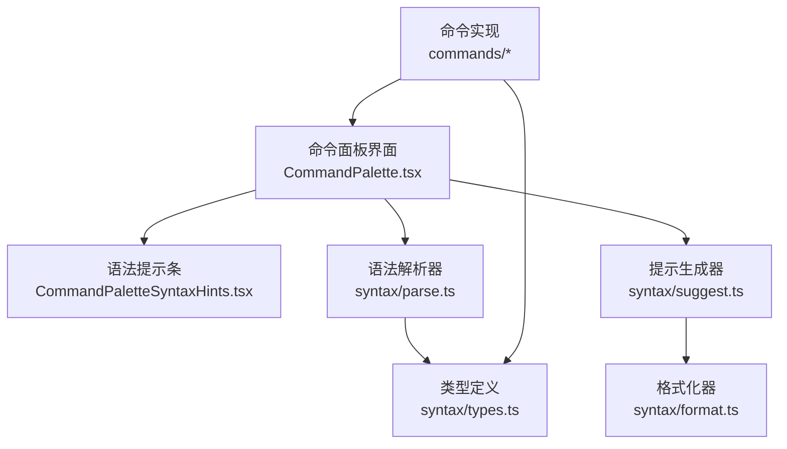
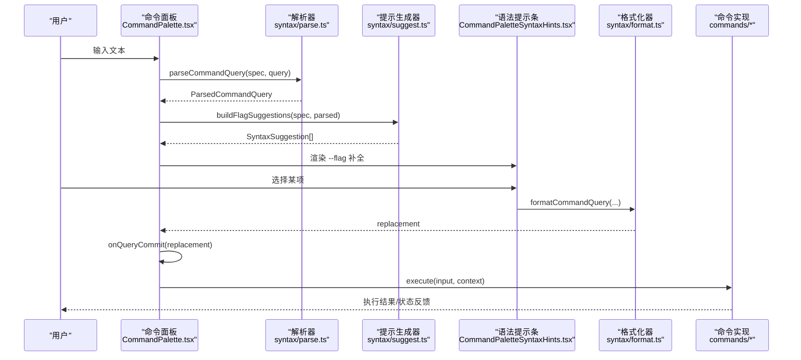
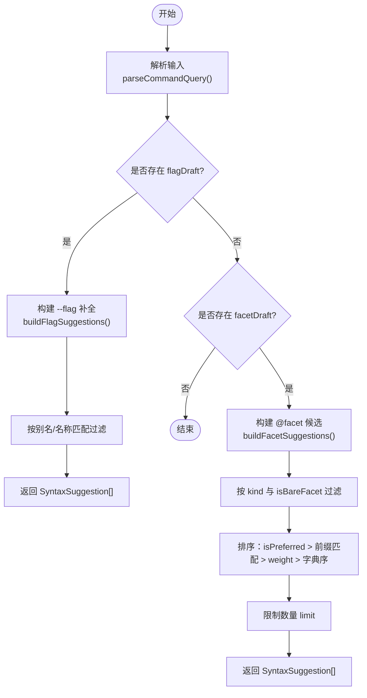
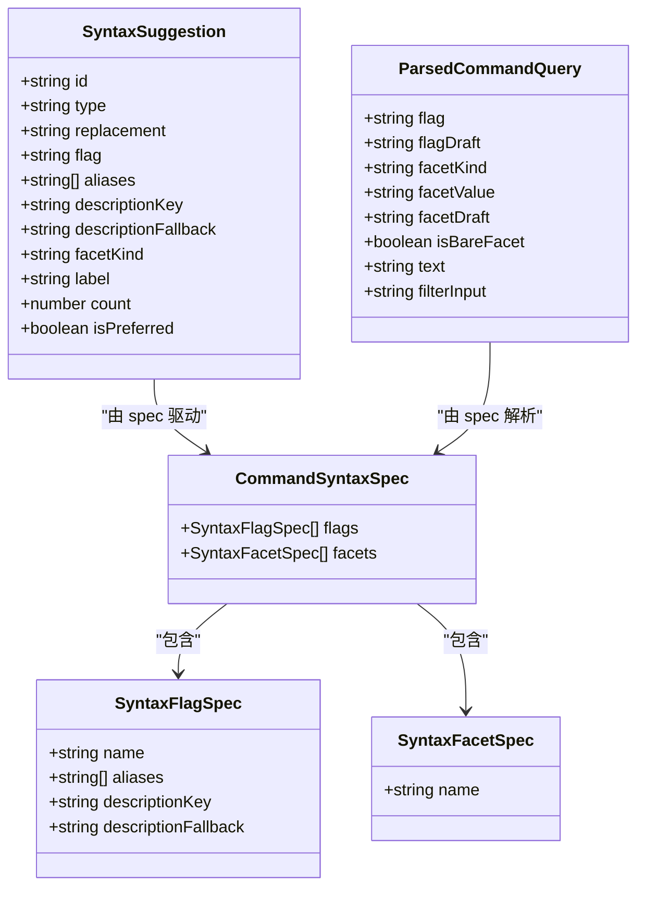
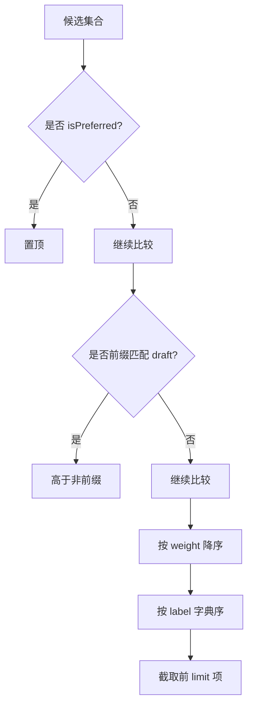
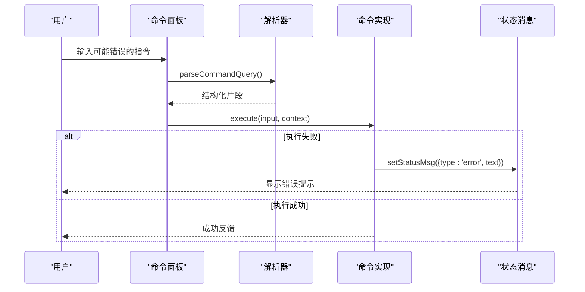
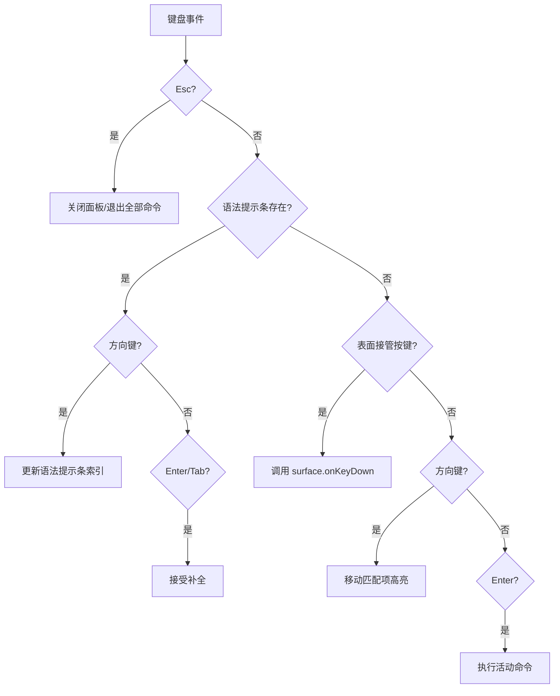
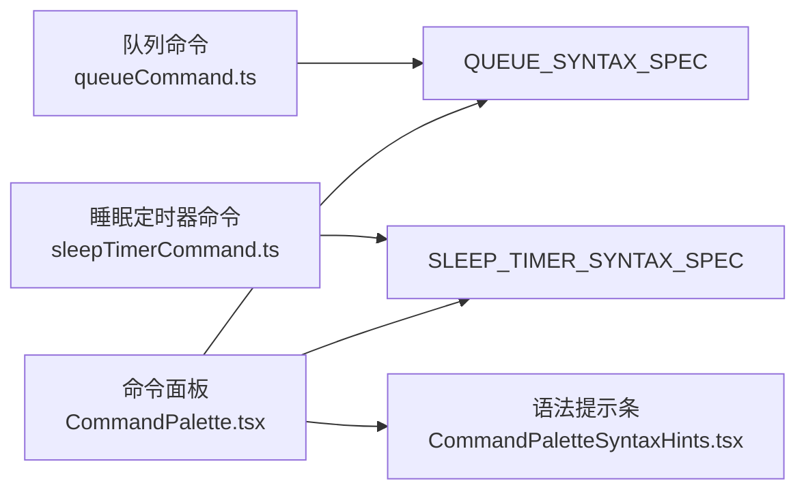
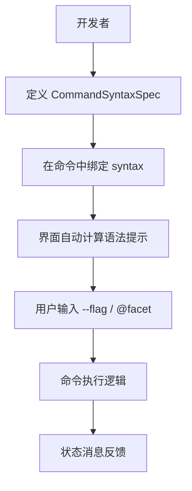

# 智能提示器

<cite>
**本文引用的文件**   
- [CommandPalette.tsx](file://src/components/command-palette/CommandPalette.tsx)
- [CommandPaletteSyntaxHints.tsx](file://src/components/command-palette/CommandPaletteSyntaxHints.tsx)
- [suggest.ts](file://src/components/command-palette/syntax/suggest.ts)
- [parse.ts](file://src/components/command-palette/syntax/parse.ts)
- [format.ts](file://src/components/command-palette/syntax/format.ts)
- [types.ts](file://src/components/command-palette/syntax/types.ts)
- [queueCommand.ts](file://src/components/command-palette/commands/queueCommand.ts)
- [sleepTimerCommand.ts](file://src/components/command-palette/commands/sleepTimerCommand.ts)
- [useCommandPalette.ts](file://src/components/command-palette/useCommandPalette.ts)
</cite>

## 目录
1. [简介](#简介)
2. [项目结构](#项目结构)
3. [核心组件](#核心组件)
4. [架构总览](#架构总览)
5. [详细组件分析](#详细组件分析)
6. [依赖关系分析](#依赖关系分析)
7. [性能考量](#性能考量)
8. [故障排查指南](#故障排查指南)
9. [结论](#结论)
10. [附录：提示 API 与集成示例](#附录提示-api-与集成示例)

## 简介
本文件面向“命令语法智能提示系统”，聚焦命令面板中的上下文感知补全、语法环境识别、历史使用模式、排序过滤机制、实时验证与修复建议，以及键盘导航和无障碍访问能力。该系统以“命令 + 语法规范”为核心：命令声明自身可用的标志位（--flag）和维度（@facet），解析器将用户输入切分为结构化片段，提示生成器据此产出可接受的补全项，界面层负责渲染、键盘导航与无障碍属性。

## 项目结构
命令提示系统位于命令面板模块中，关键路径如下：
- 语法定义与解析：syntax/*
- 提示生成：syntax/suggest.ts
- 主界面与交互：CommandPalette.tsx、CommandPaletteSyntaxHints.tsx
- 命令注册与语法绑定：commands/*（例如队列、睡眠定时器）
- 匹配与评分：useCommandPalette.ts

**图表来源** 
- [CommandPalette.tsx:133-146](file://src/components/command-palette/CommandPalette.tsx#L133-L146)
- [CommandPaletteSyntaxHints.tsx:1-83](file://src/components/command-palette/CommandPaletteSyntaxHints.tsx#L1-L83)
- [suggest.ts:1-113](file://src/components/command-palette/syntax/suggest.ts#L1-L113)
- [parse.ts:1-97](file://src/components/command-palette/syntax/parse.ts#L1-L97)
- [format.ts:1-55](file://src/components/command-palette/syntax/format.ts#L1-L55)
- [types.ts:1-40](file://src/components/command-palette/syntax/types.ts#L1-L40)
- [queueCommand.ts:1-39](file://src/components/command-palette/commands/queueCommand.ts#L1-L39)
- [sleepTimerCommand.ts:1-49](file://src/components/command-palette/commands/sleepTimerCommand.ts#L1-L49)

**章节来源**
- [CommandPalette.tsx:1-602](file://src/components/command-palette/CommandPalette.tsx#L1-L602)
- [CommandPaletteSyntaxHints.tsx:1-83](file://src/components/command-palette/CommandPaletteSyntaxHints.tsx#L1-L83)
- [suggest.ts:1-113](file://src/components/command-palette/syntax/suggest.ts#L1-L113)
- [parse.ts:1-97](file://src/components/command-palette/syntax/parse.ts#L1-L97)
- [format.ts:1-55](file://src/components/command-palette/syntax/format.ts#L1-L55)
- [types.ts:1-40](file://src/components/command-palette/syntax/types.ts#L1-L40)
- [queueCommand.ts:1-39](file://src/components/command-palette/commands/queueCommand.ts#L1-L39)
- [sleepTimerCommand.ts:1-49](file://src/components/command-palette/commands/sleepTimerCommand.ts#L1-L49)

## 核心组件
- 命令面板主界面：负责输入框、列表、语法提示条、键盘事件处理、无障碍属性设置、内联滤镜场景等。
- 语法提示条：展示 --flag 补全项，支持鼠标悬停与点击接受。
- 语法解析器：将用户输入解析为 flag、facet、自由文本等结构化片段。
- 提示生成器：根据解析结果与命令的语法规范，生成标志位与维度候选项。
- 格式化器：将结构化查询重新格式化为稳定文本，用于补全替换。
- 命令实现：声明命令标题、分组、图标、可用条件、语法规范、占位符、预览与执行逻辑。

**章节来源**
- [CommandPalette.tsx:1-602](file://src/components/command-palette/CommandPalette.tsx#L1-L602)
- [CommandPaletteSyntaxHints.tsx:1-83](file://src/components/command-palette/CommandPaletteSyntaxHints.tsx#L1-L83)
- [suggest.ts:1-113](file://src/components/command-palette/syntax/suggest.ts#L1-L113)
- [parse.ts:1-97](file://src/components/command-palette/syntax/parse.ts#L1-L97)
- [format.ts:1-55](file://src/components/command-palette/syntax/format.ts#L1-L55)
- [types.ts:1-40](file://src/components/command-palette/syntax/types.ts#L1-L40)
- [queueCommand.ts:1-39](file://src/components/command-palette/commands/queueCommand.ts#L1-L39)
- [sleepTimerCommand.ts:1-49](file://src/components/command-palette/commands/sleepTimerCommand.ts#L1-L49)

## 架构总览
命令面板在打开时聚焦输入框；用户输入触发解析与提示生成；当检测到半输入的 --flag 时，显示语法提示条；用户通过键盘或鼠标选择后，格式化器重写输入文本；随后由命令执行逻辑完成业务动作。

**图表来源** 
- [CommandPalette.tsx:133-146](file://src/components/command-palette/CommandPalette.tsx#L133-L146)
- [CommandPalette.tsx:159-162](file://src/components/command-palette/CommandPalette.tsx#L159-L162)
- [CommandPalette.tsx:311-327](file://src/components/command-palette/CommandPalette.tsx#L311-L327)
- [CommandPaletteSyntaxHints.tsx:42-76](file://src/components/command-palette/CommandPaletteSyntaxHints.tsx#L42-L76)
- [suggest.ts:43-69](file://src/components/command-palette/syntax/suggest.ts#L43-L69)
- [format.ts:12-26](file://src/components/command-palette/syntax/format.ts#L12-L26)
- [queueCommand.ts:15-39](file://src/components/command-palette/commands/queueCommand.ts#L15-L39)
- [sleepTimerCommand.ts:27-47](file://src/components/command-palette/commands/sleepTimerCommand.ts#L27-L47)

## 详细组件分析

### 上下文感知补全算法
- 光标位置分析与语法环境识别
  - 解析器从用户输入中提取已解析的标志位、未解析的标志草稿、维度种类与值、自由文本等字段，并区分显式 @kind:value 与简写 @draft。
  - 当存在 flagDraft 或 facetDraft 时，提示生成器进入对应分支，分别生成 --flag 补全或 @facet 候选。
- 历史使用模式
  - 维度候选支持 isPreferred 标记，优先展示当前播放歌曲相关艺术家等“偏好项”。
  - 命令匹配评分在 useCommandPalette.ts 中体现，活跃命令默认高分，其他命令按索引递减，便于快速定位常用命令。

**图表来源** 
- [parse.ts:57-96](file://src/components/command-palette/syntax/parse.ts#L57-L96)
- [suggest.ts:43-69](file://src/components/command-palette/syntax/suggest.ts#L43-L69)
- [suggest.ts:71-112](file://src/components/command-palette/syntax/suggest.ts#L71-L112)
- [useCommandPalette.ts:151-174](file://src/components/command-palette/useCommandPalette.ts#L151-L174)

**章节来源**
- [parse.ts:1-97](file://src/components/command-palette/syntax/parse.ts#L1-L97)
- [suggest.ts:1-113](file://src/components/command-palette/syntax/suggest.ts#L1-L113)
- [useCommandPalette.ts:151-174](file://src/components/command-palette/useCommandPalette.ts#L151-L174)

### 提示生成策略
- 关键字建议（--flag）
  - 基于命令语法规范中的 flags 列表，匹配用户已输入的 flagDraft 或其别名，生成 replacement 文本。
  - 支持 descriptionKey/descriptionFallback 提供描述文案，并在提示条中展示别名。
- 参数值预测（@facet）
  - 接收命令提供的候选集，按 kind 筛选，支持 isPreferred 优先展示。
  - 对 isBareFacet（仅输入 @）只展示首选候选；否则按包含 draft 的标签进行过滤。
- 类型推断
  - 解析器支持带引号的 facetValue，允许空格与转义字符；格式化器在输出时对含空格或引号的内容进行 JSON.stringify 包装，保证回写稳定性。

**图表来源** 
- [types.ts:5-40](file://src/components/command-palette/syntax/types.ts#L5-L40)
- [suggest.ts:9-32](file://src/components/command-palette/syntax/suggest.ts#L9-L32)
- [parse.ts:57-96](file://src/components/command-palette/syntax/parse.ts#L57-L96)

**章节来源**
- [types.ts:1-40](file://src/components/command-palette/syntax/types.ts#L1-L40)
- [suggest.ts:1-113](file://src/components/command-palette/syntax/suggest.ts#L1-L113)
- [parse.ts:1-97](file://src/components/command-palette/syntax/parse.ts#L1-L97)

### 排序与过滤机制
- 相关性评分
  - 命令匹配评分：活跃命令固定高分，其余命令按索引递减，确保常用命令靠前。
  - 维度候选排序：优先 isPreferred，其次前缀匹配，再按 weight 降序，最后按字典序。
- 频率统计与用户偏好学习
  - 当前代码未直接实现持久化频率统计；但可通过 isPreferred 与外部数据源注入权重，形成“偏好项”效果。
  - 可在未来扩展：记录用户选择次数，动态调整 weight 或 isPreferred。

**图表来源** 
- [suggest.ts:88-97](file://src/components/command-palette/syntax/suggest.ts#L88-L97)
- [useCommandPalette.ts:151-174](file://src/components/command-palette/useCommandPalette.ts#L151-L174)

**章节来源**
- [suggest.ts:71-112](file://src/components/command-palette/syntax/suggest.ts#L71-L112)
- [useCommandPalette.ts:151-174](file://src/components/command-palette/useCommandPalette.ts#L151-L174)

### 实时验证功能
- 语法检查
  - 解析器严格识别 --flag 与 @facet 语法，支持别名与引号值；无效输入不会错误地解析为合法 token。
- 错误预警
  - 命令执行失败时，通过 setStatusMsg 向用户展示错误信息（如睡眠定时器配置错误）。
- 修复建议
  - 语法提示条提供 --flag 补全，避免拼写错误；格式化器保证补全后的文本可被再次解析。

**图表来源** 
- [sleepTimerCommand.ts:27-47](file://src/components/command-palette/commands/sleepTimerCommand.ts#L27-L47)
- [parse.ts:57-96](file://src/components/command-palette/syntax/parse.ts#L57-L96)

**章节来源**
- [sleepTimerCommand.ts:1-49](file://src/components/command-palette/commands/sleepTimerCommand.ts#L1-L49)
- [parse.ts:1-97](file://src/components/command-palette/syntax/parse.ts#L1-L97)

### 键盘导航与无障碍访问
- 键盘导航
  - Esc：关闭面板或退出“全部命令”视图；若表面有自定义 onEscape，则优先处理。
  - 方向键：上下移动高亮项；当语法提示条存在时，方向键控制语法提示条的高亮。
  - Enter/Tab：接受语法提示条补全；若无语法提示条，Enter 执行当前活动命令。
  - Backspace：清空输入并回到首个关键词，便于切换命令。
- 无障碍访问
  - 输入框 role="combobox"，aria-autocomplete="list"，aria-expanded 随匹配列表变化。
  - 按钮具备 aria-label 与 title，提升屏幕阅读器体验。

**图表来源** 
- [CommandPalette.tsx:276-357](file://src/components/command-palette/CommandPalette.tsx#L276-L357)
- [CommandPalette.tsx:202-206](file://src/components/command-palette/CommandPalette.tsx#L202-L206)

**章节来源**
- [CommandPalette.tsx:276-357](file://src/components/command-palette/CommandPalette.tsx#L276-L357)
- [CommandPalette.tsx:202-206](file://src/components/command-palette/CommandPalette.tsx#L202-L206)

## 依赖关系分析
- 命令与语法规范的绑定
  - queueCommand 声明 QUEUE_SYNTAX_SPEC，并挂载 queueSurface。
  - sleepTimerCommand 声明 SLEEP_TIMER_SYNTAX_SPEC，并挂载 sleepTimerSurface。
- 界面与语法层的耦合
  - CommandPalette 在 activeCommand 存在且声明 syntax 时，计算语法提示；当 FILTER_VIEW_COMMAND_ID 且网格过滤器不可用时，隐藏语法提示。
  - CommandPaletteSyntaxHints 仅负责渲染 SyntaxSuggestion[]，不关心具体命令。

**图表来源** 
- [queueCommand.ts:15-39](file://src/components/command-palette/commands/queueCommand.ts#L15-L39)
- [sleepTimerCommand.ts:9-49](file://src/components/command-palette/commands/sleepTimerCommand.ts#L9-L49)
- [CommandPalette.tsx:133-146](file://src/components/command-palette/CommandPalette.tsx#L133-L146)
- [CommandPaletteSyntaxHints.tsx:1-83](file://src/components/command-palette/CommandPaletteSyntaxHints.tsx#L1-L83)

**章节来源**
- [queueCommand.ts:1-39](file://src/components/command-palette/commands/queueCommand.ts#L1-L39)
- [sleepTimerCommand.ts:1-49](file://src/components/command-palette/commands/sleepTimerCommand.ts#L1-L49)
- [CommandPalette.tsx:133-146](file://src/components/command-palette/CommandPalette.tsx#L133-L146)
- [CommandPaletteSyntaxHints.tsx:1-83](file://src/components/command-palette/CommandPaletteSyntaxHints.tsx#L1-L83)

## 性能考量
- 即时性
  - 语法提示条基于实时 query 而非防抖后的 matchQuery，避免补全列表滞后导致的不一致感。
- 渲染优化
  - 语法提示条仅在 activeCommand 声明 syntax 且满足条件时生成；FILTER_VIEW_COMMAND_ID 在网格过滤器不可用时隐藏，减少无意义计算。
- 内存与缓存
  - 表面组件使用 WeakMap 缓存 React.lazy 组件，避免重复加载。
- 输入处理
  - 输入法组合期间忽略键盘事件，避免 IME 输入干扰。

**章节来源**
- [CommandPalette.tsx:133-146](file://src/components/command-palette/CommandPalette.tsx#L133-L146)
- [CommandPalette.tsx:298-300](file://src/components/command-palette/CommandPalette.tsx#L298-L300)
- [CommandPalette.tsx:51-67](file://src/components/command-palette/CommandPalette.tsx#L51-L67)

## 故障排查指南
- 问题：输入 --on 无法补全
  - 原因：命令未声明该 flag 或未正确绑定语法规范。
  - 解决：在命令中声明对应的 syntax 与 flags，并确保别名与名称一致。
- 问题：语法提示条不出现
  - 原因：activeCommand 未声明 syntax，或 FILTER_VIEW_COMMAND_ID 且网格过滤器不可用。
  - 解决：确认命令语法规范已绑定，或启用网格过滤器。
- 问题：执行失败无反馈
  - 原因：命令执行未调用 setStatusMsg。
  - 解决：在 execute 失败分支添加 setStatusMsg({type:'error', text})。

**章节来源**
- [CommandPalette.tsx:133-146](file://src/components/command-palette/CommandPalette.tsx#L133-L146)
- [sleepTimerCommand.ts:27-47](file://src/components/command-palette/commands/sleepTimerCommand.ts#L27-L47)

## 结论
命令语法智能提示系统通过“命令 + 语法规范”解耦了业务与提示逻辑，解析器与格式化器保证了输入的稳定性与可逆性，提示生成器依据规范与候选集产出高质量补全，界面层提供流畅的键盘导航与无障碍支持。未来可扩展频率统计与用户偏好学习，进一步提升排序的相关性与个性化。

## 附录：提示 API 与集成示例
- 语法类型与规范
  - SyntaxFlagSpec：标志位定义，包含名称、别名与描述。
  - SyntaxFacetSpec：维度定义，包含名称。
  - CommandSyntaxSpec：命令语法规范，聚合 flags 与 facets。
  - ParsedCommandQuery：解析结果，包含 flag、flagDraft、facetKind、facetValue、facetDraft、isBareFacet、text、filterInput。
- 解析与格式化
  - parseCommandQuery(spec, input)：将输入解析为结构化片段。
  - formatCommandQuery({flag, facetKind, facetValue, text})：将结构化片段格式化为文本。
  - replaceCommandFlag(spec, input, flag)：替换标志位。
  - replaceCommandFacet(spec, input, facetKind, facetValue)：替换维度。
- 提示生成
  - buildFlagSuggestions(spec, parsed)：生成 --flag 补全。
  - buildFacetSuggestions(parsed, candidates, limit)：生成 @facet 候选。
- 集成步骤
  - 在命令中声明 syntax 与 surface。
  - 在命令的 placeholder 与 getPreview 中结合解析结果提供友好提示。
  - 在 execute 中解析输入并执行业务逻辑，失败时通过 setStatusMsg 反馈错误。

**图表来源** 
- [types.ts:5-40](file://src/components/command-palette/syntax/types.ts#L5-L40)
- [parse.ts:57-96](file://src/components/command-palette/syntax/parse.ts#L57-L96)
- [format.ts:12-55](file://src/components/command-palette/syntax/format.ts#L12-L55)
- [suggest.ts:43-112](file://src/components/command-palette/syntax/suggest.ts#L43-L112)
- [queueCommand.ts:15-39](file://src/components/command-palette/commands/queueCommand.ts#L15-L39)
- [sleepTimerCommand.ts:9-49](file://src/components/command-palette/commands/sleepTimerCommand.ts#L9-L49)

**章节来源**
- [types.ts:1-40](file://src/components/command-palette/syntax/types.ts#L1-L40)
- [parse.ts:1-97](file://src/components/command-palette/syntax/parse.ts#L1-L97)
- [format.ts:1-55](file://src/components/command-palette/syntax/format.ts#L1-L55)
- [suggest.ts:1-113](file://src/components/command-palette/syntax/suggest.ts#L1-L113)
- [queueCommand.ts:1-39](file://src/components/command-palette/commands/queueCommand.ts#L1-L39)
- [sleepTimerCommand.ts:1-49](file://src/components/command-palette/commands/sleepTimerCommand.ts#L1-L49)